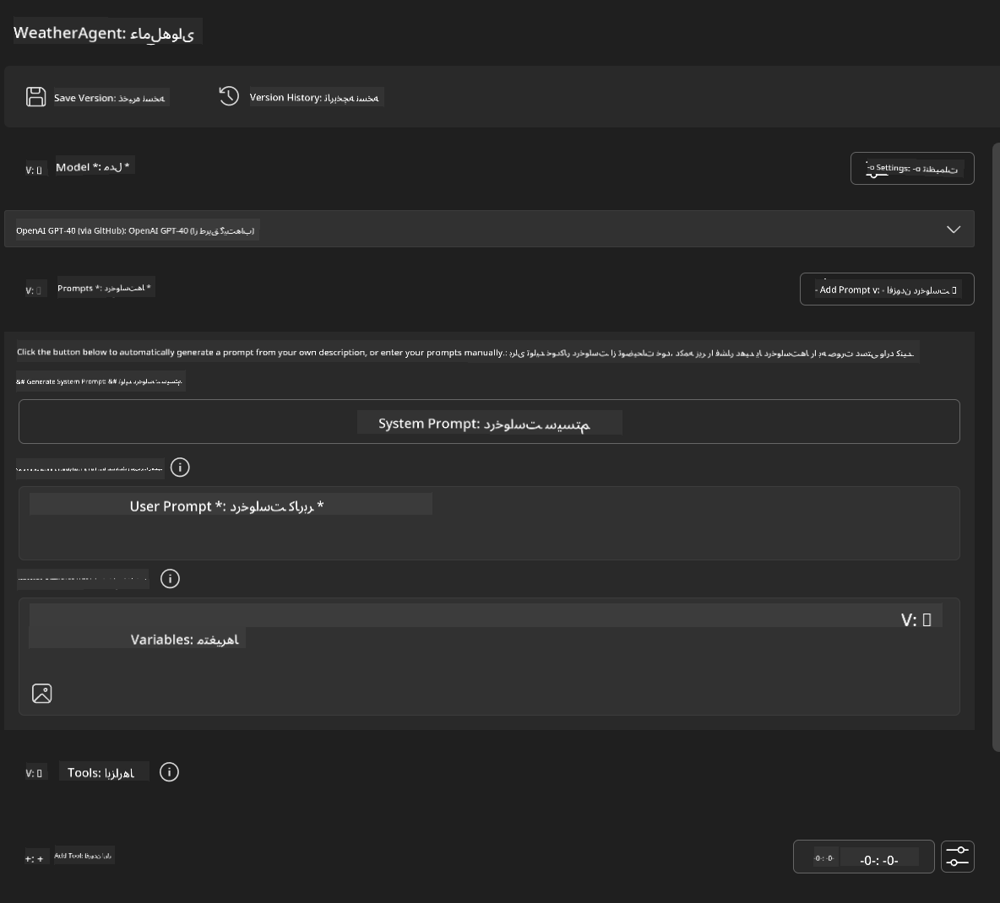
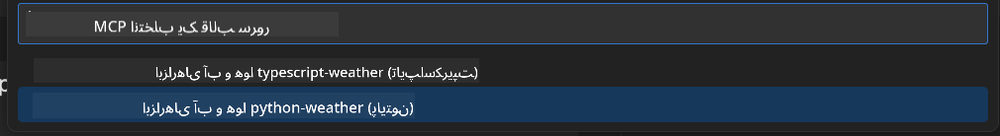
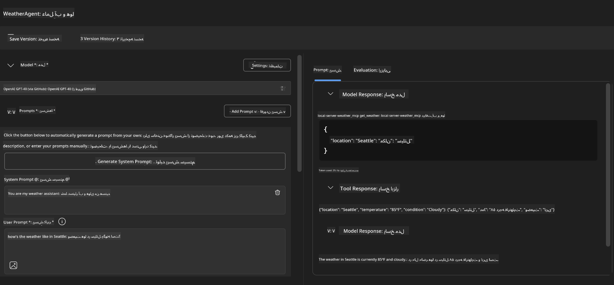
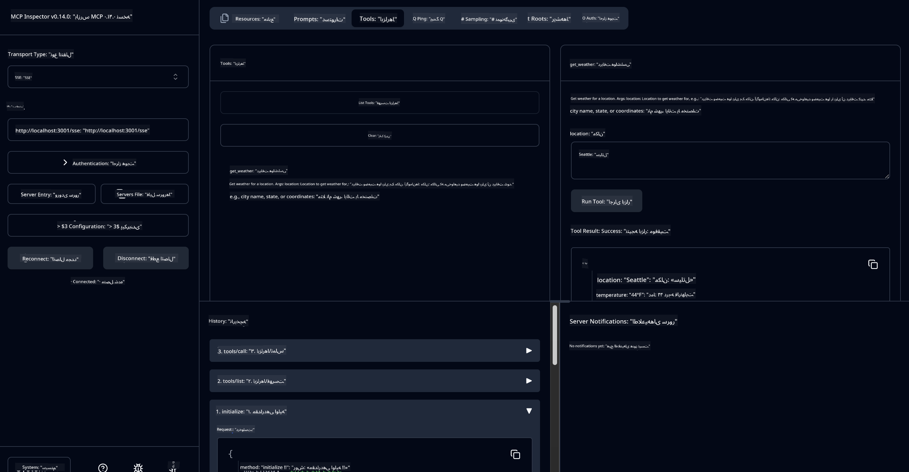

<!--
CO_OP_TRANSLATOR_METADATA:
{
  "original_hash": "dd8da3f75addcef453fe11f02a270217",
  "translation_date": "2025-07-14T08:07:43+00:00",
  "source_file": "10-StreamliningAIWorkflowsBuildingAnMCPServerWithAIToolkit/lab3/README.md",
  "language_code": "fa"
}
-->
# 🔧 ماژول ۳: توسعه پیشرفته MCP با AI Toolkit


## 🎯 اهداف یادگیری

تا پایان این آزمایشگاه، شما قادر خواهید بود:

- ✅ سرورهای سفارشی MCP را با استفاده از AI Toolkit بسازید
- ✅ آخرین نسخه MCP Python SDK (نسخه 1.9.3) را پیکربندی و استفاده کنید
- ✅ MCP Inspector را برای اشکال‌زدایی راه‌اندازی و به کار ببرید
- ✅ سرورهای MCP را در هر دو محیط Agent Builder و Inspector اشکال‌زدایی کنید
- ✅ جریان‌های کاری پیشرفته توسعه سرور MCP را درک کنید

## 📋 پیش‌نیازها

- اتمام آزمایشگاه ۲ (مبانی MCP)
- نصب افزونه AI Toolkit در VS Code
- محیط Python نسخه 3.10 یا بالاتر
- نصب Node.js و npm برای راه‌اندازی Inspector

## 🏗️ آنچه خواهید ساخت

در این آزمایشگاه، یک **سرور MCP هواشناسی** خواهید ساخت که موارد زیر را نشان می‌دهد:
- پیاده‌سازی سرور MCP سفارشی
- یکپارچه‌سازی با AI Toolkit Agent Builder
- جریان‌های کاری حرفه‌ای اشکال‌زدایی
- الگوهای استفاده از SDK مدرن MCP

---

## 🔧 مرور اجزای اصلی

### 🐍 MCP Python SDK  
کتابخانه Python پروتکل مدل کانتکست پایه‌ای برای ساخت سرورهای سفارشی MCP فراهم می‌کند. شما از نسخه 1.9.3 با قابلیت‌های پیشرفته اشکال‌زدایی استفاده خواهید کرد.

### 🔍 MCP Inspector  
ابزار قدرتمند اشکال‌زدایی که امکانات زیر را ارائه می‌دهد:  
- نظارت بلادرنگ سرور  
- نمایش اجرای ابزارها  
- بررسی درخواست‌ها و پاسخ‌های شبکه  
- محیط تست تعاملی

---

## 📖 پیاده‌سازی گام به گام

### گام ۱: ساخت یک WeatherAgent در Agent Builder

1. **Agent Builder را در VS Code از طریق افزونه AI Toolkit باز کنید**  
2. **یک عامل جدید با تنظیمات زیر بسازید:**  
   - نام عامل: `WeatherAgent`



### گام ۲: راه‌اندازی پروژه سرور MCP

1. **در Agent Builder به Tools → Add Tool بروید**  
2. **گزینه "MCP Server" را انتخاب کنید**  
3. **گزینه "Create A new MCP Server" را انتخاب کنید**  
4. **قالب `python-weather` را انتخاب کنید**  
5. **نام سرور خود را وارد کنید:** `weather_mcp`



### گام ۳: باز کردن و بررسی پروژه

1. **پروژه ایجاد شده را در VS Code باز کنید**  
2. **ساختار پروژه را مرور کنید:**  
```
   weather_mcp/
   ├── src/
   │   ├── __init__.py
   │   └── server.py
   ├── inspector/
   │   ├── package.json
   │   └── package-lock.json
   ├── .vscode/
   │   ├── launch.json
   │   └── tasks.json
   ├── pyproject.toml
   └── README.md
   ```

### گام ۴: ارتقا به آخرین نسخه MCP SDK

> **🔍 چرا ارتقا دهیم؟** ما می‌خواهیم از آخرین نسخه MCP SDK (نسخه 1.9.3) و سرویس Inspector (نسخه 0.14.0) برای امکانات بیشتر و اشکال‌زدایی بهتر استفاده کنیم.

#### ۴a. به‌روزرسانی وابستگی‌های Python

**فایل `pyproject.toml` را ویرایش کنید:** به‌روزرسانی در [./code/weather_mcp/pyproject.toml](../../../../10-StreamliningAIWorkflowsBuildingAnMCPServerWithAIToolkit/lab3/code/weather_mcp/pyproject.toml)

#### ۴b. به‌روزرسانی پیکربندی Inspector

**فایل `inspector/package.json` را ویرایش کنید:** به‌روزرسانی در [./code/weather_mcp/inspector/package.json](../../../../10-StreamliningAIWorkflowsBuildingAnMCPServerWithAIToolkit/lab3/code/weather_mcp/inspector/package.json)

#### ۴c. به‌روزرسانی وابستگی‌های Inspector

**فایل `inspector/package-lock.json` را ویرایش کنید:** به‌روزرسانی در [./code/weather_mcp/inspector/package-lock.json](../../../../10-StreamliningAIWorkflowsBuildingAnMCPServerWithAIToolkit/lab3/code/weather_mcp/inspector/package-lock.json)

> **📝 توجه:** این فایل شامل تعریف‌های گسترده وابستگی‌ها است. ساختار اصلی در بالا آمده است - محتوای کامل برای حل درست وابستگی‌ها ضروری است.

> **⚡ قفل کامل بسته:** فایل package-lock.json کامل حدود ۳۰۰۰ خط تعریف وابستگی دارد. ساختار کلیدی بالا نشان داده شده است - برای حل کامل وابستگی‌ها از فایل ارائه شده استفاده کنید.

### گام ۵: پیکربندی اشکال‌زدایی در VS Code

*توجه: لطفاً فایل موجود در مسیر مشخص شده را کپی کرده و جایگزین فایل محلی مربوطه کنید*

#### ۵a. به‌روزرسانی پیکربندی راه‌اندازی

**فایل `.vscode/launch.json` را ویرایش کنید:**  
```json
{
  "version": "0.2.0",
  "configurations": [
    {
      "name": "Attach to Local MCP",
      "type": "debugpy",
      "request": "attach",
      "connect": {
        "host": "localhost",
        "port": 5678
      },
      "presentation": {
        "hidden": true
      },
      "internalConsoleOptions": "neverOpen",
      "postDebugTask": "Terminate All Tasks"
    },
    {
      "name": "Launch Inspector (Edge)",
      "type": "msedge",
      "request": "launch",
      "url": "http://localhost:6274?timeout=60000&serverUrl=http://localhost:3001/sse#tools",
      "cascadeTerminateToConfigurations": [
        "Attach to Local MCP"
      ],
      "presentation": {
        "hidden": true
      },
      "internalConsoleOptions": "neverOpen"
    },
    {
      "name": "Launch Inspector (Chrome)",
      "type": "chrome",
      "request": "launch",
      "url": "http://localhost:6274?timeout=60000&serverUrl=http://localhost:3001/sse#tools",
      "cascadeTerminateToConfigurations": [
        "Attach to Local MCP"
      ],
      "presentation": {
        "hidden": true
      },
      "internalConsoleOptions": "neverOpen"
    }
  ],
  "compounds": [
    {
      "name": "Debug in Agent Builder",
      "configurations": [
        "Attach to Local MCP"
      ],
      "preLaunchTask": "Open Agent Builder",
    },
    {
      "name": "Debug in Inspector (Edge)",
      "configurations": [
        "Launch Inspector (Edge)",
        "Attach to Local MCP"
      ],
      "preLaunchTask": "Start MCP Inspector",
      "stopAll": true
    },
    {
      "name": "Debug in Inspector (Chrome)",
      "configurations": [
        "Launch Inspector (Chrome)",
        "Attach to Local MCP"
      ],
      "preLaunchTask": "Start MCP Inspector",
      "stopAll": true
    }
  ]
}
```

**فایل `.vscode/tasks.json` را ویرایش کنید:**  
```
{
  "version": "2.0.0",
  "tasks": [
    {
      "label": "Start MCP Server",
      "type": "shell",
      "command": "python -m debugpy --listen 127.0.0.1:5678 src/__init__.py sse",
      "isBackground": true,
      "options": {
        "cwd": "${workspaceFolder}",
        "env": {
          "PORT": "3001"
        }
      },
      "problemMatcher": {
        "pattern": [
          {
            "regexp": "^.*$",
            "file": 0,
            "location": 1,
            "message": 2
          }
        ],
        "background": {
          "activeOnStart": true,
          "beginsPattern": ".*",
          "endsPattern": "Application startup complete|running"
        }
      }
    },
    {
      "label": "Start MCP Inspector",
      "type": "shell",
      "command": "npm run dev:inspector",
      "isBackground": true,
      "options": {
        "cwd": "${workspaceFolder}/inspector",
        "env": {
          "CLIENT_PORT": "6274",
          "SERVER_PORT": "6277",
        }
      },
      "problemMatcher": {
        "pattern": [
          {
            "regexp": "^.*$",
            "file": 0,
            "location": 1,
            "message": 2
          }
        ],
        "background": {
          "activeOnStart": true,
          "beginsPattern": "Starting MCP inspector",
          "endsPattern": "Proxy server listening on port"
        }
      },
      "dependsOn": [
        "Start MCP Server"
      ]
    },
    {
      "label": "Open Agent Builder",
      "type": "shell",
      "command": "echo ${input:openAgentBuilder}",
      "presentation": {
        "reveal": "never"
      },
      "dependsOn": [
        "Start MCP Server"
      ],
    },
    {
      "label": "Terminate All Tasks",
      "command": "echo ${input:terminate}",
      "type": "shell",
      "problemMatcher": []
    }
  ],
  "inputs": [
    {
      "id": "openAgentBuilder",
      "type": "command",
      "command": "ai-mlstudio.agentBuilder",
      "args": {
        "initialMCPs": [ "local-server-weather_mcp" ],
        "triggeredFrom": "vsc-tasks"
      }
    },
    {
      "id": "terminate",
      "type": "command",
      "command": "workbench.action.tasks.terminate",
      "args": "terminateAll"
    }
  ]
}
```

---

## 🚀 اجرای سرور MCP و تست آن

### گام ۶: نصب وابستگی‌ها

پس از اعمال تغییرات پیکربندی، دستورات زیر را اجرا کنید:

**نصب وابستگی‌های Python:**  
```bash
uv sync
```

**نصب وابستگی‌های Inspector:**  
```bash
cd inspector
npm install
```

### گام ۷: اشکال‌زدایی با Agent Builder

1. **کلید F5 را فشار دهید** یا از پیکربندی **"Debug in Agent Builder"** استفاده کنید  
2. **پیکربندی ترکیبی را از پنل اشکال‌زدایی انتخاب کنید**  
3. **منتظر بمانید تا سرور راه‌اندازی شود و Agent Builder باز شود**  
4. **سرور MCP هواشناسی خود را با پرسش‌های زبان طبیعی تست کنید**

ورودی مانند این:

SYSTEM_PROMPT

```
You are my weather assistant
```

USER_PROMPT

```
How's the weather like in Seattle
```



### گام ۸: اشکال‌زدایی با MCP Inspector

1. **از پیکربندی "Debug in Inspector" استفاده کنید** (مرورگر Edge یا Chrome)  
2. **رابط Inspector را در آدرس `http://localhost:6274` باز کنید**  
3. **محیط تست تعاملی را کاوش کنید:**  
   - مشاهده ابزارهای موجود  
   - تست اجرای ابزارها  
   - نظارت بر درخواست‌های شبکه  
   - اشکال‌زدایی پاسخ‌های سرور



---

## 🎯 نتایج کلیدی یادگیری

با تکمیل این آزمایشگاه، شما:

- [x] **یک سرور MCP سفارشی** با استفاده از قالب‌های AI Toolkit ساخته‌اید  
- [x] **به آخرین نسخه MCP SDK** (نسخه 1.9.3) برای عملکرد بهتر ارتقا داده‌اید  
- [x] **جریان‌های کاری حرفه‌ای اشکال‌زدایی** را برای هر دو Agent Builder و Inspector پیکربندی کرده‌اید  
- [x] **MCP Inspector را برای تست تعاملی سرور راه‌اندازی کرده‌اید**  
- [x] **پیکربندی‌های اشکال‌زدایی VS Code را برای توسعه MCP به‌خوبی یاد گرفته‌اید**

## 🔧 ویژگی‌های پیشرفته بررسی شده

| ویژگی | توضیح | کاربرد |
|---------|-------------|----------|
| **MCP Python SDK v1.9.3** | پیاده‌سازی جدیدترین پروتکل | توسعه سرور مدرن |
| **MCP Inspector 0.14.0** | ابزار اشکال‌زدایی تعاملی | تست بلادرنگ سرور |
| **اشکال‌زدایی VS Code** | محیط توسعه یکپارچه | جریان کاری حرفه‌ای اشکال‌زدایی |
| **یکپارچه‌سازی Agent Builder** | اتصال مستقیم به AI Toolkit | تست کامل عامل‌ها |

## 📚 منابع بیشتر

- [مستندات MCP Python SDK](https://modelcontextprotocol.io/docs/sdk/python)  
- [راهنمای افزونه AI Toolkit](https://code.visualstudio.com/docs/ai/ai-toolkit)  
- [مستندات اشکال‌زدایی VS Code](https://code.visualstudio.com/docs/editor/debugging)  
- [مشخصات پروتکل مدل کانتکست](https://modelcontextprotocol.io/docs/concepts/architecture)

---

**🎉 تبریک!** شما با موفقیت آزمایشگاه ۳ را به پایان رساندید و اکنون می‌توانید سرورهای سفارشی MCP را با استفاده از جریان‌های کاری حرفه‌ای توسعه، اشکال‌زدایی و مستقر کنید.

### 🔜 ادامه به ماژول بعدی

آماده‌اید مهارت‌های MCP خود را در یک جریان کاری واقعی توسعه به کار ببرید؟ به **[ماژول ۴: توسعه عملی MCP - سرور کلون سفارشی GitHub](../lab4/README.md)** بروید که در آن:  
- یک سرور MCP آماده تولید می‌سازید که عملیات مخزن GitHub را خودکار می‌کند  
- قابلیت کلون کردن مخزن GitHub را از طریق MCP پیاده‌سازی می‌کنید  
- سرورهای سفارشی MCP را با VS Code و حالت Agent GitHub Copilot یکپارچه می‌کنید  
- سرورهای سفارشی MCP را در محیط‌های تولید تست و مستقر می‌کنید  
- جریان کاری خودکار عملی برای توسعه‌دهندگان را می‌آموزید

**سلب مسئولیت**:  
این سند با استفاده از سرویس ترجمه هوش مصنوعی [Co-op Translator](https://github.com/Azure/co-op-translator) ترجمه شده است. در حالی که ما در تلاش برای دقت هستیم، لطفاً توجه داشته باشید که ترجمه‌های خودکار ممکن است حاوی خطاها یا نواقصی باشند. سند اصلی به زبان بومی خود باید به عنوان منبع معتبر در نظر گرفته شود. برای اطلاعات حیاتی، ترجمه حرفه‌ای انسانی توصیه می‌شود. ما مسئول هیچ گونه سوءتفاهم یا تفسیر نادرستی که از استفاده از این ترجمه ناشی شود، نیستیم.