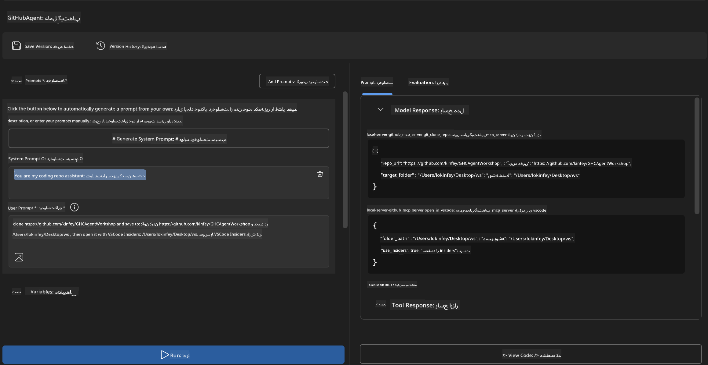
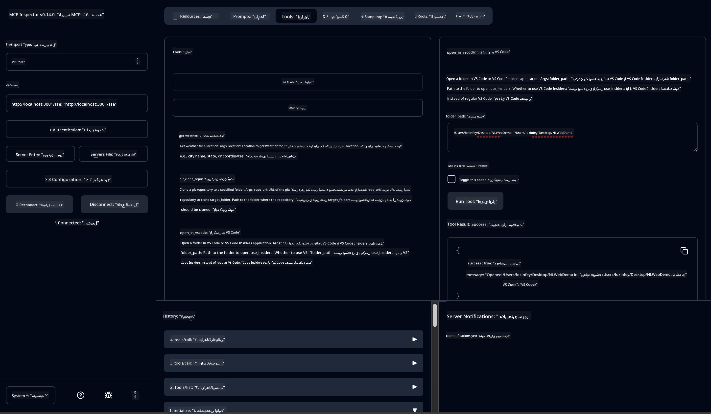

<!--
CO_OP_TRANSLATOR_METADATA:
{
  "original_hash": "f83bc722dc758efffd68667d6a1db470",
  "translation_date": "2025-07-14T08:36:23+00:00",
  "source_file": "10-StreamliningAIWorkflowsBuildingAnMCPServerWithAIToolkit/lab4/README.md",
  "language_code": "fa"
}
-->
# 🐙 ماژول ۴: توسعه عملی MCP - سرور کلون سفارشی گیت‌هاب


> **⚡ شروع سریع:** در عرض فقط ۳۰ دقیقه یک سرور MCP آماده تولید بسازید که کلون کردن مخازن گیت‌هاب و ادغام با VS Code را به‌صورت خودکار انجام می‌دهد!

## 🎯 اهداف یادگیری

تا پایان این آزمایشگاه، شما قادر خواهید بود:

- ✅ ساخت سرور MCP سفارشی برای جریان‌های کاری توسعه واقعی
- ✅ پیاده‌سازی قابلیت کلون کردن مخازن گیت‌هاب از طریق MCP
- ✅ ادغام سرورهای MCP سفارشی با VS Code و Agent Builder
- ✅ استفاده از حالت Agent در GitHub Copilot با ابزارهای MCP سفارشی
- ✅ تست و استقرار سرورهای MCP سفارشی در محیط‌های تولید

## 📋 پیش‌نیازها

- تکمیل آزمایشگاه‌های ۱ تا ۳ (مبانی MCP و توسعه پیشرفته)
- اشتراک GitHub Copilot ([ثبت‌نام رایگان موجود است](https://github.com/github-copilot/signup))
- VS Code با افزونه‌های AI Toolkit و GitHub Copilot
- نصب و پیکربندی Git CLI

## 🏗️ مرور پروژه

### **چالش توسعه واقعی**
ما به‌عنوان توسعه‌دهنده‌ها اغلب از گیت‌هاب برای کلون کردن مخازن و باز کردن آن‌ها در VS Code یا VS Code Insiders استفاده می‌کنیم. این فرآیند دستی شامل موارد زیر است:
1. باز کردن ترمینال یا خط فرمان
2. رفتن به دایرکتوری مورد نظر
3. اجرای دستور `git clone`
4. باز کردن VS Code در دایرکتوری کلون شده

**راه‌حل MCP ما این مراحل را در یک دستور هوشمندانه خلاصه می‌کند!**

### **آنچه خواهید ساخت**
یک **سرور MCP کلون گیت‌هاب** (`git_mcp_server`) که امکانات زیر را ارائه می‌دهد:

| ویژگی | توضیح | مزیت |
|---------|-------------|---------|
| 🔄 **کلون هوشمند مخازن** | کلون مخازن گیت‌هاب با اعتبارسنجی | بررسی خودکار خطاها |
| 📁 **مدیریت هوشمند دایرکتوری** | بررسی و ایجاد ایمن دایرکتوری‌ها | جلوگیری از بازنویسی ناخواسته |
| 🚀 **ادغام چندسکویی با VS Code** | باز کردن پروژه‌ها در VS Code/Insiders | انتقال بی‌وقفه در جریان کاری |
| 🛡️ **مدیریت قوی خطاها** | مدیریت مشکلات شبکه، دسترسی و مسیرها | اطمینان از قابلیت اطمینان در تولید |

---

## 📖 پیاده‌سازی گام به گام

### گام ۱: ساخت Agent گیت‌هاب در Agent Builder

1. **Agent Builder را از طریق افزونه AI Toolkit باز کنید**
2. **یک Agent جدید بسازید** با پیکربندی زیر:
   ```
   Agent Name: GitHubAgent
   ```

3. **سرور MCP سفارشی را راه‌اندازی کنید:**
   - به **Tools** → **Add Tool** → **MCP Server** بروید
   - گزینه **"Create A new MCP Server"** را انتخاب کنید
   - قالب **Python** را برای بیشترین انعطاف‌پذیری انتخاب کنید
   - **نام سرور:** `git_mcp_server`

### گام ۲: پیکربندی حالت Agent در GitHub Copilot

1. **GitHub Copilot را در VS Code باز کنید** (Ctrl/Cmd + Shift + P → "GitHub Copilot: Open")
2. **مدل Agent را در رابط Copilot انتخاب کنید**
3. **مدل Claude 3.7 را برای قابلیت‌های پیشرفته استدلال انتخاب کنید**
4. **ادغام MCP را برای دسترسی به ابزارها فعال کنید**

> **💡 نکته حرفه‌ای:** مدل Claude 3.7 در درک جریان‌های کاری توسعه و الگوهای مدیریت خطا عملکرد برتری دارد.

### گام ۳: پیاده‌سازی عملکرد اصلی سرور MCP

**از پرامپت دقیق زیر با حالت Agent در GitHub Copilot استفاده کنید:**

```
Create two MCP tools with the following comprehensive requirements:

🔧 TOOL A: clone_repository
Requirements:
- Clone any GitHub repository to a specified local folder
- Return the absolute path of the successfully cloned project
- Implement comprehensive validation:
  ✓ Check if target directory already exists (return error if exists)
  ✓ Validate GitHub URL format (https://github.com/user/repo)
  ✓ Verify git command availability (prompt installation if missing)
  ✓ Handle network connectivity issues
  ✓ Provide clear error messages for all failure scenarios

🚀 TOOL B: open_in_vscode
Requirements:
- Open specified folder in VS Code or VS Code Insiders
- Cross-platform compatibility (Windows/Linux/macOS)
- Use direct application launch (not terminal commands)
- Auto-detect available VS Code installations
- Handle cases where VS Code is not installed
- Provide user-friendly error messages

Additional Requirements:
- Follow MCP 1.9.3 best practices
- Include proper type hints and documentation
- Implement logging for debugging purposes
- Add input validation for all parameters
- Include comprehensive error handling
```

### گام ۴: تست سرور MCP خود

#### ۴a. تست در Agent Builder

1. **پیکربندی دیباگ Agent Builder را اجرا کنید**
2. **Agent خود را با این پرامپت سیستمی پیکربندی کنید:**

```
SYSTEM_PROMPT:
You are my intelligent coding repository assistant. You help developers efficiently clone GitHub repositories and set up their development environment. Always provide clear feedback about operations and handle errors gracefully.
```

3. **با سناریوهای واقعی کاربر تست کنید:**

```
USER_PROMPT EXAMPLES:

Scenario : Basic Clone and Open
"Clone {Your GitHub Repo link such as https://github.com/kinfey/GHCAgentWorkshop
 } and save to {The global path you specify}, then open it with VS Code Insiders"
```



**نتایج مورد انتظار:**
- ✅ کلون موفق با تأیید مسیر
- ✅ راه‌اندازی خودکار VS Code
- ✅ پیام‌های خطای واضح برای سناریوهای نامعتبر
- ✅ مدیریت صحیح موارد خاص

#### ۴b. تست در MCP Inspector



---

**🎉 تبریک!** شما با موفقیت یک سرور MCP عملی و آماده تولید ساختید که چالش‌های واقعی جریان کاری توسعه را حل می‌کند. سرور کلون سفارشی گیت‌هاب شما قدرت MCP را در خودکارسازی و افزایش بهره‌وری توسعه‌دهندگان نشان می‌دهد.

### 🏆 دستاوردهای شما:
- ✅ **توسعه‌دهنده MCP** - ساخت سرور MCP سفارشی
- ✅ **خودکارساز جریان کاری** - ساده‌سازی فرآیندهای توسعه  
- ✅ **متخصص ادغام** - اتصال چند ابزار توسعه
- ✅ **آماده تولید** - ساخت راه‌حل‌های قابل استقرار

---

## 🎓 پایان کارگاه: مسیر شما با Model Context Protocol

**شرکت‌کننده گرامی کارگاه،**

تبریک می‌گوییم که هر چهار ماژول کارگاه Model Context Protocol را به پایان رساندید! شما از درک مفاهیم پایه AI Toolkit تا ساخت سرورهای MCP آماده تولید که چالش‌های واقعی توسعه را حل می‌کنند، مسیر طولانی‌ای را طی کرده‌اید.

### 🚀 مرور مسیر یادگیری شما:

**[ماژول ۱](../lab1/README.md)**: با مبانی AI Toolkit، تست مدل‌ها و ساخت اولین Agent AI خود شروع کردید.

**[ماژول ۲](../lab2/README.md)**: معماری MCP را یاد گرفتید، Playwright MCP را ادغام کردید و اولین Agent اتوماسیون مرورگر خود را ساختید.

**[ماژول ۳](../lab3/README.md)**: به توسعه سرور MCP سفارشی با Weather MCP Server پیشرفت کردید و ابزارهای دیباگ را فرا گرفتید.

**[ماژول ۴](../lab4/README.md)**: اکنون همه چیز را به کار گرفتید تا ابزار اتوماسیون جریان کاری مخزن گیت‌هاب عملی بسازید.

### 🌟 مهارت‌های کسب‌شده:

- ✅ **اکوسیستم AI Toolkit**: مدل‌ها، Agentها و الگوهای ادغام
- ✅ **معماری MCP**: طراحی کلاینت-سرور، پروتکل‌های انتقال و امنیت
- ✅ **ابزارهای توسعه**: از Playground تا Inspector و استقرار در تولید
- ✅ **توسعه سفارشی**: ساخت، تست و استقرار سرورهای MCP خودتان
- ✅ **کاربردهای عملی**: حل چالش‌های واقعی جریان کاری با هوش مصنوعی

### 🔮 گام‌های بعدی شما:

1. **ساخت سرور MCP خودتان**: این مهارت‌ها را برای خودکارسازی جریان‌های کاری منحصر به فرد به کار ببرید
2. **پیوستن به جامعه MCP**: آثار خود را به اشتراک بگذارید و از دیگران بیاموزید
3. **کاوش ادغام پیشرفته**: سرورهای MCP را به سیستم‌های سازمانی متصل کنید
4. **مشارکت در متن‌باز**: به بهبود ابزارها و مستندات MCP کمک کنید

به یاد داشته باشید، این کارگاه فقط آغاز راه است. اکوسیستم Model Context Protocol به سرعت در حال پیشرفت است و شما اکنون مجهز به ابزارهای توسعه مبتنی بر هوش مصنوعی هستید.

**از مشارکت و تعهد شما به یادگیری سپاسگزاریم!**

امیدواریم این کارگاه ایده‌هایی را در شما برانگیخته باشد که نحوه ساخت و تعامل با ابزارهای هوش مصنوعی در مسیر توسعه‌تان را متحول کند.

**کدنویسی خوش!**

---

**سلب مسئولیت**:  
این سند با استفاده از سرویس ترجمه هوش مصنوعی [Co-op Translator](https://github.com/Azure/co-op-translator) ترجمه شده است. در حالی که ما در تلاش برای دقت هستیم، لطفاً توجه داشته باشید که ترجمه‌های خودکار ممکن است حاوی خطاها یا نواقصی باشند. سند اصلی به زبان بومی خود باید به عنوان منبع معتبر در نظر گرفته شود. برای اطلاعات حیاتی، ترجمه حرفه‌ای انسانی توصیه می‌شود. ما مسئول هیچ گونه سوءتفاهم یا تفسیر نادرستی که از استفاده این ترجمه ناشی شود، نیستیم.