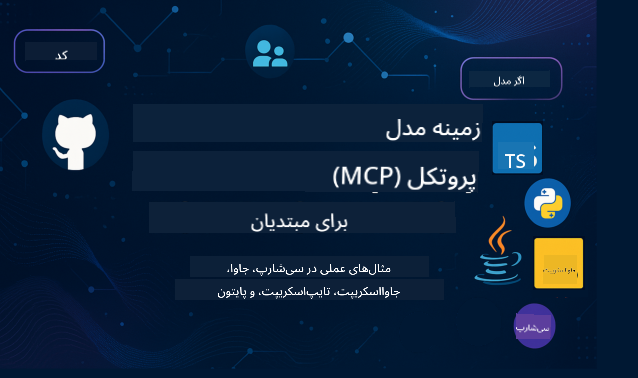

<!--
CO_OP_TRANSLATOR_METADATA:
{
  "original_hash": "2a21391378c12ecfef50f866329dfde0",
  "translation_date": "2025-05-17T05:17:50+00:00",
  "source_file": "README.md",
  "language_code": "fa"
}
-->

مراحل زیر را دنبال کنید تا استفاده از این منابع را شروع کنید:
1. **فورک کردن مخزن**: کلیک کنید 
2. **کلون کردن مخزن**:   `git clone https://github.com/microsoft/mcp-for-beginners.git`
3. [**به دیسکورد Microsoft Azure AI Foundry بپیوندید و با کارشناسان و توسعه‌دهندگان دیگر ملاقات کنید**](https://discord.com/invite/ByRwuEEgH4)

### 🌐 پشتیبانی چند زبانه

#### پشتیبانی شده از طریق GitHub Action (خودکار و همیشه به‌روز)
[فرانسوی](../fr/README.md) | [اسپانیایی](../es/README.md) | [آلمانی](../de/README.md) | [روسی](../ru/README.md) | [عربی](../ar/README.md) | [فارسی](./README.md) | [اردو](../ur/README.md) | [چینی (ساده‌شده)](../zh/README.md) | [چینی (سنتی، ماکائو)](../mo/README.md) | [چینی (سنتی، هنگ کنگ)](../hk/README.md) | [چینی (سنتی، تایوان)](../tw/README.md) | [ژاپنی](../ja/README.md) | [کره‌ای](../ko/README.md) | [هندی](../hi/README.md) | [بنگالی](../bn/README.md) | [مراتی](../mr/README.md) | [نپالی](../ne/README.md) | [پنجابی (گرمکهی)](../pa/README.md) | [پرتغالی (پرتغال)](../pt/README.md) | [پرتغالی (برزیل)](../br/README.md) | [ایتالیایی](../it/README.md) | [لهستانی](../pl/README.md) | [ترکی](../tr/README.md) | [یونانی](../el/README.md) | [تایلندی](../th/README.md) | [سوئدی](../sv/README.md) | [دانمارکی](../da/README.md) | [نروژی](../no/README.md) | [فنلاندی](../fi/README.md) | [هلندی](../nl/README.md) | [عبری](../he/README.md) | [ویتنامی](../vi/README.md) | [اندونزیایی](../id/README.md) | [مالایی](../ms/README.md) | [تاگالوگ (فیلیپینی)](../tl/README.md) | [سواحیلی](../sw/README.md) | [مجاری](../hu/README.md) | [چکی](../cs/README.md) | [اسلواکی](../sk/README.md) | [رومانیایی](../ro/README.md) | [بلغاری](../bg/README.md) | [صربی (سیریلیک)](../sr/README.md) | [کرواتی](../hr/README.md) | [اسلوونیایی](../sl/README.md)
# 🚀 راهنمای نهایی برای برنامه آموزشی پروتکل زمینه مدل (MCP) برای مبتدیان

## **یادگیری MCP با مثال‌های عملی کد در C#، Java، JavaScript، Python و TypeScript**

## 🧠 مرور کلی برنامه آموزشی پروتکل زمینه مدل

**پروتکل زمینه مدل (MCP)** یک چارچوب پیشرفته است که برای استانداردسازی تعاملات بین مدل‌های هوش مصنوعی و برنامه‌های مشتری طراحی شده است. این برنامه آموزشی متن‌باز یک مسیر یادگیری ساختاریافته ارائه می‌دهد که شامل مثال‌های عملی کدنویسی و موارد استفاده واقعی در زبان‌های برنامه‌نویسی محبوب مانند C#، Java، JavaScript، TypeScript و Python است.

خواه شما یک توسعه‌دهنده هوش مصنوعی، معمار سیستم یا مهندس نرم‌افزار باشید، این راهنما منبع جامع شما برای تسلط بر اصول MCP و استراتژی‌های پیاده‌سازی است.

## 🔗 منابع رسمی MCP

- 📘 [مستندات MCP](https://modelcontextprotocol.io/) – آموزش‌های دقیق و راهنماهای کاربری  
- 📜 [مشخصات MCP](https://spec.modelcontextprotocol.io/) – معماری پروتکل و منابع فنی  
- 🧑‍💻 [مخزن GitHub MCP](https://github.com/modelcontextprotocol) – SDKها، ابزارها و نمونه‌های کد متن‌باز  

## 🧭 ساختار کامل برنامه آموزشی MCP

### 📌 [مقدمه‌ای بر MCP](./00-Introduction/README.md)

- پروتکل زمینه مدل چیست؟
- چرا استانداردسازی در خطوط لوله هوش مصنوعی اهمیت دارد
- موارد استفاده عملی و مزایای MCP

### 🧩 [مفاهیم اصلی توضیح داده شده](./01-CoreConcepts/README.md)

- درک معماری مشتری-سرور در MCP
- اجزای کلیدی پروتکل: درخواست‌ها، پاسخ‌ها و شِماها
- الگوهای پیام‌رسانی و تبادل داده MCP

### 🔐 [امنیت در MCP](./02-Security/readme.md)

- شناسایی تهدیدهای امنیتی در سیستم‌های مبتنی بر MCP
- تکنیک‌ها و بهترین روش‌ها برای امن‌سازی پیاده‌سازی‌ها

### 🚀 [شروع کار با MCP](./03-GettingStarted/README.md)

- تنظیم محیط و پیکربندی
- ایجاد سرورها و مشتری‌های MCP ساده
- ادغام MCP با برنامه‌های موجود

#### 🧮 پروژه‌های نمونه ماشین حساب MCP:

  
<strong>کاوش در پیاده‌سازی‌های کد به زبان‌های مختلف</strong>

  - [مثال سرور MCP در C#](./03-GettingStarted/samples/csharp/README.md)
  - [ماشین حساب MCP در Java](./03-GettingStarted/samples/java/calculator/README.md)
  - [نمایش MCP در JavaScript](./03-GettingStarted/samples/javascript/README.md)
  - [سرور MCP در Python](../../03-GettingStarted/samples/python/mcp_calculator_server.py)
  - [مثال MCP در TypeScript](./03-GettingStarted/samples/typescript/README.md)

### 🛠️ [پیاده‌سازی عملی](./04-PracticalImplementation/README.md)

- استفاده از SDKها در زبان‌های مختلف
- اشکال‌زدایی، آزمایش و اعتبارسنجی
- ساخت قالب‌های درخواست قابل استفاده مجدد و جریان‌های کاری

#### 💡 پروژه‌های ماشین حساب پیشرفته MCP:

  
<strong>کاوش در نمونه‌های پیشرفته</strong>

  - [نمونه پیشرفته C#](./04-PracticalImplementation/samples/csharp/README.md)
  - [مثال برنامه کانتینری Java](./04-PracticalImplementation/samples/java/containerapp/README.md)
  - [نمونه پیشرفته JavaScript](./04-PracticalImplementation/samples/javascript/README.md)
  - [پیاده‌سازی پیچیده Python](../../04-PracticalImplementation/samples/python/mcp_sample.py)
  - [نمونه کانتینری TypeScript](./04-PracticalImplementation/samples/typescript/README.md)

### 🎓 [موضوعات پیشرفته در MCP](./05-AdvancedTopics/README.md)

- جریان‌های کاری هوش مصنوعی چند‌وجهی و قابلیت توسعه
- استراتژی‌های مقیاس‌بندی امن
- MCP در اکوسیستم‌های سازمانی

### 🌍 [مشارکت‌های جامعه](./06-CommunityContributions/README.md)

- چگونه کد و مستندات را مشارکت دهید
- همکاری از طریق GitHub
- بهبودها و بازخوردهای جامعه محور

### 📈 [بینش‌هایی از پذیرش اولیه](./07-CaseStudies/README.md)

- پیاده‌سازی‌های واقعی و آنچه که کار کرده است
- ساخت و استقرار راه‌حل‌های مبتنی بر MCP
- روندها و نقشه راه آینده

### 📏 [بهترین روش‌ها برای MCP](./08-BestPractices/README.md)

- تنظیم عملکرد و بهینه‌سازی
- طراحی سیستم‌های MCP مقاوم در برابر خطا
- استراتژی‌های آزمایش و مقاومت

### 📊 [مطالعات موردی MCP](./09-CaseStudy/Readme.md)

- بررسی عمیق در معماری‌های راه‌حل MCP
- نقشه‌های استقرار و نکات ادغام
- نمودارهای توضیحی و مرور پروژه‌ها

## 🎯 پیش‌نیازهای یادگیری MCP

برای بهره‌گیری کامل از این برنامه آموزشی، باید:

- دانش پایه‌ای از C#، Java یا Python داشته باشید
- درک مدل مشتری-سرور و APIها را داشته باشید
- (اختیاری) آشنایی با مفاهیم یادگیری ماشین

## 🛠️ چگونه به طور مؤثر از این برنامه آموزشی استفاده کنیم

هر درس در این راهنما شامل:

1. توضیحات واضحی از مفاهیم MCP  
2. مثال‌های زنده کد در چندین زبان  
3. تمرین‌هایی برای ساخت برنامه‌های واقعی MCP  
4. منابع اضافی برای یادگیرندگان پیشرفته  

## 📜 اطلاعات مجوز

این محتوا تحت **مجوز MIT** منتشر شده است. برای شرایط و ضوابط، به [LICENSE](../../LICENSE) مراجعه کنید.

## 🤝 دستورالعمل‌های مشارکت

این پروژه از مشارکت‌ها و پیشنهادات استقبال می‌کند. اکثر مشارکت‌ها نیاز دارند که شما با یک
توافق‌نامه مجوز مشارکت‌کننده (CLA) موافقت کنید که اعلام می‌کند شما حق دارید و واقعاً این کار را انجام می‌دهید که حقوق استفاده از مشارکت خود را به ما اعطا کنید. برای جزئیات، به <https://cla.opensource.microsoft.com> مراجعه کنید.

هنگامی که یک درخواست کشش ارسال می‌کنید، یک ربات CLA به طور خودکار تعیین می‌کند که آیا شما نیاز به ارائه
CLA دارید و درخواست کشش را به طور مناسب تزئین می‌کند (مانند بررسی وضعیت، نظر). به سادگی دستورالعمل‌های ارائه شده توسط ربات را دنبال کنید.
شما فقط یک بار باید این کار را در تمام مخازن که از CLA ما استفاده می‌کنند انجام دهید.

این پروژه [کد رفتار متن‌باز مایکروسافت](https://opensource.microsoft.com/codeofconduct/) را پذیرفته است.
برای اطلاعات بیشتر به [سوالات متداول کد رفتار](https://opensource.microsoft.com/codeofconduct/faq/) مراجعه کنید یا با [opencode@microsoft.com](mailto:opencode@microsoft.com) تماس بگیرید با هر سوال یا نظر اضافی.

## ™️ اطلاعیه علامت تجاری

این پروژه ممکن است حاوی علامت‌های تجاری یا لوگوهایی برای پروژه‌ها، محصولات یا خدمات باشد. استفاده مجاز از علامت‌های تجاری یا لوگوهای مایکروسافت تابع و باید از
[راهنمای علامت تجاری و برند مایکروسافت](https://www.microsoft.com/legal/intellectualproperty/trademarks/usage/general) پیروی کند.
استفاده از علامت‌های تجاری یا لوگوهای مایکروسافت در نسخه‌های اصلاح‌شده این پروژه نباید باعث سردرگمی یا القای حمایت مایکروسافت شود.
هرگونه استفاده از علامت‌های تجاری یا لوگوهای شخص ثالث تابع سیاست‌های آن‌ها است.

**سلب مسئولیت**:  
این سند با استفاده از سرویس ترجمه هوش مصنوعی [Co-op Translator](https://github.com/Azure/co-op-translator) ترجمه شده است. در حالی که ما برای دقت تلاش می‌کنیم، لطفاً توجه داشته باشید که ترجمه‌های خودکار ممکن است حاوی خطاها یا نادرستی‌ها باشند. سند اصلی به زبان مادری آن باید به عنوان منبع معتبر در نظر گرفته شود. برای اطلاعات حیاتی، ترجمه حرفه‌ای انسانی توصیه می‌شود. ما مسئولیتی در قبال هرگونه سوء تفاهم یا تفسیر اشتباه ناشی از استفاده از این ترجمه نداریم.