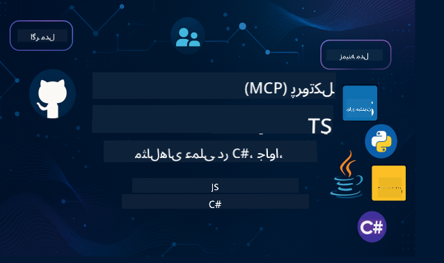

<!--
CO_OP_TRANSLATOR_METADATA:
{
  "original_hash": "866c8877136cb03e1efb9ad633a2f0a6",
  "translation_date": "2025-08-26T17:09:04+00:00",
  "source_file": "README.md",
  "language_code": "fa"
}
-->
 

  
  
  
  

  
  
  

  

برای شروع استفاده از این منابع، مراحل زیر را دنبال کنید:  
1. **فورک کردن مخزن**: کلیک کنید   
2. **کلون کردن مخزن**:   `git clone https://github.com/microsoft/mcp-for-beginners.git`  
3. [**به دیسکورد Azure AI Foundry بپیوندید و با کارشناسان و توسعه‌دهندگان دیگر آشنا شوید**](https://discord.com/invite/ByRwuEEgH4)  

### 🌐 پشتیبانی چندزبانه  

#### پشتیبانی شده از طریق GitHub Action (خودکار و همیشه به‌روز)  

 [عربی](../ar/README.md) | [بنگالی](../bn/README.md) | [بلغاری](../bg/README.md) | [برمه‌ای (میانمار)](../my/README.md) | [چینی (ساده‌شده)](../zh/README.md) | [چینی (سنتی، هنگ‌کنگ)](../hk/README.md) | [چینی (سنتی، ماکائو)](../mo/README.md) | [چینی (سنتی، تایوان)](../tw/README.md) | [کرواتی](../hr/README.md) | [چکی](../cs/README.md) | [دانمارکی](../da/README.md) | [هلندی](../nl/README.md) | [فنلاندی](../fi/README.md) | [فرانسوی](../fr/README.md) | [آلمانی](../de/README.md) | [یونانی](../el/README.md) | [عبری](../he/README.md) | [هندی](../hi/README.md) | [مجاری](../hu/README.md) | [اندونزیایی](../id/README.md) | [ایتالیایی](../it/README.md) | [ژاپنی](../ja/README.md) | [کره‌ای](../ko/README.md) | [مالایی](../ms/README.md) | [مراتی](../mr/README.md) | [نپالی](../ne/README.md) | [نروژی](../no/README.md) | [فارسی (Farsi)](./README.md) | [لهستانی](../pl/README.md) | [پرتغالی (برزیل)](../br/README.md) | [پرتغالی (پرتغال)](../pt/README.md) | [پنجابی (گورمخی)](../pa/README.md) | [رومانیایی](../ro/README.md) | [روسی](../ru/README.md) | [صربی (سیریلیک)](../sr/README.md) | [اسلواکی](../sk/README.md) | [اسلوونیایی](../sl/README.md) | [اسپانیایی](../es/README.md) | [سواحیلی](../sw/README.md) | [سوئدی](../sv/README.md) | [تاگالوگ (فیلیپینی)](../tl/README.md) | [تایلندی](../th/README.md) | [ترکی](../tr/README.md) | [اوکراینی](../uk/README.md) | [اردو](../ur/README.md) | [ویتنامی](../vi/README.md)  

# 🚀 برنامه آموزشی پروتکل مدل کانتکست (MCP) برای مبتدیان  

## **یادگیری MCP با مثال‌های کدنویسی عملی در C#، جاوا، جاوااسکریپت، راست، پایتون و تایپ‌اسکریپت**  

## 🧠 مروری بر برنامه آموزشی پروتکل مدل کانتکست  

**پروتکل مدل کانتکست (MCP)** یک چارچوب پیشرفته است که برای استانداردسازی تعاملات بین مدل‌های هوش مصنوعی و برنامه‌های کلاینت طراحی شده است. این برنامه آموزشی متن‌باز، مسیر یادگیری ساختاریافته‌ای را ارائه می‌دهد که شامل مثال‌های کدنویسی عملی و موارد استفاده واقعی در زبان‌های برنامه‌نویسی محبوب مانند C#، جاوا، جاوااسکریپت، تایپ‌اسکریپت و پایتون است.  

چه توسعه‌دهنده هوش مصنوعی باشید، چه معمار سیستم یا مهندس نرم‌افزار، این راهنما منبع جامعی برای تسلط بر اصول MCP و استراتژی‌های پیاده‌سازی آن است.  

## 🔗 منابع رسمی MCP  

- 📘 [مستندات MCP](https://modelcontextprotocol.io/) – آموزش‌ها و راهنماهای کاربری دقیق  
- 📜 [مشخصات MCP](https://modelcontextprotocol.io/docs/) – معماری پروتکل و مراجع فنی  
- 📜 [مشخصات اصلی MCP](https://spec.modelcontextprotocol.io/) – مراجع فنی قدیمی (ممکن است جزئیات بیشتری داشته باشد)  
- 🧑‍💻 [مخزن GitHub MCP](https://github.com/modelcontextprotocol) – SDKها، ابزارها و نمونه‌های کد متن‌باز  
- 🌐 [جامعه MCP](https://github.com/orgs/modelcontextprotocol/discussions) – به بحث‌ها بپیوندید و به جامعه کمک کنید  

## 🧭 مروری بر برنامه آموزشی MCP  

### 📚 ساختار کامل برنامه آموزشی  

| ماژول | موضوع | توضیحات | لینک |  
|--------|-------|-------------|------|  
| **ماژول ۱-۳: اصول اولیه** | | | |  
| ۰۰ | معرفی MCP | مروری بر پروتکل مدل کانتکست و اهمیت آن در خطوط لوله هوش مصنوعی | [بیشتر بخوانید](./00-Introduction/README.md) |  
| ۰۱ | توضیح مفاهیم اصلی | بررسی عمیق مفاهیم اصلی MCP | [بیشتر بخوانید](./01-CoreConcepts/README.md) |  
| ۰۲ | امنیت در MCP | تهدیدات امنیتی و بهترین روش‌ها | [بیشتر بخوانید](./02-Security/README.md) |  
| ۰۳ | شروع کار با MCP | تنظیم محیط، سرورها/کلاینت‌های پایه، یکپارچه‌سازی | [بیشتر بخوانید](./03-GettingStarted/README.md) |  
| **ماژول ۳: ساخت اولین سرور و کلاینت** | | | |  
| ۳.۱ | اولین سرور | ساخت اولین سرور MCP | [راهنما](./03-GettingStarted/01-first-server/README.md) |  
| ۳.۲ | اولین کلاینت | توسعه یک کلاینت MCP پایه | [راهنما](./03-GettingStarted/02-client/README.md) |  
| ۳.۳ | کلاینت با LLM | یکپارچه‌سازی مدل‌های زبانی بزرگ | [راهنما](./03-GettingStarted/03-llm-client/README.md) |  
| ۳.۴ | یکپارچه‌سازی با VS Code | استفاده از سرورهای MCP در VS Code | [راهنما](./03-GettingStarted/04-vscode/README.md) |  
| ۳.۵ | سرور stdio | ساخت سرورها با استفاده از انتقال stdio | [راهنما](./03-GettingStarted/05-stdio-server/README.md) |  
| ۳.۶ | استریم HTTP | پیاده‌سازی استریم HTTP در MCP | [راهنما](./03-GettingStarted/06-http-streaming/README.md) |  
| ۳.۷ | ابزار هوش مصنوعی | استفاده از ابزار هوش مصنوعی با MCP | [راهنما](./03-GettingStarted/07-aitk/README.md) |  
| ۳.۸ | تست | تست پیاده‌سازی سرور MCP | [راهنما](./03-GettingStarted/08-testing/README.md) |  
| ۳.۹ | استقرار | استقرار سرورهای MCP در محیط تولید | [راهنما](./03-GettingStarted/09-deployment/README.md) |  
| **ماژول ۴-۵: عملی و پیشرفته** | | | |  
| ۰۴ | پیاده‌سازی عملی | SDKها، اشکال‌زدایی، تست، قالب‌های قابل استفاده مجدد | [بیشتر بخوانید](./04-PracticalImplementation/README.md) |  
| ۰۵ | موضوعات پیشرفته در MCP | هوش مصنوعی چندوجهی، مقیاس‌پذیری، استفاده سازمانی | [بیشتر بخوانید](./05-AdvancedTopics/README.md) |  
| ۵.۱ | یکپارچه‌سازی با Azure | یکپارچه‌سازی MCP با Azure | [راهنما](./05-AdvancedTopics/mcp-integration/README.md) |  
| ۵.۲ | چندوجهی | کار با چند وجه مختلف | [راهنما](./05-AdvancedTopics/mcp-multi-modality/README.md) |  
| ۵.۳ | دمو OAuth2 | پیاده‌سازی احراز هویت OAuth2 | [راهنما](./05-AdvancedTopics/mcp-oauth2-demo/README.md) |  
| ۵.۴ | کانتکست‌های ریشه | درک و پیاده‌سازی کانتکست‌های ریشه | [راهنما](./05-AdvancedTopics/mcp-root-contexts/README.md) |  
| ۵.۵ | مسیریابی | استراتژی‌های مسیریابی MCP | [راهنما](./05-AdvancedTopics/mcp-routing/README.md) |  
| ۵.۶ | نمونه‌گیری | تکنیک‌های نمونه‌گیری در MCP | [راهنما](./05-AdvancedTopics/mcp-sampling/README.md) |  
| ۵.۷ | مقیاس‌پذیری | مقیاس‌پذیری پیاده‌سازی‌های MCP | [راهنما](./05-AdvancedTopics/mcp-scaling/README.md) |  
| ۵.۸ | امنیت | ملاحظات امنیتی پیشرفته | [راهنما](./05-AdvancedTopics/mcp-security/README.md) |  
| ۵.۹ | جستجوی وب | پیاده‌سازی قابلیت‌های جستجوی وب | [راهنما](./05-AdvancedTopics/web-search-mcp/README.md) |  
| ۵.۱۰ | استریم بلادرنگ | ساخت قابلیت استریم بلادرنگ | [راهنما](./05-AdvancedTopics/mcp-realtimestreaming/README.md) |  
| ۵.۱۱ | جستجوی بلادرنگ | پیاده‌سازی جستجوی بلادرنگ | [راهنما](./05-AdvancedTopics/mcp-realtimesearch/README.md) |  
| ۵.۱۲ | احراز هویت Entra ID | احراز هویت با Microsoft Entra ID | [راهنما](./05-AdvancedTopics/mcp-security-entra/README.md) |  
| ۵.۱۳ | یکپارچه‌سازی Foundry | یکپارچه‌سازی با Azure AI Foundry | [راهنما](./05-AdvancedTopics/mcp-foundry-agent-integration/README.md) |  
| ۵.۱۴ | مهندسی کانتکست | تکنیک‌های مهندسی کانتکست مؤثر | [راهنما](./05-AdvancedTopics/mcp-contextengineering/README.md) |  
| **ماژول ۶-۱۰: جامعه و بهترین روش‌ها** | | | |  
| ۰۶ | مشارکت‌های جامعه | نحوه مشارکت در اکوسیستم MCP | [راهنما](./06-CommunityContributions/README.md) |  
| ۰۷ | بینش‌هایی از پذیرش اولیه | داستان‌های پیاده‌سازی در دنیای واقعی | [راهنما](./07-LessonsFromEarlyAdoption/README.md) |  
| ۰۸ | بهترین روش‌ها برای MCP | عملکرد، تحمل خطا، مقاومت | [راهنما](./08-BestPractices/README.md) |  
| ۰۹ | مطالعات موردی MCP | مثال‌های پیاده‌سازی عملی | [راهنما](./09-CaseStudy/README.md) |  
| ۱۰ | کارگاه عملی | ساخت یک سرور MCP با ابزار هوش مصنوعی | [آزمایشگاه](./10-StreamliningAIWorkflowsBuildingAnMCPServerWithAIToolkit/README.md) |  

### 💻 پروژه‌های نمونه کد  

#### نمونه‌های پایه ماشین‌حساب MCP  

| زبان | توضیحات | لینک |  
|----------|-------------|------|  
| C# | مثال سرور MCP | [مشاهده کد](./03-GettingStarted/samples/csharp/README.md) |  
| جاوا | ماشین‌حساب MCP | [مشاهده کد](./03-GettingStarted/samples/java/calculator/README.md) |  
| جاوااسکریپت | دمو MCP | [مشاهده کد](./03-GettingStarted/samples/javascript/README.md) |  
| پایتون | سرور MCP | [مشاهده کد](../../03-GettingStarted/samples/python/mcp_calculator_server.py) |  
| تایپ‌اسکریپت | مثال MCP | [مشاهده کد](./03-GettingStarted/samples/typescript/README.md) |  
| راست | مثال MCP | [مشاهده کد](./03-GettingStarted/samples/rust/README.md) |  

#### پیاده‌سازی‌های پیشرفته MCP  

| زبان | توضیحات | لینک |  
|----------|-------------|------|  
| C# | نمونه پیشرفته | [View Code](./04-PracticalImplementation/samples/csharp/README.md) |
| Java with Spring | مثال برنامه کانتینری | [View Code](./04-PracticalImplementation/samples/java/containerapp/README.md) |
| JavaScript | نمونه پیشرفته | [View Code](./04-PracticalImplementation/samples/javascript/README.md) |
| Python | پیاده‌سازی پیچیده | [View Code](../../04-PracticalImplementation/samples/python/READMEmd) |
| TypeScript | نمونه کانتینری | [View Code](./04-PracticalImplementation/samples/typescript/README.md) |

## 🎯 پیش‌نیازهای یادگیری MCP

برای بهره‌برداری کامل از این دوره آموزشی، باید موارد زیر را داشته باشید:

- دانش پایه برنامه‌نویسی در حداقل یکی از زبان‌های زیر: C#، Java، JavaScript، Python یا TypeScript  
- درک مدل کلاینت-سرور و APIها  
- آشنایی با مفاهیم REST و HTTP  
- (اختیاری) پیش‌زمینه‌ای در مفاهیم AI/ML  

- شرکت در بحث‌های جامعه ما برای دریافت پشتیبانی  

## 📚 راهنمای مطالعه و منابع

این مخزن شامل منابع متعددی است که به شما کمک می‌کند به طور مؤثر یاد بگیرید و پیش بروید:

### راهنمای مطالعه

یک [راهنمای مطالعه](./study_guide.md) جامع در دسترس است که به شما کمک می‌کند این مخزن را به طور مؤثر مرور کنید. این راهنما شامل موارد زیر است:

- نقشه تصویری برنامه درسی که تمام موضوعات پوشش داده شده را نشان می‌دهد  
- توضیحات دقیق هر بخش از مخزن  
- راهنمایی در مورد نحوه استفاده از پروژه‌های نمونه  
- مسیرهای یادگیری پیشنهادی برای سطوح مهارتی مختلف  
- منابع اضافی برای تکمیل مسیر یادگیری شما  

### تغییرات

ما یک [تغییرات](./changelog.md) دقیق را نگهداری می‌کنیم که تمام به‌روزرسانی‌های مهم در مواد آموزشی را شامل می‌شود، از جمله:

- اضافه شدن محتوای جدید  
- تغییرات ساختاری  
- بهبود ویژگی‌ها  
- به‌روزرسانی مستندات  

## 🛠️ نحوه استفاده مؤثر از این دوره آموزشی

هر درس در این راهنما شامل موارد زیر است:

1. توضیحات واضح مفاهیم MCP  
2. مثال‌های کدنویسی زنده در زبان‌های مختلف  
3. تمرین‌هایی برای ساخت برنامه‌های واقعی MCP  
4. منابع اضافی برای یادگیرندگان پیشرفته  

## رویدادها 

### [MCP Dev Days جولای ۲۰۲۵](https://developer.microsoft.com/en-us/reactor/series/S-1563/)
#### [➡️تماشای ضبط شده - MCP Dev Days](https://developer.microsoft.com/en-us/reactor/series/S-1563/)
آماده شوید برای دو روز بینش فنی عمیق، ارتباط با جامعه، و یادگیری عملی در MCP Dev Days، یک رویداد مجازی که به پروتکل مدل کانتکست (MCP) اختصاص دارد — استاندارد نوظهوری که مدل‌های هوش مصنوعی و ابزارهای مورد استفاده آن‌ها را به هم متصل می‌کند.  
می‌توانید MCP Dev Days را با ثبت‌نام در صفحه رویداد ما تماشا کنید: https://aka.ms/mcpdevdays.  

#### [روز اول: بهره‌وری MCP، ابزارهای توسعه، و جامعه:](https://developer.microsoft.com/en-us/reactor/series/S-1563/)

این روز به توانمندسازی توسعه‌دهندگان برای استفاده از MCP در جریان کاری توسعه‌دهنده و جشن گرفتن جامعه شگفت‌انگیز MCP اختصاص دارد. ما با اعضای جامعه و شرکایی مانند Arcade، Block، Okta و Neon همراه خواهیم بود تا ببینیم چگونه با مایکروسافت همکاری می‌کنند تا یک اکوسیستم MCP باز و قابل توسعه را شکل دهند.  
دموهای واقعی در VS Code، Visual Studio، GitHub Copilot و ابزارهای محبوب جامعه  
جریان‌های کاری توسعه‌دهنده مبتنی بر کانتکست  
جلسات و بینش‌های جامعه‌محور  
چه تازه با MCP آشنا شده باشید یا در حال ساخت با آن باشید، روز اول با الهام و نکات عملی شما را آماده می‌کند.  

#### [روز دوم: ساخت سرورهای MCP با اطمینان](https://developer.microsoft.com/en-us/reactor/series/S-1563/)

این روز برای سازندگان MCP است. ما به استراتژی‌های پیاده‌سازی و بهترین شیوه‌ها برای ایجاد سرورهای MCP و ادغام MCP در جریان‌های کاری هوش مصنوعی می‌پردازیم.  

#### موضوعات شامل:

- ساخت سرورهای MCP و ادغام آن‌ها در تجربیات عامل  
- توسعه مبتنی بر پرامپت  
- بهترین شیوه‌های امنیتی  
- استفاده از بلوک‌های سازنده مانند Functions، ACA و مدیریت API  
- هم‌ترازی رجیستری و ابزارها (1P + 3P)  

اگر توسعه‌دهنده، سازنده ابزار یا استراتژیست محصول هوش مصنوعی هستید، این روز پر از بینش‌هایی است که برای ساخت راه‌حل‌های MCP مقیاس‌پذیر، امن و آماده برای آینده نیاز دارید.  

### بوت کمپ MCP آگوست ۲۰۲۵
در جلسات ویدیویی فشرده یاد بگیرید چگونه سرورهای MCP ایجاد کنید، با VS Code ادغام کنید و به صورت حرفه‌ای در Azure مستقر کنید، بر اساس محتوای دوره MCP برای مبتدیان. با مهارت‌های عملی در فناوری که شرکت‌های بزرگ در حال حاضر از آن استفاده می‌کنند، از این دوره خارج شوید.  

#### [➡️تماشای ضبط شده بوت کمپ MCP | انگلیسی](https://developer.microsoft.com/en-us/reactor/series/s-1568/)  
#### [➡️تماشای ضبط شده بوت کمپ MCP | برزیل](https://developer.microsoft.com/en-us/reactor/series/S-1566/)  
#### [➡️تماشای ضبط شده بوت کمپ MCP | اسپانیایی](https://developer.microsoft.com/en-us/reactor/series/S-1567/)  

## 🌟 تشکر از جامعه

تشکر از Microsoft Valued Professional [Shivam Goyal](https://www.linkedin.com/in/shivam2003/) برای ارائه نمونه‌های کد مهم.  

## 📜 اطلاعات مجوز

این محتوا تحت **مجوز MIT** منتشر شده است. برای شرایط و ضوابط، به [LICENSE](../../LICENSE) مراجعه کنید.  

## 🤝 دستورالعمل‌های مشارکت

این پروژه از مشارکت‌ها و پیشنهادات استقبال می‌کند. اکثر مشارکت‌ها نیاز دارند که شما با یک  
توافق‌نامه مجوز مشارکت‌کننده (CLA) موافقت کنید که اعلام می‌کند شما حق دارید و واقعاً این حق را دارید که به ما  
حقوق استفاده از مشارکت خود را اعطا کنید. برای جزئیات، به  
<https://cla.opensource.microsoft.com> مراجعه کنید.  

هنگامی که یک درخواست pull ارسال می‌کنید، یک ربات CLA به طور خودکار تعیین می‌کند که آیا شما نیاز دارید  
CLA ارائه دهید و درخواست را به طور مناسب تزئین می‌کند (مثلاً بررسی وضعیت، نظر). به سادگی دستورالعمل‌های  
ارائه شده توسط ربات را دنبال کنید. شما فقط یک بار نیاز به انجام این کار دارید برای تمام مخازن استفاده‌کننده از CLA ما.  

این پروژه [کد رفتار منبع باز مایکروسافت](https://opensource.microsoft.com/codeofconduct/) را پذیرفته است.  
برای اطلاعات بیشتر به [سؤالات متداول کد رفتار](https://opensource.microsoft.com/codeofconduct/faq/) مراجعه کنید یا  
با [opencode@microsoft.com](mailto:opencode@microsoft.com) تماس بگیرید برای هر سؤال یا نظر اضافی.  

## 📂 ساختار مخزن

این مخزن به صورت زیر سازماندهی شده است:

- **برنامه درسی اصلی (00-10)**: محتوای اصلی که در ده ماژول متوالی سازماندهی شده است  
- **images/**: نمودارها و تصاویر استفاده شده در سراسر برنامه درسی  
- **translations/**: پشتیبانی چندزبانه با ترجمه‌های خودکار  
- **translated_images/**: نسخه‌های محلی‌سازی شده از نمودارها و تصاویر  
- **study_guide.md**: راهنمای جامع برای مرور مخزن  
- **changelog.md**: ثبت تمام تغییرات مهم در مواد آموزشی  
- **mcp.json**: فایل پیکربندی برای مشخصات MCP  
- **CODE_OF_CONDUCT.md, LICENSE, SECURITY.md, SUPPORT.md**: اسناد حاکمیتی پروژه  

## 🎒 دوره‌های دیگر
تیم ما دوره‌های دیگری نیز تولید می‌کند! بررسی کنید:

- [AI Agents For Beginners](https://github.com/microsoft/ai-agents-for-beginners?WT.mc_id=academic-105485-koreyst)  
- [Generative AI for Beginners using .NET](https://github.com/microsoft/Generative-AI-for-beginners-dotnet?WT.mc_id=academic-105485-koreyst)  
- [Generative AI for Beginners using JavaScript](https://github.com/microsoft/generative-ai-with-javascript?WT.mc_id=academic-105485-koreyst)  
- [Generative AI for Beginners](https://github.com/microsoft/generative-ai-for-beginners?WT.mc_id=academic-105485-koreyst)  
- [Generative AI for Beginners using Java](https://github.com/microsoft/generative-ai-for-beginners-java?WT.mc_id=academic-105485-koreyst)  
- [ML for Beginners](https://aka.ms/ml-beginners?WT.mc_id=academic-105485-koreyst)  
- [Data Science for Beginners](https://aka.ms/datascience-beginners?WT.mc_id=academic-105485-koreyst)  
- [AI for Beginners](https://aka.ms/ai-beginners?WT.mc_id=academic-105485-koreyst)  
- [Cybersecurity for Beginners](https://github.com/microsoft/Security-101?WT.mc_id=academic-96948-sayoung)  
- [Web Dev for Beginners](https://aka.ms/webdev-beginners?WT.mc_id=academic-105485-koreyst)  
- [IoT for Beginners](https://aka.ms/iot-beginners?WT.mc_id=academic-105485-koreyst)  
- [XR Development for Beginners](https://github.com/microsoft/xr-development-for-beginners?WT.mc_id=academic-105485-koreyst)  
- [Mastering GitHub Copilot for AI Paired Programming](https://aka.ms/GitHubCopilotAI?WT.mc_id=academic-105485-koreyst)  
- [Mastering GitHub Copilot for C#/.NET Developers](https://github.com/microsoft/mastering-github-copilot-for-dotnet-csharp-developers?WT.mc_id=academic-105485-koreyst)  
- [Choose Your Own Copilot Adventure](https://github.com/microsoft/CopilotAdventures?WT.mc_id=academic-105485-koreyst)  

## ™️ اطلاعیه علامت تجاری

این پروژه ممکن است شامل علائم تجاری یا لوگوهایی برای پروژه‌ها، محصولات یا خدمات باشد. استفاده مجاز از علائم تجاری یا لوگوهای مایکروسافت باید مطابق با  
[دستورالعمل‌های علامت تجاری و برند مایکروسافت](https://www.microsoft.com/legal/intellectualproperty/trademarks/usage/general) باشد.  
استفاده از علائم تجاری یا لوگوهای مایکروسافت در نسخه‌های اصلاح‌شده این پروژه نباید باعث سردرگمی شود یا حمایت مایکروسافت را القا کند.  
هرگونه استفاده از علائم تجاری یا لوگوهای شخص ثالث باید مطابق با سیاست‌های آن‌ها باشد.  

---

**سلب مسئولیت**:  
این سند با استفاده از سرویس ترجمه هوش مصنوعی [Co-op Translator](https://github.com/Azure/co-op-translator) ترجمه شده است. در حالی که ما تلاش می‌کنیم دقت را حفظ کنیم، لطفاً توجه داشته باشید که ترجمه‌های خودکار ممکن است شامل خطاها یا نادرستی‌ها باشند. سند اصلی به زبان اصلی آن باید به عنوان منبع معتبر در نظر گرفته شود. برای اطلاعات حساس، توصیه می‌شود از ترجمه حرفه‌ای انسانی استفاده کنید. ما مسئولیتی در قبال سوء تفاهم‌ها یا تفسیرهای نادرست ناشی از استفاده از این ترجمه نداریم.