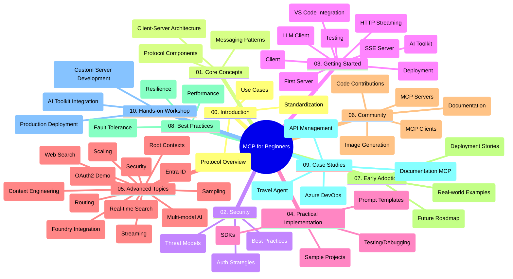

<!--
CO_OP_TRANSLATOR_METADATA:
{
  "original_hash": "5f321ea583cf087a94e47ee74c62b504",
  "translation_date": "2025-07-17T09:38:23+00:00",
  "source_file": "study_guide.md",
  "language_code": "fa"
}
-->
# پروتکل مدل کانتکست (MCP) برای مبتدیان - راهنمای مطالعه

این راهنمای مطالعه نمای کلی از ساختار و محتوای مخزن مربوط به دوره «پروتکل مدل کانتکست (MCP) برای مبتدیان» را ارائه می‌دهد. از این راهنما برای پیمایش مؤثر در مخزن و بهره‌برداری بهتر از منابع موجود استفاده کنید.

## نمای کلی مخزن

پروتکل مدل کانتکست (MCP) چارچوبی استاندارد برای تعاملات بین مدل‌های هوش مصنوعی و برنامه‌های کلاینت است. این پروتکل که ابتدا توسط Anthropic ایجاد شده، اکنون توسط جامعه گسترده‌تر MCP از طریق سازمان رسمی گیت‌هاب نگهداری می‌شود. این مخزن یک دوره جامع با مثال‌های کدنویسی عملی در زبان‌های C#، Java، JavaScript، Python و TypeScript ارائه می‌دهد که برای توسعه‌دهندگان هوش مصنوعی، معماران سیستم و مهندسان نرم‌افزار طراحی شده است.

## نقشه تصویری دوره

## ساختار مخزن

مخزن به ده بخش اصلی تقسیم شده است که هر کدام به جنبه‌های مختلف MCP می‌پردازند:

1. **مقدمه (00-Introduction/)**  
   - معرفی پروتکل مدل کانتکست  
   - اهمیت استانداردسازی در زنجیره‌های هوش مصنوعی  
   - موارد کاربرد عملی و مزایا  

2. **مفاهیم اصلی (01-CoreConcepts/)**  
   - معماری کلاینت-سرور  
   - اجزای کلیدی پروتکل  
   - الگوهای پیام‌رسانی در MCP  

3. **امنیت (02-Security/)**  
   - تهدیدات امنیتی در سیستم‌های مبتنی بر MCP  
   - بهترین روش‌ها برای ایمن‌سازی پیاده‌سازی‌ها  
   - استراتژی‌های احراز هویت و مجوزدهی  

4. **شروع کار (03-GettingStarted/)**  
   - راه‌اندازی و پیکربندی محیط  
   - ایجاد سرورها و کلاینت‌های پایه MCP  
   - ادغام با برنامه‌های موجود  
   - شامل بخش‌هایی برای:  
     - پیاده‌سازی اولین سرور  
     - توسعه کلاینت  
     - ادغام کلاینت LLM  
     - ادغام با VS Code  
     - سرور رویدادهای ارسال شده از سرور (SSE)  
     - استریمینگ HTTP  
     - ادغام با AI Toolkit  
     - استراتژی‌های تست  
     - راهنمای استقرار  

5. **پیاده‌سازی عملی (04-PracticalImplementation/)**  
   - استفاده از SDKها در زبان‌های برنامه‌نویسی مختلف  
   - تکنیک‌های اشکال‌زدایی، تست و اعتبارسنجی  
   - طراحی قالب‌ها و جریان‌های کاری قابل استفاده مجدد  
   - پروژه‌های نمونه با مثال‌های پیاده‌سازی  

6. **موضوعات پیشرفته (05-AdvancedTopics/)**  
   - تکنیک‌های مهندسی کانتکست  
   - ادغام عامل Foundry  
   - جریان‌های کاری چندرسانه‌ای هوش مصنوعی  
   - دموهای احراز هویت OAuth2  
   - قابلیت‌های جستجوی بلادرنگ  
   - استریمینگ بلادرنگ  
   - پیاده‌سازی کانتکست‌های ریشه  
   - استراتژی‌های مسیریابی  
   - تکنیک‌های نمونه‌گیری  
   - رویکردهای مقیاس‌پذیری  
   - ملاحظات امنیتی  
   - ادغام امنیتی Entra ID  
   - ادغام جستجوی وب  

7. **مشارکت‌های جامعه (06-CommunityContributions/)**  
   - نحوه مشارکت در کد و مستندات  
   - همکاری از طریق گیت‌هاب  
   - بهبودها و بازخوردهای مبتنی بر جامعه  
   - استفاده از کلاینت‌های مختلف MCP (Claude Desktop، Cline، VSCode)  
   - کار با سرورهای محبوب MCP از جمله تولید تصویر  

8. **درس‌هایی از پذیرش اولیه (07-LessonsfromEarlyAdoption/)**  
   - پیاده‌سازی‌های واقعی و داستان‌های موفقیت  
   - ساخت و استقرار راه‌حل‌های مبتنی بر MCP  
   - روندها و نقشه راه آینده  

9. **بهترین شیوه‌ها (08-BestPractices/)**  
   - بهینه‌سازی عملکرد و تنظیمات  
   - طراحی سیستم‌های MCP مقاوم در برابر خطا  
   - استراتژی‌های تست و تاب‌آوری  

10. **مطالعات موردی (09-CaseStudy/)**  
    - مطالعه موردی: ادغام Azure API Management  
    - مطالعه موردی: پیاده‌سازی آژانس مسافرتی  
    - مطالعه موردی: ادغام Azure DevOps با YouTube  
    - مثال‌های پیاده‌سازی با مستندات دقیق  

11. **کارگاه عملی (10-StreamliningAIWorkflowsBuildingAnMCPServerWithAIToolkit/)**  
    - کارگاه جامع عملی ترکیب MCP با AI Toolkit  
    - ساخت برنامه‌های هوشمند که مدل‌های هوش مصنوعی را با ابزارهای دنیای واقعی پیوند می‌دهند  
    - ماژول‌های عملی شامل مبانی، توسعه سرور سفارشی و استراتژی‌های استقرار در تولید  
    - رویکرد یادگیری مبتنی بر آزمایشگاه با دستورالعمل‌های گام به گام  

## منابع اضافی

مخزن شامل منابع پشتیبانی زیر است:

- **پوشه تصاویر**: شامل نمودارها و تصاویر استفاده شده در سراسر دوره  
- **ترجمه‌ها**: پشتیبانی چندزبانه با ترجمه‌های خودکار مستندات  
- **منابع رسمی MCP**:  
  - [مستندات MCP](https://modelcontextprotocol.io/)  
  - [مشخصات MCP](https://spec.modelcontextprotocol.io/)  
  - [مخزن گیت‌هاب MCP](https://github.com/modelcontextprotocol)  

## نحوه استفاده از این مخزن

1. **یادگیری متوالی**: فصل‌ها را به ترتیب (از 00 تا 10) دنبال کنید تا تجربه یادگیری ساختاریافته‌ای داشته باشید.  
2. **تمرکز بر زبان خاص**: اگر به زبان برنامه‌نویسی خاصی علاقه‌مندید، دایرکتوری نمونه‌ها را برای پیاده‌سازی‌ها در زبان مورد نظر خود بررسی کنید.  
3. **پیاده‌سازی عملی**: با بخش «شروع کار» شروع کنید تا محیط خود را راه‌اندازی کرده و اولین سرور و کلاینت MCP خود را بسازید.  
4. **کاوش پیشرفته**: پس از آشنایی با مبانی، به موضوعات پیشرفته بپردازید تا دانش خود را گسترش دهید.  
5. **تعامل با جامعه**: از طریق بحث‌های گیت‌هاب و کانال‌های Discord به جامعه MCP بپیوندید تا با کارشناسان و توسعه‌دهندگان دیگر ارتباط برقرار کنید.  

## کلاینت‌ها و ابزارهای MCP

دوره شامل کلاینت‌ها و ابزارهای مختلف MCP است:

1. **کلاینت‌های رسمی**:  
   - Visual Studio Code  
   - MCP در Visual Studio Code  
   - Claude Desktop  
   - Claude در VSCode  
   - Claude API  

2. **کلاینت‌های جامعه**:  
   - Cline (مبتنی بر ترمینال)  
   - Cursor (ویرایشگر کد)  
   - ChatMCP  
   - Windsurf  

3. **ابزارهای مدیریت MCP**:  
   - MCP CLI  
   - MCP Manager  
   - MCP Linker  
   - MCP Router  

## سرورهای محبوب MCP

مخزن سرورهای مختلف MCP را معرفی می‌کند، از جمله:

1. **سرورهای مرجع رسمی**:  
   - Filesystem  
   - Fetch  
   - Memory  
   - Sequential Thinking  

2. **تولید تصویر**:  
   - Azure OpenAI DALL-E 3  
   - Stable Diffusion WebUI  
   - Replicate  

3. **ابزارهای توسعه**:  
   - Git MCP  
   - Terminal Control  
   - Code Assistant  

4. **سرورهای تخصصی**:  
   - Salesforce  
   - Microsoft Teams  
   - Jira & Confluence  

## مشارکت

این مخزن از مشارکت‌های جامعه استقبال می‌کند. برای راهنمایی در مورد نحوه مشارکت مؤثر در اکوسیستم MCP به بخش مشارکت‌های جامعه مراجعه کنید.

## تغییرات

| تاریخ | تغییرات |
|-------|---------|
| ۱۶ ژوئیه ۲۰۲۵ | - به‌روزرسانی ساختار مخزن برای بازتاب محتوای فعلی - افزودن بخش کلاینت‌ها و ابزارهای MCP - افزودن بخش سرورهای محبوب MCP - به‌روزرسانی نقشه تصویری دوره با تمام موضوعات فعلی - تقویت بخش موضوعات پیشرفته با تمام حوزه‌های تخصصی - به‌روزرسانی مطالعات موردی با نمونه‌های واقعی - روشن‌سازی اینکه MCP توسط Anthropic ایجاد شده است |
| ۱۱ ژوئن ۲۰۲۵ | - ایجاد اولیه راهنمای مطالعه - افزودن نقشه تصویری دوره - ترسیم ساختار مخزن - افزودن پروژه‌های نمونه و منابع اضافی |

---

*این راهنمای مطالعه در تاریخ ۱۶ ژوئیه ۲۰۲۵ به‌روزرسانی شده و نمای کلی مخزن تا آن تاریخ را ارائه می‌دهد. محتوای مخزن ممکن است پس از این تاریخ به‌روزرسانی شود.*

**سلب مسئولیت**:  
این سند با استفاده از سرویس ترجمه هوش مصنوعی [Co-op Translator](https://github.com/Azure/co-op-translator) ترجمه شده است. در حالی که ما در تلاش برای دقت هستیم، لطفاً توجه داشته باشید که ترجمه‌های خودکار ممکن است حاوی خطاها یا نواقصی باشند. سند اصلی به زبان بومی خود باید به عنوان منبع معتبر در نظر گرفته شود. برای اطلاعات حیاتی، ترجمه حرفه‌ای انسانی توصیه می‌شود. ما مسئول هیچ گونه سوءتفاهم یا تفسیر نادرستی که از استفاده این ترجمه ناشی شود، نیستیم.