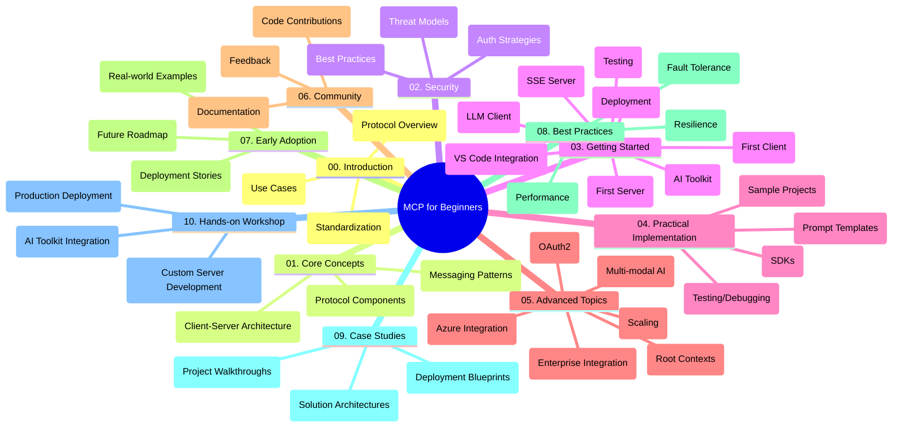

<!--
CO_OP_TRANSLATOR_METADATA:
{
  "original_hash": "a607d4febc94caee9a12b77795f7fc9a",
  "translation_date": "2025-06-11T16:36:56+00:00",
  "source_file": "study_guide.md",
  "language_code": "fa"
}
-->
# مدل پروتکل زمینه (MCP) برای مبتدیان - راهنمای مطالعه

این راهنمای مطالعه نمای کلی از ساختار و محتوای مخزن برای دوره «مدل پروتکل زمینه (MCP) برای مبتدیان» را ارائه می‌دهد. از این راهنما برای پیمایش مؤثر در مخزن و بهره‌برداری بهینه از منابع موجود استفاده کنید.

## نمای کلی مخزن

مدل پروتکل زمینه (MCP) چارچوبی استاندارد برای تعاملات بین مدل‌های هوش مصنوعی و برنامه‌های کلاینت است. این مخزن یک دوره جامع با نمونه‌های کد عملی در زبان‌های C#، Java، JavaScript، Python و TypeScript ارائه می‌دهد که برای توسعه‌دهندگان هوش مصنوعی، معماران سیستم و مهندسان نرم‌افزار طراحی شده است.

## نقشه تصویری دوره

## ساختار مخزن

مخزن به ده بخش اصلی تقسیم شده است که هر کدام بر جنبه‌های مختلف MCP تمرکز دارند:

1. **مقدمه (00-Introduction/)**  
   - نمای کلی مدل پروتکل زمینه  
   - اهمیت استانداردسازی در خطوط لوله هوش مصنوعی  
   - موارد کاربرد عملی و مزایا  

2. **مفاهیم اصلی (01-CoreConcepts/)**  
   - معماری کلاینت-سرور  
   - اجزای کلیدی پروتکل  
   - الگوهای پیام‌رسانی در MCP  

3. **امنیت (02-Security/)**  
   - تهدیدات امنیتی در سیستم‌های مبتنی بر MCP  
   - بهترین روش‌ها برای ایمن‌سازی پیاده‌سازی‌ها  
   - استراتژی‌های احراز هویت و مجوزدهی  

4. **شروع به کار (03-GettingStarted/)**  
   - راه‌اندازی و پیکربندی محیط  
   - ایجاد سرور و کلاینت‌های پایه MCP  
   - یکپارچه‌سازی با برنامه‌های موجود  
   - بخش‌های فرعی برای اولین سرور، اولین کلاینت، کلاینت LLM، ادغام با VS Code، سرور SSE، کیت ابزار هوش مصنوعی، تست و استقرار  

5. **پیاده‌سازی عملی (04-PracticalImplementation/)**  
   - استفاده از SDKها در زبان‌های برنامه‌نویسی مختلف  
   - روش‌های اشکال‌زدایی، تست و اعتبارسنجی  
   - ساخت قالب‌ها و جریان‌های کاری قابل استفاده مجدد  
   - پروژه‌های نمونه با مثال‌های پیاده‌سازی  

6. **موضوعات پیشرفته (05-AdvancedTopics/)**  
   - جریان‌های کاری چندرسانه‌ای هوش مصنوعی و قابلیت گسترش  
   - استراتژی‌های مقیاس‌بندی امن  
   - MCP در اکوسیستم‌های سازمانی  
   - موضوعات تخصصی شامل ادغام Azure، چندرسانه‌ای، OAuth2، زمینه‌های ریشه‌ای، مسیریابی، نمونه‌برداری، مقیاس‌بندی، امنیت، ادغام جستجوی وب و پخش زنده  

7. **مشارکت‌های جامعه (06-CommunityContributions/)**  
   - نحوه مشارکت در کد و مستندسازی  
   - همکاری از طریق GitHub  
   - بهبودها و بازخوردهای مبتنی بر جامعه  

8. **درس‌هایی از پذیرش اولیه (07-LessonsfromEarlyAdoption/)**  
   - پیاده‌سازی‌ها و داستان‌های موفقیت واقعی  
   - ساخت و استقرار راه‌حل‌های مبتنی بر MCP  
   - روندها و نقشه راه آینده  

9. **بهترین روش‌ها (08-BestPractices/)**  
   - بهینه‌سازی عملکرد و تنظیم  
   - طراحی سیستم‌های MCP مقاوم در برابر خطا  
   - استراتژی‌های تست و تاب‌آوری  

10. **مطالعات موردی (09-CaseStudy/)**  
    - بررسی عمیق معماری‌های راه‌حل MCP  
    - نقشه‌های استقرار و نکات ادغام  
    - نمودارهای حاشیه‌نویسی شده و مرور پروژه  

11. **کارگاه عملی (10-StreamliningAIWorkflowsBuildingAnMCPServerWithAIToolkit/)**  
    - کارگاه جامع عملی ترکیب MCP با کیت ابزار هوش مصنوعی مایکروسافت برای VS Code  
    - ساخت برنامه‌های هوشمند که مدل‌های هوش مصنوعی را با ابزارهای دنیای واقعی پیوند می‌دهند  
    - ماژول‌های عملی شامل اصول پایه، توسعه سرور سفارشی و استراتژی‌های استقرار در تولید  

## پروژه‌های نمونه

مخزن شامل چندین پروژه نمونه است که پیاده‌سازی MCP را در زبان‌های برنامه‌نویسی مختلف نشان می‌دهد:

### نمونه‌های پایه ماشین‌حساب MCP  
- نمونه سرور MCP در C#  
- ماشین‌حساب MCP در Java  
- دمو MCP در JavaScript  
- سرور MCP در Python  
- نمونه MCP در TypeScript  

### پروژه‌های پیشرفته ماشین‌حساب MCP  
- نمونه پیشرفته C#  
- نمونه اپلیکیشن کانتینری Java  
- نمونه پیشرفته JavaScript  
- پیاده‌سازی پیچیده Python  
- نمونه کانتینری TypeScript  

## منابع اضافی

مخزن شامل منابع پشتیبان است:

- **پوشه تصاویر**: شامل نمودارها و تصاویر استفاده شده در سراسر دوره  
- **ترجمه‌ها**: پشتیبانی چندزبانه با ترجمه‌های خودکار مستندات  
- **منابع رسمی MCP**:  
  - [مستندات MCP](https://modelcontextprotocol.io/)  
  - [مشخصات MCP](https://spec.modelcontextprotocol.io/)  
  - [مخزن GitHub MCP](https://github.com/modelcontextprotocol)  

## نحوه استفاده از این مخزن

1. **یادگیری پیوسته**: فصل‌ها را به ترتیب (از 00 تا 10) دنبال کنید تا تجربه یادگیری ساختارمند داشته باشید.  
2. **تمرکز بر زبان خاص**: اگر به زبان برنامه‌نویسی خاصی علاقه‌مندید، دایرکتوری نمونه‌ها را برای پیاده‌سازی‌ها در زبان مورد نظر خود بررسی کنید.  
3. **پیاده‌سازی عملی**: با بخش «شروع به کار» شروع کنید تا محیط خود را راه‌اندازی کرده و اولین سرور و کلاینت MCP را بسازید.  
4. **کاوش پیشرفته**: پس از آشنایی با مبانی، به موضوعات پیشرفته بپردازید تا دانش خود را گسترش دهید.  
5. **مشارکت جامعه**: به [دیسکورد Azure AI Foundry](https://discord.com/invite/ByRwuEEgH4) بپیوندید تا با کارشناسان و توسعه‌دهندگان دیگر ارتباط برقرار کنید.  

## مشارکت

این مخزن از مشارکت جامعه استقبال می‌کند. برای راهنمایی در مورد نحوه مشارکت به بخش مشارکت‌های جامعه مراجعه کنید.

---

*این راهنمای مطالعه در تاریخ ۱۱ ژوئن ۲۰۲۵ ایجاد شده و نمای کلی مخزن تا آن زمان را ارائه می‌دهد. محتوای مخزن ممکن است پس از آن به‌روزرسانی شده باشد.*

**سلب مسئولیت**:  
این سند با استفاده از سرویس ترجمه هوش مصنوعی [Co-op Translator](https://github.com/Azure/co-op-translator) ترجمه شده است. در حالی که ما در تلاش برای دقت هستیم، لطفاً توجه داشته باشید که ترجمه‌های خودکار ممکن است حاوی خطاها یا نادرستی‌هایی باشند. سند اصلی به زبان مادری آن باید به عنوان منبع معتبر در نظر گرفته شود. برای اطلاعات حیاتی، ترجمه حرفه‌ای انسانی توصیه می‌شود. ما مسئول هیچ گونه سوءتفاهم یا برداشت نادرستی که از استفاده از این ترجمه ناشی شود، نیستیم.