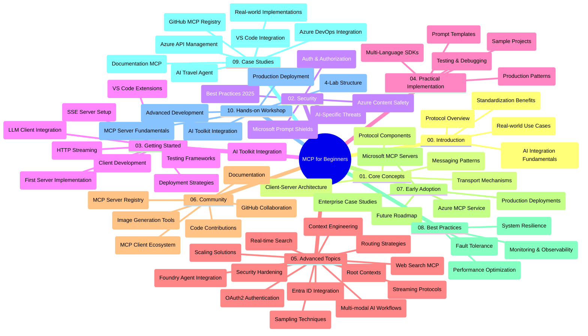

<!--
CO_OP_TRANSLATOR_METADATA:
{
  "original_hash": "719117a0a5f34ade7b5dfb61ee06fb13",
  "translation_date": "2025-09-26T17:43:00+00:00",
  "source_file": "study_guide.md",
  "language_code": "fa"
}
-->
# راهنمای مطالعه پروتکل زمینه مدل (MCP) برای مبتدیان

این راهنمای مطالعه یک مرور کلی از ساختار و محتوای مخزن برای برنامه آموزشی "پروتکل زمینه مدل (MCP) برای مبتدیان" ارائه می‌دهد. از این راهنما برای پیمایش مؤثر در مخزن و بهره‌برداری کامل از منابع موجود استفاده کنید.

## مرور کلی مخزن

پروتکل زمینه مدل (MCP) یک چارچوب استاندارد برای تعاملات بین مدل‌های هوش مصنوعی و برنامه‌های مشتری است. MCP که در ابتدا توسط Anthropic ایجاد شد، اکنون توسط جامعه گسترده MCP از طریق سازمان رسمی GitHub نگهداری می‌شود. این مخزن یک برنامه آموزشی جامع با مثال‌های کدنویسی عملی در زبان‌های C#، Java، JavaScript، Python و TypeScript ارائه می‌دهد که برای توسعه‌دهندگان هوش مصنوعی، معماران سیستم و مهندسان نرم‌افزار طراحی شده است.

## نقشه تصویری برنامه آموزشی

## ساختار مخزن

مخزن به ده بخش اصلی تقسیم شده است که هر کدام بر جنبه‌های مختلف MCP تمرکز دارند:

1. **مقدمه (00-Introduction/)**
   - مرور کلی پروتکل زمینه مدل
   - اهمیت استانداردسازی در خطوط لوله هوش مصنوعی
   - موارد استفاده عملی و مزایا

2. **مفاهیم اصلی (01-CoreConcepts/)**
   - معماری مشتری-سرور
   - اجزای کلیدی پروتکل
   - الگوهای پیام‌رسانی در MCP

3. **امنیت (02-Security/)**
   - تهدیدات امنیتی در سیستم‌های مبتنی بر MCP
   - بهترین روش‌ها برای ایمن‌سازی پیاده‌سازی‌ها
   - استراتژی‌های احراز هویت و مجوز
   - **مستندات جامع امنیت**:
     - بهترین روش‌های امنیتی MCP 2025
     - راهنمای پیاده‌سازی ایمنی محتوا در Azure
     - کنترل‌ها و تکنیک‌های امنیتی MCP
     - مرجع سریع بهترین روش‌های MCP
   - **موضوعات کلیدی امنیت**:
     - حملات تزریق درخواست و مسمومیت ابزار
     - ربودن جلسه و مشکلات نماینده گیج
     - آسیب‌پذیری‌های عبور توکن
     - مجوزهای بیش از حد و کنترل دسترسی
     - امنیت زنجیره تأمین برای اجزای هوش مصنوعی
     - یکپارچه‌سازی Microsoft Prompt Shields

4. **شروع کار (03-GettingStarted/)**
   - تنظیم و پیکربندی محیط
   - ایجاد سرورها و مشتری‌های اولیه MCP
   - یکپارچه‌سازی با برنامه‌های موجود
   - شامل بخش‌هایی برای:
     - پیاده‌سازی اولین سرور
     - توسعه مشتری
     - یکپارچه‌سازی مشتری LLM
     - یکپارچه‌سازی VS Code
     - سرور رویدادهای ارسال‌شده توسط سرور (SSE)
     - جریان HTTP
     - یکپارچه‌سازی ابزار هوش مصنوعی
     - استراتژی‌های تست
     - دستورالعمل‌های استقرار

5. **پیاده‌سازی عملی (04-PracticalImplementation/)**
   - استفاده از SDKها در زبان‌های برنامه‌نویسی مختلف
   - تکنیک‌های اشکال‌زدایی، تست و اعتبارسنجی
   - طراحی قالب‌های درخواست و جریان‌های کاری قابل استفاده مجدد
   - پروژه‌های نمونه با مثال‌های پیاده‌سازی

6. **موضوعات پیشرفته (05-AdvancedTopics/)**
   - تکنیک‌های مهندسی زمینه
   - یکپارچه‌سازی عامل Foundry
   - جریان‌های کاری چند‌مدلی هوش مصنوعی
   - نمایش‌های احراز هویت OAuth2
   - قابلیت‌های جستجوی بلادرنگ
   - جریان بلادرنگ
   - پیاده‌سازی زمینه‌های ریشه
   - استراتژی‌های مسیریابی
   - تکنیک‌های نمونه‌گیری
   - رویکردهای مقیاس‌پذیری
   - ملاحظات امنیتی
   - یکپارچه‌سازی امنیت Entra ID
   - یکپارچه‌سازی جستجوی وب

7. **مشارکت‌های جامعه (06-CommunityContributions/)**
   - نحوه مشارکت در کد و مستندات
   - همکاری از طریق GitHub
   - بهبودها و بازخوردهای جامعه‌محور
   - استفاده از مشتری‌های مختلف MCP (Claude Desktop، Cline، VSCode)
   - کار با سرورهای محبوب MCP از جمله تولید تصویر

8. **درس‌هایی از پذیرش اولیه (07-LessonsfromEarlyAdoption/)**
   - پیاده‌سازی‌های واقعی و داستان‌های موفقیت
   - ساخت و استقرار راه‌حل‌های مبتنی بر MCP
   - روندها و نقشه راه آینده
   - **راهنمای سرورهای MCP مایکروسافت**: راهنمای جامع برای 10 سرور MCP آماده تولید مایکروسافت شامل:
     - سرور MCP مستندات Microsoft Learn
     - سرور MCP Azure (بیش از 15 اتصال تخصصی)
     - سرور MCP GitHub
     - سرور MCP Azure DevOps
     - سرور MCP MarkItDown
     - سرور MCP SQL Server
     - سرور MCP Playwright
     - سرور MCP Dev Box
     - سرور MCP Azure AI Foundry
     - سرور MCP ابزارهای عامل Microsoft 365

9. **بهترین روش‌ها (08-BestPractices/)**
   - تنظیم عملکرد و بهینه‌سازی
   - طراحی سیستم‌های MCP مقاوم در برابر خطا
   - استراتژی‌های تست و تاب‌آوری

10. **مطالعات موردی (09-CaseStudy/)**
    - **هفت مطالعه موردی جامع** که تطبیق‌پذیری MCP را در سناریوهای مختلف نشان می‌دهد:
    - **نمایندگان سفر هوش مصنوعی Azure**: ارکستراسیون چند‌عاملی با Azure OpenAI و جستجوی هوش مصنوعی
    - **یکپارچه‌سازی Azure DevOps**: خودکارسازی فرآیندهای جریان کاری با به‌روزرسانی داده‌های YouTube
    - **بازیابی مستندات بلادرنگ**: مشتری کنسول Python با جریان HTTP
    - **تولیدکننده برنامه مطالعه تعاملی**: برنامه وب Chainlit با هوش مصنوعی مکالمه‌ای
    - **مستندات درون ویرایشگر**: یکپارچه‌سازی VS Code با جریان‌های کاری GitHub Copilot
    - **مدیریت API Azure**: یکپارچه‌سازی API سازمانی با ایجاد سرور MCP
    - **ثبت MCP GitHub**: توسعه اکوسیستم و پلتفرم یکپارچه‌سازی عامل
    - مثال‌های پیاده‌سازی شامل یکپارچه‌سازی سازمانی، بهره‌وری توسعه‌دهنده و توسعه اکوسیستم

11. **کارگاه عملی (10-StreamliningAIWorkflowsBuildingAnMCPServerWithAIToolkit/)**
    - کارگاه عملی جامع ترکیب MCP با ابزار هوش مصنوعی
    - ساخت برنامه‌های هوشمند که مدل‌های هوش مصنوعی را با ابزارهای دنیای واقعی پیوند می‌دهد
    - ماژول‌های عملی که اصول، توسعه سرور سفارشی و استراتژی‌های استقرار تولید را پوشش می‌دهند
    - **ساختار آزمایشگاه**:
      - آزمایشگاه 1: اصول سرور MCP
      - آزمایشگاه 2: توسعه پیشرفته سرور MCP
      - آزمایشگاه 3: یکپارچه‌سازی ابزار هوش مصنوعی
      - آزمایشگاه 4: استقرار تولید و مقیاس‌پذیری
    - رویکرد یادگیری مبتنی بر آزمایشگاه با دستورالعمل‌های گام‌به‌گام

## منابع اضافی

مخزن شامل منابع پشتیبانی‌کننده است:

- **پوشه تصاویر**: شامل نمودارها و تصاویر استفاده‌شده در سراسر برنامه آموزشی
- **ترجمه‌ها**: پشتیبانی چندزبانه با ترجمه‌های خودکار مستندات
- **منابع رسمی MCP**:
  - [مستندات MCP](https://modelcontextprotocol.io/)
  - [مشخصات MCP](https://spec.modelcontextprotocol.io/)
  - [مخزن GitHub MCP](https://github.com/modelcontextprotocol)

## نحوه استفاده از این مخزن

1. **یادگیری ترتیبی**: فصل‌ها را به ترتیب (00 تا 10) دنبال کنید تا تجربه یادگیری ساختاریافته‌ای داشته باشید.
2. **تمرکز بر زبان خاص**: اگر به یک زبان برنامه‌نویسی خاص علاقه دارید، دایرکتوری‌های نمونه را برای پیاده‌سازی‌ها در زبان مورد نظر خود بررسی کنید.
3. **پیاده‌سازی عملی**: با بخش "شروع کار" شروع کنید تا محیط خود را تنظیم کرده و اولین سرور و مشتری MCP خود را ایجاد کنید.
4. **کاوش پیشرفته**: پس از آشنایی با اصول، به موضوعات پیشرفته بپردازید تا دانش خود را گسترش دهید.
5. **تعامل جامعه**: از طریق بحث‌های GitHub و کانال‌های Discord به جامعه MCP بپیوندید تا با کارشناسان و توسعه‌دهندگان دیگر ارتباط برقرار کنید.

## مشتری‌ها و ابزارهای MCP

برنامه آموزشی مشتری‌ها و ابزارهای مختلف MCP را پوشش می‌دهد:

1. **مشتری‌های رسمی**:
   - Visual Studio Code
   - MCP در Visual Studio Code
   - Claude Desktop
   - Claude در VSCode
   - Claude API

2. **مشتری‌های جامعه**:
   - Cline (مبتنی بر ترمینال)
   - Cursor (ویرایشگر کد)
   - ChatMCP
   - Windsurf

3. **ابزارهای مدیریت MCP**:
   - MCP CLI
   - MCP Manager
   - MCP Linker
   - MCP Router

## سرورهای محبوب MCP

مخزن سرورهای مختلف MCP را معرفی می‌کند، از جمله:

1. **سرورهای رسمی MCP مایکروسافت**:
   - سرور MCP مستندات Microsoft Learn
   - سرور MCP Azure (بیش از 15 اتصال تخصصی)
   - سرور MCP GitHub
   - سرور MCP Azure DevOps
   - سرور MCP MarkItDown
   - سرور MCP SQL Server
   - سرور MCP Playwright
   - سرور MCP Dev Box
   - سرور MCP Azure AI Foundry
   - سرور MCP ابزارهای عامل Microsoft 365

2. **سرورهای مرجع رسمی**:
   - Filesystem
   - Fetch
   - Memory
   - Sequential Thinking

3. **تولید تصویر**:
   - Azure OpenAI DALL-E 3
   - Stable Diffusion WebUI
   - Replicate

4. **ابزارهای توسعه**:
   - Git MCP
   - کنترل ترمینال
   - دستیار کد

5. **سرورهای تخصصی**:
   - Salesforce
   - Microsoft Teams
   - Jira & Confluence

## مشارکت

این مخزن از مشارکت‌های جامعه استقبال می‌کند. بخش مشارکت‌های جامعه را برای راهنمایی در مورد نحوه مشارکت مؤثر در اکوسیستم MCP مشاهده کنید.

## تغییرات

| تاریخ | تغییرات |
|------|---------|
| 26 سپتامبر 2025 | - اضافه شدن مطالعه موردی ثبت MCP GitHub به بخش 09-CaseStudy - به‌روزرسانی مطالعات موردی برای انعکاس هفت مطالعه موردی جامع - بهبود توضیحات مطالعات موردی با جزئیات پیاده‌سازی خاص - به‌روزرسانی نقشه تصویری برنامه آموزشی برای شامل کردن ثبت MCP GitHub - بازنگری ساختار راهنمای مطالعه برای انعکاس تمرکز توسعه اکوسیستم |
| 18 ژوئیه 2025 | - به‌روزرسانی ساختار مخزن برای شامل کردن راهنمای سرورهای MCP مایکروسافت - اضافه شدن لیست جامع 10 سرور MCP آماده تولید مایکروسافت - بهبود بخش سرورهای محبوب MCP با سرورهای رسمی MCP مایکروسافت - به‌روزرسانی بخش مطالعات موردی با مثال‌های واقعی فایل - اضافه شدن جزئیات ساختار آزمایشگاه برای کارگاه عملی |
| 16 ژوئیه 2025 | - به‌روزرسانی ساختار مخزن برای انعکاس محتوای فعلی - اضافه شدن بخش مشتری‌ها و ابزارهای MCP - اضافه شدن بخش سرورهای محبوب MCP - به‌روزرسانی نقشه تصویری برنامه آموزشی با تمام موضوعات فعلی - بهبود بخش موضوعات پیشرفته با تمام حوزه‌های تخصصی - به‌روزرسانی مطالعات موردی برای انعکاس مثال‌های واقعی - روشن شدن منشأ MCP به عنوان ایجاد شده توسط Anthropic |
| 11 ژوئن 2025 | - ایجاد اولیه راهنمای مطالعه - اضافه شدن نقشه تصویری برنامه آموزشی - طرح کلی ساختار مخزن - شامل پروژه‌های نمونه و منابع اضافی |

---

*این راهنمای مطالعه در تاریخ 26 سپتامبر 2025 به‌روزرسانی شده و مرور کلی مخزن را تا آن تاریخ ارائه می‌دهد. محتوای مخزن ممکن است پس از این تاریخ به‌روزرسانی شود.*

---

