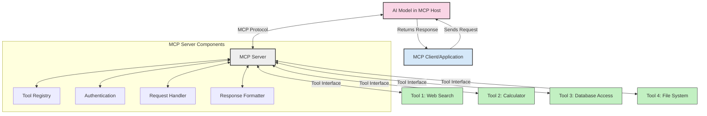
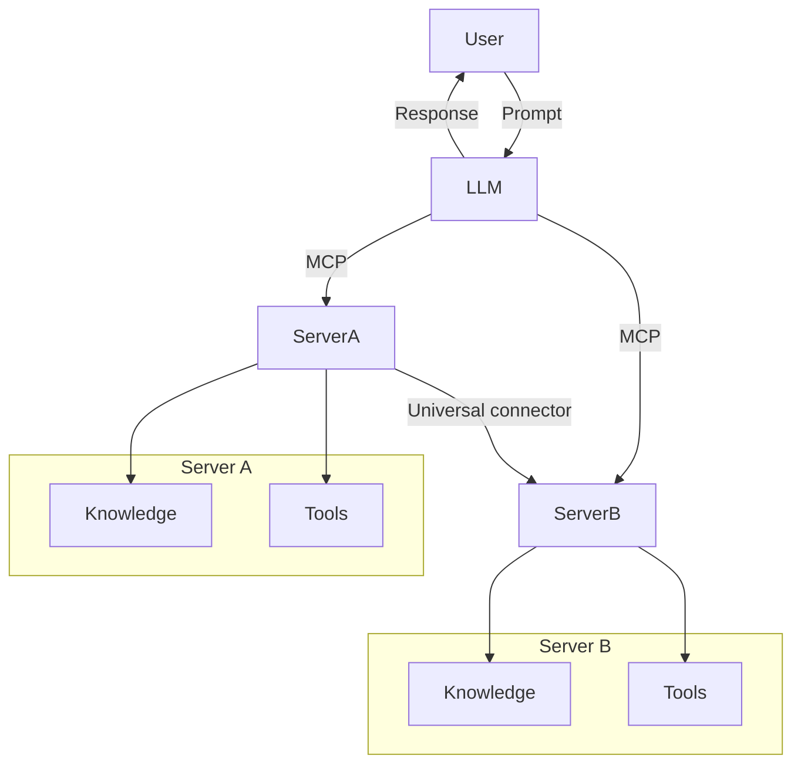

<!--
CO_OP_TRANSLATOR_METADATA:
{
  "original_hash": "02301140adbd807ecf0f17720fa307bc",
  "translation_date": "2025-05-17T06:04:02+00:00",
  "source_file": "00-Introduction/README.md",
  "language_code": "fi"
}
-->
# Johdatus Model Context Protocoliin (MCP): Miksi Se On Tärkeä Skaalautuville AI-sovelluksille

Generatiiviset AI-sovellukset ovat merkittävä edistysaskel, sillä ne mahdollistavat usein käyttäjän vuorovaikutuksen sovelluksen kanssa luonnollisen kielen avulla. Kuitenkin, kun näihin sovelluksiin investoidaan enemmän aikaa ja resursseja, haluat varmistaa, että voit helposti integroida toiminnallisuuksia ja resursseja siten, että niiden laajentaminen on helppoa, että sovelluksesi voi palvella useampaa kuin yhtä mallia ja sen monimutkaisuuksia. Lyhyesti sanottuna, Gen AI -sovellusten rakentaminen on aluksi helppoa, mutta kun ne kasvavat ja muuttuvat monimutkaisemmiksi, sinun on alettava määritellä arkkitehtuuri ja todennäköisesti turvauduttava standardiin varmistaaksesi, että sovelluksesi rakennetaan johdonmukaisesti. Tässä kohtaa MCP tulee mukaan järjestämään asioita ja tarjoamaan standardin.

---

## **🔍 Mikä on Model Context Protocol (MCP)?**

**Model Context Protocol (MCP)** on **avoin, standardoitu rajapinta**, joka mahdollistaa suurten kielimallien (LLM) saumattoman vuorovaikutuksen ulkoisten työkalujen, API:iden ja tietolähteiden kanssa. Se tarjoaa johdonmukaisen arkkitehtuurin, joka parantaa AI-mallien toiminnallisuutta niiden koulutusdatan ulkopuolella, mahdollistaen älykkäämmät, skaalautuvat ja reagoivammat AI-järjestelmät.

---

## **🎯 Miksi standardointi on tärkeää tekoälyssä**

Kun generatiiviset AI-sovellukset monimutkaistuvat, on tärkeää omaksua standardeja, jotka takaavat **skaalautuvuuden, laajennettavuuden** ja **ylläpidettävyyden**. MCP vastaa näihin tarpeisiin:

- Yhdistämällä mallien ja työkalujen integraatiot
- Vähentämällä hauraiden, kertaluonteisten mukautettujen ratkaisujen tarvetta
- Mahdollistamalla useiden mallien rinnakkaiselon yhdessä ekosysteemissä

---

## **📚 Oppimistavoitteet**

Tämän artikkelin lopussa pystyt:

- Määrittelemään **Model Context Protocolin (MCP)** ja sen käyttötapaukset
- Ymmärtämään, miten MCP standardoi mallin ja työkalujen välisen viestinnän
- Tunnistamaan MCP-arkkitehtuurin keskeiset osat
- Tutustumaan MCP:n todellisiin sovelluksiin yritys- ja kehitysympäristöissä

---

## **💡 Miksi Model Context Protocol (MCP) on merkittävä uudistus**

### **🔗 MCP ratkaisee AI-vuorovaikutuksen pirstoutumisen**

Ennen MCP:tä mallien integrointi työkaluihin vaati:

- Mukautettua koodia jokaiselle työkalu-malliparille
- Ei-standardisoituja API:ita jokaiselle toimittajalle
- Toistuvia katkoja päivitysten vuoksi
- Huonoa skaalautuvuutta lisääntyvien työkalujen kanssa

### **✅ MCP-standardoinnin edut**

| **Etu**                    | **Kuvaus**                                                                     |
|----------------------------|--------------------------------------------------------------------------------|
| Yhteentoimivuus            | LLM:t toimivat saumattomasti eri toimittajien työkalujen kanssa                |
| Johdonmukaisuus            | Yhtenäinen käyttäytyminen eri alustoilla ja työkaluilla                        |
| Uudelleenkäytettävyys      | Kerran rakennetut työkalut voidaan käyttää eri projekteissa ja järjestelmissä  |
| Kehityksen nopeuttaminen   | Vähentää kehitysaikaa käyttämällä standardoituja, plug-and-play-rajapintoja    |

---

## **🧱 MCP-arkkitehtuurin yleiskatsaus**

MCP noudattaa **asiakas-palvelin-mallia**, jossa:

- **MCP-isännät** ajavat AI-malleja
- **MCP-asiakkaat** tekevät pyyntöjä
- **MCP-palvelimet** tarjoavat kontekstia, työkaluja ja ominaisuuksia

### **Keskeiset komponentit:**

- **Resurssit** – Staattinen tai dynaaminen data malleille  
- **Kehotteet** – Ennalta määritellyt työnkulut ohjattuun generointiin  
- **Työkalut** – Suoritettavat toiminnot kuten haku, laskenta  
- **Näytteenotto** – Agenttimainen käyttäytyminen rekursiivisten vuorovaikutusten kautta

---

## Miten MCP-palvelimet toimivat

MCP-palvelimet toimivat seuraavasti:

- **Pyyntövirta**: 
    1. MCP-asiakas lähettää pyynnön AI-mallille, joka toimii MCP-isännässä.
    2. AI-malli tunnistaa, milloin se tarvitsee ulkoisia työkaluja tai dataa.
    3. Malli kommunikoi MCP-palvelimen kanssa käyttäen standardoitua protokollaa.

- **MCP-palvelimen toiminnallisuus**:
    - Työkalurekisteri: Ylläpitää luetteloa käytettävissä olevista työkaluista ja niiden ominaisuuksista.
    - Autentikointi: Varmistaa työkalujen käyttöoikeudet.
    - Pyyntöjen käsittelijä: Käsittelee mallin tekemät työkalupyynnöt.
    - Vastausmuotoilija: Jäsentää työkalujen tuotokset mallin ymmärtämään muotoon.

- **Työkalujen suoritus**: 
    - Palvelin ohjaa pyynnöt asianmukaisille ulkoisille työkaluille
    - Työkalut suorittavat erikoistuneita toimintojaan (haku, laskenta, tietokantakyselyt jne.)
    - Tulokset palautetaan mallille yhtenäisessä muodossa.

- **Vastauksen täydentäminen**: 
    - AI-malli sisällyttää työkalujen tuotokset vastaukseensa.
    - Lopullinen vastaus lähetetään takaisin asiakassovellukselle.

## 👨‍💻 Miten rakentaa MCP-palvelin (esimerkkien kanssa)

MCP-palvelimet mahdollistavat LLM:ien kykyjen laajentamisen tarjoamalla dataa ja toiminnallisuutta. 

Valmis kokeilemaan? Tässä esimerkkejä yksinkertaisen MCP-palvelimen luomisesta eri kielillä:

- **Python-esimerkki**: https://github.com/modelcontextprotocol/python-sdk

- **TypeScript-esimerkki**: https://github.com/modelcontextprotocol/typescript-sdk

- **Java-esimerkki**: https://github.com/modelcontextprotocol/java-sdk

- **C#/.NET-esimerkki**: https://github.com/modelcontextprotocol/csharp-sdk

## 🌍 MCP:n todelliset käyttötapaukset

MCP mahdollistaa laajan valikoiman sovelluksia laajentamalla AI:n kykyjä:

| **Sovellus**                | **Kuvaus**                                                                     |
|-----------------------------|--------------------------------------------------------------------------------|
| Yritysdatan integrointi     | Yhdistä LLM:t tietokantoihin, CRM:iin tai sisäisiin työkaluihin                |
| Agenttiset AI-järjestelmät  | Mahdollista autonomiset agentit työkalujen käytöllä ja päätöksentekotyönkuluilla |
| Monimodaaliset sovellukset  | Yhdistä teksti-, kuva- ja äänityökalut yhdeksi yhtenäiseksi AI-sovellukseksi    |
| Reaaliaikainen dataintegraatio | Tuo reaaliaikainen data AI-vuorovaikutuksiin tarkempien, ajankohtaisten tulosten saavuttamiseksi |

### 🧠 MCP = Universaali standardi AI-vuorovaikutuksille

Model Context Protocol (MCP) toimii universaalina standardina AI-vuorovaikutuksille, aivan kuten USB-C standardoi fyysiset liitännät laitteille. AI-maailmassa MCP tarjoaa johdonmukaisen rajapinnan, jonka avulla mallit (asiakkaat) voivat integroitua saumattomasti ulkoisten työkalujen ja tietotoimittajien (palvelimet) kanssa. Tämä poistaa tarpeen moninaisille, mukautetuille protokollille jokaiselle API:lle tai tietolähteelle.

MCP:ssä MCP-yhteensopiva työkalu (jota kutsutaan MCP-palvelimeksi) noudattaa yhtenäistä standardia. Nämä palvelimet voivat listata tarjoamansa työkalut tai toiminnot ja suorittaa nämä toiminnot, kun AI-agentti niitä pyytää. MCP:tä tukevat AI-agenttialustat pystyvät löytämään saatavilla olevat työkalut palvelimilta ja kutsumaan niitä tämän standardin mukaisesti.

### 💡 Tiedon saatavuuden helpottaminen

Työkalujen tarjoamisen lisäksi MCP helpottaa myös tiedon saatavuutta. Se mahdollistaa sovellusten tarjoavan kontekstia suurille kielimalleille (LLM) linkittämällä ne erilaisiin tietolähteisiin. Esimerkiksi MCP-palvelin voi edustaa yrityksen dokumenttivarastoa, jolloin agentit voivat hakea olennaista tietoa tarvittaessa. Toinen palvelin voi käsitellä erityisiä toimintoja, kuten sähköpostien lähettämistä tai tietueiden päivittämistä. Agentin näkökulmasta nämä ovat yksinkertaisesti työkaluja, joita se voi käyttää – jotkut työkalut palauttavat dataa (tietokonteksti), kun taas toiset suorittavat toimintoja. MCP hallitsee molempia tehokkaasti.

Agentti, joka yhdistyy MCP-palvelimeen, oppii automaattisesti palvelimen saatavilla olevat kyvyt ja käytettävissä olevan datan standardin muodon kautta. Tämä standardointi mahdollistaa työkalujen dynaamisen saatavuuden. Esimerkiksi uuden MCP-palvelimen lisääminen agentin järjestelmään tekee sen toiminnot heti käytettäviksi ilman, että agentin ohjeita tarvitsee mukauttaa.

Tämä virtaviivainen integraatio vastaa mermaid-kaaviossa esitettyä kulkua, jossa palvelimet tarjoavat sekä työkaluja että tietoa, varmistaen saumattoman yhteistyön järjestelmien välillä.

### 👉 Esimerkki: Skaalautuva agenttiratkaisu

## 🔐 MCP:n käytännön hyödyt

Tässä joitain käytännön hyötyjä MCP:n käytöstä:

- **Tuoreus**: Mallit voivat käyttää ajankohtaista tietoa koulutusdatan ulkopuolelta
- **Kykyjen laajentaminen**: Mallit voivat hyödyntää erikoistuneita työkaluja tehtäviin, joihin ne eivät ole koulutettuja
- **Harhaumien vähentäminen**: Ulkoiset tietolähteet tarjoavat faktapohjan
- **Yksityisyys**: Herkkä data voi pysyä turvallisissa ympäristöissä sen sijaan, että se upotettaisiin kehotteisiin

## 📌 Keskeiset havainnot

Seuraavat ovat keskeisiä havaintoja MCP:n käytöstä:

- **MCP** standardoi, miten AI-mallit ovat vuorovaikutuksessa työkalujen ja datan kanssa
- Edistää **laajennettavuutta, johdonmukaisuutta ja yhteentoimivuutta**
- MCP auttaa **vähentämään kehitysaikaa, parantamaan luotettavuutta ja laajentamaan mallien kykyjä**
- Asiakas-palvelin-arkkitehtuuri **mahdollistaa joustavat, laajennettavat AI-sovellukset**

## 🧠 Harjoitus

Ajattele AI-sovellusta, jonka rakentamisesta olet kiinnostunut.

- Mitkä **ulkoiset työkalut tai data** voisivat parantaa sen kykyjä?
- Miten MCP voisi tehdä integroinnista **yksinkertaisempaa ja luotettavampaa?**

## Lisäresurssit

- [MCP GitHub Repository](https://github.com/modelcontextprotocol)

## Mitä seuraavaksi

Seuraavaksi: [Luku 1: Keskeiset käsitteet](/01-CoreConcepts/README.md)

**Vastuuvapauslauseke**:  
Tämä asiakirja on käännetty käyttämällä tekoälypohjaista käännöspalvelua [Co-op Translator](https://github.com/Azure/co-op-translator). Pyrimme tarkkuuteen, mutta huomioithan, että automaattiset käännökset voivat sisältää virheitä tai epätarkkuuksia. Alkuperäistä asiakirjaa sen alkuperäisellä kielellä tulee pitää auktoritatiivisena lähteenä. Kriittisen tiedon osalta suositellaan ammattimaista ihmiskäännöstä. Emme ole vastuussa tämän käännöksen käytöstä aiheutuvista väärinkäsityksistä tai virhetulkinnoista.