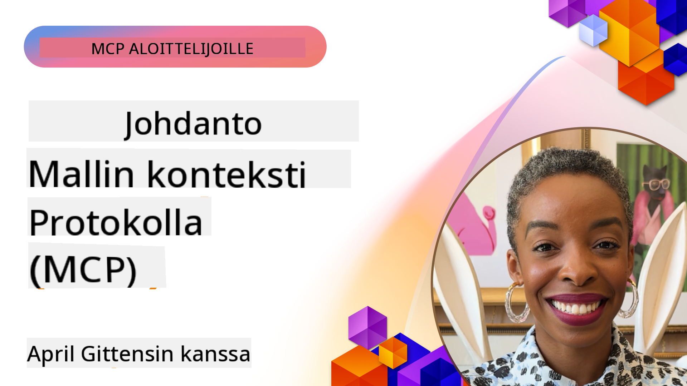
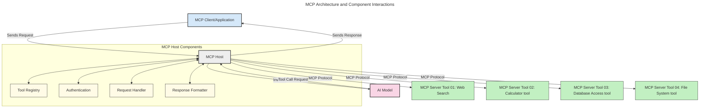
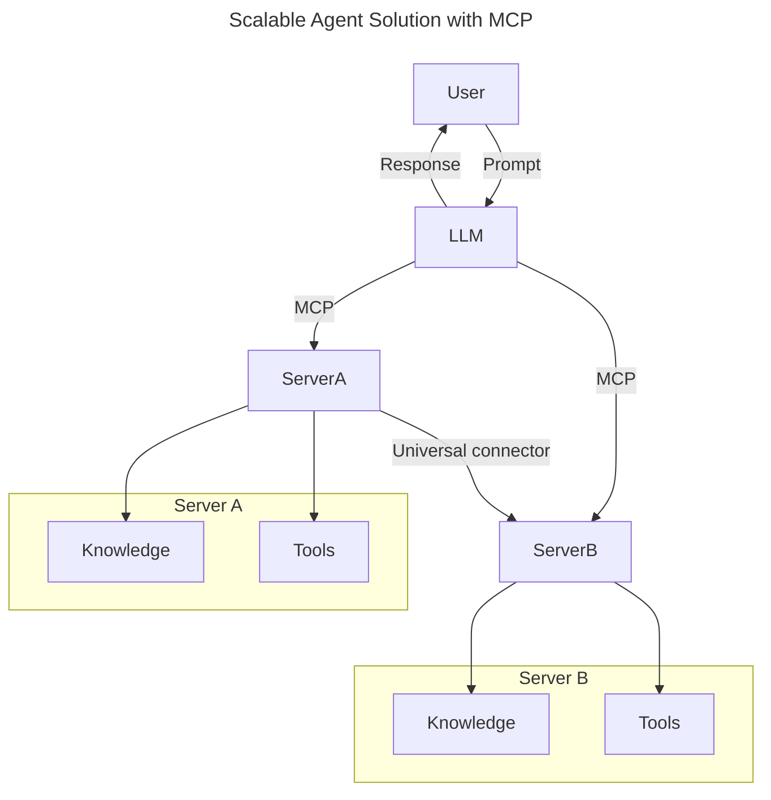
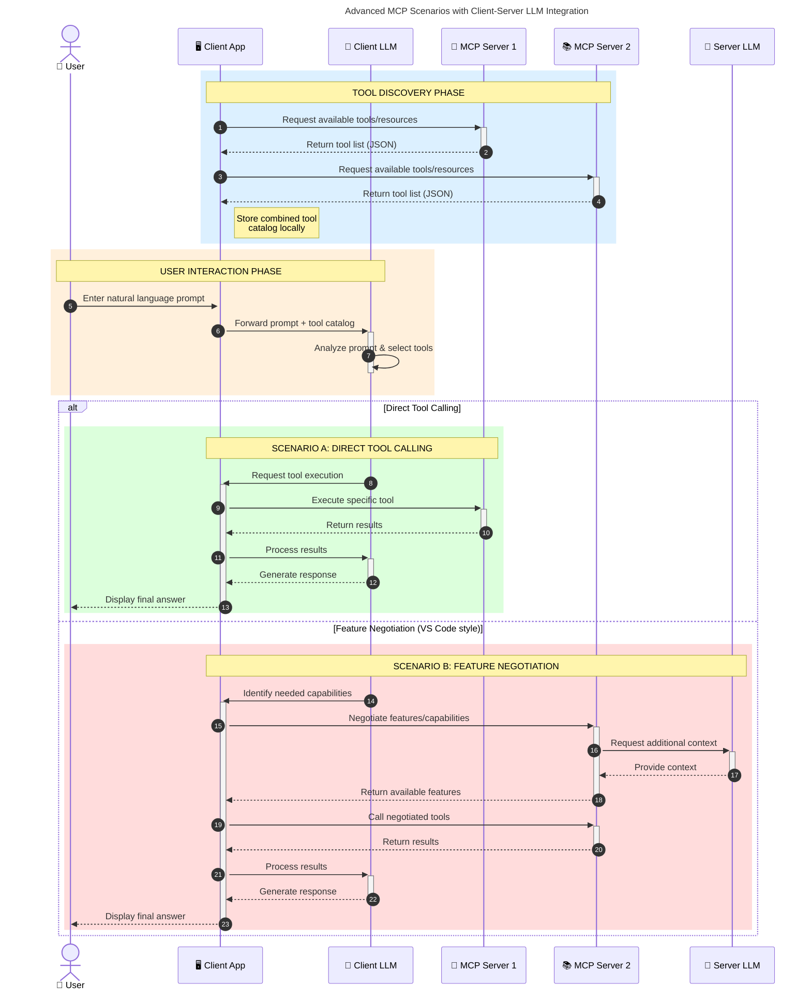

<!--
CO_OP_TRANSLATOR_METADATA:
{
  "original_hash": "0df1ee78a6dd8300f3a040ca5b411c2e",
  "translation_date": "2025-08-18T16:20:09+00:00",
  "source_file": "00-Introduction/README.md",
  "language_code": "fi"
}
-->
# Johdanto Model Context Protocoliin (MCP): Miksi se on tärkeä skaalautuville tekoälysovelluksille

_(Klikkaa yllä olevaa kuvaa katsoaksesi tämän oppitunnin videon)_

Generatiiviset tekoälysovellukset ovat merkittävä edistysaskel, sillä ne mahdollistavat usein käyttäjän vuorovaikutuksen sovelluksen kanssa luonnollisen kielen avulla. Kuitenkin, kun tällaisiin sovelluksiin investoidaan enemmän aikaa ja resursseja, haluat varmistaa, että voit helposti integroida toiminnallisuuksia ja resursseja tavalla, joka on helppo laajentaa, joka tukee useampia malleja ja käsittelee eri mallien erityispiirteitä. Lyhyesti sanottuna generatiivisten tekoälysovellusten rakentaminen on aluksi helppoa, mutta niiden kasvaessa ja monimutkaistuessa sinun on alettava määritellä arkkitehtuuria ja todennäköisesti tukeuduttava standardiin varmistaaksesi, että sovelluksesi rakennetaan johdonmukaisesti. Tässä kohtaa MCP astuu kuvaan järjestämään asiat ja tarjoamaan standardin.

---

## **🔍 Mikä on Model Context Protocol (MCP)?**

**Model Context Protocol (MCP)** on **avoin, standardoitu rajapinta**, joka mahdollistaa suurten kielimallien (LLM) saumattoman vuorovaikutuksen ulkoisten työkalujen, API:iden ja tietolähteiden kanssa. Se tarjoaa yhtenäisen arkkitehtuurin tekoälymallien toiminnallisuuden laajentamiseksi niiden koulutusdatan ulkopuolelle, mahdollistaen älykkäämmät, skaalautuvammat ja reagoivammat tekoälyjärjestelmät.

---

## **🎯 Miksi standardointi tekoälyssä on tärkeää**

Kun generatiiviset tekoälysovellukset monimutkaistuvat, on tärkeää ottaa käyttöön standardeja, jotka takaavat **skaalautuvuuden, laajennettavuuden, ylläpidettävyyden** ja **toimittajalukon välttämisen**. MCP vastaa näihin tarpeisiin:

- Yhdistämällä mallien ja työkalujen integraatiot
- Vähentämällä hauraiden, kertaluonteisten räätälöityjen ratkaisujen tarvetta
- Mahdollistamalla useiden eri toimittajien mallien yhteiselon samassa ekosysteemissä

**Huom:** Vaikka MCP esittää itsensä avoimena standardina, ei ole suunnitelmia standardoida MCP:tä minkään olemassa olevan standardointielimen, kuten IEEE:n, IETF:n, W3C:n, ISO:n tai muiden kautta.

---

## **📚 Oppimistavoitteet**

Tämän artikkelin lopussa osaat:

- Määritellä **Model Context Protocolin (MCP)** ja sen käyttötapaukset
- Ymmärtää, miten MCP standardoi mallien ja työkalujen välisen viestinnän
- Tunnistaa MCP-arkkitehtuurin keskeiset osat
- Tutkia MCP:n todellisia sovelluksia yritys- ja kehityskonteksteissa

---

## **💡 Miksi Model Context Protocol (MCP) on mullistava**

### **🔗 MCP ratkaisee tekoälyvuorovaikutusten pirstaleisuuden**

Ennen MCP:tä mallien ja työkalujen integrointi vaati:

- Räätälöityä koodia jokaiselle työkalu-malliparille
- Ei-standardisoituja API:ita jokaiselle toimittajalle
- Toistuvia ongelmia päivitysten yhteydessä
- Huonoa skaalautuvuutta useampien työkalujen kanssa

### **✅ MCP-standardoinnin hyödyt**

| **Hyöty**                 | **Kuvaus**                                                                     |
|---------------------------|-------------------------------------------------------------------------------|
| Yhteentoimivuus           | LLM:t toimivat saumattomasti eri toimittajien työkalujen kanssa               |
| Johdonmukaisuus           | Yhtenäinen käyttäytyminen eri alustojen ja työkalujen välillä                 |
| Uudelleenkäytettävyys     | Kerran rakennetut työkalut voidaan käyttää eri projekteissa ja järjestelmissä |
| Nopeutettu kehitys        | Kehitysaika lyhenee standardoitujen, plug-and-play-rajapintojen ansiosta      |

---

## **🧱 MCP-arkkitehtuurin yleiskatsaus**

MCP noudattaa **asiakas-palvelin-mallia**, jossa:

- **MCP-isännät** suorittavat tekoälymalleja
- **MCP-asiakkaat** aloittavat pyynnöt
- **MCP-palvelimet** tarjoavat kontekstin, työkalut ja kyvykkyydet

### **Keskeiset komponentit:**

- **Resurssit** – Staattiset tai dynaamiset tiedot malleille  
- **Kehoitteet** – Ennalta määritellyt työnkulut ohjattua generointia varten  
- **Työkalut** – Suoritettavat toiminnot, kuten haku, laskelmat  
- **Näytteenotto** – Agenttimainen käyttäytyminen rekursiivisten vuorovaikutusten kautta  

---

## Miten MCP-palvelimet toimivat

MCP-palvelimet toimivat seuraavasti:

- **Pyyntöprosessi**:
    1. Käyttäjä tai hänen puolestaan toimiva ohjelmisto aloittaa pyynnön.
    2. **MCP-asiakas** lähettää pyynnön **MCP-isännälle**, joka hallinnoi tekoälymallin suoritusympäristöä.
    3. **Tekoälymalli** vastaanottaa käyttäjän kehotteen ja voi pyytää pääsyä ulkoisiin työkaluihin tai tietoihin yhden tai useamman työkalupyynnön kautta.
    4. **MCP-isäntä**, ei malli suoraan, kommunikoi asianmukaisten **MCP-palvelimien** kanssa käyttäen standardoitua protokollaa.
- **MCP-isännän toiminnallisuus**:
    - **Työkalurekisteri**: Ylläpitää luetteloa käytettävissä olevista työkaluista ja niiden kyvykkyyksistä.
    - **Autentikointi**: Varmistaa työkalujen käyttöoikeudet.
    - **Pyyntöjen käsittelijä**: Käsittelee mallilta tulevat työkalupyynnöt.
    - **Vastausmuotoilija**: Muotoilee työkalujen tuotokset mallin ymmärtämään muotoon.
- **MCP-palvelimen suoritus**:
    - **MCP-isäntä** ohjaa työkalupyynnöt yhdelle tai useammalle **MCP-palvelimelle**, jotka tarjoavat erikoistuneita toimintoja (esim. haku, laskelmat, tietokantakyselyt).
    - **MCP-palvelimet** suorittavat tehtävänsä ja palauttavat tulokset **MCP-isännälle** yhtenäisessä muodossa.
    - **MCP-isäntä** muotoilee ja välittää nämä tulokset **tekoälymallille**.
- **Vastauksen viimeistely**:
    - **Tekoälymalli** sisällyttää työkalujen tuotokset lopulliseen vastaukseen.
    - **MCP-isäntä** lähettää tämän vastauksen takaisin **MCP-asiakkaalle**, joka toimittaa sen loppukäyttäjälle tai kutsuvalle ohjelmistolle.

## 👨‍💻 Miten rakentaa MCP-palvelin (esimerkkien avulla)

MCP-palvelimet mahdollistavat LLM-kyvykkyyksien laajentamisen tarjoamalla dataa ja toiminnallisuuksia. 

Valmis kokeilemaan? Tässä on kieli- ja/tai stack-kohtaisia SDK:ita esimerkkeineen yksinkertaisten MCP-palvelimien luomiseksi eri kielillä/stäkeillä:

- **Python SDK**: https://github.com/modelcontextprotocol/python-sdk

- **TypeScript SDK**: https://github.com/modelcontextprotocol/typescript-sdk

- **Java SDK**: https://github.com/modelcontextprotocol/java-sdk

- **C#/.NET SDK**: https://github.com/modelcontextprotocol/csharp-sdk

## 🌍 MCP:n todelliset käyttötapaukset

MCP mahdollistaa laajan valikoiman sovelluksia laajentamalla tekoälyn kyvykkyyksiä:

| **Sovellus**               | **Kuvaus**                                                                     |
|----------------------------|-------------------------------------------------------------------------------|
| Yritysdatan integrointi    | Yhdistä LLM:t tietokantoihin, CRM-järjestelmiin tai sisäisiin työkaluihin     |
| Agenttimaiset tekoälyjärjestelmät | Mahdollista autonomiset agentit työkalujen käytöllä ja päätöksentekotyönkuluilla |
| Multimodaaliset sovellukset | Yhdistä teksti-, kuva- ja äänityökalut yhteen yhtenäiseen tekoälysovellukseen |
| Reaaliaikainen dataintegraatio | Tuo reaaliaikainen data tekoälyvuorovaikutuksiin tarkempia ja ajantasaisempia tuloksia varten |

### 🧠 MCP = Yleinen standardi tekoälyvuorovaikutuksille

Model Context Protocol (MCP) toimii yleisenä standardina tekoälyvuorovaikutuksille, aivan kuten USB-C standardoi fyysiset liitännät laitteille. Tekoälyn maailmassa MCP tarjoaa yhtenäisen rajapinnan, joka mahdollistaa mallien (asiakkaiden) saumattoman integraation ulkoisten työkalujen ja tietolähteiden (palvelimien) kanssa. Tämä poistaa tarpeen moninaisille, räätälöidyille protokollille jokaiselle API:lle tai tietolähteelle.

MCP:n alaisuudessa MCP-yhteensopiva työkalu (jota kutsutaan MCP-palvelimeksi) noudattaa yhtenäistä standardia. Nämä palvelimet voivat listata tarjoamansa työkalut tai toiminnot ja suorittaa niitä tekoälyagentin pyynnöstä. MCP:tä tukevat tekoälyalustat voivat löytää palvelimien tarjoamat työkalut ja kutsua niitä tämän standardoidun protokollan kautta.

### 💡 Mahdollistaa tiedon hyödyntämisen

Työkalujen tarjoamisen lisäksi MCP mahdollistaa tiedon hyödyntämisen. Se mahdollistaa sovellusten tarjoavan kontekstia suurille kielimalleille (LLM) yhdistämällä ne erilaisiin tietolähteisiin. Esimerkiksi MCP-palvelin voi edustaa yrityksen dokumenttivarastoa, jolloin agentit voivat hakea tarvittavaa tietoa tarpeen mukaan. Toinen palvelin voi hoitaa tiettyjä toimintoja, kuten sähköpostien lähettämistä tai tietueiden päivittämistä. Agentin näkökulmasta nämä ovat yksinkertaisesti työkaluja, joita se voi käyttää—jotkut työkalut palauttavat dataa (tietokonteksti), kun taas toiset suorittavat toimintoja. MCP hallitsee molemmat tehokkaasti.

Agentti, joka yhdistyy MCP-palvelimeen, oppii automaattisesti palvelimen tarjoamat kyvykkyydet ja käytettävissä olevan datan standardoidussa muodossa. Tämä standardointi mahdollistaa dynaamisen työkalujen saatavuuden. Esimerkiksi uuden MCP-palvelimen lisääminen agentin järjestelmään tekee sen toiminnot heti käytettäviksi ilman, että agentin ohjeita tarvitsee mukauttaa.

Tämä virtaviivaistettu integraatio vastaa seuraavassa kaaviossa kuvattua virtausta, jossa palvelimet tarjoavat sekä työkaluja että tietoa, varmistaen saumattoman yhteistyön järjestelmien välillä.

### 👉 Esimerkki: Skaalautuva agenttiratkaisu

### 🔄 Edistyneet MCP-skenaariot asiakaspuolen LLM-integraatiolla

Perus-MCP-arkkitehtuurin lisäksi on olemassa edistyneitä skenaarioita, joissa sekä asiakas- että palvelinpuolella on LLM:itä, mahdollistaen monimutkaisempia vuorovaikutuksia. Seuraavassa kaaviossa **asiakassovellus** voi olla IDE, jossa on useita MCP-työkaluja käyttäjän LLM:n käytettävissä:

## 🔐 MCP:n käytännön hyödyt

Tässä ovat MCP:n käytännön hyödyt:

- **Ajantasaisuus**: Mallit voivat käyttää ajankohtaista tietoa koulutusdatan ulkopuolelta
- **Kyvykkyyksien laajentaminen**: Mallit voivat hyödyntää erikoistyökaluja tehtäviin, joihin niitä ei ole koulutettu
- **Vähentyneet hallusinaatiot**: Ulkoiset tietolähteet tarjoavat faktapohjaa
- **Yksityisyys**: Arkaluontoiset tiedot voivat pysyä turvallisissa ympäristöissä sen sijaan, että ne sisällytettäisiin kehotteisiin

## 📌 Keskeiset opit

Seuraavat ovat keskeisiä oppeja MCP:n käytöstä:

- **MCP** standardoi, miten tekoälymallit vuorovaikuttavat työkalujen ja datan kanssa
- Edistää **laajennettavuutta, johdonmukaisuutta ja yhteentoimivuutta**
- MCP auttaa **lyhentämään kehitysaikaa, parantamaan luotettavuutta ja laajentamaan mallien kyvykkyyksiä**
- Asiakas-palvelin-arkkitehtuuri mahdollistaa **joustavat, laajennettavat tekoälysovellukset**

## 🧠 Harjoitus

Ajattele tekoälysovellusta, jonka haluaisit rakentaa.

- Mitkä **ulkoiset työkalut tai tiedot** voisivat parantaa sen kyvykkyyksiä?
- Miten MCP voisi tehdä integraatiosta **yksinkertaisempaa ja luotettavampaa**?

## Lisäresurssit

- [MCP GitHub Repository](https://github.com/modelcontextprotocol)

## Mitä seuraavaksi

Seuraavaksi: [Luku 1: Peruskäsitteet](../01-CoreConcepts/README.md)

**Vastuuvapauslauseke**:  
Tämä asiakirja on käännetty käyttämällä tekoälypohjaista käännöspalvelua [Co-op Translator](https://github.com/Azure/co-op-translator). Vaikka pyrimme tarkkuuteen, huomioithan, että automaattiset käännökset voivat sisältää virheitä tai epätarkkuuksia. Alkuperäinen asiakirja sen alkuperäisellä kielellä tulisi pitää ensisijaisena lähteenä. Kriittisen tiedon osalta suositellaan ammattimaista ihmiskäännöstä. Emme ole vastuussa väärinkäsityksistä tai virhetulkinnoista, jotka johtuvat tämän käännöksen käytöstä.