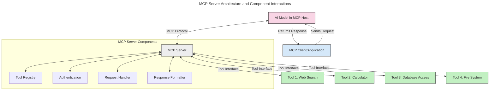
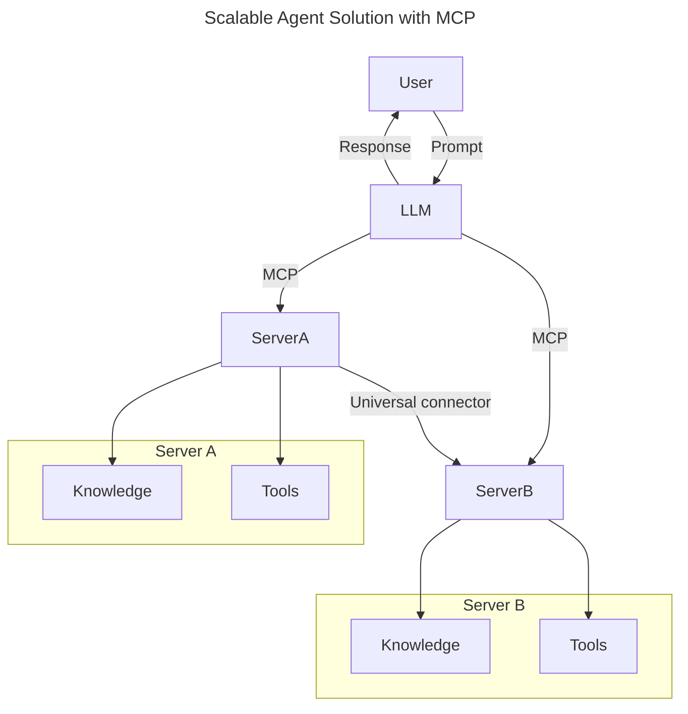
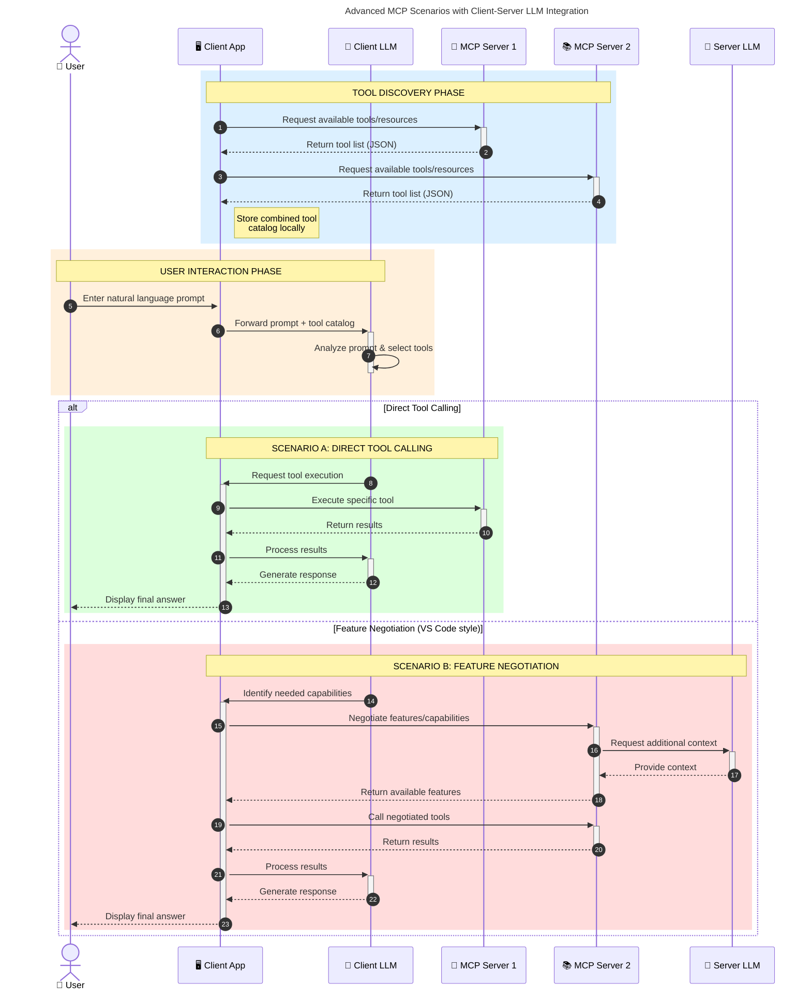

<!--
CO_OP_TRANSLATOR_METADATA:
{
  "original_hash": "105c2ddbb77bc38f7e9df009e1b06e45",
  "translation_date": "2025-07-04T17:47:54+00:00",
  "source_file": "00-Introduction/README.md",
  "language_code": "fi"
}
-->
# Johdanto Model Context Protocoliin (MCP): Miksi se on tärkeä skaalautuville tekoälysovelluksille

Generatiiviset tekoälysovellukset ovat merkittävä askel eteenpäin, sillä ne usein mahdollistavat käyttäjän vuorovaikutuksen sovelluksen kanssa luonnollisella kielellä annettujen kehotteiden avulla. Kuitenkin, kun tällaisiin sovelluksiin investoidaan enemmän aikaa ja resursseja, haluat varmistaa, että voit helposti integroida toiminnallisuuksia ja resursseja siten, että sovellusta on helppo laajentaa, se pystyy tukemaan useamman mallin käyttöä ja käsittelemään erilaisia mallien erityispiirteitä. Lyhyesti sanottuna, generatiivisten tekoälysovellusten rakentaminen on aluksi helppoa, mutta niiden kasvaessa ja monimutkaistuessa on tarpeen alkaa määritellä arkkitehtuuria ja todennäköisesti tukeutua standardiin, joka varmistaa sovellusten rakentamisen johdonmukaisesti. Tässä kohtaa MCP astuu kuvaan järjestämään asioita ja tarjoamaan standardin.

---

## **🔍 Mikä on Model Context Protocol (MCP)?**

**Model Context Protocol (MCP)** on **avoin, standardoitu rajapinta**, joka mahdollistaa suurten kielimallien (LLM) saumattoman vuorovaikutuksen ulkoisten työkalujen, API:en ja tietolähteiden kanssa. Se tarjoaa yhtenäisen arkkitehtuurin, joka laajentaa tekoälymallien toiminnallisuutta niiden koulutusdatan ulkopuolelle, mahdollistaen älykkäämmät, skaalautuvat ja reagoivammat tekoälyjärjestelmät.

---

## **🎯 Miksi standardisointi tekoälyssä on tärkeää**

Generatiivisten tekoälysovellusten monimutkaistuessa on välttämätöntä omaksua standardeja, jotka takaavat **skaalautuvuuden, laajennettavuuden** ja **ylläpidettävyyden**. MCP vastaa näihin tarpeisiin:

- Yhdistelemällä mallien ja työkalujen integraatiot
- Vähentämällä hauraita, kertaluonteisia räätälöityjä ratkaisuja
- Mahdollistamalla useiden mallien rinnakkaisen käytön yhdessä ekosysteemissä

---

## **📚 Oppimistavoitteet**

Tämän artikkelin lopussa osaat:

- Määritellä **Model Context Protocolin (MCP)** ja sen käyttötapaukset
- Ymmärtää, miten MCP standardisoi mallin ja työkalun välisen viestinnän
- Tunnistaa MCP-arkkitehtuurin keskeiset osat
- Tutkia MCP:n käytännön sovelluksia yritys- ja kehitysympäristöissä

---

## **💡 Miksi Model Context Protocol (MCP) on mullistava**

### **🔗 MCP ratkaisee tekoälyn vuorovaikutuksen pirstoutumisen**

Ennen MCP:tä mallien integrointi työkaluihin vaati:

- Räätälöityä koodia jokaista työkalu-malli-paria varten
- Ei-standardisoituja API-rajapintoja jokaiselta toimittajalta
- Usein katkoksia päivitysten vuoksi
- Huonoa skaalautuvuutta työkalujen määrän kasvaessa

### **✅ MCP-standardisoinnin hyödyt**

| **Hyöty**                | **Kuvaus**                                                                    |
|--------------------------|-------------------------------------------------------------------------------|
| Yhteensopivuus           | LLM:t toimivat saumattomasti eri toimittajien työkalujen kanssa               |
| Johdonmukaisuus          | Tasainen käyttäytyminen eri alustoilla ja työkaluissa                         |
| Uudelleenkäytettävyys    | Kerran rakennettuja työkaluja voi käyttää useissa projekteissa ja järjestelmissä |
| Kehityksen nopeutuminen  | Kehitysaikaa säästyy standardoitujen, plug-and-play-rajapintojen ansiosta     |

---

## **🧱 MCP-arkkitehtuurin yleiskatsaus**

MCP perustuu **asiakas-palvelin-malliin**, jossa:

- **MCP Hosts** ajavat tekoälymalleja
- **MCP Clients** aloittavat pyyntöjä
- **MCP Servers** tarjoavat kontekstin, työkalut ja ominaisuudet

### **Keskeiset osat:**

- **Resurssit** – Staattista tai dynaamista dataa malleille  
- **Kehotteet** – Ennalta määriteltyjä työnkulkuja ohjattuun generointiin  
- **Työkalut** – Suoritettavia toimintoja, kuten haku, laskenta  
- **Näytteenotto** – Agenttimainen käyttäytyminen rekursiivisten vuorovaikutusten kautta

---

## Miten MCP-palvelimet toimivat

MCP-palvelimet toimivat seuraavasti:

- **Pyyntöjen kulku**:  
    1. MCP Client lähettää pyynnön AI-mallille, joka toimii MCP Hostissa.  
    2. AI-malli tunnistaa, milloin se tarvitsee ulkoisia työkaluja tai dataa.  
    3. Malli kommunikoi MCP Serverin kanssa standardoidun protokollan avulla.

- **MCP Serverin toiminnot**:  
    - Työkalurekisteri: Pitää kirjaa saatavilla olevista työkaluista ja niiden ominaisuuksista.  
    - Autentikointi: Varmistaa käyttöoikeudet työkalujen käyttöön.  
    - Pyyntöjen käsittelijä: Käsittelee mallilta tulevat työkalupyyntöjä.  
    - Vastausten muotoilija: Jäsentää työkalujen tulokset mallin ymmärtämään muotoon.

- **Työkalujen suoritus**:  
    - Palvelin ohjaa pyynnöt oikeille ulkoisille työkaluilla  
    - Työkalut suorittavat erikoistuneet tehtävänsä (haku, laskenta, tietokantakyselyt jne.)  
    - Tulokset palautetaan mallille yhtenäisessä muodossa.

- **Vastauksen viimeistely**:  
    - AI-malli yhdistää työkalujen tulokset vastaukseensa.  
    - Lopullinen vastaus lähetetään takaisin asiakassovellukselle.

## 👨‍💻 Miten rakentaa MCP-palvelin (esimerkkien kera)

MCP-palvelimet mahdollistavat LLM:n kyvykkyyksien laajentamisen tarjoamalla dataa ja toiminnallisuutta.

Valmis kokeilemaan? Tässä esimerkkejä yksinkertaisen MCP-palvelimen luomisesta eri kielillä:

- **Python-esimerkki**: https://github.com/modelcontextprotocol/python-sdk

- **TypeScript-esimerkki**: https://github.com/modelcontextprotocol/typescript-sdk

- **Java-esimerkki**: https://github.com/modelcontextprotocol/java-sdk

- **C#/.NET-esimerkki**: https://github.com/modelcontextprotocol/csharp-sdk

## 🌍 MCP:n käytännön sovellukset

MCP mahdollistaa laajan kirjon sovelluksia laajentamalla tekoälyn kyvykkyyksiä:

| **Sovellus**                | **Kuvaus**                                                                    |
|----------------------------|-------------------------------------------------------------------------------|
| Yritysdatan integrointi    | Yhdistää LLM:t tietokantoihin, CRM-järjestelmiin tai sisäisiin työkaluihin    |
| Agenttipohjaiset tekoälyjärjestelmät | Mahdollistaa autonomiset agentit työkalujen käytöllä ja päätöksenteon työnkuluilla |
| Monimodaaliset sovellukset | Yhdistää teksti-, kuva- ja ääni työkalut yhteen yhtenäiseen tekoälysovellukseen |
| Reaaliaikainen dataintegraatio | Tuottaa elävää dataa tekoälyn vuorovaikutuksiin tarkempien ja ajantasaisempien tulosten saamiseksi |

### 🧠 MCP = Yleinen standardi tekoälyn vuorovaikutuksille

Model Context Protocol (MCP) toimii yleisenä standardina tekoälyn vuorovaikutuksille, aivan kuten USB-C standardisoi laitteiden fyysiset liitännät. Tekoälyn maailmassa MCP tarjoaa yhtenäisen rajapinnan, jonka avulla mallit (asiakkaat) voivat integroitua saumattomasti ulkoisten työkalujen ja datan tarjoajien (palvelimien) kanssa. Tämä poistaa tarpeen erilaisille, räätälöidyille protokollille jokaiselle API:lle tai tietolähteelle.

MCP-yhteensopiva työkalu (jota kutsutaan MCP-palvelimeksi) noudattaa yhtenäistä standardia. Nämä palvelimet voivat listata tarjoamansa työkalut tai toiminnot ja suorittaa ne, kun tekoälyagentti pyytää. MCP:tä tukevat tekoälyagenttialustat pystyvät löytämään palvelimien tarjoamat työkalut ja kutsumaan niitä tämän standardoidun protokollan kautta.

### 💡 Helpottaa tiedon saatavuutta

Työkalujen tarjoamisen lisäksi MCP helpottaa tiedon saatavuutta. Se mahdollistaa sovellusten tarjoavan kontekstia suurille kielimalleille (LLM) yhdistämällä ne erilaisiin tietolähteisiin. Esimerkiksi MCP-palvelin voi edustaa yrityksen dokumenttivarastoa, jolloin agentit voivat hakea tarpeellista tietoa pyynnöstä. Toinen palvelin voi hoitaa tiettyjä toimintoja, kuten sähköpostien lähettämistä tai tietueiden päivittämistä. Agentin näkökulmasta nämä ovat yksinkertaisesti työkaluja, joita se voi käyttää – jotkut työkalut palauttavat dataa (tietokontekstia), toiset suorittavat toimintoja. MCP hallinnoi molempia tehokkaasti.

Agentti, joka yhdistyy MCP-palvelimeen, oppii automaattisesti palvelimen saatavilla olevat ominaisuudet ja käytettävissä olevan datan standardoidun muodon kautta. Tämä standardisointi mahdollistaa työkalujen dynaamisen saatavuuden. Esimerkiksi uuden MCP-palvelimen lisääminen agentin järjestelmään tekee sen toiminnot heti käytettäväksi ilman, että agentin ohjeita tarvitsee muuttaa.

Tämä virtaviivainen integraatio vastaa mermaid-kaaviossa kuvattua työnkulkua, jossa palvelimet tarjoavat sekä työkaluja että tietoa, varmistaen saumattoman yhteistyön järjestelmien välillä.

### 👉 Esimerkki: Skaalautuva agenttiratkaisu

### 🔄 Edistyneet MCP-skenaariot asiakaspuolen LLM-integraatiolla

Perus MCP-arkkitehtuurin lisäksi on olemassa edistyneitä skenaarioita, joissa sekä asiakas että palvelin sisältävät LLM-malleja, mahdollistaen monimutkaisempia vuorovaikutuksia:

## 🔐 MCP:n käytännön hyödyt

Tässä MCP:n käytännön hyödyt:

- **Ajantasaisuus**: Mallit pääsevät käsiksi päivitettyyn tietoon koulutusdatan ulkopuolelta  
- **Kyvykkyyksien laajentaminen**: Mallit voivat hyödyntää erikoistuneita työkaluja tehtäviin, joihin niitä ei ole koulutettu  
- **Harhojen vähentäminen**: Ulkoiset tietolähteet tarjoavat faktapohjan  
- **Tietosuoja**: Arkaluonteinen data voi pysyä suojatuissa ympäristöissä sen sijaan, että se upotettaisiin kehotteisiin

## 📌 Keskeiset opit

Tärkeimmät opit MCP:n käytöstä:

- **MCP** standardisoi tekoälymallien vuorovaikutuksen työkalujen ja datan kanssa  
- Edistää **laajennettavuutta, johdonmukaisuutta ja yhteensopivuutta**  
- MCP auttaa **vähentämään kehitysaikaa, parantamaan luotettavuutta ja laajentamaan mallien kyvykkyyksiä**  
- Asiakas-palvelin-arkkitehtuuri **mahdollistaa joustavat, laajennettavat tekoälysovellukset**

## 🧠 Harjoitus

Mieti tekoälysovellusta, jonka haluaisit rakentaa.

- Mitkä **ulkoiset työkalut tai data** voisivat parantaa sen kyvykkyyksiä?  
- Miten MCP voisi tehdä integraatiosta **yksinkertaisempaa ja luotettavampaa**?

## Lisäresurssit

- [MCP GitHub Repository](https://github.com/modelcontextprotocol)

## Mitä seuraavaksi

Seuraavaksi: [Luku 1: Keskeiset käsitteet](../01-CoreConcepts/README.md)

**Vastuuvapauslauseke**:  
Tämä asiakirja on käännetty käyttämällä tekoälypohjaista käännöspalvelua [Co-op Translator](https://github.com/Azure/co-op-translator). Vaikka pyrimme tarkkuuteen, huomioithan, että automaattikäännöksissä saattaa esiintyä virheitä tai epätarkkuuksia. Alkuperäistä asiakirjaa sen alkuperäiskielellä tulee pitää virallisena lähteenä. Tärkeissä tiedoissa suositellaan ammattimaista ihmiskäännöstä. Emme ole vastuussa tämän käännöksen käytöstä aiheutuvista väärinymmärryksistä tai tulkinnoista.