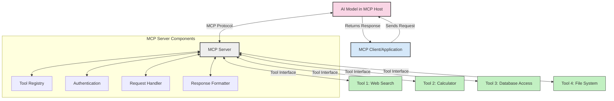
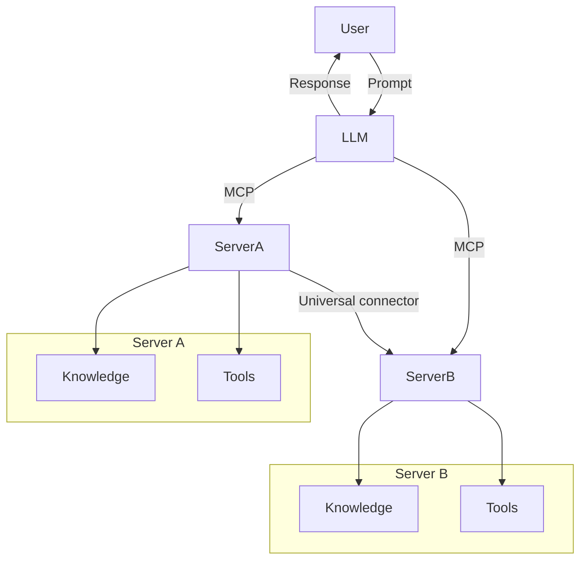

<!--
CO_OP_TRANSLATOR_METADATA:
{
  "original_hash": "cf84f987e1b771d2201408e110dfd2db",
  "translation_date": "2025-05-20T17:27:13+00:00",
  "source_file": "00-Introduction/README.md",
  "language_code": "fi"
}
-->
# Johdanto Model Context Protocoliin (MCP): Miksi se on tärkeä skaalautuville tekoälysovelluksille

Generatiiviset tekoälysovellukset ovat suuri edistysaskel, sillä ne usein mahdollistavat käyttäjän vuorovaikutuksen sovelluksen kanssa luonnollisen kielen kehotteilla. Kun tällaisiin sovelluksiin sijoitetaan enemmän aikaa ja resursseja, haluat varmistaa, että voit helposti integroida toimintoja ja resursseja siten, että sovellusta on helppo laajentaa, se pystyy palvelemaan useamman mallin käyttöä ja niiden monimutkaisuuksia. Lyhyesti sanottuna, generatiivisten tekoälysovellusten rakentaminen on aluksi helppoa, mutta kun ne kasvavat ja monimutkaistuvat, on alettava määritellä arkkitehtuuria ja todennäköisesti tukeuduttava standardiin, jotta sovellukset rakennetaan johdonmukaisesti. Tässä kohtaa MCP astuu kuvaan järjestämään asioita ja tarjoamaan standardin.

---

## **🔍 Mikä on Model Context Protocol (MCP)?**

**Model Context Protocol (MCP)** on **avoin, standardoitu rajapinta**, joka mahdollistaa suurten kielimallien (LLM) saumattoman vuorovaikutuksen ulkoisten työkalujen, API:en ja tietolähteiden kanssa. Se tarjoaa yhdenmukaisen arkkitehtuurin, joka parantaa tekoälymallien toiminnallisuutta niiden koulutusdatan ulkopuolella, mahdollistaen älykkäämmät, skaalautuvat ja reagoivammat tekoälyjärjestelmät.

---

## **🎯 Miksi standardisointi tekoälyssä on tärkeää**

Kun generatiiviset tekoälysovellukset monimutkaistuvat, on tärkeää ottaa käyttöön standardeja, jotka varmistavat **skaalautuvuuden, laajennettavuuden** ja **ylläpidettävyyden**. MCP vastaa näihin tarpeisiin:

- Yhdistämällä mallien ja työkalujen integraatiot
- Vähentämällä hauraita, kertaluonteisia räätälöityjä ratkaisuja
- Mahdollistamalla useiden mallien samanaikaisen käytön yhdessä ekosysteemissä

---

## **📚 Oppimistavoitteet**

Tämän artikkelin lopussa osaat:

- Määritellä **Model Context Protocolin (MCP)** ja sen käyttötapaukset
- Ymmärtää, miten MCP standardisoi mallin ja työkalun välisen viestinnän
- Tunnistaa MCP-arkkitehtuurin keskeiset osat
- Tutkia MCP:n käytännön sovelluksia yritys- ja kehitysympäristöissä

---

## **💡 Miksi Model Context Protocol (MCP) on mullistava**

### **🔗 MCP ratkaisee tekoälyn vuorovaikutusten pirstoutumisen**

Ennen MCP:tä mallien ja työkalujen yhdistäminen vaati:

- Räätälöityä koodia jokaiselle työkalun ja mallin parille
- Ei-standardisoituja API:ita jokaiselta toimittajalta
- Usein katkeavia integraatioita päivitysten vuoksi
- Heikkoa skaalautuvuutta työkalujen lisääntyessä

### **✅ MCP-standardisoinnin hyödyt**

| **Hyöty**                | **Kuvaus**                                                                      |
|--------------------------|---------------------------------------------------------------------------------|
| Yhteensopivuus           | LLM:t toimivat saumattomasti eri toimittajien työkalujen kanssa                 |
| Johdonmukaisuus          | Tasainen käyttäytyminen eri alustoilla ja työkaluissa                           |
| Uudelleenkäytettävyys    | Kerran rakennettuja työkaluja voi käyttää eri projekteissa ja järjestelmissä    |
| Kehityksen nopeutuminen  | Kehitysaikaa säästyy standardoitujen, plug-and-play -rajapintojen avulla        |

---

## **🧱 MCP-arkkitehtuurin yleiskatsaus**

MCP perustuu **asiakas-palvelin-malliin**, jossa:

- **MCP-isännät** ajavat tekoälymalleja
- **MCP-asiakkaat** tekevät pyyntöjä
- **MCP-palvelimet** tarjoavat kontekstin, työkalut ja ominaisuudet

### **Keskeiset osat:**

- **Resurssit** – Staattiset tai dynaamiset tiedot malleille  
- **Kehotteet** – Ennalta määritellyt työnkulut ohjattuun generointiin  
- **Työkalut** – Suoritettavat funktiot, kuten haku, laskelmat  
- **Näytteistys** – Agenttimaista toimintaa rekursiivisten vuorovaikutusten kautta

---

## Miten MCP-palvelimet toimivat

MCP-palvelimet toimivat seuraavasti:

- **Pyyntöjen kulku**:  
    1. MCP-asiakas lähettää pyynnön tekoälymallille, joka toimii MCP-isännässä.  
    2. Tekoälymalli tunnistaa, milloin se tarvitsee ulkoisia työkaluja tai dataa.  
    3. Malli kommunikoi MCP-palvelimen kanssa standardoidun protokollan avulla.

- **MCP-palvelimen toiminnot**:  
    - Työkalurekisteri: Pitää kirjaa saatavilla olevista työkaluista ja niiden ominaisuuksista.  
    - Autentikointi: Varmistaa käyttöoikeudet työkalujen käyttöön.  
    - Pyyntöjen käsittelijä: Käsittelee mallin lähettämät työkalupyyntöjä.  
    - Vastausten muotoilija: Jäsentää työkalujen tuottamat tulokset mallin ymmärtämään muotoon.

- **Työkalujen suoritus**:  
    - Palvelin ohjaa pyynnöt oikeille ulkoisille työkaluilla  
    - Työkalut suorittavat erikoistuneet toiminnot (haku, laskenta, tietokantakyselyt jne.)  
    - Tulokset palautetaan mallille yhdenmukaisessa muodossa.

- **Vastauksen viimeistely**:  
    - Tekoälymalli sisällyttää työkalujen tulokset vastaukseensa.  
    - Lopullinen vastaus lähetetään takaisin asiakassovellukselle.

## 👨‍💻 Miten rakentaa MCP-palvelin (esimerkkien kera)

MCP-palvelimet mahdollistavat LLM-kyvykkyyksien laajentamisen tarjoamalla dataa ja toiminnallisuutta.

Valmis kokeilemaan? Tässä esimerkkejä yksinkertaisen MCP-palvelimen luomisesta eri kielillä:

- **Python-esimerkki**: https://github.com/modelcontextprotocol/python-sdk

- **TypeScript-esimerkki**: https://github.com/modelcontextprotocol/typescript-sdk

- **Java-esimerkki**: https://github.com/modelcontextprotocol/java-sdk

- **C#/.NET-esimerkki**: https://github.com/modelcontextprotocol/csharp-sdk

## 🌍 MCP:n käytännön käyttötapaukset

MCP mahdollistaa monenlaisia sovelluksia laajentamalla tekoälyn kyvykkyyksiä:

| **Sovellus**                | **Kuvaus**                                                                    |
|----------------------------|--------------------------------------------------------------------------------|
| Yritystietojen integraatio | Yhdistää LLM:t tietokantoihin, CRM-järjestelmiin tai sisäisiin työkaluihin    |
| Agenttipohjaiset tekoälyjärjestelmät | Mahdollistaa autonomiset agentit työkalujen käytöllä ja päätöksenteon työnkuluilla |
| Monimodaaliset sovellukset  | Yhdistää teksti-, kuva- ja äänityökalut yhteen yhtenäiseen tekoälysovellukseen  |
| Reaaliaikainen tiedon integrointi | Tuottaa reaaliaikaista dataa tekoälyn käyttöön tarkempien ja ajantasaisempien tulosten saamiseksi |

### 🧠 MCP = Universaali standardi tekoälyn vuorovaikutuksille

Model Context Protocol (MCP) toimii universaalina standardina tekoälyn vuorovaikutuksille, aivan kuten USB-C vakioi laitteiden fyysiset liitännät. Tekoälyn maailmassa MCP tarjoaa yhdenmukaisen rajapinnan, jonka avulla mallit (asiakkaat) voivat integroitua saumattomasti ulkoisten työkalujen ja tietolähteiden (palvelimien) kanssa. Tämä poistaa tarpeen erilaisille, räätälöidyille protokollille jokaiselle API:lle tai tietolähteelle.

MCP-yhteensopiva työkalu (jota kutsutaan MCP-palvelimeksi) noudattaa yhtenäistä standardia. Nämä palvelimet voivat listata tarjoamansa työkalut tai toiminnot ja suorittaa ne, kun tekoälyagentti pyytää. MCP:tä tukevat agenttipohjaiset alustat pystyvät löytämään palvelimien tarjoamat työkalut ja kutsumaan niitä tämän standardoidun protokollan kautta.

### 💡 Helpottaa tiedon saatavuutta

Työkalujen tarjoamisen lisäksi MCP helpottaa tiedon saatavuutta. Se mahdollistaa sovellusten tarjoavan kontekstia suurille kielimalleille (LLM) yhdistämällä ne erilaisiin tietolähteisiin. Esimerkiksi MCP-palvelin voi edustaa yrityksen dokumenttivarastoa, jolloin agentit voivat hakea tarvittavaa tietoa pyynnöstä. Toinen palvelin voi hoitaa tiettyjä toimintoja, kuten sähköpostien lähettämistä tai tietueiden päivittämistä. Agentin näkökulmasta nämä ovat vain työkaluja, joilla osa palauttaa tietoa (tietokontexti), ja osa suorittaa toimintoja. MCP hallinnoi molempia tehokkaasti.

Agentti, joka yhdistyy MCP-palvelimeen, oppii automaattisesti palvelimen saatavilla olevat ominaisuudet ja pääsyn tiedoihin standardoidun muodon kautta. Tämä standardisointi mahdollistaa työkalujen dynaamisen saatavuuden. Esimerkiksi uuden MCP-palvelimen lisääminen agentin järjestelmään tekee sen toiminnot välittömästi käyttökelpoisiksi ilman, että agentin ohjeita tarvitsee muuttaa.

Tämä sujuva integraatio vastaa mermaid-kaaviossa kuvattua työnkulkua, jossa palvelimet tarjoavat sekä työkaluja että tietoa varmistaen saumattoman yhteistyön järjestelmien välillä.

### 👉 Esimerkki: Skaalautuva agenttiratkaisu

## 🔐 MCP:n käytännön hyödyt

Tässä MCP:n käytön konkreettiset hyödyt:

- **Ajantasaisuus**: Mallit pääsevät käsiksi päivitettyyn tietoon koulutusdatan ulkopuolella  
- **Kyvykkyyksien laajentaminen**: Mallit voivat hyödyntää erikoistuneita työkaluja tehtäviin, joihin niitä ei ole koulutettu  
- **Harhojen vähentäminen**: Ulkoiset tietolähteet tarjoavat faktapohjan  
- **Tietosuoja**: Arkaluonteinen data voi pysyä suojatuissa ympäristöissä eikä sitä tarvitse upottaa kehotteisiin

## 📌 Keskeiset opit

Tärkeimmät MCP:n käyttöön liittyvät opit:

- **MCP** standardisoi tekoälymallien vuorovaikutuksen työkalujen ja datan kanssa  
- Edistää **laajennettavuutta, johdonmukaisuutta ja yhteensopivuutta**  
- MCP auttaa **vähentämään kehitysaikaa, parantamaan luotettavuutta ja laajentamaan mallien kyvykkyyksiä**  
- Asiakas-palvelin-arkkitehtuuri mahdollistaa **joustavat, laajennettavat tekoälysovellukset**

## 🧠 Harjoitus

Pohdi tekoälysovellusta, jonka haluaisit rakentaa.

- Mitkä **ulkoiset työkalut tai tiedot** voisivat parantaa sen kyvykkyyksiä?  
- Miten MCP voisi tehdä integraatiosta **yksinkertaisempaa ja luotettavampaa?**

## Lisäresurssit

- [MCP GitHub Repository](https://github.com/modelcontextprotocol)

## Mitä seuraavaksi

Seuraava: [Luku 1: Keskeiset käsitteet](/01-CoreConcepts/README.md)

**Vastuuvapauslauseke**:  
Tämä asiakirja on käännetty käyttämällä tekoälypohjaista käännöspalvelua [Co-op Translator](https://github.com/Azure/co-op-translator). Vaikka pyrimme tarkkuuteen, otathan huomioon, että automaattikäännöksissä saattaa esiintyä virheitä tai epätarkkuuksia. Alkuperäistä asiakirjaa sen alkuperäiskielellä tulisi pitää virallisena lähteenä. Tärkeissä tiedoissa suositellaan ammattimaista ihmiskäännöstä. Emme ole vastuussa tämän käännöksen käytöstä johtuvista väärinymmärryksistä tai tulkinnoista.