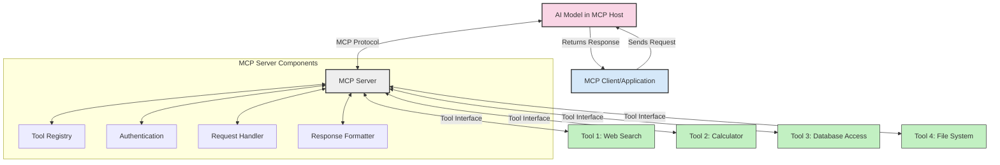
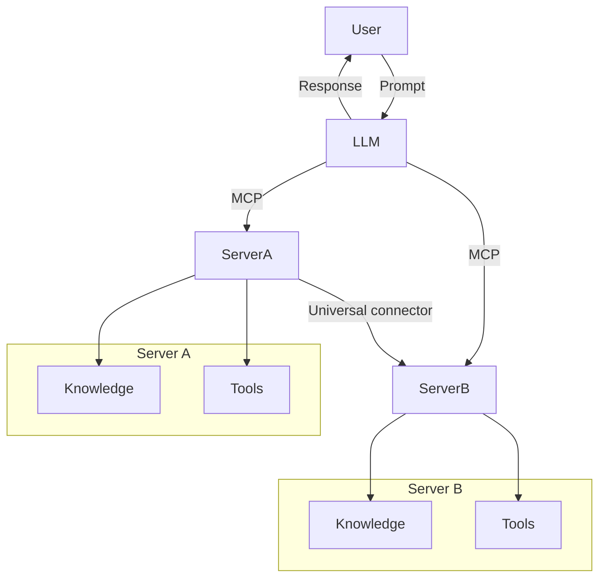

<!--
CO_OP_TRANSLATOR_METADATA:
{
  "original_hash": "1d88dee994dcbb3fa52c271d0c0817b5",
  "translation_date": "2025-05-20T21:50:28+00:00",
  "source_file": "00-Introduction/README.md",
  "language_code": "fi"
}
-->
# Johdanto Model Context Protocoliin (MCP): Miksi se on tärkeä skaalautuville tekoälysovelluksille

Generatiiviset tekoälysovellukset ovat suuri edistysaskel, sillä ne usein mahdollistavat käyttäjän vuorovaikutuksen sovelluksen kanssa luonnollisen kielen kehotteilla. Kuitenkin, kun tällaisiin sovelluksiin sijoitetaan enemmän aikaa ja resursseja, haluat varmistaa, että voit helposti integroida toiminnallisuuksia ja resursseja siten, että laajentaminen on helppoa, sovelluksesi pystyy palvelemaan useampaa mallia samanaikaisesti ja käsittelemään erilaisia mallien erityispiirteitä. Lyhyesti sanottuna generatiivisten tekoälysovellusten rakentaminen on aluksi helppoa, mutta niiden kasvaessa ja monimutkaistuessa sinun on alettava määritellä arkkitehtuuria ja todennäköisesti luotettava standardiin, jotta sovelluksesi rakennetaan johdonmukaisella tavalla. Tässä kohtaa MCP astuu kuvaan järjestämään asioita ja tarjoamaan standardin.

---

## **🔍 Mikä on Model Context Protocol (MCP)?**

**Model Context Protocol (MCP)** on **avoin, standardoitu rajapinta**, joka mahdollistaa suurten kielimallien (LLM) saumattoman vuorovaikutuksen ulkoisten työkalujen, API:en ja tietolähteiden kanssa. Se tarjoaa johdonmukaisen arkkitehtuurin, joka laajentaa tekoälymallien toiminnallisuutta niiden koulutusdatan ulkopuolelle, mahdollistaen älykkäämmät, skaalautuvat ja reagoivammat tekoälyjärjestelmät.

---

## **🎯 Miksi standardisointi tekoälyssä on tärkeää**

Kun generatiiviset tekoälysovellukset monimutkaistuvat, on olennaista omaksua standardeja, jotka takaavat **skaalautuvuuden, laajennettavuuden** ja **ylläpidettävyyden**. MCP vastaa näihin tarpeisiin:

- Yhdistelee mallien ja työkalujen integraatiot
- Vähentää hauraita, kertaluonteisia räätälöityjä ratkaisuja
- Mahdollistaa useiden mallien rinnakkaisen toiminnan yhdessä ekosysteemissä

---

## **📚 Oppimistavoitteet**

Tämän artikkelin lopussa osaat:

- Määritellä **Model Context Protocolin (MCP)** ja sen käyttötapaukset
- Ymmärtää, miten MCP standardisoi mallin ja työkalun välisen viestinnän
- Tunnistaa MCP-arkkitehtuurin keskeiset osat
- Tutkia MCP:n käytännön sovelluksia yritys- ja kehitysympäristöissä

---

## **💡 Miksi Model Context Protocol (MCP) on mullistava**

### **🔗 MCP ratkaisee tekoälyn vuorovaikutusten pirstaloitumisen**

Ennen MCP:tä mallien ja työkalujen integrointi vaati:

- Räätälöityä koodia jokaista työkalu-malli-paria varten
- Ei-standardisoituja API-rajapintoja jokaiselta toimittajalta
- Usein rikkoutuvia integraatioita päivitysten vuoksi
- Huonoa skaalautuvuutta työkalujen määrän kasvaessa

### **✅ MCP-standardisoinnin hyödyt**

| **Hyöty**               | **Kuvaus**                                                                   |
|-------------------------|------------------------------------------------------------------------------|
| Yhteentoimivuus         | LLM:t toimivat saumattomasti eri toimittajien työkalujen kanssa              |
| Johdonmukaisuus         | Tasalaatuinen käyttäytyminen eri alustoilla ja työkaluissa                   |
| Uudelleenkäytettävyys   | Kerran rakennettuja työkaluja voidaan käyttää useissa projekteissa ja järjestelmissä |
| Kehityksen nopeutuminen | Kehitysaikaa säästyy standardoitujen, plug-and-play -rajapintojen ansiosta    |

---

## **🧱 MCP-arkkitehtuurin yleiskatsaus**

MCP noudattaa **asiakas-palvelin-mallia**, jossa:

- **MCP-isännät** pyörittävät tekoälymalleja
- **MCP-asiakkaat** tekevät pyyntöjä
- **MCP-palvelimet** tarjoavat kontekstin, työkalut ja ominaisuudet

### **Keskeiset osat:**

- **Resurssit** – Staattista tai dynaamista dataa malleille  
- **Kehotteet** – Ennalta määriteltyjä työnkulkuja ohjattuun generointiin  
- **Työkalut** – Suoritettavia toimintoja, kuten hakuja ja laskutoimituksia  
- **Näytteistys** – Agenttimaista käyttäytymistä rekursiivisten vuorovaikutusten kautta

---

## Miten MCP-palvelimet toimivat

MCP-palvelimet toimivat seuraavasti:

- **Pyyntöjen kulku**:  
    1. MCP-asiakas lähettää pyynnön tekoälymallille, joka toimii MCP-isännässä.  
    2. Tekoälymalli tunnistaa, milloin se tarvitsee ulkoisia työkaluja tai dataa.  
    3. Malli kommunikoi MCP-palvelimen kanssa standardoidun protokollan avulla.

- **MCP-palvelimen toiminnot**:  
    - Työkalurekisteri: Pitää kirjaa saatavilla olevista työkaluista ja niiden ominaisuuksista.  
    - Todennus: Varmistaa työkalujen käyttöoikeudet.  
    - Pyyntöjen käsittelijä: Käsittelee mallilta tulevat työkalupyyntöjä.  
    - Vastausten muotoilija: Jäsentää työkalujen tuottamat tulokset mallin ymmärtämään muotoon.

- **Työkalujen suoritus**:  
    - Palvelin ohjaa pyynnöt oikeille ulkoisille työkaluille  
    - Työkalut suorittavat erikoistuneet tehtävänsä (haku, laskenta, tietokantakyselyt jne.)  
    - Tulokset palautetaan mallille yhdenmukaisessa muodossa.

- **Vastauksen viimeistely**:  
    - Tekoälymalli yhdistää työkalujen tulokset vastaukseensa.  
    - Lopullinen vastaus lähetetään takaisin asiakassovellukselle.

## 👨‍💻 Miten rakentaa MCP-palvelin (esimerkkien avulla)

MCP-palvelimet mahdollistavat LLM:n kykyjen laajentamisen tarjoamalla dataa ja toiminnallisuutta.

Valmiina kokeilemaan? Tässä esimerkkejä yksinkertaisen MCP-palvelimen luomisesta eri kielillä:

- **Python-esimerkki**: https://github.com/modelcontextprotocol/python-sdk

- **TypeScript-esimerkki**: https://github.com/modelcontextprotocol/typescript-sdk

- **Java-esimerkki**: https://github.com/modelcontextprotocol/java-sdk

- **C#/.NET-esimerkki**: https://github.com/modelcontextprotocol/csharp-sdk

## 🌍 MCP:n käytännön sovellukset

MCP mahdollistaa laajan valikoiman sovelluksia laajentamalla tekoälyn kykyjä:

| **Sovellus**               | **Kuvaus**                                                                 |
|---------------------------|-----------------------------------------------------------------------------|
| Yritystietojen integraatio | Yhdistää LLM:t tietokantoihin, CRM-järjestelmiin tai sisäisiin työkaluihin  |
| Agenttipohjaiset tekoälyjärjestelmät | Mahdollistaa autonomiset agentit työkalujen käyttöoikeuksilla ja päätöksentekotyönkuluilla |
| Monimodaaliset sovellukset | Yhdistää teksti-, kuva- ja ääni työkalut yhteen yhtenäiseen tekoälysovellukseen |
| Reaaliaikainen dataintegraatio | Tuottaa live-dataa tekoälyn vuorovaikutuksiin tarkempien ja ajankohtaisten tulosten saamiseksi |

### 🧠 MCP = Yleinen standardi tekoälyn vuorovaikutuksille

Model Context Protocol (MCP) toimii yleisenä standardina tekoälyn vuorovaikutuksissa, aivan kuten USB-C standardisoi laitteiden fyysiset liitännät. Tekoälyn maailmassa MCP tarjoaa yhdenmukaisen rajapinnan, jonka avulla mallit (asiakkaat) voivat integroitua saumattomasti ulkoisiin työkaluihin ja datan tarjoajiin (palvelimet). Tämä poistaa tarpeen käyttää erilaisia, räätälöityjä protokollia jokaiselle API:lle tai tietolähteelle.

MCP-yhteensopiva työkalu (jota kutsutaan MCP-palvelimeksi) noudattaa yhtenäistä standardia. Nämä palvelimet voivat listata tarjoamansa työkalut tai toiminnot ja suorittaa ne, kun tekoälyagentti pyytää. MCP:tä tukevat tekoälyagenttialustat pystyvät löytämään palvelimien tarjoamat työkalut ja kutsumaan niitä tämän standardin mukaisesti.

### 💡 Helpottaa tiedon saatavuutta

Työkalujen tarjoamisen lisäksi MCP helpottaa tiedon saatavuutta. Se mahdollistaa sovellusten kontekstin tarjoamisen suurille kielimalleille (LLM) linkittämällä ne erilaisiin tietolähteisiin. Esimerkiksi MCP-palvelin voi edustaa yrityksen dokumenttivarastoa, jolloin agentit voivat hakea tarpeellista tietoa pyynnöstä. Toinen palvelin voi hoitaa tiettyjä toimintoja, kuten sähköpostien lähettämistä tai tietueiden päivittämistä. Agentin näkökulmasta nämä ovat vain työkaluja — osa työkaluista palauttaa tietoa (tiedon konteksti), kun taas toiset suorittavat toimintoja. MCP hallinnoi molempia tehokkaasti.

Agentti, joka yhdistyy MCP-palvelimeen, oppii automaattisesti palvelimen saatavilla olevat ominaisuudet ja käytettävissä olevan datan standardoidun muodon kautta. Tämä standardisointi mahdollistaa dynaamisen työkalujen saatavuuden. Esimerkiksi uuden MCP-palvelimen lisääminen agentin järjestelmään tekee sen toiminnot välittömästi käytettäväksi ilman, että agentin ohjeita tarvitsee muokata.

Tämä virtaviivainen integraatio vastaa mermaid-kaaviossa kuvattua toimintamallia, jossa palvelimet tarjoavat sekä työkaluja että tietoa, varmistaen saumattoman yhteistyön järjestelmien välillä.

### 👉 Esimerkki: Skaalautuva agenttiratkaisu

## 🔐 MCP:n käytännön hyödyt

Tässä MCP:n käytön konkreettiset edut:

- **Ajantasaisuus**: Mallit voivat käyttää tuoretta tietoa koulutusdatan ulkopuolelta  
- **Kykyjen laajennus**: Mallit voivat hyödyntää erikoistuneita työkaluja tehtäviin, joihin ne eivät ole koulutettuja  
- **Vähemmän harhaluuloja**: Ulkoiset tietolähteet tarjoavat faktapohjan  
- **Tietosuoja**: Herkkä data voi pysyä suojatuissa ympäristöissä sen sijaan, että se upotettaisiin kehotteisiin

## 📌 Tärkeimmät opit

Seuraavat ovat MCP:n käytön keskeiset opit:

- **MCP** standardisoi tekoälymallien vuorovaikutuksen työkalujen ja datan kanssa  
- Edistää **laajennettavuutta, johdonmukaisuutta ja yhteentoimivuutta**  
- MCP auttaa **kehitysaikojen lyhentämisessä, luotettavuuden parantamisessa ja mallien kyvykkyyksien laajentamisessa**  
- Asiakas-palvelin-arkkitehtuuri mahdollistaa **joustavat, laajennettavat tekoälysovellukset**

## 🧠 Harjoitus

Ajattele tekoälysovellusta, jonka haluaisit rakentaa.

- Mitkä **ulkoiset työkalut tai data** voisivat parantaa sen kykyjä?  
- Miten MCP voisi tehdä integraatiosta **yksinkertaisempaa ja luotettavampaa?**

## Lisäresurssit

- [MCP GitHub Repository](https://github.com/modelcontextprotocol)

## Mitä seuraavaksi

Seuraava: [Luku 1: Keskeiset käsitteet](/01-CoreConcepts/README.md)

**Vastuuvapauslauseke**:  
Tämä asiakirja on käännetty käyttämällä tekoälypohjaista käännöspalvelua [Co-op Translator](https://github.com/Azure/co-op-translator). Vaikka pyrimme tarkkuuteen, huomioithan, että automaattikäännöksissä saattaa esiintyä virheitä tai epätarkkuuksia. Alkuperäistä asiakirjaa sen alkuperäisellä kielellä tulee pitää auktoritatiivisena lähteenä. Tärkeissä asioissa suositellaan ammattimaista ihmiskäännöstä. Emme ole vastuussa tämän käännöksen käytöstä aiheutuvista väärinymmärryksistä tai virhetulkintojen seurauksista.