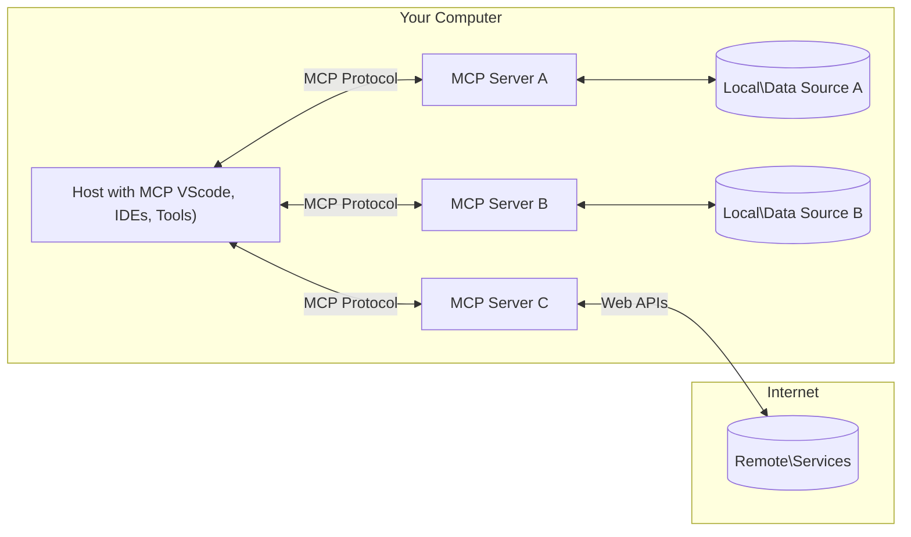

<!--
CO_OP_TRANSLATOR_METADATA:
{
  "original_hash": "355b12a5970c5c9e6db0bee970c751ba",
  "translation_date": "2025-07-04T17:48:54+00:00",
  "source_file": "01-CoreConcepts/README.md",
  "language_code": "fi"
}
-->
# 📖 MCP:n Peruskäsitteet: Mallikontekstiprotokollan hallinta tekoälyn integrointia varten

[Model Context Protocol (MCP)](https://github.com/modelcontextprotocol) on tehokas, standardoitu kehys, joka optimoi viestinnän suurten kielimallien (LLM) ja ulkoisten työkalujen, sovellusten sekä tietolähteiden välillä. Tämä SEO-optimoitu opas johdattaa sinut MCP:n keskeisiin käsitteisiin, varmistaen, että ymmärrät sen asiakas-palvelinarkkitehtuurin, olennaiset osat, viestintämekanismit ja toteutuksen parhaat käytännöt.

## Yleiskatsaus

Tässä oppitunnissa tutustutaan Model Context Protocolin (MCP) ekosysteemin perusrakenteeseen ja komponentteihin. Opit asiakas-palvelinarkkitehtuurista, keskeisistä osista ja viestintämekanismeista, jotka mahdollistavat MCP:n toiminnot.

## 👩‍🎓 Keskeiset oppimistavoitteet

Oppitunnin lopussa osaat:

- Ymmärtää MCP:n asiakas-palvelinarkkitehtuurin.
- Tunnistaa Hostsien, Clientsien ja Serversien roolit ja vastuut.
- Analysoida MCP:n joustavan integraatiokerroksen keskeiset ominaisuudet.
- Oppia, miten tieto virtaa MCP-ekosysteemissä.
- Saada käytännön näkemyksiä .NET-, Java-, Python- ja JavaScript-koodiesimerkkien kautta.

## 🔎 MCP-arkkitehtuuri: Syvällisempi katsaus

MCP-ekosysteemi perustuu asiakas-palvelinmalliin. Tämä modulaarinen rakenne mahdollistaa tekoälysovellusten tehokkaan vuorovaikutuksen työkalujen, tietokantojen, API:en ja kontekstuaalisten resurssien kanssa. Puretaan tämä arkkitehtuuri sen keskeisiin osiin.

MCP noudattaa asiakas-palvelinarkkitehtuuria, jossa isäntäohjelma voi yhdistää useisiin palvelimiin:



- **MCP Hosts**: Ohjelmat kuten VSCode, Claude Desktop, IDE:t tai tekoälytyökalut, jotka haluavat käyttää dataa MCP:n kautta
- **MCP Clients**: Protokollan asiakkaat, jotka ylläpitävät 1:1-yhteyksiä palvelimiin
- **MCP Servers**: Kevyet ohjelmat, jotka tarjoavat tiettyjä toiminnallisuuksia standardoidun Model Context Protocolin kautta
- **Paikalliset tietolähteet**: Tietokoneesi tiedostot, tietokannat ja palvelut, joihin MCP-palvelimet voivat turvallisesti päästä käsiksi
- **Etäpalvelut**: Internetin kautta saatavilla olevat ulkoiset järjestelmät, joihin MCP-palvelimet voivat yhdistää API:en kautta.

MCP-protokolla on kehittyvä standardi, ja uusimmat päivitykset löydät [protokollan spesifikaatiosta](https://modelcontextprotocol.io/specification/2025-06-18/).

### 1. Hosts

Model Context Protocolissa (MCP) Hostsilla on keskeinen rooli ensisijaisena käyttöliittymänä, jonka kautta käyttäjät ovat vuorovaikutuksessa protokollan kanssa. Hostit ovat sovelluksia tai ympäristöjä, jotka aloittavat yhteydet MCP-palvelimiin päästäkseen käsiksi dataan, työkaluihin ja kehotteisiin. Esimerkkejä Host-sovelluksista ovat integroidut kehitysympäristöt (IDE:t) kuten Visual Studio Code, tekoälytyökalut kuten Claude Desktop tai erityistehtäviin suunnitellut räätälöidyt agentit.

**Hostit** ovat LLM-sovelluksia, jotka aloittavat yhteydet. Ne:

- Suorittavat tai ovat vuorovaikutuksessa tekoälymallien kanssa vastauksien tuottamiseksi.
- Aloittavat yhteydet MCP-palvelimiin.
- Hallinnoivat keskustelun kulkua ja käyttöliittymää.
- Valvovat käyttöoikeuksia ja turvallisuusrajoituksia.
- Käsittelevät käyttäjän suostumuksen datan jakamiseen ja työkalujen suorittamiseen.

### 2. Clients

Clientit ovat olennaisia komponentteja, jotka mahdollistavat vuorovaikutuksen Hostsien ja MCP-palvelimien välillä. Clientit toimivat välittäjinä, joiden avulla Hostit pääsevät käyttämään MCP-palvelimien tarjoamia toimintoja. Ne varmistavat sujuvan viestinnän ja tehokkaan tiedonvaihdon MCP-arkkitehtuurissa.

**Clientit** ovat liittimiä host-sovelluksen sisällä. Ne:

- Lähettävät pyyntöjä palvelimille kehotteiden tai ohjeiden kanssa.
- Neuvottelevat palvelimien kanssa käytettävissä olevista ominaisuuksista.
- Hallinnoivat mallien työkalukäyttöpyyntöjä.
- Käsittelevät ja näyttävät vastaukset käyttäjille.

### 3. Servers

Palvelimet vastaavat MCP-clienttien pyyntöjen käsittelystä ja sopivien vastausten tarjoamisesta. Ne hallinnoivat erilaisia toimintoja, kuten datan hakua, työkalujen suorittamista ja kehotteiden generointia. Palvelimet varmistavat, että viestintä clienttien ja Hostsien välillä on tehokasta ja luotettavaa, säilyttäen vuorovaikutuksen eheysprosessin.

**Servers** ovat palveluita, jotka tarjoavat kontekstia ja toiminnallisuuksia. Ne:

- Rekisteröivät saatavilla olevat ominaisuudet (resurssit, kehotteet, työkalut)
- Ottavat vastaan ja suorittavat clientin työkalukutsut
- Tarjoavat kontekstuaalista tietoa mallin vastausten parantamiseksi
- Palauttavat tulokset takaisin clientille
- Säilyttävät tilan vuorovaikutusten välillä tarvittaessa

Palvelimia voi kehittää kuka tahansa laajentaakseen mallin toiminnallisuutta erikoistuneilla ominaisuuksilla.

### 4. Server Features

Model Context Protocolin (MCP) palvelimet tarjoavat perusrakenteita, jotka mahdollistavat monipuoliset vuorovaikutukset clienttien, hostien ja kielimallien välillä. Nämä ominaisuudet on suunniteltu parantamaan MCP:n kyvykkyyksiä tarjoamalla jäsenneltyä kontekstia, työkaluja ja kehotteita.

MCP-palvelimet voivat tarjota seuraavia ominaisuuksia:

#### 📑 Resurssit

Resurssit Model Context Protocolissa (MCP) kattavat erilaisia kontekstin ja datan tyyppejä, joita käyttäjät tai tekoälymallit voivat hyödyntää. Näihin kuuluvat:

- **Kontekstuaalinen data**: Tieto ja konteksti, joita käyttäjät tai mallit voivat käyttää päätöksenteossa ja tehtävien suorittamisessa.
- **Tietopohjat ja dokumenttivarastot**: Rakenteellista ja rakenteetonta dataa, kuten artikkeleita, käsikirjoja ja tutkimuspapereita, jotka tarjoavat arvokkaita näkemyksiä ja tietoa.
- **Paikalliset tiedostot ja tietokannat**: Laitteilla tai tietokannoissa paikallisesti tallennettu data, joka on käytettävissä käsittelyyn ja analyysiin.
- **API:t ja verkkopalvelut**: Ulkoiset rajapinnat ja palvelut, jotka tarjoavat lisätietoa ja toiminnallisuuksia, mahdollistaen integraation eri verkkolähteisiin ja työkaluihin.

Esimerkki resurssista voi olla tietokannan skeema tai tiedosto, johon pääsee käsiksi seuraavasti:

```text
file://log.txt
database://schema
```

### 🤖 Kehotteet

Model Context Protocolin (MCP) kehotteet sisältävät erilaisia valmiiksi määriteltyjä malleja ja vuorovaikutuskuvioita, jotka on suunniteltu sujuvoittamaan käyttäjän työnkulkuja ja parantamaan viestintää. Näihin kuuluvat:

- **Mallinnetut viestit ja työnkulut**: Ennalta rakennetut viestit ja prosessit, jotka ohjaavat käyttäjiä tiettyjen tehtävien ja vuorovaikutusten läpi.
- **Ennalta määritellyt vuorovaikutuskuviot**: Standardoidut toimintojen ja vastausten sarjat, jotka helpottavat johdonmukaista ja tehokasta viestintää.
- **Erikoistuneet keskustelumallit**: Räätälöitävät mallit tietyn tyyppisiin keskusteluihin, varmistaen relevantit ja kontekstuaalisesti sopivat vuorovaikutukset.

Kehotemalli voi näyttää tältä:

```markdown
Generate a product slogan based on the following {{product}} with the following {{keywords}}
```

#### ⛏️ Työkalut

Model Context Protocolin (MCP) työkalut ovat toimintoja, joita tekoälymalli voi suorittaa tiettyjen tehtävien hoitamiseksi. Nämä työkalut on suunniteltu laajentamaan mallin kyvykkyyksiä tarjoamalla jäsenneltyjä ja luotettavia toimintoja. Keskeisiä piirteitä ovat:

- **Toiminnot, joita tekoälymalli voi suorittaa**: Työkalut ovat suoritettavia funktioita, joita malli voi kutsua erilaisten tehtävien hoitamiseksi.
- **Uniikki nimi ja kuvaus**: Jokaisella työkalulla on oma nimi ja yksityiskohtainen kuvaus, joka selittää sen tarkoituksen ja toiminnallisuuden.
- **Parametrit ja tulosteet**: Työkalut ottavat vastaan tiettyjä parametreja ja palauttavat jäsenneltyjä tuloksia, varmistaen johdonmukaiset ja ennustettavat lopputulokset.
- **Erilliset toiminnot**: Työkalut suorittavat erillisiä toimintoja, kuten verkkohakuja, laskelmia ja tietokantakyselyjä.

Esimerkkityökalu voisi näyttää tältä:

```typescript
server.tool(
  "GetProducts",
  {
    pageSize: z.string().optional(),
    pageCount: z.string().optional()
  }, () => {
    // return results from API
  }
)
```

## Clientin ominaisuudet

Model Context Protocolissa (MCP) clientit tarjoavat palvelimille useita keskeisiä ominaisuuksia, jotka parantavat protokollan kokonaisfunktionaalisuutta ja vuorovaikutusta. Yksi merkittävä ominaisuus on Sampling.

### 👉 Sampling

- **Palvelimen aloittamat agenttikäyttäytymiset**: Clientit mahdollistavat palvelimien autonomiset toimet tai käyttäytymismallit, mikä lisää järjestelmän dynaamisuutta.
- **Rekursiiviset LLM-vuorovaikutukset**: Tämä ominaisuus mahdollistaa toistuvat vuorovaikutukset suurten kielimallien kanssa, mahdollistaen monimutkaisemman ja iteratiivisen tehtävien käsittelyn.
- **Lisämallin vastausten pyytäminen**: Palvelimet voivat pyytää mallilta lisävalmiuksia, varmistaen, että vastaukset ovat perusteellisia ja kontekstuaalisesti relevantteja.

## Tiedon virtaus MCP:ssä

Model Context Protocol (MCP) määrittelee jäsennellyn tiedon kulun Hostsien, clienttien, palvelimien ja mallien välillä. Tämän virtauksen ymmärtäminen selkeyttää, miten käyttäjän pyynnöt käsitellään ja miten ulkoiset työkalut ja data integroidaan mallin vastauksiin.

- **Host aloittaa yhteyden**  
  Host-sovellus (esim. IDE tai chat-käyttöliittymä) muodostaa yhteyden MCP-palvelimeen, tyypillisesti STDIO:n, WebSocketin tai muun tuetun siirtotavan kautta.

- **Ominaisuuksien neuvottelu**  
  Client (hostin sisällä) ja palvelin vaihtavat tietoa tuetuista ominaisuuksista, työkaluista, resursseista ja protokollaversioista. Tämä varmistaa, että molemmat osapuolet ymmärtävät käytettävissä olevat kyvyt istunnon ajaksi.

- **Käyttäjän pyyntö**  
  Käyttäjä on vuorovaikutuksessa hostin kanssa (esim. syöttää kehotteen tai komennon). Host kerää tämän syötteen ja välittää sen clientille käsittelyä varten.

- **Resurssin tai työkalun käyttö**  
  - Client voi pyytää lisäkontekstia tai resursseja palvelimelta (kuten tiedostoja, tietokanta- tai tietopohja-artikkeleita) mallin ymmärryksen rikastamiseksi.
  - Jos malli päättää, että työkalu on tarpeen (esim. datan hakemiseen, laskutoimitukseen tai API-kutsuun), client lähettää työkalukutsupyynnön palvelimelle, määritellen työkalun nimen ja parametrit.

- **Palvelimen suoritus**  
  Palvelin vastaanottaa resurssi- tai työkalupyynnön, suorittaa tarvittavat toiminnot (esim. funktion ajon, tietokantakyselyn tai tiedoston haun) ja palauttaa tulokset clientille jäsennellyssä muodossa.

- **Vastauksen generointi**  
  Client integroi palvelimen vastaukset (resurssidata, työkalutulokset jne.) käynnissä olevaan mallin vuorovaikutukseen. Malli käyttää tätä tietoa tuottaakseen kattavan ja kontekstuaalisesti relevantin vastauksen.

- **Tuloksen esittäminen**  
  Host vastaanottaa clientiltä lopullisen tuloksen ja esittää sen käyttäjälle, usein sisältäen sekä mallin generoiman tekstin että työkalujen suoritus- tai resurssihakutulokset.

Tämä tiedonvirtaus mahdollistaa MCP:n tukemaan kehittyneitä, interaktiivisia ja kontekstuaalisesti tietoisia tekoälysovelluksia yhdistämällä mallit saumattomasti ulkoisiin työkaluihin ja tietolähteisiin.

## Protokollan yksityiskohdat

MCP (Model Context Protocol) rakentuu [JSON-RPC 2.0](https://www.jsonrpc.org/) -protokollan päälle, tarjoten standardoidun, kieliriippumattoman viestimuodon Hostsien, clienttien ja palvelimien väliseen viestintään. Tämä perusta mahdollistaa luotettavat, jäsennellyt ja laajennettavat vuorovaikutukset eri alustoilla ja ohjelmointikielillä.

### Keskeiset protokollaominaisuudet

MCP laajentaa JSON-RPC 2.0:aa lisäkäytännöillä työkalukutsuille, resurssien käytölle ja kehotteiden hallinnalle. Se tukee useita siirtokerroksia (STDIO, WebSocket, SSE) ja mahdollistaa turvallisen, laajennettavan ja kieliriippumattoman viestinnän komponenttien välillä.

#### 🧢 Perusprotokolla

- **JSON-RPC-viestimuoto**: Kaikki pyynnöt ja vastaukset noudattavat JSON-RPC 2.0 -määrittelyä, varmistaen yhtenäisen rakenteen metodikutsuille, parametreille, tuloksille ja virheenkäsittelylle.
- **Tilalliset yhteydet**: MCP-istunnot ylläpitävät tilaa useiden pyyntöjen yli, tukeen jatkuvia keskusteluja, kontekstin kertymistä ja resurssien hallintaa.
- **Ominaisuuksien neuvottelu**: Yhteyden muodostuksen yhteydessä client ja palvelin vaihtavat tietoa tuetuista ominaisuuksista, protokollaversioista, käytettävissä olevista työkaluista ja resursseista. Tämä varmistaa, että molemmat osapuolet ymmärtävät toistensa kyvyt ja voivat mukautua niihin.

#### ➕ Lisätyökalut

Alla on joitakin MCP:n tarjoamia lisäominaisuuksia ja protokollan laajennuksia, jotka parantavat kehittäjäkokemusta ja mahdollistavat edistyneet käyttötapaukset:

- **Konfigurointivaihtoehdot**: MCP mahdollistaa istunnon parametrien dynaamisen määrittelyn, kuten työkalujen käyttöoikeudet, resurssien saatavuus ja mallin asetukset, räätälöitynä kuhunkin vuorovaikutukseen.
- **Edistymisen seuranta**: Pitkään kestävät toiminnot voivat raportoida edistymistietoja, mahdollistaen reagoivat käyttöliittymät ja paremman käyttökokemuksen monimutkaisissa tehtävissä.
- **Pyyntöjen peruutus**: Clientit voivat peruuttaa kesken olevia pyyntöjä, jolloin käyttäjät voivat keskeyttää tarpeettomat tai liian pitkään kestävät toiminnot.
- **Virheraportointi**: Standardoidut virheilmoitukset ja -koodit auttavat ongelmien diagnosoinnissa, virheiden hallinnassa ja tarjoavat toimivia palautteita käyttäjille ja kehittäjille.
- **Lokitus**: Sekä clientit että palvelimet voivat tuottaa jäsenneltyjä lokitietoja auditointia, virheenkorjausta ja protokollan valvontaa varten.

Näiden protokollaominaisuuksien avulla MCP varmistaa vahvan, turvallisen ja joustavan viestinnän kielimallien ja ulkoisten työkalujen tai tietolähteiden välillä.

### 🔐 Turvallisuusnäkökohdat

MCP:n toteutusten tulee noudattaa useita keskeisiä turvallisuusperiaatteita varmistaakseen turvalliset ja luotettavat vuorova
MCP sisältää useita sisäänrakennettuja käsitteitä ja mekanismeja turvallisuuden ja valtuutuksen hallintaan koko protokollan ajan:

1. **Työkalujen käyttöoikeuksien hallinta**:  
  Asiakkaat voivat määrittää, mitä työkaluja malli saa käyttää istunnon aikana. Tämä varmistaa, että vain nimenomaisesti valtuutetut työkalut ovat käytettävissä, mikä vähentää tahattomien tai epävarmojen toimintojen riskiä. Käyttöoikeudet voidaan määrittää dynaamisesti käyttäjän mieltymysten, organisaation käytäntöjen tai vuorovaikutuksen kontekstin mukaan.

2. **Todennus**:  
  Palvelimet voivat vaatia todennusta ennen työkalujen, resurssien tai arkaluontoisten toimintojen käyttöoikeuden myöntämistä. Tämä voi sisältää API-avaimia, OAuth-tunnuksia tai muita todennusmenetelmiä. Oikea todennus varmistaa, että vain luotetut asiakkaat ja käyttäjät voivat kutsua palvelinpuolen toimintoja.

3. **Validointi**:  
  Parametrien validointi on pakollista kaikissa työkalukutsuissa. Jokainen työkalu määrittelee odotetut tyypit, muodot ja rajoitukset parametreilleen, ja palvelin validoi saapuvat pyynnöt tämän mukaisesti. Tämä estää virheellisten tai haitallisten syötteiden pääsyn työkalujen toteutuksiin ja auttaa ylläpitämään toimintojen eheyttä.

4. **Nopeusrajoitukset**:  
  Estääkseen väärinkäytön ja varmistaakseen palvelinresurssien oikeudenmukaisen käytön MCP-palvelimet voivat toteuttaa nopeusrajoituksia työkalukutsuille ja resurssien käytölle. Nopeusrajoituksia voidaan soveltaa käyttäjäkohtaisesti, istuntokohtaisesti tai globaalisti, ja ne auttavat suojaamaan palvelua palvelunestohyökkäyksiltä tai liialliselta resurssien kulutukselta.

Yhdistämällä nämä mekanismit MCP tarjoaa turvallisen perustan kielimallien integroimiseksi ulkoisiin työkaluihin ja tietolähteisiin, samalla kun käyttäjille ja kehittäjille annetaan tarkka hallinta pääsyn ja käytön suhteen.

## Protokollaviestit

MCP-viestintä käyttää jäsenneltyjä JSON-viestejä selkeiden ja luotettavien vuorovaikutusten mahdollistamiseksi asiakkaiden, palvelimien ja mallien välillä. Pääviestityypit ovat:

- **Asiakaspyyntö**  
  Lähetetään asiakkaalta palvelimelle, ja tämä viesti sisältää tyypillisesti:
  - Käyttäjän kehotteen tai komennon
  - Keskusteluhistorian kontekstiksi
  - Työkalujen asetukset ja käyttöoikeudet
  - Mahdolliset lisämetatiedot tai istuntotiedot

- **Mallin vastaus**  
  Mallin (asiakkaan kautta) palauttama viesti sisältää:
  - Generoidun tekstin tai täydennyksen kehotteen ja kontekstin perusteella
  - Valinnaiset työkalukutsuohjeet, jos malli päättää, että työkalua tulisi käyttää
  - Viittaukset resursseihin tai lisäkontekstiin tarpeen mukaan

- **Työkalupyyntö**  
  Lähetetään asiakkaalta palvelimelle, kun työkalua täytyy suorittaa. Tämä viesti sisältää:
  - Työkalun nimen, jota kutsutaan
  - Työkalun vaatimat parametrit (validoitu työkalun skeeman mukaisesti)
  - Kontekstuaalista tietoa tai tunnisteita pyynnön seuraamiseksi

- **Työkaluvastaus**  
  Palvelimen palauttama viesti työkalun suorituksen jälkeen. Tämä viesti tarjoaa:
  - Työkalun suorituksen tulokset (jäsennelty data tai sisältö)
  - Mahdolliset virheet tai tilatiedot, jos työkalukutsu epäonnistui
  - Valinnaisesti lisämetatietoja tai lokitietoja suoritukseen liittyen

Nämä jäsennellyt viestit varmistavat, että jokainen vaihe MCP-työnkulussa on selkeä, jäljitettävä ja laajennettavissa, tukien kehittyneitä skenaarioita kuten monikierroksiset keskustelut, työkaluketjut ja vankka virheenkäsittely.

## Keskeiset opit

- MCP käyttää asiakas-palvelin-arkkitehtuuria yhdistääkseen mallit ulkoisiin toimintoihin
- Ekosysteemi koostuu asiakkaista, isännöistä, palvelimista, työkaluista ja tietolähteistä
- Viestintä voi tapahtua STDIO:n, SSE:n tai WebSocketien kautta
- Työkalut ovat perusyksiköitä, jotka tarjoavat toiminnallisuutta malleille
- Jäsennellyt viestintäprotokollat takaavat johdonmukaiset vuorovaikutukset

## Harjoitus

Suunnittele yksinkertainen MCP-työkalu, joka olisi hyödyllinen omalla alallasi. Määrittele:
1. Mikä työkalun nimi olisi
2. Mitä parametreja se ottaisi vastaan
3. Mitä tulosta se palauttaisi
4. Miten malli voisi käyttää tätä työkalua ratkaistakseen käyttäjän ongelmia


---

## Mitä seuraavaksi

Seuraava: [Chapter 2: Security](../02-Security/README.md)

**Vastuuvapauslauseke**:  
Tämä asiakirja on käännetty käyttämällä tekoälypohjaista käännöspalvelua [Co-op Translator](https://github.com/Azure/co-op-translator). Vaikka pyrimme tarkkuuteen, huomioithan, että automaattikäännöksissä saattaa esiintyä virheitä tai epätarkkuuksia. Alkuperäistä asiakirjaa sen alkuperäiskielellä tulee pitää virallisena lähteenä. Tärkeissä tiedoissa suositellaan ammattimaista ihmiskäännöstä. Emme ole vastuussa tämän käännöksen käytöstä aiheutuvista väärinymmärryksistä tai tulkinnoista.