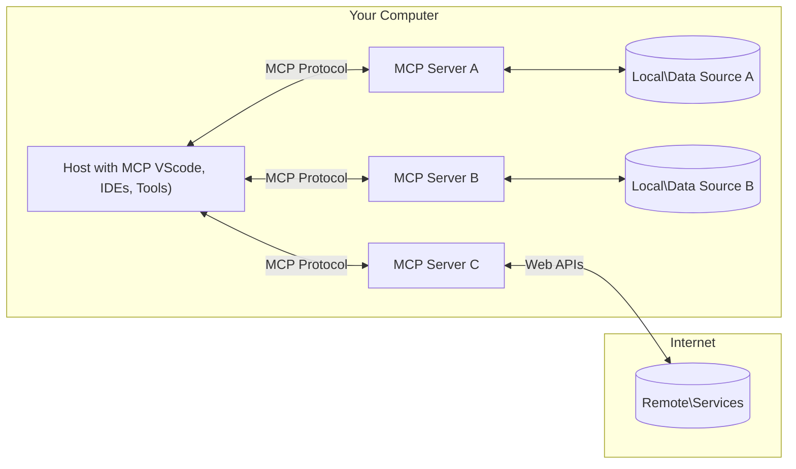

<!--
CO_OP_TRANSLATOR_METADATA:
{
  "original_hash": "b3b4a6ad10c3c0edbf7fa7cfa0ec496b",
  "translation_date": "2025-07-02T07:20:45+00:00",
  "source_file": "01-CoreConcepts/README.md",
  "language_code": "fi"
}
-->
# 📖 MCP Core Concepts: Mallikontekstiprotokollan hallinta tekoälyn integrointiin

[Model Context Protocol (MCP)](https://github.com/modelcontextprotocol) on tehokas, standardoitu kehys, joka optimoi viestinnän suurten kielimallien (LLM) ja ulkoisten työkalujen, sovellusten sekä tietolähteiden välillä. Tämä hakukoneoptimoitu opas johdattaa sinut MCP:n ydinkäsitteisiin, varmistaen, että ymmärrät sen asiakas-palvelinarkkitehtuurin, keskeiset osat, viestintämekanismit ja toteutuksen parhaat käytännöt.

## Yleiskatsaus

Tässä oppitunnissa tutustutaan Model Context Protocol (MCP) -ekosysteemin perusrakenteeseen ja komponentteihin. Opit asiakas-palvelinarkkitehtuurista, keskeisistä osista ja viestintämekanismeista, jotka mahdollistavat MCP-vuorovaikutukset.

## 👩‍🎓 Tärkeimmät oppimistavoitteet

Tämän oppitunnin lopuksi osaat:

- Ymmärtää MCP:n asiakas-palvelinarkkitehtuurin.
- Tunnistaa Hostsien, Clientsien ja Serversien roolit ja vastuut.
- Analysoida MCP:n joustavaa integraatiokerrosta määrittävät keskeiset ominaisuudet.
- Oppia, miten tieto virtaa MCP-ekosysteemissä.
- Saada käytännön näkemyksiä koodiesimerkkien kautta .NET:ssä, Javassa, Pythonissa ja JavaScriptissä.

## 🔎 MCP-arkkitehtuuri: Syvällisempi katsaus

MCP-ekosysteemi perustuu asiakas-palvelinmalliin. Tämä modulaarinen rakenne mahdollistaa tekoälysovellusten tehokkaan vuorovaikutuksen työkalujen, tietokantojen, API:en ja kontekstuaalisten resurssien kanssa. Puretaanpa tämä arkkitehtuuri sen keskeisiin osiin.

MCP perustuu asiakas-palvelinarkkitehtuuriin, jossa isäntäohjelma voi yhdistää useisiin palvelimiin:



- **MCP Hosts**: Ohjelmat kuten VSCode, Claude Desktop, IDE:t tai tekoälytyökalut, jotka haluavat käyttää dataa MCP:n kautta
- **MCP Clients**: Protokollan asiakkaat, jotka ylläpitävät 1:1-yhteyksiä palvelimiin
- **MCP Servers**: Kevyet ohjelmat, jotka tarjoavat tiettyjä toiminnallisuuksia standardoidun Model Context Protocolin kautta
- **Paikalliset tietolähteet**: Tietokoneesi tiedostot, tietokannat ja palvelut, joihin MCP-palvelimet voivat turvallisesti päästä käsiksi
- **Etäpalvelut**: Internetin kautta saatavilla olevat ulkoiset järjestelmät, joihin MCP-palvelimet voivat yhdistää API:en kautta.

MCP-protokolla on kehittyvä standardi; uusimmat päivitykset löydät [protokollan spesifikaatiosta](https://modelcontextprotocol.io/specification/2025-06-18/).

### 1. Hosts

Model Context Protocolissa (MCP) Hosts ovat keskeisessä roolissa käyttäjien ensisijaisena rajapintana protokollaan. Host-sovellukset tai -ympäristöt aloittavat yhteydet MCP-palvelimiin saadakseen käyttöönsä dataa, työkaluja ja kehotteita. Esimerkkejä Hostsista ovat integroidut kehitysympäristöt (IDE:t) kuten Visual Studio Code, tekoälytyökalut kuten Claude Desktop tai erityistehtäviin suunnitellut räätälöidyt agentit.

**Hosts** ovat LLM-sovelluksia, jotka aloittavat yhteydet. Ne:

- Suorittavat tai vuorovaikuttavat tekoälymallien kanssa vastauksien luomiseksi.
- Aloittavat yhteydet MCP-palvelimiin.
- Hallinnoivat keskustelun kulkua ja käyttöliittymää.
- Valvovat käyttöoikeuksia ja turvallisuusrajoitteita.
- Käsittelevät käyttäjän suostumuksen tiedon jakamiseen ja työkalujen suorittamiseen.

### 2. Clients

Clients ovat olennaisia komponentteja, jotka mahdollistavat Hostsien ja MCP-palvelimien välisen vuorovaikutuksen. Clients toimivat välittäjinä, joiden avulla Hosts pääsevät käyttämään MCP-palvelimien tarjoamia toimintoja. Ne varmistavat sujuvan viestinnän ja tehokkaan tiedonsiirron MCP-arkkitehtuurissa.

**Clients** ovat liittimiä host-sovelluksen sisällä. Ne:

- Lähettävät pyyntöjä palvelimille kehotteiden tai ohjeiden kanssa.
- Neuvottelevat palvelimien kanssa tuetuista ominaisuuksista.
- Hallinnoivat mallien työkalukäyttöpyyntöjä.
- Käsittelevät ja näyttävät vastaukset käyttäjille.

### 3. Servers

Servers vastaavat MCP-asiakkaiden pyyntöjen käsittelystä ja asianmukaisten vastausten toimittamisesta. Ne hallinnoivat erilaisia toimintoja kuten tiedon hakua, työkalujen suorittamista ja kehotteiden generointia. Servers varmistavat, että viestintä asiakkaiden ja Hostsien välillä on tehokasta ja luotettavaa, säilyttäen vuorovaikutuksen eheyden.

**Servers** ovat palveluita, jotka tarjoavat kontekstia ja toiminnallisuuksia. Ne:

- Rekisteröivät saatavilla olevat ominaisuudet (resurssit, kehotteet, työkalut)
- Ottavat vastaan ja suorittavat työkalukutsut asiakkaalta
- Tarjoavat kontekstuaalista tietoa mallin vastausten parantamiseksi
- Palauttavat tulokset takaisin asiakkaalle
- Ylläpitävät tilaa vuorovaikutusten aikana tarvittaessa

Servers voidaan kehittää kuka tahansa laajentamaan mallin toiminnallisuuksia erikoistuneilla ominaisuuksilla.

### 4. Server Features

Model Context Protocolin (MCP) palvelimet tarjoavat perustavanlaatuisia rakennuspalikoita, jotka mahdollistavat monipuoliset vuorovaikutukset asiakkaiden, Hostsien ja kielimallien välillä. Nämä ominaisuudet on suunniteltu parantamaan MCP:n kykyjä tarjoamalla rakenteellista kontekstia, työkaluja ja kehotteita.

MCP-palvelimet voivat tarjota seuraavia ominaisuuksia:

#### 📑 Resurssit

Resurssit Model Context Protocolissa (MCP) kattavat erilaisia kontekstin ja datan tyyppejä, joita käyttäjät tai tekoälymallit voivat hyödyntää. Näihin kuuluvat:

- **Kontekstuaalinen data**: Tieto ja konteksti, jota käyttäjät tai mallit voivat käyttää päätöksenteossa ja tehtävien suorittamisessa.
- **Tietopankit ja dokumenttivarastot**: Rakenteellista ja rakenteetonta dataa, kuten artikkeleita, manuaaleja ja tutkimuspapereita, jotka tarjoavat arvokasta tietoa ja näkemyksiä.
- **Paikalliset tiedostot ja tietokannat**: Laitteilla tai tietokannoissa tallennettua dataa, johon pääsee käsiksi käsittelyä ja analyysiä varten.
- **API:t ja web-palvelut**: Ulkoiset rajapinnat ja palvelut, jotka tarjoavat lisätietoa ja toimintoja mahdollistaen integraation erilaisiin verkkoresursseihin ja työkaluihin.

Esimerkki resurssista voi olla tietokantakaavio tai tiedosto, johon pääsee käsiksi seuraavasti:

```text
file://log.txt
database://schema
```

### 🤖 Kehotteet

Model Context Protocolin (MCP) kehotteet sisältävät erilaisia ennalta määriteltyjä malleja ja vuorovaikutuskuvioita, jotka helpottavat käyttäjän työnkulkuja ja parantavat viestintää. Näihin kuuluvat:

- **Mallinnetut viestit ja työnkulut**: Ennalta rakennetut viestit ja prosessit, jotka ohjaavat käyttäjiä tiettyjen tehtävien ja vuorovaikutusten läpi.
- **Ennalta määritellyt vuorovaikutuskuviot**: Standardoidut toimintojen ja vastausten sarjat, jotka tukevat johdonmukaista ja tehokasta viestintää.
- **Erikoistuneet keskustelumallit**: Räätälöitävät mallit tietyn tyyppisiin keskusteluihin, varmistaen asiaankuuluvat ja kontekstuaalisesti sopivat vuorovaikutukset.

Kehotepohja voi näyttää tältä:

```markdown
Generate a product slogan based on the following {{product}} with the following {{keywords}}
```

#### ⛏️ Työkalut

Model Context Protocolin (MCP) työkalut ovat toimintoja, joita tekoälymalli voi suorittaa tiettyjen tehtävien hoitamiseksi. Nämä työkalut on suunniteltu laajentamaan mallin kykyjä tarjoamalla rakenteellisia ja luotettavia toimintoja. Keskeisiä piirteitä ovat:

- **Mallin suorittamat funktiot**: Työkalut ovat suoritettavia funktioita, joita malli voi kutsua erilaisten tehtävien suorittamiseen.
- **Uniikki nimi ja kuvaus**: Jokaisella työkalulla on oma nimi ja yksityiskohtainen kuvaus, joka selittää sen tarkoituksen ja toiminnallisuuden.
- **Parametrit ja tulosteet**: Työkalut ottavat vastaan tiettyjä parametreja ja palauttavat rakenteellisia tuloksia, varmistaen johdonmukaiset ja ennakoitavat lopputulokset.
- **Erilliset funktiot**: Työkalut suorittavat erillisiä toimintoja, kuten verkkohakuja, laskelmia ja tietokantakyselyitä.

Esimerkkityökalu voisi näyttää tältä:

```typescript
server.tool(
  "GetProducts",
  {
    pageSize: z.string().optional(),
    pageCount: z.string().optional()
  }, () => {
    // return results from API
  }
)
```

## Client-ominaisuudet

Model Context Protocolissa (MCP) asiakkaat tarjoavat palvelimille useita keskeisiä ominaisuuksia, jotka parantavat protokollan toiminnallisuutta ja vuorovaikutusta. Yksi merkittävä ominaisuus on Sampling.

### 👉 Sampling

- **Palvelimen aloittamat agenttikäyttäytymiset**: Asiakkaat mahdollistavat palvelimien autonomisten toimintojen tai käyttäytymismallien käynnistämisen, lisäten järjestelmän dynaamisia kykyjä.
- **Rekursiiviset LLM-vuorovaikutukset**: Tämä ominaisuus mahdollistaa toistuvat vuorovaikutukset suurten kielimallien kanssa, mahdollistaen monimutkaisempien ja iteratiivisten tehtävien käsittelyn.
- **Lisämallivastausten pyytäminen**: Palvelimet voivat pyytää mallilta lisävalmisteluja varmistaakseen, että vastaukset ovat kattavia ja kontekstuaalisesti relevantteja.

## Tiedon kulku MCP:ssä

Model Context Protocol (MCP) määrittelee rakenteellisen tiedonkulun Hostsien, Clientsien, Serversien ja mallien välillä. Tämän kulun ymmärtäminen selkeyttää, miten käyttäjän pyynnöt käsitellään ja miten ulkoiset työkalut ja data integroidaan mallivastauksiin.

- **Host aloittaa yhteyden**  
  Host-sovellus (kuten IDE tai chat-rajapinta) muodostaa yhteyden MCP-palvelimeen, tyypillisesti STDIO:n, WebSocketin tai muun tuetun siirtotavan kautta.

- **Ominaisuuksien neuvottelu**  
  Asiakas (hostin sisällä) ja palvelin vaihtavat tietoja tuetuista ominaisuuksista, työkaluista, resursseista ja protokollaversioista. Tämä varmistaa, että molemmat osapuolet ymmärtävät käytettävissä olevat kyvyt.

- **Käyttäjän pyyntö**  
  Käyttäjä vuorovaikuttaa hostin kanssa (esim. syöttää kehotteen tai komennon). Host kerää tämän syötteen ja välittää sen asiakkaalle käsittelyä varten.

- **Resurssin tai työkalun käyttö**  
  - Asiakas voi pyytää lisäkontekstia tai resursseja palvelimelta (kuten tiedostoja, tietokanta- tai tietopankkimerkintöjä) mallin ymmärryksen rikastamiseksi.  
  - Jos malli päättää, että työkalua tarvitaan (esim. tiedon hakemiseen, laskutoimitukseen tai API-kutsuun), asiakas lähettää palvelimelle työkalukutsupyynnön, jossa määritellään työkalun nimi ja parametrit.

- **Palvelimen suoritus**  
  Palvelin vastaanottaa resurssi- tai työkalupyynnön, suorittaa tarvittavat toimenpiteet (kuten funktion suoritus, tietokantakysely tai tiedoston haku) ja palauttaa tulokset asiakkaalle rakenteellisessa muodossa.

- **Vastauksen generointi**  
  Asiakas yhdistää palvelimen vastaukset (resurssidata, työkalun tulokset jne.) käynnissä olevaan mallivaihtoon. Malli käyttää tätä tietoa laatiakseen kattavan ja kontekstuaalisesti relevantin vastauksen.

- **Tuloksen esittäminen**  
  Host vastaanottaa lopullisen tuloksen asiakkaalta ja esittää sen käyttäjälle, usein sisältäen sekä mallin generoiman tekstin että työkalujen suoritus- tai resurssihakutulokset.

Tämä tiedonkulku mahdollistaa MCP:n tukemaan kehittyneitä, interaktiivisia ja kontekstitietoisia tekoälysovelluksia yhdistämällä mallit saumattomasti ulkoisiin työkaluihin ja tietolähteisiin.

## Protokollan yksityiskohdat

MCP (Model Context Protocol) rakentuu [JSON-RPC 2.0](https://www.jsonrpc.org/) -protokollan päälle tarjoten standardoidun, kieliriippumattoman viestimuodon Hostsien, Clientsien ja Serversien väliseen viestintään. Tämä pohja mahdollistaa luotettavat, rakenteelliset ja laajennettavat vuorovaikutukset eri alustoilla ja ohjelmointikielillä.

### Keskeiset protokollaominaisuudet

MCP laajentaa JSON-RPC 2.0:aa lisäsäännöksillä työkalukutsuille, resurssien käytölle ja kehotteiden hallinnalle. Se tukee useita siirtokerroksia (STDIO, WebSocket, SSE) ja mahdollistaa turvallisen, laajennettavan ja kieliriippumattoman viestinnän komponenttien välillä.

#### 🧢 Perusprotokolla

- **JSON-RPC-viestimuoto**: Kaikki pyynnöt ja vastaukset noudattavat JSON-RPC 2.0 -määrittelyä, varmistaen yhtenäisen rakenteen metodikutsuille, parametreille, tuloksille ja virheenkäsittelylle.
- **Tilalliset yhteydet**: MCP-istunnot ylläpitävät tilaa useiden pyyntöjen yli, tukeen jatkuvia keskusteluja, kontekstin kertymistä ja resurssien hallintaa.
- **Ominaisuuksien neuvottelu**: Yhteyden muodostuksen aikana asiakkaat ja palvelimet vaihtavat tietoja tuetuista ominaisuuksista, protokollaversioista, käytettävissä olevista työkaluista ja resursseista. Tämä varmistaa molempien osapuolten kyvykkyyksien ymmärryksen ja mukautumisen.

#### ➕ Lisäapuvälineet

Alla on joitakin lisäominaisuuksia ja protokollan laajennuksia, joita MCP tarjoaa kehittäjäkokemuksen parantamiseksi ja edistyneiden skenaarioiden mahdollistamiseksi:

- **Konfigurointivaihtoehdot**: MCP sallii istuntokohtaiset asetukset, kuten työkalujen käyttöoikeudet, resurssien käyttö ja mallin asetukset, räätälöitynä kuhunkin vuorovaikutukseen.
- **Edistymisen seuranta**: Pitkät toiminnot voivat raportoida etenemistä, mahdollistaen reagoivat käyttöliittymät ja paremman käyttäjäkokemuksen monimutkaisissa tehtävissä.
- **Pyynnön peruutus**: Asiakkaat voivat peruuttaa kesken olevat pyynnöt, jolloin käyttäjät voivat keskeyttää tarpeettomat tai liian pitkään kestävät toiminnot.
- **Virheraportointi**: Standardoidut virheilmoitukset ja koodit auttavat ongelmien diagnosoinnissa, virheiden hallinnassa ja tarjoavat käyttökelpoista palautetta käyttäjille ja kehittäjille.
- **Lokitus**: Sekä asiakkaat että palvelimet voivat tuottaa rakenteellisia lokeja auditointia, virheenkorjausta ja protokollan valvontaa varten.

Näitä protokollaominaisuuksia hyödyntämällä MCP takaa vahvan, turvallisen ja joustavan viestinnän kielimallien ja ulkoisten työkalujen tai tietolähteiden välillä.

### 🔐 Turvallisuusnäkökohdat

MCP-toteutusten tulee noudattaa useita keskeisiä turvallisuusperiaatteita varmistaakseen turvalliset ja luotettavat vuorovaikutukset:

- **Käyttäjän suostumus ja kontrolli**: Käyttäjien on annettava selkeä suostumus ennen minkään datan käyttöä tai toimintojen suorittamista. Heillä tulee olla selkeä hallinta siitä, mitä tietoja jaetaan ja mitkä toimet ovat sallitt

**Vastuuvapauslauseke**:  
Tämä asiakirja on käännetty tekoälypohjaisella käännöspalvelulla [Co-op Translator](https://github.com/Azure/co-op-translator). Vaikka pyrimme tarkkuuteen, huomioithan, että automaattikäännöksissä saattaa esiintyä virheitä tai epätarkkuuksia. Alkuperäistä asiakirjaa sen alkuperäiskielellä tulee pitää virallisena lähteenä. Tärkeissä tiedoissa suositellaan ammattimaisen ihmiskääntäjän käyttöä. Emme ole vastuussa tämän käännöksen käytöstä aiheutuvista väärinymmärryksistä tai tulkinnoista.