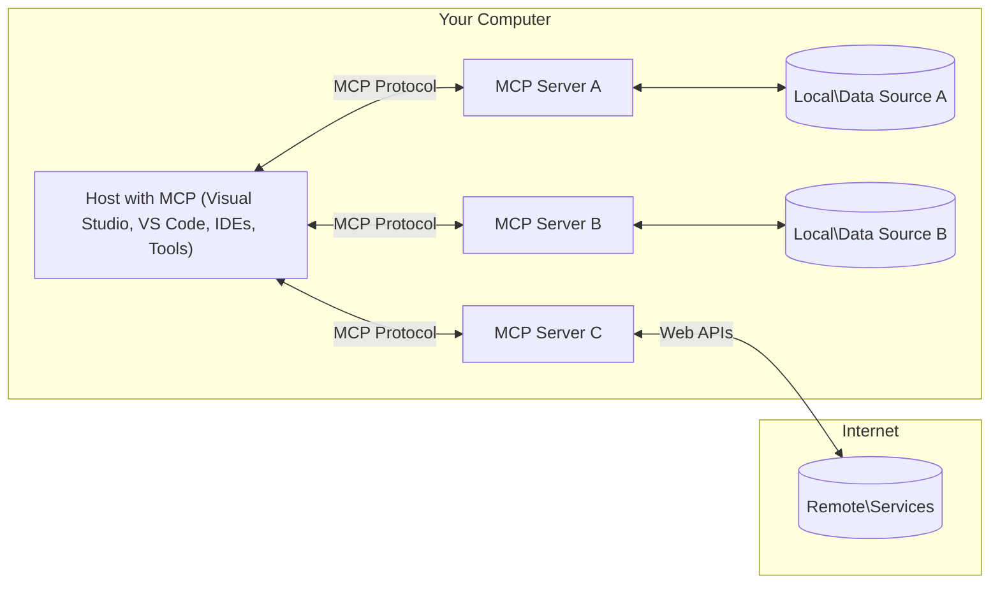

<!--
CO_OP_TRANSLATOR_METADATA:
{
  "original_hash": "904b59de1de9264801242d90a42cdd9d",
  "translation_date": "2025-09-05T11:12:43+00:00",
  "source_file": "01-CoreConcepts/README.md",
  "language_code": "fi"
}
-->
# MCP:n Peruskäsitteet: Mallikontekstiprotokollan hallinta AI-integraatiota varten

[](https://youtu.be/earDzWGtE84)

_(Klikkaa yllä olevaa kuvaa nähdäksesi tämän oppitunnin videon)_

[Model Context Protocol (MCP)](https://github.com/modelcontextprotocol) on tehokas, standardoitu kehys, joka optimoi viestinnän suurten kielimallien (LLM) ja ulkoisten työkalujen, sovellusten sekä tietolähteiden välillä. Tämä opas johdattaa sinut MCP:n peruskäsitteisiin. Opit sen asiakas-palvelin-arkkitehtuurista, keskeisistä komponenteista, viestintämekanismeista ja parhaista käytännöistä toteutuksessa.

- **Selkeä käyttäjän suostumus**: Kaikki datan käyttö ja toiminnot vaativat käyttäjän nimenomaisen hyväksynnän ennen toteutusta. Käyttäjien tulee ymmärtää selkeästi, mitä dataa käytetään ja mitä toimia suoritetaan, ja heillä tulee olla tarkka hallinta käyttöoikeuksista ja valtuutuksista.

- **Tietosuojan suojaaminen**: Käyttäjän dataa paljastetaan vain nimenomaisella suostumuksella, ja sen tulee olla suojattu vahvoilla käyttöoikeuksilla koko vuorovaikutuksen elinkaaren ajan. Toteutusten tulee estää luvaton datan siirto ja ylläpitää tiukkoja tietosuojarajoja.

- **Työkalujen turvallinen käyttö**: Jokainen työkalun käyttö vaatii käyttäjän nimenomaisen suostumuksen, ja käyttäjän tulee ymmärtää työkalun toiminnallisuus, parametrit ja mahdolliset vaikutukset. Vahvat turvallisuusrajat estävät tahattoman, turvattoman tai haitallisen työkalun käytön.

- **Kuljetuskerroksen turvallisuus**: Kaikkien viestintäkanavien tulee käyttää asianmukaisia salaus- ja todennusmekanismeja. Etäyhteyksissä tulee toteuttaa turvalliset kuljetusprotokollat ja asianmukainen tunnistetietojen hallinta.

#### Toteutusohjeet:

- **Käyttöoikeuksien hallinta**: Toteuta hienojakoiset käyttöoikeusjärjestelmät, jotka antavat käyttäjille mahdollisuuden hallita, mitkä palvelimet, työkalut ja resurssit ovat käytettävissä.
- **Todennus ja valtuutus**: Käytä turvallisia todennusmenetelmiä (OAuth, API-avaimet) asianmukaisella tokenien hallinnalla ja vanhentumisella.  
- **Syötteen validointi**: Vahvista kaikki parametrit ja datasyötteet määriteltyjen skeemojen mukaisesti injektiohyökkäysten estämiseksi.
- **Auditointilokit**: Pidä kattavat lokit kaikista toiminnoista turvallisuuden valvontaa ja vaatimustenmukaisuutta varten.

## Yleiskatsaus

Tämä oppitunti tutkii Model Context Protocol (MCP) -ekosysteemin perustavanlaatuista arkkitehtuuria ja komponentteja. Opit asiakas-palvelin-arkkitehtuurista, keskeisistä osista ja viestintämekanismeista, jotka ohjaavat MCP-vuorovaikutuksia.

## Keskeiset oppimistavoitteet

Oppitunnin lopussa osaat:

- Ymmärtää MCP:n asiakas-palvelin-arkkitehtuurin.
- Tunnistaa isäntien, asiakkaiden ja palvelimien roolit ja vastuut.
- Analysoida MCP:n joustavaksi integraatiokerrokseksi tekeviä keskeisiä ominaisuuksia.
- Oppia, miten tieto kulkee MCP-ekosysteemissä.
- Saada käytännön näkemyksiä .NET-, Java-, Python- ja JavaScript-koodiesimerkkien avulla.

## MCP-arkkitehtuuri: Syvällisempi tarkastelu

MCP-ekosysteemi perustuu asiakas-palvelin-malliin. Tämä modulaarinen rakenne mahdollistaa AI-sovellusten tehokkaan vuorovaikutuksen työkalujen, tietokantojen, API:iden ja kontekstuaalisten resurssien kanssa. Tarkastellaan tätä arkkitehtuuria sen keskeisten komponenttien kautta.

MCP:n ytimessä on asiakas-palvelin-arkkitehtuuri, jossa isäntäsovellus voi muodostaa yhteyden useisiin palvelimiin:



- **MCP-isännät**: Ohjelmat kuten VSCode, Claude Desktop, IDE:t tai AI-työkalut, jotka haluavat käyttää dataa MCP:n kautta.
- **MCP-asiakkaat**: Protokolla-asiakkaat, jotka ylläpitävät 1:1-yhteyksiä palvelimiin.
- **MCP-palvelimet**: Kevyet ohjelmat, jotka tarjoavat tiettyjä ominaisuuksia standardoidun Model Context Protocolin kautta.
- **Paikalliset tietolähteet**: Tietokoneesi tiedostot, tietokannat ja palvelut, joihin MCP-palvelimet voivat turvallisesti päästä käsiksi.
- **Etäpalvelut**: Internetin kautta saatavilla olevat ulkoiset järjestelmät, joihin MCP-palvelimet voivat muodostaa yhteyden API:iden kautta.

MCP-protokolla on kehittyvä standardi, joka käyttää päivämääräpohjaista versiointia (YYYY-MM-DD-muoto). Nykyinen protokollaversio on **2025-06-18**. Voit nähdä viimeisimmät päivitykset [protokollan spesifikaatiosta](https://modelcontextprotocol.io/specification/2025-06-18/).

### 1. Isännät

Model Context Protocolissa (MCP) **isännät** ovat AI-sovelluksia, jotka toimivat ensisijaisena käyttöliittymänä, jonka kautta käyttäjät ovat vuorovaikutuksessa protokollan kanssa. Isännät koordinoivat ja hallitsevat yhteyksiä useisiin MCP-palvelimiin luomalla omistettuja MCP-asiakkaita jokaista palvelinyhteyttä varten. Esimerkkejä isännistä:

- **AI-sovellukset**: Claude Desktop, Visual Studio Code, Claude Code
- **Kehitysympäristöt**: IDE:t ja koodieditorit MCP-integraatiolla  
- **Mukautetut sovellukset**: Tarkoitukseen rakennetut AI-agentit ja työkalut

**Isännät** ovat sovelluksia, jotka koordinoivat AI-mallien vuorovaikutuksia. Ne:

- **Orkestroivat AI-malleja**: Suorittavat tai ovat vuorovaikutuksessa LLM:ien kanssa tuottaakseen vastauksia ja koordinoidakseen AI-työnkulkuja.
- **Hallinnoivat asiakasyhteyksiä**: Luovat ja ylläpitävät yhden MCP-asiakkaan per MCP-palvelinyhteys.
- **Ohjaavat käyttöliittymää**: Käsittelevät keskustelun kulkua, käyttäjän vuorovaikutuksia ja vastausten esittämistä.  
- **Valvovat turvallisuutta**: Hallitsevat käyttöoikeuksia, turvallisuusrajoituksia ja todennusta.
- **Käsittelevät käyttäjän suostumusta**: Hallitsevat käyttäjän hyväksyntää datan jakamiseen ja työkalujen käyttöön.

### 2. Asiakkaat

**Asiakkaat** ovat keskeisiä komponentteja, jotka ylläpitävät omistettuja yksi-yhteen-yhteyksiä isäntien ja MCP-palvelimien välillä. Jokainen MCP-asiakas luodaan isännän toimesta yhdistämään tiettyyn MCP-palvelimeen, mikä varmistaa järjestelmälliset ja turvalliset viestintäkanavat. Useat asiakkaat mahdollistavat isännille yhteyden useisiin palvelimiin samanaikaisesti.

**Asiakkaat** ovat liitoskomponentteja isäntäsovelluksessa. Ne:

- **Protokollaviestintä**: Lähettävät JSON-RPC 2.0 -pyyntöjä palvelimille kehotteiden ja ohjeiden kanssa.
- **Ominaisuusneuvottelu**: Neuvottelevat tuetuista ominaisuuksista ja protokollaversioista palvelimien kanssa alustuksen aikana.
- **Työkalujen käyttö**: Hallitsevat työkalujen käyttöpyyntöjä malleilta ja käsittelevät vastauksia.
- **Reaaliaikaiset päivitykset**: Käsittelevät ilmoituksia ja reaaliaikaisia päivityksiä palvelimilta.
- **Vastausten käsittely**: Käsittelevät ja muotoilevat palvelimien vastaukset käyttäjille esitettäväksi.

### 3. Palvelimet

**Palvelimet** ovat ohjelmia, jotka tarjoavat kontekstia, työkaluja ja ominaisuuksia MCP-asiakkaille. Ne voivat toimia paikallisesti (samalla koneella kuin isäntä) tai etänä (ulkoisilla alustoilla), ja niiden tehtävänä on käsitellä asiakaspyyntöjä ja tarjota jäsenneltyjä vastauksia. Palvelimet tarjoavat tiettyä toiminnallisuutta standardoidun Model Context Protocolin kautta.

**Palvelimet** ovat palveluita, jotka tarjoavat kontekstia ja ominaisuuksia. Ne:

- **Ominaisuuksien rekisteröinti**: Rekisteröivät ja tarjoavat käytettävissä olevat primitiivit (resurssit, kehotteet, työkalut) asiakkaille.
- **Pyyntöjen käsittely**: Vastaanottavat ja suorittavat työkalukutsut, resurssipyynnöt ja kehotepyynnöt asiakkailta.
- **Kontekstin tarjoaminen**: Tarjoavat kontekstuaalista tietoa ja dataa mallivastausten parantamiseksi.
- **Tilanhallinta**: Ylläpitävät istunnon tilaa ja käsittelevät tilallisia vuorovaikutuksia tarvittaessa.
- **Reaaliaikaiset ilmoitukset**: Lähettävät ilmoituksia ominaisuuksien muutoksista ja päivityksistä yhdistetyille asiakkaille.

Palvelimet voidaan kehittää kenen tahansa toimesta laajentamaan mallien ominaisuuksia erikoistuneella toiminnallisuudella, ja ne tukevat sekä paikallisia että etäkäyttöön tarkoitettuja toteutuksia.

### 4. Palvelimen primitiivit

Model Context Protocolin (MCP) palvelimet tarjoavat kolme keskeistä **primitiiviä**, jotka määrittelevät perusrakenteet rikkaalle vuorovaikutukselle asiakkaiden, isäntien ja kielimallien välillä. Nämä primitiivit määrittelevät, millaisia kontekstuaalisia tietoja ja toimia protokollan kautta on saatavilla.

MCP-palvelimet voivat tarjota minkä tahansa yhdistelmän seuraavista kolmesta keskeisestä primitiivistä:

#### Resurssit

**Resurssit** ovat tietolähteitä, jotka tarjoavat kontekstuaalista tietoa AI-sovelluksille. Ne edustavat staattista tai dynaamista sisältöä, joka voi parantaa mallin ymmärrystä ja päätöksentekoa:

- **Kontekstuaalinen data**: Jäsenneltyä tietoa ja kontekstia AI-mallin käyttöön.
- **Tietopohjat**: Dokumenttivarastot, artikkelit, käyttöohjeet ja tutkimuspaperit.
- **Paikalliset tietolähteet**: Tiedostot, tietokannat ja paikallisen järjestelmän tiedot.  
- **Ulkoiset tiedot**: API-vastaukset, verkkopalvelut ja etäjärjestelmän tiedot.
- **Dynaaminen sisältö**: Reaaliaikainen data, joka päivittyy ulkoisten olosuhteiden mukaan.

Resurssit tunnistetaan URI:iden avulla, ja niiden löytämistä tuetaan `resources/list`- ja `resources/read`-menetelmillä:

```text
file://documents/project-spec.md
database://production/users/schema
api://weather/current
```

#### Kehotteet

**Kehotteet** ovat uudelleenkäytettäviä malleja, jotka auttavat jäsentämään vuorovaikutuksia kielimallien kanssa. Ne tarjoavat standardoituja vuorovaikutusmalleja ja mallipohjaisia työnkulkuja:

- **Mallipohjaiset vuorovaikutukset**: Ennalta jäsenneltyjä viestejä ja keskustelun aloituksia.
- **Työnkulun mallit**: Standardoidut sekvenssit yleisiin tehtäviin ja vuorovaikutuksiin.
- **Few-shot-esimerkit**: Esimerkkipohjaiset mallit mallin ohjeistukseen.
- **Järjestelmäkehotteet**: Peruskehotteet, jotka määrittelevät mallin käyttäytymisen ja kontekstin.
- **Dynaamiset mallit**: Parametrisoidut kehotteet, jotka mukautuvat tiettyihin konteksteihin.

Kehotteet tukevat muuttujien korvaamista, ja ne voidaan löytää `prompts/list`- ja hakea `prompts/get`-menetelmillä:

```markdown
Generate a {{task_type}} for {{product}} targeting {{audience}} with the following requirements: {{requirements}}
```

#### Työkalut

**Työkalut** ovat suoritettavia toimintoja, joita AI-mallit voivat kutsua suorittaakseen tiettyjä toimia. Ne edustavat MCP-ekosysteemin "verbejä", jotka mahdollistavat mallien vuorovaikutuksen ulkoisten järjestelmien kanssa:

- **Suoritettavat toiminnot**: Erillisiä operaatioita, joita mallit voivat kutsua tietyillä parametreilla.
- **Ulkoisten järjestelmien integrointi**: API-kutsut, tietokantakyselyt, tiedosto-operaatiot, laskelmat.
- **Uniikki identiteetti**: Jokaisella työkalulla on erillinen nimi, kuvaus ja parametriskeema.
- **Jäsennelty I/O**: Työkalut hyväksyvät validoidut parametrit ja palauttavat jäsenneltyjä, tyypitettyjä vastauksia.
- **Toimintakyvyt**: Mahdollistavat mallien suorittaa tosielämän toimia ja hakea reaaliaikaista dataa.

Työkalut määritellään JSON-skeemalla parametrien validointia varten, ja ne voidaan löytää `tools/list`- ja suorittaa `tools/call`-menetelmillä:

```typescript
server.tool(
  "search_products", 
  {
    query: z.string().describe("Search query for products"),
    category: z.string().optional().describe("Product category filter"),
    max_results: z.number().default(10).describe("Maximum results to return")
  }, 
  async (params) => {
    // Execute search and return structured results
    return await productService.search(params);
  }
);
```

## Asiakasprimitiivit

Model Context Protocolissa (MCP) **asiakkaat** voivat tarjota primitiivejä, jotka mahdollistavat palvelimien pyytää lisäominaisuuksia isäntäsovellukselta. Nämä asiakaspuolen primitiivit mahdollistavat rikkaammat, interaktiivisemmat palvelintoteutukset, jotka voivat käyttää AI-mallin ominaisuuksia ja käyttäjän vuorovaikutuksia.

### Näytteenotto

**Näytteenotto** mahdollistaa palvelimien pyytää kielimallin täydentämisiä asiakkaan AI-sovelluksesta. Tämä primitiivi mahdollistaa palvelimien käyttää LLM-ominaisuuksia ilman omien malliriippuvuuksien sisällyttämistä:

- **Mallista riippumaton pääsy**: Palvelimet voivat pyytää täydentämisiä ilman LLM-SDK:iden sisällyttämistä tai mallin käyttöoikeuden hallintaa.
- **Palvelimen aloittama AI**: Mahdollistaa palvelimien luoda sisältöä itsenäisesti asiakkaan AI-mallin avulla.
- **Rekursiiviset LLM-vuorovaikutukset**: Tukee monimutkaisia skenaarioita, joissa palvelimet tarvitsevat AI-apua käsittelyyn.
- **Dynaaminen sisällön luominen**: Mahdollistaa palvelimien luoda kontekstuaalisia vastauksia isännän mallin avulla.

Näytteenotto käynnistetään `sampling/complete`-menetelmällä, jossa palvelimet lähettävät täydentämispyyntöjä asiakkaille.

### Tiedustelu  

**Tiedustelu** mahdollistaa palvelimien pyytää lisätietoja tai vahvistusta käyttäjiltä asiakasliittymän kautta:

- **Käyttäjän syötteen pyynnöt**: Palvelimet voivat pyytää lisätietoja, kun niitä tarvitaan työkalun käyttöön.
- **Vahvistusdialogit**: Pyydä käyttäjän hyväksyntää arkaluonteisiin tai merkittäviin toimiin.
- **Interaktiiviset työnkulut**: Mahdollista palvelimien luoda vaiheittaisia käyttäjän vuorovaikutuksia.
- **Dynaaminen parametrien keräys**: Kerää puuttuvat tai valinnaiset parametrit työkalun käytön aikana.

Tiedustelupyynnöt tehdään `elicitation/request`-menetelmällä käyttäjän syötteen keräämiseksi asiakasliittymän kautta.

### Lokitus

**Lokitus** mahdollistaa palvelimien lähettää jäsenneltyjä lokiviestejä asiakkaille virheenkorjaukseen, valvontaan ja operatiiviseen näkyvyyteen:

- **Virheenkorjaustuki**: Mahdollista palvelimien tarjota yksityiskohtaisia suorituksen lokitietoja vianmääritystä varten.
- **Operatiivinen valvonta**: Lähetä tilapäivityksiä ja suorituskykymittareita asiakkaille.
- **Virheraportointi**: Tarjoa yksityiskohtainen vir
- **JSON-RPC 2.0 -protokolla**: Kaikki viestintä käyttää standardoitua JSON-RPC 2.0 -viestimuotoa metodikutsuille, vastauksille ja ilmoituksille  
- **Elinkaaren hallinta**: Hoitaa yhteyden alustamisen, kyvykkyyksien neuvottelun ja istunnon päättämisen asiakkaiden ja palvelimien välillä  
- **Palvelimen perustoiminnot**: Mahdollistaa palvelimien tarjoavan ydintoimintoja työkalujen, resurssien ja kehotteiden avulla  
- **Asiakkaan perustoiminnot**: Mahdollistaa palvelimien pyytää näytteitä LLM:iltä, kerätä käyttäjän syötteitä ja lähettää lokiviestejä  
- **Reaaliaikaiset ilmoitukset**: Tukee asynkronisia ilmoituksia dynaamisille päivityksille ilman kyselyä  

#### Keskeiset ominaisuudet:

- **Protokollaversion neuvottelu**: Käyttää päivämääräpohjaista versiointia (VVVV-KK-PP) yhteensopivuuden varmistamiseksi  
- **Kyvykkyyksien tunnistus**: Asiakkaat ja palvelimet vaihtavat tuettujen ominaisuuksien tietoja alustuksen aikana  
- **Tilalliset istunnot**: Säilyttää yhteyden tilan useiden vuorovaikutusten ajan kontekstin jatkuvuuden varmistamiseksi  

### Kuljetuskerros

**Kuljetuskerros** hallitsee viestintäkanavia, viestien kehystämistä ja autentikointia MCP-osallistujien välillä:

#### Tuetut kuljetusmekanismit:

1. **STDIO-kuljetus**:  
   - Käyttää standardoituja syöte-/tulostusvirtoja suoraan prosessien väliseen viestintään  
   - Optimaalinen paikallisille prosesseille samalla koneella ilman verkkoylikuormitusta  
   - Yleisesti käytetty paikallisissa MCP-palvelinratkaisuissa  

2. **Streamable HTTP -kuljetus**:  
   - Käyttää HTTP POST -pyyntöjä asiakas-palvelin-viesteihin  
   - Valinnaiset Server-Sent Events (SSE) palvelimen ja asiakkaan väliseen suoratoistoon  
   - Mahdollistaa etäpalvelimen viestinnän verkkojen välillä  
   - Tukee standardia HTTP-autentikointia (bearer-tunnisteet, API-avaimet, mukautetut otsikot)  
   - MCP suosittelee OAuthia turvalliseen tunnistepohjaiseen autentikointiin  

#### Kuljetuksen abstraktio:

Kuljetuskerros abstrahoi viestinnän yksityiskohdat datakerroksesta, mahdollistaen saman JSON-RPC 2.0 -viestimuodon kaikissa kuljetusmekanismeissa. Tämä abstraktio mahdollistaa sovellusten siirtymisen paikallisten ja etäpalvelimien välillä saumattomasti.

### Turvallisuushuomiot

MCP-toteutusten on noudatettava useita kriittisiä turvallisuusperiaatteita varmistaakseen turvalliset, luotettavat ja suojatut vuorovaikutukset kaikissa protokollaoperaatioissa:

- **Käyttäjän suostumus ja hallinta**: Käyttäjien on annettava nimenomainen suostumus ennen kuin mitään dataa käytetään tai operaatioita suoritetaan. Heillä tulee olla selkeä hallinta siitä, mitä dataa jaetaan ja mitkä toiminnot ovat sallittuja, tukien intuitiivisia käyttöliittymiä toimintojen tarkasteluun ja hyväksymiseen.

- **Tietosuoja**: Käyttäjän dataa tulee paljastaa vain nimenomaisella suostumuksella, ja sen on oltava suojattu asianmukaisilla käyttöoikeuksilla. MCP-toteutusten on estettävä luvaton datan siirto ja varmistettava, että yksityisyys säilyy kaikissa vuorovaikutuksissa.

- **Työkalujen turvallisuus**: Ennen minkään työkalun käyttöönottoa vaaditaan käyttäjän nimenomainen suostumus. Käyttäjillä tulee olla selkeä ymmärrys kunkin työkalun toiminnallisuudesta, ja vahvat turvallisuusrajat on asetettava estämään tahattomat tai vaaralliset työkalutoiminnot.

Noudattamalla näitä turvallisuusperiaatteita MCP varmistaa käyttäjien luottamuksen, yksityisyyden ja turvallisuuden säilymisen kaikissa protokollan vuorovaikutuksissa samalla kun mahdollistetaan tehokkaat tekoälyintegraatiot.

## Koodiesimerkit: Keskeiset komponentit

Alla on koodiesimerkkejä useilla suosituilla ohjelmointikielillä, jotka havainnollistavat MCP-palvelimen keskeisten komponenttien ja työkalujen toteutusta.

### .NET-esimerkki: Yksinkertaisen MCP-palvelimen luominen työkaluilla

Tässä on käytännön .NET-koodiesimerkki, joka havainnollistaa yksinkertaisen MCP-palvelimen toteutusta mukautetuilla työkaluilla. Esimerkki näyttää, kuinka määritellä ja rekisteröidä työkaluja, käsitellä pyyntöjä ja yhdistää palvelin Model Context Protocolin avulla.

```csharp
using System;
using System.Threading.Tasks;
using ModelContextProtocol.Server;
using ModelContextProtocol.Server.Transport;
using ModelContextProtocol.Server.Tools;

public class WeatherServer
{
    public static async Task Main(string[] args)
    {
        // Create an MCP server
        var server = new McpServer(
            name: "Weather MCP Server",
            version: "1.0.0"
        );
        
        // Register our custom weather tool
        server.AddTool<string, WeatherData>("weatherTool", 
            description: "Gets current weather for a location",
            execute: async (location) => {
                // Call weather API (simplified)
                var weatherData = await GetWeatherDataAsync(location);
                return weatherData;
            });
        
        // Connect the server using stdio transport
        var transport = new StdioServerTransport();
        await server.ConnectAsync(transport);
        
        Console.WriteLine("Weather MCP Server started");
        
        // Keep the server running until process is terminated
        await Task.Delay(-1);
    }
    
    private static async Task<WeatherData> GetWeatherDataAsync(string location)
    {
        // This would normally call a weather API
        // Simplified for demonstration
        await Task.Delay(100); // Simulate API call
        return new WeatherData { 
            Temperature = 72.5,
            Conditions = "Sunny",
            Location = location
        };
    }
}

public class WeatherData
{
    public double Temperature { get; set; }
    public string Conditions { get; set; }
    public string Location { get; set; }
}
```

### Java-esimerkki: MCP-palvelimen komponentit

Tämä esimerkki havainnollistaa samaa MCP-palvelinta ja työkalujen rekisteröintiä kuin yllä oleva .NET-esimerkki, mutta toteutettuna Javalla.

```java
import io.modelcontextprotocol.server.McpServer;
import io.modelcontextprotocol.server.McpToolDefinition;
import io.modelcontextprotocol.server.transport.StdioServerTransport;
import io.modelcontextprotocol.server.tool.ToolExecutionContext;
import io.modelcontextprotocol.server.tool.ToolResponse;

public class WeatherMcpServer {
    public static void main(String[] args) throws Exception {
        // Create an MCP server
        McpServer server = McpServer.builder()
            .name("Weather MCP Server")
            .version("1.0.0")
            .build();
            
        // Register a weather tool
        server.registerTool(McpToolDefinition.builder("weatherTool")
            .description("Gets current weather for a location")
            .parameter("location", String.class)
            .execute((ToolExecutionContext ctx) -> {
                String location = ctx.getParameter("location", String.class);
                
                // Get weather data (simplified)
                WeatherData data = getWeatherData(location);
                
                // Return formatted response
                return ToolResponse.content(
                    String.format("Temperature: %.1f°F, Conditions: %s, Location: %s", 
                    data.getTemperature(), 
                    data.getConditions(), 
                    data.getLocation())
                );
            })
            .build());
        
        // Connect the server using stdio transport
        try (StdioServerTransport transport = new StdioServerTransport()) {
            server.connect(transport);
            System.out.println("Weather MCP Server started");
            // Keep server running until process is terminated
            Thread.currentThread().join();
        }
    }
    
    private static WeatherData getWeatherData(String location) {
        // Implementation would call a weather API
        // Simplified for example purposes
        return new WeatherData(72.5, "Sunny", location);
    }
}

class WeatherData {
    private double temperature;
    private String conditions;
    private String location;
    
    public WeatherData(double temperature, String conditions, String location) {
        this.temperature = temperature;
        this.conditions = conditions;
        this.location = location;
    }
    
    public double getTemperature() {
        return temperature;
    }
    
    public String getConditions() {
        return conditions;
    }
    
    public String getLocation() {
        return location;
    }
}
```

### Python-esimerkki: MCP-palvelimen rakentaminen

Tämä esimerkki käyttää fastmcp-kirjastoa, joten varmista, että asennat sen ensin:

```python
pip install fastmcp
```  
Koodiesimerkki:  

```python
#!/usr/bin/env python3
import asyncio
from fastmcp import FastMCP
from fastmcp.transports.stdio import serve_stdio

# Create a FastMCP server
mcp = FastMCP(
    name="Weather MCP Server",
    version="1.0.0"
)

@mcp.tool()
def get_weather(location: str) -> dict:
    """Gets current weather for a location."""
    return {
        "temperature": 72.5,
        "conditions": "Sunny",
        "location": location
    }

# Alternative approach using a class
class WeatherTools:
    @mcp.tool()
    def forecast(self, location: str, days: int = 1) -> dict:
        """Gets weather forecast for a location for the specified number of days."""
        return {
            "location": location,
            "forecast": [
                {"day": i+1, "temperature": 70 + i, "conditions": "Partly Cloudy"}
                for i in range(days)
            ]
        }

# Register class tools
weather_tools = WeatherTools()

# Start the server
if __name__ == "__main__":
    asyncio.run(serve_stdio(mcp))
```

### JavaScript-esimerkki: MCP-palvelimen luominen

Tämä esimerkki näyttää MCP-palvelimen luomisen JavaScriptillä ja kuinka rekisteröidä kaksi säähän liittyvää työkalua.

```javascript
// Using the official Model Context Protocol SDK
import { McpServer } from "@modelcontextprotocol/sdk/server/mcp.js";
import { StdioServerTransport } from "@modelcontextprotocol/sdk/server/stdio.js";
import { z } from "zod"; // For parameter validation

// Create an MCP server
const server = new McpServer({
  name: "Weather MCP Server",
  version: "1.0.0"
});

// Define a weather tool
server.tool(
  "weatherTool",
  {
    location: z.string().describe("The location to get weather for")
  },
  async ({ location }) => {
    // This would normally call a weather API
    // Simplified for demonstration
    const weatherData = await getWeatherData(location);
    
    return {
      content: [
        { 
          type: "text", 
          text: `Temperature: ${weatherData.temperature}°F, Conditions: ${weatherData.conditions}, Location: ${weatherData.location}` 
        }
      ]
    };
  }
);

// Define a forecast tool
server.tool(
  "forecastTool",
  {
    location: z.string(),
    days: z.number().default(3).describe("Number of days for forecast")
  },
  async ({ location, days }) => {
    // This would normally call a weather API
    // Simplified for demonstration
    const forecast = await getForecastData(location, days);
    
    return {
      content: [
        { 
          type: "text", 
          text: `${days}-day forecast for ${location}: ${JSON.stringify(forecast)}` 
        }
      ]
    };
  }
);

// Helper functions
async function getWeatherData(location) {
  // Simulate API call
  return {
    temperature: 72.5,
    conditions: "Sunny",
    location: location
  };
}

async function getForecastData(location, days) {
  // Simulate API call
  return Array.from({ length: days }, (_, i) => ({
    day: i + 1,
    temperature: 70 + Math.floor(Math.random() * 10),
    conditions: i % 2 === 0 ? "Sunny" : "Partly Cloudy"
  }));
}

// Connect the server using stdio transport
const transport = new StdioServerTransport();
server.connect(transport).catch(console.error);

console.log("Weather MCP Server started");
```

Tämä JavaScript-esimerkki havainnollistaa, kuinka luoda MCP-asiakas, joka yhdistyy palvelimeen, lähettää kehotteen ja käsittelee vastauksen, mukaan lukien mahdolliset työkalukutsut.

## Turvallisuus ja valtuutus

MCP sisältää useita sisäänrakennettuja konsepteja ja mekanismeja turvallisuuden ja valtuutuksen hallintaan protokollan aikana:

1. **Työkalujen käyttöoikeuksien hallinta**:  
   Asiakkaat voivat määrittää, mitä työkaluja malli saa käyttää istunnon aikana. Tämä varmistaa, että vain nimenomaisesti valtuutetut työkalut ovat käytettävissä, vähentäen tahattomien tai vaarallisten operaatioiden riskiä. Käyttöoikeudet voidaan määrittää dynaamisesti käyttäjän mieltymysten, organisaation käytäntöjen tai vuorovaikutuksen kontekstin perusteella.

2. **Autentikointi**:  
   Palvelimet voivat vaatia autentikointia ennen työkalujen, resurssien tai arkaluontoisten operaatioiden käyttöoikeuden myöntämistä. Tämä voi sisältää API-avaimia, OAuth-tunnisteita tai muita autentikointimenetelmiä. Oikea autentikointi varmistaa, että vain luotetut asiakkaat ja käyttäjät voivat käyttää palvelimen toimintoja.

3. **Validointi**:  
   Parametrien validointi on pakollista kaikille työkalukutsuille. Jokainen työkalu määrittelee odotetut tyypit, muodot ja rajoitukset parametreilleen, ja palvelin validoi saapuvat pyynnöt vastaavasti. Tämä estää virheellisten tai haitallisten syötteiden pääsyn työkalutoteutuksiin ja auttaa säilyttämään operaatioiden eheyden.

4. **Nopeusrajoitukset**:  
   Estääkseen väärinkäytön ja varmistaakseen palvelinresurssien oikeudenmukaisen käytön MCP-palvelimet voivat toteuttaa nopeusrajoituksia työkalukutsuille ja resurssien käytölle. Nopeusrajoituksia voidaan soveltaa käyttäjäkohtaisesti, istuntokohtaisesti tai globaalisti, ja ne auttavat suojaamaan palvelimia palvelunestohyökkäyksiltä tai liialliselta resurssien kulutukselta.

Yhdistämällä nämä mekanismit MCP tarjoaa turvallisen perustan kielimallien integroimiselle ulkoisiin työkaluihin ja tietolähteisiin, samalla kun se antaa käyttäjille ja kehittäjille hienojakoisen hallinnan käyttöoikeuksiin ja käyttöön.

## Protokollaviestit ja viestintävirta

MCP-viestintä käyttää jäsenneltyjä **JSON-RPC 2.0** -viestejä selkeiden ja luotettavien vuorovaikutusten mahdollistamiseksi isäntien, asiakkaiden ja palvelimien välillä. Protokolla määrittelee erityiset viestikuviot eri tyyppisille operaatioille:

### Keskeiset viestityypit:

#### **Alustusviestit**  
- **`initialize`-pyyntö**: Alustaa yhteyden ja neuvottelee protokollaversion ja kyvykkyydet  
- **`initialize`-vastaus**: Vahvistaa tuetut ominaisuudet ja palvelintiedot  
- **`notifications/initialized`**: Ilmoittaa, että alustus on valmis ja istunto on käyttövalmis  

#### **Tunnistusviestit**  
- **`tools/list`-pyyntö**: Tunnistaa palvelimen saatavilla olevat työkalut  
- **`resources/list`-pyyntö**: Listaa saatavilla olevat resurssit (tietolähteet)  
- **`prompts/list`-pyyntö**: Hakee saatavilla olevat kehotepohjat  

#### **Suoritusviestit**  
- **`tools/call`-pyyntö**: Suorittaa tietyn työkalun annetuilla parametreilla  
- **`resources/read`-pyyntö**: Hakee sisältöä tietystä resurssista  
- **`prompts/get`-pyyntö**: Hakee kehotepohjan valinnaisilla parametreilla  

#### **Asiakaspuolen viestit**  
- **`sampling/complete`-pyyntö**: Palvelin pyytää LLM:n täydentämistä asiakkaalta  
- **`elicitation/request`**: Palvelin pyytää käyttäjän syötettä asiakasliittymän kautta  
- **Lokiviestit**: Palvelin lähettää jäsenneltyjä lokiviestejä asiakkaalle  

#### **Ilmoitusviestit**  
- **`notifications/tools/list_changed`**: Palvelin ilmoittaa asiakkaalle työkalumuutoksista  
- **`notifications/resources/list_changed`**: Palvelin ilmoittaa asiakkaalle resurssimuutoksista  
- **`notifications/prompts/list_changed`**: Palvelin ilmoittaa asiakkaalle kehotemuutoksista  

### Viestirakenne:

Kaikki MCP-viestit noudattavat JSON-RPC 2.0 -muotoa:  
- **Pyyntöviestit**: Sisältävät `id`, `method` ja valinnaiset `params`  
- **Vastausviestit**: Sisältävät `id` ja joko `result` tai `error`  
- **Ilmoitusviestit**: Sisältävät `method` ja valinnaiset `params` (ei `id` eikä vastausta odoteta)  

Tämä jäsennelty viestintä varmistaa luotettavat, jäljitettävät ja laajennettavat vuorovaikutukset, jotka tukevat edistyneitä skenaarioita, kuten reaaliaikaisia päivityksiä, työkaluketjutusta ja vankkaa virheenkäsittelyä.

## Keskeiset huomiot

- **Arkkitehtuuri**: MCP käyttää asiakas-palvelin-arkkitehtuuria, jossa isännät hallitsevat useita asiakasyhteyksiä palvelimiin  
- **Osallistujat**: Ekosysteemi sisältää isännät (tekoälysovellukset), asiakkaat (protokollaliittimet) ja palvelimet (kyvykkyyksien tarjoajat)  
- **Kuljetusmekanismit**: Viestintä tukee STDIO:ta (paikallinen) ja Streamable HTTP:tä valinnaisella SSE:llä (etäyhteys)  
- **Ydintoiminnot**: Palvelimet tarjoavat työkaluja (suoritettavia toimintoja), resursseja (tietolähteitä) ja kehotteita (pohjia)  
- **Asiakkaan perustoiminnot**: Palvelimet voivat pyytää näytteitä (LLM-täydennyksiä), kerätä käyttäjän syötteitä ja lokittaa asiakkaalta  
- **Protokollan perusta**: Rakennettu JSON-RPC 2.0:n päälle päivämääräpohjaisella versioinnilla (nykyinen: 2025-06-18)  
- **Reaaliaikaiset kyvykkyydet**: Tukee ilmoituksia dynaamisille päivityksille ja reaaliaikaiselle synkronoinnille  
- **Turvallisuus ensin**: Käyttäjän nimenomainen suostumus, tietosuojan suojaaminen ja turvallinen kuljetus ovat keskeisiä vaatimuksia  

## Harjoitus

Suunnittele yksinkertainen MCP-työkalu, joka olisi hyödyllinen omalla alallasi. Määrittele:  
1. Työkalun nimi  
2. Mitä parametreja se hyväksyy  
3. Mitä tulostetta se palauttaa  
4. Kuinka malli voisi käyttää tätä työkalua ratkaistakseen käyttäjän ongelmia  

---

## Mitä seuraavaksi

Seuraavaksi: [Luku 2: Turvallisuus](../02-Security/README.md)

---

**Vastuuvapauslauseke**:  
Tämä asiakirja on käännetty käyttämällä tekoälypohjaista käännöspalvelua [Co-op Translator](https://github.com/Azure/co-op-translator). Vaikka pyrimme tarkkuuteen, huomioithan, että automaattiset käännökset voivat sisältää virheitä tai epätarkkuuksia. Alkuperäistä asiakirjaa sen alkuperäisellä kielellä tulee pitää ensisijaisena lähteenä. Kriittisen tiedon osalta suositellaan ammattimaista ihmiskääntämistä. Emme ole vastuussa väärinkäsityksistä tai virhetulkinnoista, jotka johtuvat tämän käännöksen käytöstä.