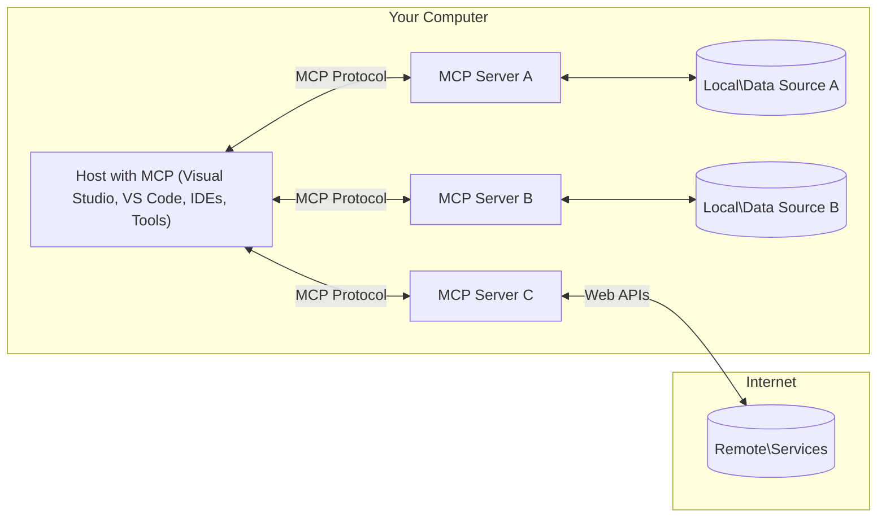

<!--
CO_OP_TRANSLATOR_METADATA:
{
  "original_hash": "0a6a7bcb289c024a91289e0444cb370b",
  "translation_date": "2025-08-18T15:58:30+00:00",
  "source_file": "01-CoreConcepts/README.md",
  "language_code": "fi"
}
-->
# MCP:n Peruskäsitteet: Mallikontekstiprotokollan hallinta tekoälyn integrointiin

[](https://youtu.be/earDzWGtE84)

_(Klikkaa yllä olevaa kuvaa katsoaksesi tämän oppitunnin videon)_

[Model Context Protocol (MCP)](https://gi- **Selkeä käyttäjän suostumus**: Kaikki tietojen käyttö ja toiminnot edellyttävät käyttäjän nimenomaista hyväksyntää ennen suorittamista. Käyttäjien on ymmärrettävä selkeästi, mitä tietoja käytetään ja mitä toimia suoritetaan, ja heillä on oltava tarkka hallinta käyttöoikeuksista ja valtuutuksista.

- **Tietosuojan suojaaminen**: Käyttäjätietoja paljastetaan vain nimenomaisella suostumuksella, ja niitä on suojattava vahvoilla käyttöoikeuksilla koko vuorovaikutuksen elinkaaren ajan. Toteutusten on estettävä luvaton tiedonsiirto ja ylläpidettävä tiukkoja tietosuojarajoja.

- **Työkalujen turvallinen käyttö**: Jokainen työkalun kutsu vaatii käyttäjän nimenomaisen suostumuksen, ja käyttäjän on ymmärrettävä selkeästi työkalun toiminnallisuus, parametrit ja mahdolliset vaikutukset. Vahvat turvarajat on asetettava estämään tahattomat, turvattomat tai haitalliset työkalujen käytöt.

- **Kuljetuskerroksen turvallisuus**: Kaikkien viestintäkanavien on käytettävä asianmukaisia salaus- ja todennusmekanismeja. Etäyhteyksissä on käytettävä turvallisia kuljetusprotokollia ja asianmukaista tunnistetietojen hallintaa.

#### Toteutusohjeet:

- **Käyttöoikeuksien hallinta**: Toteuta hienojakoiset käyttöoikeusjärjestelmät, joiden avulla käyttäjät voivat hallita, mitkä palvelimet, työkalut ja resurssit ovat käytettävissä.
- **Todennus ja valtuutus**: Käytä turvallisia todennusmenetelmiä (OAuth, API-avaimet) asianmukaisella tunnisteiden hallinnalla ja vanhentumisella.  
- **Syötteiden validointi**: Varmista kaikkien parametrien ja tietosyötteiden oikeellisuus määriteltyjen skeemojen mukaisesti estääksesi injektiohyökkäykset.
- **Auditointilokit**: Pidä kattavat lokit kaikista toiminnoista turvallisuuden valvontaa ja vaatimustenmukaisuutta varten.

[Model Context Protocol (MCP)](https://modelcontextprotocol.io/specification/2025-06-18/) on tehokas, standardoitu kehys, joka optimoi viestinnän suurten kielimallien (LLM) ja ulkoisten työkalujen, sovellusten ja tietolähteiden välillä. Tämä opas esittelee MCP:n peruskäsitteet, jotta ymmärrät sen asiakas-palvelin-arkkitehtuurin, keskeiset komponentit, viestintämekaniikat ja parhaat käytännöt toteutuksessa.

## Yleiskatsaus

Tässä oppitunnissa tarkastellaan Model Context Protocol (MCP) -ekosysteemin perusarkkitehtuuria ja komponentteja. Opit asiakas-palvelin-arkkitehtuurista, keskeisistä osista ja viestintämekanismeista, jotka mahdollistavat MCP:n vuorovaikutukset.

## Keskeiset oppimistavoitteet

Tämän oppitunnin lopussa osaat:

- Ymmärtää MCP:n asiakas-palvelin-arkkitehtuurin.
- Tunnistaa isäntien, asiakkaiden ja palvelimien roolit ja vastuut.
- Analysoida MCP:n joustavaksi integraatiokerrokseksi tekeviä ydintoimintoja.
- Oppia, miten tieto virtaa MCP-ekosysteemissä.
- Saada käytännön näkemyksiä koodiesimerkkien avulla .NET-, Java-, Python- ja JavaScript-ympäristöissä.

## MCP-arkkitehtuuri: Syvällisempi tarkastelu

MCP-ekosysteemi perustuu asiakas-palvelin-malliin. Tämä modulaarinen rakenne mahdollistaa tekoälysovellusten tehokkaan vuorovaikutuksen työkalujen, tietokantojen, API-rajapintojen ja kontekstuaalisten resurssien kanssa. Puretaanpa tämä arkkitehtuuri sen keskeisiin osiin.

MCP noudattaa asiakas-palvelin-arkkitehtuuria, jossa isäntäsovellus voi muodostaa yhteyden useisiin palvelimiin:



- **MCP-isännät**: Ohjelmat, kuten VSCode, Claude Desktop, IDE:t tai tekoälytyökalut, jotka haluavat käyttää tietoja MCP:n kautta.
- **MCP-asiakkaat**: Protokolla-asiakkaat, jotka ylläpitävät 1:1-yhteyksiä palvelimiin.
- **MCP-palvelimet**: Kevyet ohjelmat, jotka tarjoavat tiettyjä toimintoja standardoidun Model Context Protocol -protokollan kautta.
- **Paikalliset tietolähteet**: Tietokoneesi tiedostot, tietokannat ja palvelut, joihin MCP-palvelimet voivat turvallisesti päästä käsiksi.
- **Etäpalvelut**: Internetin kautta saatavilla olevat ulkoiset järjestelmät, joihin MCP-palvelimet voivat muodostaa yhteyden API-rajapintojen kautta.

MCP-protokolla on kehittyvä standardi, joka käyttää päivämääräpohjaista versiointia (YYYY-MM-DD-muodossa). Nykyinen protokollaversio on **2025-06-18**. Voit nähdä uusimmat päivitykset [protokollan määrittelyssä](https://modelcontextprotocol.io/specification/2025-06-18/).

### 1. Isännät

Model Context Protocolissa (MCP) **isännät** ovat tekoälysovelluksia, jotka toimivat ensisijaisena käyttöliittymänä, jonka kautta käyttäjät ovat vuorovaikutuksessa protokollan kanssa. Isännät koordinoivat ja hallitsevat yhteyksiä useisiin MCP-palvelimiin luomalla omistettuja MCP-asiakkaita jokaiselle palvelinyhteydelle. Esimerkkejä isännistä:

- **Tekoälysovellukset**: Claude Desktop, Visual Studio Code, Claude Code.
- **Kehitysympäristöt**: IDE:t ja koodieditorit, joissa on MCP-integraatio.  
- **Mukautetut sovellukset**: Tarkoitukseen rakennetut tekoälyagentit ja työkalut.

**Isännät** ovat sovelluksia, jotka koordinoivat tekoälymallien vuorovaikutuksia. Ne:

- **Orkestroivat tekoälymalleja**: Suorittavat tai ovat vuorovaikutuksessa LLM:ien kanssa tuottaakseen vastauksia ja koordinoidakseen tekoälytyönkulkuja.
- **Hallinnoivat asiakasyhteyksiä**: Luovat ja ylläpitävät yhden MCP-asiakkaan per MCP-palvelinyhteys.
- **Hallitsevat käyttöliittymää**: Käsittelevät keskustelun kulkua, käyttäjän vuorovaikutuksia ja vastausten esittämistä.  
- **Valvovat turvallisuutta**: Hallitsevat käyttöoikeuksia, turvallisuusrajoituksia ja todennusta.
- **Käsittelevät käyttäjän suostumusta**: Hallitsevat käyttäjän hyväksyntää tietojen jakamiseen ja työkalujen käyttöön.

### 2. Asiakkaat

**Asiakkaat** ovat keskeisiä komponentteja, jotka ylläpitävät omistettuja yksi-yhteen-yhteyksiä isäntien ja MCP-palvelimien välillä. Jokainen MCP-asiakas luodaan isännän toimesta yhdistämään tiettyyn MCP-palvelimeen, mikä varmistaa järjestelmälliset ja turvalliset viestintäkanavat. Useat asiakkaat mahdollistavat isännille yhteyden useisiin palvelimiin samanaikaisesti.

**Asiakkaat** ovat liitäntäkomponentteja isäntäsovelluksessa. Ne:

- **Protokollaviestintä**: Lähettävät JSON-RPC 2.0 -pyyntöjä palvelimille kehotteiden ja ohjeiden kanssa.
- **Ominaisuusneuvottelu**: Neuvottelevat tuetuista ominaisuuksista ja protokollaversioista palvelimien kanssa alustuksen aikana.
- **Työkalujen suoritus**: Hallitsevat mallien työkalujen suorituspyyntöjä ja käsittelevät vastauksia.
- **Reaaliaikaiset päivitykset**: Käsittelevät palvelimien ilmoituksia ja reaaliaikaisia päivityksiä.
- **Vastausten käsittely**: Käsittelevät ja muotoilevat palvelimien vastaukset käyttäjille esitettäväksi.

### 3. Palvelimet

**Palvelimet** ovat ohjelmia, jotka tarjoavat kontekstia, työkaluja ja toimintoja MCP-asiakkaille. Ne voivat toimia paikallisesti (samassa koneessa kuin isäntä) tai etänä (ulkoisilla alustoilla), ja ne vastaavat asiakaspyyntöjen käsittelystä ja jäsenneltyjen vastausten tarjoamisesta. Palvelimet tarjoavat tiettyjä toimintoja standardoidun Model Context Protocol -protokollan kautta.

**Palvelimet** ovat palveluita, jotka tarjoavat kontekstia ja toimintoja. Ne:

- **Ominaisuuksien rekisteröinti**: Rekisteröivät ja tarjoavat käytettävissä olevat perustoiminnot (resurssit, kehotteet, työkalut) asiakkaille.
- **Pyyntöjen käsittely**: Vastaanottavat ja suorittavat työkalukutsuja, resurssipyyntöjä ja kehotepyyntöjä asiakkailta.
- **Kontekstin tarjoaminen**: Tarjoavat kontekstuaalista tietoa ja dataa mallivastausten parantamiseksi.
- **Tilanhallinta**: Ylläpitävät istuntotilaa ja käsittelevät tilallisia vuorovaikutuksia tarvittaessa.
- **Reaaliaikaiset ilmoitukset**: Lähettävät ilmoituksia ominaisuuksien muutoksista ja päivityksistä yhdistetyille asiakkaille.

Palvelimet voidaan kehittää kenen tahansa toimesta laajentamaan mallien toimintoja erikoistuneilla ominaisuuksilla, ja ne tukevat sekä paikallisia että etäkäyttöön perustuvia käyttöskenaarioita.
- **Elinkaaren hallinta**: Hoitaa yhteyden alustamisen, ominaisuuksien neuvottelun ja istunnon päättämisen asiakkaiden ja palvelimien välillä  
- **Palvelimen primitiivit**: Mahdollistavat palvelimille ydintoiminnallisuuden tarjoamisen työkalujen, resurssien ja kehotteiden avulla  
- **Asiakasprimitiivit**: Mahdollistavat palvelimille näytteenoton pyytämisen LLM:iltä, käyttäjän syötteen keräämisen ja lokiviestien lähettämisen  
- **Reaaliaikaiset ilmoitukset**: Tukee asynkronisia ilmoituksia dynaamisiin päivityksiin ilman jatkuvaa kyselyä  

#### Keskeiset ominaisuudet:

- **Protokollaversion neuvottelu**: Käyttää päivämääräpohjaista versiointia (YYYY-MM-DD) yhteensopivuuden varmistamiseksi  
- **Ominaisuuksien tunnistus**: Asiakkaat ja palvelimet vaihtavat tuettujen ominaisuuksien tietoja alustuksen aikana  
- **Tilalliset istunnot**: Säilyttää yhteyden tilan useiden vuorovaikutusten ajan kontekstin jatkuvuuden takaamiseksi  

### Kuljetuskerros

**Kuljetuskerros** hallitsee viestintäkanavia, viestien kehystämistä ja todennusta MCP-osallistujien välillä:

#### Tuetut kuljetusmekanismit:

1. **STDIO-kuljetus**:  
   - Käyttää standardia syöte-/tulostusvirtaa suoraan prosessien väliseen viestintään  
   - Optimaalinen paikallisille prosesseille samalla koneella ilman verkkoviivettä  
   - Yleisesti käytetty paikallisissa MCP-palvelinratkaisuissa  

2. **Virtoja tukeva HTTP-kuljetus**:  
   - Käyttää HTTP POST -pyyntöjä asiakas-palvelin-viesteihin  
   - Valinnaiset Server-Sent Events (SSE) palvelin-asiakas-virtoihin  
   - Mahdollistaa etäpalvelimen viestinnän verkkojen yli  
   - Tukee standardia HTTP-todennusta (bearer-tunnukset, API-avaimet, mukautetut otsikot)  
   - MCP suosittelee OAuthia turvalliseen tunnuspohjaiseen todennukseen  

#### Kuljetuksen abstraktio:

Kuljetuskerros abstrahoi viestinnän yksityiskohdat datakerroksesta, mahdollistaen saman JSON-RPC 2.0 -viestimuodon käytön kaikissa kuljetusmekanismeissa. Tämä abstraktio mahdollistaa sovellusten saumattoman siirtymisen paikallisten ja etäpalvelimien välillä.

### Tietoturvanäkökohdat

MCP-toteutusten on noudatettava useita kriittisiä tietoturvaperiaatteita varmistaakseen turvalliset, luotettavat ja suojatut vuorovaikutukset kaikissa protokollaoperaatioissa:

- **Käyttäjän suostumus ja hallinta**: Käyttäjien on annettava nimenomainen suostumus ennen kuin mitään tietoja käytetään tai toimintoja suoritetaan. Heillä on oltava selkeä hallinta ja mahdollisuus tarkastella ja hyväksyä jaettavat tiedot ja valtuutetut toiminnot intuitiivisten käyttöliittymien kautta.  

- **Tietosuoja**: Käyttäjätietoja saa paljastaa vain nimenomaisella suostumuksella, ja niiden on oltava suojattuja asianmukaisilla käyttöoikeuksilla. MCP-toteutusten on estettävä luvaton tiedonsiirto ja varmistettava yksityisyyden säilyminen kaikissa vuorovaikutuksissa.  

- **Työkalujen turvallisuus**: Ennen minkään työkalun käyttämistä vaaditaan käyttäjän nimenomainen suostumus. Käyttäjillä on oltava selkeä käsitys kunkin työkalun toiminnallisuudesta, ja vahvat turvallisuusrajat on asetettava estämään tahaton tai vaarallinen työkalujen käyttö.  

Noudattamalla näitä tietoturvaperiaatteita MCP varmistaa käyttäjien luottamuksen, yksityisyyden ja turvallisuuden säilymisen kaikissa protokollan vuorovaikutuksissa samalla mahdollistaen tehokkaat tekoälyintegraatiot.

## Koodiesimerkit: Keskeiset komponentit

Alla on koodiesimerkkejä useilla suosituilla ohjelmointikielillä, jotka havainnollistavat, kuinka toteuttaa keskeiset MCP-palvelinkomponentit ja työkalut.

### .NET-esimerkki: Yksinkertaisen MCP-palvelimen luominen työkaluilla

Tässä on käytännön .NET-koodiesimerkki, joka havainnollistaa, kuinka toteuttaa yksinkertainen MCP-palvelin mukautetuilla työkaluilla. Esimerkki näyttää, kuinka määritellä ja rekisteröidä työkaluja, käsitellä pyyntöjä ja yhdistää palvelin Model Context Protocolin avulla.

```csharp
using System;
using System.Threading.Tasks;
using ModelContextProtocol.Server;
using ModelContextProtocol.Server.Transport;
using ModelContextProtocol.Server.Tools;

public class WeatherServer
{
    public static async Task Main(string[] args)
    {
        // Create an MCP server
        var server = new McpServer(
            name: "Weather MCP Server",
            version: "1.0.0"
        );
        
        // Register our custom weather tool
        server.AddTool<string, WeatherData>("weatherTool", 
            description: "Gets current weather for a location",
            execute: async (location) => {
                // Call weather API (simplified)
                var weatherData = await GetWeatherDataAsync(location);
                return weatherData;
            });
        
        // Connect the server using stdio transport
        var transport = new StdioServerTransport();
        await server.ConnectAsync(transport);
        
        Console.WriteLine("Weather MCP Server started");
        
        // Keep the server running until process is terminated
        await Task.Delay(-1);
    }
    
    private static async Task<WeatherData> GetWeatherDataAsync(string location)
    {
        // This would normally call a weather API
        // Simplified for demonstration
        await Task.Delay(100); // Simulate API call
        return new WeatherData { 
            Temperature = 72.5,
            Conditions = "Sunny",
            Location = location
        };
    }
}

public class WeatherData
{
    public double Temperature { get; set; }
    public string Conditions { get; set; }
    public string Location { get; set; }
}
```

### Java-esimerkki: MCP-palvelinkomponentit

Tämä esimerkki havainnollistaa saman MCP-palvelimen ja työkalujen rekisteröinnin kuin yllä oleva .NET-esimerkki, mutta toteutettuna Javalla.

```java
import io.modelcontextprotocol.server.McpServer;
import io.modelcontextprotocol.server.McpToolDefinition;
import io.modelcontextprotocol.server.transport.StdioServerTransport;
import io.modelcontextprotocol.server.tool.ToolExecutionContext;
import io.modelcontextprotocol.server.tool.ToolResponse;

public class WeatherMcpServer {
    public static void main(String[] args) throws Exception {
        // Create an MCP server
        McpServer server = McpServer.builder()
            .name("Weather MCP Server")
            .version("1.0.0")
            .build();
            
        // Register a weather tool
        server.registerTool(McpToolDefinition.builder("weatherTool")
            .description("Gets current weather for a location")
            .parameter("location", String.class)
            .execute((ToolExecutionContext ctx) -> {
                String location = ctx.getParameter("location", String.class);
                
                // Get weather data (simplified)
                WeatherData data = getWeatherData(location);
                
                // Return formatted response
                return ToolResponse.content(
                    String.format("Temperature: %.1f°F, Conditions: %s, Location: %s", 
                    data.getTemperature(), 
                    data.getConditions(), 
                    data.getLocation())
                );
            })
            .build());
        
        // Connect the server using stdio transport
        try (StdioServerTransport transport = new StdioServerTransport()) {
            server.connect(transport);
            System.out.println("Weather MCP Server started");
            // Keep server running until process is terminated
            Thread.currentThread().join();
        }
    }
    
    private static WeatherData getWeatherData(String location) {
        // Implementation would call a weather API
        // Simplified for example purposes
        return new WeatherData(72.5, "Sunny", location);
    }
}

class WeatherData {
    private double temperature;
    private String conditions;
    private String location;
    
    public WeatherData(double temperature, String conditions, String location) {
        this.temperature = temperature;
        this.conditions = conditions;
        this.location = location;
    }
    
    public double getTemperature() {
        return temperature;
    }
    
    public String getConditions() {
        return conditions;
    }
    
    public String getLocation() {
        return location;
    }
}
```

### Python-esimerkki: MCP-palvelimen rakentaminen

Tässä esimerkissä näytetään, kuinka rakentaa MCP-palvelin Pythonilla. Lisäksi esitetään kaksi erilaista tapaa luoda työkaluja.

```python
#!/usr/bin/env python3
import asyncio
from mcp.server.fastmcp import FastMCP
from mcp.server.transports.stdio import serve_stdio

# Create a FastMCP server
mcp = FastMCP(
    name="Weather MCP Server",
    version="1.0.0"
)

@mcp.tool()
def get_weather(location: str) -> dict:
    """Gets current weather for a location."""
    # This would normally call a weather API
    # Simplified for demonstration
    return {
        "temperature": 72.5,
        "conditions": "Sunny",
        "location": location
    }

# Alternative approach using a class
class WeatherTools:
    @mcp.tool()
    def forecast(self, location: str, days: int = 1) -> dict:
        """Gets weather forecast for a location for the specified number of days."""
        # This would normally call a weather API forecast endpoint
        # Simplified for demonstration
        return {
            "location": location,
            "forecast": [
                {"day": i+1, "temperature": 70 + i, "conditions": "Partly Cloudy"}
                for i in range(days)
            ]
        }

# Instantiate the class to register its tools
weather_tools = WeatherTools()

# Start the server using stdio transport
if __name__ == "__main__":
    asyncio.run(serve_stdio(mcp))
```

### JavaScript-esimerkki: MCP-palvelimen luominen

Tämä esimerkki näyttää MCP-palvelimen luomisen JavaScriptillä ja kuinka rekisteröidä kaksi säähän liittyvää työkalua.

```javascript
// Using the official Model Context Protocol SDK
import { McpServer } from "@modelcontextprotocol/sdk/server/mcp.js";
import { StdioServerTransport } from "@modelcontextprotocol/sdk/server/stdio.js";
import { z } from "zod"; // For parameter validation

// Create an MCP server
const server = new McpServer({
  name: "Weather MCP Server",
  version: "1.0.0"
});

// Define a weather tool
server.tool(
  "weatherTool",
  {
    location: z.string().describe("The location to get weather for")
  },
  async ({ location }) => {
    // This would normally call a weather API
    // Simplified for demonstration
    const weatherData = await getWeatherData(location);
    
    return {
      content: [
        { 
          type: "text", 
          text: `Temperature: ${weatherData.temperature}°F, Conditions: ${weatherData.conditions}, Location: ${weatherData.location}` 
        }
      ]
    };
  }
);

// Define a forecast tool
server.tool(
  "forecastTool",
  {
    location: z.string(),
    days: z.number().default(3).describe("Number of days for forecast")
  },
  async ({ location, days }) => {
    // This would normally call a weather API
    // Simplified for demonstration
    const forecast = await getForecastData(location, days);
    
    return {
      content: [
        { 
          type: "text", 
          text: `${days}-day forecast for ${location}: ${JSON.stringify(forecast)}` 
        }
      ]
    };
  }
);

// Helper functions
async function getWeatherData(location) {
  // Simulate API call
  return {
    temperature: 72.5,
    conditions: "Sunny",
    location: location
  };
}

async function getForecastData(location, days) {
  // Simulate API call
  return Array.from({ length: days }, (_, i) => ({
    day: i + 1,
    temperature: 70 + Math.floor(Math.random() * 10),
    conditions: i % 2 === 0 ? "Sunny" : "Partly Cloudy"
  }));
}

// Connect the server using stdio transport
const transport = new StdioServerTransport();
server.connect(transport).catch(console.error);

console.log("Weather MCP Server started");
```

Tämä JavaScript-esimerkki havainnollistaa, kuinka luoda MCP-asiakas, joka yhdistää palvelimeen, lähettää kehotteen ja käsittelee vastauksen, mukaan lukien mahdolliset työkalukutsut.

## Tietoturva ja valtuutus

MCP sisältää useita sisäänrakennettuja konsepteja ja mekanismeja tietoturvan ja valtuutuksen hallintaan koko protokollan ajan:

1. **Työkalujen käyttöoikeuksien hallinta**:  
   Asiakkaat voivat määrittää, mitä työkaluja malli saa käyttää istunnon aikana. Tämä varmistaa, että vain nimenomaisesti valtuutetut työkalut ovat käytettävissä, mikä vähentää tahattomien tai vaarallisten toimintojen riskiä. Käyttöoikeudet voidaan määrittää dynaamisesti käyttäjän mieltymysten, organisaation käytäntöjen tai vuorovaikutuksen kontekstin perusteella.  

2. **Todennus**:  
   Palvelimet voivat vaatia todennusta ennen työkalujen, resurssien tai arkaluontoisten toimintojen käyttöoikeuden myöntämistä. Tämä voi sisältää API-avaimia, OAuth-tunnuksia tai muita todennusjärjestelmiä. Asianmukainen todennus varmistaa, että vain luotetut asiakkaat ja käyttäjät voivat käyttää palvelimen toimintoja.  

3. **Validointi**:  
   Parametrien validointi on pakollista kaikille työkalukutsuille. Jokainen työkalu määrittelee odotetut tyypit, muodot ja rajoitukset parametreilleen, ja palvelin validoi saapuvat pyynnöt vastaavasti. Tämä estää virheellisten tai haitallisten syötteiden pääsyn työkalutoteutuksiin ja auttaa ylläpitämään toimintojen eheyttä.  

4. **Kuormituksen rajoittaminen**:  
   MCP-palvelimet voivat toteuttaa kuormituksen rajoittamisen työkalukutsuille ja resurssien käytölle väärinkäytön estämiseksi ja palvelinresurssien oikeudenmukaisen käytön varmistamiseksi. Kuormitusrajoituksia voidaan soveltaa käyttäjäkohtaisesti, istuntokohtaisesti tai globaalisti, ja ne auttavat suojaamaan palvelimia palvelunestohyökkäyksiltä tai liialliselta resurssien kulutukselta.  

Näiden mekanismien yhdistelmällä MCP tarjoaa turvallisen perustan kielimallien integroimiselle ulkoisiin työkaluihin ja tietolähteisiin, samalla kun käyttäjille ja kehittäjille annetaan tarkka hallinta käyttöoikeuksista ja käytöstä.

## Protokollaviestit ja viestintävirta

MCP-viestintä käyttää jäsenneltyjä **JSON-RPC 2.0** -viestejä selkeiden ja luotettavien vuorovaikutusten mahdollistamiseksi isäntien, asiakkaiden ja palvelimien välillä. Protokolla määrittelee erityiset viestikuviot eri tyyppisille toiminnoille:

### Keskeiset viestityypit:

#### **Alustusviestit**
- **`initialize`-pyyntö**: Perustaa yhteyden ja neuvottelee protokollaversion ja ominaisuudet  
- **`initialize`-vastaus**: Vahvistaa tuetut ominaisuudet ja palvelintiedot  
- **`notifications/initialized`**: Ilmoittaa, että alustus on valmis ja istunto on käyttövalmis  

#### **Tunnistusviestit**
- **`tools/list`-pyyntö**: Tunnistaa palvelimen tarjoamat työkalut  
- **`resources/list`-pyyntö**: Listaa käytettävissä olevat resurssit (tietolähteet)  
- **`prompts/list`-pyyntö**: Hakee käytettävissä olevat kehotepohjat  

#### **Suoritusviestit**  
- **`tools/call`-pyyntö**: Suorittaa tietyn työkalun annetuilla parametreilla  
- **`resources/read`-pyyntö**: Hakee sisältöä tietystä resurssista  
- **`prompts/get`-pyyntö**: Noutaa kehotepohjan valinnaisilla parametreilla  

#### **Asiakaspään viestit**
- **`sampling/complete`-pyyntö**: Palvelin pyytää LLM:n täydentämistä asiakkaalta  
- **`elicitation/request`**: Palvelin pyytää käyttäjän syötettä asiakasliittymän kautta  
- **Lokiviestit**: Palvelin lähettää jäsenneltyjä lokiviestejä asiakkaalle  

#### **Ilmoitusviestit**
- **`notifications/tools/list_changed`**: Palvelin ilmoittaa asiakkaalle työkalumuutoksista  
- **`notifications/resources/list_changed`**: Palvelin ilmoittaa asiakkaalle resurssimuutoksista  
- **`notifications/prompts/list_changed`**: Palvelin ilmoittaa asiakkaalle kehotemuutoksista  

### Viestirakenne:

Kaikki MCP-viestit noudattavat JSON-RPC 2.0 -muotoa:  
- **Pyyntöviestit**: Sisältävät `id`, `method` ja valinnaiset `params`  
- **Vastausviestit**: Sisältävät `id` ja joko `result` tai `error`  
- **Ilmoitusviestit**: Sisältävät `method` ja valinnaiset `params` (ei `id` tai vastausta odoteta)  

Tämä jäsennelty viestintä varmistaa luotettavat, jäljitettävät ja laajennettavat vuorovaikutukset, jotka tukevat edistyneitä skenaarioita, kuten reaaliaikaisia päivityksiä, työkaluketjutusta ja vankkaa virheenkäsittelyä.

## Keskeiset huomiot

- **Arkkitehtuuri**: MCP käyttää asiakas-palvelin-arkkitehtuuria, jossa isännät hallitsevat useita asiakasyhteyksiä palvelimiin  
- **Osallistujat**: Ekosysteemi sisältää isännät (tekoälysovellukset), asiakkaat (protokollaliittimet) ja palvelimet (ominaisuuksien tarjoajat)  
- **Kuljetusmekanismit**: Viestintä tukee STDIO:ta (paikallinen) ja virtoja tukevaa HTTP:tä valinnaisella SSE:llä (etä)  
- **Ydinprimitiivit**: Palvelimet tarjoavat työkaluja (suoritettavat toiminnot), resursseja (tietolähteet) ja kehotteita (pohjat)  
- **Asiakasprimitiivit**: Palvelimet voivat pyytää näytteenottoa (LLM-täydennyksiä), käyttäjän syötettä ja lokitietoja asiakkailta  
- **Protokollan perusta**: Rakennettu JSON-RPC 2.0:n päälle päivämääräpohjaisella versioinnilla (nykyinen: 2025-06-18)  
- **Reaaliaikaiset ominaisuudet**: Tukee ilmoituksia dynaamisiin päivityksiin ja reaaliaikaiseen synkronointiin  
- **Tietoturva etusijalla**: Käyttäjän nimenomainen suostumus, tietosuojan suojaaminen ja turvallinen kuljetus ovat keskeisiä vaatimuksia  

## Harjoitus

Suunnittele yksinkertainen MCP-työkalu, joka olisi hyödyllinen omalla alallasi. Määrittele:  
1. Työkalun nimi  
2. Mitä parametreja se hyväksyy  
3. Mitä tulostetta se palauttaa  
4. Kuinka malli voisi käyttää tätä työkalua käyttäjän ongelmien ratkaisemiseen  

---

## Mitä seuraavaksi

Seuraavaksi: [Luku 2: Tietoturva](../02-Security/README.md)  

**Vastuuvapauslauseke**:  
Tämä asiakirja on käännetty käyttämällä tekoälypohjaista käännöspalvelua [Co-op Translator](https://github.com/Azure/co-op-translator). Vaikka pyrimme tarkkuuteen, huomioithan, että automaattiset käännökset voivat sisältää virheitä tai epätarkkuuksia. Alkuperäistä asiakirjaa sen alkuperäisellä kielellä tulisi pitää ensisijaisena lähteenä. Kriittisen tiedon osalta suositellaan ammattimaista ihmiskäännöstä. Emme ole vastuussa väärinkäsityksistä tai virhetulkinnoista, jotka johtuvat tämän käännöksen käytöstä.