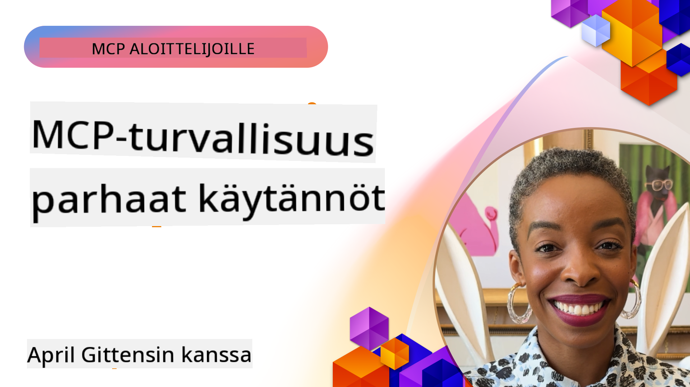

<!--
CO_OP_TRANSLATOR_METADATA:
{
  "original_hash": "1c767a35642f753127dc08545c25a290",
  "translation_date": "2025-08-18T16:09:33+00:00",
  "source_file": "02-Security/README.md",
  "language_code": "fi"
}
-->
# MCP-turvallisuus: Kattava suojaus tekoälyjärjestelmille

_(Napsauta yllä olevaa kuvaa katsoaksesi tämän oppitunnin videon)_

Turvallisuus on keskeinen osa tekoälyjärjestelmien suunnittelua, minkä vuoksi se on priorisoitu toiseksi osaksi. Tämä noudattaa Microsoftin **Secure by Design** -periaatetta [Secure Future Initiative](https://www.microsoft.com/security/blog/2025/04/17/microsofts-secure-by-design-journey-one-year-of-success/) -aloitteesta.

Model Context Protocol (MCP) tuo tekoälypohjaisiin sovelluksiin uusia tehokkaita ominaisuuksia, mutta samalla se tuo mukanaan ainutlaatuisia turvallisuushaasteita, jotka ylittävät perinteiset ohjelmistoriskit. MCP-järjestelmät kohtaavat sekä vakiintuneita turvallisuusongelmia (turvallinen koodaus, vähimmäisoikeudet, toimitusketjun turvallisuus) että uusia tekoälyyn liittyviä uhkia, kuten kehotteiden injektio, työkalujen manipulointi, istunnon kaappaus, hämmentyneen apulaisen hyökkäykset, tunnusten välityshaavoittuvuudet ja dynaaminen kyvykkyyksien muokkaus.

Tässä oppitunnissa käsitellään MCP-toteutusten kriittisimpiä turvallisuusriskejä, mukaan lukien todennus, valtuutus, liialliset käyttöoikeudet, epäsuora kehotteiden injektio, istunnon turvallisuus, hämmentyneen apulaisen ongelmat, tunnusten hallinta ja toimitusketjun haavoittuvuudet. Opit käytännön hallintakeinoja ja parhaita käytäntöjä näiden riskien lieventämiseksi sekä Microsoftin ratkaisujen, kuten Prompt Shieldsin, Azure Content Safetyn ja GitHub Advanced Securityn, hyödyntämiseksi MCP-toteutusten vahvistamisessa.

## Oppimistavoitteet

Oppitunnin lopussa osaat:

- **Tunnistaa MCP-spesifiset uhat**: Tunnistaa MCP-järjestelmien ainutlaatuiset turvallisuusriskit, kuten kehotteiden injektio, työkalujen manipulointi, liialliset käyttöoikeudet, istunnon kaappaus, hämmentyneen apulaisen ongelmat, tunnusten välityshaavoittuvuudet ja toimitusketjun riskit
- **Soveltaa turvallisuushallintakeinoja**: Toteuttaa tehokkaita lieventämistoimenpiteitä, kuten vahva todennus, vähimmäisoikeuksien käyttö, turvallinen tunnusten hallinta, istunnon turvallisuushallinta ja toimitusketjun tarkistus
- **Hyödyntää Microsoftin turvallisuusratkaisuja**: Ymmärtää ja ottaa käyttöön Microsoft Prompt Shields, Azure Content Safety ja GitHub Advanced Security MCP-työkuormien suojaamiseksi
- **Varmistaa työkalujen turvallisuus**: Tunnistaa työkalujen metatietojen validoinnin, dynaamisten muutosten seurannan ja epäsuorien kehotteiden injektiohyökkäysten torjunnan tärkeys
- **Yhdistää parhaat käytännöt**: Yhdistää vakiintuneet turvallisuuden perusperiaatteet (turvallinen koodaus, palvelimen koventaminen, nollaluottamus) MCP-spesifisiin hallintakeinoihin kattavan suojauksen saavuttamiseksi

# MCP-turvallisuusarkkitehtuuri ja hallintakeinot

Modernit MCP-toteutukset vaativat kerroksellisia turvallisuusratkaisuja, jotka käsittelevät sekä perinteisiä ohjelmistoturvallisuuden että tekoälyyn liittyviä uhkia. Nopeasti kehittyvä MCP-spesifikaatio jatkaa turvallisuushallintakeinojensa kypsymistä, mikä mahdollistaa paremman integraation yritysten turvallisuusarkkitehtuureihin ja vakiintuneisiin parhaisiin käytäntöihin.

[Microsoft Digital Defense Report](https://aka.ms/mddr) -raportin tutkimukset osoittavat, että **98 % raportoituista tietomurroista voitaisiin estää vahvalla turvallisuushygienialla**. Tehokkain suojausstrategia yhdistää perustavanlaatuiset turvallisuuskäytännöt MCP-spesifisiin hallintakeinoihin—todistetut perusratkaisut ovat edelleen vaikuttavimpia kokonaisriskin vähentämisessä.

## Nykyinen turvallisuustilanne

> **Note:** Tämä tieto heijastaa MCP-turvallisuusstandardeja päivämäärällä **18. elokuuta 2025**. MCP-protokolla kehittyy nopeasti, ja tulevat toteutukset voivat tuoda mukanaan uusia todennusmalleja ja parannettuja hallintakeinoja. Viittaa aina ajankohtaiseen [MCP Specification](https://spec.modelcontextprotocol.io/), [MCP GitHub repository](https://github.com/modelcontextprotocol) ja [security best practices documentation](https://modelcontextprotocol.io/specification/2025-06-18/basic/security_best_practices) saadaksesi uusimmat ohjeet.

### MCP-todennuksen kehitys

MCP-spesifikaatio on kehittynyt merkittävästi todennuksen ja valtuutuksen lähestymistavoissaan:

- **Alkuperäinen lähestymistapa**: Varhaiset spesifikaatiot edellyttivät kehittäjiltä mukautettujen todennuspalvelimien toteuttamista, joissa MCP-palvelimet toimivat OAuth 2.0 -valtuutuspalvelimina halliten käyttäjien todennusta suoraan
- **Nykyinen standardi (2025-06-18)**: Päivitetty spesifikaatio sallii MCP-palvelimien delegoida todennuksen ulkoisille identiteettipalveluntarjoajille (kuten Microsoft Entra ID), mikä parantaa turvallisuutta ja vähentää toteutuksen monimutkaisuutta
- **Kuljetuskerroksen turvallisuus**: Parannettu tuki turvallisille kuljetusmekanismeille asianmukaisilla todennusmalleilla sekä paikallisille (STDIO) että etäyhteyksille (Streamable HTTP)

## Todennus- ja valtuutusturvallisuus

### Nykyiset turvallisuushaasteet

Modernit MCP-toteutukset kohtaavat useita todennus- ja valtuutushaasteita:

### Riskit ja uhkavektorit

- **Väärin määritetty valtuutuslogiikka**: Virheellinen valtuutuksen toteutus MCP-palvelimilla voi altistaa arkaluonteisia tietoja ja soveltaa käyttöoikeuksia väärin
- **OAuth-tunnuksen kompromissit**: Paikallisen MCP-palvelimen tunnusten varastaminen mahdollistaa hyökkääjien esiintymisen palvelimina ja pääsyn alaspäin suuntautuviin palveluihin
- **Tunnusten välityshaavoittuvuudet**: Virheellinen tunnusten käsittely luo turvallisuushallinnan ohituksia ja vastuullisuusaukkoja
- **Liialliset käyttöoikeudet**: Yli-oikeutetut MCP-palvelimet rikkovat vähimmäisoikeusperiaatteita ja laajentavat hyökkäyspintaa

#### Tunnusten välitys: kriittinen anti-pattern

**Tunnusten välitys on nimenomaisesti kielletty** nykyisessä MCP-valtuutuksen spesifikaatiossa vakavien turvallisuusvaikutusten vuoksi:

##### Turvallisuushallinnan kiertäminen
- MCP-palvelimet ja alaspäin suuntautuvat API:t toteuttavat kriittisiä turvallisuushallintakeinoja (kuten nopeusrajoitukset, pyyntöjen validointi, liikenteen seuranta), jotka riippuvat asianmukaisesta tunnusten validoinnista
- Suora asiakas-API-tunnusten käyttö ohittaa nämä olennaiset suojaukset, heikentäen turvallisuusarkkitehtuuria

##### Vastuullisuus ja auditointihaasteet  
- MCP-palvelimet eivät voi erottaa asiakkaita, jotka käyttävät ylävirran myöntämiä tunnuksia, mikä rikkoo auditointiketjuja
- Alaspäin suuntautuvien resurssipalvelimien lokit näyttävät harhaanjohtavia pyyntöjen alkuperätietoja todellisten MCP-palvelinten välittäjien sijaan
- Tapahtumien tutkiminen ja vaatimustenmukaisuuden auditointi vaikeutuvat merkittävästi

##### Tietojen vuotamisen riskit
- Validointia vailla olevat tunnusväitteet mahdollistavat pahantahtoisten toimijoiden, joilla on varastettuja tunnuksia, käyttää MCP-palvelimia välityspalvelimina tietojen vuotamiseen
- Luottamusrajojen rikkomukset mahdollistavat luvattomat käyttömallit, jotka ohittavat tarkoitetut turvallisuushallintakeinot

##### Monipalveluhyökkäysvektorit
- Kompromissitunnukset, jotka hyväksytään useilla palveluilla, mahdollistavat sivuttaisliikkeen yhdistetyissä järjestelmissä
- Palveluiden välinen luottamus voi rikkoutua, kun tunnusten alkuperää ei voida varmistaa

### Turvallisuushallintakeinot ja lieventämistoimenpiteet

**Kriittiset turvallisuusvaatimukset:**

> **MANDATORY**: MCP-palvelimet **EIVÄT SAA** hyväksyä tunnuksia, joita ei ole nimenomaisesti myönnetty MCP-palvelimelle

#### Todennus- ja valtuutushallintakeinot

- **Perusteellinen valtuutuksen tarkistus**: Suorita kattavat auditoinnit MCP-palvelimen valtuutuslogiikasta varmistaaksesi, että vain tarkoitetut käyttäjät ja asiakkaat voivat käyttää arkaluonteisia resursseja
  - **Toteutusopas**: [Azure API Management valtuutuksen porttina MCP-palvelimille](https://techcommunity.microsoft.com/blog/integrationsonazureblog/azure-api-management-your-auth-gateway-for-mcp-servers/4402690)
  - **Identiteetti-integraatio**: [Microsoft Entra ID:n käyttö MCP-palvelimen todennukseen](https://den.dev/blog/mcp-server-auth-entra-id-session/)

- **Turvallinen tunnusten hallinta**: Toteuta [Microsoftin tunnusten validointi- ja elinkaaren parhaat käytännöt](https://learn.microsoft.com/en-us/entra/identity-platform/access-tokens)
  - Varmista, että tunnusten kohdeväitteet vastaavat MCP-palvelimen identiteettiä
  - Toteuta asianmukaiset tunnusten kierrätys- ja vanhenemiskäytännöt
  - Estä tunnusten uudelleenkäyttöhyökkäykset ja luvaton käyttö

- **Suojattu tunnusten tallennus**: Suojaa tunnusten tallennus salauksella sekä levossa että siirrossa
  - **Parhaat käytännöt**: [Tunnusten turvallisen tallennuksen ja salauksen ohjeet](https://youtu.be/uRdX37EcCwg?si=6fSChs1G4glwXRy2)

#### Käyttöoikeuksien hallinnan toteutus

- **Vähimmäisoikeusperiaate**: Myönnä MCP-palvelimille vain vähimmäisoikeudet, jotka ovat tarpeen aiotun toiminnallisuuden kannalta
  - Säännölliset käyttöoikeuksien tarkistukset ja päivitykset estämään oikeuksien laajeneminen
  - **Microsoftin dokumentaatio**: [Turvallinen vähimmäisoikeuksien käyttö](https://learn.microsoft.com/entra/identity-platform/secure-least-privileged-access)

- **Roolipohjainen käyttöoikeuksien hallinta (RBAC)**: Toteuta hienojakoiset roolien määrittelyt
  - Rajaa roolit tarkasti tiettyihin resursseihin ja toimintoihin
  - Vältä laajoja tai tarpeettomia käyttöoikeuksia, jotka laajentavat hyökkäyspintaa

- **Jatkuva käyttöoikeuksien seuranta**: Toteuta jatkuva käyttöoikeuksien auditointi ja seuranta
  - Seuraa käyttöoikeuksien käyttömalleja poikkeavuuksien varalta
  - Korjaa nopeasti liialliset tai käyttämättömät oikeudet
- **Turvallinen istunnon luominen**: Käytä kryptografisesti turvallisia, ei-deterministisiä istuntotunnisteita, jotka on luotu turvallisilla satunnaislukugeneraattoreilla  
- **Käyttäjäkohtainen sitominen**: Sido istuntotunnisteet käyttäjäkohtaisiin tietoihin käyttämällä muotoja kuten `<user_id>:<session_id>` estääksesi istuntojen väärinkäytön käyttäjien välillä  
- **Istunnon elinkaaren hallinta**: Toteuta asianmukainen vanhentuminen, kierto ja mitätöinti rajoittaaksesi haavoittuvuusikkunoita  
- **Kuljetusturvallisuus**: Pakollinen HTTPS kaikessa viestinnässä estääksesi istuntotunnisteiden sieppauksen  

### Hämmentyneen apulaisen ongelma  

**Hämmentyneen apulaisen ongelma** syntyy, kun MCP-palvelimet toimivat autentikointivälittäjinä asiakkaiden ja kolmannen osapuolen palveluiden välillä, luoden mahdollisuuksia valtuutuksen ohittamiseen staattisten asiakastunnisteiden väärinkäytön kautta.  

#### **Hyökkäyksen mekanismit ja riskit**  

- **Evästepohjainen suostumuksen ohitus**: Aiempi käyttäjän autentikointi luo suostumusevästeitä, joita hyökkääjät käyttävät haitallisilla valtuutuspyynnöillä, joissa on muokatut uudelleenohjaus-URI:t  
- **Valtuutuskoodin varastaminen**: Olemassa olevat suostumusevästeet voivat saada valtuutuspalvelimet ohittamaan suostumusnäytöt, jolloin koodit ohjataan hyökkääjän hallitsemiin päätepisteisiin  
- **Luvaton API-pääsy**: Varastetut valtuutuskoodit mahdollistavat tokenien vaihdon ja käyttäjän identiteetin väärentämisen ilman nimenomaista hyväksyntää  

#### **Vähennysstrategiat**  

**Pakolliset kontrollit:**  
- **Selkeät suostumusvaatimukset**: MCP-välityspalvelimet, jotka käyttävät staattisia asiakastunnisteita, **TÄYTYY** hankkia käyttäjän suostumus jokaiselle dynaamisesti rekisteröidylle asiakkaalle  
- **OAuth 2.1 -turvallisuuden toteutus**: Noudata nykyisiä OAuth-turvallisuuskäytäntöjä, mukaan lukien PKCE (Proof Key for Code Exchange) kaikissa valtuutuspyynnöissä  
- **Tiukka asiakasvalidointi**: Toteuta tarkka validointi uudelleenohjaus-URI:ille ja asiakastunnisteille estääksesi väärinkäytön  

### Tokenien läpivientiin liittyvät haavoittuvuudet  

**Tokenien läpivienti** edustaa selkeää vastamallia, jossa MCP-palvelimet hyväksyvät asiakastokeneita ilman asianmukaista validointia ja välittävät ne alavirran API:ille, rikkoen MCP:n valtuutusmäärittelyjä.  

#### **Turvallisuusvaikutukset**  

- **Kontrollien kiertäminen**: Suora asiakas-API-tokenien käyttö ohittaa kriittiset rajoitukset, validoinnin ja valvontakontrollit  
- **Auditointijäljen korruptio**: Ylävirran myöntämät tokenit tekevät asiakastunnistuksen mahdottomaksi, rikkoen tapaustutkinnan mahdollisuudet  
- **Välityspohjainen datan ulosvienti**: Validointia vailla olevat tokenit mahdollistavat haitallisten toimijoiden käyttää palvelimia luvattomaan datan käyttöön  
- **Luottamusrajojen rikkominen**: Alavirran palveluiden luottamusoletukset voivat rikkoutua, kun tokenien alkuperää ei voida vahvistaa  
- **Monipalveluhyökkäysten laajentuminen**: Kompromissit tokenit, jotka hyväksytään useissa palveluissa, mahdollistavat sivuttaisliikkeen  

#### **Vaaditut turvallisuuskontrollit**  

**Ei-neuvoteltavat vaatimukset:**  
- **Tokenien validointi**: MCP-palvelimet **EIVÄT SAA** hyväksyä tokeneita, joita ei ole nimenomaisesti myönnetty MCP-palvelimelle  
- **Kohdeyleisön validointi**: Varmista aina, että tokenien yleisöväitteet vastaavat MCP-palvelimen identiteettiä  
- **Asianmukainen tokenien elinkaari**: Toteuta lyhytikäiset pääsytokenit turvallisilla kiertokäytännöillä  

## AI-järjestelmien toimitusketjun turvallisuus  

Toimitusketjun turvallisuus on kehittynyt perinteisistä ohjelmistoriippuvuuksista kattamaan koko AI-ekosysteemin. Modernit MCP-toteutukset täytyy tarkistaa ja valvoa kaikkia AI-komponentteja, sillä jokainen voi tuoda haavoittuvuuksia, jotka vaarantavat järjestelmän eheyden.  

### Laajennetut AI-toimitusketjun komponentit  

**Perinteiset ohjelmistoriippuvuudet:**  
- Avoimen lähdekoodin kirjastot ja kehykset  
- Konttikuvat ja perusjärjestelmät  
- Kehitystyökalut ja rakennusputket  
- Infrastruktuurikomponentit ja -palvelut  

**AI-spesifiset toimitusketjun elementit:**  
- **Perusmallit**: Erilaisilta tarjoajilta tulevat esikoulutetut mallit, jotka vaativat alkuperän varmistamista  
- **Upotuspalvelut**: Ulkoiset vektorointi- ja semanttisen haun palvelut  
- **Kontekstin tarjoajat**: Tietolähteet, tietokannat ja dokumenttivarastot  
- **Kolmannen osapuolen API:t**: Ulkoiset AI-palvelut, ML-putket ja datankäsittelypäätepisteet  
- **Malliesineet**: Painot, konfiguraatiot ja hienosäädetyt mallivariantit  
- **Koulutusdatalähteet**: Datasetsit, joita käytetään mallin koulutukseen ja hienosäätöön  

### Kattava toimitusketjun turvallisuusstrategia  

#### **Komponenttien validointi ja luottamus**  
- **Alkuperän varmistaminen**: Varmista kaikkien AI-komponenttien alkuperä, lisensointi ja eheys ennen integrointia  
- **Turvallisuusarviointi**: Suorita haavoittuvuusskannaukset ja turvallisuuskatsaukset malleille, tietolähteille ja AI-palveluille  
- **Maineanalyysi**: Arvioi AI-palveluntarjoajien turvallisuushistoria ja käytännöt  
- **Sääntöjenmukaisuuden varmistaminen**: Varmista, että kaikki komponentit täyttävät organisaation turvallisuus- ja sääntelyvaatimukset  

#### **Turvalliset käyttöönotto-putket**  
- **Automatisoitu CI/CD-turvallisuus**: Integroi turvallisuusskannaus automatisoituihin käyttöönotto-putkiin  
- **Esineiden eheys**: Toteuta kryptografinen validointi kaikille käyttöön otetuille esineille (koodi, mallit, konfiguraatiot)  
- **Vaiheittainen käyttöönotto**: Käytä progressiivisia käyttöönotto-strategioita turvallisuusvalidoinnilla jokaisessa vaiheessa  
- **Luotetut esinevarastot**: Ota käyttöön vain varmennetuista, turvallisista esinevarastoista ja -rekistereistä  

#### **Jatkuva valvonta ja reagointi**  
- **Riippuvuusskannaus**: Jatkuva haavoittuvuuksien valvonta kaikille ohjelmisto- ja AI-komponenttiriippuvuuksille  
- **Mallin valvonta**: Jatkuva arviointi mallin käyttäytymisestä, suorituskyvyn heikkenemisestä ja turvallisuuspoikkeamista  
- **Palvelun terveyden seuranta**: Valvo ulkoisia AI-palveluita saatavuuden, turvallisuusongelmien ja käytäntömuutosten osalta  
- **Uhkatiedustelun integrointi**: Sisällytä uhkasyötteet, jotka ovat erityisiä AI- ja ML-turvallisuusriskien osalta  

#### **Pääsynhallinta ja vähimmäisoikeudet**  
- **Komponenttikohtaiset käyttöoikeudet**: Rajoita pääsyä malleihin, dataan ja palveluihin liiketoiminnan tarpeen mukaan  
- **Palvelutilien hallinta**: Toteuta omistetut palvelutilit, joilla on vähimmäisoikeudet  
- **Verkkojen segmentointi**: Eristä AI-komponentit ja rajoita verkkoyhteyksiä palveluiden välillä  
- **API-yhdyskäytävän kontrollit**: Käytä keskitettyjä API-yhdyskäytäviä ulkoisten AI-palveluiden pääsyn hallintaan ja valvontaan  

#### **Tapausvastaukset ja palautuminen**  
- **Nopeat reagointimenettelyt**: Vakiintuneet prosessit kompromissien korjaamiseen tai AI-komponenttien korvaamiseen  
- **Tunnusten kierto**: Automatisoidut järjestelmät salaisuuksien, API-avainten ja palvelutunnusten kiertämiseen  
- **Palautusominaisuudet**: Kyky nopeasti palauttaa aiempi tunnetusti hyvä versio AI-komponenteista  
- **Toimitusketjun rikkomusten palautuminen**: Erityiset menettelyt ylävirran AI-palveluiden kompromissien käsittelyyn  

### Microsoftin turvallisuustyökalut ja integrointi  

**GitHub Advanced Security** tarjoaa kattavan toimitusketjun suojauksen, mukaan lukien:  
- **Salaisuuksien skannaus**: Automaattinen tunnistus tunnuksille, API-avaimille ja tokeneille repositorioissa  
- **Riippuvuusskannaus**: Haavoittuvuuksien arviointi avoimen lähdekoodin riippuvuuksille ja kirjastoille  
- **CodeQL-analyysi**: Staattinen koodianalyysi turvallisuushaavoittuvuuksille ja koodausongelmille  
- **Toimitusketjun näkemykset**: Näkyvyys riippuvuuksien terveyteen ja turvallisuustilaan  

**Azure DevOps & Azure Repos -integrointi:**  
- Saumaton turvallisuusskannauksen integrointi Microsoftin kehitysalustoilla  
- Automaattiset turvallisuustarkastukset Azure Pipelinesissa AI-työkuormille  
- Käytäntöjen täytäntöönpano turvalliselle AI-komponenttien käyttöönotolle  

**Microsoftin sisäiset käytännöt:**  
Microsoft toteuttaa laajoja toimitusketjun turvallisuuskäytäntöjä kaikissa tuotteissaan. Lue todistetuista lähestymistavoista [The Journey to Secure the Software Supply Chain at Microsoft](https://devblogs.microsoft.com/engineering-at-microsoft/the-journey-to-secure-the-software-supply-chain-at-microsoft/).  

### **Microsoftin tietoturvaratkaisut**
- [Microsoft Prompt Shields -dokumentaatio](https://learn.microsoft.com/azure/ai-services/content-safety/concepts/jailbreak-detection)
- [Azure Content Safety -palvelu](https://learn.microsoft.com/azure/ai-services/content-safety/)
- [Microsoft Entra ID -tietoturva](https://learn.microsoft.com/entra/identity-platform/secure-least-privileged-access)
- [Azure Token Management -parhaat käytännöt](https://learn.microsoft.com/entra/identity-platform/access-tokens)
- [GitHub Advanced Security](https://github.com/security/advanced-security)

### **Toteutusoppaat ja tutoriaalit**
- [Azure API Management MCP-autentikointiväylänä](https://techcommunity.microsoft.com/blog/integrationsonazureblog/azure-api-management-your-auth-gateway-for-mcp-servers/4402690)
- [Microsoft Entra ID -autentikointi MCP-palvelimilla](https://den.dev/blog/mcp-server-auth-entra-id-session/)
- [Turvallinen tokenien tallennus ja salaus (video)](https://youtu.be/uRdX37EcCwg?si=6fSChs1G4glwXRy2)

### **DevOps ja toimitusketjun tietoturva**
- [Azure DevOps -tietoturva](https://azure.microsoft.com/products/devops)
- [Azure Repos -tietoturva](https://azure.microsoft.com/products/devops/repos/)
- [Microsoftin toimitusketjun tietoturvamatka](https://devblogs.microsoft.com/engineering-at-microsoft/the-journey-to-secure-the-software-supply-chain-at-microsoft/)

## **Lisätietoturvadokumentaatio**

Kattavaa tietoturvaohjeistusta varten tutustu tämän osion erikoisdokumentteihin:

- **[MCP Security Best Practices 2025](./mcp-security-best-practices-2025.md)** - Täydelliset tietoturvan parhaat käytännöt MCP-toteutuksille
- **[Azure Content Safety Implementation](./azure-content-safety-implementation.md)** - Käytännön toteutusesimerkkejä Azure Content Safety -integraatiosta  
- **[MCP Security Controls 2025](./mcp-security-controls-2025.md)** - Viimeisimmät tietoturvakontrollit ja -tekniikat MCP-järjestelmille
- **[MCP Best Practices Quick Reference](./mcp-best-practices.md)** - Pikaopas MCP-tietoturvan keskeisiin käytäntöihin

---

## Mitä seuraavaksi

Seuraavaksi: [Luku 3: Aloittaminen](../03-GettingStarted/README.md)

**Vastuuvapauslauseke**:  
Tämä asiakirja on käännetty käyttämällä tekoälypohjaista käännöspalvelua [Co-op Translator](https://github.com/Azure/co-op-translator). Vaikka pyrimme tarkkuuteen, huomioithan, että automaattiset käännökset voivat sisältää virheitä tai epätarkkuuksia. Alkuperäistä asiakirjaa sen alkuperäisellä kielellä tulisi pitää ensisijaisena lähteenä. Kriittisen tiedon osalta suositellaan ammattimaista ihmiskäännöstä. Emme ole vastuussa väärinkäsityksistä tai virhetulkinnoista, jotka johtuvat tämän käännöksen käytöstä.