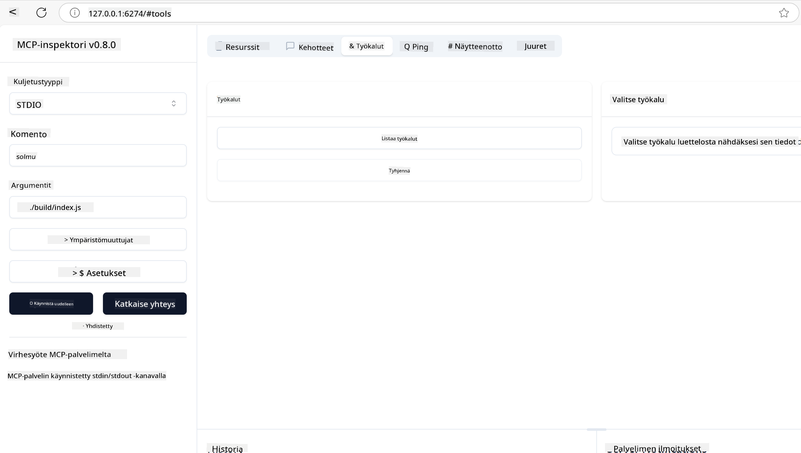
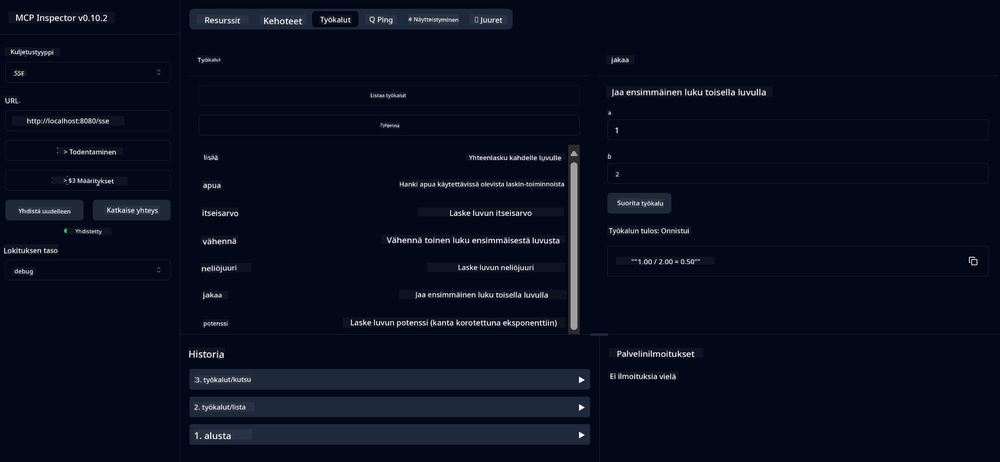
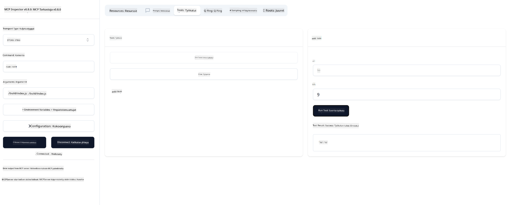

<!--
CO_OP_TRANSLATOR_METADATA:
{
  "original_hash": "ec11ee93f31fdadd94facd3e3d22f9e6",
  "translation_date": "2025-09-09T21:58:54+00:00",
  "source_file": "03-GettingStarted/01-first-server/README.md",
  "language_code": "fi"
}
-->
# Aloittaminen MCP:n kanssa

Tervetuloa ensimmäisiin askeliin Model Context Protocolin (MCP) parissa! Olitpa sitten uusi MCP:n käyttäjä tai haluat syventää ymmärrystäsi, tämä opas johdattaa sinut olennaisten asennus- ja kehitysprosessien läpi. Opit, kuinka MCP mahdollistaa saumattoman integraation tekoälymallien ja sovellusten välillä, sekä kuinka saat ympäristösi nopeasti valmiiksi MCP-pohjaisten ratkaisujen rakentamista ja testaamista varten.

> TLDR; Jos rakennat tekoälysovelluksia, tiedät, että voit lisätä työkaluja ja muita resursseja LLM:ään (laaja kielimalli), jotta LLM:stä tulee tietoisempi. Mutta jos sijoitat nämä työkalut ja resurssit palvelimelle, sovelluksen ja palvelimen ominaisuuksia voi käyttää mikä tahansa asiakas, LLM:llä tai ilman.

## Yleiskatsaus

Tämä osio tarjoaa käytännön ohjeita MCP-ympäristöjen asennukseen ja ensimmäisten MCP-sovellusten rakentamiseen. Opit, kuinka asennat tarvittavat työkalut ja kehykset, rakennat perus-MCP-palvelimia, luot isäntäsovelluksia ja testaat toteutuksiasi.

Model Context Protocol (MCP) on avoin protokolla, joka standardoi, kuinka sovellukset tarjoavat kontekstia LLM:ille. Ajattele MCP:tä kuin USB-C-porttia tekoälysovelluksille – se tarjoaa standardoidun tavan yhdistää tekoälymallit eri tietolähteisiin ja työkaluihin.

## Oppimistavoitteet

Tämän osion lopussa osaat:

- Asentaa MCP-kehitysympäristöt C#:lle, Javalle, Pythonille, TypeScriptille ja Rustille
- Rakentaa ja ottaa käyttöön perus-MCP-palvelimia mukautetuilla ominaisuuksilla (resurssit, kehotteet ja työkalut)
- Luoda isäntäsovelluksia, jotka yhdistyvät MCP-palvelimiin
- Testata ja debugata MCP-toteutuksia

## MCP-ympäristön asennus

Ennen kuin aloitat MCP:n parissa työskentelyn, on tärkeää valmistella kehitysympäristösi ja ymmärtää perusprosessit. Tämä osio opastaa sinut alkuasennuksen vaiheiden läpi, jotta MCP:n käyttö sujuu vaivattomasti.

### Esivaatimukset

Ennen MCP-kehityksen aloittamista varmista, että sinulla on:

- **Kehitysympäristö**: Valitsemallesi kielelle (C#, Java, Python, TypeScript tai Rust)
- **IDE/editori**: Visual Studio, Visual Studio Code, IntelliJ, Eclipse, PyCharm tai mikä tahansa moderni koodieditori
- **Paketinhallinta**: NuGet, Maven/Gradle, pip, npm/yarn tai Cargo
- **API-avaimet**: Kaikille AI-palveluille, joita aiot käyttää isäntäsovelluksissasi

## Perus-MCP-palvelimen rakenne

Tyypillinen MCP-palvelin sisältää:

- **Palvelimen konfiguraatio**: Portin, autentikoinnin ja muiden asetusten määrittäminen
- **Resurssit**: Data ja konteksti, jotka ovat LLM:ien saatavilla
- **Työkalut**: Toiminnallisuudet, joita mallit voivat kutsua
- **Kehotteet**: Mallipohjat tekstin tuottamiseen tai jäsentämiseen

Tässä yksinkertaistettu esimerkki TypeScriptillä:

```typescript
import { McpServer, ResourceTemplate } from "@modelcontextprotocol/sdk/server/mcp.js";
import { StdioServerTransport } from "@modelcontextprotocol/sdk/server/stdio.js";
import { z } from "zod";

// Create an MCP server
const server = new McpServer({
  name: "Demo",
  version: "1.0.0"
});

// Add an addition tool
server.tool("add",
  { a: z.number(), b: z.number() },
  async ({ a, b }) => ({
    content: [{ type: "text", text: String(a + b) }]
  })
);

// Add a dynamic greeting resource
server.resource(
  "file",
  // The 'list' parameter controls how the resource lists available files. Setting it to undefined disables listing for this resource.
  new ResourceTemplate("file://{path}", { list: undefined }),
  async (uri, { path }) => ({
    contents: [{
      uri: uri.href,
      text: `File, ${path}!`
    }]
  })
);

// Add a file resource that reads the file contents
server.resource(
  "file",
  new ResourceTemplate("file://{path}", { list: undefined }),
  async (uri, { path }) => {
    let text;
    try {
      text = await fs.readFile(path, "utf8");
    } catch (err) {
      text = `Error reading file: ${err.message}`;
    }
    return {
      contents: [{
        uri: uri.href,
        text
      }]
    };
  }
);

server.prompt(
  "review-code",
  { code: z.string() },
  ({ code }) => ({
    messages: [{
      role: "user",
      content: {
        type: "text",
        text: `Please review this code:\n\n${code}`
      }
    }]
  })
);

// Start receiving messages on stdin and sending messages on stdout
const transport = new StdioServerTransport();
await server.connect(transport);
```

Edellisessä koodissa:

- Tuodaan tarvittavat luokat MCP TypeScript SDK:sta.
- Luodaan ja konfiguroidaan uusi MCP-palvelininstanssi.
- Rekisteröidään mukautettu työkalu (`calculator`) käsittelyfunktiolla.
- Käynnistetään palvelin kuuntelemaan saapuvia MCP-pyyntöjä.

## Testaus ja debuggaus

Ennen MCP-palvelimen testaamista on tärkeää ymmärtää käytettävissä olevat työkalut ja parhaat käytännöt debuggaamiseen. Tehokas testaus varmistaa, että palvelimesi toimii odotetusti, ja auttaa sinua tunnistamaan ja ratkaisemaan ongelmat nopeasti. Seuraava osio esittelee suositeltuja lähestymistapoja MCP-toteutuksen validointiin.

MCP tarjoaa työkaluja palvelimien testaamiseen ja debuggaamiseen:

- **Inspector-työkalu**, graafinen käyttöliittymä, jonka avulla voit yhdistää palvelimeesi ja testata työkaluja, kehotteita ja resursseja.
- **curl**, voit myös yhdistää palvelimeesi komentorivityökalulla, kuten curlilla, tai muilla HTTP-komentoja tukevilla asiakkailla.

### MCP Inspectorin käyttö

[MCP Inspector](https://github.com/modelcontextprotocol/inspector) on visuaalinen testityökalu, joka auttaa sinua:

1. **Palvelimen ominaisuuksien tunnistaminen**: Havaitse automaattisesti käytettävissä olevat resurssit, työkalut ja kehotteet
2. **Työkalujen suorittamisen testaus**: Kokeile eri parametreja ja näe vastaukset reaaliajassa
3. **Palvelimen metadatan tarkastelu**: Tutki palvelimen tietoja, skeemoja ja konfiguraatioita

```bash
# ex TypeScript, installing and running MCP Inspector
npx @modelcontextprotocol/inspector node build/index.js
```

Kun suoritat yllä olevat komennot, MCP Inspector käynnistää paikallisen verkkokäyttöliittymän selaimessasi. Näet kojelaudan, joka näyttää rekisteröidyt MCP-palvelimesi, niiden käytettävissä olevat työkalut, resurssit ja kehotteet. Käyttöliittymä mahdollistaa työkalujen interaktiivisen testauksen, palvelimen metadatan tarkastelun ja reaaliaikaisten vastausten näkemisen, mikä helpottaa MCP-palvelimen toteutusten validointia ja debuggausta.

Tässä esimerkkikuva siitä, miltä se voi näyttää:



## Yleiset asennusongelmat ja ratkaisut

| Ongelma | Mahdollinen ratkaisu |
|---------|----------------------|
| Yhteys evätty | Tarkista, että palvelin on käynnissä ja portti on oikein |
| Työkalujen suoritusvirheet | Tarkista parametrien validointi ja virheenkäsittely |
| Autentikointivirheet | Varmista API-avainten ja käyttöoikeuksien oikeellisuus |
| Skeemavalidointivirheet | Varmista, että parametrit vastaavat määriteltyä skeemaa |
| Palvelin ei käynnisty | Tarkista porttikonfliktit tai puuttuvat riippuvuudet |
| CORS-virheet | Määritä oikeat CORS-otsikot ristiin lähtevien pyyntöjen tueksi |
| Autentikointiongelmat | Varmista tokenin voimassaolo ja käyttöoikeudet |

## Paikallinen kehitys

Paikallista kehitystä ja testausta varten voit ajaa MCP-palvelimia suoraan koneellasi:

1. **Käynnistä palvelinprosessi**: Suorita MCP-palvelinsovellus
2. **Verkkoasetusten konfigurointi**: Varmista, että palvelin on saavutettavissa odotetussa portissa
3. **Yhdistä asiakkaat**: Käytä paikallisia yhteys-URL-osoitteita, kuten `http://localhost:3000`

```bash
# Example: Running a TypeScript MCP server locally
npm run start
# Server running at http://localhost:3000
```

## Ensimmäisen MCP-palvelimen rakentaminen

Olemme käsitelleet [Peruskäsitteet](/01-CoreConcepts/README.md) aiemmassa osiossa, nyt on aika soveltaa tätä tietoa käytännössä.

### Mitä palvelin voi tehdä

Ennen kuin aloitamme koodauksen, muistutetaan itseämme siitä, mitä palvelin voi tehdä:

MCP-palvelin voi esimerkiksi:

- Päästä käsiksi paikallisiin tiedostoihin ja tietokantoihin
- Yhdistyä etä-API:hin
- Suorittaa laskelmia
- Integroitua muihin työkaluihin ja palveluihin
- Tarjota käyttöliittymän vuorovaikutukseen

Hienoa, nyt kun tiedämme, mitä voimme tehdä, aloitetaan koodaus.

## Harjoitus: Palvelimen luominen

Palvelimen luomiseksi sinun tulee noudattaa seuraavia vaiheita:

- Asenna MCP SDK.
- Luo projekti ja määritä projektirakenne.
- Kirjoita palvelinkoodi.
- Testaa palvelin.

### -1- Luo projekti

#### TypeScript

```sh
# Create project directory and initialize npm project
mkdir calculator-server
cd calculator-server
npm init -y
```

#### Python

```sh
# Create project dir
mkdir calculator-server
cd calculator-server
# Open the folder in Visual Studio Code - Skip this if you are using a different IDE
code .
```

#### .NET

```sh
dotnet new console -n McpCalculatorServer
cd McpCalculatorServer
```

#### Java

Javalle luo Spring Boot -projekti:

```bash
curl https://start.spring.io/starter.zip \
  -d dependencies=web \
  -d javaVersion=21 \
  -d type=maven-project \
  -d groupId=com.example \
  -d artifactId=calculator-server \
  -d name=McpServer \
  -d packageName=com.microsoft.mcp.sample.server \
  -o calculator-server.zip
```

Pura zip-tiedosto:

```bash
unzip calculator-server.zip -d calculator-server
cd calculator-server
# optional remove the unused test
rm -rf src/test/java
```

Lisää seuraava täydellinen konfiguraatio *pom.xml*-tiedostoon:

```xml
<?xml version="1.0" encoding="UTF-8"?>
<project xmlns="http://maven.apache.org/POM/4.0.0"
    xmlns:xsi="http://www.w3.org/2001/XMLSchema-instance"
    xsi:schemaLocation="http://maven.apache.org/POM/4.0.0 http://maven.apache.org/xsd/maven-4.0.0.xsd">
    <modelVersion>4.0.0</modelVersion>
    
    <!-- Spring Boot parent for dependency management -->
    <parent>
        <groupId>org.springframework.boot</groupId>
        <artifactId>spring-boot-starter-parent</artifactId>
        <version>3.5.0</version>
        <relativePath />
    </parent>

    <!-- Project coordinates -->
    <groupId>com.example</groupId>
    <artifactId>calculator-server</artifactId>
    <version>0.0.1-SNAPSHOT</version>
    <name>Calculator Server</name>
    <description>Basic calculator MCP service for beginners</description>

    <!-- Properties -->
    <properties>
        <java.version>21</java.version>
        <maven.compiler.source>21</maven.compiler.source>
        <maven.compiler.target>21</maven.compiler.target>
    </properties>

    <!-- Spring AI BOM for version management -->
    <dependencyManagement>
        <dependencies>
            <dependency>
                <groupId>org.springframework.ai</groupId>
                <artifactId>spring-ai-bom</artifactId>
                <version>1.0.0-SNAPSHOT</version>
                <type>pom</type>
                <scope>import</scope>
            </dependency>
        </dependencies>
    </dependencyManagement>

    <!-- Dependencies -->
    <dependencies>
        <dependency>
            <groupId>org.springframework.ai</groupId>
            <artifactId>spring-ai-starter-mcp-server-webflux</artifactId>
        </dependency>
        <dependency>
            <groupId>org.springframework.boot</groupId>
            <artifactId>spring-boot-starter-actuator</artifactId>
        </dependency>
        <dependency>
         <groupId>org.springframework.boot</groupId>
         <artifactId>spring-boot-starter-test</artifactId>
         <scope>test</scope>
      </dependency>
    </dependencies>

    <!-- Build configuration -->
    <build>
        <plugins>
            <plugin>
                <groupId>org.springframework.boot</groupId>
                <artifactId>spring-boot-maven-plugin</artifactId>
            </plugin>
            <plugin>
                <groupId>org.apache.maven.plugins</groupId>
                <artifactId>maven-compiler-plugin</artifactId>
                <configuration>
                    <release>21</release>
                </configuration>
            </plugin>
        </plugins>
    </build>

    <!-- Repositories for Spring AI snapshots -->
    <repositories>
        <repository>
            <id>spring-milestones</id>
            <name>Spring Milestones</name>
            <url>https://repo.spring.io/milestone</url>
            <snapshots>
                <enabled>false</enabled>
            </snapshots>
        </repository>
        <repository>
            <id>spring-snapshots</id>
            <name>Spring Snapshots</name>
            <url>https://repo.spring.io/snapshot</url>
            <releases>
                <enabled>false</enabled>
            </releases>
        </repository>
    </repositories>
</project>
```

#### Rust

```sh
mkdir calculator-server
cd calculator-server
cargo init
```

### -2- Lisää riippuvuudet

Nyt kun projektisi on luotu, lisätään seuraavaksi riippuvuudet:

#### TypeScript

```sh
# If not already installed, install TypeScript globally
npm install typescript -g

# Install the MCP SDK and Zod for schema validation
npm install @modelcontextprotocol/sdk zod
npm install -D @types/node typescript
```

#### Python

```sh
# Create a virtual env and install dependencies
python -m venv venv
venv\Scripts\activate
pip install "mcp[cli]"
```

#### Java

```bash
cd calculator-server
./mvnw clean install -DskipTests
```

#### Rust

```sh
cargo add rmcp --features server,transport-io
cargo add serde
cargo add tokio --features rt-multi-thread
```

### -3- Luo projektitiedostot

#### TypeScript

Avaa *package.json*-tiedosto ja korvaa sisältö seuraavalla varmistaaksesi, että voit rakentaa ja ajaa palvelimen:

```json
{
  "name": "calculator-server",
  "version": "1.0.0",
  "main": "index.js",
  "type": "module",
  "scripts": {
    "start": "tsc && node ./build/index.js",
    "build": "tsc && node ./build/index.js"
  },
  "keywords": [],
  "author": "",
  "license": "ISC",
  "description": "A simple calculator server using Model Context Protocol",
  "dependencies": {
    "@modelcontextprotocol/sdk": "^1.16.0",
    "zod": "^3.25.76"
  },
  "devDependencies": {
    "@types/node": "^24.0.14",
    "typescript": "^5.8.3"
  }
}
```

Luo *tsconfig.json* seuraavalla sisällöllä:

```json
{
  "compilerOptions": {
    "target": "ES2022",
    "module": "Node16",
    "moduleResolution": "Node16",
    "outDir": "./build",
    "rootDir": "./src",
    "strict": true,
    "esModuleInterop": true,
    "skipLibCheck": true,
    "forceConsistentCasingInFileNames": true
  },
  "include": ["src/**/*"],
  "exclude": ["node_modules"]
}
```

Luo hakemisto lähdekoodillesi:

```sh
mkdir src
touch src/index.ts
```

#### Python

Luo tiedosto *server.py*

```sh
touch server.py
```

#### .NET

Asenna tarvittavat NuGet-paketit:

```sh
dotnet add package ModelContextProtocol --prerelease
dotnet add package Microsoft.Extensions.Hosting
```

#### Java

Java Spring Boot -projektien rakenne luodaan automaattisesti.

#### Rust

Rustille *src/main.rs*-tiedosto luodaan oletuksena, kun suoritat `cargo init`. Avaa tiedosto ja poista oletuskoodi.

### -4- Luo palvelinkoodi

#### TypeScript

Luo tiedosto *index.ts* ja lisää seuraava koodi:

```typescript
import { McpServer, ResourceTemplate } from "@modelcontextprotocol/sdk/server/mcp.js";
import { StdioServerTransport } from "@modelcontextprotocol/sdk/server/stdio.js";
import { z } from "zod";
 
// Create an MCP server
const server = new McpServer({
  name: "Calculator MCP Server",
  version: "1.0.0"
});
```

Nyt sinulla on palvelin, mutta se ei tee paljoa, korjataan se.

#### Python

```python
# server.py
from mcp.server.fastmcp import FastMCP

# Create an MCP server
mcp = FastMCP("Demo")
```

#### .NET

```csharp
using Microsoft.Extensions.DependencyInjection;
using Microsoft.Extensions.Hosting;
using Microsoft.Extensions.Logging;
using ModelContextProtocol.Server;
using System.ComponentModel;

var builder = Host.CreateApplicationBuilder(args);
builder.Logging.AddConsole(consoleLogOptions =>
{
    // Configure all logs to go to stderr
    consoleLogOptions.LogToStandardErrorThreshold = LogLevel.Trace;
});

builder.Services
    .AddMcpServer()
    .WithStdioServerTransport()
    .WithToolsFromAssembly();
await builder.Build().RunAsync();

// add features
```

#### Java

Javalle luo ydinkomponentit palvelimelle. Muokkaa ensin pääsovellusluokkaa:

*src/main/java/com/microsoft/mcp/sample/server/McpServerApplication.java*:

```java
package com.microsoft.mcp.sample.server;

import org.springframework.ai.tool.ToolCallbackProvider;
import org.springframework.ai.tool.method.MethodToolCallbackProvider;
import org.springframework.boot.SpringApplication;
import org.springframework.boot.autoconfigure.SpringBootApplication;
import org.springframework.context.annotation.Bean;
import com.microsoft.mcp.sample.server.service.CalculatorService;

@SpringBootApplication
public class McpServerApplication {

    public static void main(String[] args) {
        SpringApplication.run(McpServerApplication.class, args);
    }
    
    @Bean
    public ToolCallbackProvider calculatorTools(CalculatorService calculator) {
        return MethodToolCallbackProvider.builder().toolObjects(calculator).build();
    }
}
```

Luo laskinpalvelu *src/main/java/com/microsoft/mcp/sample/server/service/CalculatorService.java*:

```java
package com.microsoft.mcp.sample.server.service;

import org.springframework.ai.tool.annotation.Tool;
import org.springframework.stereotype.Service;

/**
 * Service for basic calculator operations.
 * This service provides simple calculator functionality through MCP.
 */
@Service
public class CalculatorService {

    /**
     * Add two numbers
     * @param a The first number
     * @param b The second number
     * @return The sum of the two numbers
     */
    @Tool(description = "Add two numbers together")
    public String add(double a, double b) {
        double result = a + b;
        return formatResult(a, "+", b, result);
    }

    /**
     * Subtract one number from another
     * @param a The number to subtract from
     * @param b The number to subtract
     * @return The result of the subtraction
     */
    @Tool(description = "Subtract the second number from the first number")
    public String subtract(double a, double b) {
        double result = a - b;
        return formatResult(a, "-", b, result);
    }

    /**
     * Multiply two numbers
     * @param a The first number
     * @param b The second number
     * @return The product of the two numbers
     */
    @Tool(description = "Multiply two numbers together")
    public String multiply(double a, double b) {
        double result = a * b;
        return formatResult(a, "*", b, result);
    }

    /**
     * Divide one number by another
     * @param a The numerator
     * @param b The denominator
     * @return The result of the division
     */
    @Tool(description = "Divide the first number by the second number")
    public String divide(double a, double b) {
        if (b == 0) {
            return "Error: Cannot divide by zero";
        }
        double result = a / b;
        return formatResult(a, "/", b, result);
    }

    /**
     * Calculate the power of a number
     * @param base The base number
     * @param exponent The exponent
     * @return The result of raising the base to the exponent
     */
    @Tool(description = "Calculate the power of a number (base raised to an exponent)")
    public String power(double base, double exponent) {
        double result = Math.pow(base, exponent);
        return formatResult(base, "^", exponent, result);
    }

    /**
     * Calculate the square root of a number
     * @param number The number to find the square root of
     * @return The square root of the number
     */
    @Tool(description = "Calculate the square root of a number")
    public String squareRoot(double number) {
        if (number < 0) {
            return "Error: Cannot calculate square root of a negative number";
        }
        double result = Math.sqrt(number);
        return String.format("√%.2f = %.2f", number, result);
    }

    /**
     * Calculate the modulus (remainder) of division
     * @param a The dividend
     * @param b The divisor
     * @return The remainder of the division
     */
    @Tool(description = "Calculate the remainder when one number is divided by another")
    public String modulus(double a, double b) {
        if (b == 0) {
            return "Error: Cannot divide by zero";
        }
        double result = a % b;
        return formatResult(a, "%", b, result);
    }

    /**
     * Calculate the absolute value of a number
     * @param number The number to find the absolute value of
     * @return The absolute value of the number
     */
    @Tool(description = "Calculate the absolute value of a number")
    public String absolute(double number) {
        double result = Math.abs(number);
        return String.format("|%.2f| = %.2f", number, result);
    }

    /**
     * Get help about available calculator operations
     * @return Information about available operations
     */
    @Tool(description = "Get help about available calculator operations")
    public String help() {
        return "Basic Calculator MCP Service\n\n" +
               "Available operations:\n" +
               "1. add(a, b) - Adds two numbers\n" +
               "2. subtract(a, b) - Subtracts the second number from the first\n" +
               "3. multiply(a, b) - Multiplies two numbers\n" +
               "4. divide(a, b) - Divides the first number by the second\n" +
               "5. power(base, exponent) - Raises a number to a power\n" +
               "6. squareRoot(number) - Calculates the square root\n" + 
               "7. modulus(a, b) - Calculates the remainder of division\n" +
               "8. absolute(number) - Calculates the absolute value\n\n" +
               "Example usage: add(5, 3) will return 5 + 3 = 8";
    }

    /**
     * Format the result of a calculation
     */
    private String formatResult(double a, String operator, double b, double result) {
        return String.format("%.2f %s %.2f = %.2f", a, operator, b, result);
    }
}
```

**Valinnaiset komponentit tuotantovalmiille palvelulle:**

Luo käynnistyskonfiguraatio *src/main/java/com/microsoft/mcp/sample/server/config/StartupConfig.java*:

```java
package com.microsoft.mcp.sample.server.config;

import org.springframework.boot.CommandLineRunner;
import org.springframework.context.annotation.Bean;
import org.springframework.context.annotation.Configuration;

@Configuration
public class StartupConfig {
    
    @Bean
    public CommandLineRunner startupInfo() {
        return args -> {
            System.out.println("\n" + "=".repeat(60));
            System.out.println("Calculator MCP Server is starting...");
            System.out.println("SSE endpoint: http://localhost:8080/sse");
            System.out.println("Health check: http://localhost:8080/actuator/health");
            System.out.println("=".repeat(60) + "\n");
        };
    }
}
```

Luo terveyskontrolleri *src/main/java/com/microsoft/mcp/sample/server/controller/HealthController.java*:

```java
package com.microsoft.mcp.sample.server.controller;

import org.springframework.http.ResponseEntity;
import org.springframework.web.bind.annotation.GetMapping;
import org.springframework.web.bind.annotation.RestController;
import java.time.LocalDateTime;
import java.util.HashMap;
import java.util.Map;

@RestController
public class HealthController {
    
    @GetMapping("/health")
    public ResponseEntity<Map<String, Object>> healthCheck() {
        Map<String, Object> response = new HashMap<>();
        response.put("status", "UP");
        response.put("timestamp", LocalDateTime.now().toString());
        response.put("service", "Calculator MCP Server");
        return ResponseEntity.ok(response);
    }
}
```

Luo poikkeuskäsittelijä *src/main/java/com/microsoft/mcp/sample/server/exception/GlobalExceptionHandler.java*:

```java
package com.microsoft.mcp.sample.server.exception;

import org.springframework.http.HttpStatus;
import org.springframework.http.ResponseEntity;
import org.springframework.web.bind.annotation.ExceptionHandler;
import org.springframework.web.bind.annotation.RestControllerAdvice;

@RestControllerAdvice
public class GlobalExceptionHandler {

    @ExceptionHandler(IllegalArgumentException.class)
    public ResponseEntity<ErrorResponse> handleIllegalArgumentException(IllegalArgumentException ex) {
        ErrorResponse error = new ErrorResponse(
            "Invalid_Input", 
            "Invalid input parameter: " + ex.getMessage());
        return new ResponseEntity<>(error, HttpStatus.BAD_REQUEST);
    }

    public static class ErrorResponse {
        private String code;
        private String message;

        public ErrorResponse(String code, String message) {
            this.code = code;
            this.message = message;
        }

        // Getters
        public String getCode() { return code; }
        public String getMessage() { return message; }
    }
}
```

Luo mukautettu banneri *src/main/resources/banner.txt*:

```text
_____      _            _       _             
 / ____|    | |          | |     | |            
| |     __ _| | ___ _   _| | __ _| |_ ___  _ __ 
| |    / _` | |/ __| | | | |/ _` | __/ _ \| '__|
| |___| (_| | | (__| |_| | | (_| | || (_) | |   
 \_____\__,_|_|\___|\__,_|_|\__,_|\__\___/|_|   
                                                
Calculator MCP Server v1.0
Spring Boot MCP Application
```

#### Rust

Lisää seuraava koodi *src/main.rs*-tiedoston alkuun. Tämä tuo tarvittavat kirjastot ja moduulit MCP-palvelimelle.

```rust
use rmcp::{
    handler::server::{router::tool::ToolRouter, tool::Parameters},
    model::{ServerCapabilities, ServerInfo},
    schemars, tool, tool_handler, tool_router,
    transport::stdio,
    ServerHandler, ServiceExt,
};
use std::error::Error;
```

Laskinpalvelin on yksinkertainen, joka voi lisätä kaksi lukua yhteen. Luodaan rakenne laskinpyynnön edustamiseksi.

```rust
#[derive(Debug, serde::Deserialize, schemars::JsonSchema)]
pub struct CalculatorRequest {
    pub a: f64,
    pub b: f64,
}
```

Seuraavaksi luodaan rakenne laskinpalvelimen edustamiseksi. Tämä rakenne sisältää työkalureitittimen, jota käytetään työkalujen rekisteröintiin.

```rust
#[derive(Debug, Clone)]
pub struct Calculator {
    tool_router: ToolRouter<Self>,
}
```

Nyt voimme toteuttaa `Calculator`-rakenteen uuden palvelininstanssin luomiseksi ja palvelimen käsittelijän toteuttamiseksi palvelintietojen tarjoamiseksi.

```rust
#[tool_router]
impl Calculator {
    pub fn new() -> Self {
        Self {
            tool_router: Self::tool_router(),
        }
    }
}

#[tool_handler]
impl ServerHandler for Calculator {
    fn get_info(&self) -> ServerInfo {
        ServerInfo {
            instructions: Some("A simple calculator tool".into()),
            capabilities: ServerCapabilities::builder().enable_tools().build(),
            ..Default::default()
        }
    }
}
```

Lopuksi meidän täytyy toteuttaa pääfunktio palvelimen käynnistämiseksi. Tämä funktio luo `Calculator`-rakenteen instanssin ja palvelee sitä standarditulon/-lähdön kautta.

```rust
#[tokio::main]
async fn main() -> Result<(), Box<dyn Error>> {
    let service = Calculator::new().serve(stdio()).await?;
    service.waiting().await?;
    Ok(())
}
```

Palvelin on nyt asetettu tarjoamaan perustietoja itsestään. Seuraavaksi lisätään työkalu laskutoimitusten suorittamiseen.

### -5- Työkalun ja resurssin lisääminen

Lisää työkalu ja resurssi lisäämällä seuraava koodi:

#### TypeScript

```typescript
server.tool(
  "add",
  { a: z.number(), b: z.number() },
  async ({ a, b }) => ({
    content: [{ type: "text", text: String(a + b) }]
  })
);

server.resource(
  "greeting",
  new ResourceTemplate("greeting://{name}", { list: undefined }),
  async (uri, { name }) => ({
    contents: [{
      uri: uri.href,
      text: `Hello, ${name}!`
    }]
  })
);
```

Työkalusi ottaa parametrit `a` ja `b` ja suorittaa funktion, joka tuottaa vastauksen muodossa:

```typescript
{
  contents: [{
    type: "text", content: "some content"
  }]
}
```

Resurssisi on käytettävissä merkkijonon "greeting" kautta ja ottaa parametrin `name`, tuottaen samanlaisen vastauksen kuin työkalu:

```typescript
{
  uri: "<href>",
  text: "a text"
}
```

#### Python

```python
# Add an addition tool
@mcp.tool()
def add(a: int, b: int) -> int:
    """Add two numbers"""
    return a + b


# Add a dynamic greeting resource
@mcp.resource("greeting://{name}")
def get_greeting(name: str) -> str:
    """Get a personalized greeting"""
    return f"Hello, {name}!"
```

Edellisessä koodissa olemme:

- Määrittäneet työkalun `add`, joka ottaa parametrit `a` ja `p`, molemmat kokonaislukuja.
- Luoneet resurssin nimeltä `greeting`, joka ottaa parametrin `name`.

#### .NET

Lisää tämä Program.cs-tiedostoon:

```csharp
[McpServerToolType]
public static class CalculatorTool
{
    [McpServerTool, Description("Adds two numbers")]
    public static string Add(int a, int b) => $"Sum {a + b}";
}
```

#### Java

Työkalut on jo luotu edellisessä vaiheessa.

#### Rust

Lisää uusi työkalu `impl Calculator`-lohkon sisälle:

```rust
#[tool(description = "Adds a and b")]
async fn add(
    &self,
    Parameters(CalculatorRequest { a, b }): Parameters<CalculatorRequest>,
) -> String {
    (a + b).to_string()
}
```

### -6- Lopullinen koodi

Lisätään viimeinen koodi, jota tarvitsemme palvelimen käynnistämiseksi:

#### TypeScript

```typescript
// Start receiving messages on stdin and sending messages on stdout
const transport = new StdioServerTransport();
await server.connect(transport);
```

Tässä on koko koodi:

```typescript
// index.ts
import { McpServer, ResourceTemplate } from "@modelcontextprotocol/sdk/server/mcp.js";
import { StdioServerTransport } from "@modelcontextprotocol/sdk/server/stdio.js";
import { z } from "zod";

// Create an MCP server
const server = new McpServer({
  name: "Calculator MCP Server",
  version: "1.0.0"
});

// Add an addition tool
server.tool(
  "add",
  { a: z.number(), b: z.number() },
  async ({ a, b }) => ({
    content: [{ type: "text", text: String(a + b) }]
  })
);

// Add a dynamic greeting resource
server.resource(
  "greeting",
  new ResourceTemplate("greeting://{name}", { list: undefined }),
  async (uri, { name }) => ({
    contents: [{
      uri: uri.href,
      text: `Hello, ${name}!`
    }]
  })
);

// Start receiving messages on stdin and sending messages on stdout
const transport = new StdioServerTransport();
server.connect(transport);
```

#### Python

```python
# server.py
from mcp.server.fastmcp import FastMCP

# Create an MCP server
mcp = FastMCP("Demo")


# Add an addition tool
@mcp.tool()
def add(a: int, b: int) -> int:
    """Add two numbers"""
    return a + b


# Add a dynamic greeting resource
@mcp.resource("greeting://{name}")
def get_greeting(name: str) -> str:
    """Get a personalized greeting"""
    return f"Hello, {name}!"

# Main execution block - this is required to run the server
if __name__ == "__main__":
    mcp.run()
```

#### .NET

Luo Program.cs-tiedosto seuraavalla sisällöllä:

```csharp
using Microsoft.Extensions.DependencyInjection;
using Microsoft.Extensions.Hosting;
using Microsoft.Extensions.Logging;
using ModelContextProtocol.Server;
using System.ComponentModel;

var builder = Host.CreateApplicationBuilder(args);
builder.Logging.AddConsole(consoleLogOptions =>
{
    // Configure all logs to go to stderr
    consoleLogOptions.LogToStandardErrorThreshold = LogLevel.Trace;
});

builder.Services
    .AddMcpServer()
    .WithStdioServerTransport()
    .WithToolsFromAssembly();
await builder.Build().RunAsync();

[McpServerToolType]
public static class CalculatorTool
{
    [McpServerTool, Description("Adds two numbers")]
    public static string Add(int a, int b) => $"Sum {a + b}";
}
```

#### Java

Pääsovellusluokkasi täydellinen koodi näyttää tältä:

```java
// McpServerApplication.java
package com.microsoft.mcp.sample.server;

import org.springframework.ai.tool.ToolCallbackProvider;
import org.springframework.ai.tool.method.MethodToolCallbackProvider;
import org.springframework.boot.SpringApplication;
import org.springframework.boot.autoconfigure.SpringBootApplication;
import org.springframework.context.annotation.Bean;
import com.microsoft.mcp.sample.server.service.CalculatorService;

@SpringBootApplication
public class McpServerApplication {

    public static void main(String[] args) {
        SpringApplication.run(McpServerApplication.class, args);
    }
    
    @Bean
    public ToolCallbackProvider calculatorTools(CalculatorService calculator) {
        return MethodToolCallbackProvider.builder().toolObjects(calculator).build();
    }
}
```

#### Rust

Rust-palvelimen lopullinen koodi näyttää tältä:

```rust
use rmcp::{
    ServerHandler, ServiceExt,
    handler::server::{router::tool::ToolRouter, tool::Parameters},
    model::{ServerCapabilities, ServerInfo},
    schemars, tool, tool_handler, tool_router,
    transport::stdio,
};
use std::error::Error;

#[derive(Debug, serde::Deserialize, schemars::JsonSchema)]
pub struct CalculatorRequest {
    pub a: f64,
    pub b: f64,
}

#[derive(Debug, Clone)]
pub struct Calculator {
    tool_router: ToolRouter<Self>,
}

#[tool_router]
impl Calculator {
    pub fn new() -> Self {
        Self {
            tool_router: Self::tool_router(),
        }
    }
    
    #[tool(description = "Adds a and b")]
    async fn add(
        &self,
        Parameters(CalculatorRequest { a, b }): Parameters<CalculatorRequest>,
    ) -> String {
        (a + b).to_string()
    }
}

#[tool_handler]
impl ServerHandler for Calculator {
    fn get_info(&self) -> ServerInfo {
        ServerInfo {
            instructions: Some("A simple calculator tool".into()),
            capabilities: ServerCapabilities::builder().enable_tools().build(),
            ..Default::default()
        }
    }
}

#[tokio::main]
async fn main() -> Result<(), Box<dyn Error>> {
    let service = Calculator::new().serve(stdio()).await?;
    service.waiting().await?;
    Ok(())
}
```

### -7- Testaa palvelin

Käynnistä palvelin seuraavalla komennolla:

#### TypeScript

```sh
npm run build
```

#### Python

```sh
mcp run server.py
```

> MCP Inspectorin käyttöön käytä `mcp dev server.py`, joka käynnistää automaattisesti Inspectorin ja tarjoaa tarvittavan proxy-istuntotunnuksen. Jos käytät `mcp run server.py`, sinun täytyy käynnistää Inspector manuaalisesti ja konfiguroida yhteys.

#### .NET

Varmista, että olet projektihakemistossasi:

```sh
cd McpCalculatorServer
dotnet run
```

#### Java

```bash
./mvnw clean install -DskipTests
java -jar target/calculator-server-0.0.1-SNAPSHOT.jar
```

#### Rust

Suorita seuraavat komennot palvelimen muotoiluun ja käynnistämiseen:

```sh
cargo fmt
cargo run
```

### -8- Käynnistä Inspectorin avulla

Inspector on loistava työkalu, joka voi käynnistää palvelimesi ja antaa sinun olla vuorovaikutuksessa sen kanssa, jotta voit testata sen toimivuutta. Käynnistetään se:

> [!NOTE]
> "command"-kenttä voi näyttää erilaiselta, koska se sisältää komennon palvelimen käynnistämiseen tietyn ajonaikaisen ympäristön kanssa.

#### TypeScript

```sh
npx @modelcontextprotocol/inspector node build/index.js
```

tai lisää se *package.json*-tiedostoon näin: `"inspector": "npx @modelcontextprotocol/inspector node build/index.js"` ja suorita `npm run inspector`

Python käyttää Node.js-työkalua nimeltä inspector. Työkalua voi kutsua näin:

```sh
mcp dev server.py
```

Kuitenkin, se ei toteuta kaikkia työkalun käytettävissä olevia metodeja, joten suositellaan Node.js-työkalun suoraa käyttöä alla:

```sh
npx @modelcontextprotocol/inspector mcp run server.py
```

Jos käytät työkalua tai IDE:tä, joka sallii komennon ja argumenttien konfiguroinnin skriptien suorittamiseen, 
aseta `python` `Command`-kenttään ja `server.py` `Arguments`-kenttään. Tämä varmistaa, että skripti suoritetaan oikein.

#### .NET

Varmista, että olet projektihakemistossasi:

```sh
cd McpCalculatorServer
npx @modelcontextprotocol/inspector dotnet run
```

#### Java

Varmista, että laskinpalvelimesi on käynnissä.
Suorita sitten Inspector:

```cmd
npx @modelcontextprotocol/inspector
```

Inspectorin verkkokäyttöliittymässä:

1. Valitse "SSE" kuljetustyypiksi
2. Aseta URL-osoitteeksi: `http://localhost:8080/sse`
3. Klikkaa "Connect"


**Olet nyt yhdistänyt palvelimeen**
**Java-palvelimen testausosio on nyt valmis**

Seuraavassa osiossa käsitellään palvelimen kanssa vuorovaikuttamista.

Sinun pitäisi nähdä seuraava käyttöliittymä:


1. Yhdistä palvelimeen valitsemalla Yhdistä-painike  
   Kun olet yhdistänyt palvelimeen, sinun pitäisi nyt nähdä seuraava:

   

1. Valitse "Työkalut" ja "listTools", sinun pitäisi nähdä "Lisää" ilmestyvän. Valitse "Lisää" ja täytä parametrien arvot.

   Sinun pitäisi nähdä seuraava vastaus, eli tulos "lisää"-työkalusta:

   

Onnittelut, olet onnistunut luomaan ja suorittamaan ensimmäisen palvelimesi!

#### Rust

Rust-palvelimen suorittamiseksi MCP Inspector CLI:n avulla käytä seuraavaa komentoa:

```sh
npx @modelcontextprotocol/inspector cargo run --cli --method tools/call --tool-name add --tool-arg a=1 b=2
```

### Viralliset SDK:t

MCP tarjoaa virallisia SDK:ita useille kielille:

- [C# SDK](https://github.com/modelcontextprotocol/csharp-sdk) - Ylläpidetään yhteistyössä Microsoftin kanssa
- [Java SDK](https://github.com/modelcontextprotocol/java-sdk) - Ylläpidetään yhteistyössä Spring AI:n kanssa
- [TypeScript SDK](https://github.com/modelcontextprotocol/typescript-sdk) - Virallinen TypeScript-toteutus
- [Python SDK](https://github.com/modelcontextprotocol/python-sdk) - Virallinen Python-toteutus
- [Kotlin SDK](https://github.com/modelcontextprotocol/kotlin-sdk) - Virallinen Kotlin-toteutus
- [Swift SDK](https://github.com/modelcontextprotocol/swift-sdk) - Ylläpidetään yhteistyössä Loopwork AI:n kanssa
- [Rust SDK](https://github.com/modelcontextprotocol/rust-sdk) - Virallinen Rust-toteutus

## Keskeiset huomiot

- MCP-kehitysympäristön asettaminen on helppoa kielikohtaisten SDK:iden avulla
- MCP-palvelimien rakentaminen sisältää työkalujen luomisen ja rekisteröinnin selkeillä skeemoilla
- Testaus ja virheenkorjaus ovat olennaisia luotettavien MCP-toteutusten kannalta

## Esimerkit

- [Java-laskin](../samples/java/calculator/README.md)
- [.Net-laskin](../../../../03-GettingStarted/samples/csharp)
- [JavaScript-laskin](../samples/javascript/README.md)
- [TypeScript-laskin](../samples/typescript/README.md)
- [Python-laskin](../../../../03-GettingStarted/samples/python)
- [Rust-laskin](../../../../03-GettingStarted/samples/rust)

## Tehtävä

Luo yksinkertainen MCP-palvelin valitsemallasi työkalulla:

1. Toteuta työkalu haluamallasi kielellä (.NET, Java, Python, TypeScript tai Rust).
2. Määritä syöteparametrit ja palautusarvot.
3. Suorita tarkastustyökalu varmistaaksesi, että palvelin toimii odotetusti.
4. Testaa toteutus erilaisilla syötteillä.

## Ratkaisu

[Ratkaisu](./solution/README.md)

## Lisäresurssit

- [Rakenna agentteja Model Context Protocolin avulla Azurella](https://learn.microsoft.com/azure/developer/ai/intro-agents-mcp)
- [Etä-MCP Azure Container Appsilla (Node.js/TypeScript/JavaScript)](https://learn.microsoft.com/samples/azure-samples/mcp-container-ts/mcp-container-ts/)
- [.NET OpenAI MCP Agent](https://learn.microsoft.com/samples/azure-samples/openai-mcp-agent-dotnet/openai-mcp-agent-dotnet/)

## Mitä seuraavaksi

Seuraavaksi: [MCP-asiakkaiden käytön aloittaminen](../02-client/README.md)

---

**Vastuuvapauslauseke**:  
Tämä asiakirja on käännetty käyttämällä tekoälypohjaista käännöspalvelua [Co-op Translator](https://github.com/Azure/co-op-translator). Vaikka pyrimme tarkkuuteen, huomioithan, että automaattiset käännökset voivat sisältää virheitä tai epätarkkuuksia. Alkuperäinen asiakirja sen alkuperäisellä kielellä tulisi pitää ensisijaisena lähteenä. Kriittisen tiedon osalta suositellaan ammattimaista ihmiskäännöstä. Emme ole vastuussa väärinkäsityksistä tai virhetulkinnoista, jotka johtuvat tämän käännöksen käytöstä.