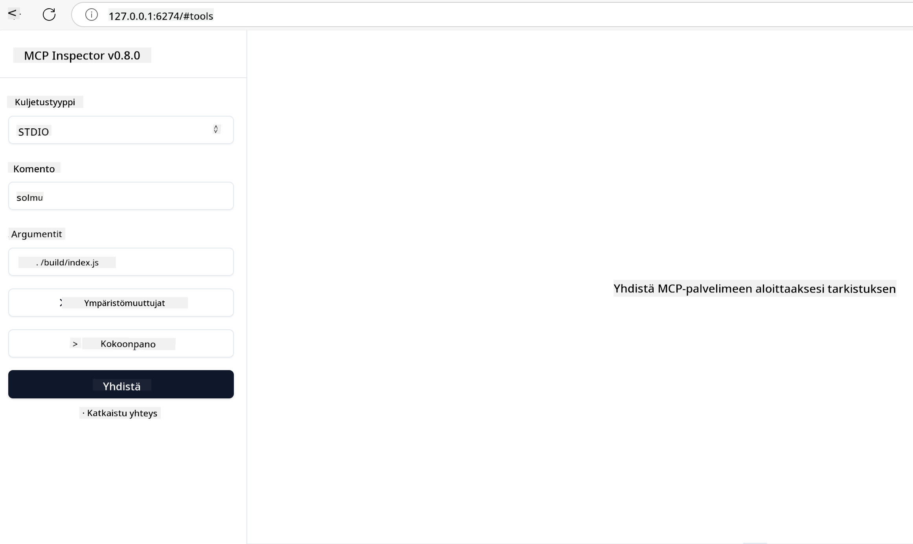
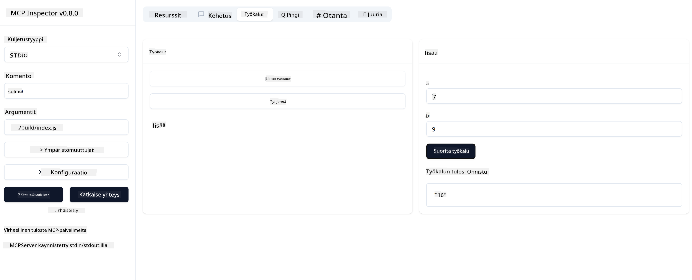

<!--
CO_OP_TRANSLATOR_METADATA:
{
  "original_hash": "5331ffd328a54b90f76706c52b673e27",
  "translation_date": "2025-05-17T08:41:59+00:00",
  "source_file": "03-GettingStarted/01-first-server/README.md",
  "language_code": "fi"
}
-->
# Aloittaminen MCP:n kanssa

Tervetuloa ensimmäisiin askeleisiisi Model Context Protocolin (MCP) parissa! Olitpa sitten uusi MCP:n käyttäjä tai haluat syventää ymmärrystäsi, tämä opas johdattaa sinut olennaisen asennuksen ja kehitysprosessin läpi. Saat selville, kuinka MCP mahdollistaa saumattoman integroinnin tekoälymallien ja sovellusten välillä, ja opit, kuinka saat ympäristösi nopeasti valmiiksi MCP-ratkaisujen rakentamista ja testaamista varten.

> TLDR; Jos rakennat tekoälysovelluksia, tiedät, että voit lisätä työkaluja ja muita resursseja LLM:ään (laaja kielimalli) tehdäksesi siitä tietävämmän. Jos kuitenkin sijoitat nämä työkalut ja resurssit palvelimelle, sovellusta ja palvelimen ominaisuuksia voi käyttää mikä tahansa asiakas LLM:n kanssa tai ilman.

## Yleiskatsaus

Tämä oppitunti tarjoaa käytännön ohjeita MCP-ympäristöjen asettamiseen ja ensimmäisten MCP-sovellusten rakentamiseen. Opit, kuinka asennat tarvittavat työkalut ja kehykset, rakennat perus MCP-palvelimia, luot isäntäsovelluksia ja testaat toteutuksiasi.

Model Context Protocol (MCP) on avoin protokolla, joka standardoi, kuinka sovellukset tarjoavat kontekstin LLM:ille. Ajattele MCP:tä kuin USB-C-porttia tekoälysovelluksille - se tarjoaa standardoidun tavan yhdistää tekoälymalleja eri tietolähteisiin ja työkaluihin.

## Oppimistavoitteet

Tämän oppitunnin lopussa osaat:

- Asettaa kehitysympäristöt MCP:lle C#:ssa, Javassa, Pythonissa, TypeScriptissä ja JavaScriptissä
- Rakentaa ja ottaa käyttöön perus MCP-palvelimia mukautetuilla ominaisuuksilla (resurssit, kehotteet ja työkalut)
- Luoda isäntäsovelluksia, jotka yhdistyvät MCP-palvelimiin
- Testata ja debugata MCP-toteutuksia

## MCP-ympäristön asettaminen

Ennen kuin aloitat työskentelyn MCP:n kanssa, on tärkeää valmistella kehitysympäristösi ja ymmärtää perus työnkulku. Tämä osio ohjaa sinut alkuasennusvaiheiden läpi varmistaen sujuvan alun MCP:n kanssa.

### Esivaatimukset

Ennen kuin sukellat MCP-kehitykseen, varmista että sinulla on:

- **Kehitysympäristö**: Valitsemallesi kielelle (C#, Java, Python, TypeScript tai JavaScript)
- **IDE/Editori**: Visual Studio, Visual Studio Code, IntelliJ, Eclipse, PyCharm tai mikä tahansa moderni koodieditori
- **Paketinhallinnat**: NuGet, Maven/Gradle, pip tai npm/yarn
- **API-avaimet**: Kaikille AI-palveluille, joita aiot käyttää isäntäsovelluksissasi

## Perus MCP-palvelimen rakenne

MCP-palvelin sisältää tyypillisesti:

- **Palvelimen konfiguraatio**: Portin, autentikoinnin ja muiden asetusten määrittäminen
- **Resurssit**: Data ja konteksti, jotka ovat saatavilla LLM:ille
- **Työkalut**: Toiminnot, joita mallit voivat kutsua
- **Kehotteet**: Mallit tekstin luomiseen tai jäsentämiseen

Tässä on yksinkertaistettu esimerkki TypeScriptissä:

```typescript
import { Server, Tool, Resource } from "@modelcontextprotocol/typescript-server-sdk";

// Create a new MCP server
const server = new Server({
  port: 3000,
  name: "Example MCP Server",
  version: "1.0.0"
});

// Register a tool
server.registerTool({
  name: "calculator",
  description: "Performs basic calculations",
  parameters: {
    expression: {
      type: "string",
      description: "The math expression to evaluate"
    }
  },
  handler: async (params) => {
    const result = eval(params.expression);
    return { result };
  }
});

// Start the server
server.start();
```

Edellisessä koodissa me:

- Tuomme tarvittavat luokat MCP TypeScript SDK:sta.
- Luomme ja konfiguroimme uuden MCP-palvelimen instanssin.
- Rekisteröimme mukautetun työkalun (`calculator`) käsittelijäfunktion kanssa.
- Käynnistämme palvelimen kuuntelemaan saapuvia MCP-pyyntöjä.

## Testaus ja virheiden korjaus

Ennen kuin aloitat MCP-palvelimen testaamisen, on tärkeää ymmärtää saatavilla olevat työkalut ja parhaat käytännöt virheiden korjaamiseen. Tehokas testaus varmistaa, että palvelimesi toimii odotetusti ja auttaa sinua tunnistamaan ja ratkaisemaan ongelmat nopeasti. Seuraava osio hahmottelee suositeltuja lähestymistapoja MCP-toteutuksen validointiin.

MCP tarjoaa työkaluja, jotka auttavat sinua testaamaan ja debuggaamaan palvelimiasi:

- **Inspector-työkalu**, tämä graafinen käyttöliittymä antaa sinun yhdistää palvelimeesi ja testata työkaluja, kehotteita ja resursseja.
- **curl**, voit myös yhdistää palvelimeesi komentorivityökalulla kuten curl tai muilla asiakkailla, jotka voivat luoda ja suorittaa HTTP-komentoja.

### MCP Inspectorin käyttäminen

[MCP Inspector](https://github.com/modelcontextprotocol/inspector) on visuaalinen testausväline, joka auttaa sinua:

1. **Palvelimen ominaisuuksien löytäminen**: Tunnistaa automaattisesti saatavilla olevat resurssit, työkalut ja kehotteet
2. **Työkalujen suorittamisen testaaminen**: Kokeile eri parametreja ja näe vastaukset reaaliajassa
3. **Palvelimen metadatan tarkastelu**: Tutki palvelimen tietoja, kaavioita ja konfiguraatioita

```bash
# ex TypeScript, installing and running MCP Inspector
npx @modelcontextprotocol/inspector node build/index.js
```

Kun suoritat yllä olevat komennot, MCP Inspector käynnistää paikallisen web-käyttöliittymän selaimeesi. Voit odottaa näkeväsi hallintapaneelin, joka näyttää rekisteröidyt MCP-palvelimesi, niiden saatavilla olevat työkalut, resurssit ja kehotteet. Käyttöliittymä mahdollistaa työkalujen suorittamisen interaktiivisen testaamisen, palvelimen metadatan tarkastelun ja reaaliaikaisten vastausten tarkastelun, mikä helpottaa MCP-palvelimen toteutusten validointia ja debuggausta.

Tässä on kuvakaappaus siitä, miltä se voi näyttää:


## Yleiset asennusongelmat ja ratkaisut

| Ongelma | Mahdollinen ratkaisu |
|---------|----------------------|
| Yhteys evätty | Tarkista, onko palvelin käynnissä ja onko portti oikea |
| Työkalun suoritusvirheet | Tarkista parametrien validointi ja virheiden käsittely |
| Autentikointivirheet | Varmista API-avaimet ja käyttöoikeudet |
| Kaavion validointivirheet | Varmista, että parametrit vastaavat määriteltyä kaaviota |
| Palvelin ei käynnisty | Tarkista porttiristiriidat tai puuttuvat riippuvuudet |
| CORS-virheet | Määritä oikeat CORS-otsikot ristiin alkuperäisten pyyntöjen sallimiseksi |
| Autentikointiongelmat | Varmista tokenin voimassaolo ja käyttöoikeudet |

## Paikallinen kehitys

Paikallista kehitystä ja testausta varten voit ajaa MCP-palvelimia suoraan koneellasi:

1. **Käynnistä palvelinprosessi**: Suorita MCP-palvelinsovelluksesi 
2. **Määritä verkkoasetukset**: Varmista, että palvelin on saavutettavissa odotetulla portilla 
3. **Yhdistä asiakkaat**: Käytä paikallisia yhteys-URL-osoitteita, kuten `http://localhost:3000`

```bash
# Example: Running a TypeScript MCP server locally
npm run start
# Server running at http://localhost:3000
```

## Ensimmäisen MCP-palvelimen rakentaminen

Olemme käsitelleet [Keskeiset käsitteet](/01-CoreConcepts/README.md) aiemmassa oppitunnissa, nyt on aika soveltaa tätä tietoa käytännössä.

### Mitä palvelin voi tehdä

Ennen kuin aloitamme koodin kirjoittamisen, muistutetaanpa itseämme, mitä palvelin voi tehdä:

Esimerkiksi MCP-palvelin voi:

- Päästä käsiksi paikallisiin tiedostoihin ja tietokantoihin
- Yhdistyä etärajapintoihin
- Suorittaa laskutoimituksia
- Integroitua muihin työkaluihin ja palveluihin
- Tarjota käyttöliittymän vuorovaikutusta varten

Hienoa, nyt kun tiedämme, mitä voimme tehdä, aloitetaan koodaus.

## Harjoitus: Palvelimen luominen

Palvelimen luomiseksi sinun tulee noudattaa näitä vaiheita:

- Asenna MCP SDK.
- Luo projekti ja aseta projektin rakenne.
- Kirjoita palvelinkoodi.
- Testaa palvelin.

### -1- Asenna SDK

Tämä vaihtelee hieman valitun ajonaikaympäristön mukaan, joten valitse yksi alla olevista ajonaikaympäristöistä:

Generatiivinen tekoäly voi luoda tekstiä, kuvia ja jopa koodia.
Olet koulutettu dataan lokakuuhun 2023 asti.

### -2- Luo projekti

Nyt kun olet asentanut SDK:n, luodaan seuraavaksi projekti:

### -3- Luo projektitiedostot

### -4- Luo palvelinkoodi

### -5- Lisää työkalu ja resurssi

Lisää työkalu ja resurssi lisäämällä seuraava koodi:

### -6 Lopullinen koodi

Lisätään viimeinen koodi, jota tarvitsemme, jotta palvelin voi käynnistyä:

### -7- Testaa palvelin

Käynnistä palvelin seuraavalla komennolla:

### -8- Suorita käyttäen inspectoria

Inspector on loistava työkalu, joka voi käynnistää palvelimesi ja antaa sinun olla vuorovaikutuksessa sen kanssa, jotta voit testata sen toimivuuden. Käynnistetään se:

> [!NOTE]
> se voi näyttää erilaiselta "komento"-kentässä, koska se sisältää komennon palvelimen suorittamiseen tietyn ajonaikaympäristösi kanssa

Sinun pitäisi nähdä seuraava käyttöliittymä:



1. Yhdistä palvelimeen valitsemalla Yhdistä-painike 
   Kun yhdistät palvelimeen, sinun pitäisi nyt nähdä seuraava:

   

1. Valitse "Työkalut" ja "listTools", sinun pitäisi nähdä "Add" ilmestyvän, valitse "Add" ja täytä parametrien arvot.

   Sinun pitäisi nähdä seuraava vastaus, eli "add"-työkalun tulos:

   

Onnittelut, olet onnistunut luomaan ja suorittamaan ensimmäisen palvelimesi!

### Viralliset SDK:t

MCP tarjoaa virallisia SDK:ita useille kielille:
- [C# SDK](https://github.com/modelcontextprotocol/csharp-sdk) - Ylläpidetty yhteistyössä Microsoftin kanssa
- [Java SDK](https://github.com/modelcontextprotocol/java-sdk) - Ylläpidetty yhteistyössä Spring AI:n kanssa
- [TypeScript SDK](https://github.com/modelcontextprotocol/typescript-sdk) - Virallinen TypeScript-toteutus
- [Python SDK](https://github.com/modelcontextprotocol/python-sdk) - Virallinen Python-toteutus
- [Kotlin SDK](https://github.com/modelcontextprotocol/kotlin-sdk) - Virallinen Kotlin-toteutus
- [Swift SDK](https://github.com/modelcontextprotocol/swift-sdk) - Ylläpidetty yhteistyössä Loopwork AI:n kanssa
- [Rust SDK](https://github.com/modelcontextprotocol/rust-sdk) - Virallinen Rust-toteutus

## Keskeiset opit

- MCP-kehitysympäristön asettaminen on suoraviivaista kielikohtaisten SDK:iden avulla
- MCP-palvelinten rakentaminen sisältää työkalujen luomisen ja rekisteröinnin selkeillä kaavioilla
- Testaus ja virheiden korjaus ovat välttämättömiä luotettavien MCP-toteutusten kannalta

## Esimerkit 

- [Java-laskin](../samples/java/calculator/README.md)
- [.Net-laskin](../../../../03-GettingStarted/samples/csharp)
- [JavaScript-laskin](../samples/javascript/README.md)
- [TypeScript-laskin](../samples/typescript/README.md)
- [Python-laskin](../../../../03-GettingStarted/samples/python)

## Tehtävä

Luo yksinkertainen MCP-palvelin valitsemallasi työkalulla:
1. Toteuta työkalu valitsemallasi kielellä (.NET, Java, Python tai JavaScript).
2. Määritä syöteparametrit ja palautusarvot.
3. Suorita inspector-työkalu varmistaaksesi, että palvelin toimii odotetusti.
4. Testaa toteutus erilaisilla syötteillä.

## Ratkaisu

[Ratkaisu](./solution/README.md)

## Lisäresurssit

- [MCP GitHub Repository](https://github.com/microsoft/mcp-for-beginners)

## Mitä seuraavaksi

Seuraavaksi: [Aloittaminen MCP-asiakkaiden kanssa](/03-GettingStarted/02-client/README.md)

**Vastuuvapauslauseke**:  
Tämä asiakirja on käännetty käyttämällä tekoälypohjaista käännöspalvelua [Co-op Translator](https://github.com/Azure/co-op-translator). Pyrimme tarkkuuteen, mutta huomioithan, että automaattiset käännökset voivat sisältää virheitä tai epätarkkuuksia. Alkuperäistä asiakirjaa sen alkuperäisellä kielellä tulisi pitää auktoritatiivisena lähteenä. Kriittisen tiedon osalta suositellaan ammattimaista ihmiskäännöstä. Emme ole vastuussa mahdollisista väärinkäsityksistä tai virhetulkinnoista, jotka johtuvat tämän käännöksen käytöstä.