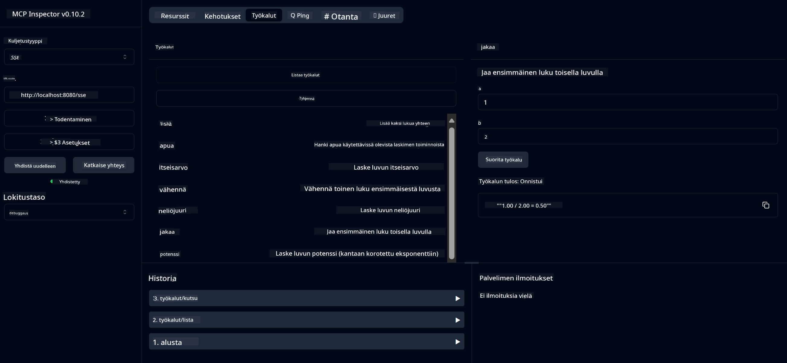

<!--
CO_OP_TRANSLATOR_METADATA:
{
  "original_hash": "ed9cab32cc67c12d8969b407aa47100a",
  "translation_date": "2025-06-11T09:33:54+00:00",
  "source_file": "03-GettingStarted/01-first-server/solution/java/README.md",
  "language_code": "fi"
}
-->
# Basic Calculator MCP Service

Tämä palvelu tarjoaa peruslaskutoimituksia Model Context Protocolin (MCP) kautta käyttäen Spring Bootia WebFlux-siirtona. Se on suunniteltu yksinkertaiseksi esimerkiksi aloittelijoille, jotka opettelevat MCP-toteutuksia.

Lisätietoja löydät [MCP Server Boot Starter](https://docs.spring.io/spring-ai/reference/api/mcp/mcp-server-boot-starter-docs.html) -viitedokumentaatiosta.


## Palvelun käyttö

Palvelu tarjoaa seuraavat API-päätepisteet MCP-protokollan kautta:

- `add(a, b)`: Laskee kahden luvun summan
- `subtract(a, b)`: Vähentää toisen luvun ensimmäisestä
- `multiply(a, b)`: Kertoo kaksi lukua keskenään
- `divide(a, b)`: Jakaa ensimmäisen luvun toisella (tarkistaa nollalla jakamisen)
- `power(base, exponent)`: Laskee luvun potenssin
- `squareRoot(number)`: Laskee neliöjuuren (tarkistaa negatiivisen luvun)
- `modulus(a, b)`: Laskee jakojäännöksen
- `absolute(number)`: Laskee luvun itseisarvon

## Riippuvuudet

Projekti vaatii seuraavat keskeiset riippuvuudet:

```xml
<dependency>
    <groupId>org.springframework.ai</groupId>
    <artifactId>spring-ai-starter-mcp-server-webflux</artifactId>
</dependency>
```

## Projektin kääntäminen

Käännä projekti Mavenilla:
```bash
./mvnw clean install -DskipTests
```

## Palvelimen käynnistäminen

### Javaa käyttäen

```bash
java -jar target/calculator-server-0.0.1-SNAPSHOT.jar
```

### MCP Inspectorin käyttö

MCP Inspector on hyödyllinen työkalu MCP-palveluiden kanssa työskentelyyn. Käyttääksesi sitä tämän laskinpalvelun kanssa:

1. **Asenna ja käynnistä MCP Inspector** uudessa terminaali-ikkunassa:
   ```bash
   npx @modelcontextprotocol/inspector
   ```

2. **Avaa web-käyttöliittymä** napsauttamalla sovelluksen näyttämää URL-osoitetta (yleensä http://localhost:6274)

3. **Määritä yhteys**:
   - Valitse siirtotavaksi "SSE"
   - Anna URL-osoitteeksi käynnissä olevan palvelimen SSE-päätepiste: `http://localhost:8080/sse`
   - Klikkaa "Connect"

4. **Käytä työkaluja**:
   - Klikkaa "List Tools" nähdäksesi käytettävissä olevat laskutoiminnot
   - Valitse työkalu ja napsauta "Run Tool" suorittaaksesi toiminnon



**Vastuuvapauslauseke**:  
Tämä asiakirja on käännetty käyttämällä tekoälypohjaista käännöspalvelua [Co-op Translator](https://github.com/Azure/co-op-translator). Vaikka pyrimme tarkkuuteen, ole hyvä ja huomioi, että automaattiset käännökset saattavat sisältää virheitä tai epätarkkuuksia. Alkuperäistä asiakirjaa sen alkuperäiskielellä tulee pitää auktoritatiivisena lähteenä. Tärkeissä tiedoissa suositellaan ammattilaisen tekemää ihmiskäännöstä. Emme ole vastuussa tämän käännöksen käytöstä johtuvista väärinymmärryksistä tai virhetulkinnoista.