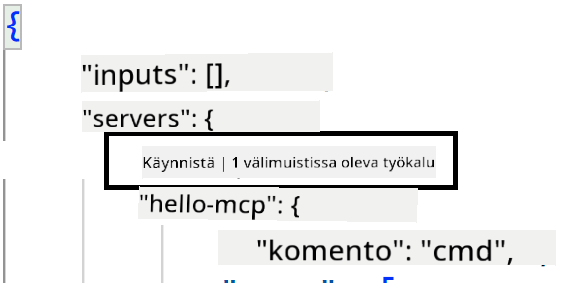
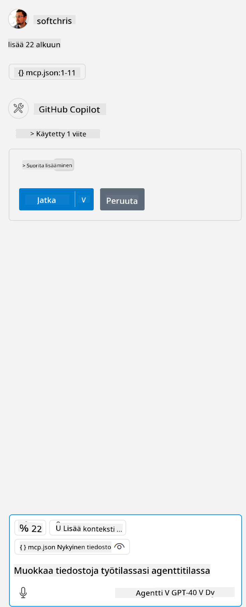

<!--
CO_OP_TRANSLATOR_METADATA:
{
  "original_hash": "c37fabfbc0dcbc9a4afb6d17e7d3be9f",
  "translation_date": "2025-05-17T11:10:41+00:00",
  "source_file": "03-GettingStarted/04-vscode/README.md",
  "language_code": "fi"
}
-->
Puhutaan enemmän siitä, miten käytämme visuaalista käyttöliittymää seuraavissa osioissa.

## Lähestymistapa

Näin meidän tulee lähestyä asiaa yleisellä tasolla:

- Määritä tiedosto MCP-palvelimen löytämiseksi.
- Käynnistä/Yhdistä kyseiseen palvelimeen, jotta se voi luetella ominaisuutensa.
- Käytä näitä ominaisuuksia GitHub Copilotin chat-käyttöliittymän kautta.

Hienoa, nyt kun ymmärrämme kulun, kokeillaan MCP-palvelimen käyttöä Visual Studio Codessa harjoituksen avulla.

## Harjoitus: Palvelimen käyttö

Tässä harjoituksessa määritämme Visual Studio Coden löytämään MCP-palvelimesi, jotta sitä voidaan käyttää GitHub Copilotin chat-käyttöliittymästä.

### -0- Esivaihe, ota MCP-palvelimen haku käyttöön

Saatat joutua ottamaan MCP-palvelinten haun käyttöön.

1. Mene kohtaan `File -> Preferences -> Settings` in Visual Studio Code.

1. Search for "MCP" and enable `chat.mcp.discovery.enabled` settings.json-tiedostossa.

### -1- Luo konfiguraatiotiedosto

Aloita luomalla konfiguraatiotiedosto projektisi juureen. Tarvitset tiedoston nimeltä MCP.json ja sijoita se .vscode-kansioon. Sen tulisi näyttää tältä:

```text
.vscode
|-- mcp.json
```

Seuraavaksi katsotaan, miten voimme lisätä palvelimen merkinnän.

### -2- Määritä palvelin

Lisää seuraava sisältö *mcp.json*-tiedostoon:

```json
{
    "inputs": [],
    "servers": {
       "hello-mcp": {
           "command": "cmd",
           "args": [
               "/c", "node", "<absolute path>\\build\\index.js"
           ]
       }
    }
}
```

Tässä on yksinkertainen esimerkki Node.js:llä kirjoitetun palvelimen käynnistämisestä. Muille ajonaikoille määritä oikea komento palvelimen käynnistämiseksi käyttämällä `command` and `args`.

### -3- Käynnistä palvelin

Nyt kun olet lisännyt merkinnän, käynnistä palvelin:

1. Etsi merkintäsi *mcp.json*-tiedostosta ja varmista, että löydät "play"-ikonin:

    

1. Klikkaa "play"-ikonia, sinun pitäisi nähdä työkalujen ikonissa GitHub Copilotin chatissa lisääntyvän saatavilla olevien työkalujen määrän. Jos klikkaat kyseistä työkalujen ikonia, näet rekisteröityjen työkalujen listan. Voit valita tai poistaa valinnan jokaisesta työkalusta riippuen siitä, haluatko GitHub Copilotin käyttävän niitä kontekstina:

  

1. Työkalun suorittamiseksi kirjoita kehotus, jonka tiedät vastaavan jonkin työkalusi kuvausta, esimerkiksi kehotus "lisää 22 ja 1":

  

  Sinun pitäisi nähdä vastaus, joka sanoo 23.

## Tehtävä

Yritä lisätä palvelinmerkintä *mcp.json*-tiedostoon ja varmista, että voit käynnistää/pysäyttää palvelimen. Varmista myös, että voit kommunikoida palvelimesi työkalujen kanssa GitHub Copilotin chat-käyttöliittymän kautta.

## Ratkaisu

[Ratkaisu](./solution/README.md)

## Keskeiset opit

Tämän luvun keskeiset opit ovat seuraavat:

- Visual Studio Code on loistava asiakas, joka antaa sinun käyttää useita MCP-palvelimia ja niiden työkaluja.
- GitHub Copilotin chat-käyttöliittymä on tapa, jolla vuorovaikutat palvelimien kanssa.
- Voit pyytää käyttäjältä syötteitä, kuten API-avaimia, jotka voidaan välittää MCP-palvelimelle, kun määrität palvelinmerkintää *mcp.json*-tiedostossa.

## Esimerkit

- [Java-laskin](../samples/java/calculator/README.md)
- [.Net-laskin](../../../../03-GettingStarted/samples/csharp)
- [JavaScript-laskin](../samples/javascript/README.md)
- [TypeScript-laskin](../samples/typescript/README.md)
- [Python-laskin](../../../../03-GettingStarted/samples/python) 

## Lisäresurssit

- [Visual Studio -dokumentaatio](https://code.visualstudio.com/docs/copilot/chat/mcp-servers)

## Mitä seuraavaksi

- Seuraavaksi: [SSE-palvelimen luominen](/03-GettingStarted/05-sse-server/README.md)

**Vastuuvapauslauseke**:  
Tämä asiakirja on käännetty käyttäen AI-käännöspalvelua [Co-op Translator](https://github.com/Azure/co-op-translator). Vaikka pyrimme tarkkuuteen, huomioithan, että automaattiset käännökset voivat sisältää virheitä tai epätarkkuuksia. Alkuperäinen asiakirja sen alkuperäisellä kielellä tulisi pitää ensisijaisena lähteenä. Kriittistä tietoa varten suositellaan ammattimaista ihmiskäännöstä. Emme ole vastuussa mahdollisista väärinkäsityksistä tai virhetulkinnoista, jotka johtuvat tämän käännöksen käytöstä.