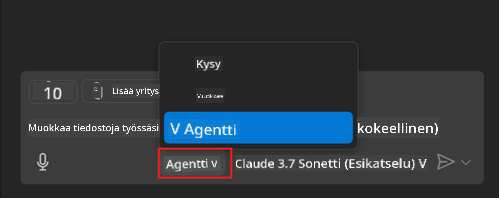
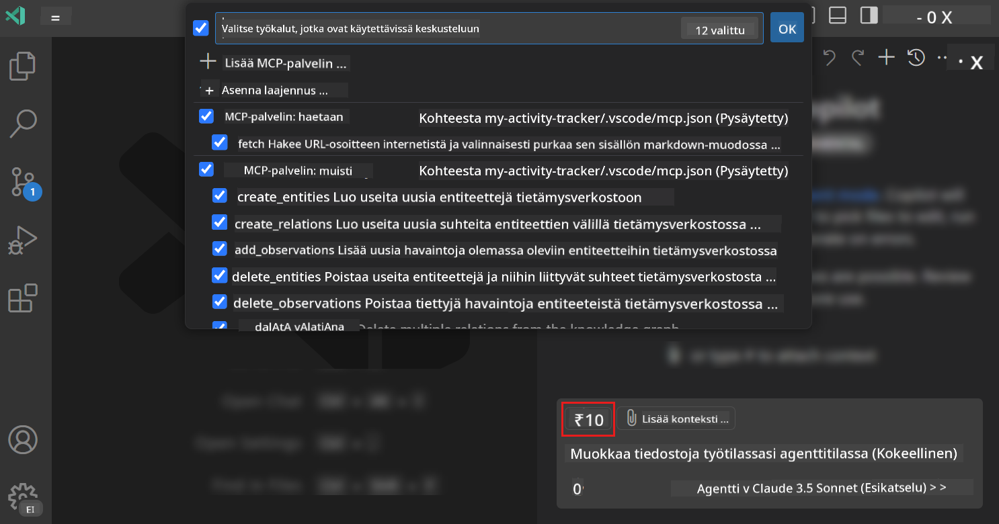
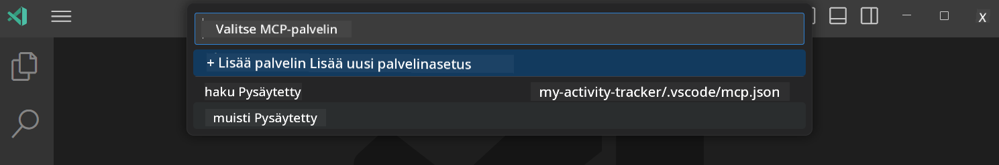
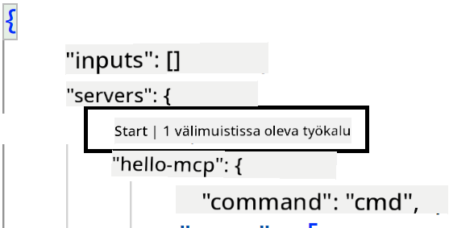
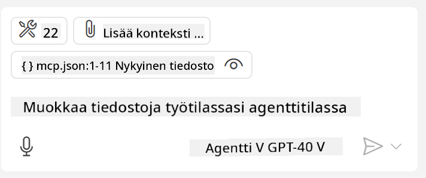
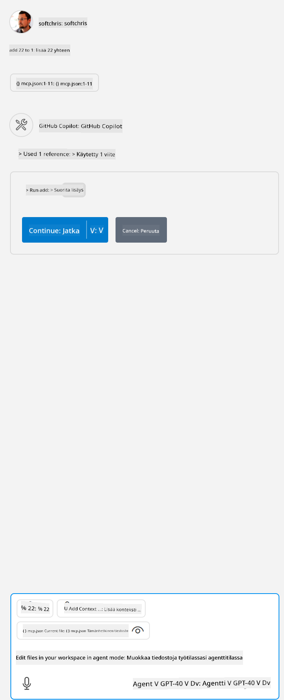

<!--
CO_OP_TRANSLATOR_METADATA:
{
  "original_hash": "d940b5e0af75e3a3a4d1c3179120d1d9",
  "translation_date": "2025-08-26T17:56:12+00:00",
  "source_file": "03-GettingStarted/04-vscode/README.md",
  "language_code": "fi"
}
-->
# GitHub Copilot Agent -tilan käyttäminen palvelimen kanssa

Visual Studio Code ja GitHub Copilot voivat toimia asiakkaana ja käyttää MCP-palvelinta. Miksi haluaisimme tehdä niin, saatat kysyä? No, tämä tarkoittaa, että mitä tahansa MCP-palvelimen ominaisuuksia voidaan nyt käyttää suoraan IDE:ssäsi. Kuvittele esimerkiksi GitHubin MCP-palvelimen lisääminen – tämä mahdollistaisi GitHubin hallinnan kehotteiden avulla sen sijaan, että kirjoittaisit tiettyjä komentoja terminaaliin. Tai kuvittele mitä tahansa, mikä voisi parantaa kehittäjäkokemustasi, kaikki ohjattuna luonnollisella kielellä. Nyt alat nähdä hyödyn, eikö?

## Yleiskatsaus

Tämä osio käsittelee, kuinka käyttää Visual Studio Codea ja GitHub Copilotin Agent-tilaa MCP-palvelimen asiakkaana.

## Oppimistavoitteet

Tämän osion lopussa osaat:

- Käyttää MCP-palvelinta Visual Studio Coden kautta.
- Suorittaa työkaluja GitHub Copilotin avulla.
- Määrittää Visual Studio Coden löytämään ja hallitsemaan MCP-palvelintasi.

## Käyttö

Voit hallita MCP-palvelintasi kahdella eri tavalla:

- Käyttöliittymä, näet myöhemmin tässä osiossa, miten tämä tehdään.
- Terminaali, on mahdollista hallita asioita terminaalista käyttämällä `code`-suoritustiedostoa:

  MCP-palvelimen lisäämiseksi käyttäjäprofiiliin käytä --add-mcp-komentorivivaihtoehtoa ja anna JSON-palvelinkonfiguraatio muodossa {\"name\":\"server-name\",\"command\":...}.

  ```
  code --add-mcp "{\"name\":\"my-server\",\"command\": \"uvx\",\"args\": [\"mcp-server-fetch\"]}"
  ```

### Kuvakaappaukset





Puhutaan lisää käyttöliittymän käytöstä seuraavissa osioissa.

## Lähestymistapa

Näin lähestymme tätä korkealla tasolla:

- Määritä tiedosto MCP-palvelimen löytämiseksi.
- Käynnistä/Yhdistä palvelimeen, jotta sen ominaisuudet tulevat näkyviin.
- Käytä näitä ominaisuuksia GitHub Copilot Chat -käyttöliittymän kautta.

Hienoa, nyt kun ymmärrämme prosessin, kokeillaan MCP-palvelimen käyttöä Visual Studio Codessa harjoituksen avulla.

## Harjoitus: Palvelimen käyttö

Tässä harjoituksessa määritämme Visual Studio Coden löytämään MCP-palvelimesi, jotta sitä voidaan käyttää GitHub Copilot Chat -käyttöliittymän kautta.

### -0- Esivaihe, ota MCP-palvelimen etsintä käyttöön

Sinun täytyy ehkä ottaa MCP-palvelinten etsintä käyttöön.

1. Siirry Visual Studio Codessa kohtaan `File -> Preferences -> Settings`.

1. Etsi "MCP" ja ota käyttöön `chat.mcp.discovery.enabled` settings.json-tiedostossa.

### -1- Luo konfiguraatiotiedosto

Aloita luomalla konfiguraatiotiedosto projektisi juureen. Tarvitset tiedoston nimeltä MCP.json, joka tulee sijoittaa .vscode-kansioon. Sen tulisi näyttää tältä:

```text
.vscode
|-- mcp.json
```

Seuraavaksi katsotaan, miten palvelinmerkintä lisätään.

### -2- Määritä palvelin

Lisää seuraava sisältö *mcp.json*-tiedostoon:

```json
{
    "inputs": [],
    "servers": {
       "hello-mcp": {
           "command": "node",
           "args": [
               "build/index.js"
           ]
       }
    }
}
```

Yllä on yksinkertainen esimerkki Node.js:llä kirjoitetun palvelimen käynnistämisestä. Muille ajoympäristöille määritä oikea komento palvelimen käynnistämiseksi käyttämällä `command` ja `args`.

### -3- Käynnistä palvelin

Kun olet lisännyt merkinnän, käynnistä palvelin:

1. Etsi merkintäsi *mcp.json*-tiedostosta ja varmista, että löydät "play"-ikonin:

    

1. Klikkaa "play"-ikonia. Näet GitHub Copilot Chat -työkalukuvakkeen lisäävän käytettävissä olevien työkalujen määrää. Jos klikkaat työkalukuvaketta, näet rekisteröityjen työkalujen listan. Voit valita tai poistaa valinnan jokaisesta työkalusta riippuen siitä, haluatko GitHub Copilotin käyttävän niitä kontekstina:

  

1. Työkalun suorittamiseksi kirjoita kehotus, jonka tiedät vastaavan yhden työkalusi kuvausta, esimerkiksi kehotus "lisää 22 ja 1":

  

  Näet vastauksen, joka sanoo 23.

## Tehtävä

Kokeile lisätä palvelinmerkintä *mcp.json*-tiedostoon ja varmista, että voit käynnistää/pysäyttää palvelimen. Varmista myös, että voit kommunikoida palvelimesi työkalujen kanssa GitHub Copilot Chat -käyttöliittymän kautta.

## Ratkaisu

[Ratkaisu](./solution/README.md)

## Keskeiset opit

Tämän osion keskeiset opit ovat seuraavat:

- Visual Studio Code on erinomainen asiakas, joka mahdollistaa useiden MCP-palvelinten ja niiden työkalujen käytön.
- GitHub Copilot Chat -käyttöliittymä on tapa kommunikoida palvelinten kanssa.
- Voit pyytää käyttäjältä syötteitä, kuten API-avaimia, jotka voidaan välittää MCP-palvelimelle palvelinmerkintää konfiguroidessa *mcp.json*-tiedostossa.

## Esimerkit

- [Java-laskin](../samples/java/calculator/README.md)
- [.Net-laskin](../../../../03-GettingStarted/samples/csharp)
- [JavaScript-laskin](../samples/javascript/README.md)
- [TypeScript-laskin](../samples/typescript/README.md)
- [Python-laskin](../../../../03-GettingStarted/samples/python)

## Lisäresurssit

- [Visual Studio -dokumentaatio](https://code.visualstudio.com/docs/copilot/chat/mcp-servers)

## Mitä seuraavaksi

- Seuraavaksi: [Stdio-palvelimen luominen](../05-stdio-server/README.md)

---

**Vastuuvapauslauseke**:  
Tämä asiakirja on käännetty käyttämällä tekoälypohjaista käännöspalvelua [Co-op Translator](https://github.com/Azure/co-op-translator). Vaikka pyrimme tarkkuuteen, huomioithan, että automaattiset käännökset voivat sisältää virheitä tai epätarkkuuksia. Alkuperäinen asiakirja sen alkuperäisellä kielellä tulisi pitää ensisijaisena lähteenä. Kriittisen tiedon osalta suositellaan ammattimaista ihmiskäännöstä. Emme ole vastuussa väärinkäsityksistä tai virhetulkinnoista, jotka johtuvat tämän käännöksen käytöstä.