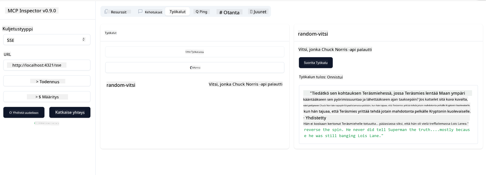

<!--
CO_OP_TRANSLATOR_METADATA:
{
  "original_hash": "1681ca3633aeb49ee03766abdbb94a93",
  "translation_date": "2025-06-17T22:17:36+00:00",
  "source_file": "03-GettingStarted/05-sse-server/README.md",
  "language_code": "fi"
}
-->
Nyt kun tiedämme hieman enemmän SSE:stä, rakennetaan seuraavaksi SSE-palvelin.

## Harjoitus: SSE-palvelimen luominen

Palvelimen luomisessa on pidettävä mielessä kaksi asiaa:

- Tarvitsemme web-palvelimen, joka tarjoaa päätepisteet yhteyksille ja viesteille.
- Rakennamme palvelimen kuten tavallisesti käyttäen työkaluja, resursseja ja kehotteita, kuten stdio:n kanssa.

### -1- Luo palvelininstanssi

Palvelimen luomiseksi käytämme samoja tyyppejä kuin stdio:ssa. Siitä huolimatta kuljetustavaksi pitää valita SSE.

Seuraavaksi lisätään tarvittavat reitit.

### -2- Lisää reitit

Lisätään reitit, jotka käsittelevät yhteyden ja saapuvat viestit:

Seuraavaksi lisätään palvelimen ominaisuuksia.

### -3- Palvelimen ominaisuuksien lisääminen

Nyt kun olemme määritelleet kaiken SSE-spesifin, lisätään palvelimen ominaisuuksia kuten työkaluja, kehotteita ja resursseja.

Koko koodisi pitäisi näyttää tältä:

Hienoa, meillä on SSE:tä käyttävä palvelin, kokeillaan sitä seuraavaksi.

## Harjoitus: SSE-palvelimen virheenkorjaus Inspectorilla

Inspector on loistava työkalu, jonka näimme aiemmassa oppitunnissa [Ensimmäisen palvelimen luominen](/03-GettingStarted/01-first-server/README.md). Katsotaan, voimmeko käyttää Inspectoria myös tässä:

### -1- Inspectorin käynnistäminen

Inspectorin käynnistämiseksi sinun on ensin saatava SSE-palvelin käyntiin, tehdään se ensin:

1. Käynnistä palvelin

1. Käynnistä inspector

    > ![NOTE]
    > Käynnistä tämä eri komentoriviltä kuin palvelin on käynnissä. Huomaa myös, että sinun täytyy muokata alla olevaa komentoa vastaamaan URL-osoitetta, jossa palvelimesi toimii.

    ```sh
    npx @modelcontextprotocol/inspector --cli http://localhost:8000/sse --method tools/list
    ```

Inspectorin käynnistäminen näyttää samalta kaikissa suoritusympäristöissä. Huomaa, että sen sijaan että antaisit polun palvelimelle ja komennon palvelimen käynnistämiseksi, annat URL-osoitteen, jossa palvelin toimii, ja määrität myös `/sse`-reitin.

### -2- Työkalun kokeileminen

Yhdistä palvelimeen valitsemalla pudotusvalikosta SSE ja täytä URL-kenttään palvelimesi osoite, esimerkiksi http:localhost:4321/sse. Klikkaa sitten "Connect"-painiketta. Valitse kuten ennenkin listattavat työkalut, valitse työkalu ja anna syötearvot. Näet tuloksen kuten alla:



Hienoa, voit käyttää Inspectoria, katsotaan seuraavaksi, miten voit työskennellä Visual Studio Coden kanssa.

## Tehtävä

Yritä laajentaa palvelintasi lisäämällä siihen ominaisuuksia. Katso [tästä sivusta](https://api.chucknorris.io/) esimerkiksi, miten lisäät työkalun, joka kutsuu API:a. Sinä päätät, miltä palvelimen tulisi näyttää. Hauskaa koodausta :)

## Ratkaisu

[Ratkaisu](./solution/README.md) Tässä on mahdollinen ratkaisu toimivalla koodilla.

## Keskeiset opit

Tämän luvun keskeiset opit ovat:

- SSE on toinen stdio:n lisäksi tuetuista kuljetustavoista.
- SSE:n tukemiseksi sinun täytyy hallita saapuvia yhteyksiä ja viestejä web-kehyksen avulla.
- Voit käyttää sekä Inspectoria että Visual Studio Codea SSE-palvelimen kuluttamiseen, aivan kuten stdio-palvelimien kanssa. Huomaa, että stdio:n ja SSE:n välillä on pieniä eroja. SSE:n kohdalla palvelin täytyy käynnistää erikseen ja sen jälkeen käynnistää inspector-työkalu. Inspectorissa pitää myös määrittää URL-osoite.

## Esimerkit

- [Java Laskin](../samples/java/calculator/README.md)
- [.Net Laskin](../../../../03-GettingStarted/samples/csharp)
- [JavaScript Laskin](../samples/javascript/README.md)
- [TypeScript Laskin](../samples/typescript/README.md)
- [Python Laskin](../../../../03-GettingStarted/samples/python)

## Lisäresurssit

- [SSE](https://developer.mozilla.org/en-US/docs/Web/API/Server-sent_events)

## Mitä seuraavaksi

- Seuraavaksi: [HTTP Streaming MCP:n kanssa (Streamable HTTP)](/03-GettingStarted/06-http-streaming/README.md)

**Vastuuvapauslauseke**:  
Tämä asiakirja on käännetty käyttämällä tekoälypohjaista käännöspalvelua [Co-op Translator](https://github.com/Azure/co-op-translator). Vaikka pyrimme tarkkuuteen, ota huomioon, että automaattiset käännökset saattavat sisältää virheitä tai epätarkkuuksia. Alkuperäistä asiakirjaa sen alkuperäiskielellä tulee pitää auktoritatiivisena lähteenä. Tärkeissä asioissa suositellaan ammattimaista ihmiskäännöstä. Emme ole vastuussa tämän käännöksen käytöstä johtuvista väärinymmärryksistä tai virhetulkinnoista.