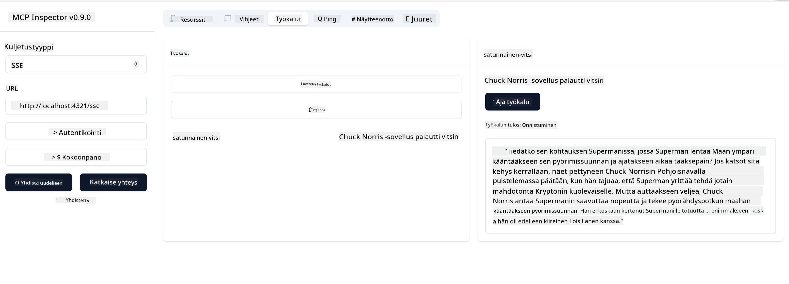

<!--
CO_OP_TRANSLATOR_METADATA:
{
  "original_hash": "0a8086dc4bf89448f83e7936db972c42",
  "translation_date": "2025-05-17T11:37:59+00:00",
  "source_file": "03-GettingStarted/05-sse-server/README.md",
  "language_code": "fi"
}
-->
# SSE-palvelin

SSE (Server Sent Events) on standardi palvelimen ja asiakkaan väliselle suoratoistolle, joka mahdollistaa palvelimen lähettämään reaaliaikaisia päivityksiä asiakkaille HTTP:n kautta. Tämä on erityisen hyödyllistä sovelluksille, jotka vaativat reaaliaikaisia päivityksiä, kuten chat-sovellukset, ilmoitukset tai reaaliaikaiset tietovirrat. Lisäksi palvelintasi voi käyttää useat asiakkaat samanaikaisesti, koska se sijaitsee palvelimella, joka voidaan ajaa esimerkiksi pilvessä.

## Yleiskatsaus

Tämä oppitunti käsittelee SSE-palvelimen rakentamista ja kuluttamista.

## Oppimistavoitteet

Tämän oppitunnin lopussa osaat:

- Rakentaa SSE-palvelimen.
- Virheenkorjata SSE-palvelinta Inspectorin avulla.
- Kuluttaa SSE-palvelinta Visual Studio Codessa.

## SSE, miten se toimii

SSE on yksi kahdesta tuetusta kuljetustyypistä. Olet jo nähnyt ensimmäisen, stdio:n, käytön aiemmissa oppitunneissa. Ero on seuraava:

- SSE vaatii sinua käsittelemään kahta asiaa: yhteyttä ja viestejä.
- Koska tämä on palvelin, joka voi sijaita missä tahansa, sinun on huomioitava tämä työskennellessäsi työkalujen kuten Inspectorin ja Visual Studion kanssa. Tämä tarkoittaa sitä, että sen sijaan, että osoittaisit, miten palvelin käynnistetään, osoitat sen päätepisteeseen, jossa se voi muodostaa yhteyden. Katso alla oleva esimerkkikoodi:
Sinut on koulutettu tiedoilla lokakuuhun 2023 asti.

Nyt kun tiedämme vähän enemmän SSE:stä, rakennetaan seuraavaksi SSE-palvelin.

## Harjoitus: SSE-palvelimen luominen

Palvelimen luomiseksi meidän on pidettävä mielessä kaksi asiaa:

- Meidän on käytettävä verkkopalvelinta päätepisteiden paljastamiseen yhteyden ja viestien osalta.
- Rakennamme palvelimen kuten normaalisti teemme työkaluilla, resursseilla ja kehotteilla, kun käytimme stdio:ta.

### -1- Luo palvelimen instanssi

Palvelimen luomiseksi käytämme samoja tyyppejä kuin stdio:n kanssa. Kuljetusta varten meidän on kuitenkin valittava SSE.

Lisätään tarvittavat reitit seuraavaksi.

### -2- Lisää reitit

Lisätään seuraavaksi reitit, jotka käsittelevät yhteyttä ja saapuvia viestejä:

Lisätään palvelimelle seuraavaksi ominaisuuksia.

### -3- Palvelimen ominaisuuksien lisääminen

Nyt kun olemme määritelleet kaiken SSE-spesifisen, lisätään palvelimelle ominaisuuksia kuten työkaluja, kehotteita ja resursseja.

Koko koodisi pitäisi näyttää tältä:

Hienoa, meillä on palvelin, joka käyttää SSE:tä, kokeillaan sitä seuraavaksi.

## Harjoitus: SSE-palvelimen virheenkorjaus Inspectorin avulla

Inspector on loistava työkalu, jonka näimme aiemmassa oppitunnissa [Ensimmäisen palvelimen luominen](/03-GettingStarted/01-first-server/README.md). Katsotaanpa, voimmeko käyttää Inspectoria myös täällä:

### -1- Inspectorin käynnistäminen

Inspectorin käynnistämiseksi sinulla on ensin oltava käynnissä oleva SSE-palvelin, joten tehdään se seuraavaksi:

1. Käynnistä palvelin

1. Käynnistä Inspector

    > ![NOTE]
    > Suorita tämä eri päätelaitteen ikkunassa kuin palvelin on käynnissä. Huomaa myös, että sinun on mukautettava alla oleva komento sopimaan URL-osoitteeseen, jossa palvelimesi toimii.

    ```sh
    npx @modelcontextprotocol/inspector --cli http://localhost:8000/sse --method tools/list
    ```

    Inspectorin suorittaminen näyttää samalta kaikissa käyttöympäristöissä. Huomaa, miten sen sijaan, että annamme polun palvelimellemme ja komennon palvelimen käynnistämiseksi, annamme URL-osoitteen, jossa palvelin toimii, ja määritämme myös `/sse`-reitin.

### -2- Työkalun kokeilu

Yhdistä palvelimeen valitsemalla SSE pudotusvalikosta ja täytä URL-kenttä, jossa palvelimesi toimii, esimerkiksi http:localhost:4321/sse. Napsauta nyt "Connect"-painiketta. Kuten aiemmin, valitse listattavat työkalut, valitse työkalu ja anna syöttöarvot. Näet tuloksen, kuten alla:



Hienoa, pystyt työskentelemään Inspectorin kanssa, katsotaanpa seuraavaksi, miten voimme työskennellä Visual Studio Coden kanssa.

## Tehtävä

Yritä rakentaa palvelimesi lisäämällä enemmän ominaisuuksia. Katso [tämä sivu](https://api.chucknorris.io/) lisätäksesi esimerkiksi työkalun, joka kutsuu API:ta, sinä päätät, miltä palvelimen pitäisi näyttää. Pidä hauskaa :)

## Ratkaisu

[Ratkaisu](./solution/README.md) Tässä on mahdollinen ratkaisu toimivalla koodilla.

## Keskeiset opit

Tämän luvun keskeiset opit ovat seuraavat:

- SSE on toinen tuettu kuljetus stdio:n rinnalla.
- SSE:tä tukemaan sinun on hallittava saapuvia yhteyksiä ja viestejä verkkokehystä käyttäen.
- Voit käyttää sekä Inspectoria että Visual Studio Codea kuluttamaan SSE-palvelinta, aivan kuten stdio-palvelimia. Huomaa, miten se eroaa hieman stdio:sta ja SSE:stä. SSE:n kohdalla sinun on käynnistettävä palvelin erikseen ja sitten suoritettava inspector-työkalu. Inspector-työkalussa on myös eroja siinä, että sinun on määritettävä URL-osoite.

## Esimerkit

- [Java-laskin](../samples/java/calculator/README.md)
- [.Net-laskin](../../../../03-GettingStarted/samples/csharp)
- [JavaScript-laskin](../samples/javascript/README.md)
- [TypeScript-laskin](../samples/typescript/README.md)
- [Python-laskin](../../../../03-GettingStarted/samples/python)

## Lisäresurssit

- [SSE](https://developer.mozilla.org/en-US/docs/Web/API/Server-sent_events)

## Mitä seuraavaksi

- Seuraavaksi: [AI Toolkit for VSCode:n käyttöönotto](/03-GettingStarted/06-aitk/README.md)

**Vastuuvapauslauseke**:  
Tämä asiakirja on käännetty käyttämällä AI-käännöspalvelua [Co-op Translator](https://github.com/Azure/co-op-translator). Pyrimme tarkkuuteen, mutta huomioithan, että automaattiset käännökset voivat sisältää virheitä tai epätarkkuuksia. Alkuperäistä asiakirjaa sen alkuperäisellä kielellä tulee pitää auktoritatiivisena lähteenä. Kriittisen tiedon osalta suositellaan ammattimaista ihmiskäännöstä. Emme ole vastuussa tämän käännöksen käytöstä aiheutuvista väärinkäsityksistä tai virhetulkinnoista.