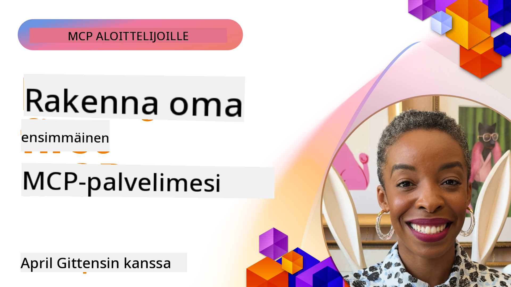

<!--
CO_OP_TRANSLATOR_METADATA:
{
  "original_hash": "1197b6dbde36773e04a5ae826557fdb9",
  "translation_date": "2025-08-26T17:55:49+00:00",
  "source_file": "03-GettingStarted/README.md",
  "language_code": "fi"
}
-->
## Aloittaminen  

_(Klikkaa yllä olevaa kuvaa nähdäksesi tämän oppitunnin videon)_

Tämä osio koostuu useista oppitunneista:

- **1 Ensimmäinen palvelimesi**, tässä ensimmäisessä oppitunnissa opit luomaan ensimmäisen palvelimesi ja tarkastelemaan sitä tarkastustyökalulla, joka on arvokas tapa testata ja debugata palvelintasi, [oppituntiin](01-first-server/README.md)

- **2 Asiakas**, tässä oppitunnissa opit kirjoittamaan asiakkaan, joka voi muodostaa yhteyden palvelimeesi, [oppituntiin](02-client/README.md)

- **3 Asiakas LLM:n kanssa**, vielä parempi tapa kirjoittaa asiakas on lisätä siihen LLM, jotta se voi "neuvotella" palvelimesi kanssa siitä, mitä tehdä, [oppituntiin](03-llm-client/README.md)

- **4 Palvelimen käyttäminen GitHub Copilot Agent -tilassa Visual Studio Codessa**. Tässä tarkastellaan MCP-palvelimen suorittamista Visual Studio Codessa, [oppituntiin](04-vscode/README.md)

- **5 stdio Transport Server** stdio-kuljetus on suositeltu standardi MCP-palvelimen ja asiakkaan väliseen viestintään nykyisessä spesifikaatiossa, tarjoten turvallisen aliprosessipohjaisen viestinnän [oppituntiin](05-stdio-server/README.md)

- **6 HTTP-suoratoisto MCP:n kanssa (Streamable HTTP)**. Opit modernista HTTP-suoratoistosta, etenemisen ilmoituksista ja siitä, kuinka toteuttaa skaalautuvia, reaaliaikaisia MCP-palvelimia ja -asiakkaita Streamable HTTP:n avulla. [oppituntiin](06-http-streaming/README.md)

- **7 AI Toolkitin hyödyntäminen VSCode:ssa** MCP-asiakkaiden ja -palvelimien testaamiseen ja käyttämiseen [oppituntiin](07-aitk/README.md)

- **8 Testaus**. Tässä keskitytään erityisesti siihen, miten palvelinta ja asiakasta voidaan testata eri tavoilla, [oppituntiin](08-testing/README.md)

- **9 Käyttöönotto**. Tässä luvussa tarkastellaan eri tapoja ottaa MCP-ratkaisut käyttöön, [oppituntiin](09-deployment/README.md)

Model Context Protocol (MCP) on avoin protokolla, joka standardoi, miten sovellukset tarjoavat kontekstia LLM:ille. Ajattele MCP:tä kuin USB-C-porttia AI-sovelluksille - se tarjoaa standardoidun tavan yhdistää AI-mallit eri tietolähteisiin ja työkaluihin.

## Oppimistavoitteet

Tämän oppitunnin lopussa osaat:

- Määrittää MCP-kehitysympäristöt C#:lle, Javalle, Pythonille, TypeScriptille ja JavaScriptille
- Rakentaa ja ottaa käyttöön perus-MCP-palvelimia mukautetuilla ominaisuuksilla (resurssit, kehotteet ja työkalut)
- Luoda isäntäsovelluksia, jotka yhdistyvät MCP-palvelimiin
- Testata ja debugata MCP-toteutuksia
- Ymmärtää yleisiä asennushaasteita ja niiden ratkaisuja
- Yhdistää MCP-toteutuksesi suosittuihin LLM-palveluihin

## MCP-ympäristön asennus

Ennen kuin aloitat MCP:n parissa työskentelyn, on tärkeää valmistella kehitysympäristösi ja ymmärtää perusprosessit. Tämä osio opastaa sinut alkuasennuksen vaiheiden läpi varmistaen sujuvan aloituksen MCP:n kanssa.

### Esivaatimukset

Ennen kuin sukellat MCP-kehitykseen, varmista, että sinulla on:

- **Kehitysympäristö**: Valitsemallesi kielelle (C#, Java, Python, TypeScript tai JavaScript)
- **IDE/editori**: Visual Studio, Visual Studio Code, IntelliJ, Eclipse, PyCharm tai mikä tahansa moderni koodieditori
- **Paketinhallintatyökalut**: NuGet, Maven/Gradle, pip tai npm/yarn
- **API-avaimet**: Kaikille AI-palveluille, joita aiot käyttää isäntäsovelluksissasi

### Viralliset SDK:t

Tulevissa luvuissa näet ratkaisuja, jotka on rakennettu Pythonilla, TypeScriptillä, Javalla ja .NET:llä. Tässä ovat kaikki virallisesti tuetut SDK:t.

MCP tarjoaa virallisia SDK:ita useille kielille:
- [C# SDK](https://github.com/modelcontextprotocol/csharp-sdk) - Ylläpidetään yhteistyössä Microsoftin kanssa
- [Java SDK](https://github.com/modelcontextprotocol/java-sdk) - Ylläpidetään yhteistyössä Spring AI:n kanssa
- [TypeScript SDK](https://github.com/modelcontextprotocol/typescript-sdk) - Virallinen TypeScript-toteutus
- [Python SDK](https://github.com/modelcontextprotocol/python-sdk) - Virallinen Python-toteutus
- [Kotlin SDK](https://github.com/modelcontextprotocol/kotlin-sdk) - Virallinen Kotlin-toteutus
- [Swift SDK](https://github.com/modelcontextprotocol/swift-sdk) - Ylläpidetään yhteistyössä Loopwork AI:n kanssa
- [Rust SDK](https://github.com/modelcontextprotocol/rust-sdk) - Virallinen Rust-toteutus

## Keskeiset huomiot

- MCP-kehitysympäristön asennus on suoraviivaista kielikohtaisten SDK:iden avulla
- MCP-palvelimien rakentaminen sisältää työkalujen luomisen ja rekisteröinnin selkeillä kaavioilla
- MCP-asiakkaat yhdistyvät palvelimiin ja malleihin hyödyntääkseen laajennettuja ominaisuuksia
- Testaus ja debuggaus ovat olennaisia luotettavien MCP-toteutusten kannalta
- Käyttöönotto voi tapahtua paikallisesta kehityksestä pilvipohjaisiin ratkaisuihin

## Harjoittelu

Meillä on joukko esimerkkejä, jotka täydentävät kaikkien tämän osion lukujen harjoituksia. Lisäksi jokaisessa luvussa on omat harjoituksensa ja tehtävänsä.

- [Java-laskin](./samples/java/calculator/README.md)
- [.Net-laskin](../../../03-GettingStarted/samples/csharp)
- [JavaScript-laskin](./samples/javascript/README.md)
- [TypeScript-laskin](./samples/typescript/README.md)
- [Python-laskin](../../../03-GettingStarted/samples/python)

## Lisäresurssit

- [Rakenna agentteja Model Context Protocolin avulla Azurella](https://learn.microsoft.com/azure/developer/ai/intro-agents-mcp)
- [Etä-MCP Azure Container Appsilla (Node.js/TypeScript/JavaScript)](https://learn.microsoft.com/samples/azure-samples/mcp-container-ts/mcp-container-ts/)
- [.NET OpenAI MCP Agent](https://learn.microsoft.com/samples/azure-samples/openai-mcp-agent-dotnet/openai-mcp-agent-dotnet/)

## Mitä seuraavaksi

Seuraavaksi: [Ensimmäisen MCP-palvelimen luominen](01-first-server/README.md)

---

**Vastuuvapauslauseke**:  
Tämä asiakirja on käännetty käyttämällä tekoälypohjaista käännöspalvelua [Co-op Translator](https://github.com/Azure/co-op-translator). Vaikka pyrimme tarkkuuteen, huomioithan, että automaattiset käännökset voivat sisältää virheitä tai epätarkkuuksia. Alkuperäinen asiakirja sen alkuperäisellä kielellä tulisi pitää ensisijaisena lähteenä. Kriittisen tiedon osalta suositellaan ammattimaista ihmiskäännöstä. Emme ole vastuussa väärinkäsityksistä tai virhetulkinnoista, jotka johtuvat tämän käännöksen käytöstä.