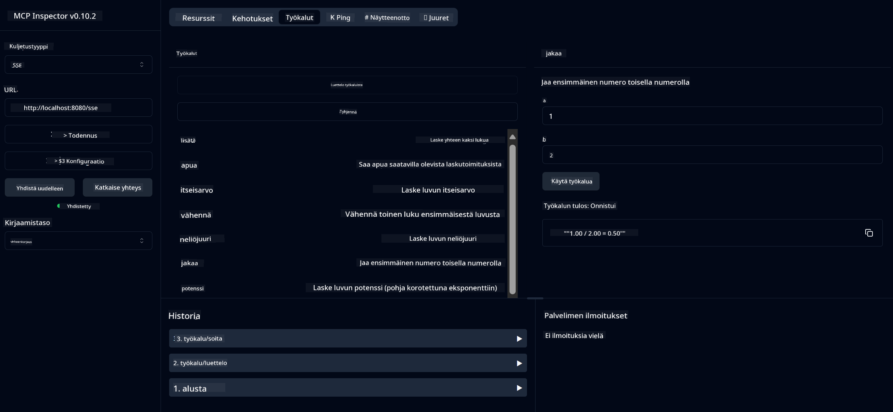

<!--
CO_OP_TRANSLATOR_METADATA:
{
  "original_hash": "13231e9951b68efd9df8c56bd5cdb27e",
  "translation_date": "2025-05-17T13:13:27+00:00",
  "source_file": "03-GettingStarted/samples/java/calculator/README.md",
  "language_code": "fi"
}
-->
# Peruslaskin MCP-palvelu

Tämä palvelu tarjoaa peruslaskutoimituksia Model Context Protocolin (MCP) kautta käyttäen Spring Bootia ja WebFlux-kuljetusta. Se on suunniteltu yksinkertaiseksi esimerkiksi aloittelijoille, jotka opettelevat MCP-toteutuksia.

Lisätietoja löytyy [MCP Server Boot Starter](https://docs.spring.io/spring-ai/reference/api/mcp/mcp-server-boot-starter-docs.html) -viitedokumentaatiosta.

## Yleiskatsaus

Palvelu esittelee:
- Tuki SSE:lle (Server-Sent Events)
- Automaattinen työkalujen rekisteröinti käyttäen Spring AI:n `@Tool`-annotaatiota
- Peruslaskutoiminnot:
  - Yhteenlasku, vähennyslasku, kertolasku, jakolasku
  - Potenssilaskenta ja neliöjuuri
  - Modulus (jakojäännös) ja itseisarvo
  - Ohjetoiminto toimintojen kuvauksille

## Ominaisuudet

Tämä laskinpalvelu tarjoaa seuraavat ominaisuudet:

1. **Peruslaskutoimitukset**:
   - Kahden luvun yhteenlasku
   - Yhden luvun vähennys toisen luvun kanssa
   - Kahden luvun kertolasku
   - Yhden luvun jakaminen toisella (nollajakotarkistus)

2. **Edistyneet laskutoimitukset**:
   - Potenssilaskenta (perusluvun korottaminen eksponenttiin)
   - Neliöjuuren laskenta (negatiivisen luvun tarkistus)
   - Modulus (jakojäännöksen) laskenta
   - Itseisarvon laskenta

3. **Ohjejärjestelmä**:
   - Sisäänrakennettu ohjetoiminto, joka selittää kaikki käytettävissä olevat toiminnot

## Palvelun käyttö

Palvelu tarjoaa seuraavat API-päätepisteet MCP-protokollan kautta:

- `add(a, b)`: Laske yhteen kaksi lukua
- `subtract(a, b)`: Vähennä toinen luku ensimmäisestä
- `multiply(a, b)`: Kerro kaksi lukua
- `divide(a, b)`: Jaa ensimmäinen luku toisella (nollatarkistus)
- `power(base, exponent)`: Laske luvun potenssi
- `squareRoot(number)`: Laske neliöjuuri (negatiivisen luvun tarkistus)
- `modulus(a, b)`: Laske jakojäännös jakamisessa
- `absolute(number)`: Laske itseisarvo
- `help()`: Hanki tietoa käytettävissä olevista toiminnoista

## Testiasiakas

Yksinkertainen testiasiakas sisältyy `com.microsoft.mcp.sample.client`-pakettiin. `SampleCalculatorClient`-luokka esittelee laskinpalvelun käytettävissä olevat toiminnot.

## LangChain4j-asiakkaan käyttö

Projekti sisältää LangChain4j-esimerkkiasiakkaan `com.microsoft.mcp.sample.client.LangChain4jClient`, joka näyttää, kuinka laskinpalvelu integroidaan LangChain4j:n ja GitHub-mallien kanssa:

### Esi vaatimukset

1. **GitHub-tokenin asetus**:
   
   Käyttääksesi GitHubin AI-malleja (kuten phi-4), tarvitset GitHubin henkilökohtaisen käyttöoikeustokenin:

   a. Siirry GitHub-tilisi asetuksiin: https://github.com/settings/tokens
   
   b. Klikkaa "Generate new token" → "Generate new token (classic)"
   
   c. Anna tokenillesi kuvaava nimi
   
   d. Valitse seuraavat oikeudet:
      - `repo` (Täysi hallinta yksityisille repositorioille)
      - `read:org` (Lue organisaation ja tiimin jäsenyys, lue organisaatioprojektit)
      - `gist` (Luo gistejä)
      - `user:email` (Käytä käyttäjän sähköpostiosoitteita (vain luku))
   
   e. Klikkaa "Generate token" ja kopioi uusi tokenisi
   
   f. Aseta se ympäristömuuttujaksi:
      
      Windowsilla:
      ```
      set GITHUB_TOKEN=your-github-token
      ```
      
      macOS/Linux:
      ```bash
      export GITHUB_TOKEN=your-github-token
      ```

   g. Pysyvässä asennuksessa lisää se ympäristömuuttujiin järjestelmäasetusten kautta

2. Lisää LangChain4j GitHub-riippuvuus projektiisi (jo mukana pom.xml-tiedostossa):
   ```xml
   <dependency>
       <groupId>dev.langchain4j</groupId>
       <artifactId>langchain4j-github</artifactId>
       <version>${langchain4j.version}</version>
   </dependency>
   ```

3. Varmista, että laskinpalvelin toimii `localhost:8080`-osoitteessa

### LangChain4j-asiakkaan suorittaminen

Tämä esimerkki esittelee:
- Yhteyden muodostamisen laskin MCP-palvelimeen SSE-kuljetuksen kautta
- LangChain4j:n käyttämisen chat-botin luomiseksi, joka hyödyntää laskinoperaatioita
- Integroinnin GitHubin AI-mallien kanssa (nyt phi-4-mallin käyttö)

Asiakas lähettää seuraavat esimerkkikyselyt toiminnallisuuden demonstroimiseksi:
1. Kahden luvun summan laskeminen
2. Luvun neliöjuuren löytäminen
3. Ohjetiedon saaminen käytettävissä olevista laskinoperaatioista

Suorita esimerkki ja tarkista konsolin tuloste nähdäksesi, kuinka AI-malli käyttää laskintyökaluja vastaamaan kyselyihin.

### GitHub-mallin konfigurointi

LangChain4j-asiakas on konfiguroitu käyttämään GitHubin phi-4-mallia seuraavilla asetuksilla:

```java
ChatLanguageModel model = GitHubChatModel.builder()
    .apiKey(System.getenv("GITHUB_TOKEN"))
    .timeout(Duration.ofSeconds(60))
    .modelName("phi-4")
    .logRequests(true)
    .logResponses(true)
    .build();
```

Käyttääksesi eri GitHub-malleja, muuta `modelName`-parametria toiseen tuettuun malliin (esim. "claude-3-haiku-20240307", "llama-3-70b-8192", jne.).

## Riippuvuudet

Projekti vaatii seuraavat keskeiset riippuvuudet:

```xml
<!-- For MCP Server -->
<dependency>
    <groupId>org.springframework.ai</groupId>
    <artifactId>spring-ai-starter-mcp-server-webflux</artifactId>
</dependency>

<!-- For LangChain4j integration -->
<dependency>
    <groupId>dev.langchain4j</groupId>
    <artifactId>langchain4j-mcp</artifactId>
    <version>${langchain4j.version}</version>
</dependency>

<!-- For GitHub models support -->
<dependency>
    <groupId>dev.langchain4j</groupId>
    <artifactId>langchain4j-github</artifactId>
    <version>${langchain4j.version}</version>
</dependency>
```

## Projektin rakentaminen

Rakenna projekti käyttäen Mavenia:
```bash
./mvnw clean install -DskipTests
```

## Palvelimen suorittaminen

### Java:n käyttö

```bash
java -jar target/calculator-server-0.0.1-SNAPSHOT.jar
```

### MCP Inspectorin käyttö

MCP Inspector on hyödyllinen työkalu vuorovaikutukseen MCP-palveluiden kanssa. Käyttääksesi sitä tämän laskinpalvelun kanssa:

1. **Asenna ja suorita MCP Inspector** uudessa pääteikkunassa:
   ```bash
   npx @modelcontextprotocol/inspector
   ```

2. **Pääset web-käyttöliittymään** klikkaamalla sovelluksen näyttämää URL-osoitetta (tyypillisesti http://localhost:6274)

3. **Konfiguroi yhteys**:
   - Aseta kuljetustyyppi "SSE":ksi
   - Aseta URL osoittamaan käynnissä olevan palvelimesi SSE-päätepisteeseen: `http://localhost:8080/sse`
   - Klikkaa "Connect"

4. **Käytä työkaluja**:
   - Klikkaa "List Tools" nähdäksesi käytettävissä olevat laskinoperaatiot
   - Valitse työkalu ja klikkaa "Run Tool" suorittaaksesi toiminnon



### Dockerin käyttö

Projekti sisältää Dockerfile-tiedoston konttien käyttöönottoa varten:

1. **Rakenna Docker-kuva**:
   ```bash
   docker build -t calculator-mcp-service .
   ```

2. **Suorita Docker-kontti**:
   ```bash
   docker run -p 8080:8080 calculator-mcp-service
   ```

Tämä:
- Rakentaa monivaiheisen Docker-kuvan Maven 3.9.9:llä ja Eclipse Temurin 24 JDK:lla
- Luo optimoidun konttikuvan
- Avaa palvelun portissa 8080
- Käynnistää MCP-laskinpalvelun kontin sisällä

Voit käyttää palvelua osoitteessa `http://localhost:8080`, kun kontti on käynnissä.

## Vianmääritys

### Yleisiä ongelmia GitHub-tokenin kanssa

1. **Tokenin käyttöoikeusongelmat**: Jos saat 403 Forbidden -virheen, tarkista, että tokenillasi on oikeat käyttöoikeudet kuten esitetyissä vaatimuksissa.

2. **Tokenia ei löydy**: Jos saat "No API key found" -virheen, varmista, että GITHUB_TOKEN-ympäristömuuttuja on asetettu oikein.

3. **Nopeusrajoitukset**: GitHubin API:lla on nopeusrajoituksia. Jos kohtaat nopeusrajoitusvirheen (statuskoodi 429), odota muutama minuutti ennen kuin yrität uudelleen.

4. **Tokenin vanhentuminen**: GitHub-tokenit voivat vanhentua. Jos saat autentikointivirheitä jonkin ajan kuluttua, luo uusi token ja päivitä ympäristömuuttujasi.

Jos tarvitset lisäapua, tarkista [LangChain4j-dokumentaatio](https://github.com/langchain4j/langchain4j) tai [GitHub API-dokumentaatio](https://docs.github.com/en/rest).

**Vastuuvapauslauseke**:  
Tämä asiakirja on käännetty käyttämällä AI-käännöspalvelua [Co-op Translator](https://github.com/Azure/co-op-translator). Vaikka pyrimme tarkkuuteen, huomioithan, että automaattiset käännökset voivat sisältää virheitä tai epätarkkuuksia. Alkuperäistä asiakirjaa sen alkuperäisellä kielellä tulisi pitää ensisijaisena lähteenä. Kriittisen tiedon kohdalla suositellaan ammattimaista ihmiskäännöstä. Emme ole vastuussa mahdollisista väärinkäsityksistä tai virhetulkinnoista, jotka johtuvat tämän käännöksen käytöstä.