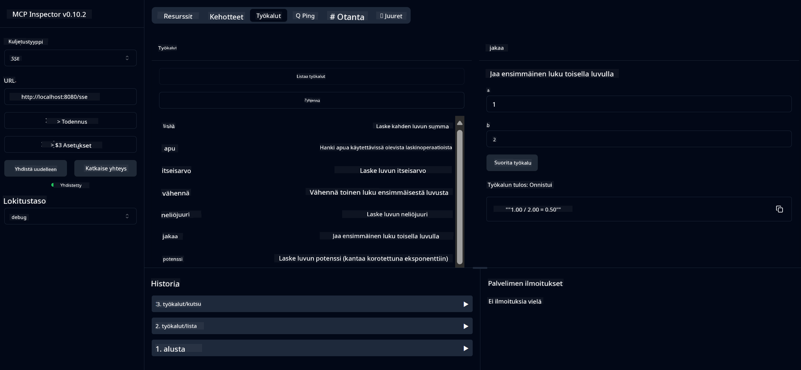

<!--
CO_OP_TRANSLATOR_METADATA:
{
  "original_hash": "13231e9951b68efd9df8c56bd5cdb27e",
  "translation_date": "2025-07-13T22:28:14+00:00",
  "source_file": "03-GettingStarted/samples/java/calculator/README.md",
  "language_code": "fi"
}
-->
# Basic Calculator MCP Service

Tämä palvelu tarjoaa peruslaskutoimituksia Model Context Protocolin (MCP) kautta käyttäen Spring Bootia ja WebFlux-siirtoa. Se on suunniteltu yksinkertaiseksi esimerkiksi aloittelijoille, jotka opettelevat MCP:n toteutuksia.

Lisätietoja löytyy [MCP Server Boot Starter](https://docs.spring.io/spring-ai/reference/api/mcp/mcp-server-boot-starter-docs.html) -viitedokumentaatiosta.

## Yleiskatsaus

Palvelu esittelee:
- Tuen SSE:lle (Server-Sent Events)
- Automaattisen työkalujen rekisteröinnin Spring AI:n `@Tool`-annotaation avulla
- Peruslaskimen toiminnot:
  - Yhteenlasku, vähennyslasku, kertolasku, jakolasku
  - Potenssilasku ja neliöjuuri
  - Jakojäännös (moduuli) ja itseisarvo
  - Ohjefunktio operaatioiden kuvauksille

## Ominaisuudet

Tämä laskinpalvelu tarjoaa seuraavat toiminnot:

1. **Peruslaskutoimitukset**:
   - Kahden luvun yhteenlasku
   - Toisen luvun vähentäminen ensimmäisestä
   - Kahden luvun kertolasku
   - Ensimmäisen luvun jakaminen toisella (nollalla jakamisen tarkistus)

2. **Edistyneet toiminnot**:
   - Potenssilasku (kannan korottaminen eksponenttiin)
   - Neliöjuuren laskeminen (negatiivisen luvun tarkistus)
   - Jakojäännöksen laskeminen
   - Itseisarvon laskeminen

3. **Ohjejärjestelmä**:
   - Sisäänrakennettu ohjefunktio, joka selittää kaikki käytettävissä olevat toiminnot

## Palvelun käyttö

Palvelu tarjoaa seuraavat API-päätepisteet MCP-protokollan kautta:

- `add(a, b)`: Laskee kahden luvun summan
- `subtract(a, b)`: Vähentää toisen luvun ensimmäisestä
- `multiply(a, b)`: Kertoo kaksi lukua
- `divide(a, b)`: Jakaa ensimmäisen luvun toisella (nollalla jakamisen tarkistus)
- `power(base, exponent)`: Laskee luvun potenssin
- `squareRoot(number)`: Laskee neliöjuuren (negatiivisen luvun tarkistus)
- `modulus(a, b)`: Laskee jakojäännöksen
- `absolute(number)`: Laskee itseisarvon
- `help()`: Hakee tietoa käytettävissä olevista toiminnoista

## Testiasiakas

Yksinkertainen testiasiakas sisältyy `com.microsoft.mcp.sample.client`-pakettiin. `SampleCalculatorClient`-luokka demonstroi laskinpalvelun käytettävissä olevia toimintoja.

## LangChain4j-asiakkaan käyttö

Projekti sisältää LangChain4j-esimerkkiasiakkaan `com.microsoft.mcp.sample.client.LangChain4jClient`-luokassa, joka näyttää, miten laskinpalvelu integroidaan LangChain4j:n ja GitHub-mallien kanssa:

### Esivaatimukset

1. **GitHub-tokenin asetus**:
   
   GitHubin AI-mallien (kuten phi-4) käyttöön tarvitset GitHubin henkilökohtaisen käyttöoikeustunnuksen:

   a. Mene GitHub-tilisi asetuksiin: https://github.com/settings/tokens
   
   b. Klikkaa "Generate new token" → "Generate new token (classic)"
   
   c. Anna tokenille kuvaava nimi
   
   d. Valitse seuraavat oikeudet:
      - `repo` (Täysi hallinta yksityisiin repositorioihin)
      - `read:org` (Lue organisaation ja tiimien jäsenyydet, lue organisaation projektit)
      - `gist` (Luo gistejä)
      - `user:email` (Käyttäjän sähköpostiosoitteiden luku (vain luku))
   
   e. Klikkaa "Generate token" ja kopioi uusi token
   
   f. Aseta se ympäristömuuttujaksi:
      
      Windowsilla:
      ```
      set GITHUB_TOKEN=your-github-token
      ```
      
      macOS/Linuxilla:
      ```bash
      export GITHUB_TOKEN=your-github-token
      ```

   g. Pysyväksi asetukseksi lisää se järjestelmän ympäristömuuttujiin

2. Lisää LangChain4j GitHub-riippuvuus projektiisi (sisältyy jo pom.xml:ään):
   ```xml
   <dependency>
       <groupId>dev.langchain4j</groupId>
       <artifactId>langchain4j-github</artifactId>
       <version>${langchain4j.version}</version>
   </dependency>
   ```

3. Varmista, että laskinpalvelin on käynnissä osoitteessa `localhost:8080`

### LangChain4j-asiakkaan ajaminen

Tämä esimerkki näyttää:
- Yhteyden muodostamisen laskimen MCP-palvelimeen SSE-siirron kautta
- LangChain4j:n käytön chat-botin luomiseen, joka hyödyntää laskimen toimintoja
- Integroinnin GitHubin AI-malleihin (käytössä phi-4-malli)

Asiakas lähettää seuraavat esimerkkikyselyt demonstroidakseen toiminnallisuutta:
1. Kahden luvun summan laskeminen
2. Neliöjuuren laskeminen
3. Ohjetiedon hakeminen käytettävissä olevista laskinoperaatioista

Aja esimerkki ja tarkista konsolin tuloste nähdäksesi, miten AI-malli käyttää laskintyökaluja vastatakseen kyselyihin.

### GitHub-mallin konfigurointi

LangChain4j-asiakas on konfiguroitu käyttämään GitHubin phi-4-mallia seuraavilla asetuksilla:

```java
ChatLanguageModel model = GitHubChatModel.builder()
    .apiKey(System.getenv("GITHUB_TOKEN"))
    .timeout(Duration.ofSeconds(60))
    .modelName("phi-4")
    .logRequests(true)
    .logResponses(true)
    .build();
```

Jos haluat käyttää muita GitHub-malleja, vaihda `modelName`-parametri toiseen tuettuun malliin (esim. "claude-3-haiku-20240307", "llama-3-70b-8192" jne.).

## Riippuvuudet

Projekti vaatii seuraavat keskeiset riippuvuudet:

```xml
<!-- For MCP Server -->
<dependency>
    <groupId>org.springframework.ai</groupId>
    <artifactId>spring-ai-starter-mcp-server-webflux</artifactId>
</dependency>

<!-- For LangChain4j integration -->
<dependency>
    <groupId>dev.langchain4j</groupId>
    <artifactId>langchain4j-mcp</artifactId>
    <version>${langchain4j.version}</version>
</dependency>

<!-- For GitHub models support -->
<dependency>
    <groupId>dev.langchain4j</groupId>
    <artifactId>langchain4j-github</artifactId>
    <version>${langchain4j.version}</version>
</dependency>
```

## Projektin rakentaminen

Rakenna projekti Mavenilla:
```bash
./mvnw clean install -DskipTests
```

## Palvelimen käynnistäminen

### Javaa käyttäen

```bash
java -jar target/calculator-server-0.0.1-SNAPSHOT.jar
```

### MCP Inspectorin käyttö

MCP Inspector on hyödyllinen työkalu MCP-palveluiden kanssa työskentelyyn. Käyttääksesi sitä tämän laskinpalvelun kanssa:

1. **Asenna ja käynnistä MCP Inspector** uudessa terminaalissa:
   ```bash
   npx @modelcontextprotocol/inspector
   ```

2. **Avaa web-käyttöliittymä** klikkaamalla sovelluksen näyttämää URL-osoitetta (yleensä http://localhost:6274)

3. **Määritä yhteys**:
   - Aseta siirtotavaksi "SSE"
   - Aseta URL palvelimesi SSE-päätepisteeseen: `http://localhost:8080/sse`
   - Klikkaa "Connect"

4. **Käytä työkaluja**:
   - Klikkaa "List Tools" nähdäksesi käytettävissä olevat laskinoperaatiot
   - Valitse työkalu ja klikkaa "Run Tool" suorittaaksesi operaation



### Dockerin käyttö

Projekti sisältää Dockerfile-tiedoston konttikäyttöä varten:

1. **Rakenna Docker-kuva**:
   ```bash
   docker build -t calculator-mcp-service .
   ```

2. **Käynnistä Docker-kontti**:
   ```bash
   docker run -p 8080:8080 calculator-mcp-service
   ```

Tämä:
- Rakentaa monivaiheisen Docker-kuvan Maven 3.9.9:llä ja Eclipse Temurin 24 JDK:lla
- Luo optimoidun konttikuvan
- Avauttaa palvelun portissa 8080
- Käynnistää MCP-laskinpalvelun kontissa

Palveluun pääsee käsiksi osoitteessa `http://localhost:8080` kun kontti on käynnissä.

## Vianetsintä

### Yleisiä ongelmia GitHub-tokenin kanssa

1. **Tokenin oikeusongelmat**: Jos saat 403 Forbidden -virheen, tarkista, että tokenilla on oikeat oikeudet kuten esivaatimuksissa on kuvattu.

2. **Tokenia ei löydy**: Jos saat "No API key found" -virheen, varmista, että GITHUB_TOKEN-ympäristömuuttuja on asetettu oikein.

3. **Käyttörajoitukset**: GitHub API:lla on käyttörajoituksia. Jos kohtaat rajoitusvirheen (statuskoodi 429), odota muutama minuutti ennen uudelleenyritystä.

4. **Tokenin vanhentuminen**: GitHub-tokenit voivat vanhentua. Jos saat autentikointivirheitä ajan myötä, luo uusi token ja päivitä ympäristömuuttuja.

Jos tarvitset lisäapua, tutustu [LangChain4j-dokumentaatioon](https://github.com/langchain4j/langchain4j) tai [GitHub API -dokumentaatioon](https://docs.github.com/en/rest).

**Vastuuvapauslauseke**:  
Tämä asiakirja on käännetty käyttämällä tekoälypohjaista käännöspalvelua [Co-op Translator](https://github.com/Azure/co-op-translator). Vaikka pyrimme tarkkuuteen, huomioithan, että automaattikäännöksissä saattaa esiintyä virheitä tai epätarkkuuksia. Alkuperäistä asiakirjaa sen alkuperäiskielellä tulee pitää virallisena lähteenä. Tärkeissä tiedoissa suositellaan ammattimaista ihmiskäännöstä. Emme ole vastuussa tämän käännöksen käytöstä aiheutuvista väärinymmärryksistä tai tulkinnoista.