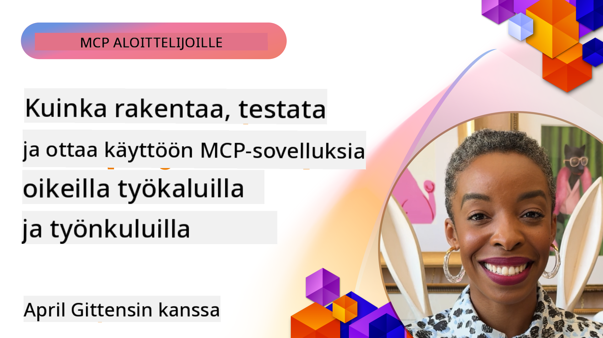
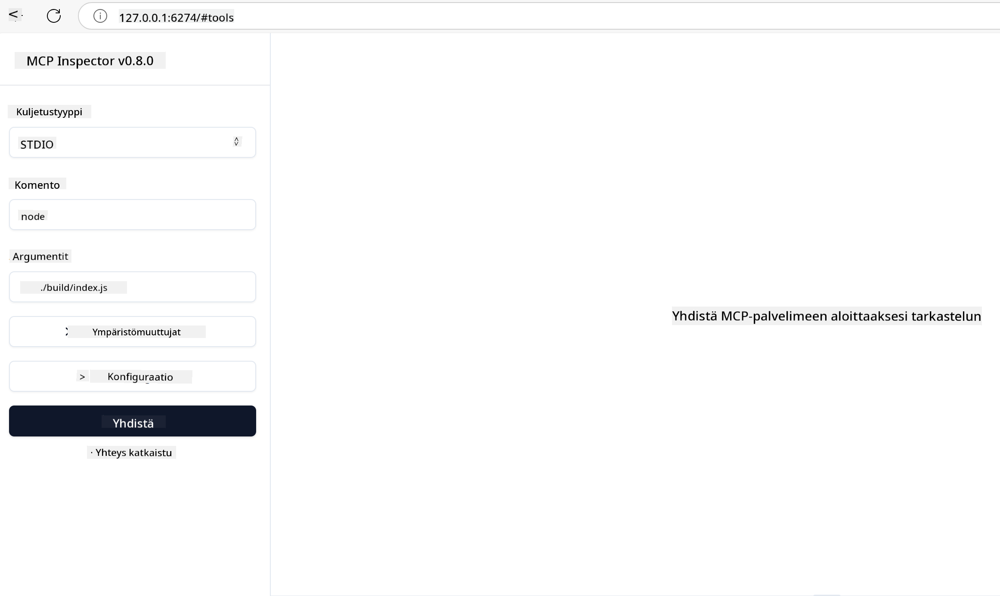

<!--
CO_OP_TRANSLATOR_METADATA:
{
  "original_hash": "83efa75a69bc831277263a6f1ae53669",
  "translation_date": "2025-08-18T16:02:30+00:00",
  "source_file": "04-PracticalImplementation/README.md",
  "language_code": "fi"
}
-->
# Käytännön Toteutus

[](https://youtu.be/vCN9-mKBDfQ)

_(Klikkaa yllä olevaa kuvaa katsoaksesi tämän oppitunnin video)_

Käytännön toteutus on se vaihe, jossa Model Context Protocolin (MCP) voima tulee konkreettiseksi. Vaikka MCP:n teorian ja arkkitehtuurin ymmärtäminen on tärkeää, todellinen arvo syntyy, kun sovellat näitä käsitteitä rakentaaksesi, testataksesi ja käyttöönottaaksesi ratkaisuja, jotka ratkaisevat todellisia ongelmia. Tämä luku yhdistää käsitteellisen tiedon ja käytännön kehityksen, opastaen sinua MCP-pohjaisten sovellusten toteuttamisessa.

Olitpa kehittämässä älykkäitä assistentteja, integroimassa tekoälyä liiketoimintaprosesseihin tai rakentamassa räätälöityjä työkaluja datan käsittelyyn, MCP tarjoaa joustavan perustan. Sen kieliriippumaton suunnittelu ja viralliset SDK:t suosituimmille ohjelmointikielille tekevät siitä helposti lähestyttävän monille kehittäjille. Näiden SDK:iden avulla voit nopeasti prototypoida, iteroida ja laajentaa ratkaisuja eri alustoilla ja ympäristöissä.

Seuraavissa osioissa löydät käytännön esimerkkejä, esimerkkikoodia ja käyttöönotto-strategioita, jotka osoittavat, kuinka MCP:tä toteutetaan C#:ssa, Javassa Springin kanssa, TypeScriptissä, JavaScriptissä ja Pythonissa. Opit myös, kuinka debugata ja testata MCP-palvelimia, hallita API:ta ja ottaa ratkaisuja käyttöön pilvessä Azuren avulla. Nämä käytännön resurssit on suunniteltu nopeuttamaan oppimistasi ja auttamaan sinua rakentamaan luotettavia, tuotantovalmiita MCP-sovelluksia.

## Yleiskatsaus

Tämä oppitunti keskittyy MCP:n käytännön toteutukseen useilla ohjelmointikielillä. Tutkimme, kuinka käyttää MCP SDK:ita C#:ssa, Javassa Springin kanssa, TypeScriptissä, JavaScriptissä ja Pythonissa rakentaaksemme kestäviä sovelluksia, debugataksemme ja testataksemme MCP-palvelimia sekä luodaksemme uudelleenkäytettäviä resursseja, kehotteita ja työkaluja.

## Oppimistavoitteet

Tämän oppitunnin lopussa osaat:

- Toteuttaa MCP-ratkaisuja virallisten SDK:iden avulla eri ohjelmointikielillä
- Debugata ja testata MCP-palvelimia järjestelmällisesti
- Luoda ja käyttää palvelimen ominaisuuksia (Resurssit, Kehotteet ja Työkalut)
- Suunnitella tehokkaita MCP-työnkulkuja monimutkaisiin tehtäviin
- Optimoida MCP-toteutuksia suorituskyvyn ja luotettavuuden parantamiseksi

## Viralliset SDK-resurssit

Model Context Protocol tarjoaa viralliset SDK:t useille kielille:

- [C# SDK](https://github.com/modelcontextprotocol/csharp-sdk)
- [Java Springin kanssa SDK](https://github.com/modelcontextprotocol/java-sdk) **Huom:** vaatii riippuvuuden [Project Reactor](https://projectreactor.io). (Katso [keskustelu aiheesta 246](https://github.com/orgs/modelcontextprotocol/discussions/246).)
- [TypeScript SDK](https://github.com/modelcontextprotocol/typescript-sdk)
- [Python SDK](https://github.com/modelcontextprotocol/python-sdk)
- [Kotlin SDK](https://github.com/modelcontextprotocol/kotlin-sdk)

## Työskentely MCP SDK:iden kanssa

Tässä osiossa esitellään käytännön esimerkkejä MCP:n toteutuksesta useilla ohjelmointikielillä. Löydät esimerkkikoodia `samples`-hakemistosta, joka on järjestetty kielen mukaan.

### Saatavilla olevat esimerkit

Tietovarasto sisältää [esimerkkitoteutuksia](../../../04-PracticalImplementation/samples) seuraavilla kielillä:

- [C#](./samples/csharp/README.md)
- [Java Springin kanssa](./samples/java/containerapp/README.md)
- [TypeScript](./samples/typescript/README.md)
- [JavaScript](./samples/javascript/README.md)
- [Python](./samples/python/README.md)

Jokainen esimerkki havainnollistaa keskeisiä MCP-käsitteitä ja toteutusmalleja kyseiselle kielelle ja ekosysteemille.

## Palvelimen ydintoiminnot

MCP-palvelimet voivat toteuttaa minkä tahansa yhdistelmän seuraavista ominaisuuksista:

### Resurssit

Resurssit tarjoavat kontekstia ja dataa käyttäjän tai tekoälymallin käyttöön:

- Dokumenttivarastot
- Tietopankit
- Rakenteelliset tietolähteet
- Tiedostojärjestelmät

### Kehotteet

Kehotteet ovat mallipohjaisia viestejä ja työnkulkuja käyttäjille:

- Ennalta määritellyt keskustelumallit
- Ohjatut vuorovaikutusmallit
- Erikoistuneet dialogirakenteet

### Työkalut

Työkalut ovat funktioita, joita tekoälymalli voi suorittaa:

- Datan käsittelytyökalut
- Ulkoiset API-integraatiot
- Laskentakyvykkyydet
- Hakutoiminnot

## Esimerkkitoteutukset: C#-toteutus

Virallinen C# SDK -tietovarasto sisältää useita esimerkkitoteutuksia, jotka havainnollistavat MCP:n eri osa-alueita:

- **Perus MCP-asiakas**: Yksinkertainen esimerkki MCP-asiakkaan luomisesta ja työkalujen kutsumisesta
- **Perus MCP-palvelin**: Minimaalinen palvelintoteutus, jossa on perus työkalurekisteröinti
- **Edistynyt MCP-palvelin**: Täysimittainen palvelin, jossa on työkalurekisteröinti, autentikointi ja virheenkäsittely
- **ASP.NET-integraatio**: Esimerkkejä integraatiosta ASP.NET Coren kanssa
- **Työkalutoteutusmallit**: Erilaisia malleja työkalujen toteuttamiseen eri monimutkaisuustasoilla

C# MCP SDK on esikatseluvaiheessa, ja API:t voivat muuttua. Päivitämme tätä blogia jatkuvasti SDK:n kehittyessä.

### Keskeiset ominaisuudet

- [C# MCP Nuget ModelContextProtocol](https://www.nuget.org/packages/ModelContextProtocol)
- Ensimmäisen [MCP-palvelimen rakentaminen](https://devblogs.microsoft.com/dotnet/build-a-model-context-protocol-mcp-server-in-csharp/).

Täydelliset C#-toteutusesimerkit löydät [virallisesta C# SDK -esimerkkitietovarastosta](https://github.com/modelcontextprotocol/csharp-sdk).

## Esimerkkitoteutus: Java Springin kanssa

Java Springin kanssa SDK tarjoaa vankkoja MCP-toteutusvaihtoehtoja yritystason ominaisuuksilla.

### Keskeiset ominaisuudet

- Spring Framework -integraatio
- Vahva tyyppiturvallisuus
- Reaktiivisen ohjelmoinnin tuki
- Kattava virheenkäsittely

Täydellinen Java Springin kanssa -toteutusesimerkki löytyy [Java Spring -esimerkistä](samples/java/containerapp/README.md) näytehakemistossa.

## Esimerkkitoteutus: JavaScript-toteutus

JavaScript SDK tarjoaa kevyen ja joustavan lähestymistavan MCP-toteutukseen.

### Keskeiset ominaisuudet

- Node.js- ja selainympäristöjen tuki
- Promise-pohjainen API
- Helppo integraatio Expressin ja muiden kehysten kanssa
- WebSocket-tuki suoratoistoon

Täydellinen JavaScript-toteutusesimerkki löytyy [JavaScript-esimerkistä](samples/javascript/README.md) näytehakemistossa.

## Esimerkkitoteutus: Python-toteutus

Python SDK tarjoaa Python-tyylisen lähestymistavan MCP-toteutukseen erinomaisilla ML-kehysten integraatioilla.

### Keskeiset ominaisuudet

- Async/await-tuki asyncio:n avulla
- FastAPI-integraatio
- Yksinkertainen työkalurekisteröinti
- Luontainen integraatio suosittuihin ML-kirjastoihin

Täydellinen Python-toteutusesimerkki löytyy [Python-esimerkistä](samples/python/README.md) näytehakemistossa.

## API-hallinta

Azure API Management on erinomainen ratkaisu MCP-palvelimien suojaamiseen. Ajatuksena on sijoittaa Azure API Management -instanssi MCP-palvelimen eteen ja antaa sen hoitaa ominaisuuksia, joita todennäköisesti tarvitset, kuten:

- nopeusrajoitukset
- token-hallinta
- monitorointi
- kuormantasapainotus
- turvallisuus

### Azure-esimerkki

Tässä on Azure-esimerkki, joka tekee juuri tämän, eli [luo MCP-palvelimen ja suojaa sen Azure API Managementilla](https://github.com/Azure-Samples/remote-mcp-apim-functions-python).

Katso, miten valtuutusprosessi tapahtuu alla olevassa kuvassa:


Edellä olevassa kuvassa tapahtuu seuraavaa:

- Autentikointi/valtuutus tapahtuu Microsoft Entralla.
- Azure API Management toimii yhdyskäytävänä ja käyttää käytäntöjä liikenteen ohjaamiseen ja hallintaan.
- Azure Monitor kirjaa kaikki pyynnöt jatkoanalyysiä varten.

#### Valtuutusprosessi

Tarkastellaan valtuutusprosessia tarkemmin:


#### MCP-valtuutusmäärittely

Lue lisää [MCP-valtuutusmäärittelystä](https://modelcontextprotocol.io/specification/2025-03-26/basic/authorization#2-10-third-party-authorization-flow).

## Etä-MCP-palvelimen käyttöönotto Azureen

Katsotaan, voimmeko ottaa aiemmin mainitun esimerkin käyttöön:

1. Kloonaa tietovarasto

    ```bash
    git clone https://github.com/Azure-Samples/remote-mcp-apim-functions-python.git
    cd remote-mcp-apim-functions-python
    ```

1. Rekisteröi `Microsoft.App`-resurssitarjoaja.

   - Jos käytät Azure CLI:tä, suorita `az provider register --namespace Microsoft.App --wait`.
   - Jos käytät Azure PowerShelliä, suorita `Register-AzResourceProvider -ProviderNamespace Microsoft.App`. Suorita sitten `(Get-AzResourceProvider -ProviderNamespace Microsoft.App).RegistrationState` jonkin ajan kuluttua tarkistaaksesi, onko rekisteröinti valmis.

1. Suorita tämä [azd](https://aka.ms/azd)-komento provisioidaksesi API-hallintapalvelun, funktiosovelluksen (koodilla) ja kaikki muut tarvittavat Azure-resurssit:

    ```shell
    azd up
    ```

    Tämä komento ottaa kaikki pilviresurssit käyttöön Azuren kautta.

### Palvelimen testaaminen MCP Inspectorilla

1. Avaa **uusi komentorivi-ikkuna**, asenna ja suorita MCP Inspector

    ```shell
    npx @modelcontextprotocol/inspector
    ```

    Sinun pitäisi nähdä käyttöliittymä, joka näyttää tältä:

    

1. CTRL-klikkaa ladataksesi MCP Inspector -verkkosovellus sovelluksen näyttämästä URL-osoitteesta (esim. [http://127.0.0.1:6274/#resources](http://127.0.0.1:6274/#resources)).
1. Aseta kuljetustyypiksi `SSE`.
1. Aseta URL-osoitteeksi API Management SSE -päätepisteesi, joka näkyy `azd up` -komennon jälkeen, ja **Yhdistä**:

    ```shell
    https://<apim-servicename-from-azd-output>.azure-api.net/mcp/sse
    ```

1. **Listaa työkalut**. Klikkaa työkalua ja **Suorita työkalu**.

Jos kaikki vaiheet ovat onnistuneet, sinun pitäisi nyt olla yhteydessä MCP-palvelimeen ja pystyä kutsumaan työkalua.

## MCP-palvelimet Azurelle

[Remote-mcp-functions](https://github.com/Azure-Samples/remote-mcp-functions-dotnet): Tämä tietovarasto tarjoaa nopean aloituspohjan MCP-palvelimien rakentamiseen ja käyttöönottoon Azure Functionsin avulla Pythonilla, C# .NET:llä tai Node/TypeScriptillä.

Näytteet tarjoavat täydellisen ratkaisun, joka mahdollistaa kehittäjille:

- Paikallisen kehityksen ja ajon: Kehitä ja debugaa MCP-palvelinta paikallisella koneella.
- Käyttöönoton Azureen: Ota helposti käyttöön pilvessä yksinkertaisella `azd up` -komennolla.
- Yhteyden asiakkaista: Yhdistä MCP-palvelimeen eri asiakkaista, mukaan lukien VS Coden Copilot-agenttitila ja MCP Inspector -työkalu.

### Keskeiset ominaisuudet

- Turvallisuus suunnittelussa: MCP-palvelin on suojattu avaimilla ja HTTPS:llä.
- Autentikointivaihtoehdot: Tukee OAuthia sisäänrakennetun autentikoinnin ja/tai API Managementin avulla.
- Verkkoyksityisyys: Mahdollistaa verkkoyksityisyyden Azure Virtual Networksin (VNET) avulla.
- Palveluton arkkitehtuuri: Hyödyntää Azure Functionsia skaalautuvaan, tapahtumapohjaiseen suorittamiseen.
- Paikallinen kehitys: Kattava paikallisen kehityksen ja debuggaamisen tuki.
- Yksinkertainen käyttöönotto: Virtaviivainen käyttöönotto Azureen.

Tietovarasto sisältää kaikki tarvittavat konfiguraatiotiedostot, lähdekoodin ja infrastruktuurimäärittelyt, jotta voit nopeasti aloittaa tuotantovalmiin MCP-palvelimen toteutuksen.

- [Azure Remote MCP Functions Python](https://github.com/Azure-Samples/remote-mcp-functions-python) - Esimerkkitoteutus MCP:stä Azure Functionsin avulla Pythonilla.

- [Azure Remote MCP Functions .NET](https://github.com/Azure-Samples/remote-mcp-functions-dotnet) - Esimerkkitoteutus MCP:stä Azure Functionsin avulla C# .NET:llä.

- [Azure Remote MCP Functions Node/Typescript](https://github.com/Azure-Samples/remote-mcp-functions-typescript) - Esimerkkitoteutus MCP:stä Azure Functionsin avulla Node/TypeScriptillä.

## Keskeiset Opit

- MCP SDK:t tarjoavat kielikohtaisia työkaluja kestävien MCP-ratkaisujen toteuttamiseen.
- Debuggaus ja testaus ovat kriittisiä luotettavien MCP-sovellusten kannalta.
- Uudelleenkäytettävät kehotemallit mahdollistavat johdonmukaiset tekoälyvuorovaikutukset.
- Hyvin suunnitellut työnkulut voivat orkestroida monimutkaisia tehtäviä useiden työkalujen avulla.
- MCP-ratkaisujen toteuttaminen vaatii turvallisuuden, suorituskyvyn ja virheenkäsittelyn huomioimista.

## Harjoitus

Suunnittele käytännön MCP-työnkulku, joka ratkaisee todellisen ongelman omalla alallasi:

1. Tunnista 3-4 työkalua, jotka olisivat hyödyllisiä ongelman ratkaisemiseksi.
2. Luo työnkulun kaavio, joka näyttää, miten nämä työkalut vuorovaikuttavat.
3. Toteuta yksi työkaluista perusversiolla valitsemallasi kielellä.
4. Luo kehotemalli, joka auttaa mallia käyttämään työkalua tehokkaasti.

## Lisäresurssit

---

Seuraavaksi: [Edistyneet aiheet](../05-AdvancedTopics/README.md)

**Vastuuvapauslauseke**:  
Tämä asiakirja on käännetty käyttämällä tekoälypohjaista käännöspalvelua [Co-op Translator](https://github.com/Azure/co-op-translator). Vaikka pyrimme tarkkuuteen, huomioithan, että automaattiset käännökset voivat sisältää virheitä tai epätarkkuuksia. Alkuperäinen asiakirja sen alkuperäisellä kielellä tulisi pitää ensisijaisena lähteenä. Kriittisen tiedon osalta suositellaan ammattimaista ihmiskäännöstä. Emme ole vastuussa väärinkäsityksistä tai virhetulkinnoista, jotka johtuvat tämän käännöksen käytöstä.