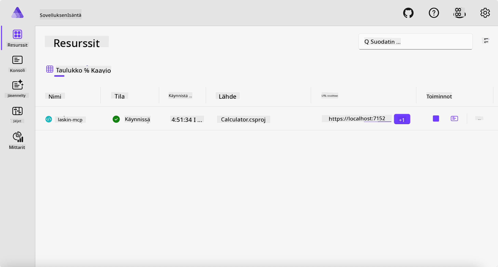
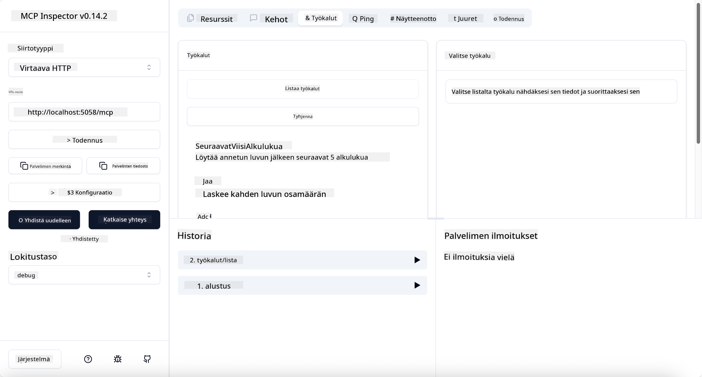

<!--
CO_OP_TRANSLATOR_METADATA:
{
  "original_hash": "0bc7bd48f55f1565f1d95ccb2c16f728",
  "translation_date": "2025-07-13T23:07:51+00:00",
  "source_file": "04-PracticalImplementation/samples/csharp/README.md",
  "language_code": "fi"
}
-->
# Esimerkki

Edellinen esimerkki näyttää, miten paikallista .NET-projektia käytetään `stdio`-tyypin kanssa. Ja miten palvelin ajetaan paikallisesti kontissa. Tämä on hyvä ratkaisu monissa tilanteissa. Kuitenkin voi olla hyödyllistä, että palvelin toimii etänä, esimerkiksi pilviympäristössä. Tässä kohtaa `http`-tyyppi tulee mukaan.

Kun katsot ratkaisua kansiossa `04-PracticalImplementation`, se saattaa vaikuttaa paljon monimutkaisemmalta kuin edellinen. Mutta todellisuudessa se ei ole. Jos tarkastelet projektia `src/Calculator`, huomaat, että se on pääosin samaa koodia kuin edellisessä esimerkissä. Ainoa ero on, että käytämme eri kirjastoa `ModelContextProtocol.AspNetCore` HTTP-pyyntöjen käsittelyyn. Lisäksi muutamme metodin `IsPrime` yksityiseksi, vain osoittaaksemme, että koodissasi voi olla yksityisiä metodeja. Muut koodit ovat samat kuin aiemmin.

Muut projektit ovat [.NET Aspire](https://learn.microsoft.com/dotnet/aspire/get-started/aspire-overview) -hankkeesta. .NET Aspire ratkaisussa parantaa kehittäjän kokemusta kehityksen ja testauksen aikana sekä auttaa havainnoinnissa. Se ei ole pakollinen palvelimen ajamiseen, mutta on hyvä käytäntö sisällyttää se ratkaisuusi.

## Käynnistä palvelin paikallisesti

1. Siirry VS Codessa (C# DevKit -laajennuksen kanssa) kansioon `04-PracticalImplementation/samples/csharp`.
1. Suorita seuraava komento käynnistääksesi palvelimen:

   ```bash
    dotnet watch run --project ./src/AppHost
   ```

1. Kun selain avaa .NET Aspire -hallintapaneelin, huomaa `http`-URL-osoite. Sen pitäisi olla jotain muotoa `http://localhost:5058/`.

   

## Testaa Streamable HTTP MCP Inspectorilla

Jos sinulla on Node.js versiosta 22.7.5 tai uudempi, voit käyttää MCP Inspectoria palvelimesi testaamiseen.

Käynnistä palvelin ja suorita seuraava komento terminaalissa:

```bash
npx @modelcontextprotocol/inspector http://localhost:5058
```



- Valitse kuljetustyypiksi `Streamable HTTP`.
- Syötä Url-kenttään aiemmin noteerattu palvelimen URL ja lisää perään `/mcp`. Sen tulee olla `http` (ei `https`), esimerkiksi `http://localhost:5058/mcp`.
- Valitse Connect-painike.

Inspectorin hyvä puoli on, että se tarjoaa hyvän näkyvyyden tapahtumiin.

- Kokeile listata saatavilla olevat työkalut
- Kokeile joitakin niistä, niiden pitäisi toimia kuten ennenkin.

## Testaa MCP-palvelinta GitHub Copilot Chatissa VS Codessa

Käyttääksesi Streamable HTTP -kuljetusta GitHub Copilot Chatin kanssa, muuta aiemmin luodun `calc-mcp`-palvelimen asetukset näyttämään tältä:

```jsonc
// .vscode/mcp.json
{
  "servers": {
    "calc-mcp": {
      "type": "http",
      "url": "http://localhost:5058/mcp"
    }
  }
}
```

Tee muutama testi:

- Kysy "3 alkulukua luvun 6780 jälkeen". Huomaa, että Copilot käyttää uusia työkaluja `NextFivePrimeNumbers` ja palauttaa vain kolme ensimmäistä alkulukua.
- Kysy "7 alkulukua luvun 111 jälkeen" nähdäksesi, mitä tapahtuu.
- Kysy "Johnilla on 24 karamellia ja hän haluaa jakaa ne tasan kolmelle lapselleen. Kuinka monta karamellia kukin lapsi saa?", nähdäksesi, mitä tapahtuu.

## Ota palvelin käyttöön Azureen

Otetaan palvelin käyttöön Azureen, jotta useammat ihmiset voivat käyttää sitä.

Siirry terminaalissa kansioon `04-PracticalImplementation/samples/csharp` ja suorita seuraava komento:

```bash
azd up
```

Kun käyttöönotto on valmis, näet viestin, joka näyttää tältä:


Ota URL talteen ja käytä sitä MCP Inspectorissa ja GitHub Copilot Chatissa.

```jsonc
// .vscode/mcp.json
{
  "servers": {
    "calc-mcp": {
      "type": "http",
      "url": "https://calc-mcp.gentleriver-3977fbcf.australiaeast.azurecontainerapps.io/mcp"
    }
  }
}
```

## Mitä seuraavaksi?

Kokeilemme erilaisia kuljetustyyppejä ja testausvälineitä. Otamme myös MCP-palvelimesi käyttöön Azureen. Mutta entä jos palvelimemme tarvitsee pääsyn yksityisiin resursseihin? Esimerkiksi tietokantaan tai yksityiseen API:in? Seuraavassa luvussa näemme, miten voimme parantaa palvelimemme turvallisuutta.

**Vastuuvapauslauseke**:  
Tämä asiakirja on käännetty käyttämällä tekoälypohjaista käännöspalvelua [Co-op Translator](https://github.com/Azure/co-op-translator). Vaikka pyrimme tarkkuuteen, huomioithan, että automaattikäännöksissä saattaa esiintyä virheitä tai epätarkkuuksia. Alkuperäistä asiakirjaa sen alkuperäiskielellä tulee pitää virallisena lähteenä. Tärkeissä tiedoissa suositellaan ammattimaista ihmiskäännöstä. Emme ole vastuussa tämän käännöksen käytöstä aiheutuvista väärinymmärryksistä tai tulkinnoista.