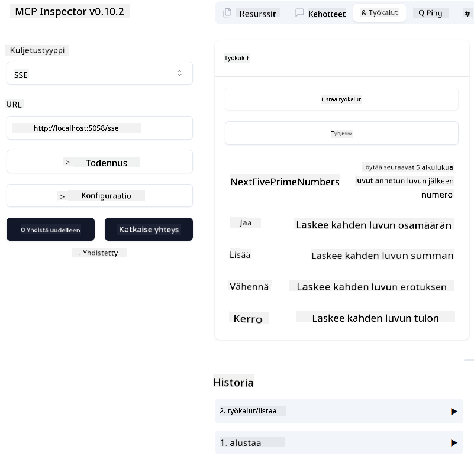
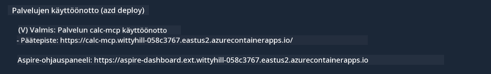

<!--
CO_OP_TRANSLATOR_METADATA:
{
  "original_hash": "5020a3e1a1c7f30c00f9e37f1fa208e3",
  "translation_date": "2025-05-17T14:09:50+00:00",
  "source_file": "04-PracticalImplementation/samples/csharp/README.md",
  "language_code": "fi"
}
-->
# Esimerkki

Edellinen esimerkki näyttää, kuinka käyttää paikallista .NET-projektia `sdio`-tyypin kanssa. Ja kuinka ajaa palvelinta paikallisesti kontissa. Tämä on hyvä ratkaisu monissa tilanteissa. Kuitenkin voi olla hyödyllistä, että palvelin toimii etänä, kuten pilviympäristössä. Tässä kohtaa `http`-tyyppi tulee mukaan.

Kun tarkastelet ratkaisua `04-PracticalImplementation`-kansiossa, se voi näyttää paljon monimutkaisemmalta kuin edellinen. Mutta todellisuudessa se ei ole. Jos katsot tarkasti projektia `src/mcpserver/mcpserver.csproj`, huomaat, että se on enimmäkseen samaa koodia kuin edellisessä esimerkissä. Ainoa ero on, että käytämme eri kirjastoa `ModelContextProtocol.AspNetCore` käsittelemään HTTP-pyyntöjä. Ja muutamme metodin `IsPrime` yksityiseksi, vain näyttääksemme, että voit käyttää yksityisiä metodeja koodissasi. Loput koodista on samaa kuin aiemmin.

Muut projektit ovat [.NET Aspire](https://learn.microsoft.com/dotnet/aspire/get-started/aspire-overview)-sivustolta. .NET Aspiren sisällyttäminen ratkaisuun parantaa kehittäjän kokemusta kehittäessä ja testatessa sekä auttaa havaittavuudessa. Se ei ole välttämätön palvelimen ajamiseksi, mutta on hyvä käytäntö sisällyttää se ratkaisuusi.

## Käynnistä palvelin paikallisesti

1. VS Code:ssa (C# DevKit -laajennuksella), avaa ratkaisu `04-PracticalImplementation\samples\csharp\src\Calculator-chap4.sln`.
2. Paina `F5` käynnistääksesi palvelimen. Sen pitäisi avata verkkoselain .NET Aspire -kojelautaan.

tai

1. Päätteessä, siirry kansioon `04-PracticalImplementation\samples\csharp\src`
2. Suorita seuraava komento käynnistääksesi palvelimen:
   ```bash
    dotnet run --project .\AppHost
   ```

3. Kojelaudasta, huomaa `http` URL. Sen pitäisi olla jotain kuten `http://localhost:5058/`.

## Test `SSE` ModelContext Protocol Inspectorin kanssa.

Jos sinulla on Node.js 22.7.5 tai uudempi, voit käyttää ModelContext Protocol Inspectoria testataksesi palvelinta.

Käynnistä palvelin ja suorita seuraava komento päätteessä:

```bash
npx @modelcontextprotocol/inspector@latest
```



- Valitse `SSE` as the Transport type. SSE stand for Server-Sent Events. 
- In the Url field, enter the URL of the server noted earlier,and append `/sse`. Sen pitäisi olla `http` (ei `https`) something like `http://localhost:5058/sse`.
- select the Connect button.

A nice thing about the Inspector is that it provide a nice visibility on what is happening.

- Try listing the availables tools
- Try some of them, it should works just like before.


## Test `SSE` with Github Copilot Chat in VS Code

To use the `SSE` transport with Github Copilot Chat, change the configuration of the `mcp-calc` aiemmin luotu palvelin näyttääkseen tältä:

```json
"mcp-calc": {
    "type": "sse",
    "url": "http://localhost:5058/sse"
}
```

Tee joitain testejä:
- Kysy 3 alkulukua luvun 6780 jälkeen. Huomaa, kuinka Copilot käyttää uusia työkaluja `NextFivePrimeNumbers` ja palauttaa vain ensimmäiset 3 alkulukua.
- Kysy 7 alkulukua luvun 111 jälkeen nähdäksesi, mitä tapahtuu.

# Palvelimen käyttöönotto Azureen

Otetaan palvelin käyttöön Azuren avulla, jotta useammat ihmiset voivat käyttää sitä.

Päätteessä, siirry kansioon `04-PracticalImplementation\samples\csharp\src` ja suorita seuraava komento:

```bash
azd init
```

Tämä luo muutaman tiedoston paikallisesti tallentaakseen Azuren resurssien asetukset ja infrastruktuurin koodina (IaC).

Suorita sitten seuraava komento ottaaksesi palvelimen käyttöön Azureen:

```bash
azd up
```

Kun käyttöönotto on valmis, sinun pitäisi nähdä tällainen viesti:



Siirry Aspire-kojelautaan ja huomaa `HTTP` URL, jotta voit käyttää sitä MCP Inspectorissa ja Github Copilot Chatissa.

## Mitä seuraavaksi?

Kokeilemme eri kuljetustyyppejä ja testityökaluja ja otamme MCP-palvelimemme käyttöön Azureen. Mutta entä jos palvelimemme tarvitsee pääsyn yksityisiin resursseihin? Esimerkiksi tietokantaan tai yksityiseen API:in? Seuraavassa luvussa näemme, kuinka voimme parantaa palvelimemme turvallisuutta.

**Vastuuvapauslauseke**:  
Tämä asiakirja on käännetty käyttämällä tekoälykäännöspalvelua [Co-op Translator](https://github.com/Azure/co-op-translator). Vaikka pyrimme tarkkuuteen, huomioithan, että automaattiset käännökset voivat sisältää virheitä tai epätarkkuuksia. Alkuperäinen asiakirja sen alkuperäisellä kielellä tulisi pitää ensisijaisena lähteenä. Tärkeää tietoa varten suositellaan ammattimaista ihmiskäännöstä. Emme ole vastuussa tämän käännöksen käytöstä johtuvista väärinkäsityksistä tai virhetulkinnoista.