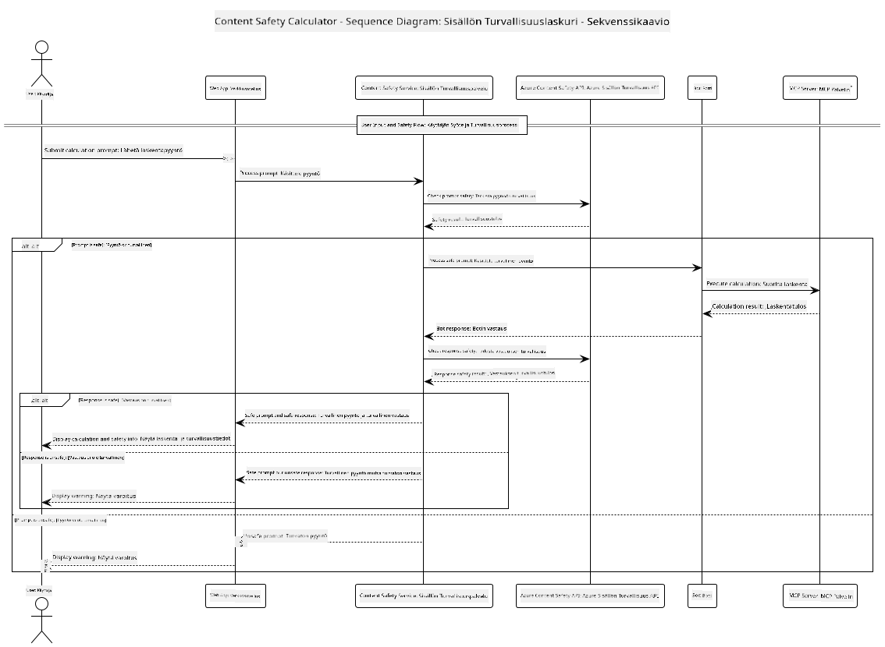

<!--
CO_OP_TRANSLATOR_METADATA:
{
  "original_hash": "e5ea5e7582f70008ea9bec3b3820f20a",
  "translation_date": "2025-07-13T23:17:35+00:00",
  "source_file": "04-PracticalImplementation/samples/java/containerapp/README.md",
  "language_code": "fi"
}
-->
## Järjestelmän arkkitehtuuri

Tämä projekti esittelee web-sovelluksen, joka käyttää sisällön turvallisuustarkistusta ennen käyttäjän syötteiden välittämistä laskinpalvelimelle Model Context Protocolin (MCP) kautta.



### Miten se toimii

1. **Käyttäjän syöte**: Käyttäjä syöttää laskentakyselyn web-käyttöliittymään  
2. **Sisällön turvallisuustarkastus (syöte)**: Kysely analysoidaan Azure Content Safety API:lla  
3. **Turvallisuuspäätös (syöte)**:  
   - Jos sisältö on turvallista (vakavuus < 2 kaikissa kategorioissa), se siirtyy laskimelle  
   - Jos sisältö on merkitty mahdollisesti haitalliseksi, prosessi keskeytyy ja palauttaa varoituksen  
4. **Laskimen integrointi**: Turvallinen sisältö käsitellään LangChain4j:n kautta, joka kommunikoi MCP-laskinpalvelimen kanssa  
5. **Sisällön turvallisuustarkastus (tulos)**: Botin vastaus analysoidaan Azure Content Safety API:lla  
6. **Turvallisuuspäätös (tulos)**:  
   - Jos botin vastaus on turvallinen, se näytetään käyttäjälle  
   - Jos botin vastaus on merkitty mahdollisesti haitalliseksi, se korvataan varoituksella  
7. **Vastaus**: Tulokset (jos turvalliset) näytetään käyttäjälle molempien turvallisuusanalyysien kanssa

## Model Context Protocolin (MCP) käyttö laskinpalveluissa

Tämä projekti näyttää, miten Model Context Protocolia (MCP) käytetään kutsuttaessa laskin-MCP-palveluita LangChain4j:stä. Toteutus käyttää paikallista MCP-palvelinta, joka toimii portissa 8080 ja tarjoaa laskutoimituksia.

### Azure Content Safety -palvelun käyttöönotto

Ennen sisällön turvallisuusominaisuuksien käyttöä sinun tulee luoda Azure Content Safety -palveluresurssi:

1. Kirjaudu sisään [Azure-portaaliin](https://portal.azure.com)  
2. Valitse "Create a resource" ja hae "Content Safety"  
3. Valitse "Content Safety" ja klikkaa "Create"  
4. Anna resurssillesi yksilöllinen nimi  
5. Valitse tilauksesi ja resurssiryhmä (tai luo uusi)  
6. Valitse tuettu alue (katso [Alueiden saatavuus](https://azure.microsoft.com/en-us/global-infrastructure/services/?products=cognitive-services) lisätietoja varten)  
7. Valitse sopiva hinnoittelutaso  
8. Klikkaa "Create" ottaaksesi resurssin käyttöön  
9. Kun käyttöönotto on valmis, klikkaa "Go to resource"  
10. Vasemmasta valikosta, "Resource Management" alta, valitse "Keys and Endpoint"  
11. Kopioi jompikumpi avaimista ja päätepisteen URL seuraavaa vaihetta varten

### Ympäristömuuttujien määrittäminen

Aseta `GITHUB_TOKEN` ympäristömuuttuja GitHub-mallien todennusta varten:  
```sh
export GITHUB_TOKEN=<your_github_token>
```

Sisällön turvallisuusominaisuuksia varten aseta:  
```sh
export CONTENT_SAFETY_ENDPOINT=<your_content_safety_endpoint>
export CONTENT_SAFETY_KEY=<your_content_safety_key>
```

Näitä ympäristömuuttujia sovellus käyttää todennukseen Azure Content Safety -palvelussa. Jos muuttujia ei ole asetettu, sovellus käyttää esimerkkitietoja, mutta sisällön turvallisuusominaisuudet eivät toimi oikein.

### Laskin MCP -palvelimen käynnistäminen

Ennen asiakkaan käynnistämistä sinun tulee käynnistää laskin MCP -palvelin SSE-tilassa osoitteessa localhost:8080.

## Projektin kuvaus

Tämä projekti demonstroi Model Context Protocolin (MCP) integrointia LangChain4j:hin laskinpalveluiden kutsumiseksi. Keskeisiä ominaisuuksia ovat:

- MCP:n käyttö yhteyden muodostamiseen laskinpalveluun peruslaskutoimituksia varten  
- Kaksitasoinen sisällön turvallisuustarkastus sekä käyttäjän syötteille että botin vastauksille  
- Integrointi GitHubin gpt-4.1-nano -malliin LangChain4j:n kautta  
- Server-Sent Events (SSE) -protokollan käyttö MCP-siirrossa

## Sisällön turvallisuusintegraatio

Projekti sisältää kattavat sisällön turvallisuusominaisuudet, jotka varmistavat, että sekä käyttäjän syötteet että järjestelmän vastaukset ovat vapaita haitallisesta sisällöstä:

1. **Syötteen tarkastus**: Kaikki käyttäjän syötteet analysoidaan haitallisten sisältökategorioiden, kuten vihapuheen, väkivallan, itsetuhoisuuden ja seksuaalisen sisällön varalta ennen käsittelyä.  
2. **Tuloksen tarkastus**: Vaikka käytössä olisi mahdollisesti sensuroimattomia malleja, järjestelmä tarkistaa kaikki generoitu vastaukset samoilla sisällön turvallisuusfilttereillä ennen niiden näyttämistä käyttäjälle.

Tämä kaksitasoinen lähestymistapa varmistaa, että järjestelmä pysyy turvallisena riippumatta käytettävästä tekoälymallista, suojaten käyttäjiä sekä haitallisilta syötteiltä että mahdollisesti ongelmallisilta tekoälyn tuottamilta vastauksilta.

## Web-asiakas

Sovellus sisältää käyttäjäystävällisen web-käyttöliittymän, jonka avulla käyttäjät voivat olla vuorovaikutuksessa Content Safety Calculator -järjestelmän kanssa:

### Web-käyttöliittymän ominaisuudet

- Yksinkertainen ja selkeä lomake laskentakyselyiden syöttämiseen  
- Kaksitasoinen sisällön turvallisuusvalidointi (syöte ja tulos)  
- Reaaliaikainen palaute kyselyn ja vastauksen turvallisuudesta  
- Väritetyt turvallisuusindikaattorit helppoon tulkintaan  
- Selkeä ja responsiivinen ulkoasu, joka toimii eri laitteilla  
- Esimerkkikyselyjä turvallisen käytön ohjeistamiseksi

### Web-asiakkaan käyttö

1. Käynnistä sovellus:  
   ```sh
   mvn spring-boot:run
   ```

2. Avaa selain ja siirry osoitteeseen `http://localhost:8087`

3. Syötä laskentakysely tekstikenttään (esim. "Laske lukujen 24.5 ja 17.3 summa")

4. Klikkaa "Submit" käsitelläksesi pyyntösi

5. Tarkastele tuloksia, jotka sisältävät:  
   - Kyselyn sisällön turvallisuusanalyysin  
   - Lasketun tuloksen (jos kysely oli turvallinen)  
   - Botin vastauksen sisällön turvallisuusanalyysin  
   - Mahdolliset turvallisuusvaroitukset, jos syöte tai tulos oli merkitty

Web-asiakas hoitaa automaattisesti molemmat sisällön turvallisuustarkistukset, varmistaen, että kaikki vuorovaikutukset ovat turvallisia ja asianmukaisia riippumatta käytetystä tekoälymallista.

**Vastuuvapauslauseke**:  
Tämä asiakirja on käännetty käyttämällä tekoälypohjaista käännöspalvelua [Co-op Translator](https://github.com/Azure/co-op-translator). Vaikka pyrimme tarkkuuteen, huomioithan, että automaattikäännöksissä saattaa esiintyä virheitä tai epätarkkuuksia. Alkuperäistä asiakirjaa sen alkuperäiskielellä tulee pitää virallisena lähteenä. Tärkeissä tiedoissa suositellaan ammattimaista ihmiskäännöstä. Emme ole vastuussa tämän käännöksen käytöstä aiheutuvista väärinymmärryksistä tai tulkinnoista.