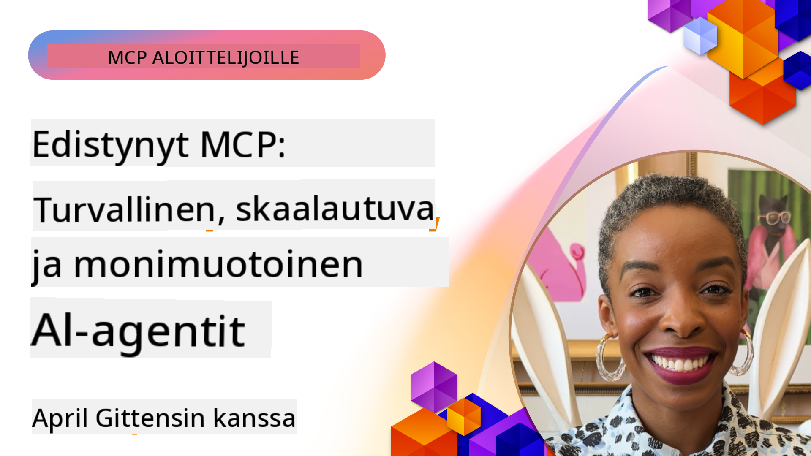

<!--
CO_OP_TRANSLATOR_METADATA:
{
  "original_hash": "d204bc94ea6027d06a703b21b711ca57",
  "translation_date": "2025-08-18T16:05:26+00:00",
  "source_file": "05-AdvancedTopics/README.md",
  "language_code": "fi"
}
-->
# Edistyneet aiheet MCP:ssä

_(Klikkaa yllä olevaa kuvaa nähdäksesi tämän oppitunnin videon)_

Tämä luku käsittelee joukon edistyneitä aiheita Model Context Protocolin (MCP) toteutuksessa, mukaan lukien monimuotoinen integraatio, skaalautuvuus, turvallisuuskäytännöt ja yritysintegraatio. Nämä aiheet ovat keskeisiä, kun rakennetaan vankkoja ja tuotantovalmiita MCP-sovelluksia, jotka vastaavat modernien tekoälyjärjestelmien vaatimuksiin.

## Yleiskatsaus

Tässä oppitunnissa tutkitaan edistyneitä käsitteitä Model Context Protocolin toteutuksessa, keskittyen monimuotoiseen integraatioon, skaalautuvuuteen, turvallisuuskäytäntöihin ja yritysintegraatioon. Nämä aiheet ovat välttämättömiä tuotantotason MCP-sovellusten rakentamisessa, jotka pystyvät käsittelemään monimutkaisia vaatimuksia yritysympäristöissä.

## Oppimistavoitteet

Oppitunnin lopussa osaat:

- Toteuttaa monimuotoisia ominaisuuksia MCP-kehyksissä
- Suunnitella skaalautuvia MCP-arkkitehtuureja vaativiin tilanteisiin
- Soveltaa turvallisuuskäytäntöjä MCP:n turvallisuusperiaatteiden mukaisesti
- Integroi MCP yrityksen tekoälyjärjestelmiin ja -kehyksiin
- Optimoida suorituskykyä ja luotettavuutta tuotantoympäristöissä

## Oppitunnit ja esimerkkiprojektit

| Linkki | Otsikko | Kuvaus |
|--------|---------|--------|
| [5.1 Integraatio Azureen](./mcp-integration/README.md) | Integrointi Azureen | Opi, kuinka integroida MCP-palvelimesi Azureen |
| [5.2 Monimuotoiset esimerkit](./mcp-multi-modality/README.md) | MCP Monimuotoiset esimerkit | Esimerkkejä ääni-, kuva- ja monimuotoisista vastauksista |
| [5.3 MCP OAuth2 -esimerkki](../../../05-AdvancedTopics/mcp-oauth2-demo) | MCP OAuth2 Demo | Minimalistinen Spring Boot -sovellus, joka näyttää OAuth2:n MCP:ssä sekä valtuutus- että resurssipalvelimena. Esittelee turvallisen tokenien myöntämisen, suojatut päätepisteet, Azure Container Apps -käyttöönoton ja API Management -integraation. |
| [5.4 Juuriyhteydet](./mcp-root-contexts/README.md) | Juuriyhteydet | Opi lisää juuriyhteyksistä ja niiden toteutuksesta |
| [5.5 Reititys](./mcp-routing/README.md) | Reititys | Opi erilaisia reititystyyppejä |
| [5.6 Näytteenotto](./mcp-sampling/README.md) | Näytteenotto | Opi työskentelemään näytteenoton kanssa |
| [5.7 Skaalaus](./mcp-scaling/README.md) | Skaalaus | Opi skaalauksesta |
| [5.8 Turvallisuus](./mcp-security/README.md) | Turvallisuus | Suojaa MCP-palvelimesi |
| [5.9 Verkkohakuesimerkki](./web-search-mcp/README.md) | Verkkohaku MCP | Python MCP -palvelin ja -asiakas, jotka integroituvat SerpAPI:hen reaaliaikaista verkko-, uutis-, tuotehakua ja kysymys-vastaus-toimintoja varten. Esittelee monityökalujen orkestroinnin, ulkoisen API-integraation ja vankan virheenkäsittelyn. |
| [5.10 Reaaliaikainen suoratoisto](./mcp-realtimestreaming/README.md) | Suoratoisto | Reaaliaikainen datan suoratoisto on välttämätöntä nykypäivän dataohjautuvassa maailmassa, jossa yritykset ja sovellukset tarvitsevat välitöntä pääsyä tietoihin tehdäkseen oikea-aikaisia päätöksiä. |
| [5.11 Reaaliaikainen verkkohaku](./mcp-realtimesearch/README.md) | Verkkohaku | Reaaliaikainen verkkohaku, kuinka MCP muuttaa reaaliaikaista verkkohakua tarjoamalla standardoidun lähestymistavan kontekstinhallintaan tekoälymallien, hakukoneiden ja sovellusten välillä. |
| [5.12 Entra ID -todennus Model Context Protocol -palvelimille](./mcp-security-entra/README.md) | Entra ID -todennus | Microsoft Entra ID tarjoaa vankan pilvipohjaisen identiteetti- ja pääsynhallintaratkaisun, joka auttaa varmistamaan, että vain valtuutetut käyttäjät ja sovellukset voivat olla vuorovaikutuksessa MCP-palvelimesi kanssa. |
| [5.13 Azure AI Foundry Agent -integraatio](./mcp-foundry-agent-integration/README.md) | Azure AI Foundry -integraatio | Opi integroimaan Model Context Protocol -palvelimet Azure AI Foundry -agenttien kanssa, mahdollistaen tehokkaan työkalujen orkestroinnin ja yrityksen tekoälyominaisuudet standardoitujen ulkoisten tietolähteiden yhteyksien avulla. |
| [5.14 Kontekstisuunnittelu](./mcp-contextengineering/README.md) | Kontekstisuunnittelu | Kontekstisuunnittelutekniikoiden tulevaisuuden mahdollisuudet MCP-palvelimille, mukaan lukien kontekstin optimointi, dynaaminen kontekstinhallinta ja strategiat tehokkaaseen kehotteiden suunnitteluun MCP-kehyksissä. |

## Lisäviitteet

Ajantasaisimmat tiedot MCP:n edistyneistä aiheista löydät:
- [MCP Dokumentaatio](https://modelcontextprotocol.io/)
- [MCP Spesifikaatio](https://spec.modelcontextprotocol.io/)
- [GitHub Repository](https://github.com/modelcontextprotocol)

## Keskeiset opit

- Monimuotoiset MCP-toteutukset laajentavat tekoälyn kyvykkyyksiä tekstinkäsittelyn ulkopuolelle
- Skaalautuvuus on välttämätöntä yrityskäyttöönotossa ja sitä voidaan käsitellä horisontaalisen ja vertikaalisen skaalauksen avulla
- Kattavat turvallisuustoimenpiteet suojaavat dataa ja varmistavat asianmukaisen pääsynhallinnan
- Yritysintegraatio alustojen, kuten Azure OpenAI:n ja Microsoft AI Foundryn, kanssa parantaa MCP:n kyvykkyyksiä
- Edistyneet MCP-toteutukset hyötyvät optimoiduista arkkitehtuureista ja huolellisesta resurssien hallinnasta

## Harjoitus

Suunnittele yritystason MCP-toteutus tiettyä käyttötapausta varten:

1. Tunnista monimuotoiset vaatimukset käyttötapauksellesi
2. Määrittele tarvittavat turvallisuuskontrollit arkaluontoisten tietojen suojaamiseksi
3. Suunnittele skaalautuva arkkitehtuuri, joka pystyy käsittelemään vaihtelevaa kuormitusta
4. Suunnittele integraatiopisteet yrityksen tekoälyjärjestelmiin
5. Dokumentoi mahdolliset suorituskyvyn pullonkaulat ja niiden lieventämisstrategiat

## Lisäresurssit

- [Azure OpenAI Dokumentaatio](https://learn.microsoft.com/en-us/azure/ai-services/openai/)
- [Microsoft AI Foundry Dokumentaatio](https://learn.microsoft.com/en-us/ai-services/)

---

## Mitä seuraavaksi

- [5.1 MCP Integraatio](./mcp-integration/README.md)

**Vastuuvapauslauseke**:  
Tämä asiakirja on käännetty käyttämällä tekoälypohjaista käännöspalvelua [Co-op Translator](https://github.com/Azure/co-op-translator). Vaikka pyrimme tarkkuuteen, huomioithan, että automaattiset käännökset voivat sisältää virheitä tai epätarkkuuksia. Alkuperäistä asiakirjaa sen alkuperäisellä kielellä tulisi pitää ensisijaisena lähteenä. Kriittisen tiedon osalta suositellaan ammattimaista ihmiskäännöstä. Emme ole vastuussa väärinkäsityksistä tai virhetulkinnoista, jotka johtuvat tämän käännöksen käytöstä.