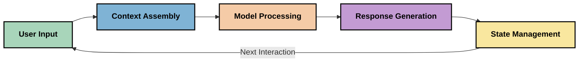
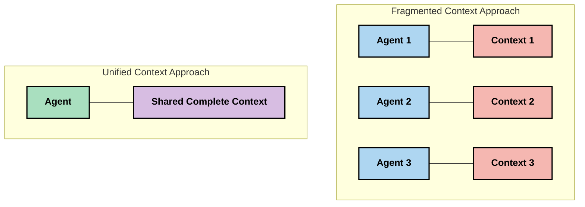

<!--
CO_OP_TRANSLATOR_METADATA:
{
  "original_hash": "fd169ca3071b81b5ee282e194bc823df",
  "translation_date": "2025-09-15T20:40:18+00:00",
  "source_file": "05-AdvancedTopics/mcp-contextengineering/README.md",
  "language_code": "fi"
}
-->
# Kontekstisuunnittelu: Nouseva käsite MCP-ekosysteemissä

## Yleiskatsaus

Kontekstisuunnittelu on nouseva käsite tekoälyn alalla, joka tutkii, miten tietoa jäsennetään, toimitetaan ja ylläpidetään asiakkaiden ja tekoälypalveluiden välisissä vuorovaikutuksissa. Kun Model Context Protocol (MCP) -ekosysteemi kehittyy, kontekstin tehokas hallinta tulee yhä tärkeämmäksi. Tämä moduuli esittelee kontekstisuunnittelun käsitteen ja sen mahdolliset sovellukset MCP-toteutuksissa.

## Oppimistavoitteet

Tämän moduulin lopussa osaat:

- Ymmärtää kontekstisuunnittelun nousevan käsitteen ja sen mahdollisen roolin MCP-sovelluksissa
- Tunnistaa keskeiset haasteet kontekstinhallinnassa, joita MCP-protokollan suunnittelu käsittelee
- Tutkia tekniikoita mallin suorituskyvyn parantamiseksi paremmalla kontekstinhallinnalla
- Pohtia lähestymistapoja kontekstin tehokkuuden mittaamiseen ja arviointiin
- Soveltaa näitä nousevia käsitteitä tekoälykokemusten parantamiseksi MCP-kehyksen avulla

## Johdatus kontekstisuunnitteluun

Kontekstisuunnittelu keskittyy tietovirran tarkoitukselliseen suunnitteluun ja hallintaan käyttäjien, sovellusten ja tekoälymallien välillä. Toisin kuin vakiintuneet alat, kuten prompt-suunnittelu, kontekstisuunnittelu on vielä muotoutumassa, kun ammattilaiset pyrkivät ratkaisemaan ainutlaatuisia haasteita, jotka liittyvät tekoälymallien oikean tiedon tarjoamiseen oikeaan aikaan.

Kun suuret kielimallit (LLM:t) ovat kehittyneet, kontekstin merkitys on tullut yhä selvemmäksi. Kontekstin laatu, relevanssi ja rakenne vaikuttavat suoraan mallin tuottamiin tuloksiin. Kontekstisuunnittelu tutkii tätä suhdetta ja pyrkii kehittämään periaatteita tehokkaalle kontekstinhallinnalle.

> "Vuonna 2025 olemassa olevat mallit ovat äärimmäisen älykkäitä. Mutta edes älykkäin ihminen ei pysty tekemään työtään tehokkaasti ilman kontekstia siitä, mitä häneltä pyydetään... 'Kontekstisuunnittelu' on seuraava taso prompt-suunnittelussa. Kyse on siitä, että tämä tehdään automaattisesti dynaamisessa järjestelmässä." — Walden Yan, Cognition AI

Kontekstisuunnittelu voi sisältää:

1. **Kontekstin valinta**: Määritetään, mikä tieto on relevanttia tiettyä tehtävää varten
2. **Kontekstin jäsentäminen**: Tiedon organisointi mallin ymmärryksen maksimoimiseksi
3. **Kontekstin toimitus**: Tiedon lähettämisen optimointi mallille
4. **Kontekstin ylläpito**: Kontekstin tilan ja kehityksen hallinta ajan myötä
5. **Kontekstin arviointi**: Kontekstin tehokkuuden mittaaminen ja parantaminen

Nämä keskittymisalueet ovat erityisen merkityksellisiä MCP-ekosysteemille, joka tarjoaa standardoidun tavan sovelluksille tarjota kontekstia LLM:ille.

## Kontekstin matkan näkökulma

Yksi tapa visualisoida kontekstisuunnittelua on jäljittää tiedon matka MCP-järjestelmän läpi:

### Kontekstin matkan keskeiset vaiheet:

1. **Käyttäjän syöte**: Raakatieto käyttäjältä (teksti, kuvat, dokumentit)
2. **Kontekstin kokoaminen**: Käyttäjän syötteen yhdistäminen järjestelmän kontekstiin, keskusteluhistoriaan ja muuhun haettuun tietoon
3. **Mallin käsittely**: Tekoälymalli käsittelee koottua kontekstia
4. **Vastauksen luominen**: Malli tuottaa vastauksia annetun kontekstin perusteella
5. **Tilanhallinta**: Järjestelmä päivittää sisäisen tilansa vuorovaikutuksen perusteella

Tämä näkökulma korostaa kontekstin dynaamista luonnetta tekoälyjärjestelmissä ja herättää tärkeitä kysymyksiä siitä, miten tietoa voidaan parhaiten hallita kussakin vaiheessa.

## Nousevat periaatteet kontekstisuunnittelussa

Kun kontekstisuunnittelu kehittyy, ammattilaisilta alkaa nousta esiin varhaisia periaatteita. Nämä periaatteet voivat auttaa ohjaamaan MCP-toteutusten valintoja:

### Periaate 1: Jaa konteksti kokonaisuudessaan

Konteksti tulisi jakaa kokonaisuudessaan järjestelmän kaikkien komponenttien välillä sen sijaan, että se pirstaloituisi useiden agenttien tai prosessien kesken. Kun konteksti on hajautettu, yhdessä osassa järjestelmää tehdyt päätökset voivat olla ristiriidassa muualla tehtyjen päätösten kanssa.

MCP-sovelluksissa tämä viittaa siihen, että järjestelmät tulisi suunnitella siten, että konteksti virtaa saumattomasti koko putkiston läpi sen sijaan, että se olisi ositettu.

### Periaate 2: Tunnista, että toiminnot sisältävät implisiittisiä päätöksiä

Jokainen tekoälymallin tekemä toiminto sisältää implisiittisiä päätöksiä siitä, miten konteksti tulkitaan. Kun useat komponentit toimivat eri kontekstien perusteella, nämä implisiittiset päätökset voivat olla ristiriidassa, mikä johtaa epäjohdonmukaisiin tuloksiin.

Tällä periaatteella on tärkeitä vaikutuksia MCP-sovelluksiin:
- Suosi monimutkaisten tehtävien lineaarista käsittelyä rinnakkaisen käsittelyn sijaan, jossa konteksti on pirstaloitunut
- Varmista, että kaikki päätöspisteet pääsevät käsiksi samaan kontekstuaaliseen tietoon
- Suunnittele järjestelmät siten, että myöhemmät vaiheet näkevät aiempien päätösten täydellisen kontekstin

### Periaate 3: Tasapainota kontekstin syvyys ja ikkunarajoitukset

Kun keskustelut ja prosessit pitenevät, kontekstin ikkunat lopulta ylittyvät. Tehokas kontekstisuunnittelu tutkii lähestymistapoja hallita tätä jännitettä kattavan kontekstin ja teknisten rajoitusten välillä.

Mahdollisia lähestymistapoja, joita tutkitaan, ovat:
- Kontekstin tiivistäminen, joka säilyttää olennaisen tiedon samalla kun vähentää tokenien käyttöä
- Kontekstin progressiivinen lataaminen tarpeiden mukaan
- Aiemman vuorovaikutuksen tiivistäminen samalla kun säilytetään keskeiset päätökset ja faktat

## Kontekstin haasteet ja MCP-protokollan suunnittelu

Model Context Protocol (MCP) on suunniteltu tietoisena kontekstinhallinnan ainutlaatuisista haasteista. Näiden haasteiden ymmärtäminen auttaa selittämään MCP-protokollan suunnittelun keskeisiä näkökohtia:

### Haaste 1: Kontekstin ikkunarajoitukset
Useimmilla tekoälymalleilla on kiinteät kontekstin ikkunakoot, jotka rajoittavat, kuinka paljon tietoa ne voivat käsitellä kerralla.

**MCP-suunnittelun vastaus:** 
- Protokolla tukee jäsenneltyä, resurssipohjaista kontekstia, johon voidaan viitata tehokkaasti
- Resurssit voidaan jakaa sivuiksi ja ladata progressiivisesti

### Haaste 2: Relevanssin määrittäminen
On vaikeaa määrittää, mikä tieto on tärkeintä sisällyttää kontekstiin.

**MCP-suunnittelun vastaus:**
- Joustavat työkalut mahdollistavat tiedon dynaamisen haun tarpeen mukaan
- Jäsennellyt kehotteet mahdollistavat johdonmukaisen kontekstin organisoinnin

### Haaste 3: Kontekstin pysyvyys
Tilanhallinta vuorovaikutusten välillä vaatii huolellista kontekstin seurantaa.

**MCP-suunnittelun vastaus:**
- Standardoitu istunnonhallinta
- Selkeästi määritellyt vuorovaikutusmallit kontekstin kehitykselle

### Haaste 4: Monimuotoinen konteksti
Erilaiset datatyypit (teksti, kuvat, jäsennelty data) vaativat erilaista käsittelyä.

**MCP-suunnittelun vastaus:**
- Protokollan suunnittelu tukee erilaisia sisältötyyppejä
- Monimuotoisen tiedon standardoitu esitys

### Haaste 5: Turvallisuus ja yksityisyys
Konteksti sisältää usein arkaluonteista tietoa, joka täytyy suojata.

**MCP-suunnittelun vastaus:**
- Selkeät rajat asiakkaan ja palvelimen vastuiden välillä
- Paikalliset käsittelyvaihtoehdot tietojen altistumisen minimoimiseksi

Näiden haasteiden ymmärtäminen ja MCP:n tarjoamat ratkaisut luovat perustan kehittyneempien kontekstisuunnittelutekniikoiden tutkimiselle.
- [Model Context Protocol Website](https://modelcontextprotocol.io/)
- [Model Context Protocol Specification](https://github.com/modelcontextprotocol/modelcontextprotocol)
- [MCP Documentation](https://modelcontextprotocol.io/docs)
- [MCP C# SDK](https://github.com/modelcontextprotocol/csharp-sdk)
- [MCP Python SDK](https://github.com/modelcontextprotocol/python-sdk)
- [MCP TypeScript SDK](https://github.com/modelcontextprotocol/typescript-sdk)
- [MCP Inspector](https://github.com/modelcontextprotocol/inspector) - Visuaalinen testausväline MCP-palvelimille

### Artikkeleita kontekstin suunnittelusta
- [Älä rakenna monia agentteja: Kontekstin suunnittelun periaatteet](https://cognition.ai/blog/dont-build-multi-agents) - Walden Yanin näkemyksiä kontekstin suunnittelun periaatteista
- [Käytännön opas agenttien rakentamiseen](https://cdn.openai.com/business-guides-and-resources/a-practical-guide-to-building-agents.pdf) - OpenAI:n opas tehokkaaseen agenttisuunnitteluun
- [Tehokkaiden agenttien rakentaminen](https://www.anthropic.com/engineering/building-effective-agents) - Anthropicin lähestymistapa agenttien kehittämiseen

### Aiheeseen liittyvä tutkimus
- [Dynaaminen hakuvahvistus suurille kielimalleille](https://arxiv.org/abs/2310.01487) - Tutkimus dynaamisista hakumenetelmistä
- [Eksyksissä keskellä: Kuinka kielimallit käyttävät pitkiä konteksteja](https://arxiv.org/abs/2307.03172) - Tärkeä tutkimus kontekstin käsittelytavoista
- [Hierarkkinen tekstiehdollinen kuvagenerointi CLIP-latenteilla](https://arxiv.org/abs/2204.06125) - DALL-E 2 -paperi, jossa näkemyksiä kontekstin rakenteesta
- [Kontekstin roolin tutkiminen suurten kielimallien arkkitehtuureissa](https://aclanthology.org/2023.findings-emnlp.124/) - Uusin tutkimus kontekstin käsittelystä
- [Moniagenttinen yhteistyö: Katsaus](https://arxiv.org/abs/2304.03442) - Tutkimus moniagenttijärjestelmistä ja niiden haasteista

### Lisäresurssit
- [Kontekstin ikkunan optimointitekniikat](https://learn.microsoft.com/en-us/azure/ai-services/openai/concepts/context-window)
- [Edistyneet RAG-tekniikat](https://www.microsoft.com/en-us/research/blog/retrieval-augmented-generation-rag-and-frontier-models/)
- [Semantic Kernel -dokumentaatio](https://github.com/microsoft/semantic-kernel)
- [AI Toolkit kontekstinhallintaan](https://github.com/microsoft/aitoolkit)

## Mitä seuraavaksi

- [5.15 MCP Custom Transport](../mcp-transport/README.md)

---

**Vastuuvapauslauseke**:  
Tämä asiakirja on käännetty käyttämällä tekoälypohjaista käännöspalvelua [Co-op Translator](https://github.com/Azure/co-op-translator). Vaikka pyrimme tarkkuuteen, huomioithan, että automaattiset käännökset voivat sisältää virheitä tai epätarkkuuksia. Alkuperäistä asiakirjaa sen alkuperäisellä kielellä tulisi pitää ensisijaisena lähteenä. Kriittisen tiedon osalta suositellaan ammattimaista ihmiskäännöstä. Emme ole vastuussa väärinkäsityksistä tai virhetulkinnoista, jotka johtuvat tämän käännöksen käytöstä.