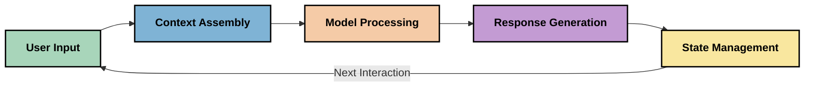
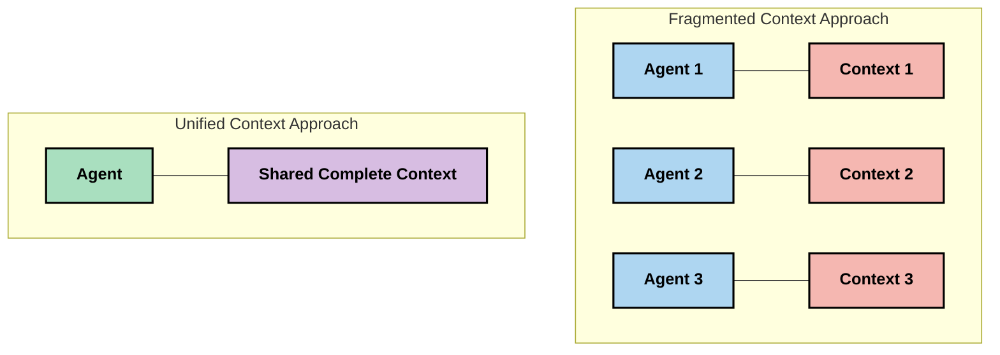
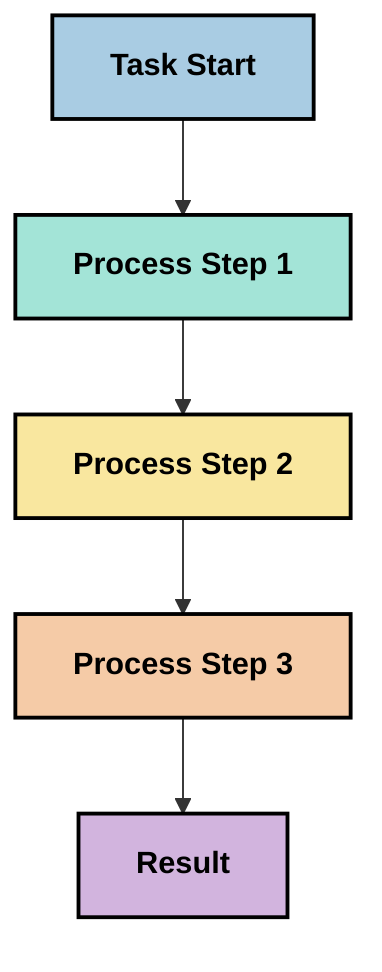
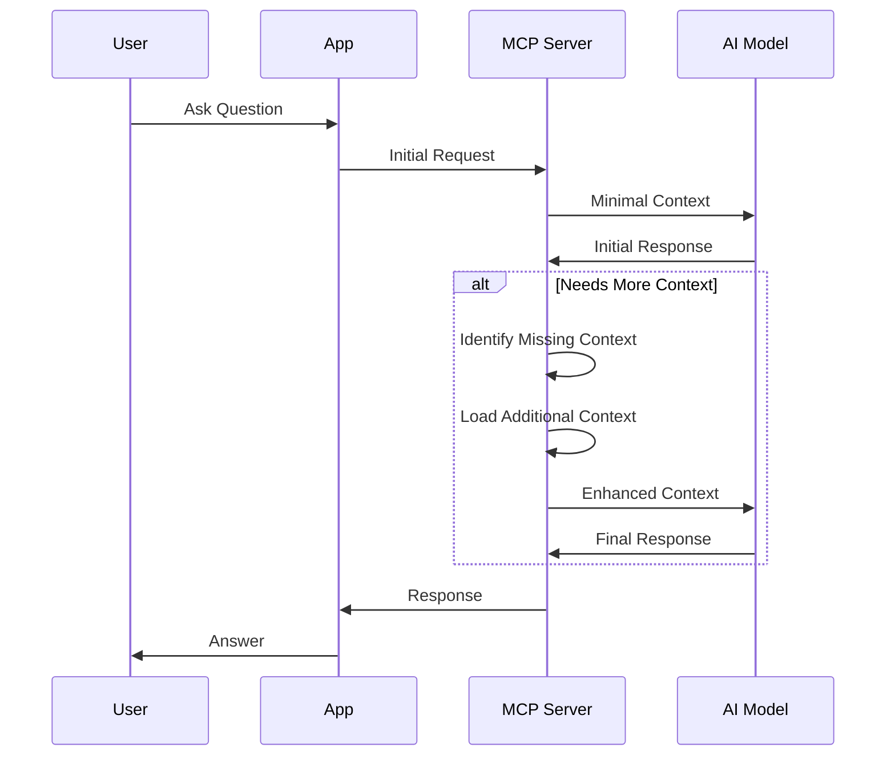
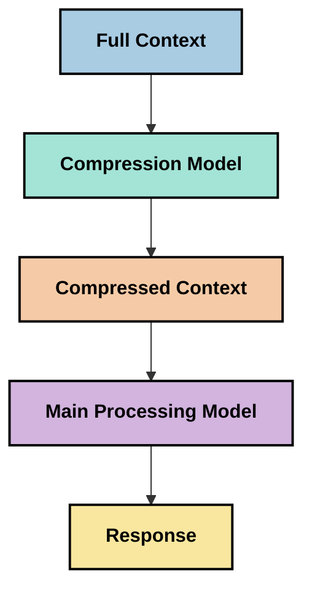

<!--
CO_OP_TRANSLATOR_METADATA:
{
  "original_hash": "5762e8e74dd99d8b7dbb31e69a82561e",
  "translation_date": "2025-07-17T08:36:37+00:00",
  "source_file": "05-AdvancedTopics/mcp-contextengineering/README.md",
  "language_code": "fi"
}
-->
# Context Engineering: Nouseva käsite MCP-ekosysteemissä

## Yleiskatsaus

Context engineering on nouseva käsite tekoälyn alalla, joka tutkii, miten tieto jäsennetään, välitetään ja ylläpidetään asiakkaiden ja tekoälypalveluiden välisissä vuorovaikutuksissa. Model Context Protocolin (MCP) ekosysteemin kehittyessä kontekstin tehokas hallinta korostuu entisestään. Tässä moduulissa esitellään context engineering -käsite ja tarkastellaan sen mahdollisia sovelluksia MCP-toteutuksissa.

## Oppimistavoitteet

Moduulin lopuksi osaat:

- Ymmärtää context engineeringin nousevan käsitteen ja sen mahdollisen roolin MCP-sovelluksissa
- Tunnistaa keskeiset haasteet kontekstinhallinnassa, joihin MCP-protokollan suunnittelu vastaa
- Tutkia tekniikoita mallin suorituskyvyn parantamiseksi paremman kontekstinhallinnan avulla
- Pohtia lähestymistapoja kontekstin tehokkuuden mittaamiseen ja arviointiin
- Soveltaa näitä nousevia käsitteitä parantaaksesi tekoälykokemuksia MCP-kehyksen kautta

## Johdanto Context Engineeriin

Context engineering keskittyy tieto­virran tarkoitukselliseen suunnitteluun ja hallintaan käyttäjien, sovellusten ja tekoälymallien välillä. Toisin kuin vakiintuneet alat, kuten prompt engineering, context engineering on vielä määrittelyvaiheessa, kun käytännön tekijät ratkovat ainutlaatuisia haasteita oikean tiedon tarjoamisessa tekoälymalleille oikeaan aikaan.

Suuret kielimallit (LLM) kehittyessään ovat korostaneet kontekstin merkitystä. Kontekstin laatu, merkityksellisyys ja rakenne vaikuttavat suoraan mallin tuottamiin vastauksiin. Context engineering tutkii tätä suhdetta ja pyrkii kehittämään periaatteita tehokkaaseen kontekstinhallintaan.

> "Vuonna 2025 mallit ovat äärimmäisen älykkäitä. Mutta edes älykkäin ihminen ei pysty tekemään työtään tehokkaasti ilman kontekstia siitä, mitä häneltä pyydetään... 'Context engineering' on seuraava taso prompt engineeringissä. Kyse on tämän tekemisestä automaattisesti dynaamisessa järjestelmässä." — Walden Yan, Cognition AI

Context engineering voi sisältää:

1. **Kontekstin valinta**: Määrittää, mikä tieto on oleellista tiettyä tehtävää varten
2. **Kontekstin jäsentely**: Järjestää tieto mallin ymmärryksen maksimoimiseksi
3. **Kontekstin välitys**: Optimoida, miten ja milloin tieto lähetetään malleille
4. **Kontekstin ylläpito**: Hallita kontekstin tilaa ja kehittymistä ajan myötä
5. **Kontekstin arviointi**: Mitata ja parantaa kontekstin tehokkuutta

Nämä painopistealueet ovat erityisen merkityksellisiä MCP-ekosysteemissä, joka tarjoaa standardoidun tavan sovelluksille toimittaa kontekstia LLM-malleille.

## Kontekstin matkan näkökulma

Yksi tapa hahmottaa context engineeriä on seurata tiedon kulkua MCP-järjestelmässä:



### Keskeiset vaiheet kontekstin matkalla:

1. **Käyttäjän syöte**: Käyttäjän antama raakadata (teksti, kuvat, dokumentit)
2. **Kontekstin kokoaminen**: Käyttäjän syötteen yhdistäminen järjestelmän kontekstiin, keskusteluhistoriaan ja muuhun haettuun tietoon
3. **Mallin käsittely**: Tekoälymalli käsittelee koottua kontekstia
4. **Vastauksen generointi**: Malli tuottaa vastauksia annetun kontekstin pohjalta
5. **Tilanhallinta**: Järjestelmä päivittää sisäistä tilaansa vuorovaikutuksen perusteella

Tämä näkökulma korostaa kontekstin dynaamista luonnetta tekoälyjärjestelmissä ja herättää tärkeitä kysymyksiä tiedon hallinnasta kussakin vaiheessa.

## Nousevia periaatteita context engineeringissä

Kun context engineering muotoutuu, käytännön tekijöiltä alkaa nousta esiin joitakin varhaisia periaatteita, jotka voivat ohjata MCP-toteutusten valintoja:

### Periaate 1: Jaa konteksti kokonaisuudessaan

Konteksti tulisi jakaa kokonaisuudessaan kaikkien järjestelmän osien kesken, ei hajautettuna useille agenteille tai prosesseille. Kun konteksti on hajautettu, eri osissa tehtävät päätökset voivat olla ristiriitaisia.



MCP-sovelluksissa tämä tarkoittaa järjestelmien suunnittelua siten, että konteksti virtaa saumattomasti koko putken läpi eikä ole erillisiin osiin jaettu.

### Periaate 2: Tunnista, että toimet sisältävät implisiittisiä päätöksiä

Jokainen mallin tekemä toimenpide sisältää piileviä päätöksiä siitä, miten konteksti tulkitaan. Kun useat komponentit toimivat eri konteksteilla, nämä implisiittiset päätökset voivat olla ristiriitaisia, mikä johtaa epäjohdonmukaisiin tuloksiin.

Tällä periaatteella on merkittäviä vaikutuksia MCP-sovelluksiin:
- Suosi monimutkaisten tehtävien lineaarista käsittelyä rinnakkaisen hajautetun kontekstin sijaan
- Varmista, että kaikilla päätöspisteillä on pääsy samaan kontekstitietoon
- Suunnittele järjestelmät siten, että myöhemmät vaiheet näkevät aiempien päätösten koko kontekstin

### Periaate 3: Tasapainota kontekstin syvyys ja ikkunarajoitukset

Keskustelujen ja prosessien pidentyessä konteksti-ikkunat täyttyvät lopulta. Tehokas context engineering tutkii keinoja hallita tätä jännitettä kattavan kontekstin ja teknisten rajoitusten välillä.

Mahdollisia lähestymistapoja ovat:
- Kontekstin pakkaaminen, joka säilyttää olennaisen tiedon ja vähentää tokenien käyttöä
- Kontekstin progressiivinen lataus tarpeen mukaan
- Aiemman vuorovaikutuksen tiivistäminen säilyttäen keskeiset päätökset ja faktat

## Kontekstin haasteet ja MCP-protokollan suunnittelu

Model Context Protocol (MCP) on suunniteltu tunnistaen kontekstinhallinnan ainutlaatuiset haasteet. Näiden haasteiden ymmärtäminen auttaa selittämään MCP-protokollan keskeisiä suunnitteluperiaatteita:

### Haaste 1: Konteksti-ikkunan rajoitukset  
Useimmilla tekoälymalleilla on kiinteä konteksti-ikkunan koko, joka rajoittaa kerralla käsiteltävän tiedon määrää.

**MCP:n suunnitteluvastaus:**  
- Protokolla tukee jäsenneltyä, resurssipohjaista kontekstia, johon voidaan viitata tehokkaasti  
- Resurssit voidaan sivuttaa ja ladata vaiheittain

### Haaste 2: Merkityksellisyyden määrittäminen  
On vaikeaa päättää, mikä tieto on olennaista sisällyttää kontekstiin.

**MCP:n suunnitteluvastaus:**  
- Joustavat työkalut mahdollistavat tiedon dynaamisen haun tarpeen mukaan  
- Jäsennellyt promptit tukevat johdonmukaista kontekstin organisointia

### Haaste 3: Kontekstin pysyvyys  
Tilanhallinta vuorovaikutusten välillä vaatii huolellista kontekstin seurantaa.

**MCP:n suunnitteluvastaus:**  
- Standardoitu istunnonhallinta  
- Selkeästi määritellyt vuorovaikutusmallit kontekstin kehittymiselle

### Haaste 4: Monimodaalinen konteksti  
Eri tietotyypit (teksti, kuvat, jäsennelty data) vaativat erilaista käsittelyä.

**MCP:n suunnitteluvastaus:**  
- Protokollan suunnittelu tukee erilaisia sisältötyyppejä  
- Standardoitu monimodaalisen tiedon esitys

### Haaste 5: Turvallisuus ja yksityisyys  
Konteksti sisältää usein arkaluonteista tietoa, joka on suojattava.

**MCP:n suunnitteluvastaus:**  
- Selkeät vastuunrajat asiakkaan ja palvelimen välillä  
- Paikallisen käsittelyn vaihtoehdot tietojen suojaamiseksi

Näiden haasteiden ymmärtäminen ja MCP:n niihin vastaaminen luovat perustan kehittyneempien context engineering -tekniikoiden tutkimiselle.

## Nousevia context engineering -lähestymistapoja

Context engineeringin kehittyessä useita lupaavia lähestymistapoja on alkanut nousta esiin. Nämä edustavat nykyistä ajattelua, eivät vakiintuneita käytäntöjä, ja todennäköisesti kehittyvät MCP-toteutusten myötä.

### 1. Yksisäikeinen lineaarinen käsittely

Moniagenttijärjestelmien sijaan jotkut käytännön tekijät ovat havainneet, että yksisäikeinen lineaarinen käsittely tuottaa johdonmukaisempia tuloksia. Tämä tukee periaatetta yhtenäisen kontekstin ylläpidosta.



Vaikka tämä lähestymistapa saattaa vaikuttaa vähemmän tehokkaalta kuin rinnakkainen käsittely, se usein tuottaa johdonmukaisempia ja luotettavampia tuloksia, koska jokainen vaihe rakentuu täydellisen ymmärryksen varaan aiemmista päätöksistä.

### 2. Kontekstin pilkkominen ja priorisointi

Suuret kontekstit pilkotaan hallittaviin osiin ja tärkeimmät osat priorisoidaan.

```python
# Conceptual Example: Context Chunking and Prioritization
def process_with_chunked_context(documents, query):
    # 1. Break documents into smaller chunks
    chunks = chunk_documents(documents)
    
    # 2. Calculate relevance scores for each chunk
    scored_chunks = [(chunk, calculate_relevance(chunk, query)) for chunk in chunks]
    
    # 3. Sort chunks by relevance score
    sorted_chunks = sorted(scored_chunks, key=lambda x: x[1], reverse=True)
    
    # 4. Use the most relevant chunks as context
    context = create_context_from_chunks([chunk for chunk, score in sorted_chunks[:5]])
    
    # 5. Process with the prioritized context
    return generate_response(context, query)
```

Yllä oleva esimerkki havainnollistaa, miten suuria dokumentteja voidaan pilkkoa ja valita vain merkityksellisimmät osat kontekstiksi. Tämä auttaa toimimaan konteksti-ikkunan rajoitusten puitteissa hyödyntäen silti laajoja tietokantoja.

### 3. Progressiivinen kontekstin lataus

Konteksti ladataan vaiheittain tarpeen mukaan, ei kerralla.



Progressiivinen lataus aloittaa minimikonseptilla ja laajentaa kontekstia vain tarpeen mukaan. Tämä voi merkittävästi vähentää tokenien käyttöä yksinkertaisissa kyselyissä säilyttäen kyvyn käsitellä monimutkaisia kysymyksiä.

### 4. Kontekstin pakkaus ja tiivistäminen

Kontekstin kokoa pienennetään säilyttäen olennaiset tiedot.



Kontekstin pakkaus keskittyy:  
- Toistuvan tiedon poistamiseen  
- Pitkien sisältöjen tiivistämiseen  
- Keskeisten faktojen ja yksityiskohtien poimimiseen  
- Tärkeiden kontekstielementtien säilyttämiseen  
- Tokenien käytön optimointiin

Tämä on erityisen hyödyllistä pitkien keskustelujen ylläpitämisessä konteksti-ikkunoissa tai suurten dokumenttien tehokkaassa käsittelyssä. Jotkut käyttävät erikoistuneita malleja nimenomaan kontekstin pakkaamiseen ja keskusteluhistorian tiivistämiseen.

## Tutkimuksellisia näkökulmia context engineeringiin

Tutkiessamme context engineeringin aluetta on hyvä pitää mielessä muutamia seikkoja MCP-toteutusten yhteydessä. Nämä eivät ole ohjeellisia parhaita käytäntöjä, vaan tutkimusalueita, jotka voivat parantaa juuri sinun käyttötapaustasi.

### Mieti kontekstin tavoitteitasi

Ennen monimutkaisten kontekstinhallintaratkaisujen käyttöönottoa määrittele selkeästi, mitä haluat saavuttaa:  
- Mitä tietoa malli tarvitsee menestyäkseen?  
- Mikä tieto on välttämätöntä ja mikä lisäarvoa tuovaa?  
- Mitkä ovat suorituskykyrajoitteesi (viive, token-rajoitukset, kustannukset)?

### Tutki kerroksellisia kontekstimalleja

Jotkut ovat onnistuneet järjestämällä kontekstin käsitteellisiin kerroksiin:  
- **Ydinkerros**: Mallin aina tarvitsema olennainen tieto  
- **Tilannekerros**: Tämänhetkiseen vuorovaikutukseen liittyvä konteksti  
- **Tukikerros**: Lisätieto, joka voi olla hyödyllistä  
- **Varakerros**: Tieto, johon turvaudutaan vain tarvittaessa

### Tutki hakustrategioita

Kontekstin tehokkuus riippuu usein tiedon hausta:  
- Semanttinen haku ja upotukset merkityksellisen tiedon löytämiseen  
- Avainsanahaku tarkkojen faktojen löytämiseen  
- Hybridimenetelmät, jotka yhdistävät useita hakutapoja  
- Metatietosuodatus karsii hakua kategorioiden, päivämäärien tai lähteiden perusteella

### Kokeile kontekstin johdonmukaisuutta

Kontekstin rakenne ja virtaus voivat vaikuttaa mallin ymmärrykseen:  
- Ryhmittele liittyvä tieto yhteen  
- Käytä johdonmukaista muotoilua ja organisointia  
- Säilytä looginen tai kronologinen järjestys tarpeen mukaan  
- Vältä ristiriitaista tietoa

### Punnitse monianturakenteiden kompromisseja

Vaikka moniagenttijärjestelmät ovat suosittuja monissa tekoälykehyksissä, ne tuovat merkittäviä haasteita kontekstinhallintaan:  
- Kontekstin pirstoutuminen voi johtaa ristiriitaisiin päätöksiin eri agenteilla  
- Rinnakkainen käsittely voi aiheuttaa vaikeasti sovitettavia konflikteja  
- Agenttien välinen viestintä voi lisätä viiveitä ja kuormitusta  
- Monimutkainen tilanhallinta vaaditaan johdonmukaisuuden ylläpitämiseksi

Monissa tapauksissa yksittäinen agentti, jolla on kattava kontekstinhallinta, voi tuottaa luotettavampia tuloksia kuin useat erikoistuneet agentit hajautetulla kontekstilla.

### Kehitä arviointimenetelmiä

Context engineeringin parantamiseksi ajan myötä pohdi, miten mittaat onnistumista:  
- A/B-testaa erilaisia kontekstirakenteita  
- Seuraa tokenien käyttöä ja vasteaikoja  
- Mittaa käyttäjätyytyväisyyttä ja tehtävien suoritusprosentteja  
- Analysoi tilanteita, joissa kontekstistrategiat epäonnistuvat

Nämä näkökulmat ovat aktiivisia tutkimusalueita context engineeringissä. Alan kehittyessä selkeämpiä malleja ja käytäntöjä todennäköisesti syntyy.

## Kontekstin tehokkuuden mittaaminen: kehittyvä viitekehys

Context engineeringin noustessa käsiteeksi käytännön tekijät alkavat tutkia, miten sen tehokkuutta voisi mitata. Vakiintunutta viitekehystä ei vielä ole, mutta erilaisia mittareita pohditaan ohjaamaan tulevaa työtä.

### Mahdolliset mittausulottuvuudet

#### 1. Syötteen tehokkuus

- **Konteksti-vastaussuhde**: Kuinka paljon kontekstia tarvitaan suhteessa vastauksen kokoon?  
- **Tokenien hyödyntäminen**: Kuinka suuri osa annetun kontekstin tokeneista vaikuttaa vastaukseen?  
- **Kontekstin vähentäminen**: Kuinka tehokkaasti raakadataa voidaan pakata?

#### 2. Suorituskyky

- **Viivevaikutus**: Miten kontekstinhallinta vaikuttaa vasteaikaan?  
- **Tokenitalous**: Optimoidaanko tokenien käyttöä tehokkaasti?  
- **Haun tarkkuus**: Kuinka relevanttia haettu tieto on?  
- **Resurssien käyttö**: Mitä laskentaresursseja tarvitaan?

#### 3. Laatu

- **Vastauksen merkityksellisyys**: Kuinka hyvin vastaus vastaa kyselyyn?  
- **Faktuaalinen tarkkuus**: Parantaako kontekstinhallinta faktuaalista oikeellisuutta?  
- **Johdonmukaisuus**: Ovatko vastaukset yhdenmukaisia samanlaisiin kyselyihin?  
- **Hallusinaatiotaso**: Vähentääkö parempi konteksti mallin virheellisiä vastauksia?

#### 4. Käyttäjäkokemus

- **Seurantatarve**: Kuinka usein käyttäjät tarvitsevat lisäselvityksiä?  
- **Tehtävien suorittaminen**: Saavuttavatko käyttäjät tavoitteensa?  
- **Tyytyväisyysindikaattorit**: Miten käyttäjät arvioivat kokemustaan?

### Tutkimukselliset mittauslähestymistavat

Kokeillessasi context engineering
- [Model Context Protocol Website](https://modelcontextprotocol.io/)
- [Model Context Protocol Specification](https://github.com/modelcontextprotocol/modelcontextprotocol)
- [MCP Documentation](https://modelcontextprotocol.io/docs)
- [MCP C# SDK](https://github.com/modelcontextprotocol/csharp-sdk)
- [MCP Python SDK](https://github.com/modelcontextprotocol/python-sdk)
- [MCP TypeScript SDK](https://github.com/modelcontextprotocol/typescript-sdk)
- [MCP Inspector](https://github.com/modelcontextprotocol/inspector) - Visuaalinen testausväline MCP-palvelimille

### Context Engineering Articles
- [Don't Build Multi-Agents: Principles of Context Engineering](https://cognition.ai/blog/dont-build-multi-agents) - Walden Yanin näkemyksiä kontekstisuunnittelun periaatteista
- [A Practical Guide to Building Agents](https://cdn.openai.com/business-guides-and-resources/a-practical-guide-to-building-agents.pdf) - OpenAI:n opas tehokkaaseen agenttien suunnitteluun
- [Building Effective Agents](https://www.anthropic.com/engineering/building-effective-agents) - Anthropicin lähestymistapa agenttien kehittämiseen

### Related Research
- [Dynamic Retrieval Augmentation for Large Language Models](https://arxiv.org/abs/2310.01487) - Tutkimus dynaamisista hakumenetelmistä
- [Lost in the Middle: How Language Models Use Long Contexts](https://arxiv.org/abs/2307.03172) - Tärkeä tutkimus kontekstin käsittelymalleista
- [Hierarchical Text-Conditioned Image Generation with CLIP Latents](https://arxiv.org/abs/2204.06125) - DALL-E 2 -artikkeli, joka tarjoaa näkemyksiä kontekstin jäsentämisestä
- [Exploring the Role of Context in Large Language Model Architectures](https://aclanthology.org/2023.findings-emnlp.124/) - Viimeaikainen tutkimus kontekstin käsittelystä
- [Multi-Agent Collaboration: A Survey](https://arxiv.org/abs/2304.03442) - Tutkimus moniagenttijärjestelmistä ja niiden haasteista

### Additional Resources
- [Context Window Optimization Techniques](https://learn.microsoft.com/en-us/azure/ai-services/openai/concepts/context-window)
- [Advanced RAG Techniques](https://www.microsoft.com/en-us/research/blog/retrieval-augmented-generation-rag-and-frontier-models/)
- [Semantic Kernel Documentation](https://github.com/microsoft/semantic-kernel)
- [AI Toolkit for Context Management](https://github.com/microsoft/aitoolkit)

## What's Next
- [6. Community Contributions](../../06-CommunityContributions/README.md)

**Vastuuvapauslauseke**:  
Tämä asiakirja on käännetty käyttämällä tekoälypohjaista käännöspalvelua [Co-op Translator](https://github.com/Azure/co-op-translator). Vaikka pyrimme tarkkuuteen, huomioithan, että automaattikäännöksissä saattaa esiintyä virheitä tai epätarkkuuksia. Alkuperäistä asiakirjaa sen alkuperäiskielellä tulee pitää virallisena lähteenä. Tärkeissä tiedoissa suositellaan ammattimaista ihmiskäännöstä. Emme ole vastuussa tämän käännöksen käytöstä aiheutuvista väärinymmärryksistä tai tulkinnoista.