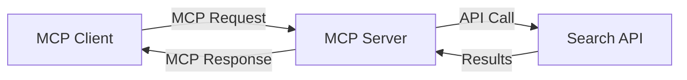
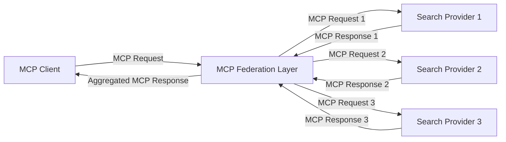
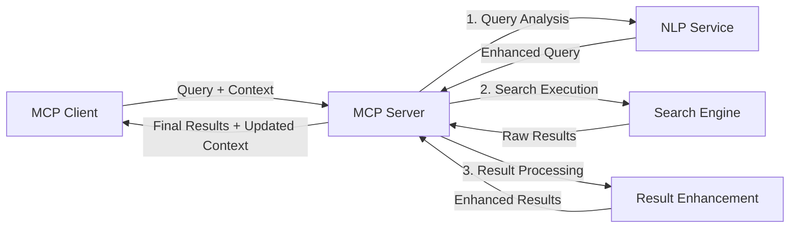

<!--
CO_OP_TRANSLATOR_METADATA:
{
  "original_hash": "333a03e51f90bdf3e6f1ba1694c73f36",
  "translation_date": "2025-07-17T06:56:53+00:00",
  "source_file": "05-AdvancedTopics/mcp-realtimesearch/README.md",
  "language_code": "fi"
}
-->
## Koodiesimerkkien vastuuvapauslauseke

> **Tärkeä huomio**: Alla olevat koodiesimerkit demonstroivat Model Context Protocolin (MCP) integrointia verkkohakutoiminnallisuuteen. Vaikka ne noudattavat virallisten MCP SDK:iden rakenteita ja malleja, ne on yksinkertaistettu opetustarkoituksiin.
> 
> Nämä esimerkit esittelevät:
> 
> 1. **Python-toteutus**: FastMCP-palvelimen toteutus, joka tarjoaa verkkohakutyökalun ja yhdistää ulkoiseen hakupalvelun API:in. Tämä esimerkki havainnollistaa elinkaaren hallintaa, kontekstin käsittelyä ja työkalun toteutusta noudattaen [virallisen MCP Python SDK:n](https://github.com/modelcontextprotocol/python-sdk) malleja. Palvelin käyttää suositeltua Streamable HTTP -kuljetusta, joka on korvannut vanhemman SSE-kuljetuksen tuotantokäytössä.
> 
> 2. **JavaScript-toteutus**: TypeScript/JavaScript-toteutus FastMCP-mallilla [virallisen MCP TypeScript SDK:n](https://github.com/modelcontextprotocol/typescript-sdk) pohjalta, jolla luodaan hakupalvelin asianmukaisilla työkalumäärittelyillä ja asiakasyhteyksillä. Toteutus noudattaa uusimpia suosituksia istunnon hallinnasta ja kontekstin säilyttämisestä.
> 
> Näissä esimerkeissä tarvitaan tuotantokäyttöön lisävirheenkäsittelyä, autentikointia ja tarkempaa API-integraatiokoodia. Näytetyt hakupalvelun API-päätepisteet (`https://api.search-service.example/search`) ovat paikkamerkkejä, jotka tulee korvata todellisilla hakupalvelun osoitteilla.
> 
> Täydelliset toteutustiedot ja ajantasaiset lähestymistavat löytyvät [virallisesta MCP-spesifikaatiosta](https://spec.modelcontextprotocol.io/) ja SDK-dokumentaatiosta.

## Keskeiset käsitteet

### Model Context Protocol (MCP) -kehys

MCP tarjoaa perustan AI-mallien, sovellusten ja palveluiden väliselle standardoidulle kontekstin vaihdolle. Reaaliaikaisessa verkkohakussa tämä kehys on välttämätön yhtenäisten, monivaiheisten hakukokemusten luomiseksi. Keskeisiä osia ovat:

1. **Asiakas-palvelin-arkkitehtuuri**: MCP erottaa selkeästi hakukyselyjen pyytäjät (asiakkaat) ja hakupalvelimet (tarjoajat), mahdollistaen joustavat käyttöönotot.

2. **JSON-RPC-viestintä**: Protokolla käyttää JSON-RPC:tä viestinvaihtoon, mikä tekee siitä yhteensopivan web-teknologioiden kanssa ja helpon toteuttaa eri alustoilla.

3. **Kontekstinhallinta**: MCP määrittelee rakenteelliset menetelmät hakukontekstin ylläpitoon, päivitykseen ja hyödyntämiseen useiden vuorovaikutusten aikana.

4. **Työkalumäärittelyt**: Hakutoiminnot tarjotaan standardoituna työkaluna, jolla on selkeät parametrit ja palautusarvot.

5. **Streaming-tuki**: Protokolla tukee tulosten suoratoistoa, mikä on olennaista reaaliaikaisessa haussa, jossa tulokset voivat saapua vaiheittain.

### Verkkohakuintegraation mallit

MCP:n yhdistäminen verkkohakuun noudattaa useita malleja:

#### 1. Suora hakupalveluntarjoajan integraatio

Tässä mallissa MCP-palvelin kommunikoi suoraan yhden tai useamman hakupalvelun API:n kanssa, muuntaen MCP-pyynnöt API-kohtaisiksi kutsuiksi ja muotoillen vastaukset MCP-muotoon.

#### 2. Hajautettu haku kontekstin säilytyksellä

Tämä malli jakaa hakukyselyt useille MCP-yhteensopiville hakupalveluntarjoajille, jotka voivat erikoistua eri sisältötyyppeihin tai hakutoimintoihin, säilyttäen kuitenkin yhtenäisen kontekstin.

#### 3. Kontekstilla rikastettu hakuketju

Tässä mallissa hakuprosessi jaetaan useaan vaiheeseen, joissa kontekstia rikastetaan jokaisessa vaiheessa, mikä johtaa asteittain relevantimpiin tuloksiin.

### Hakukontekstin osat

MCP-pohjaisessa verkkohakussa konteksti sisältää tyypillisesti:

- **Kyselyhistoria**: Istunnon aiemmat hakukyselyt
- **Käyttäjäasetukset**: Kieli, alue, turvallisen haun asetukset
- **Vuorovaikutushistoria**: Klikatut tulokset, tuloksiin käytetty aika
- **Hakuparametrit**: Suodattimet, lajittelujärjestykset ja muut hakumuokkaajat
- **Alaosaaminen**: Hakua koskeva aihekohtainen konteksti
- **Ajallinen konteksti**: Aikaperusteiset relevanssitekijät
- **Lähdeasetukset**: Luotetut tai suosikit tiedonlähteet

## Käyttötapaukset ja sovellukset

### Tutkimus ja tiedonhaku

MCP parantaa tutkimusprosesseja:

- Säilyttämällä tutkimuskontekstin hakusessioiden välillä
- Mahdollistamalla monimutkaisemmat ja kontekstuaalisesti relevantimmat haut
- Tukemalla monilähdehakujen yhdistämistä
- Helpottamalla tiedon poimintaa hakutuloksista

### Reaaliaikainen uutis- ja trendiseuranta

MCP-pohjainen haku tarjoaa etuja uutisseurannassa:

- Lähes reaaliaikainen uusien uutisaiheiden löytäminen
- Kontekstuaalinen suodatus relevantille tiedolle
- Aiheiden ja entiteettien seuranta useista lähteistä
- Personoidut uutisilmoitukset käyttäjän kontekstin perusteella

### AI:n tukema selaaminen ja tutkimus

MCP avaa uusia mahdollisuuksia AI-avusteiseen selaamiseen:

- Kontekstuaaliset hakuehdotukset selaimen nykyisen toiminnan perusteella
- Saumaton verkkohaku ja LLM-pohjaisten avustajien yhdistäminen
- Monivaiheinen hakujen tarkentaminen säilyttäen konteksti
- Parannettu faktantarkistus ja tiedon varmistus

## Tulevaisuuden suuntaukset ja innovaatiot

### MCP:n kehitys verkkohakussa

Tulevaisuudessa MCP:n odotetaan kehittyvän vastaamaan muun muassa:

- **Monimodaalinen haku**: Tekstin, kuvan, äänen ja videon haun yhdistäminen säilyttäen konteksti
- **Hajautettu haku**: Tuen tarjoaminen hajautetuille ja yhdistetyille hakuekosysteemeille
- **Hakujen yksityisyys**: Kontekstia huomioivat yksityisyyttä suojaavat hakumenetelmät  
- **Kyselyn ymmärtäminen**: Luonnollisen kielen hakukyselyjen syvä semanttinen jäsentäminen  

### Teknologian mahdolliset kehityssuunnat

Nousevat teknologiat, jotka muovaavat MCP-haun tulevaisuutta:

1. **Neuraaliset hakurakenteet**: Upotuksiin perustuvat hakujärjestelmät, jotka on optimoitu MCP:lle  
2. **Personoitu hakukonteksti**: Yksittäisten käyttäjien hakutottumusten oppiminen ajan myötä  
3. **Tietämyskaavioiden integrointi**: Kontekstuaalinen haku, jota tehostavat toimialakohtaiset tietämyskaaviot  
4. **Ristiinmodalinen konteksti**: Kontekstin ylläpito eri hakutavoissa  

## Käytännön harjoitukset

### Harjoitus 1: Perus MCP-hakuputken perustaminen

Tässä harjoituksessa opit:  
- Määrittämään perus MCP-hakuympäristön  
- Toteuttamaan kontekstinkäsittelijöitä verkkohakuun  
- Testaamaan ja varmistamaan kontekstin säilymisen hakukierrosten välillä  

### Harjoitus 2: Tutkimusavustajan rakentaminen MCP-haulla

Luo kokonainen sovellus, joka:  
- Käsittelee luonnollisen kielen tutkimuskysymyksiä  
- Suorittaa kontekstia huomioivia verkkohakuja  
- Yhdistää tietoa useista lähteistä  
- Esittää järjestetyt tutkimustulokset  

### Harjoitus 3: Monilähdehaun yhdistäminen MCP:llä

Edistynyt harjoitus, joka kattaa:  
- Kontekstia huomioivan kyselyjen ohjauksen useille hakukoneille  
- Tulosten lajittelun ja yhdistämisen  
- Hakutulosten kontekstuaalisen päällekkäisyyksien poiston  
- Lähdekohtaisen metadatan käsittelyn  

## Lisäresurssit

- [Model Context Protocol Specification](https://spec.modelcontextprotocol.io/) - Virallinen MCP-spesifikaatio ja yksityiskohtainen protokolladokumentaatio  
- [Model Context Protocol Documentation](https://modelcontextprotocol.io/) - Yksityiskohtaiset opetusohjelmat ja toteutusohjeet  
- [MCP Python SDK](https://github.com/modelcontextprotocol/python-sdk) - MCP-protokollan virallinen Python-toteutus  
- [MCP TypeScript SDK](https://github.com/modelcontextprotocol/typescript-sdk) - MCP-protokollan virallinen TypeScript-toteutus  
- [MCP Reference Servers](https://github.com/modelcontextprotocol/servers) - MCP-palvelinten referenssitoteutukset  
- [Bing Web Search API Documentation](https://learn.microsoft.com/en-us/bing/search-apis/bing-web-search/overview) - Microsoftin verkkohaku-API  
- [Google Custom Search JSON API](https://developers.google.com/custom-search/v1/overview) - Googlen ohjelmoitava hakukone  
- [SerpAPI Documentation](https://serpapi.com/search-api) - Hakukoneiden tulossivujen API  
- [Meilisearch Documentation](https://www.meilisearch.com/docs) - Avoimen lähdekoodin hakukone  
- [Elasticsearch Documentation](https://www.elastic.co/guide/index.html) - Hajautettu haku- ja analytiikkamoottori  
- [LangChain Documentation](https://python.langchain.com/docs/get_started/introduction) - Sovellusten rakentaminen LLM:ien avulla  

## Oppimistulokset

Tämän moduulin suorittamisen jälkeen osaat:  

- Ymmärtää reaaliaikaisen verkkohakujen perusteet ja haasteet  
- Selittää, miten Model Context Protocol (MCP) parantaa reaaliaikaista verkkohakua  
- Toteuttaa MCP-pohjaisia hakuratkaisuja suosituilla kehyksillä ja API:illa  
- Suunnitella ja ottaa käyttöön skaalautuvia, suorituskykyisiä hakurakenteita MCP:llä  
- Soveltaa MCP-konsepteja erilaisiin käyttötapauksiin, kuten semanttiseen hakuun, tutkimusavustukseen ja tekoälyavusteiseen selaamiseen  
- Arvioida MCP-pohjaisen haun nousevia trendejä ja tulevia innovaatioita  

### Luottamus- ja turvallisuusnäkökohdat

Kun toteutat MCP-pohjaisia verkkohakuratkaisuja, muista nämä MCP-spesifikaation tärkeät periaatteet:  

1. **Käyttäjän suostumus ja hallinta**: Käyttäjien on annettava selkeä suostumus ja ymmärrettävä kaikki tietojen käyttö ja toiminnot. Tämä on erityisen tärkeää verkkohakujen toteutuksissa, jotka voivat käyttää ulkoisia tietolähteitä.  

2. **Tietosuoja**: Varmista hakukyselyjen ja -tulosten asianmukainen käsittely, erityisesti jos ne voivat sisältää arkaluonteista tietoa. Toteuta asianmukaiset käyttöoikeudet käyttäjätietojen suojaamiseksi.  

3. **Työkalujen turvallisuus**: Toteuta asianmukainen valtuutus ja validointi hakutyökaluille, sillä ne voivat aiheuttaa turvallisuusriskejä mielivaltaisen koodin suorittamisen kautta. Työkalujen toimintakuvausten tulee olla epäluotettavia, ellei ne ole peräisin luotettavalta palvelimelta.  

4. **Selkeä dokumentaatio**: Tarjoa selkeää dokumentaatiota MCP-pohjaisen hakutoteutuksesi ominaisuuksista, rajoituksista ja turvallisuusnäkökohdista MCP-spesifikaation toteutusohjeiden mukaisesti.  

5. **Vahvat suostumusprosessit**: Rakenna vahvat suostumus- ja valtuutusprosessit, jotka selkeästi kertovat, mitä kukin työkalu tekee ennen sen käyttöoikeuden myöntämistä, erityisesti työkaluissa, jotka käyttävät ulkoisia verkkoresursseja.  

MCP:n turvallisuus- ja luottamusnäkökohdista löydät täydelliset tiedot [virallisesta dokumentaatiosta](https://modelcontextprotocol.io/specification/2025-03-26#security-and-trust-%26-safety).  

## Mitä seuraavaksi

- [5.12 Entra ID Authentication for Model Context Protocol Servers](../mcp-security-entra/README.md)

**Vastuuvapauslauseke**:  
Tämä asiakirja on käännetty käyttämällä tekoälypohjaista käännöspalvelua [Co-op Translator](https://github.com/Azure/co-op-translator). Vaikka pyrimme tarkkuuteen, huomioithan, että automaattikäännöksissä saattaa esiintyä virheitä tai epätarkkuuksia. Alkuperäistä asiakirjaa sen alkuperäiskielellä tulee pitää virallisena lähteenä. Tärkeissä tiedoissa suositellaan ammattimaista ihmiskäännöstä. Emme ole vastuussa tämän käännöksen käytöstä aiheutuvista väärinymmärryksistä tai tulkinnoista.