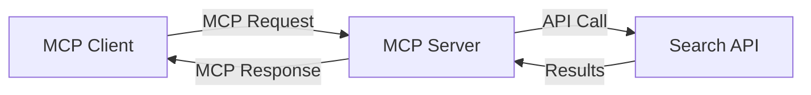
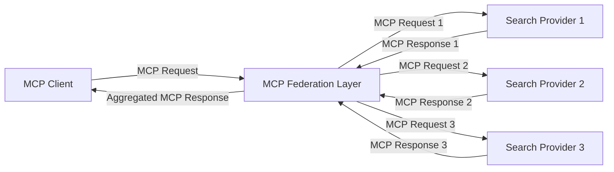
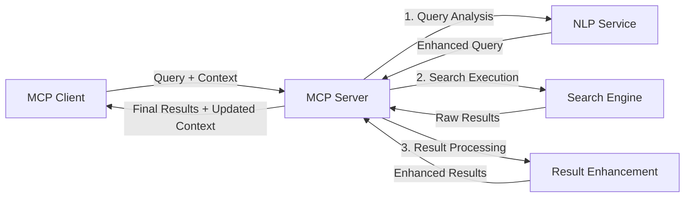

<!--
CO_OP_TRANSLATOR_METADATA:
{
  "original_hash": "eb12652eb7bd17f2193b835a344425c6",
  "translation_date": "2025-06-26T14:08:24+00:00",
  "source_file": "05-AdvancedTopics/mcp-realtimesearch/README.md",
  "language_code": "fi"
}
-->
## Koodiesimerkkien vastuuvapauslauseke

> **Tärkeä huomautus**: Alla olevat koodiesimerkit demonstroivat Model Context Protocolin (MCP) integrointia verkkohakutoimintoihin. Vaikka ne noudattavat virallisten MCP SDK:iden rakenteita ja malleja, ne on yksinkertaistettu opetustarkoituksiin.
> 
> Näissä esimerkeissä esitellään:
> 
> 1. **Python-toteutus**: FastMCP-palvelin, joka tarjoaa verkkohakutyökalun ja yhdistyy ulkoiseen hakupalvelun rajapintaan. Tämä esimerkki osoittaa oikean elinkaaren hallinnan, kontekstinhallinnan ja työkalun toteutuksen noudattaen [virallisen MCP Python SDK:n](https://github.com/modelcontextprotocol/python-sdk) malleja. Palvelin käyttää suositeltua Streamable HTTP -kuljetusta, joka on korvannut vanhemman SSE-kuljetuksen tuotantokäytössä.
> 
> 2. **JavaScript-toteutus**: TypeScript/JavaScript-toteutus, joka hyödyntää FastMCP-mallia [virallisesta MCP TypeScript SDK:sta](https://github.com/modelcontextprotocol/typescript-sdk) luodakseen hakupalvelimen asianmukaisilla työkalumäärittelyillä ja asiakasliitännöillä. Se noudattaa viimeisimpiä suosituksia istunnon hallinnasta ja kontekstin säilyttämisestä.
> 
> Nämä esimerkit vaativat tuotantokäyttöön lisävirheenkäsittelyä, autentikointia ja rajapintaintegraatiota. Näytetyt hakupalvelun API-päätepisteet (`https://api.search-service.example/search`) ovat paikkamerkkejä, jotka tulee korvata todellisilla hakupalvelun päätepisteillä.
> 
> Täydellisten toteutustietojen ja ajantasaisimpien lähestymistapojen osalta tutustu [viralliseen MCP-määritykseen](https://spec.modelcontextprotocol.io/) ja SDK-dokumentaatioon.

## Keskeiset käsitteet

### Model Context Protocol (MCP) -kehys

Perustana Model Context Protocol tarjoaa standardoidun tavan AI-mallien, sovellusten ja palveluiden väliseen kontekstin vaihtoon. Reaaliaikaisessa verkkohakussa tämä kehys on välttämätön luotaessa johdonmukaisia, monikierroksisia hakukokemuksia. Keskeisiä osia ovat:

1. **Asiakas-palvelin-arkkitehtuuri**: MCP erottaa selkeästi hakukyselyjen pyytäjät (asiakkaat) ja hakupalvelinten tarjoajat, mahdollistaen joustavat käyttöönotot.

2. **JSON-RPC -viestintä**: Protokolla käyttää JSON-RPC:ta viestinvaihtoon, mikä tekee siitä yhteensopivan web-teknologioiden kanssa ja helpon toteuttaa eri alustoilla.

3. **Kontekstinhallinta**: MCP määrittelee rakenteelliset menetelmät hakukontekstin ylläpitoon, päivitykseen ja hyödyntämiseen useiden vuorovaikutusten aikana.

4. **Työkalumäärittelyt**: Hakutoiminnot tarjotaan standardoituna työkaluna, joilla on selkeät parametrit ja palautusarvot.

5. **Streaming-tuki**: Protokolla tukee tulosten suoratoistoa, mikä on olennaista reaaliaikaisessa haussa, jossa tulokset saattavat saapua vaiheittain.

### Verkkohakuintegraation mallit

Kun MCP integroidaan verkkohakuun, useita malleja nousee esiin:

#### 1. Suora hakupalveluntarjoajan integraatio

Tässä mallissa MCP-palvelin kommunikoi suoraan yhden tai useamman hakupalvelun API:n kanssa, kääntäen MCP-pyynnöt API-kohtaisiksi kutsuiksi ja muotoillen tulokset MCP-vastauksiksi.

#### 2. Hajautettu haku kontekstin säilytyksellä

Tässä mallissa hakukyselyt jaetaan useille MCP-yhteensopiville hakupalveluntarjoajille, joista kukin voi erikoistua eri sisältötyyppeihin tai hakutoimintoihin, samalla säilyttäen yhtenäisen kontekstin.

#### 3. Kontekstilla rikastettu hakuketju

Tässä mallissa hakuprosessi jaetaan useaan vaiheeseen, joissa kontekstia rikastetaan jokaisessa vaiheessa, mikä johtaa asteittain osuvampiin tuloksiin.

### Hakukontekstin osat

MCP-pohjaisessa verkkohakussa konteksti sisältää tyypillisesti:

- **Kyselyhistoria**: Istunnon aiemmat hakukyselyt
- **Käyttäjäasetukset**: Kieli, alue, turvallisen haun asetukset
- **Vuorovaikutushistoria**: Klikatut tulokset, tuloksiin käytetty aika
- **Hakuparametrit**: Suodattimet, lajittelujärjestykset ja muut hakumuokkaimet
- **Alaosaaminen**: Hakua koskeva aihekohtainen konteksti
- **Ajallinen konteksti**: Aikaperusteiset relevanssitekijät
- **Lähteiden mieltymykset**: Luotetut tai suosikit tiedonlähteet

## Käyttötapaukset ja sovellukset

### Tutkimus ja tiedonhaku

MCP parantaa tutkimustyötä:

- Säilyttämällä tutkimuskontekstin hakusessioiden välillä
- Mahdollistamalla monipuolisemmat ja kontekstuaalisesti merkitykselliset haut
- Tukemalla monilähdehakujen yhdistämistä
- Helpottamalla tiedon poimintaa hakutuloksista

### Reaaliaikainen uutisten ja trendien seuranta

MCP-pohjainen haku tarjoaa etuja uutisseurannassa:

- Lähes reaaliaikainen uusien uutisten löytäminen
- Relevantin tiedon kontekstuaalinen suodatus
- Aiheiden ja entiteettien seuranta useista lähteistä
- Personoidut uutisilmoitukset käyttäjän kontekstin perusteella

### AI:n tukema selaaminen ja tutkimus

MCP avaa uusia mahdollisuuksia AI-avusteiseen selaamiseen:

- Kontekstuaaliset hakuehdotukset nykyisen selaustoiminnan perusteella
- Verkkohakujen saumaton integrointi LLM-avusteisiin assistentteihin
- Monikierroksinen hakujen tarkentaminen kontekstin säilyttämisellä
- Parannettu faktantarkistus ja tiedon varmennus

## Tulevaisuuden suuntaukset ja innovaatiot

### MCP:n kehitys verkkohakussa

Tulevaisuudessa MCP:n odotetaan kehittyvän käsittelemään:

- **Monimuotoinen haku**: Tekstin, kuvan, äänen ja videon haku kontekstin säilyttämisellä
- **Hajautettu haku**: Tukea hajautetuille ja yhdistetyille hakuekosysteemeille
- **Haun yksityisyys**: Kontekstia hyödyntävät yksityisyyttä suojaavat hakumenetelmät
- **Kyselyn ymmärrys**: Syvällinen semanttinen luonnollisen kielen hakukyselyiden jäsentäminen

### Teknologian mahdolliset edistysaskeleet

Nousevat teknologiat, jotka muokkaavat MCP-hakujen tulevaisuutta:

1. **Neuraaliset hakuarkkitehtuurit**: Upotuksiin perustuvat hakujärjestelmät, jotka on optimoitu MCP:lle
2. **Personoitu hakukonteksti**: Yksilöllisten käyttäjähakumallien oppiminen ajan myötä
3. **Tietämysgraafien integrointi**: Alaosaamiseen perustuva kontekstuaalinen haku tietämysgraafien avulla
4. **Ristimodaalinen konteksti**: Kontekstin ylläpito eri hakutavoissa

## Käytännön harjoitukset

### Harjoitus 1: Perus MCP-hakuputken perustaminen

Tässä harjoituksessa opit:
- Määrittämään perus MCP-hakuympäristön
- Toteuttamaan kontekstinhallinnan verkkohakuun
- Testaamaan ja validoimaan kontekstin säilymisen hakukierrosten välillä

### Harjoitus 2: Tutkimusavustajan rakentaminen MCP-haulla

Luo kokonainen sovellus, joka:
- Käsittelee luonnollisen kielen tutkimuskysymyksiä
- Suorittaa kontekstuaalisia verkkohakuja
- Yhdistää tietoa useista lähteistä
- Esittää järjestetyt tutkimustulokset

### Harjoitus 3: Monilähdehaun toteutus MCP:llä

Edistynyt harjoitus, joka kattaa:
- Kontekstia hyödyntävän kyselyjen ohjauksen useille hakukoneille
- Tulosten lajittelun ja yhdistämisen
- Hakutulosten kontekstuaalisen päällekkäisyyden poiston
- Lähdekohtaisen metadatan käsittelyn

## Lisäresurssit

- [Model Context Protocol Specification](https://spec.modelcontextprotocol.io/) – Virallinen MCP-määritys ja yksityiskohtainen protokolladokumentaatio
- [Model Context Protocol Documentation](https://modelcontextprotocol.io/) – Yksityiskohtaiset opetusohjelmat ja toteutusohjeet
- [MCP Python SDK](https://github.com/modelcontextprotocol/python-sdk) – Virallinen MCP-protokollan Python-toteutus
- [MCP TypeScript SDK](https://github.com/modelcontextprotocol/typescript-sdk) – Virallinen MCP-protokollan TypeScript-toteutus
- [MCP Reference Servers](https://github.com/modelcontextprotocol/servers) – MCP-palvelinten referenssitoteutukset
- [Bing Web Search API Documentation](https://learn.microsoft.com/en-us/bing/search-apis/bing-web-search/overview) – Microsoftin verkkohaku-API
- [Google Custom Search JSON API](https://developers.google.com/custom-search/v1/overview) – Googlen ohjelmoitava hakukone
- [SerpAPI Documentation](https://serpapi.com/search-api) – Hakukoneiden tulossivujen API
- [Meilisearch Documentation](https://www.meilisearch.com/docs) – Avoimen lähdekoodin hakukone
- [Elasticsearch Documentation](https://www.elastic.co/guide/index.html) – Hajautettu haku- ja analytiikkamoottori
- [LangChain Documentation](https://python.langchain.com/docs/get_started/introduction) – Sovellusten rakentaminen LLM:ien avulla

## Oppimistavoitteet

Tämän moduulin suorittamisen jälkeen osaat:

- Ymmärtää reaaliaikaisen verkkohakujen perusteet ja haasteet
- Selittää, miten Model Context Protocol (MCP) parantaa reaaliaikaisia verkkohakutoimintoja
- Toteuttaa MCP-pohjaisia hakuratkaisuja suosituilla kehyksillä ja API:illa
- Suunnitella ja ottaa käyttöön skaalautuvia, suorituskykyisiä hakujärjestelmiä MCP:n avulla
- Soveltaa MCP:n käsitteitä erilaisiin käyttötapauksiin, kuten semanttiseen hakuun, tutkimusavustukseen ja AI-tukeen selaamisessa
- Arvioida nousevia trendejä ja tulevia innovaatioita MCP-pohjaisissa hakuteknologioissa

### Luottamus- ja turvallisuusnäkökohdat

Kun toteutat MCP-pohjaisia verkkohakuratkaisuja, muista nämä MCP-määrityksen tärkeät periaatteet:

1. **Käyttäjän suostumus ja hallinta**: Käyttäjän tulee antaa selkeä suostumus ja ymmärtää kaikki tietojen käyttö ja toiminnot. Tämä on erityisen tärkeää verkkohakujen toteutuksissa, jotka voivat käyttää ulkoisia tietolähteitä.

2. **Tietosuoja**: Huolehdi hakukyselyjen ja -tulosten asianmukaisesta käsittelystä, erityisesti jos ne sisältävät arkaluonteista tietoa. Toteuta riittävät käyttöoikeuksien hallintamekanismit käyttäjätietojen suojaamiseksi.

3. **Työkalujen turvallisuus**: Varmista hakutyökalujen asianmukainen valtuutus ja validointi, sillä ne voivat aiheuttaa turvallisuusriskin mielivaltaisen koodin suorittamisen kautta. Työkalujen kuvaukset tulee pitää epäluotettavina, ellei ne ole peräisin luotettavalta palvelimelta.

4. **Selkeä dokumentaatio**: Tarjoa selkeää dokumentaatiota MCP-pohjaisen hakutoteutuksen kyvyistä, rajoituksista ja turvallisuusnäkökohtista, noudattaen MCP-määrityksen toteutusohjeita.

5. **Luotettavat suostumusprosessit**: Rakenna vahvat suostumus- ja valtuutusprosessit, jotka selkeästi kertovat, mitä kukin työkalu tekee ennen sen käyttöön myöntämistä, erityisesti työkaluissa, jotka käyttävät ulkoisia verkkoresursseja.

Täydelliset tiedot MCP:n turvallisuus- ja luottamusnäkökohtiin löydät [virallisesta dokumentaatiosta](https://modelcontextprotocol.io/specification/2025-03-26#security-and-trust-%26-safety).

## Mitä seuraavaksi

- [5.11 Entra ID -todennus Model Context Protocol -palvelimille](../mcp-security-entra/README.md)

**Vastuuvapauslauseke**:  
Tämä asiakirja on käännetty käyttämällä tekoälypohjaista käännöspalvelua [Co-op Translator](https://github.com/Azure/co-op-translator). Pyrimme tarkkuuteen, mutta huomioithan, että automaattikäännöksissä saattaa esiintyä virheitä tai epätarkkuuksia. Alkuperäinen asiakirja omalla kielellään on virallinen lähde. Tärkeissä asioissa suositellaan ammattimaista ihmiskäännöstä. Emme ole vastuussa tämän käännöksen käytöstä aiheutuvista väärinymmärryksistä tai tulkinnoista.