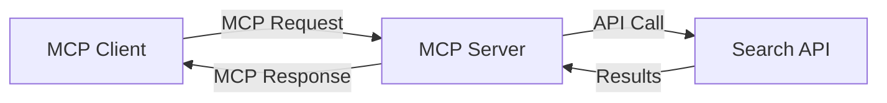
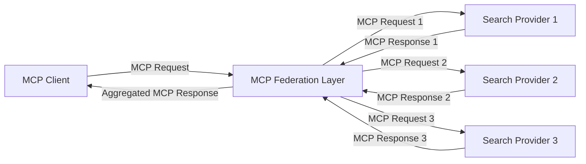
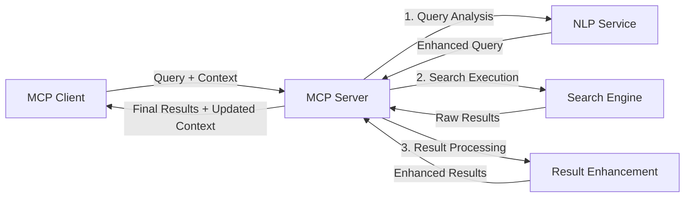

<!--
CO_OP_TRANSLATOR_METADATA:
{
  "original_hash": "16bef2c93c6a86d4ca6a8ce9e120e384",
  "translation_date": "2025-06-13T02:51:46+00:00",
  "source_file": "05-AdvancedTopics/mcp-realtimesearch/README.md",
  "language_code": "fi"
}
-->
## Koodiesimerkit Vastuuvapauslauseke

> **Tärkeä Huomautus**: Alla olevat koodiesimerkit havainnollistavat Model Context Protocolin (MCP) integrointia verkkohakutoiminnallisuuteen. Vaikka ne noudattavat virallisten MCP SDK:iden rakenteita ja malleja, ne on yksinkertaistettu opetustarkoituksiin.
> 
> Esimerkeissä esitellään:
> 
> 1. **Python-toteutus**: FastMCP-palvelin, joka tarjoaa verkkohakutyökalun ja yhdistää ulkoiseen hakupalvelun API:iin. Tämä esimerkki näyttää oikean elinkaaren hallinnan, kontekstinhallinnan ja työkalun toteutuksen noudattaen [virallisen MCP Python SDK:n](https://github.com/modelcontextprotocol/python-sdk) malleja. Palvelin käyttää suositeltua Streamable HTTP -siirtomekanismia, joka on korvannut vanhemman SSE-siirron tuotantokäytössä.
> 
> 2. **JavaScript-toteutus**: TypeScript/JavaScript-toteutus, joka hyödyntää FastMCP-mallia [virallisesta MCP TypeScript SDK:sta](https://github.com/modelcontextprotocol/typescript-sdk) luodakseen hakupalvelimen oikeilla työkalumäärittelyillä ja asiakasyhteyksillä. Toteutus noudattaa uusimpia suositeltuja malleja istunnon hallinnassa ja kontekstin säilyttämisessä.
> 
> Nämä esimerkit vaativat tuotantokäytössä lisää virheenkäsittelyä, autentikointia ja tarkkaa API-integraatiota. Näytetyt hakupalvelun API-päätepisteet (`https://api.search-service.example/search`) ovat paikkamerkkejä, jotka tulee korvata oikeilla hakupalvelun osoitteilla.
> 
> Täydelliset toteutustiedot ja ajantasaiset lähestymistavat löytyvät [virallisesta MCP-spesifikaatiosta](https://spec.modelcontextprotocol.io/) ja SDK-dokumentaatiosta.

## Keskeiset Käsitteet

### Model Context Protocol (MCP) -kehys

MCP tarjoaa vakiomuotoisen tavan AI-mallien, sovellusten ja palveluiden väliseen kontekstin vaihtoon. Reaaliaikaisessa verkkohakussa tämä kehys on välttämätön luomaan yhtenäisiä, monivaiheisia hakukokemuksia. Keskeisiä osia ovat:

1. **Asiakas-palvelin-arkkitehtuuri**: MCP erottaa selkeästi hakukyselyjen pyytäjät (asiakkaat) ja hakupalvelimet (tarjoajat), mahdollistaen joustavat käyttöönotot.

2. **JSON-RPC-viestintä**: Protokolla käyttää JSON-RPC:tä viestinvaihtoon, mikä tekee siitä yhteensopivan web-teknologioiden kanssa ja helpon toteuttaa eri alustoilla.

3. **Kontekstinhallinta**: MCP määrittelee rakenteelliset menetelmät hakukontekstin ylläpitoon, päivitykseen ja hyödyntämiseen useiden vuorovaikutusten aikana.

4. **Työkalumäärittelyt**: Hakutoiminnot tarjotaan vakiomuotoisina työkaluina, joilla on selkeät parametrit ja paluuarvot.

5. **Virtaustuki**: Protokolla tukee tulosten suoratoistoa, mikä on olennaista reaaliaikaisessa haussa, jossa tulokset saattavat saapua vaiheittain.

### Verkkohakuintegrointimallit

MCP:n yhdistäminen verkkohakuun noudattaa useita malleja:

#### 1. Suora Hakupalveluntarjoajan Integraatio

Tässä mallissa MCP-palvelin kommunikoi suoraan yhden tai useamman hakupalvelun API:n kanssa, muuntaen MCP-pyynnöt API-kohtaisiksi kutsuiksi ja muotoillen tulokset MCP-vastauksiksi.

#### 2. Liitetty Haku Kontekstin Säilyttämisellä

Tämä malli jakaa hakukyselyt useille MCP-yhteensopiville hakupalveluille, jotka voivat erikoistua eri sisältöihin tai hakutoimintoihin, mutta säilyttää yhtenäisen kontekstin.

#### 3. Kontekstilla Parannettu Hakuketju

Tässä mallissa hakuprosessi jaetaan useaan vaiheeseen, joissa kontekstia rikastetaan jokaisessa vaiheessa, mikä johtaa asteittain osuvampiin tuloksiin.

### Hakukontekstin Osat

MCP-pohjaisessa verkkohakussa konteksti sisältää tyypillisesti:

- **Kyselyhistoria**: Aiemmat hakukyselyt istunnon aikana
- **Käyttäjäasetukset**: Kieli, alue, turvallisen haun asetukset
- **Vuorovaikutushistoria**: Klikatut tulokset, tulosten parissa vietetty aika
- **Hakuparametrit**: Suodattimet, lajittelujärjestykset ja muut hakumuokkaajat
- **Alaosaaminen**: Hakua koskeva aihekohtainen konteksti
- **Ajallinen Konteksti**: Aikaan perustuvat merkityksellisyystekijät
- **Lähdeasetukset**: Luotetut tai suosikit tiedonlähteet

## Käyttötapaukset ja Sovellukset

### Tutkimus ja Tiedonkeruu

MCP parantaa tutkimustyötä:

- Säilyttämällä tutkimuskontekstin hakusessioiden yli
- Mahdollistamalla kehittyneempiä ja kontekstuaalisesti osuvia kyselyjä
- Tukemalla monilähteistä hakuliittoutumista
- Helpottamalla tiedon poimintaa hakutuloksista

### Reaaliaikainen Uutisten ja Trendien Seuranta

MCP-pohjainen haku tarjoaa etuja uutisseurannassa:

- Lähes reaaliaikainen nousevien uutisten löytäminen
- Kontekstuaalinen suodatus olennaisesta tiedosta
- Aiheryhmien ja entiteettien seuranta useista lähteistä
- Henkilökohtaiset uutishälytykset käyttäjän kontekstin perusteella

### AI-avusteinen Selaaminen ja Tutkimus

MCP luo uusia mahdollisuuksia AI-avusteiseen selaamiseen:

- Kontekstuaaliset hakuehdotukset nykyisen selainaktiviteetin perusteella
- Verkkohakujen saumaton integrointi LLM-pohjaisten avustajien kanssa
- Monivaiheinen haun tarkentaminen säilytetyn kontekstin avulla
- Parannettu faktantarkistus ja tiedon varmistus

## Tulevaisuuden Suuntaukset ja Innovaatiot

### MCP:n Kehitys Verkkohakussa

Tulevaisuudessa MCP kehittyy vastaamaan mm.:

- **Monimuotoinen Haku**: Teksti-, kuva-, ääni- ja videohaun integrointi säilyttäen kontekstin
- **Hajautettu Haku**: Tuen tarjoaminen hajautetuille ja liitetyille hakujärjestelmille
- **Haun Yksityisyys**: Kontekstia hyödyntävät yksityisyyttä suojaavat hakumenetelmät
- **Kyselyn Ymmärtäminen**: Syvällinen semanttinen luonnollisen kielen kyselyjen tulkinta

### Teknologian Mahdolliset Kehityssuunnat

Nousevat teknologiat, jotka muokkaavat MCP-haun tulevaisuutta:

1. **Neuraaliset Hakurakenteet**: Upotuksiin perustuvat hakujärjestelmät, jotka on optimoitu MCP:lle
2. **Personoitu Hakukonteksti**: Yksilöllisten käyttäjähaumallien oppiminen ajan myötä
3. **Tietämysgraafien Integraatio**: Kontekstuaalinen haku, jota tehostavat aihekohtaiset tietämysgraafit
4. **Ristimuotoinen Konteksti**: Kontekstin ylläpito eri hakumuotojen välillä

## Käytännön Harjoitukset

### Harjoitus 1: Perus MCP-hakuputken Luominen

Tässä harjoituksessa opit:
- Konfiguroimaan perustason MCP-hakuympäristön
- Toteuttamaan kontekstinkäsittelijät verkkohakuun
- Testaamaan ja varmistamaan kontekstin säilymisen hakukierrosten välillä

### Harjoitus 2: Tutkimusavustajan Rakentaminen MCP-haulla

Luo kokonainen sovellus, joka:
- Käsittelee luonnollisen kielen tutkimuskysymyksiä
- Suorittaa kontekstuaalisia verkkohakuja
- Yhdistää tietoa useista lähteistä
- Esittelee järjestettyjä tutkimustuloksia

### Harjoitus 3: Monilähteisen Hakuliittoutuman Toteutus MCP:llä

Edistynyt harjoitus, joka kattaa:
- Kontekstin mukaisen kyselyjen ohjauksen useille hakukoneille
- Tulosten järjestämisen ja yhdistämisen
- Kontekstuaalisen päällekkäisyyksien poiston hakutuloksista
- Lähdekohtaisen metadatan käsittelyn

## Lisäresurssit

- [Model Context Protocol Spesifikaatio](https://spec.modelcontextprotocol.io/) - Virallinen MCP-spesifikaatio ja yksityiskohtainen protokolladokumentaatio
- [Model Context Protocol Dokumentaatio](https://modelcontextprotocol.io/) - Yksityiskohtaiset opetusohjelmat ja toteutusohjeet
- [MCP Python SDK](https://github.com/modelcontextprotocol/python-sdk) - Virallinen MCP-protokollan Python-toteutus
- [MCP TypeScript SDK](https://github.com/modelcontextprotocol/typescript-sdk) - Virallinen MCP-protokollan TypeScript-toteutus
- [MCP Referenssipalvelimet](https://github.com/modelcontextprotocol/servers) - MCP-palvelinten referenssitoteutukset
- [Bing Web Search API Dokumentaatio](https://learn.microsoft.com/en-us/bing/search-apis/bing-web-search/overview) - Microsoftin verkkohaku-API
- [Google Custom Search JSON API](https://developers.google.com/custom-search/v1/overview) - Googlen ohjelmoitava hakukone
- [SerpAPI Dokumentaatio](https://serpapi.com/search-api) - Hakukoneen tulossivujen API
- [Meilisearch Dokumentaatio](https://www.meilisearch.com/docs) - Avoimen lähdekoodin hakukone
- [Elasticsearch Dokumentaatio](https://www.elastic.co/guide/index.html) - Hajautettu haku- ja analytiikkamoottori
- [LangChain Dokumentaatio](https://python.langchain.com/docs/get_started/introduction) - Sovellusten rakentaminen LLM:illä

## Oppimistulokset

Tämän moduulin suorittamisen jälkeen osaat:

- Ymmärtää reaaliaikaisen verkkohakujen perusteet ja haasteet
- Selittää, miten Model Context Protocol (MCP) parantaa reaaliaikaista verkkohakua
- Toteuttaa MCP-pohjaisia hakuratkaisuja suosituilla kehyksillä ja API:illa
- Suunnitella ja ottaa käyttöön skaalautuvia, suorituskykyisiä hakujärjestelmiä MCP:llä
- Soveltaa MCP-konsepteja eri käyttötapauksiin, kuten semanttiseen hakuun, tutkimusavustajiin ja AI-avusteiseen selaamiseen
- Arvioida MCP-pohjaisen haun uusia suuntauksia ja tulevia innovaatioita

### Luottamus- ja Turvallisuusnäkökohdat

MCP-pohjaisia verkkohakuratkaisuja toteuttaessasi muista nämä MCP-spesifikaation tärkeät periaatteet:

1. **Käyttäjän Suostumus ja Hallinta**: Käyttäjän tulee antaa selkeä suostumus ja ymmärtää kaikki tiedon käyttö ja toiminnot. Tämä on erityisen tärkeää verkkohakutoteutuksissa, jotka saattavat käyttää ulkoisia tietolähteitä.

2. **Tietosuoja**: Varmista hakukyselyjen ja tulosten asianmukainen käsittely, erityisesti jos ne sisältävät arkaluontoista tietoa. Toteuta asianmukaiset käyttöoikeudet käyttäjätietojen suojaamiseksi.

3. **Työkalujen Turvallisuus**: Toteuta asianmukainen valtuutus ja validointi hakutyökaluille, koska ne voivat aiheuttaa turvallisuusriskejä satunnaisen koodin suorittamisen kautta. Työkalujen käyttäytymiskuvaukset tulee pitää epäluotettavina, ellei ne ole peräisin luotetusta palvelimesta.

4. **Selkeä Dokumentaatio**: Tarjoa selkeät ohjeet MCP-pohjaisen hakutoteutuksen kyvyistä, rajoituksista ja turvallisuusnäkökohdista MCP-spesifikaation toteutusohjeiden mukaisesti.

5. **Vahvat Suostumusprosessit**: Rakenna vahvat suostumus- ja valtuutusprosessit, jotka selkeästi kuvaavat kunkin työkalun toiminnan ennen sen käyttöönottoa, erityisesti työkaluissa, jotka käyttävät ulkoisia verkkolähteitä.

Täydelliset tiedot MCP:n turvallisuus- ja luottamusnäkökohdista löytyvät [virallisesta dokumentaatiosta](https://modelcontextprotocol.io/specification/2025-03-26#security-and-trust-%26-safety).

## Mitä seuraavaksi

- [6. Yhteisön Panokset](../../06-CommunityContributions/README.md)

**Vastuuvapauslauseke**:  
Tämä asiakirja on käännetty tekoälypohjaisella käännöspalvelulla [Co-op Translator](https://github.com/Azure/co-op-translator). Pyrimme tarkkuuteen, mutta huomioithan, että automaattikäännöksissä saattaa esiintyä virheitä tai epätarkkuuksia. Alkuperäistä asiakirjaa sen alkuperäiskielellä tulee pitää virallisena lähteenä. Tärkeiden tietojen osalta suositellaan ammattimaista ihmiskäännöstä. Emme ole vastuussa tämän käännöksen käytöstä aiheutuvista väärinymmärryksistä tai tulkinnoista.