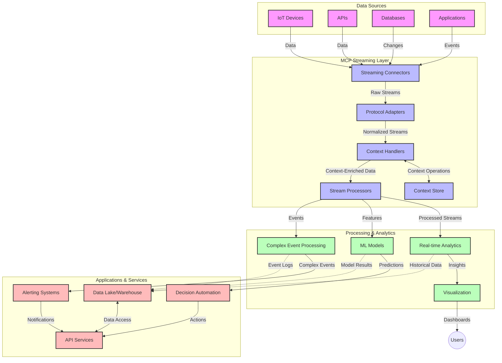

<!--
CO_OP_TRANSLATOR_METADATA:
{
  "original_hash": "b41174ac781ebf228b2043cbdfc09105",
  "translation_date": "2025-06-12T00:37:36+00:00",
  "source_file": "05-AdvancedTopics/mcp-realtimestreaming/README.md",
  "language_code": "fi"
}
-->
# Model Context Protocol reaaliaikaisen datavirran käsittelyyn

## Yleiskatsaus

Reaaliaikainen datavirta on nykymaailmassa välttämätöntä, kun yritykset ja sovellukset tarvitsevat välitöntä pääsyä tietoihin tehdäkseen oikea-aikaisia päätöksiä. Model Context Protocol (MCP) edustaa merkittävää kehitystä näiden reaaliaikaisten virtausten optimoinnissa, parantaen datankäsittelyn tehokkuutta, säilyttäen kontekstin eheyttä ja kohentaen järjestelmän kokonais-suorituskykyä.

Tässä moduulissa tarkastellaan, miten MCP muuttaa reaaliaikaista datavirtaa tarjoamalla standardoidun tavan hallita kontekstia AI-mallien, suoratoistoalustojen ja sovellusten välillä.

## Johdanto reaaliaikaiseen datavirtaan

Reaaliaikainen datavirta on teknologinen malli, joka mahdollistaa datan jatkuvan siirron, käsittelyn ja analysoinnin sitä syntyessä, jolloin järjestelmät voivat reagoida välittömästi uuteen tietoon. Toisin kuin perinteinen eräajokäsittely, joka toimii staattisilla tietojoukoilla, suoratoisto käsittelee liikkuvaa dataa tarjoten näkemyksiä ja toimenpiteitä mahdollisimman vähäisellä viiveellä.

### Reaaliaikaisen datavirran keskeiset käsitteet:

- **Jatkuva datavirta**: Dataa käsitellään jatkuvana, loputtomana tapahtuma- tai tietuevirtana.
- **Matala viive**: Järjestelmät on suunniteltu minimoimaan aika datan syntymisen ja käsittelyn välillä.
- **Skaalautuvuus**: Suoratoistoarkkitehtuurien on kyettävä käsittelemään vaihtelevaa datamäärää ja -nopeutta.
- **Vikasietoisuus**: Järjestelmien on oltava kestäviä vikatilanteita vastaan varmistaakseen keskeytymättömän datavirran.
- **Tilallinen käsittely**: Kontekstin ylläpito tapahtumien välillä on ratkaisevaa merkitykselliseen analyysiin.

### Model Context Protocol ja reaaliaikainen suoratoisto

Model Context Protocol (MCP) ratkaisee useita keskeisiä haasteita reaaliaikaisen suoratoiston ympäristöissä:

1. **Kontekstin jatkuvuus**: MCP standardoi tavan, jolla konteksti säilytetään hajautettujen suoratoistokomponenttien välillä, varmistaen, että AI-mallit ja käsittelysolmut pääsevät käsiksi relevanttiin historialliseen ja ympäristökontekstiin.

2. **Tehokas tilanhallinta**: Tarjoamalla rakenteellisia mekanismeja kontekstin siirtoon, MCP vähentää tilanhallinnan kuormitusta suoratoistoputkissa.

3. **Yhteentoimivuus**: MCP luo yhteisen kielen kontekstin jakamiseen eri suoratoistoteknologioiden ja AI-mallien välillä, mahdollistaen joustavammat ja laajennettavat arkkitehtuurit.

4. **Suoratoistoon optimoitu konteksti**: MCP:n toteutukset voivat priorisoida ne kontekstielementit, jotka ovat olennaisimpia reaaliaikaisessa päätöksenteossa, optimoiden sekä suorituskykyä että tarkkuutta.

5. **Soveltuva käsittely**: Oikean kontekstinhallinnan avulla MCP:n kautta suoratoistojärjestelmät voivat dynaamisesti mukauttaa käsittelyä muuttuvien olosuhteiden ja datamallien mukaan.

Nykyisissä sovelluksissa IoT-antureista rahoitusmarkkinapaikkoihin MCP:n integrointi suoratoistoteknologioihin mahdollistaa älykkäämmän, kontekstitietoisen käsittelyn, joka reagoi asianmukaisesti monimutkaisiin ja muuttuvaan tilanteisiin reaaliajassa.

## Oppimistavoitteet

Tämän oppitunnin jälkeen osaat:

- Ymmärtää reaaliaikaisen datavirran perusteet ja haasteet
- Selittää, miten Model Context Protocol (MCP) parantaa reaaliaikaista datavirtaa
- Toteuttaa MCP-pohjaisia suoratoistoratkaisuja suosituilla kehyksillä kuten Kafka ja Pulsar
- Suunnitella ja ottaa käyttöön vikasietoisia, suorituskykyisiä suoratoistoarkkitehtuureja MCP:n avulla
- Soveltaa MCP-konsepteja IoT-, rahoitus- ja AI-analytiikkatapauksissa
- Arvioida MCP-pohjaisten suoratoistoteknologioiden kehittyviä trendejä ja tulevia innovaatioita

### Määritelmä ja merkitys

Reaaliaikainen datavirta tarkoittaa datan jatkuvaa syntymistä, käsittelyä ja toimitusta mahdollisimman pienellä viiveellä. Toisin kuin eräajokäsittelyssä, jossa data kerätään ja käsitellään ryhmissä, suoratoistodata käsitellään inkrementaalisesti sitä saapuessa, mahdollistaen välittömät näkemykset ja toimenpiteet.

Reaaliaikaisen datavirran keskeiset ominaisuudet:

- **Matala viive**: Datan käsittely ja analysointi millisekunneissa tai sekunneissa
- **Jatkuva virta**: Katkeamaton datavirta eri lähteistä
- **Välitön käsittely**: Datan analysointi heti saapuessaan, ei erissä
- **Tapahtumapohjainen arkkitehtuuri**: Reagointi tapahtumiin niiden tapahtuessa

### Haasteet perinteisessä datavirtaamisessa

Perinteiset datavirran käsittelytavat kohtaavat useita rajoitteita:

1. **Kontekstin menetys**: Vaikeus säilyttää konteksti hajautettujen järjestelmien välillä
2. **Skaalautuvuusongelmat**: Haasteet suurten ja nopeiden datamäärien käsittelyssä
3. **Integraation monimutkaisuus**: Yhteensopivuusongelmat eri järjestelmien välillä
4. **Viiveen hallinta**: Tasapainottelu läpimenon ja käsittelyajan välillä
5. **Datan yhdenmukaisuus**: Tietojen tarkkuuden ja täydellisyyden varmistaminen koko virrassa

## Model Context Protocolin (MCP) ymmärtäminen

### Mikä on MCP?

Model Context Protocol (MCP) on standardoitu viestintäprotokolla, joka on suunniteltu tehostamaan vuorovaikutusta AI-mallien ja sovellusten välillä. Reaaliaikaisen datavirran yhteydessä MCP tarjoaa kehyksen:

- Kontekstin säilyttämiseen koko dataputken ajan
- Standardoitujen tiedonsiirtoformaattien käyttöön
- Suurten tietomäärien siirron optimointiin
- Mallien välisen ja mallin ja sovelluksen välisen viestinnän parantamiseen

### Keskeiset komponentit ja arkkitehtuuri

MCP-arkkitehtuuri reaaliaikaisessa suoratoistossa koostuu useista tärkeistä osista:

1. **Context Handlers**: Hallinnoivat ja ylläpitävät kontekstuaalista tietoa suoratoistoputkessa
2. **Stream Processors**: Käsittelevät saapuvia datavirtoja kontekstitietoisilla menetelmillä
3. **Protocol Adapters**: Muuntavat eri suoratoistoprotokollien välillä säilyttäen kontekstin
4. **Context Store**: Tallentaa ja hakee kontekstuaalista tietoa tehokkaasti
5. **Streaming Connectors**: Yhdistävät eri suoratoistoalustoihin (Kafka, Pulsar, Kinesis jne.)



### Miten MCP parantaa reaaliaikaista datankäsittelyä

MCP vastaa perinteisiin suoratoiston haasteisiin seuraavasti:

- **Kontekstin eheys**: Säilyttää datakohtien väliset suhteet koko putken ajan
- **Optimoitu siirto**: Vähentää päällekkäisyyttä tiedonsiirrossa älykkäällä kontekstinhallinnalla
- **Standardoidut rajapinnat**: Tarjoaa yhdenmukaiset API:t suoratoistokomponenteille
- **Pienennetty viive**: Minimoi käsittelykuorman tehokkaalla kontekstinhallinnalla
- **Parannettu skaalautuvuus**: Tukee vaakasuuntaista skaalausta kontekstin säilyttäen

## Integrointi ja käyttöönotto

Reaaliaikaiset datavirtojärjestelmät vaativat huolellista arkkitehtuurisuunnittelua ja toteutusta suorituskyvyn ja kontekstin eheyden säilyttämiseksi. Model Context Protocol tarjoaa standardoidun lähestymistavan AI-mallien ja suoratoistoteknologioiden yhdistämiseen, mahdollistaen monimutkaisemmat ja kontekstitietoiset käsittelyputket.

### MCP:n integrointi suoratoistoarkkitehtuureihin

MCP:n käyttöönotto reaaliaikaisissa suoratoistoympäristöissä sisältää useita keskeisiä näkökohtia:

1. **Kontekstin sarjallistaminen ja siirto**: MCP tarjoaa tehokkaita mekanismeja kontekstin koodaamiseen suoratoistodatapaketeissa, varmistaen, että oleellinen konteksti kulkee datan mukana koko käsittelyputken ajan. Tämä sisältää standardoidut sarjallistamisformaatit, jotka on optimoitu suoratoistoon.

2. **Tilallinen suoratoistokäsittely**: MCP mahdollistaa älykkäämmän tilallisen käsittelyn ylläpitämällä yhdenmukaista kontekstin esitystä eri käsittelysolmujen välillä. Tämä on erityisen arvokasta hajautetuissa suoratoistoarkkitehtuureissa, joissa tilanhallinta on perinteisesti haastavaa.

3. **Tapahtuma-aika vs. käsittelyaika**: MCP:n toteutusten on käsiteltävä yleistä haastetta erotella, milloin tapahtumat tapahtuivat ja milloin ne käsitellään. Protokolla voi sisältää ajallisen kontekstin, joka säilyttää tapahtuma-ajan semantiikan.

4. **Takaisinpainesäätö**: Standardoimalla kontekstinhallinnan MCP auttaa hallitsemaan takaisinpainetta suoratoistojärjestelmissä, jolloin komponentit voivat kommunikoida käsittelykapasiteettinsa ja säätää datavirtaa sen mukaisesti.

5. **Kontekstin ikkunoitus ja aggregointi**: MCP mahdollistaa kehittyneemmät ikkunoitusoperaatiot tarjoamalla rakenteelliset esitykset ajallisesta ja relaatiokontekstista, mahdollistaen merkityksellisemmän aggregoinnin tapahtumavirroissa.

6. **Täsmälleen kerta -käsittely**: Järjestelmissä, jotka vaativat täsmälleen kerran -semantiikkaa, MCP voi sisältää käsittelymetatietoja, jotka auttavat seuraamaan ja varmistamaan käsittelyn tilan hajautetuissa komponenteissa.

MCP:n toteutus eri suoratoistoteknologioissa luo yhtenäisen lähestymistavan kontekstinhallintaan, vähentäen räätälöidyn integraatiokoodin tarvetta samalla kun parantaa järjestelmän kykyä säilyttää merkityksellinen konteksti datan virratessa putken läpi.

### MCP eri suoratoistokehyksissä

Nämä esimerkit noudattavat nykyistä MCP-määrittelyä, joka perustuu JSON-RPC-protokollaan erillisillä siirtomekanismeilla. Koodi havainnollistaa, miten voit toteuttaa mukautettuja siirtoja, jotka integroivat suoratoistoalustoja kuten Kafka ja Pulsar säilyttäen täyden yhteensopivuuden MCP-protokollan kanssa.

Esimerkit on suunniteltu osoittamaan, miten suoratoistoalustat voidaan liittää MCP:hen tarjoten reaaliaikaista datankäsittelyä samalla kun säilytetään MCP:n keskeinen kontekstitietoisuus. Tämä lähestymistapa varmistaa, että koodinäytteet heijastavat tarkasti MCP-määrittelyn nykytilaa kesäkuussa 2025.

MCP voidaan integroida suosittuihin suoratoistokehyksiin, kuten:

#### Apache Kafka -integraatio

```python
import asyncio
import json
from typing import Dict, Any, Optional
from confluent_kafka import Consumer, Producer, KafkaError
from mcp.client import Client, ClientCapabilities
from mcp.core.message import JsonRpcMessage
from mcp.core.transports import Transport

# Custom transport class to bridge MCP with Kafka
class KafkaMCPTransport(Transport):
    def __init__(self, bootstrap_servers: str, input_topic: str, output_topic: str):
        self.bootstrap_servers = bootstrap_servers
        self.input_topic = input_topic
        self.output_topic = output_topic
        self.producer = Producer({'bootstrap.servers': bootstrap_servers})
        self.consumer = Consumer({
            'bootstrap.servers': bootstrap_servers,
            'group.id': 'mcp-client-group',
            'auto.offset.reset': 'earliest'
        })
        self.message_queue = asyncio.Queue()
        self.running = False
        self.consumer_task = None
        
    async def connect(self):
        """Connect to Kafka and start consuming messages"""
        self.consumer.subscribe([self.input_topic])
        self.running = True
        self.consumer_task = asyncio.create_task(self._consume_messages())
        return self
        
    async def _consume_messages(self):
        """Background task to consume messages from Kafka and queue them for processing"""
        while self.running:
            try:
                msg = self.consumer.poll(1.0)
                if msg is None:
                    await asyncio.sleep(0.1)
                    continue
                
                if msg.error():
                    if msg.error().code() == KafkaError._PARTITION_EOF:
                        continue
                    print(f"Consumer error: {msg.error()}")
                    continue
                
                # Parse the message value as JSON-RPC
                try:
                    message_str = msg.value().decode('utf-8')
                    message_data = json.loads(message_str)
                    mcp_message = JsonRpcMessage.from_dict(message_data)
                    await self.message_queue.put(mcp_message)
                except Exception as e:
                    print(f"Error parsing message: {e}")
            except Exception as e:
                print(f"Error in consumer loop: {e}")
                await asyncio.sleep(1)
    
    async def read(self) -> Optional[JsonRpcMessage]:
        """Read the next message from the queue"""
        try:
            message = await self.message_queue.get()
            return message
        except Exception as e:
            print(f"Error reading message: {e}")
            return None
    
    async def write(self, message: JsonRpcMessage) -> None:
        """Write a message to the Kafka output topic"""
        try:
            message_json = json.dumps(message.to_dict())
            self.producer.produce(
                self.output_topic,
                message_json.encode('utf-8'),
                callback=self._delivery_report
            )
            self.producer.poll(0)  # Trigger callbacks
        except Exception as e:
            print(f"Error writing message: {e}")
    
    def _delivery_report(self, err, msg):
        """Kafka producer delivery callback"""
        if err is not None:
            print(f'Message delivery failed: {err}')
        else:
            print(f'Message delivered to {msg.topic()} [{msg.partition()}]')
    
    async def close(self) -> None:
        """Close the transport"""
        self.running = False
        if self.consumer_task:
            self.consumer_task.cancel()
            try:
                await self.consumer_task
            except asyncio.CancelledError:
                pass
        self.consumer.close()
        self.producer.flush()

# Example usage of the Kafka MCP transport
async def kafka_mcp_example():
    # Create MCP client with Kafka transport
    client = Client(
        {"name": "kafka-mcp-client", "version": "1.0.0"},
        ClientCapabilities({})
    )
    
    # Create and connect the Kafka transport
    transport = KafkaMCPTransport(
        bootstrap_servers="localhost:9092",
        input_topic="mcp-responses",
        output_topic="mcp-requests"
    )
    
    await client.connect(transport)
    
    try:
        # Initialize the MCP session
        await client.initialize()
        
        # Example of executing a tool via MCP
        response = await client.execute_tool(
            "process_data",
            {
                "data": "sample data",
                "metadata": {
                    "source": "sensor-1",
                    "timestamp": "2025-06-12T10:30:00Z"
                }
            }
        )
        
        print(f"Tool execution response: {response}")
        
        # Clean shutdown
        await client.shutdown()
    finally:
        await transport.close()

# Run the example
if __name__ == "__main__":
    asyncio.run(kafka_mcp_example())
```

#### Apache Pulsar -toteutus

```python
import asyncio
import json
import pulsar
from typing import Dict, Any, Optional
from mcp.core.message import JsonRpcMessage
from mcp.core.transports import Transport
from mcp.server import Server, ServerOptions
from mcp.server.tools import Tool, ToolExecutionContext, ToolMetadata

# Create a custom MCP transport that uses Pulsar
class PulsarMCPTransport(Transport):
    def __init__(self, service_url: str, request_topic: str, response_topic: str):
        self.service_url = service_url
        self.request_topic = request_topic
        self.response_topic = response_topic
        self.client = pulsar.Client(service_url)
        self.producer = self.client.create_producer(response_topic)
        self.consumer = self.client.subscribe(
            request_topic,
            "mcp-server-subscription",
            consumer_type=pulsar.ConsumerType.Shared
        )
        self.message_queue = asyncio.Queue()
        self.running = False
        self.consumer_task = None
    
    async def connect(self):
        """Connect to Pulsar and start consuming messages"""
        self.running = True
        self.consumer_task = asyncio.create_task(self._consume_messages())
        return self
    
    async def _consume_messages(self):
        """Background task to consume messages from Pulsar and queue them for processing"""
        while self.running:
            try:
                # Non-blocking receive with timeout
                msg = self.consumer.receive(timeout_millis=500)
                
                # Process the message
                try:
                    message_str = msg.data().decode('utf-8')
                    message_data = json.loads(message_str)
                    mcp_message = JsonRpcMessage.from_dict(message_data)
                    await self.message_queue.put(mcp_message)
                    
                    # Acknowledge the message
                    self.consumer.acknowledge(msg)
                except Exception as e:
                    print(f"Error processing message: {e}")
                    # Negative acknowledge if there was an error
                    self.consumer.negative_acknowledge(msg)
            except Exception as e:
                # Handle timeout or other exceptions
                await asyncio.sleep(0.1)
    
    async def read(self) -> Optional[JsonRpcMessage]:
        """Read the next message from the queue"""
        try:
            message = await self.message_queue.get()
            return message
        except Exception as e:
            print(f"Error reading message: {e}")
            return None
    
    async def write(self, message: JsonRpcMessage) -> None:
        """Write a message to the Pulsar output topic"""
        try:
            message_json = json.dumps(message.to_dict())
            self.producer.send(message_json.encode('utf-8'))
        except Exception as e:
            print(f"Error writing message: {e}")
    
    async def close(self) -> None:
        """Close the transport"""
        self.running = False
        if self.consumer_task:
            self.consumer_task.cancel()
            try:
                await self.consumer_task
            except asyncio.CancelledError:
                pass
        self.consumer.close()
        self.producer.close()
        self.client.close()

# Define a sample MCP tool that processes streaming data
@Tool(
    name="process_streaming_data",
    description="Process streaming data with context preservation",
    metadata=ToolMetadata(
        required_capabilities=["streaming"]
    )
)
async def process_streaming_data(
    ctx: ToolExecutionContext,
    data: str,
    source: str,
    priority: str = "medium"
) -> Dict[str, Any]:
    """
    Process streaming data while preserving context
    
    Args:
        ctx: Tool execution context
        data: The data to process
        source: The source of the data
        priority: Priority level (low, medium, high)
        
    Returns:
        Dict containing processed results and context information
    """
    # Example processing that leverages MCP context
    print(f"Processing data from {source} with priority {priority}")
    
    # Access conversation context from MCP
    conversation_id = ctx.conversation_id if hasattr(ctx, 'conversation_id') else "unknown"
    
    # Return results with enhanced context
    return {
        "processed_data": f"Processed: {data}",
        "context": {
            "conversation_id": conversation_id,
            "source": source,
            "priority": priority,
            "processing_timestamp": ctx.get_current_time_iso()
        }
    }

# Example MCP server implementation using Pulsar transport
async def run_mcp_server_with_pulsar():
    # Create MCP server
    server = Server(
        {"name": "pulsar-mcp-server", "version": "1.0.0"},
        ServerOptions(
            capabilities={"streaming": True}
        )
    )
    
    # Register our tool
    server.register_tool(process_streaming_data)
    
    # Create and connect Pulsar transport
    transport = PulsarMCPTransport(
        service_url="pulsar://localhost:6650",
        request_topic="mcp-requests",
        response_topic="mcp-responses"
    )
    
    try:
        # Start the server with the Pulsar transport
        await server.run(transport)
    finally:
        await transport.close()

# Run the server
if __name__ == "__main__":
    asyncio.run(run_mcp_server_with_pulsar())
```

### Parhaat käytännöt käyttöönotossa

Kun otat MCP:n käyttöön reaaliaikaisessa suoratoistossa:

1. **Suunnittele vikasietoisuus**:
   - Toteuta asianmukainen virheenkäsittely
   - Käytä dead-letter-jonoja epäonnistuneille viesteille
   - Suunnittele idempotentteja prosessoreita

2. **Optimoi suorituskyky**:
   - Määritä sopivat puskurikoot
   - Käytä eräkäsittelyä tarpeen mukaan
   - Toteuta takaisinpainemekanismeja

3. **Valvo ja seuraa**:
   - Seuraa suoratoiston käsittelymittareita
   - Valvo kontekstin leviämistä
   - Aseta hälytykset poikkeamille

4. **Suojaa suoratoistosi**:
   - Toteuta salaus arkaluonteiselle datalle
   - Käytä autentikointia ja valtuutusta
   - Käytä asianmukaisia käyttöoikeuksia

### MCP IoT:ssa ja reunalaskennassa

MCP parantaa IoT-suoratoistoa:

- Säilyttää laitekontekstin koko käsittelyputkessa
- Mahdollistaa tehokkaan reunasta pilveen -datan suoratoiston
- Tukee reaaliaikaista analytiikkaa IoT-datavirroissa
- Helpottaa laite-laite -viestintää kontekstin avulla

Esimerkki: Älykaupunkien anturiverkot  
```
Sensors → Edge Gateways → MCP Stream Processors → Real-time Analytics → Automated Responses
```

### Rooli rahoitustapahtumissa ja korkean taajuuden kaupankäynnissä

MCP tarjoaa merkittäviä etuja rahoitusdatan suoratoistoon:

- Erittäin matala viive kaupankäyntipäätöksissä
- Kaupankäyntikontekstin säilyttäminen koko käsittelyn ajan
- Tukee monimutkaista tapahtumankäsittelyä kontekstin avulla
- Varmistaa datan yhdenmukaisuuden hajautetuissa kaupankäyntijärjestelmissä

### AI-pohjaisen data-analytiikan tehostaminen

MCP luo uusia mahdollisuuksia suoratoistoanalytiikkaan:

- Reaaliaikainen mallin koulutus ja päättely
- Jatkuva oppiminen suoratoistodatasta
- Kontekstitietoinen piirteen poiminta
- Monimalliputket kontekstin säilyttämisellä

## Tulevat trendit ja innovaatiot

### MCP:n kehitys reaaliaikaisissa ympäristöissä

Tulevaisuudessa MCP kehittyy vastaamaan:

- **Kvanttilaskennan integrointi**: Valmistautuminen kvanttipohjaisiin suoratoistojärjestelmiin
- **Reuna-laskennan laajentaminen**: Enemmän kontekstitietoista käsittelyä reunalaitteissa
- **Autonominen suoratoiston hallinta**: Itseoptimoituvat suoratoistoputket
- **Federatiivinen suoratoisto**: Hajautettu käsittely yksityisyyttä säilyttäen

### Teknologian mahdolliset edistysaskeleet

Uudet teknologiat, jotka muokkaavat MCP:n tulevaisuutta:

1. **AI-optimoidut suoratoistoprotokollat**: Räätälöidyt protokollat erityisesti AI-kuormituksille
2. **Neuromorfinen laskenta**: Aivojen inspiroima laskenta suoratoistoon
3. **Serverless-suoratoisto**: Tapahtumapohjainen, skaalautuva suoratoisto ilman infrastruktuurin hallintaa
4. **Hajautetut kontekstivarastot**: Maailmanlaajuisesti hajautetut, mutta erittäin yhdenmukaiset kontekstinhallintaratkaisut

## Käytännön harjoitukset

### Harjoitus 1: Perus MCP-suoratoistoputken pystytys

Tässä harjoituksessa opit:

- Konfiguroimaan perus MCP-suoratoistoympäristön
- Toteuttamaan kontekstinkäsittelijät suoratoiston käsittelyyn
- Testaamaan ja validoimaan kontekstin säilymisen

### Harjoitus 2: Reaaliaikaisen analytiikkapaneelin rakentaminen

Luo kokonainen sovellus, joka:

- Ottaa vastaan suoratoistodataa MCP:n avulla
- Käsittelee virtaa säilyttäen kontekstin
- Visualisoi tulokset reaaliajassa

### Harjoitus 3: Monimutkaisen tapahtumankäsittelyn toteutus MCP:llä

Edistynyt harjoitus, joka kattaa:

- Mallintamisen suoratoistoissa
- Kontekstuaalisen korrelaation useiden virtojen välillä
- Monimutkaisten tapahtumien generoinnin säilyttäen konteksti

## Lisäresurssit

- [Model Context Protocol Specification](https://github.com/modelcontextprotocol) - Vir

**Vastuuvapauslauseke**:  
Tämä asiakirja on käännetty tekoälypohjaisella käännöspalvelulla [Co-op Translator](https://github.com/Azure/co-op-translator). Vaikka pyrimme tarkkuuteen, huomioithan, että automaattikäännöksissä saattaa esiintyä virheitä tai epätarkkuuksia. Alkuperäistä asiakirjaa sen alkuperäiskielellä tulee pitää auktoritatiivisena lähteenä. Tärkeissä asioissa suositellaan ammattimaista ihmiskäännöstä. Emme ole vastuussa tämän käännöksen käytöstä aiheutuvista väärinkäsityksistä tai virhetulkinnoista.