<!--
CO_OP_TRANSLATOR_METADATA:
{
  "original_hash": "68c518dbff8a3b127ed2aa934054c56c",
  "translation_date": "2025-06-11T17:21:07+00:00",
  "source_file": "05-AdvancedTopics/mcp-realtimestreaming/README.md",
  "language_code": "fi"
}
-->
# Model Context Protocol reaaliaikaisen datan suoratoistoon

## Yleiskatsaus

Reaaliaikainen datan suoratoisto on tullut välttämättömäksi nykypäivän datalähtöisessä maailmassa, jossa yritykset ja sovellukset tarvitsevat välitöntä pääsyä tietoihin tehdäkseen oikea-aikaisia päätöksiä. Model Context Protocol (MCP) edustaa merkittävää kehitysaskelta näiden reaaliaikaisten suoratoistoprosessien optimoinnissa, parantaen datan käsittelyn tehokkuutta, säilyttäen kontekstin eheyttä ja kohentaen järjestelmän kokonais-suorituskykyä.

Tässä moduulissa tarkastellaan, miten MCP muuttaa reaaliaikaista datan suoratoistoa tarjoamalla standardoidun lähestymistavan kontekstinhallintaan tekoälymallien, suoratoistoalustojen ja sovellusten välillä.

## Johdanto reaaliaikaiseen datan suoratoistoon

Reaaliaikainen datan suoratoisto on teknologinen malli, joka mahdollistaa datan jatkuvan siirron, käsittelyn ja analysoinnin sitä generoitaessa, jolloin järjestelmät voivat reagoida välittömästi uuteen tietoon. Toisin kuin perinteinen eräajokäsittely, joka toimii staattisilla tietoaineistoilla, suoratoisto käsittelee liikkuvaa dataa, tarjoten näkemyksiä ja toimia mahdollisimman pienellä viiveellä.

### Reaaliaikaisen datan suoratoiston keskeiset käsitteet:

- **Jatkuva datavirta**: Dataa käsitellään jatkuvana, katkeamattomana tapahtumien tai tietueiden virtana.
- **Pieni viive**: Järjestelmät on suunniteltu minimoimaan aika datan syntymisen ja käsittelyn välillä.
- **Skaalautuvuus**: Suoratoistoarkkitehtuurien on kyettävä käsittelemään vaihtelevia datamääriä ja nopeuksia.
- **Vikasietoisuus**: Järjestelmien on oltava kestäviä virheitä vastaan varmistaakseen keskeytymättömän datavirran.
- **Tilallisuus**: Kontekstin ylläpito tapahtumien välillä on ratkaisevaa merkitykselliselle analyysille.

### Model Context Protocol ja reaaliaikainen suoratoisto

Model Context Protocol (MCP) ratkaisee useita keskeisiä haasteita reaaliaikaisen suoratoiston ympäristöissä:

1. **Kontekstin jatkuvuus**: MCP standardoi tavan, jolla konteksti säilytetään hajautettujen suoratoistokomponenttien välillä, varmistaen, että tekoälymallit ja käsittelysolmut pääsevät käsiksi relevanttiin historialliseen ja ympäristölliseen kontekstiin.

2. **Tehokas tilanhallinta**: Tarjoamalla rakenteellisia mekanismeja kontekstin siirtoon MCP vähentää tilanhallinnan kuormitusta suoratoistoputkissa.

3. **Yhteentoimivuus**: MCP luo yhteisen kielen kontekstin jakamiseen eri suoratoistoteknologioiden ja tekoälymallien välillä, mahdollistaen joustavammat ja laajennettavammat arkkitehtuurit.

4. **Suoratoistoon optimoitu konteksti**: MCP-toteutukset voivat priorisoida, mitkä kontekstielementit ovat tärkeimpiä reaaliaikaiseen päätöksentekoon, optimoiden sekä suorituskyvyn että tarkkuuden.

5. **Mukautuva käsittely**: Oikealla kontekstinhallinnalla MCP:n kautta suoratoistojärjestelmät voivat dynaamisesti säätää käsittelyä datan muuttuvien olosuhteiden ja mallien mukaan.

Nykyajan sovelluksissa IoT-antenniverkoista rahoitusmarkkinoiden kaupankäyntialustoihin MCP:n integrointi suoratoistoteknologioihin mahdollistaa älykkäämmän, kontekstin tiedostavan käsittelyn, joka pystyy reagoimaan asianmukaisesti monimutkaisiin, kehittyviin tilanteisiin reaaliajassa.

## Oppimistavoitteet

Tämän oppitunnin jälkeen osaat:

- Ymmärtää reaaliaikaisen datan suoratoiston perusteet ja haasteet
- Selittää, miten Model Context Protocol (MCP) parantaa reaaliaikaista datan suoratoistoa
- Toteuttaa MCP-pohjaisia suoratoistoratkaisuja suosituilla kehyksillä kuten Kafka ja Pulsar
- Suunnitella ja ottaa käyttöön vikasietoisia, suorituskykyisiä suoratoistoarkkitehtuureja MCP:llä
- Soveltaa MCP:n käsitteitä IoT-, rahoitus- ja tekoälypohjaisissa analytiikkatapauksissa
- Arvioida MCP-pohjaisten suoratoistoteknologioiden uusia suuntauksia ja tulevia innovaatioita

### Määritelmä ja merkitys

Reaaliaikainen datan suoratoisto tarkoittaa datan jatkuvaa generointia, käsittelyä ja toimitusta mahdollisimman pienellä viiveellä. Toisin kuin eräajokäsittelyssä, jossa data kerätään ja käsitellään ryhmissä, suoratoistodata käsitellään inkrementaalisesti saapuessaan, mahdollistaen välittömät näkemykset ja toimet.

Reaaliaikaisen datan suoratoiston keskeisiä piirteitä ovat:

- **Pieni viive**: Datan käsittely ja analysointi millisekunneista sekunteihin
- **Jatkuva virtaus**: Katkeamattomat datavirrat eri lähteistä
- **Välitön käsittely**: Datan analysointi saapuessaan, ei erissä
- **Tapahtumapohjainen arkkitehtuuri**: Reagointi tapahtumiin niiden tapahtuessa

### Haasteet perinteisessä datan suoratoistossa

Perinteiset suoratoistolähestymistavat kohtaavat useita rajoituksia:

1. **Kontekstin katoaminen**: Vaikeus säilyttää konteksti hajautettujen järjestelmien välillä
2. **Skaalautuvuusongelmat**: Haasteet suurten datamäärien ja nopeuksien käsittelyssä
3. **Integraation monimutkaisuus**: Ongelmia eri järjestelmien yhteensopivuudessa
4. **Viiveen hallinta**: Läpäisyn ja käsittelyajan tasapainottaminen
5. **Datan johdonmukaisuus**: Datan tarkkuuden ja täydellisyyden varmistaminen suoratoistossa

## Model Context Protocolin (MCP) ymmärtäminen

### Mikä on MCP?

Model Context Protocol (MCP) on standardoitu viestintäprotokolla, joka on suunniteltu helpottamaan tehokasta vuorovaikutusta tekoälymallien ja sovellusten välillä. Reaaliaikaisen datan suoratoiston kontekstissa MCP tarjoaa puitteet:

- Kontekstin säilyttämiseen koko dataputken ajan
- Standardoitujen tiedonvaihtoformaattien käyttöön
- Suurten tietoaineistojen siirron optimointiin
- Mallien välisen ja mallien sekä sovellusten välisen viestinnän parantamiseen

### Keskeiset komponentit ja arkkitehtuuri

MCP:n arkkitehtuuri reaaliaikaisessa suoratoistossa koostuu useista keskeisistä osista:

1. **Context Handlers**: Hallinnoivat ja ylläpitävät kontekstuaalista tietoa suoratoistoputken läpi
2. **Stream Processors**: Käsittelevät saapuvat datavirrat kontekstitietoisilla menetelmillä
3. **Protocol Adapters**: Muuntavat eri suoratoistoprotokollien välillä säilyttäen kontekstin
4. **Context Store**: Tallentaa ja hakee kontekstuaalista tietoa tehokkaasti
5. **Streaming Connectors**: Yhdistävät erilaisiin suoratoistoalustoihin (Kafka, Pulsar, Kinesis jne.)

```mermaid
graph TD
    subgraph "Data Sources"
        IoT[IoT Devices]
        APIs[APIs]
        DB[Databases]
        Apps[Applications]
    end

    subgraph "MCP Streaming Layer"
        SC[Streaming Connectors]
        PA[Protocol Adapters]
        CH[Context Handlers]
        SP[Stream Processors]
        CS[Context Store]
    end

    subgraph "Processing & Analytics"
        RT[Real-time Analytics]
        ML[ML Models]
        CEP[Complex Event Processing]
        Viz[Visualization]
    end

    subgraph "Applications & Services"
        DA[Decision Automation]
        Alerts[Alerting Systems]
        DL[Data Lake/Warehouse]
        API[API Services]
    end

    IoT -->|Data| SC
    APIs -->|Data| SC
    DB -->|Changes| SC
    Apps -->|Events| SC
    
    SC -->|Raw Streams| PA
    PA -->|Normalized Streams| CH
    CH <-->|Context Operations| CS
    CH -->|Context-Enriched Data| SP
    SP -->|Processed Streams| RT
    SP -->|Features| ML
    SP -->|Events| CEP
    
    RT -->|Insights| Viz
    ML -->|Predictions| DA
    CEP -->|Complex Events| Alerts
    Viz -->|Dashboards| Users((Users))
    
    RT -.->|Historical Data| DL
    ML -.->|Model Results| DL
    CEP -.->|Event Logs| DL
    
    DA -->|Actions| API
    Alerts -->|Notifications| API
    DL <-->|Data Access| API
    
    classDef sources fill:#f9f,stroke:#333,stroke-width:2px
    classDef mcp fill:#bbf,stroke:#333,stroke-width:2px
    classDef processing fill:#bfb,stroke:#333,stroke-width:2px
    classDef apps fill:#fbb,stroke:#333,stroke-width:2px
    
    class IoT,APIs,DB,Apps sources
    class SC,PA,CH,SP,CS mcp
    class RT,ML,CEP,Viz processing
    class DA,Alerts,DL,API apps
```



### Miten MCP parantaa reaaliaikaista datankäsittelyä

MCP vastaa perinteisiin suoratoistohaasteisiin seuraavasti:

- **Kontekstin eheys**: Säilyttää datan pisteiden väliset suhteet koko putken ajan
- **Optimoitu siirto**: Vähentää päällekkäisyyksiä tiedonvaihdossa älykkään kontekstinhallinnan avulla
- **Standardoidut rajapinnat**: Tarjoaa yhdenmukaiset API:t suoratoistokomponenteille
- **Pienennetty viive**: Minimoi käsittelykuormaa tehokkaalla kontekstinhallinnalla
- **Parannettu skaalautuvuus**: Tukee vaakasuuntaista skaalausta kontekstin säilyttämisen ohella

## Integrointi ja toteutus

Reaaliaikaisten datan suoratoistojärjestelmien arkkitehtuurin suunnittelu ja toteutus vaativat huolellisuutta sekä suorituskyvyn että kontekstin eheyden säilyttämiseksi. Model Context Protocol tarjoaa standardoidun lähestymistavan tekoälymallien ja suoratoistoteknologioiden yhdistämiseen, mahdollistaen kehittyneemmät, kontekstin tuntevat käsittelyputket.

### MCP:n integroinnin yleiskuva suoratoistoarkkitehtuureissa

MCP:n toteuttaminen reaaliaikaisissa suoratoistoympäristöissä edellyttää seuraavien seikkojen huomioimista:

1. **Kontekstin sarjallistaminen ja siirto**: MCP tarjoaa tehokkaita mekanismeja kontekstuaalisen tiedon koodaamiseen suoratoistodatapaketeissa, varmistaen, että olennainen konteksti kulkee datan mukana koko käsittelyputken ajan. Tämä sisältää suoratoistoon optimoidut standardoidut sarjallistamisformaatit.

2. **Tilallinen suoratoistokäsittely**: MCP mahdollistaa älykkäämmän tilallisen käsittelyn ylläpitämällä yhdenmukaista kontekstin esitystä eri käsittelysolmujen välillä. Tämä on erityisen arvokasta hajautetuissa suoratoistoarkkitehtuureissa, joissa tilanhallinta on perinteisesti haastavaa.

3. **Tapahtuma-aika vs. käsittelyaika**: MCP:n toteutusten on ratkaistava yleinen haaste erottaa, milloin tapahtumat tapahtuivat ja milloin ne käsitellään. Protokolla voi sisältää ajallista kontekstia, joka säilyttää tapahtuma-ajan semantiikan.

4. **Takaisinpainemahdollisuus**: Standardoimalla kontekstinkäsittelyn MCP auttaa hallitsemaan takaisinpainetta suoratoistojärjestelmissä, jolloin komponentit voivat viestiä käsittelykyvystään ja säätää virtausta sen mukaisesti.

5. **Kontekstin ikkunointi ja aggregointi**: MCP mahdollistaa kehittyneemmät ikkunointitoiminnot tarjoamalla rakenteellisia esityksiä ajallisesta ja suhteellisesta kontekstista, mahdollistaen merkityksellisemmät aggregoinnit tapahtumavirroissa.

6. **Täsmälleen-kerran-käsittely**: Suoratoistojärjestelmissä, jotka vaativat täsmälleen-kerran-semanttiikkaa, MCP voi sisältää käsittelymetatietoja auttaakseen seuraamaan ja varmentamaan käsittelyn tilaa hajautetuissa komponenteissa.

MCP:n käyttöönotto eri suoratoistoteknologioissa luo yhtenäisen lähestymistavan kontekstinhallintaan, vähentäen räätälöidyn integraatiokoodin tarvetta ja parantaen järjestelmän kykyä säilyttää merkityksellinen konteksti datan kulkiessa putken läpi.

### MCP eri datan suoratoistokehyksissä

MCP voidaan integroida suosittuihin suoratoistokehyksiin, kuten:

#### Apache Kafka -integraatio

```python
from mcp_streaming import MCPKafkaConnector

# Initialize MCP Kafka connector
connector = MCPKafkaConnector(
    bootstrap_servers='localhost:9092',
    context_preservation=True
)

# Create a context-aware consumer
consumer = connector.create_consumer('input-topic')

# Process streaming data with context
for message in consumer:
    context = message.get_context()
    data = message.get_value()
    
    # Process with context awareness
    result = process_with_context(data, context)
    
    # Produce output with preserved context
    connector.produce('output-topic', result, context=context)
```

#### Apache Pulsar -toteutus

```python
from mcp_streaming import MCPPulsarClient

# Initialize MCP Pulsar client
client = MCPPulsarClient('pulsar://localhost:6650')

# Subscribe with context awareness
consumer = client.subscribe('input-topic', 'subscription-name', 
                           context_enabled=True)

# Process messages with context preservation
while True:
    message = consumer.receive()
    context = message.get_context()
    
    # Process with context
    result = process_with_context(message.data(), context)
    
    # Acknowledge the message
    consumer.acknowledge(message)
    
    # Send result with preserved context
    producer = client.create_producer('output-topic')
    producer.send(result, context=context)
```

### Parhaat käytännöt käyttöönotossa

MCP:n toteuttamisessa reaaliaikaiseen suoratoistoon:

1. **Suunnittele vikasietoisuus**:
   - Toteuta asianmukainen virheenkäsittely
   - Käytä dead-letter queue -jonoja epäonnistuneille viesteille
   - Suunnittele idempotentit prosessorit

2. **Optimoi suorituskyky**:
   - Määritä sopivat puskurikoot
   - Käytä eräajoja tarvittaessa
   - Toteuta takaisinpainemekanismit

3. **Seuraa ja valvo**:
   - Seuraa suoratoistoprosessin mittareita
   - Valvo kontekstin leviämistä
   - Aseta hälytykset poikkeamille

4. **Suojaa suoratoistosi**:
   - Käytä salausmenetelmiä arkaluonteiselle datalle
   - Hyödynnä autentikointia ja valtuutusta
   - Käytä asianmukaisia pääsynhallintamekanismeja

### MCP IoT:ssa ja reunalaskennassa

MCP parantaa IoT-suoratoistoa:

- Säilyttämällä laitekontekstin käsittelyputken läpi
- Mahdollistamalla tehokkaan reunasta pilveen -datan suoratoiston
- Tukemalla reaaliaikaista analytiikkaa IoT-datavirroissa
- Helpottamalla laite-laite -viestintää kontekstin avulla

Esimerkki: Älykaupunkien anturiverkostot  
```
Sensors → Edge Gateways → MCP Stream Processors → Real-time Analytics → Automated Responses
```

### Rooli rahoitustapahtumissa ja korkean taajuuden kaupankäynnissä

MCP tarjoaa merkittäviä etuja rahoitusdatan suoratoistoon:

- Erittäin matala viive kaupankäyntipäätöksille
- Kaupankäyntikontekstin ylläpito koko käsittelyn ajan
- Tukee monimutkaista tapahtumien käsittelyä kontekstin huomioiden
- Varmistaa datan johdonmukaisuuden hajautetuissa kaupankäyntijärjestelmissä

### Tekoälypohjaisen data-analytiikan tehostaminen

MCP luo uusia mahdollisuuksia suoratoistoanalytiikkaan:

- Reaaliaikainen mallin koulutus ja inferenssi
- Jatkuva oppiminen suoratoistodatasta
- Kontekstin tunteva piirteen poiminta
- Monimalliset inferenssiputket säilytetyllä kontekstilla

## Tulevaisuuden suuntaukset ja innovaatiot

### MCP:n kehitys reaaliaikaisissa ympäristöissä

Tulevaisuudessa MCP kehittyy vastaamaan:

- **Kvanttilaskennan integraatiota**: Valmistautuminen kvanttipohjaisiin suoratoistojärjestelmiin
- **Reuna-laskennan natiivinen käsittely**: Entistä enemmän kontekstitietoista käsittelyä reunalaitteilla
- **Autonominen suoratoiston hallinta**: Itseoptimoituvat suoratoistoputket
- **Federated Streaming**: Hajautettu käsittely yksityisyyttä säilyttäen

### Teknologian mahdolliset edistysaskeleet

Uudet teknologiat, jotka muokkaavat MCP:n tulevaisuutta:

1. **Tekoälyyn optimoidut suoratoistoprotokollat**: Räätälöidyt protokollat erityisesti tekoälyn työkuormille
2. **Neuromorfinen laskenta**: Aivojen toimintaa jäljittelevä laskenta suoratoistoon
3. **Serverless-suoratoisto**: Tapahtumapohjainen, skaalautuva suoratoisto ilman infrastruktuurin hallintaa
4. **Hajautetut kontekstivarastot**: Maailmanlaajuisesti hajautettu, mutta erittäin johdonmukainen kontekstinhallinta

## Käytännön harjoitukset

### Harjoitus 1: Perus MCP-suoratoistoputken pystyttäminen

Tässä harjoituksessa opit:

- Määrittämään perus MCP-suoratoistoympäristön
- Toteuttamaan kontekstinhallinnan suoratoistokäsittelyssä
- Testaamaan ja varmistamaan kontekstin säilyminen

### Harjoitus 2: Reaaliaikaisen analytiikkapaneelin rakentaminen

Luo kokonainen sovellus, joka:

- Ottaa vastaan suoratoistodataa MCP:n avulla
- Käsittelee virtaa kontekstia säilyttäen
- Visualisoi tulokset reaaliajassa

### Harjoitus 3: Monimutkaisen tapahtumankäsittelyn toteutus MCP:llä

Edistynyt harjoitus kattaa:

- Mallien tunnistuksen suoratoistoissa
- Kontekstuaalisen korrelaation useiden virtojen välillä
- Monimutkaisten tapahtumien generoinnin säilytetyn kontekstin kanssa

## Lisäresurssit

- [Model Context Protocol Specification](https://github.com/microsoft/model-context-protocol) - MCP:n virallinen spesifikaatio ja dokumentaatio
- [Apache Kafka Documentation](https://kafka.apache.org/documentation/) - Opas Kafkaan suoratoistokäsittelyssä
- [Apache Pulsar](https://pulsar.apache.org/) - Yhtenäinen viestintä- ja suoratoistoalusta
- [Streaming

**Vastuuvapauslauseke**:  
Tämä asiakirja on käännetty käyttämällä tekoälypohjaista käännöspalvelua [Co-op Translator](https://github.com/Azure/co-op-translator). Vaikka pyrimme tarkkuuteen, huomioithan, että automaattiset käännökset saattavat sisältää virheitä tai epätarkkuuksia. Alkuperäistä asiakirjaa sen alkuperäiskielellä tulee pitää virallisena lähteenä. Tärkeissä tiedoissa suositellaan ammattimaista ihmiskäännöstä. Emme ole vastuussa tästä käännöksestä mahdollisesti aiheutuvista väärinymmärryksistä tai tulkinnoista.