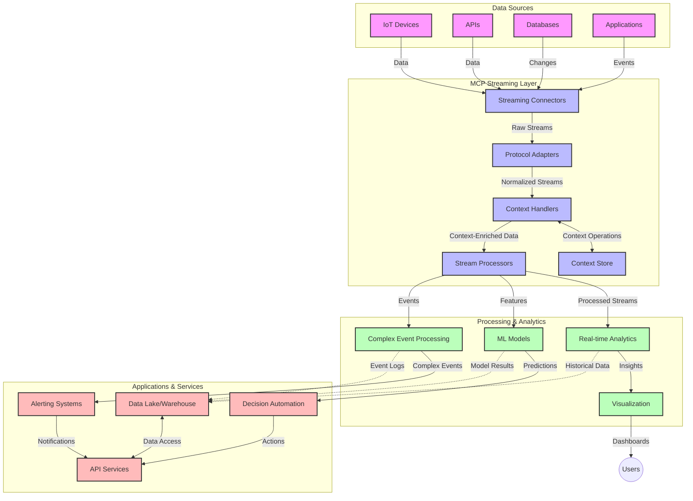

<!--
CO_OP_TRANSLATOR_METADATA:
{
  "original_hash": "195f7287638b77a549acadd96c8f981c",
  "translation_date": "2025-07-14T01:44:02+00:00",
  "source_file": "05-AdvancedTopics/mcp-realtimestreaming/README.md",
  "language_code": "fi"
}
-->
# Model Context Protocol reaaliaikaiseen datavirtaan

## Yleiskatsaus

Reaikaiseen datavirtaan perustuvat ratkaisut ovat nykymaailmassa välttämättömiä, kun yritykset ja sovellukset tarvitsevat välitöntä pääsyä tietoihin tehdäkseen oikea-aikaisia päätöksiä. Model Context Protocol (MCP) edustaa merkittävää edistysaskelta reaikaisten suoratoistoprosessien optimoinnissa, parantaen datankäsittelyn tehokkuutta, säilyttäen kontekstuaalisen eheys ja kohentaen järjestelmän kokonais-suorituskykyä.

Tässä moduulissa tarkastellaan, miten MCP muuttaa reaikaista datavirtaa tarjoamalla standardoidun lähestymistavan kontekstinhallintaan tekoälymallien, suoratoistoalustojen ja sovellusten välillä.

## Johdanto reaikaiseen datavirtaan

Reaikainen datavirta on teknologinen malli, joka mahdollistaa datan jatkuvan siirron, käsittelyn ja analysoinnin sitä syntyessä, jolloin järjestelmät voivat reagoida välittömästi uuteen tietoon. Toisin kuin perinteinen eräajokäsittely, joka toimii staattisilla tietoaineistoilla, suoratoisto käsittelee dataa liikkeessä tarjoten oivalluksia ja toimia mahdollisimman pienellä viiveellä.

### Reaikaisen datavirran keskeiset käsitteet:

- **Jatkuva datavirta**: Dataa käsitellään jatkuvana, loputtomana tapahtuma- tai tietuevirtana.
- **Pieni viive**: Järjestelmät on suunniteltu minimoimaan aika datan syntymisen ja käsittelyn välillä.
- **Skaalautuvuus**: Suoratoistoarkkitehtuurien on kyettävä käsittelemään vaihtelevaa datamäärää ja -nopeutta.
- **Vikasietoisuus**: Järjestelmien tulee kestää virheitä varmistaakseen keskeytymättömän datavirran.
- **Tilallinen käsittely**: Kontekstin ylläpito tapahtumien välillä on olennaista merkitykselliselle analyysille.

### Model Context Protocol ja reaikainen suoratoisto

Model Context Protocol (MCP) ratkaisee useita keskeisiä haasteita reaikaisten suoratoistoympäristöjen osalta:

1. **Kontekstuaalinen jatkuvuus**: MCP standardisoi, miten konteksti säilytetään hajautettujen suoratoistokomponenttien välillä, varmistaen, että tekoälymallit ja käsittelysolmut pääsevät käsiksi olennaiseen historialliseen ja ympäristökontekstiin.

2. **Tehokas tilanhallinta**: Tarjoamalla rakenteellisia mekanismeja kontekstin siirtoon MCP vähentää tilanhallinnan kuormitusta suoratoistoputkissa.

3. **Yhteentoimivuus**: MCP luo yhteisen kielen kontekstin jakamiseen eri suoratoistoteknologioiden ja tekoälymallien välillä, mahdollistaen joustavammat ja laajennettavammat arkkitehtuurit.

4. **Suoratoistoon optimoitu konteksti**: MCP:n toteutukset voivat priorisoida, mitkä kontekstielementit ovat tärkeimpiä reaaliaikaiseen päätöksentekoon, optimoiden sekä suorituskykyä että tarkkuutta.

5. **Mukautuva käsittely**: Oikean kontekstinhallinnan avulla MCP:n kautta suoratoistojärjestelmät voivat dynaamisesti säätää käsittelyä datan muuttuvien olosuhteiden ja mallien mukaan.

Nykyisissä sovelluksissa, aina IoT-antureista rahoitusmarkkinoiden kaupankäyntialustoihin, MCP:n integrointi suoratoistoteknologioihin mahdollistaa älykkäämmän, kontekstin huomioivan käsittelyn, joka pystyy reagoimaan monimutkaisiin ja kehittyviin tilanteisiin reaaliajassa.

## Oppimistavoitteet

Tämän oppitunnin jälkeen osaat:

- Ymmärtää reaikaisen datavirran perusteet ja siihen liittyvät haasteet
- Selittää, miten Model Context Protocol (MCP) parantaa reaikaista datavirtaa
- Toteuttaa MCP-pohjaisia suoratoistoratkaisuja suosituilla kehyksillä kuten Kafka ja Pulsar
- Suunnitella ja ottaa käyttöön vikasietoisia, suorituskykyisiä suoratoistoarkkitehtuureja MCP:llä
- Soveltaa MCP-konsepteja IoT-, rahoitus- ja tekoälypohjaisissa analytiikkatapauksissa
- Arvioida MCP-pohjaisen suoratoiston tulevia trendejä ja innovaatioita

### Määritelmä ja merkitys

Reaikainen datavirta tarkoittaa datan jatkuvaa syntymistä, käsittelyä ja toimitusta mahdollisimman pienellä viiveellä. Toisin kuin eräajokäsittelyssä, jossa data kerätään ja käsitellään ryhmissä, suoratoistodata käsitellään inkrementaalisesti sitä saapuessa, mahdollistaen välittömät oivallukset ja toimet.

Reaikaisen datavirran keskeisiä piirteitä ovat:

- **Pieni viive**: Datan käsittely ja analysointi millisekunneista sekunteihin
- **Jatkuva virta**: Keskeytymättömät datavirrat eri lähteistä
- **Välitön käsittely**: Datan analysointi sitä saapuessa, ei erissä
- **Tapahtumapohjainen arkkitehtuuri**: Reagointi tapahtumiin niiden tapahtuessa

### Haasteet perinteisessä datavirtauskäsittelyssä

Perinteiset suoratoistoratkaisut kohtaavat useita rajoitteita:

1. **Kontekstin katoaminen**: Vaikeus ylläpitää kontekstia hajautetuissa järjestelmissä
2. **Skaalautuvuusongelmat**: Haasteet suurten ja nopeiden datamäärien käsittelyssä
3. **Integraation monimutkaisuus**: Ongelmia eri järjestelmien yhteensopivuudessa
4. **Viiveen hallinta**: Läpäisyn ja käsittelyajan tasapainottaminen
5. **Datan yhdenmukaisuus**: Tietojen tarkkuuden ja täydellisyyden varmistaminen koko virrassa

## Model Context Protocolin (MCP) ymmärtäminen

### Mikä on MCP?

Model Context Protocol (MCP) on standardoitu viestintäprotokolla, joka helpottaa tehokasta vuorovaikutusta tekoälymallien ja sovellusten välillä. Reaikaisen datavirran yhteydessä MCP tarjoaa kehyksen:

- Kontekstin säilyttämiseen koko dataputken ajan
- Standardoituihin tiedonvaihtoformaatteihin
- Suurten tietoaineistojen siirron optimointiin
- Mallien välisen ja mallien ja sovellusten välisen viestinnän parantamiseen

### Keskeiset komponentit ja arkkitehtuuri

MCP:n arkkitehtuuri reaikaiseen suoratoistoon koostuu useista tärkeistä osista:

1. **Context Handlers**: Hallinnoivat ja ylläpitävät kontekstuaalista tietoa suoratoistoputkessa
2. **Stream Processors**: Käsittelevät saapuvia datavirtoja kontekstitietoisilla menetelmillä
3. **Protocol Adapters**: Muuntavat eri suoratoistoprotokollien välillä säilyttäen kontekstin
4. **Context Store**: Tallentaa ja hakee kontekstuaalista tietoa tehokkaasti
5. **Streaming Connectors**: Yhdistävät eri suoratoistoalustoihin (Kafka, Pulsar, Kinesis jne.)



### Miten MCP parantaa reaikaista datankäsittelyä

MCP vastaa perinteisiin suoratoiston haasteisiin seuraavasti:

- **Kontekstuaalinen eheys**: Säilyttää datan pisteiden väliset suhteet koko putken ajan
- **Optimoitu siirto**: Vähentää datan vaihtelun päällekkäisyyttä älykkään kontekstinhallinnan avulla
- **Standardoidut rajapinnat**: Tarjoaa yhtenäiset API:t suoratoistokomponenteille
- **Pienennetty viive**: Minimoi käsittelykuormaa tehokkaalla kontekstinhallinnalla
- **Parannettu skaalautuvuus**: Tukee vaakasuuntaista skaalausta kontekstin säilyttäen

## Integrointi ja toteutus

Reaikaisten datavirtojen järjestelmät vaativat huolellista arkkitehtuurisuunnittelua ja toteutusta suorituskyvyn ja kontekstuaalisen eheyden ylläpitämiseksi. Model Context Protocol tarjoaa standardoidun lähestymistavan tekoälymallien ja suoratoistoteknologioiden yhdistämiseen, mahdollistaen kehittyneemmät, kontekstia hyödyntävät käsittelyputket.

### MCP:n integroinnin yleiskatsaus suoratoistoarkkitehtuureissa

MCP:n toteuttaminen reaikaisissa suoratoistoympäristöissä edellyttää useiden keskeisten seikkojen huomioimista:

1. **Kontekstin sarjallistaminen ja siirto**: MCP tarjoaa tehokkaita mekanismeja kontekstuaalisen tiedon koodaamiseen suoratoistodatapaketeissa, varmistaen, että olennainen konteksti kulkee datan mukana koko käsittelyputken ajan. Tämä sisältää standardoidut sarjallistamisformaatit, jotka on optimoitu suoratoistokuljetukseen.

2. **Tilallinen suoratoistokäsittely**: MCP mahdollistaa älykkäämmän tilallisen käsittelyn ylläpitämällä johdonmukaista kontekstiesitystä käsittelysolmujen välillä. Tämä on erityisen arvokasta hajautetuissa suoratoistoarkkitehtuureissa, joissa tilanhallinta on perinteisesti haastavaa.

3. **Tapahtuma-aika vs. käsittelyaika**: MCP:n toteutusten on käsiteltävä yleistä haastetta erottaa, milloin tapahtumat tapahtuivat ja milloin ne käsitellään. Protokolla voi sisältää ajallisen kontekstin, joka säilyttää tapahtuma-ajan semantiikan.

4. **Takaisinpainetta hallinta**: Standardoimalla kontekstinhallinnan MCP auttaa hallitsemaan takaisinpainetta suoratoistojärjestelmissä, jolloin komponentit voivat viestiä käsittelykyvystään ja säätää virtausta sen mukaisesti.

5. **Kontekstin ikkunoiminen ja aggregointi**: MCP mahdollistaa kehittyneemmät ikkunoimistoiminnot tarjoamalla rakenteellisia esityksiä ajallisesta ja suhteellisesta kontekstista, mahdollistaen merkityksellisempiä aggregaatioita tapahtumavirroissa.

6. **Täsmälleen-kerran käsittely**: Suoratoistojärjestelmissä, joissa vaaditaan täsmälleen-kerran semantiikkaa, MCP voi sisältää käsittelymetatietoja auttaakseen seuraamaan ja varmistamaan käsittelyn tilan hajautetuissa komponenteissa.

MCP:n toteutus eri suoratoistoteknologioissa luo yhtenäisen lähestymistavan kontekstinhallintaan, vähentäen räätälöidyn integraatiokoodin tarvetta samalla kun parantaa järjestelmän kykyä säilyttää merkityksellinen konteksti datan kulkiessa putken läpi.

### MCP eri datavirtausalustoissa

Seuraavat esimerkit perustuvat nykyiseen MCP-spesifikaatioon, joka keskittyy JSON-RPC-pohjaiseen protokollaan erillisillä kuljetusmekanismeilla. Koodi havainnollistaa, miten voit toteuttaa mukautettuja kuljetuksia, jotka yhdistävät suoratoistoalustoja kuten Kafka ja Pulsar säilyttäen täyden yhteensopivuuden MCP-protokollan kanssa.

Esimerkit on suunniteltu osoittamaan, miten suoratoistoalustat voidaan integroida MCP:hen tarjoten reaikaista datankäsittelyä säilyttäen MCP:n keskeisen kontekstuaalisen tietoisuuden. Tämä lähestymistapa varmistaa, että koodinäytteet heijastavat tarkasti MCP-spesifikaation nykytilaa kesäkuussa 2025.

MCP voidaan integroida suosittuihin suoratoistokehyksiin, kuten:

#### Apache Kafka -integraatio

```python
import asyncio
import json
from typing import Dict, Any, Optional
from confluent_kafka import Consumer, Producer, KafkaError
from mcp.client import Client, ClientCapabilities
from mcp.core.message import JsonRpcMessage
from mcp.core.transports import Transport

# Custom transport class to bridge MCP with Kafka
class KafkaMCPTransport(Transport):
    def __init__(self, bootstrap_servers: str, input_topic: str, output_topic: str):
        self.bootstrap_servers = bootstrap_servers
        self.input_topic = input_topic
        self.output_topic = output_topic
        self.producer = Producer({'bootstrap.servers': bootstrap_servers})
        self.consumer = Consumer({
            'bootstrap.servers': bootstrap_servers,
            'group.id': 'mcp-client-group',
            'auto.offset.reset': 'earliest'
        })
        self.message_queue = asyncio.Queue()
        self.running = False
        self.consumer_task = None
        
    async def connect(self):
        """Connect to Kafka and start consuming messages"""
        self.consumer.subscribe([self.input_topic])
        self.running = True
        self.consumer_task = asyncio.create_task(self._consume_messages())
        return self
        
    async def _consume_messages(self):
        """Background task to consume messages from Kafka and queue them for processing"""
        while self.running:
            try:
                msg = self.consumer.poll(1.0)
                if msg is None:
                    await asyncio.sleep(0.1)
                    continue
                
                if msg.error():
                    if msg.error().code() == KafkaError._PARTITION_EOF:
                        continue
                    print(f"Consumer error: {msg.error()}")
                    continue
                
                # Parse the message value as JSON-RPC
                try:
                    message_str = msg.value().decode('utf-8')
                    message_data = json.loads(message_str)
                    mcp_message = JsonRpcMessage.from_dict(message_data)
                    await self.message_queue.put(mcp_message)
                except Exception as e:
                    print(f"Error parsing message: {e}")
            except Exception as e:
                print(f"Error in consumer loop: {e}")
                await asyncio.sleep(1)
    
    async def read(self) -> Optional[JsonRpcMessage]:
        """Read the next message from the queue"""
        try:
            message = await self.message_queue.get()
            return message
        except Exception as e:
            print(f"Error reading message: {e}")
            return None
    
    async def write(self, message: JsonRpcMessage) -> None:
        """Write a message to the Kafka output topic"""
        try:
            message_json = json.dumps(message.to_dict())
            self.producer.produce(
                self.output_topic,
                message_json.encode('utf-8'),
                callback=self._delivery_report
            )
            self.producer.poll(0)  # Trigger callbacks
        except Exception as e:
            print(f"Error writing message: {e}")
    
    def _delivery_report(self, err, msg):
        """Kafka producer delivery callback"""
        if err is not None:
            print(f'Message delivery failed: {err}')
        else:
            print(f'Message delivered to {msg.topic()} [{msg.partition()}]')
    
    async def close(self) -> None:
        """Close the transport"""
        self.running = False
        if self.consumer_task:
            self.consumer_task.cancel()
            try:
                await self.consumer_task
            except asyncio.CancelledError:
                pass
        self.consumer.close()
        self.producer.flush()

# Example usage of the Kafka MCP transport
async def kafka_mcp_example():
    # Create MCP client with Kafka transport
    client = Client(
        {"name": "kafka-mcp-client", "version": "1.0.0"},
        ClientCapabilities({})
    )
    
    # Create and connect the Kafka transport
    transport = KafkaMCPTransport(
        bootstrap_servers="localhost:9092",
        input_topic="mcp-responses",
        output_topic="mcp-requests"
    )
    
    await client.connect(transport)
    
    try:
        # Initialize the MCP session
        await client.initialize()
        
        # Example of executing a tool via MCP
        response = await client.execute_tool(
            "process_data",
            {
                "data": "sample data",
                "metadata": {
                    "source": "sensor-1",
                    "timestamp": "2025-06-12T10:30:00Z"
                }
            }
        )
        
        print(f"Tool execution response: {response}")
        
        # Clean shutdown
        await client.shutdown()
    finally:
        await transport.close()

# Run the example
if __name__ == "__main__":
    asyncio.run(kafka_mcp_example())
```

#### Apache Pulsar -toteutus

```python
import asyncio
import json
import pulsar
from typing import Dict, Any, Optional
from mcp.core.message import JsonRpcMessage
from mcp.core.transports import Transport
from mcp.server import Server, ServerOptions
from mcp.server.tools import Tool, ToolExecutionContext, ToolMetadata

# Create a custom MCP transport that uses Pulsar
class PulsarMCPTransport(Transport):
    def __init__(self, service_url: str, request_topic: str, response_topic: str):
        self.service_url = service_url
        self.request_topic = request_topic
        self.response_topic = response_topic
        self.client = pulsar.Client(service_url)
        self.producer = self.client.create_producer(response_topic)
        self.consumer = self.client.subscribe(
            request_topic,
            "mcp-server-subscription",
            consumer_type=pulsar.ConsumerType.Shared
        )
        self.message_queue = asyncio.Queue()
        self.running = False
        self.consumer_task = None
    
    async def connect(self):
        """Connect to Pulsar and start consuming messages"""
        self.running = True
        self.consumer_task = asyncio.create_task(self._consume_messages())
        return self
    
    async def _consume_messages(self):
        """Background task to consume messages from Pulsar and queue them for processing"""
        while self.running:
            try:
                # Non-blocking receive with timeout
                msg = self.consumer.receive(timeout_millis=500)
                
                # Process the message
                try:
                    message_str = msg.data().decode('utf-8')
                    message_data = json.loads(message_str)
                    mcp_message = JsonRpcMessage.from_dict(message_data)
                    await self.message_queue.put(mcp_message)
                    
                    # Acknowledge the message
                    self.consumer.acknowledge(msg)
                except Exception as e:
                    print(f"Error processing message: {e}")
                    # Negative acknowledge if there was an error
                    self.consumer.negative_acknowledge(msg)
            except Exception as e:
                # Handle timeout or other exceptions
                await asyncio.sleep(0.1)
    
    async def read(self) -> Optional[JsonRpcMessage]:
        """Read the next message from the queue"""
        try:
            message = await self.message_queue.get()
            return message
        except Exception as e:
            print(f"Error reading message: {e}")
            return None
    
    async def write(self, message: JsonRpcMessage) -> None:
        """Write a message to the Pulsar output topic"""
        try:
            message_json = json.dumps(message.to_dict())
            self.producer.send(message_json.encode('utf-8'))
        except Exception as e:
            print(f"Error writing message: {e}")
    
    async def close(self) -> None:
        """Close the transport"""
        self.running = False
        if self.consumer_task:
            self.consumer_task.cancel()
            try:
                await self.consumer_task
            except asyncio.CancelledError:
                pass
        self.consumer.close()
        self.producer.close()
        self.client.close()

# Define a sample MCP tool that processes streaming data
@Tool(
    name="process_streaming_data",
    description="Process streaming data with context preservation",
    metadata=ToolMetadata(
        required_capabilities=["streaming"]
    )
)
async def process_streaming_data(
    ctx: ToolExecutionContext,
    data: str,
    source: str,
    priority: str = "medium"
) -> Dict[str, Any]:
    """
    Process streaming data while preserving context
    
    Args:
        ctx: Tool execution context
        data: The data to process
        source: The source of the data
        priority: Priority level (low, medium, high)
        
    Returns:
        Dict containing processed results and context information
    """
    # Example processing that leverages MCP context
    print(f"Processing data from {source} with priority {priority}")
    
    # Access conversation context from MCP
    conversation_id = ctx.conversation_id if hasattr(ctx, 'conversation_id') else "unknown"
    
    # Return results with enhanced context
    return {
        "processed_data": f"Processed: {data}",
        "context": {
            "conversation_id": conversation_id,
            "source": source,
            "priority": priority,
            "processing_timestamp": ctx.get_current_time_iso()
        }
    }

# Example MCP server implementation using Pulsar transport
async def run_mcp_server_with_pulsar():
    # Create MCP server
    server = Server(
        {"name": "pulsar-mcp-server", "version": "1.0.0"},
        ServerOptions(
            capabilities={"streaming": True}
        )
    )
    
    # Register our tool
    server.register_tool(process_streaming_data)
    
    # Create and connect Pulsar transport
    transport = PulsarMCPTransport(
        service_url="pulsar://localhost:6650",
        request_topic="mcp-requests",
        response_topic="mcp-responses"
    )
    
    try:
        # Start the server with the Pulsar transport
        await server.run(transport)
    finally:
        await transport.close()

# Run the server
if __name__ == "__main__":
    asyncio.run(run_mcp_server_with_pulsar())
```

### Parhaat käytännöt käyttöönotossa

Kun toteutat MCP:tä reaikaiseen suoratoistoon:

1. **Suunnittele vikasietoisuus**:
   - Toteuta asianmukainen virheenkäsittely
   - Käytä dead-letter queue -jonoja epäonnistuneille viesteille
   - Suunnittele idempotentit prosessorit

2. **Optimoi suorituskyky**:
   - Määritä sopivat puskurikoot
   - Käytä eräkäsittelyä tarpeen mukaan
   - Toteuta takaisinpainemekanismit

3. **Seuraa ja valvo**:
   - Seuraa suoratoistoprosessin mittareita
   - Valvo kontekstin leviämistä
   - Aseta hälytykset poikkeamille

4. **Suojaa suoratoistosi**:
   - Toteuta salaus arkaluonteiselle datalle
   - Käytä tunnistautumista ja valtuutusta
   - Käytä asianmukaisia käyttöoikeuksia

### MCP IoT:ssa ja reunalaskennassa

MCP parantaa IoT-suoratoistoa:

- Säilyttämällä laitekontekstin koko käsittelyputken ajan
- Mahdollistamalla tehokkaan reunasta pilveen -datavirran
- Tukemalla reaaliaikaista analytiikkaa IoT-datavirroissa
- Helpottamalla laite-laite -viestintää kontekstin avulla

Esimerkki: Älykaupunkien anturiverkot  
```
Sensors → Edge Gateways → MCP Stream Processors → Real-time Analytics → Automated Responses
```

### Rooli rahoitustapahtumissa ja korkean taajuuden kaupankäynnissä

MCP tarjoaa merkittäviä etuja rahoitusdatan suoratoistoon:

- Erittäin pieni viive kaupankäyntipäätöksissä
- Kaupankäyntikontekstin ylläpito koko käsittelyn ajan
- Monimutkaisen tapahtumankäsittelyn tuki kontekstuaalisella tietoisuudella
- Datan yhdenmukaisuuden varmistaminen hajautetuissa kaupankäyntijärjestelmissä

### Tekoälypohjaisen datan analytiikan tehostaminen

MCP avaa uusia mahdollisuuksia suoratoistoanalytiikkaan:

- Reaikainen mallin koulutus ja päättely
- Jatkuva oppiminen suoratoistodatasta
- Kontekstia hyödyntävä piirteiden poiminta
- Monimalliset päättelyputket säilytetyn kontekstin kanssa

## Tulevat trendit ja innovaatiot

### MCP:n kehitys reaikaisissa ympäristöissä

Tulevaisuudessa MCP:n odotetaan kehittyvän vastaamaan:

- **Kvanttilaskennan integrointi**: Valmistautuminen kvanttipohjaisiin suoratoistojärjestelmiin
- **Reunalaskennan natiivikäsittely**: Yhä enemmän kontekstitietoista käsittelyä reunalaitteilla
- **Autonominen suoratoiston hallinta**: Itseoptimoituvat suoratoistoputket
- **Federatiivinen suoratoisto**: Hajautettu käsittely yksityisyyttä säilyttäen

### Teknologian mahdolliset edistysaskeleet

Uudet teknologiat, jotka muokkaavat MCP:n tulevaisuutta:

1. **Tekoälyoptimoidut suoratoistoprotokollat**: Räätälöidyt protokollat erityisesti tekoälykuormille
2. **Neuromorfinen laskenta**: Aivojen inspiroima laskenta suoratoistokäsittelyyn
3. **Serverless-suoratoisto**: Tapahtumapohjainen, skaalautuva suoratoisto ilman infrastruktuurin hallintaa
4. **Hajautetut kontekstivarastot**: Maailmanlaajuisesti hajautettu mutta erittäin yhdenmukainen kontekstinhallinta

## Käytännön harjoitukset

### Harjoitus 1: Perus MCP-suoratoistoputken pystytys

Tässä harjoituksessa opit:

- Konfiguroimaan perus MCP-suoratoistoympäristön
- Toteuttamaan kontekstinkäsittelijöitä suoratoistokäsittelyyn
- Testaamaan ja validoimaan kontekstin säilymisen

### Harjoitus 2: Reaaliaikaisen analytiikkapaneelin rakentaminen

Luo kokonainen sovellus, joka:

- Ottaa vastaan suoratoistodataa MCP:n avulla
- Käsittelee virtaa kontekstia säilyttäen
- Visualisoi tulokset reaaliajassa

### Harjoitus 3: Monimutkaisen tapahtumankäsittelyn toteutus MCP:llä

Edistynyt harjoitus, joka kattaa:

- Mallien tunnistamisen suoratoistoissa
- Kontekstuaalisen korrelaation useiden virtojen välillä
- Monimutka

**Vastuuvapauslauseke**:  
Tämä asiakirja on käännetty käyttämällä tekoälypohjaista käännöspalvelua [Co-op Translator](https://github.com/Azure/co-op-translator). Vaikka pyrimme tarkkuuteen, huomioithan, että automaattikäännöksissä saattaa esiintyä virheitä tai epätarkkuuksia. Alkuperäistä asiakirjaa sen alkuperäiskielellä tulee pitää virallisena lähteenä. Tärkeissä asioissa suositellaan ammattimaista ihmiskäännöstä. Emme ole vastuussa tämän käännöksen käytöstä aiheutuvista väärinymmärryksistä tai tulkinnoista.