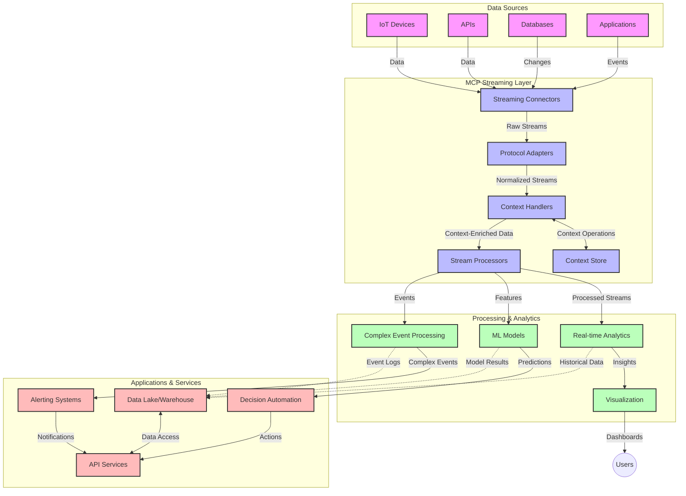

<!--
CO_OP_TRANSLATOR_METADATA:
{
  "original_hash": "195f7287638b77a549acadd96c8f981c",
  "translation_date": "2025-06-13T00:15:32+00:00",
  "source_file": "05-AdvancedTopics/mcp-realtimestreaming/README.md",
  "language_code": "fi"
}
-->
# Model Context Protocol reaaliaikaista datavirtausta varten

## Yleiskatsaus

Reaikaista datavirtausta pidetään nykymaailmassa välttämättömänä, kun yritykset ja sovellukset tarvitsevat välitöntä pääsyä tietoihin tehdäkseen oikea-aikaisia päätöksiä. Model Context Protocol (MCP) edustaa merkittävää edistysaskelta reaaliaikaisten virtausten optimoinnissa, parantaen datankäsittelyn tehokkuutta, säilyttäen kontekstuaalisen eheys ja kohentaen järjestelmän kokonais-suorituskykyä.

Tässä moduulissa tarkastellaan, miten MCP muuttaa reaaliaikaista datavirtausta tarjoamalla standardoidun tavan hallita kontekstia tekoälymallien, virtausalustojen ja sovellusten välillä.

## Johdanto reaikaiseen datavirtaukseen

Reaikaista datavirtausta kuvaa teknologinen toimintamalli, joka mahdollistaa datan jatkuvan siirron, käsittelyn ja analysoinnin sitä syntyessä, jolloin järjestelmät voivat reagoida välittömästi uuteen tietoon. Toisin kuin perinteinen eräkäsittely, joka toimii staattisilla tietojoukoilla, virtaus käsittelee dataa liikkeessä tarjoten oivalluksia ja toimia vähäisellä viiveellä.

### Reaikaisen datavirtaamisen keskeiset käsitteet:

- **Jatkuva datavirta**: Dataa käsitellään jatkuvana, loputtomana tapahtuma- tai tietuevirtana.
- **Pieni viive**: Järjestelmät on suunniteltu minimoimaan aika datan syntymisen ja käsittelyn välillä.
- **Skaalautuvuus**: Virtausarkkitehtuurien on kyettävä käsittelemään vaihtelevia datamääriä ja nopeuksia.
- **Vikasietoisuus**: Järjestelmien tulee kestää virheitä varmistaakseen keskeytymättömän datavirran.
- **Tilallinen käsittely**: Kontekstin ylläpito tapahtumien välillä on olennaista merkitykselliselle analyysille.

### Model Context Protocol ja reaikainen virtaus

Model Context Protocol (MCP) ratkaisee useita keskeisiä haasteita reaaliaikaisissa virtausympäristöissä:

1. **Kontekstuaalinen jatkuvuus**: MCP standardisoi, miten konteksti säilytetään hajautettujen virtauskomponenttien välillä, varmistaen, että tekoälymallit ja käsittelysolmut pääsevät käsiksi relevanttiin historialliseen ja ympäristölliseen kontekstiin.

2. **Tehokas tilanhallinta**: Rakenteellisten mekanismien avulla MCP vähentää tilanhallinnan kuormitusta virtausputkissa.

3. **Yhteensopivuus**: MCP luo yhteisen kielen kontekstin jakamiseen erilaisten virtausteknologioiden ja tekoälymallien välillä, mahdollistaen joustavamman ja laajennettavamman arkkitehtuurin.

4. **Virtausta optimoitu konteksti**: MCP:n toteutukset voivat priorisoida, mitkä kontekstielementit ovat tärkeimpiä reaaliaikaiseen päätöksentekoon, optimoiden suorituskykyä ja tarkkuutta.

5. **Mukautuva käsittely**: Oikean kontekstinhallinnan avulla MCP:n kautta virtausjärjestelmät voivat dynaamisesti säätää käsittelyä datan kehittyvien olosuhteiden ja mallien mukaan.

Nykyisissä sovelluksissa, IoT-antureista rahoitusmarkkinoihin, MCP:n integrointi virtausteknologioihin mahdollistaa älykkäämmän, kontekstia ymmärtävän käsittelyn, joka reagoi asianmukaisesti monimutkaisiin ja kehittyviin tilanteisiin reaaliajassa.

## Oppimistavoitteet

Tämän oppitunnin jälkeen osaat:

- Ymmärtää reaikaisen datavirtaamisen perusteet ja sen haasteet
- Selittää, miten Model Context Protocol (MCP) parantaa reaikaista datavirtausta
- Toteuttaa MCP-pohjaisia virtausratkaisuja suosituilla kehyksillä kuten Kafka ja Pulsar
- Suunnitella ja ottaa käyttöön vikasietoisia, suorituskykyisiä virtausarkkitehtuureja MCP:llä
- Soveltaa MCP-konsepteja IoT-, rahoitus- ja tekoälypohjaisissa analytiikkatapauksissa
- Arvioida MCP-pohjaisen virtausteknologian uusia suuntauksia ja tulevia innovaatioita

### Määritelmä ja merkitys

Reaikaista datavirtausta kuvaa datan jatkuva syntyminen, käsittely ja toimitus mahdollisimman pienellä viiveellä. Toisin kuin eräkäsittely, jossa data kerätään ja käsitellään ryhmissä, virtausdataa käsitellään pala kerrallaan sitä saapuessa, mahdollistaen välittömät oivallukset ja toimet.

Reaikaisen datavirtaamisen keskeisiä ominaisuuksia ovat:

- **Pieni viive**: Datan käsittely ja analysointi millisekunneista sekunteihin
- **Jatkuva virta**: Keskeytymättömät datavirrat eri lähteistä
- **Välitön käsittely**: Datan analysointi saapumishetkellä, ei erissä
- **Tapahtumaohjattu arkkitehtuuri**: Reagointi tapahtumiin niiden ilmaantuessa

### Haasteet perinteisessä datavirtaamisessa

Perinteiset datavirtausmenetelmät kohtaavat useita rajoituksia:

1. **Kontekstin menetys**: Vaikeus säilyttää konteksti hajautettujen järjestelmien välillä
2. **Skaalautuvuusongelmat**: Haasteet suuren ja nopean datamäärän käsittelyssä
3. **Integraation monimutkaisuus**: Ongelmia eri järjestelmien yhteensopivuudessa
4. **Viiveen hallinta**: Läpäisyn ja käsittelyajan tasapainottaminen
5. **Datan yhdenmukaisuus**: Datan tarkkuuden ja täydellisyyden varmistaminen koko virrassa

## Model Context Protocolin (MCP) ymmärtäminen

### Mikä on MCP?

Model Context Protocol (MCP) on standardoitu viestintäprotokolla, joka on suunniteltu helpottamaan tehokasta vuorovaikutusta tekoälymallien ja sovellusten välillä. Reaikaisen datavirtaamisen kontekstissa MCP tarjoaa puitteet:

- Kontekstin säilyttämiseen koko dataputken ajan
- Standardoitujen tietojenvaihtoformaattien käyttöön
- Suurten tietomäärien siirron optimointiin
- Mallien välisen ja mallien sekä sovellusten välisen viestinnän parantamiseen

### Keskeiset osat ja arkkitehtuuri

MCP:n arkkitehtuuri reaikaista virtausta varten koostuu useista tärkeistä komponenteista:

1. **Context Handlers**: Hallitsevat ja ylläpitävät kontekstuaalista tietoa virtausputken läpi
2. **Stream Processors**: Käsittelevät saapuvia datavirtoja kontekstitietoisilla menetelmillä
3. **Protocol Adapters**: Muuntavat eri virtausprotokollien välillä säilyttäen kontekstin
4. **Context Store**: Tallentaa ja hakee tehokkaasti kontekstuaalista tietoa
5. **Streaming Connectors**: Yhdistävät erilaisiin virtausalustoihin (Kafka, Pulsar, Kinesis jne.)



### Miten MCP parantaa reaikaista datankäsittelyä

MCP vastaa perinteisiin virtaushaasteisiin seuraavasti:

- **Kontekstuaalinen eheys**: Säilyttää datakohtien väliset suhteet koko putken ajan
- **Optimoitu siirto**: Vähentää tietojen päällekkäisyyttä älykkäällä kontekstinhallinnalla
- **Standardoidut rajapinnat**: Tarjoaa yhdenmukaiset API:t virtauskomponenteille
- **Vähennetty viive**: Minimoi käsittelykuormaa tehokkaalla kontekstinkäsittelyllä
- **Parannettu skaalautuvuus**: Tukee vaakasuuntaista skaalausta kontekstin säilyttäen

## Integrointi ja toteutus

Reaikaisten datavirtausjärjestelmien suunnittelu ja toteutus vaatii huolellista arkkitehtuurista suunnittelua suorituskyvyn ja kontekstuaalisen eheyden ylläpitämiseksi. Model Context Protocol tarjoaa standardoidun lähestymistavan tekoälymallien ja virtausteknologioiden integrointiin, mahdollistaen kehittyneempiä, kontekstia ymmärtäviä käsittelyputkia.

### MCP:n integroinnin yleiskatsaus virtausarkkitehtuureissa

MCP:n toteuttaminen reaikaisissa virtausympäristöissä sisältää useita keskeisiä näkökohtia:

1. **Kontekstin sarjallistaminen ja siirto**: MCP tarjoaa tehokkaita tapoja koodata kontekstuaalinen tieto virtausdatapaketeissa, varmistaen, että oleellinen konteksti kulkee datan mukana koko käsittelyputken ajan. Tämä sisältää standardoidut sarjallistamisformaatit, jotka on optimoitu virtausvälitykseen.

2. **Tilallinen virtauskäsittely**: MCP mahdollistaa älykkäämmän tilallisen käsittelyn ylläpitämällä johdonmukaista kontekstin esitystä käsittelysolmujen välillä. Tämä on erityisen arvokasta hajautetuissa virtausarkkitehtuureissa, joissa tilanhallinta on perinteisesti haastavaa.

3. **Tapahtuma-aika vs. käsittelyaika**: MCP:n toteutusten on käsiteltävä yleistä haastetta erottaa, milloin tapahtumat ovat tapahtuneet ja milloin ne käsitellään. Protokolla voi sisältää ajallisen kontekstin, joka säilyttää tapahtuma-ajan semantiikan.

4. **Takaisinpainetta hallinta**: Standardoimalla kontekstinhallinnan MCP auttaa hallitsemaan takaisinpainetta virtausjärjestelmissä, jolloin komponentit voivat kommunikoida käsittelykapasiteettinsa ja säätää virtausta sen mukaan.

5. **Kontekstin ikkunointi ja aggregointi**: MCP mahdollistaa kehittyneempiä ikkunointitoimintoja tarjoamalla rakenteellisia esityksiä ajallisesta ja relaatiokontekstista, mahdollistaen merkityksellisempiä aggregaatioita tapahtumavirroissa.

6. **Täsmälleen-kerran käsittely**: Virtausjärjestelmissä, joissa vaaditaan täsmälleen-kerran semantiikkaa, MCP voi sisällyttää käsittelymetatietoja auttaakseen seuraamaan ja varmistamaan käsittelyn tilaa hajautetuissa komponenteissa.

MCP:n toteutus eri virtausteknologioissa luo yhtenäisen lähestymistavan kontekstinhallintaan, vähentäen räätälöidyn integraatiokoodin tarvetta ja parantaen järjestelmän kykyä säilyttää merkityksellinen konteksti datan kulkiessa putken läpi.

### MCP eri datavirtauskehyksissä

Seuraavat esimerkit perustuvat nykyiseen MCP-spesifikaatioon, joka keskittyy JSON-RPC-pohjaiseen protokollaan erillisten siirtomekanismien kanssa. Koodi havainnollistaa, miten voit toteuttaa mukautettuja siirtoja, jotka integroivat virtausalustoja kuten Kafka ja Pulsar, säilyttäen täyden yhteensopivuuden MCP-protokollan kanssa.

Esimerkit on suunniteltu näyttämään, miten virtausalustat voidaan yhdistää MCP:hen tarjoten reaikaista datankäsittelyä samalla kun säilytetään MCP:n keskeinen kontekstuaalinen tietoisuus. Tämä lähestymistapa varmistaa, että koodinäytteet heijastavat tarkasti MCP-spesifikaation nykytilaa kesäkuussa 2025.

MCP voidaan integroida suosittuihin virtauskehyksiin, kuten:

#### Apache Kafka -integrointi

```python
import asyncio
import json
from typing import Dict, Any, Optional
from confluent_kafka import Consumer, Producer, KafkaError
from mcp.client import Client, ClientCapabilities
from mcp.core.message import JsonRpcMessage
from mcp.core.transports import Transport

# Custom transport class to bridge MCP with Kafka
class KafkaMCPTransport(Transport):
    def __init__(self, bootstrap_servers: str, input_topic: str, output_topic: str):
        self.bootstrap_servers = bootstrap_servers
        self.input_topic = input_topic
        self.output_topic = output_topic
        self.producer = Producer({'bootstrap.servers': bootstrap_servers})
        self.consumer = Consumer({
            'bootstrap.servers': bootstrap_servers,
            'group.id': 'mcp-client-group',
            'auto.offset.reset': 'earliest'
        })
        self.message_queue = asyncio.Queue()
        self.running = False
        self.consumer_task = None
        
    async def connect(self):
        """Connect to Kafka and start consuming messages"""
        self.consumer.subscribe([self.input_topic])
        self.running = True
        self.consumer_task = asyncio.create_task(self._consume_messages())
        return self
        
    async def _consume_messages(self):
        """Background task to consume messages from Kafka and queue them for processing"""
        while self.running:
            try:
                msg = self.consumer.poll(1.0)
                if msg is None:
                    await asyncio.sleep(0.1)
                    continue
                
                if msg.error():
                    if msg.error().code() == KafkaError._PARTITION_EOF:
                        continue
                    print(f"Consumer error: {msg.error()}")
                    continue
                
                # Parse the message value as JSON-RPC
                try:
                    message_str = msg.value().decode('utf-8')
                    message_data = json.loads(message_str)
                    mcp_message = JsonRpcMessage.from_dict(message_data)
                    await self.message_queue.put(mcp_message)
                except Exception as e:
                    print(f"Error parsing message: {e}")
            except Exception as e:
                print(f"Error in consumer loop: {e}")
                await asyncio.sleep(1)
    
    async def read(self) -> Optional[JsonRpcMessage]:
        """Read the next message from the queue"""
        try:
            message = await self.message_queue.get()
            return message
        except Exception as e:
            print(f"Error reading message: {e}")
            return None
    
    async def write(self, message: JsonRpcMessage) -> None:
        """Write a message to the Kafka output topic"""
        try:
            message_json = json.dumps(message.to_dict())
            self.producer.produce(
                self.output_topic,
                message_json.encode('utf-8'),
                callback=self._delivery_report
            )
            self.producer.poll(0)  # Trigger callbacks
        except Exception as e:
            print(f"Error writing message: {e}")
    
    def _delivery_report(self, err, msg):
        """Kafka producer delivery callback"""
        if err is not None:
            print(f'Message delivery failed: {err}')
        else:
            print(f'Message delivered to {msg.topic()} [{msg.partition()}]')
    
    async def close(self) -> None:
        """Close the transport"""
        self.running = False
        if self.consumer_task:
            self.consumer_task.cancel()
            try:
                await self.consumer_task
            except asyncio.CancelledError:
                pass
        self.consumer.close()
        self.producer.flush()

# Example usage of the Kafka MCP transport
async def kafka_mcp_example():
    # Create MCP client with Kafka transport
    client = Client(
        {"name": "kafka-mcp-client", "version": "1.0.0"},
        ClientCapabilities({})
    )
    
    # Create and connect the Kafka transport
    transport = KafkaMCPTransport(
        bootstrap_servers="localhost:9092",
        input_topic="mcp-responses",
        output_topic="mcp-requests"
    )
    
    await client.connect(transport)
    
    try:
        # Initialize the MCP session
        await client.initialize()
        
        # Example of executing a tool via MCP
        response = await client.execute_tool(
            "process_data",
            {
                "data": "sample data",
                "metadata": {
                    "source": "sensor-1",
                    "timestamp": "2025-06-12T10:30:00Z"
                }
            }
        )
        
        print(f"Tool execution response: {response}")
        
        # Clean shutdown
        await client.shutdown()
    finally:
        await transport.close()

# Run the example
if __name__ == "__main__":
    asyncio.run(kafka_mcp_example())
```

#### Apache Pulsar -toteutus

```python
import asyncio
import json
import pulsar
from typing import Dict, Any, Optional
from mcp.core.message import JsonRpcMessage
from mcp.core.transports import Transport
from mcp.server import Server, ServerOptions
from mcp.server.tools import Tool, ToolExecutionContext, ToolMetadata

# Create a custom MCP transport that uses Pulsar
class PulsarMCPTransport(Transport):
    def __init__(self, service_url: str, request_topic: str, response_topic: str):
        self.service_url = service_url
        self.request_topic = request_topic
        self.response_topic = response_topic
        self.client = pulsar.Client(service_url)
        self.producer = self.client.create_producer(response_topic)
        self.consumer = self.client.subscribe(
            request_topic,
            "mcp-server-subscription",
            consumer_type=pulsar.ConsumerType.Shared
        )
        self.message_queue = asyncio.Queue()
        self.running = False
        self.consumer_task = None
    
    async def connect(self):
        """Connect to Pulsar and start consuming messages"""
        self.running = True
        self.consumer_task = asyncio.create_task(self._consume_messages())
        return self
    
    async def _consume_messages(self):
        """Background task to consume messages from Pulsar and queue them for processing"""
        while self.running:
            try:
                # Non-blocking receive with timeout
                msg = self.consumer.receive(timeout_millis=500)
                
                # Process the message
                try:
                    message_str = msg.data().decode('utf-8')
                    message_data = json.loads(message_str)
                    mcp_message = JsonRpcMessage.from_dict(message_data)
                    await self.message_queue.put(mcp_message)
                    
                    # Acknowledge the message
                    self.consumer.acknowledge(msg)
                except Exception as e:
                    print(f"Error processing message: {e}")
                    # Negative acknowledge if there was an error
                    self.consumer.negative_acknowledge(msg)
            except Exception as e:
                # Handle timeout or other exceptions
                await asyncio.sleep(0.1)
    
    async def read(self) -> Optional[JsonRpcMessage]:
        """Read the next message from the queue"""
        try:
            message = await self.message_queue.get()
            return message
        except Exception as e:
            print(f"Error reading message: {e}")
            return None
    
    async def write(self, message: JsonRpcMessage) -> None:
        """Write a message to the Pulsar output topic"""
        try:
            message_json = json.dumps(message.to_dict())
            self.producer.send(message_json.encode('utf-8'))
        except Exception as e:
            print(f"Error writing message: {e}")
    
    async def close(self) -> None:
        """Close the transport"""
        self.running = False
        if self.consumer_task:
            self.consumer_task.cancel()
            try:
                await self.consumer_task
            except asyncio.CancelledError:
                pass
        self.consumer.close()
        self.producer.close()
        self.client.close()

# Define a sample MCP tool that processes streaming data
@Tool(
    name="process_streaming_data",
    description="Process streaming data with context preservation",
    metadata=ToolMetadata(
        required_capabilities=["streaming"]
    )
)
async def process_streaming_data(
    ctx: ToolExecutionContext,
    data: str,
    source: str,
    priority: str = "medium"
) -> Dict[str, Any]:
    """
    Process streaming data while preserving context
    
    Args:
        ctx: Tool execution context
        data: The data to process
        source: The source of the data
        priority: Priority level (low, medium, high)
        
    Returns:
        Dict containing processed results and context information
    """
    # Example processing that leverages MCP context
    print(f"Processing data from {source} with priority {priority}")
    
    # Access conversation context from MCP
    conversation_id = ctx.conversation_id if hasattr(ctx, 'conversation_id') else "unknown"
    
    # Return results with enhanced context
    return {
        "processed_data": f"Processed: {data}",
        "context": {
            "conversation_id": conversation_id,
            "source": source,
            "priority": priority,
            "processing_timestamp": ctx.get_current_time_iso()
        }
    }

# Example MCP server implementation using Pulsar transport
async def run_mcp_server_with_pulsar():
    # Create MCP server
    server = Server(
        {"name": "pulsar-mcp-server", "version": "1.0.0"},
        ServerOptions(
            capabilities={"streaming": True}
        )
    )
    
    # Register our tool
    server.register_tool(process_streaming_data)
    
    # Create and connect Pulsar transport
    transport = PulsarMCPTransport(
        service_url="pulsar://localhost:6650",
        request_topic="mcp-requests",
        response_topic="mcp-responses"
    )
    
    try:
        # Start the server with the Pulsar transport
        await server.run(transport)
    finally:
        await transport.close()

# Run the server
if __name__ == "__main__":
    asyncio.run(run_mcp_server_with_pulsar())
```

### Parhaat käytännöt käyttöönotossa

Kun toteutat MCP:tä reaikaiseen virtaamiseen:

1. **Suunnittele vikasietoisuutta varten**:
   - Toteuta asianmukainen virheenkäsittely
   - Käytä dead-letter queueja epäonnistuneille viesteille
   - Suunnittele idempotentteja prosessoreita

2. **Optimoi suorituskykyä varten**:
   - Määritä sopivat puskurikoot
   - Käytä eräkäsittelyä tarvittaessa
   - Toteuta takaisinpainemekanismeja

3. **Valvo ja tarkkaile**:
   - Seuraa virtausprosessoinnin mittareita
   - Tarkkaile kontekstin leviämistä
   - Aseta hälytykset poikkeamille

4. **Suojaa virtauksesi**:
   - Käytä salausta arkaluontoiselle datalle
   - Toteuta tunnistus ja valtuutus
   - Käytä asianmukaisia käyttöoikeuksia

### MCP IoT:ssa ja reunalaskennassa

MCP parantaa IoT-virtausta:

- Säilyttämällä laitteen kontekstin käsittelyputken läpi
- Mahdollistamalla tehokkaan reunalta pilveen tapahtuvan datavirran
- Tukemalla reaaliaikaista analytiikkaa IoT-datavirroissa
- Helpottamalla laite-laite -viestintää kontekstin avulla

Esimerkki: Älykaupungin sensoriverkot  
```
Sensors → Edge Gateways → MCP Stream Processors → Real-time Analytics → Automated Responses
```

### Rooli rahoitustransaktioissa ja korkean taajuuden kaupankäynnissä

MCP tarjoaa merkittäviä etuja rahoitusdatan virtaamisessa:

- Erittäin pieni viive kaupankäyntipäätöksissä
- Kaupankäyntikontekstin säilyttäminen koko käsittelyn ajan
- Tukee monimutkaista tapahtumankäsittelyä kontekstin huomioiden
- Varmistaa datan yhdenmukaisuuden hajautetuissa kaupankäyntijärjestelmissä

### Tekoälypohjaisen datan analytiikan parantaminen

MCP luo uusia mahdollisuuksia virtausanalytiikkaan:

- Reaikainen mallin koulutus ja päätelmät
- Jatkuva oppiminen virtausdatasta
- Kontekstia hyödyntävä piirteen poiminta
- Monimalliset päätelmäputket kontekstin säilyttäen

## Tulevat suuntaukset ja innovaatiot

### MCP:n kehitys reaikaissa ympäristöissä

Tulevaisuudessa MCP:n odotetaan kehittyvän vastaamaan:

- **Kvanttilaskennan integrointi**: Valmistautuminen kvanttipohjaisiin virtausjärjestelmiin
- **Reuna-lähtöinen käsittely**: Entistä enemmän kontekstia ymmärtävää käsittelyä reunalaitteilla
- **Autonominen virtausten hallinta**: Itseoptimoituvat virtausputket
- **Federated Streaming**: Hajautettu käsittely yksityisyys huomioiden

### Teknologian mahdolliset edistysaskeleet

Uudet teknologiat, jotka muovaavat MCP-virtausta:

1. **Tekoälyyn optimoidut virtausprotokollat**: Räätälöidyt protokollat AI-kuormituksille
2. **Neuromorfinen laskenta**: Aivojen inspiroima laskenta virtauskäsittelyyn
3. **Serverless-virtaus**: Tapahtumaohjattu, skaalautuva virtaus ilman infrastruktuurin hallintaa
4. **Hajautetut kontekstivarastot**: Maailmanlaajuisesti hajautetut, mutta erittäin yhdenmukaiset kontekstinhallintajärjestelmät

## Käytännön harjoitukset

### Harjoitus 1: Perus MCP-virtausputken pystytys

Tässä harjoituksessa opit:

- Määrittämään perus MCP-virtausympäristön
- Toteuttamaan kontekstinhallinnan virtauskäsittelyyn
- Testaamaan ja varmistamaan kontekstin säilyminen

### Harjoitus 2: Reaikaisen analytiikkapaneelin rakentaminen

Luo kokonainen sovellus, joka:

- Ottaa vastaan virtausdataa MCP:n avulla
- Käsittelee virtaa kontekstia säilyttäen
- Visualisoi tulokset reaaliajassa

### Harjoitus 3: Monimutkaisen tapahtumankäsittelyn toteutus MCP:llä

Edistynyt harjoitus, joka kattaa:

- Mallien tunnistamisen virroissa
- Kontekstuaalisen korrelaation useiden virtojen välillä
- Monimutkaisten tapahtumien generoinnin säilyttäen konteksti

## Lisäresurssit

- [Model Context Protocol Specification](https://github.com/modelcontextprotocol) - Virallinen MCP-spesifikaatio ja dokumentaatio
- [Apache Kafka Documentation](https://k

**Vastuuvapauslauseke**:  
Tämä asiakirja on käännetty käyttämällä tekoälypohjaista käännöspalvelua [Co-op Translator](https://github.com/Azure/co-op-translator). Vaikka pyrimme tarkkuuteen, huomioithan, että automaattikäännöksissä saattaa esiintyä virheitä tai epätarkkuuksia. Alkuperäinen asiakirja sen alkuperäiskielellä tulee pitää auktoritatiivisena lähteenä. Tärkeissä asioissa suositellaan ammattimaista ihmiskäännöstä. Emme ole vastuussa tämän käännöksen käytöstä aiheutuvista väärinymmärryksistä tai virhetulkinnoista.