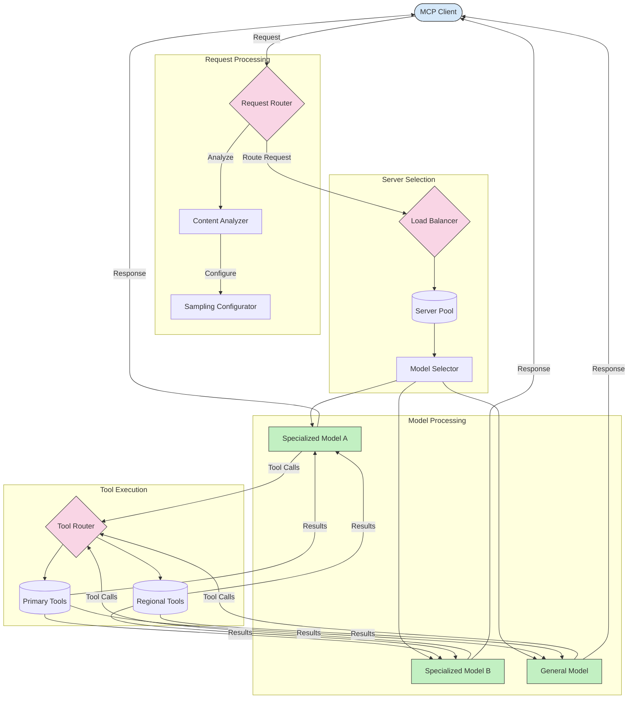

<!--
CO_OP_TRANSLATOR_METADATA:
{
  "original_hash": "2f1b473818b5a6cc9a9bbf777fffa6d4",
  "translation_date": "2025-07-14T21:48:45+00:00",
  "source_file": "05-AdvancedTopics/mcp-routing/README.md",
  "language_code": "fi"
}
-->
## Dynaaminen työkalujen reititys

Työkalujen reititys varmistaa, että työkalukutsut ohjataan kontekstin perusteella sopivimpaan palveluun. Esimerkiksi säätyökalukutsu saattaa tarvita ohjauksen alueelliselle päätepisteelle käyttäjän sijainnin mukaan, tai laskin-työkalu saattaa tarvita tietyn version API:sta.

Katsotaan esimerkkitoteutusta, joka havainnollistaa dynaamista työkalujen reititystä pyyntöanalyysin, alueellisten päätepisteiden ja versiotuen perusteella.

## Näytteenotto ja reititys MCP:ssä

Näytteenotto on keskeinen osa Model Context Protocolia (MCP), joka mahdollistaa tehokkaan pyyntöjen käsittelyn ja reitityksen. Se tarkoittaa saapuvien pyyntöjen analysointia sopivimman mallin tai palvelun määrittämiseksi, perustuen erilaisiin kriteereihin kuten sisältötyyppi, käyttäjäkonteksti ja järjestelmän kuormitus.

Näytteenotto ja reititys voidaan yhdistää luomaan vankka arkkitehtuuri, joka optimoi resurssien käytön ja varmistaa korkean käytettävyyden. Näytteenottoprosessia voidaan käyttää pyyntöjen luokitteluun, kun taas reititys ohjaa ne sopiville malleille tai palveluille.

Alla oleva kaavio havainnollistaa, miten näytteenotto ja reititys toimivat yhdessä kattavassa MCP-arkkitehtuurissa:

## Mitä seuraavaksi

- [5.6 Näytteenotto](../mcp-sampling/README.md)

**Vastuuvapauslauseke**:  
Tämä asiakirja on käännetty käyttämällä tekoälypohjaista käännöspalvelua [Co-op Translator](https://github.com/Azure/co-op-translator). Vaikka pyrimme tarkkuuteen, huomioithan, että automaattikäännöksissä saattaa esiintyä virheitä tai epätarkkuuksia. Alkuperäistä asiakirjaa sen alkuperäiskielellä tulee pitää virallisena lähteenä. Tärkeissä tiedoissa suositellaan ammattimaista ihmiskäännöstä. Emme ole vastuussa tämän käännöksen käytöstä aiheutuvista väärinymmärryksistä tai tulkinnoista.