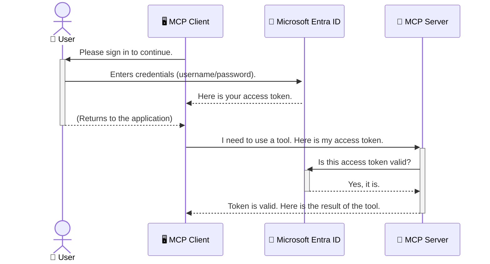

<!--
CO_OP_TRANSLATOR_METADATA:
{
  "original_hash": "9abe1d303ab126f9a8b87f03cebe5213",
  "translation_date": "2025-06-26T14:51:44+00:00",
  "source_file": "05-AdvancedTopics/mcp-security-entra/README.md",
  "language_code": "fi"
}
-->
# Turvaamalla tekoälytyönkulut: Entra ID -todennus Model Context Protocol -palvelimille

## Johdanto  
Model Context Protocol (MCP) -palvelimesi suojaaminen on yhtä tärkeää kuin kotisi etuoven lukitseminen. Jos jätät MCP-palvelimesi avoimeksi, työkalusi ja tietosi ovat alttiina luvattomalle käytölle, mikä voi johtaa tietoturvaloukkauksiin. Microsoft Entra ID tarjoaa vahvan pilvipohjaisen identiteetin ja pääsynhallinnan ratkaisun, joka varmistaa, että vain valtuutetut käyttäjät ja sovellukset voivat käyttää MCP-palvelintasi. Tässä osiossa opit, miten voit suojata tekoälytyönkulkujasi Entra ID -todennuksella.

## Oppimistavoitteet  
Tämän osion lopuksi osaat:

- Ymmärtää MCP-palvelinten suojaamisen merkityksen.  
- Selittää Microsoft Entra ID:n ja OAuth 2.0 -todennuksen perusteet.  
- Tunnistaa julkisen ja luottamuksellisen asiakkaan erot.  
- Toteuttaa Entra ID -todennuksen sekä paikallisissa (julkinen asiakas) että etäisissä (luottamuksellinen asiakas) MCP-palvelintilanteissa.  
- Soveltaa turvallisuuden parhaita käytäntöjä tekoälytyönkulkujen kehittämisessä.

# Turvaamalla tekoälytyönkulut: Entra ID -todennus Model Context Protocol -palvelimille

Aivan kuten et jättäisi kotisi etuovea lukitsematta, et myöskään saa jättää MCP-palvelintasi vapaasti kenen tahansa käyttöön. Tekoälytyönkulkujen suojaaminen on olennaista luotettavien, turvallisten ja vakaiden sovellusten rakentamisessa. Tässä luvussa tutustut Microsoft Entra ID:n käyttöön MCP-palvelimien suojaamisessa, jotta vain valtuutetut käyttäjät ja sovellukset pääsevät käsiksi työkaluihisi ja tietoihisi.

## Miksi turvallisuus on tärkeää MCP-palvelimille

Kuvittele, että MCP-palvelimellasi on työkalu, joka voi lähettää sähköposteja tai käyttää asiakasrekisteriä. Suojaamaton palvelin tarkoittaisi, että kuka tahansa voisi käyttää tätä työkalua, mikä johtaisi luvattomaan tietojen käyttöön, roskapostiin tai muihin haitallisiin toimintoihin.

Todennuksen avulla varmistat, että jokainen palvelimelle tehty pyyntö tarkistetaan ja käyttäjän tai sovelluksen henkilöllisyys vahvistetaan. Tämä on ensimmäinen ja tärkein askel tekoälytyönkulkujen suojaamisessa.

## Johdanto Microsoft Entra ID:hin

**Microsoft Entra ID** on pilvipohjainen identiteetin ja pääsynhallinnan palvelu. Voit ajatella sitä sovellustesi yleisenä turvamiehenä. Se hoitaa monimutkaisen käyttäjien tunnistamisen (todennus) ja käyttöoikeuksien määrittämisen (valtuutus) prosessin.

Entra ID:n avulla voit:

- Mahdollistaa turvallisen kirjautumisen käyttäjille.  
- Suojata API:t ja palvelut.  
- Hallita käyttöoikeuspolitiikkoja keskitetysti.

MCP-palvelimille Entra ID tarjoaa vahvan ja laajalti luotetun ratkaisun hallita, kuka voi käyttää palvelimen toimintoja.

---

## Ymmärtäminen: Miten Entra ID -todennus toimii

Entra ID käyttää avoimia standardeja, kuten **OAuth 2.0**, todennuksen hallintaan. Vaikka yksityiskohdat voivat olla monimutkaisia, perusidea on yksinkertainen ja sen voi ymmärtää vertauksen avulla.

### Kevyt johdanto OAuth 2.0:aan: avain autonhoitajalle

Ajattele OAuth 2.0:aa kuin autonhoitopalvelua. Kun saavut ravintolaan, et anna autonhoitajalle pääavaintasi. Sen sijaan annat **avainautonhoitajan avaimen**, jolla on rajatut oikeudet – se voi käynnistää auton ja lukita ovet, mutta ei avata takaluukkua tai hansikaslokeroa.

Tässä vertauksessa:

- **Sinä** olet **Käyttäjä**.  
- **Autosi** on **MCP-palvelin** arvokkaine työkaluineen ja tietoineen.  
- **Autonhoitaja** on **Microsoft Entra ID**.  
- **Pysäköinninvalvoja** on **MCP-asiakas** (sovellus, joka yrittää käyttää palvelinta).  
- **Avainautonhoitajan avain** on **Access Token** (käyttöoikeustunnus).

Access token on turvallinen tekstijono, jonka MCP-asiakas saa Entra ID:ltä kirjautumisen jälkeen. Asiakas esittää tämän tokenin jokaisessa pyynnössä MCP-palvelimelle. Palvelin voi varmistaa tokenin aitouden ja että asiakkaalla on tarvittavat oikeudet, ilman että sen tarvitsee käsitellä varsinaisia tunnistetietojasi (kuten salasanaasi).

### Todennusprosessi

Näin prosessi toimii käytännössä:



### Microsoft Authentication Library (MSAL) -kirjaston esittely

Ennen kuin siirrymme koodiesimerkkeihin, on tärkeää tutustua keskeiseen komponenttiin, jota näet esimerkeissä: **Microsoft Authentication Library (MSAL)**.

MSAL on Microsoftin kehittämä kirjasto, joka helpottaa kehittäjien työtä todennuksen kanssa. Sen sijaan, että sinun pitäisi kirjoittaa monimutkaista koodia turvatunnusten käsittelyyn, kirjautumisten hallintaan ja istuntojen uusimiseen, MSAL hoitaa nämä tehtävät puolestasi.

MSAL:n käyttöä suositellaan, koska:

- **Se on turvallinen:** Se toteuttaa alan standardeihin perustuvat protokollat ja turvallisuuden parhaat käytännöt, mikä vähentää haavoittuvuuksia koodissasi.  
- **Se yksinkertaistaa kehitystä:** Se piilottaa OAuth 2.0:n ja OpenID Connectin monimutkaisuudet, jolloin voit lisätä vahvan todennuksen sovellukseesi muutamalla koodirivillä.  
- **Sitä ylläpidetään aktiivisesti:** Microsoft päivittää MSAL:ia jatkuvasti vastaamaan uusia turvallisuusuhkia ja alustamuutoksia.

MSAL tukee monia kieliä ja sovelluskehyksiä, kuten .NET, JavaScript/TypeScript, Python, Java, Go sekä mobiilialustoja kuten iOS ja Android. Näin voit käyttää yhtenäisiä todennusmalleja koko teknologia-alustallasi.

Lisätietoja MSAL:sta löydät virallisesta [MSAL overview documentation](https://learn.microsoft.com/entra/identity-platform/msal-overview) -sivustosta.

---

## MCP-palvelimen suojaaminen Entra ID:llä: askel askeleelta

Käydään läpi, miten suojataan paikallinen MCP-palvelin (joka kommunikoi `stdio`-rajapinnan kautta) käyttäen Entra ID -todennusta.

`AuthenticationService.cs`-tiedostossa `CreateAsync`-metodi on keskeinen. Se yrittää ensin hankkia tokenin hiljaisesti (eli käyttäjän ei tarvitse kirjautua uudelleen, jos voimassa oleva istunto on jo olemassa). Jos hiljaista tokenia ei saada, käyttäjältä pyydetään kirjautumista vuorovaikutteisesti.

```csharp
// Simplified for clarity
public static async Task<AuthenticationService> CreateAsync(ILogger<AuthenticationService> logger)
{
    var msalClient = PublicClientApplicationBuilder
        .Create(_clientId) // Your Application (client) ID
        .WithAuthority(AadAuthorityAudience.AzureAdMyOrg)
        .WithTenantId(_tenantId) // Your Directory (tenant) ID
        .WithBroker(new BrokerOptions(BrokerOptions.OperatingSystems.Windows))
        .Build();

    // ... cache registration ...

    return new AuthenticationService(logger, msalClient);
}

public async Task<string> AcquireTokenAsync()
{
    try
    {
        // Try silent authentication first
        var accounts = await _msalClient.GetAccountsAsync();
        var account = accounts.FirstOrDefault();

        AuthenticationResult? result = null;

        if (account != null)
        {
            result = await _msalClient.AcquireTokenSilent(_scopes, account).ExecuteAsync();
        }
        else
        {
            // If no account, or silent fails, go interactive
            result = await _msalClient.AcquireTokenInteractive(_scopes).ExecuteAsync();
        }

        return result.AccessToken;
    }
    catch (Exception ex)
    {
        _logger.LogError(ex, "An error occurred while acquiring the token.");
        throw; // Optionally rethrow the exception for higher-level handling
    }
}
```

**`Program.cs`-tiedostossa** lisätään singleton-palveluna `AuthenticationService`, ja käytetään `authService.AcquireTokenAsync()`-metodia saadaksemme voimassa olevan käyttöoikeustunnuksen. Onnistuneen todennuksen jälkeen tokenia käytetään kutsuttaessa Microsoft Graph API:a käyttäjätietojen hakemiseksi.

```csharp
// Simplified for clarity
[McpServerTool(Name = "GetUserDetailsFromGraph")]
public static async Task<string> GetUserDetailsFromGraph(
    AuthenticationService authService)
{
    try
    {
        // This will trigger the authentication flow
        var accessToken = await authService.AcquireTokenAsync();

        // Use the token to create a GraphServiceClient
        var graphClient = new GraphServiceClient(
            new BaseBearerTokenAuthenticationProvider(new TokenProvider(authService)));

        var user = await graphClient.Me.GetAsync();

        return System.Text.Json.JsonSerializer.Serialize(user);
    }
    catch (Exception ex)
    {
        return $"Error: {ex.Message}";
    }
}
```

#### 3. Miten kaikki toimii yhdessä

1. Kun MCP-asiakas kutsuu `GetUserDetailsFromGraph`-työkalua, se käyttää istuntotokenia hakeakseen Entra ID:n access tokenin ja kutsuu Microsoft Graph API:a käyttäjätietojen saamiseksi.

2. `AcquireTokenAsync`-metodi yrittää ensin hiljaista todennusta ja tarvittaessa pyytää käyttäjää kirjautumaan.

3. `/auth/callback`-päätepiste käsittelee uudelleenohjauksen Entra ID:ltä käyttäjän todennuksen jälkeen, vaihtaa valtuutuskoodin käyttöoikeustunnukseen ja päivitystunnukseen.

4. Tämä virtaus on monimutkaisempi kuin julkisen asiakkaan virtaus, mutta välttämätön internetiin suuntautuville päätepisteille. Etäiset MCP-palvelimet ovat julkisen internetin kautta saavutettavissa, joten ne tarvitsevat vahvempia turvatoimia luvattoman käytön ja hyökkäysten estämiseksi.

```typescript
// Simplified for clarity
const app = express();
const { server } = createServer();
const provider = new EntraIdServerAuthProvider();

// Protect the SSE endpoint
app.get("/sse", requireBearerAuth({
  provider,
  requiredScopes: ["User.Read"]
}), async (req, res) => {
  // ... connect to the transport ...
});

// Protect the message endpoint
app.post("/message", requireBearerAuth({
  provider,
  requiredScopes: ["User.Read"]
}), async (req, res) => {
  // ... handle the message ...
});

// Handle the OAuth 2.0 callback
app.get("/auth/callback", (req, res) => {
  provider.handleCallback(req.query.code, req.query.state)
    .then(result => {
      // ... handle success or failure ...
    });
});
```

`Tools.ts`-tiedostossa `getUserDetails`-työkalu on samankaltainen kuin aiemmassa esimerkissä, mutta se hakee access tokenin istunnosta.

```typescript
// Simplified for clarity
server.setRequestHandler(CallToolRequestSchema, async (request) => {
  const { name } = request.params;
  const context = request.params?.context as { token?: string } | undefined;
  const sessionToken = context?.token;

  if (name === ToolName.GET_USER_DETAILS) {
    if (!sessionToken) {
      throw new AuthenticationError("Authentication token is missing or invalid. Ensure the token is provided in the request context.");
    }

    // Get the Entra ID token from the session store
    const tokenData = tokenStore.getToken(sessionToken);
    const entraIdToken = tokenData.accessToken;

    const graphClient = Client.init({
      authProvider: (done) => {
        done(null, entraIdToken);
      }
    });

    const user = await graphClient.api('/me').get();

    // ... return user details ...
  }
});
```

`auth/EntraIdServerAuthProvider.ts`-tiedostossa tokenien tallennus, vaaditut Bearer-todennukset ja `/auth/callback`-käsittely ovat keskeisiä osia virrassa.

---

## Turvallisuuden parhaat käytännöt

- **Käytä aina HTTPS-yhteyttä:** Salaa asiakas-palvelin -välinen viestintä estää tokenien sieppauksen.  
- **Ota käyttöön roolipohjainen pääsynhallinta (RBAC):** Älä tarkista pelkästään, onko käyttäjä todennettu, vaan myös mitä oikeuksia hänellä on. Voit määritellä roolit Entra ID:ssä ja tarkistaa ne MCP-palvelimessa.  
- **Seuraa ja kirjaa tapahtumat:** Kirjaa kaikki todennustapahtumat, jotta voit havaita ja reagoida epäilyttäviin toimintoihin.  
- **Hallinnoi pyyntöjen rajoituksia ja kuormitusta:** Microsoft Graph ja muut API:t käyttävät rajoituksia väärinkäytön estämiseksi. Toteuta eksponentiaalinen takaisinkytkentä ja uudelleenkutsut MCP-palvelimessasi HTTP 429 -vastauksien varalta. Harkitse usein käytettyjen tietojen välimuistittamista API-kutsujen vähentämiseksi.  
- **Säilytä tokenit turvallisesti:** Säilytä access ja refresh tokenit turvallisessa paikassa. Paikallisissa sovelluksissa käytä järjestelmän tarjoamia turvallisia säilytystiloja. Palvelinsovelluksissa harkitse salattua tallennusta tai turvallisia avainhallintapalveluita, kuten Azure Key Vaultia.  
- **Tokenien vanhentumisen hallinta:** Access tokenit ovat voimassa rajatun ajan. Toteuta automaattinen tokenin uusiminen refresh tokeneilla, jotta käyttäjäkokemus pysyy saumattomana ilman uudelleentodennusta.  
- **Harkitse Azure API Managementin käyttöä:** Vaikka turvallisuuden toteuttaminen suoraan MCP-palvelimessa antaa tarkat hallintamahdollisuudet, API Gatewayt kuten Azure API Management voivat hoitaa monia turvallisuusasioita automaattisesti, kuten todennuksen, valtuutuksen, kuormituksen rajoituksen ja seurannan. Ne tarjoavat keskitetyn turvakerroksen asiakkaiden ja MCP-palvelimien väliin. Lisätietoja APIM:n käytöstä MCP:n kanssa löydät [Azure API Management Your Auth Gateway For MCP Servers](https://techcommunity.microsoft.com/blog/integrationsonazureblog/azure-api-management-your-auth-gateway-for-mcp-servers/4402690) -artikkelista.

---

## Keskeiset opit

- MCP-palvelimen suojaaminen on ratkaisevaa tietojesi ja työkalujesi turvaamiseksi.  
- Microsoft Entra ID tarjoaa vahvan ja skaalautuvan ratkaisun todennukseen ja valtuutukseen.  
- Käytä **julkista asiakasta** paikallisissa sovelluksissa ja **luottamuksellista asiakasta** etäpalvelimissa.  
- **Authorization Code Flow** on turvallisin vaihtoehto web-sovelluksille.

---

## Harjoitus

1. Mieti MCP-palvelinta, jonka haluaisit rakentaa. Olisiko se paikallinen vai etäinen palvelin?  
2. Vastauksesi perusteella, käyttäisitkö julkista vai luottamuksellista asiakasta?  
3. Mitä käyttöoikeutta MCP-palvelimesi pyytäisi toimiakseen Microsoft Graphin kanssa?

---

## Käytännön harjoitukset

### Harjoitus 1: Rekisteröi sovellus Entra ID:ssä  
Siirry Microsoft Entra -portaaliin.  
Rekisteröi uusi sovellus MCP-palvelimellesi.  
Tallenna sovelluksen (client) ID ja hakemiston (tenant) ID.

### Harjoitus 2: Suojaa paikallinen MCP-palvelin (julkinen asiakas)  
Seuraa koodiesimerkkiä ja integroi MSAL käyttäjien todennukseen.  
Testaa todennusvirtaus kutsumalla MCP-työkalua, joka hakee käyttäjätiedot Microsoft Graphista.

### Harjoitus 3: Suojaa etäinen MCP-palvelin (luottamuksellinen asiakas)  
Rekisteröi luottamuksellinen asiakas Entra ID:ssä ja luo asiakassalaisuus.  
Määritä Express.js MCP-palvelimesi käyttämään Authorization Code Flow'ta.  
Testaa suojattuja päätepisteitä ja varmista token-pohjainen pääsy.

### Harjoitus 4: Sovella turvallisuuden parhaita käytäntöjä  
Ota HTTPS käyttöön paikallisessa tai etäpalvelimessasi.  
Toteuta roolipohjainen pääsynhallinta (RBAC) palvelinlogiikassa.  
Lisää tokenien vanhentumisen hallinta ja turvallinen tokenien säilytys.

---

## Resurssit

1. **MSAL Overview Documentation**  
   Opi, miten Microsoft Authentication Library (MSAL) mahdollistaa turvallisen tokenien hankinnan eri alustoilla:  
   [MSAL Overview on Microsoft Learn](https://learn.microsoft.com/en-gb/entra/msal/overview)

2. **Azure-Samples/mcp-auth-servers GitHub Repository**  
   MCP-palvelinten todennusvirtojen referenssikoodit:  
   [Azure-Samples/mcp-auth-servers on GitHub](https://github.com/Azure-Samples/mcp-auth-servers)

3. **Managed Identities for Azure Resources Overview**  
   Ymmärrä, miten voit poistaa salaisuudet käytöstä käyttämällä järjestelmän tai käyttäjän hallinnoimia identiteettejä:  
   [Managed Identities Overview on Microsoft Learn](https://learn.microsoft.com/en-us/entra/identity/managed-identities-azure-resources/)

4. **Azure API Management: Your Auth Gateway for MCP Servers**  
   Syväsukellus APIM:n käyttöön MCP-palvelinten turvallisena OAuth2-porttina:  
   [Azure API Management Your Auth Gateway For MCP Servers](https://techcommunity.microsoft.com/blog/integrationsonazureblog/azure-api-management-your-auth-gateway-for-mcp-servers/4402690)

5. **Microsoft Graph Permissions Reference**  
   Laaja luettelo delegoiduista ja sovelluskohtaisista käyttöoikeuksista Microsoft Graphille:  
   [Microsoft Graph Permissions Reference](https://learn.microsoft.com/zh-tw/graph/permissions-reference)

---

## Oppimistulokset  
Tämän osion suorittamisen jälkeen osaat:

- Selittää, miksi todennus on kriittinen MCP-palvelimille ja tekoälytyönkuluille.  
- Määrittää ja konfiguroida Entra ID -todennuksen sekä paikallisiin että etäisiin MCP-palvelintilanteisiin.  
- Valita sopivan asiakastyypin (julkinen tai luottamuksellinen) palvelimesi käyttötarkoituksen mukaan.  
- Toteuttaa turvallisen koodauksen käytäntöjä, mukaan lukien tokenien säilytys ja roolipohjainen valtuutus.  
- Suojata MCP-palvelimesi ja sen työkalut luotettavasti luvattomalta käytöltä.

## Mitä seuraavaksi

- [6. Community Contributions](../../06-CommunityContributions/README.md)

**Vastuuvapauslauseke**:  
Tämä asiakirja on käännetty käyttämällä tekoälypohjaista käännöspalvelua [Co-op Translator](https://github.com/Azure/co-op-translator). Vaikka pyrimme tarkkuuteen, huomioithan, että automaattiset käännökset saattavat sisältää virheitä tai epätarkkuuksia. Alkuperäinen asiakirja omalla kielellään on virallinen lähde. Tärkeiden tietojen osalta suositellaan ammattimaista ihmiskäännöstä. Emme ole vastuussa tämän käännöksen käytöstä johtuvista väärinymmärryksistä tai tulkinnoista.