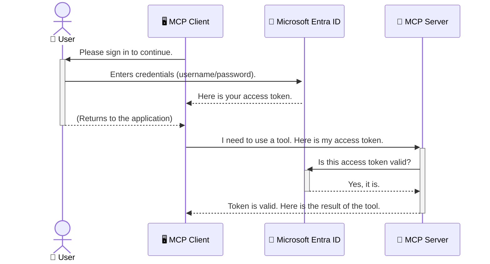

<!--
CO_OP_TRANSLATOR_METADATA:
{
  "original_hash": "6e562d7e5a77c8982da4aa8f762ad1d8",
  "translation_date": "2025-07-14T03:07:46+00:00",
  "source_file": "05-AdvancedTopics/mcp-security-entra/README.md",
  "language_code": "fi"
}
-->
# AI-työnkulkujen suojaaminen: Entra ID -todennus Model Context Protocol -palvelimille

## Johdanto
Model Context Protocol (MCP) -palvelimesi suojaaminen on yhtä tärkeää kuin kotisi etuoven lukitseminen. Jättämällä MCP-palvelimesi avoimeksi altistat työkalusi ja tietosi luvattomalle käytölle, mikä voi johtaa tietoturvaloukkauksiin. Microsoft Entra ID tarjoaa vahvan pilvipohjaisen identiteetin ja pääsynhallinnan ratkaisun, joka varmistaa, että vain valtuutetut käyttäjät ja sovellukset voivat käyttää MCP-palvelintasi. Tässä osiossa opit suojaamaan AI-työnkulkujasi Entra ID -todennuksen avulla.

## Oppimistavoitteet
Tämän osion lopussa osaat:

- Ymmärtää MCP-palvelimien suojaamisen merkityksen.
- Selittää Microsoft Entra ID:n ja OAuth 2.0 -todennuksen perusteet.
- Tunnistaa julkisten ja luottamuksellisten asiakkaiden erot.
- Toteuttaa Entra ID -todennuksen sekä paikallisissa (julkinen asiakas) että etä-MCP-palvelinympäristöissä (luottamuksellinen asiakas).
- Soveltaa tietoturvan parhaita käytäntöjä AI-työnkulkuja kehitettäessä.

## Turvallisuus ja MCP

Aivan kuten et jättäisi kotisi etuovea lukitsematta, et myöskään jätä MCP-palvelintasi vapaasti kenen tahansa käytettäväksi. AI-työnkulkujen suojaaminen on välttämätöntä, jotta voit rakentaa luotettavia, turvallisia ja kestäviä sovelluksia. Tässä luvussa tutustut Microsoft Entra ID:n käyttöön MCP-palvelimien suojaamisessa, jotta vain valtuutetut käyttäjät ja sovellukset pääsevät käsiksi työkaluihisi ja tietoihisi.

## Miksi turvallisuus on tärkeää MCP-palvelimille

Kuvittele, että MCP-palvelimellasi on työkalu, joka voi lähettää sähköposteja tai käyttää asiakasrekisteriä. Suojaamaton palvelin tarkoittaisi, että kuka tahansa voisi käyttää tätä työkalua, mikä johtaisi luvattomaan tietojen käyttöön, roskapostiin tai muihin haitallisiin toimintoihin.

Todennuksen avulla varmistat, että jokainen palvelimelle tuleva pyyntö on vahvistettu, eli käyttäjän tai sovelluksen henkilöllisyys on varmistettu. Tämä on ensimmäinen ja tärkein askel AI-työnkulkujen suojaamisessa.

## Johdanto Microsoft Entra ID:hin

[**Microsoft Entra ID**](https://adoption.microsoft.com/microsoft-security/entra/) on pilvipohjainen identiteetin ja pääsynhallinnan palvelu. Voit ajatella sitä sovellustesi yleismaailmallisena turvamiehenä. Se hoitaa monimutkaisen käyttäjien tunnistamisen (todennuksen) ja käyttöoikeuksien määrittämisen (valtuutuksen) prosessin.

Entra ID:n avulla voit:

- Mahdollistaa turvallisen kirjautumisen käyttäjille.
- Suojata API:t ja palvelut.
- Hallita käyttöoikeuspolitiikkoja keskitetysti.

MCP-palvelimille Entra ID tarjoaa vahvan ja laajalti luotetun ratkaisun hallita, kuka pääsee palvelimesi toimintoihin käsiksi.

---

## Taian ymmärtäminen: Miten Entra ID -todennus toimii

Entra ID käyttää avoimia standardeja, kuten **OAuth 2.0**, todennuksen hallintaan. Vaikka yksityiskohdat voivat olla monimutkaisia, perusajatus on yksinkertainen ja sen voi ymmärtää vertauksen avulla.

### Kevyt johdatus OAuth 2.0:aan: Parkkipaikan avain

Ajattele OAuth 2.0:aa kuin auton parkkeerauspalvelua. Kun saavut ravintolaan, et anna parkkeeraajalle pääavaintasi. Sen sijaan annat **parkkeerausavaimen**, jolla on rajatut oikeudet – se voi käynnistää auton ja lukita ovet, mutta ei avata takaluukkua tai hansikaslokeroa.

Tässä vertauksessa:

- **Sinä** olet **Käyttäjä**.
- **Autosi** on **MCP-palvelin** arvokkaine työkaluineen ja tietoineen.
- **Parkkeeraaja** on **Microsoft Entra ID**.
- **Pysäköinnin valvoja** on **MCP-asiakas** (sovellus, joka yrittää käyttää palvelinta).
- **Parkkeerausavain** on **Access Token**.

Access token on turvallinen tekstijono, jonka MCP-asiakas saa Entra ID:ltä kirjautumisen jälkeen. Asiakas esittää tämän tokenin jokaisessa pyynnössä MCP-palvelimelle. Palvelin voi varmistaa tokenin aitouden ja sen, että asiakkaalla on tarvittavat oikeudet, ilman että se käsittelee varsinaisia tunnistetietojasi (kuten salasanaasi).

### Todennusprosessi

Näin prosessi toimii käytännössä:



### Microsoft Authentication Library (MSAL) esittely

Ennen kuin siirrymme koodiin, on tärkeää esitellä keskeinen komponentti, joka näkyy esimerkeissä: **Microsoft Authentication Library (MSAL)**.

MSAL on Microsoftin kehittämä kirjasto, joka helpottaa kehittäjien työtä todennuksen kanssa. Sen sijaan, että sinun pitäisi kirjoittaa monimutkaista koodia turvatunnusten hallintaan, kirjautumisiin ja istuntojen uusimiseen, MSAL hoitaa nämä raskaammat tehtävät puolestasi.

MSAL:n käyttöä suositellaan, koska:

- **Se on turvallinen:** Se toteuttaa alan standardeja ja parhaita käytäntöjä, mikä vähentää haavoittuvuuksia koodissasi.
- **Se yksinkertaistaa kehitystä:** Se piilottaa OAuth 2.0:n ja OpenID Connectin monimutkaisuudet, jolloin voit lisätä vahvan todennuksen sovellukseesi muutamalla koodirivillä.
- **Sitä ylläpidetään aktiivisesti:** Microsoft päivittää MSAL:ia jatkuvasti vastaamaan uusia tietoturvauhkia ja alustan muutoksia.

MSAL tukee monia kieliä ja sovelluskehyksiä, kuten .NET, JavaScript/TypeScript, Python, Java, Go sekä mobiilialustoja kuten iOS ja Android. Tämä mahdollistaa yhtenäisen todennusmallin käytön koko teknologiakokonaisuudessasi.

Lisätietoja MSAL:sta löydät virallisesta [MSAL-yhteenvetodokumentaatiosta](https://learn.microsoft.com/entra/identity-platform/msal-overview).

---

## MCP-palvelimen suojaaminen Entra ID:llä: vaihe vaiheelta

Käydään nyt läpi, miten paikallinen MCP-palvelin (joka kommunikoi `stdio`-yhteydellä) suojataan Entra ID:llä. Tämä esimerkki käyttää **julkista asiakasta**, joka sopii käyttäjän koneella ajettaville sovelluksille, kuten työpöytäsovellukselle tai paikalliselle kehityspalvelimelle.

### Tapaus 1: Paikallisen MCP-palvelimen suojaaminen (julkinen asiakas)

Tässä tapauksessa tarkastelemme paikallisesti ajettavaa MCP-palvelinta, joka kommunikoi `stdio`-yhteydellä ja käyttää Entra ID:tä käyttäjän todennukseen ennen työkalujen käyttöä. Palvelimella on yksi työkalu, joka hakee käyttäjän profiilitiedot Microsoft Graph API:sta.

#### 1. Sovelluksen rekisteröinti Entra ID:ssä

Ennen koodin kirjoittamista sinun täytyy rekisteröidä sovelluksesi Microsoft Entra ID:ssä. Tämä kertoo Entra ID:lle sovelluksestasi ja antaa sille oikeuden käyttää todennuspalvelua.

1. Siirry **[Microsoft Entra -portaaliin](https://entra.microsoft.com/)**.
2. Mene kohtaan **App registrations** ja valitse **New registration**.
3. Anna sovelluksellesi nimi (esim. "My Local MCP Server").
4. Valitse **Supported account types** -kohdasta **Accounts in this organizational directory only**.
5. Voit jättää **Redirect URI** -kentän tyhjäksi tässä esimerkissä.
6. Klikkaa **Register**.

Rekisteröinnin jälkeen ota talteen **Application (client) ID** ja **Directory (tenant) ID**. Tarvitset näitä koodissasi.

#### 2. Koodin läpikäynti

Tarkastellaan koodin keskeisiä osia, jotka hoitavat todennuksen. Täydellinen koodi löytyy [Entra ID - Local - WAM](https://github.com/Azure-Samples/mcp-auth-servers/tree/main/src/entra-id-local-wam) -kansiosta [mcp-auth-servers GitHub -varastossa](https://github.com/Azure-Samples/mcp-auth-servers).

**`AuthenticationService.cs`**

Tämä luokka vastaa Entra ID:n kanssa kommunikoinnista.

- **`CreateAsync`**: Metodi alustaa MSAL:n `PublicClientApplication`-instanssin. Se konfiguroidaan sovelluksesi `clientId`- ja `tenantId`-arvoilla.
- **`WithBroker`**: Mahdollistaa brokerin (esim. Windows Web Account Manager) käytön, joka tarjoaa turvallisemman ja saumattoman kertakirjautumiskokemuksen.
- **`AcquireTokenAsync`**: Keskeinen metodi. Se yrittää ensin hakea tokenin hiljaisesti (eli käyttäjän ei tarvitse kirjautua uudelleen, jos voimassa oleva istunto on olemassa). Jos hiljaista tokenia ei löydy, käyttäjää pyydetään kirjautumaan sisään vuorovaikutteisesti.

```csharp
// Simplified for clarity
public static async Task<AuthenticationService> CreateAsync(ILogger<AuthenticationService> logger)
{
    var msalClient = PublicClientApplicationBuilder
        .Create(_clientId) // Your Application (client) ID
        .WithAuthority(AadAuthorityAudience.AzureAdMyOrg)
        .WithTenantId(_tenantId) // Your Directory (tenant) ID
        .WithBroker(new BrokerOptions(BrokerOptions.OperatingSystems.Windows))
        .Build();

    // ... cache registration ...

    return new AuthenticationService(logger, msalClient);
}

public async Task<string> AcquireTokenAsync()
{
    try
    {
        // Try silent authentication first
        var accounts = await _msalClient.GetAccountsAsync();
        var account = accounts.FirstOrDefault();

        AuthenticationResult? result = null;

        if (account != null)
        {
            result = await _msalClient.AcquireTokenSilent(_scopes, account).ExecuteAsync();
        }
        else
        {
            // If no account, or silent fails, go interactive
            result = await _msalClient.AcquireTokenInteractive(_scopes).ExecuteAsync();
        }

        return result.AccessToken;
    }
    catch (Exception ex)
    {
        _logger.LogError(ex, "An error occurred while acquiring the token.");
        throw; // Optionally rethrow the exception for higher-level handling
    }
}
```

**`Program.cs`**

Tässä tiedostossa MCP-palvelin käynnistetään ja todennuspalvelu integroidaan.

- **`AddSingleton<AuthenticationService>`**: Rekisteröi `AuthenticationService`-instanssin riippuvuussäiliöön, jotta muut sovelluksen osat (kuten työkalu) voivat käyttää sitä.
- **`GetUserDetailsFromGraph`-työkalu**: Tämä työkalu tarvitsee `AuthenticationService`-instanssin. Ennen kuin se tekee mitään, se kutsuu `authService.AcquireTokenAsync()` saadakseen voimassa olevan access tokenin. Jos todennus onnistuu, tokenilla tehdään kutsu Microsoft Graph API:in käyttäjätietojen hakemiseksi.

```csharp
// Simplified for clarity
[McpServerTool(Name = "GetUserDetailsFromGraph")]
public static async Task<string> GetUserDetailsFromGraph(
    AuthenticationService authService)
{
    try
    {
        // This will trigger the authentication flow
        var accessToken = await authService.AcquireTokenAsync();

        // Use the token to create a GraphServiceClient
        var graphClient = new GraphServiceClient(
            new BaseBearerTokenAuthenticationProvider(new TokenProvider(authService)));

        var user = await graphClient.Me.GetAsync();

        return System.Text.Json.JsonSerializer.Serialize(user);
    }
    catch (Exception ex)
    {
        return $"Error: {ex.Message}";
    }
}
```

#### 3. Miten kaikki toimii yhdessä

1. Kun MCP-asiakas yrittää käyttää `GetUserDetailsFromGraph`-työkalua, työkalu kutsuu ensin `AcquireTokenAsync`.
2. `AcquireTokenAsync` saa MSAL-kirjaston tarkistamaan, onko voimassa oleva token.
3. Jos tokenia ei löydy, MSAL brokerin kautta pyytää käyttäjää kirjautumaan sisään Entra ID -tilillään.
4. Kirjautumisen jälkeen Entra ID myöntää access tokenin.
5. Työkalu saa tokenin ja käyttää sitä turvalliseen kutsuun Microsoft Graph API:in.
6. Käyttäjätiedot palautetaan MCP-asiakkaalle.

Tämä prosessi varmistaa, että vain todennetut käyttäjät voivat käyttää työkalua, mikä suojaa paikallista MCP-palvelintasi tehokkaasti.

### Tapaus 2: Etä-MCP-palvelimen suojaaminen (luottamuksellinen asiakas)

Kun MCP-palvelimesi toimii etäkoneella (esim. pilvipalvelimella) ja kommunikoi protokollalla kuten HTTP Streaming, turvallisuusvaatimukset ovat erilaiset. Tässä tapauksessa käytetään **luottamuksellista asiakasta** ja **Authorization Code Flow** -menetelmää. Tämä on turvallisempi tapa, koska sovelluksen salaisuudet eivät koskaan paljastu selaimelle.

Tämä esimerkki käyttää TypeScript-pohjaista MCP-palvelinta, joka hyödyntää Express.js:ää HTTP-pyyntöjen käsittelyyn.

#### 1. Sovelluksen rekisteröinti Entra ID:ssä

Rekisteröinti on samankaltainen kuin julkisella asiakkaalla, mutta yksi tärkeä ero on: sinun täytyy luoda **client secret**.

1. Siirry **[Microsoft Entra -portaaliin](https://entra.microsoft.com/)**.
2. Sovelluksesi rekisteröinnissä mene kohtaan **Certificates & secrets**.
3. Klikkaa **New client secret**, anna kuvaus ja valitse **Add**.
4. **Tärkeää:** Kopioi salaisuus heti talteen, sillä et näe sitä enää myöhemmin.
5. Sinun täytyy myös määrittää **Redirect URI**. Mene kohtaan **Authentication**, valitse **Add a platform**, valitse **Web** ja syötä sovelluksesi uudelleenohjaus-URI (esim. `http://localhost:3001/auth/callback`).

> **⚠️ Tärkeä tietoturvavaroitus:** Tuotantosovelluksissa Microsoft suosittelee vahvasti käyttämään **salaisuudettomia todennusmenetelmiä**, kuten **Managed Identity** tai **Workload Identity Federation** client secretien sijaan. Client secretit voivat paljastua tai joutua vääriin käsiin, mikä aiheuttaa tietoturvariskin. Managed identityt tarjoavat turvallisemman ratkaisun, koska tunnistetietoja ei tarvitse tallentaa koodiin tai konfiguraatioon.
>
> Lisätietoja hallituista identiteeteistä ja niiden käyttöönotosta löydät [Managed identities for Azure resources overview](https://learn.microsoft.com/entra/identity/managed-identities-azure-resources/overview) -sivulta.

#### 2. Koodin läpikäynti

Tässä esimerkissä käytetään istuntopohjaista lähestymistapaa. Kun käyttäjä todennetaan, palvelin tallentaa access tokenin ja refresh tokenin istuntoon ja antaa käyttäjälle istuntotunnuksen. Tätä istuntotunnusta käytetään myöhemmissä pyynnöissä. Täydellinen koodi löytyy [Entra ID - Confidential client](https://github.com/Azure-Samples/mcp-auth-servers/tree/main/src/entra-id-cca-session) -kansiosta [mcp-auth-servers GitHub -varastossa](https://github.com/Azure-Samples/mcp-auth-servers).

**`Server.ts`**

Tämä tiedosto käynnistää Express-palvelimen ja MCP:n siirtokerroksen.

- **`requireBearerAuth`**: Middleware, joka suojaa `/sse`- ja `/message`-päätepisteet. Se tarkistaa, että pyynnössä on voimassa oleva bearer-token `Authorization`-otsikossa.
- **`EntraIdServerAuthProvider`**: Mukautettu luokka, joka toteuttaa `McpServerAuthorizationProvider`-rajapinnan. Se hoitaa OAuth 2.0 -virran.
- **`/auth/callback`**: Tämä päätepiste käsittelee Entra ID:ltä tulevan uudelleenohjauksen käyttäjän todennuksen jälkeen. Se vaihtaa valtuutuskoodin access tokeniksi ja refresh tokeniksi.

```typescript
// Simplified for clarity
const app = express();
const { server } = createServer();
const provider = new EntraIdServerAuthProvider();

// Protect the SSE endpoint
app.get("/sse", requireBearerAuth({
  provider,
  requiredScopes: ["User.Read"]
}), async (req, res) => {
  // ... connect to the transport ...
});

// Protect the message endpoint
app.post("/message", requireBearerAuth({
  provider,
  requiredScopes: ["User.Read"]
}), async (req, res) => {
  // ... handle the message ...
});

// Handle the OAuth 2.0 callback
app.get("/auth/callback", (req, res) => {
  provider.handleCallback(req.query.code, req.query.state)
    .then(result => {
      // ... handle success or failure ...
    });
});
```

**`Tools.ts`**

Tässä tiedostossa määritellään MCP-palvelimen tarjoamat työkalut. `getUserDetails`-työkalu on samankaltainen kuin edellisessä esimerkissä, mutta se hakee access tokenin istunnosta.

```typescript
// Simplified for clarity
server.setRequestHandler(CallToolRequestSchema, async (request) => {
  const { name } = request.params;
  const context = request.params?.context as { token?: string } | undefined;
  const sessionToken = context?.token;

  if (name === ToolName.GET_USER_DETAILS) {
    if (!sessionToken) {
      throw new AuthenticationError("Authentication token is missing or invalid. Ensure the token is provided in the request context.");
    }

    // Get the Entra ID token from the session store
    const tokenData = tokenStore.getToken(sessionToken);
    const entraIdToken = tokenData.accessToken;

    const graphClient = Client.init({
      authProvider: (done) => {
        done(null, entraIdToken);
      }
    });

    const user = await graphClient.api('/me').get();

    // ... return user details ...
  }
});
```

**`auth/EntraIdServerAuthProvider.ts`**

Tämä luokka hoitaa:

- Käyttäjän uudelleenohjauksen Entra ID:n kirjautumissivulle.
- Valtuutuskoodin vaihtamisen access tokeniksi.
- Tokenien tallentamisen `tokenStore`-muistiin.
- Access tokenin uusimisen sen vanhentuessa.

#### 3. Miten kaikki toimii yhdessä

1. Kun käyttäjä yrittää ensimmäistä kertaa yhdistää MCP-palvelimeen, `requireBearerAuth`-middleware havaitsee, ettei käyttäjällä ole voimassa olevaa istuntoa ja ohjaa hänet Entra ID:n kirjautumissivulle.
2. Käyttäjä kirjautuu sisään Entra ID -tilillään.
3. Entra ID ohjaa käyttäjän takaisin `/auth/callback`-päätepisteeseen valtuutuskoodin kanssa.
4. Palvelin vaihtaa koodin käyttöoikeustunnukseen ja päivitystunnukseen, tallentaa ne ja luo istuntotunnuksen, joka lähetetään asiakkaalle.  
5. Asiakas voi nyt käyttää tätä istuntotunnusta `Authorization`-otsikossa kaikissa tulevissa pyynnöissä MCP-palvelimelle.  
6. Kun `getUserDetails`-työkalu kutsutaan, se käyttää istuntotunnusta hakeakseen Entra ID:n käyttöoikeustunnuksen ja käyttää sitä Microsoft Graph API:n kutsumiseen.

Tämä prosessi on monimutkaisempi kuin julkisen asiakkaan virtaus, mutta se on välttämätön internetiin suuntautuville rajapinnoille. Koska etä-MCP-palvelimet ovat julkisen internetin kautta saavutettavissa, ne tarvitsevat vahvempia turvatoimia estääkseen luvattoman pääsyn ja mahdolliset hyökkäykset.


## Turvallisuuden parhaat käytännöt

- **Käytä aina HTTPS-yhteyttä**: Salaa viestintä asiakkaan ja palvelimen välillä suojataksesi tunnuksia sieppaukselta.  
- **Ota käyttöön roolipohjainen pääsynhallinta (RBAC)**: Älä tarkista pelkästään *onko* käyttäjä todennettu, vaan myös *mihin* hänellä on oikeudet. Voit määritellä roolit Entra ID:ssä ja tarkistaa ne MCP-palvelimellasi.  
- **Valvo ja tarkasta**: Kirjaa kaikki todennustapahtumat, jotta voit havaita ja reagoida epäilyttävään toimintaan.  
- **Käsittele pyyntöjen rajoitukset ja hidastukset**: Microsoft Graph ja muut API:t käyttävät pyyntöjen rajoituksia väärinkäytön estämiseksi. Toteuta MCP-palvelimessasi eksponentiaalinen takaisinotto ja uudelleenyrityslogiikka HTTP 429 (Liian monta pyyntöä) -vastauksien hallintaan. Harkitse usein käytettyjen tietojen välimuistia API-kutsujen vähentämiseksi.  
- **Säilytä tunnukset turvallisesti**: Tallenna käyttöoikeus- ja päivitystunnukset turvallisesti. Paikallisissa sovelluksissa käytä järjestelmän tarjoamia turvallisia tallennusmenetelmiä. Palvelinsovelluksissa harkitse salattua tallennusta tai turvallisia avainhallintapalveluita, kuten Azure Key Vaultia.  
- **Käsittele tunnusten vanheneminen**: Käyttöoikeustunnuksilla on rajallinen voimassaoloaika. Toteuta automaattinen tunnusten päivitys päivitystunnusten avulla, jotta käyttäjäkokemus pysyy saumattomana ilman uudelleentodennusta.  
- **Harkitse Azure API Managementin käyttöä**: Vaikka turvallisuuden toteuttaminen suoraan MCP-palvelimessa antaa sinulle tarkemman hallinnan, API-portaalit kuten Azure API Management voivat hoitaa monia turvallisuusasioita automaattisesti, mukaan lukien todennuksen, valtuutuksen, pyyntöjen rajoittamisen ja valvonnan. Ne tarjoavat keskitetyn turvakerroksen asiakkaidesi ja MCP-palvelimiesi väliin. Lisätietoja API-portaiden käytöstä MCP:n kanssa löydät artikkelistamme [Azure API Management Your Auth Gateway For MCP Servers](https://techcommunity.microsoft.com/blog/integrationsonazureblog/azure-api-management-your-auth-gateway-for-mcp-servers/4402690).


## Keskeiset opit

- MCP-palvelimen suojaaminen on ratkaisevan tärkeää tietojesi ja työkalujesi turvaamiseksi.  
- Microsoft Entra ID tarjoaa vahvan ja skaalautuvan ratkaisun todennukseen ja valtuutukseen.  
- Käytä **julkista asiakasta** paikallisiin sovelluksiin ja **luottamuksellista asiakasta** etäpalvelimille.  
- **Authorization Code Flow** on turvallisin vaihtoehto web-sovelluksille.


## Harjoitus

1. Mieti MCP-palvelinta, jonka voisit rakentaa. Olisiko se paikallinen vai etäpalvelin?  
2. Vastauksesi perusteella, käyttäisitkö julkista vai luottamuksellista asiakasta?  
3. Mitä käyttöoikeuksia MCP-palvelimesi pyytäisi Microsoft Graphin toimintojen suorittamiseen?


## Käytännön harjoitukset

### Harjoitus 1: Rekisteröi sovellus Entra ID:ssä  
Siirry Microsoft Entra -portaaliin.  
Rekisteröi uusi sovellus MCP-palvelimellesi.  
Tallenna Application (client) ID ja Directory (tenant) ID.

### Harjoitus 2: Suojaa paikallinen MCP-palvelin (julkinen asiakas)  
- Seuraa koodiesimerkkiä MSAL:n (Microsoft Authentication Library) integroimiseksi käyttäjien todennukseen.  
- Testaa todennusvirtaus kutsumalla MCP-työkalua, joka hakee käyttäjätiedot Microsoft Graphista.

### Harjoitus 3: Suojaa etä-MCP-palvelin (luottamuksellinen asiakas)  
- Rekisteröi luottamuksellinen asiakas Entra ID:ssä ja luo asiakassalaisuus.  
- Määritä Express.js MCP-palvelimesi käyttämään Authorization Code Flow'ta.  
- Testaa suojattuja rajapintoja ja varmista tunnuspohjainen pääsy.

### Harjoitus 4: Ota käyttöön turvallisuuden parhaat käytännöt  
- Ota HTTPS käyttöön paikallisessa tai etäpalvelimessasi.  
- Toteuta roolipohjainen pääsynhallinta (RBAC) palvelinlogiikassasi.  
- Lisää tunnusten vanhenemisen käsittely ja turvallinen tallennus.


## Resurssit

1. **MSAL Overview Documentation**  
   Opi, miten Microsoft Authentication Library (MSAL) mahdollistaa turvallisen tunnusten hankinnan eri alustoilla:  
   [MSAL Overview on Microsoft Learn](https://learn.microsoft.com/en-gb/entra/msal/overview)

2. **Azure-Samples/mcp-auth-servers GitHub Repository**  
   MCP-palvelimien referenssitoteutuksia, jotka demonstroivat todennusvirtoja:  
   [Azure-Samples/mcp-auth-servers on GitHub](https://github.com/Azure-Samples/mcp-auth-servers)

3. **Managed Identities for Azure Resources Overview**  
   Ymmärrä, miten voit poistaa salaisuudet käytöstä käyttämällä järjestelmän tai käyttäjän määrittelemiä hallittuja identiteettejä:  
   [Managed Identities Overview on Microsoft Learn](https://learn.microsoft.com/en-us/entra/identity/managed-identities-azure-resources/)

4. **Azure API Management: Your Auth Gateway for MCP Servers**  
   Syvällinen katsaus APIM:n käyttöön turvallisena OAuth2-porttina MCP-palvelimille:  
   [Azure API Management Your Auth Gateway For MCP Servers](https://techcommunity.microsoft.com/blog/integrationsonazureblog/azure-api-management-your-auth-gateway-for-mcp-servers/4402690)

5. **Microsoft Graph Permissions Reference**  
   Laaja luettelo Microsoft Graphin valtuutetuista ja sovelluskohtaisista käyttöoikeuksista:  
   [Microsoft Graph Permissions Reference](https://learn.microsoft.com/zh-tw/graph/permissions-reference)


## Oppimistavoitteet  
Tämän osion suorittamisen jälkeen osaat:

- Selittää, miksi todennus on kriittinen MCP-palvelimille ja AI-työnkuluissa.  
- Määrittää ja konfiguroida Entra ID -todennuksen sekä paikallisiin että etä-MCP-palvelinympäristöihin.  
- Valita sopivan asiakastyypin (julkinen tai luottamuksellinen) palvelimesi käyttöönoton perusteella.  
- Toteuttaa turvallisia ohjelmointikäytäntöjä, mukaan lukien tunnusten tallennus ja roolipohjainen valtuutus.  
- Suojata MCP-palvelimesi ja sen työkalut luotettavasti luvattomalta käytöltä.

## Mitä seuraavaksi

- [5.13 Model Context Protocol (MCP) Integration with Azure AI Foundry](../mcp-foundry-agent-integration/README.md)

**Vastuuvapauslauseke**:  
Tämä asiakirja on käännetty käyttämällä tekoälypohjaista käännöspalvelua [Co-op Translator](https://github.com/Azure/co-op-translator). Vaikka pyrimme tarkkuuteen, huomioithan, että automaattikäännöksissä saattaa esiintyä virheitä tai epätarkkuuksia. Alkuperäistä asiakirjaa sen alkuperäiskielellä tulee pitää virallisena lähteenä. Tärkeissä tiedoissa suositellaan ammattimaista ihmiskäännöstä. Emme ole vastuussa tämän käännöksen käytöstä aiheutuvista väärinymmärryksistä tai tulkinnoista.