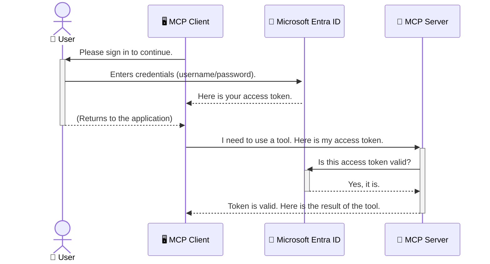

<!--
CO_OP_TRANSLATOR_METADATA:
{
  "original_hash": "0abf26a6c4dbe905d5d49ccdc0ccfe92",
  "translation_date": "2025-06-26T16:33:43+00:00",
  "source_file": "05-AdvancedTopics/mcp-security-entra/README.md",
  "language_code": "fi"
}
-->
# Securing AI Workflows: Entra ID Authentication for Model Context Protocol Servers

## Johdanto
Model Context Protocol (MCP) -palvelimesi suojaaminen on yhtä tärkeää kuin kotisi etuoven lukitseminen. Jättämällä MCP-palvelimesi avoimeksi altistat työkalusi ja tietosi luvattomalle käytölle, mikä voi johtaa tietoturvaloukkauksiin. Microsoft Entra ID tarjoaa vahvan pilvipohjaisen identiteetin- ja pääsynhallintaratkaisun, joka varmistaa, että vain valtuutetut käyttäjät ja sovellukset voivat olla vuorovaikutuksessa MCP-palvelimesi kanssa. Tässä osiossa opit suojaamaan tekoälytyönkulkujasi Entra ID -todennuksen avulla.

## Oppimistavoitteet
Tämän osion lopussa osaat:

- Ymmärtää MCP-palvelinten suojaamisen merkityksen.
- Selittää Microsoft Entra ID:n ja OAuth 2.0 -todennuksen perusteet.
- Tunnistaa julkisten ja luottamuksellisten asiakkaiden erot.
- Toteuttaa Entra ID -todennuksen sekä paikallisissa (julkinen asiakas) että etä-MCP-palvelinympäristöissä (luottamuksellinen asiakas).
- Soveltaa tietoturvan parhaita käytäntöjä tekoälytyönkulkuja kehittäessäsi.

## Turvallisuus ja MCP

Aivan kuten et jättäisi kotisi etuovea lukitsematta, et myöskään saa jättää MCP-palvelintasi avoimeksi kenen tahansa käyttöön. Tekoälytyönkulkujen suojaaminen on välttämätöntä, jotta voit rakentaa luotettavia, turvallisia ja vahvoja sovelluksia. Tässä luvussa tutustut Microsoft Entra ID:n käyttöön MCP-palvelimiesi suojaamisessa, jotta vain valtuutetut käyttäjät ja sovellukset pääsevät työkaluihisi ja tietoihisi käsiksi.

## Miksi turvallisuus on tärkeää MCP-palvelimille

Kuvittele, että MCP-palvelimellasi on työkalu, joka voi lähettää sähköposteja tai käyttää asiakasrekisteriä. Suojaamaton palvelin tarkoittaisi, että kuka tahansa voisi käyttää tätä työkalua, mikä johtaisi luvattomaan tietojen käsittelyyn, roskapostiin tai muihin haitallisiin toimiin.

Todennuksen avulla varmistat, että jokainen pyyntö palvelimellesi on vahvistettu ja että pyyntöä tekevä käyttäjä tai sovellus on tunnistettu. Tämä on ensimmäinen ja tärkein askel tekoälytyönkulkujen suojaamisessa.

## Johdanto Microsoft Entra ID:hen

[**Microsoft Entra ID**](https://adoption.microsoft.com/microsoft-security/entra/) on pilvipohjainen identiteetin- ja pääsynhallintapalvelu. Voit ajatella sitä sovellustesi yleismaailmallisena turvamiehenä. Se hoitaa monimutkaisen prosessin käyttäjien tunnistamisessa (todennus) ja sen määrittämisessä, mitä he saavat tehdä (valtuutus).

Entra ID:n avulla voit:

- Mahdollistaa käyttäjille turvallisen kirjautumisen.
- Suojata rajapintoja ja palveluita.
- Hallita pääsypolitiikkoja keskitetysti.

MCP-palvelimille Entra ID tarjoaa vahvan ja laajalti luotetun ratkaisun, jolla hallitaan, kuka pääsee käyttämään palvelimesi toimintoja.

---

## Ymmärtäminen: Miten Entra ID -todennus toimii

Entra ID käyttää avoimia standardeja, kuten **OAuth 2.0**, todennuksen hallintaan. Vaikka yksityiskohdat voivat olla monimutkaisia, perusajatus on yksinkertainen ja sen voi ymmärtää vertauksen avulla.

### Kevyt johdanto OAuth 2.0:aan: Parkkipaikan avain

Ajattele OAuth 2.0:aa kuin auton pysäköintipalvelua. Kun saavut ravintolaan, et anna parkkiapulaiselle pääavaintasi. Sen sijaan annat **parkkiavaimen**, jolla on rajoitetut oikeudet – se voi käynnistää auton ja lukita ovet, mutta ei avata takakonttia tai hansikaslokeroa.

Tässä vertauksessa:

- **Sinä** olet **Käyttäjä**.
- **Autosi** on **MCP-palvelin**, jossa on arvokkaita työkaluja ja tietoja.
- **Parkkiapulainen** on **Microsoft Entra ID**.
- **Pysäköinnin valvoja** on **MCP-asiakas** (sovellus, joka yrittää käyttää palvelinta).
- **Parkkiavain** on **Access Token** (käyttöoikeustunnus).

Käyttöoikeustunnus on turvallinen tekstimuotoinen merkkijono, jonka MCP-asiakas saa Entra ID:ltä kirjautumisen jälkeen. Asiakas esittää tämän tunnuksen palvelimelle jokaisessa pyynnössä. Palvelin voi varmistaa tunnuksen aitouden ja sen, että asiakkaalla on tarvittavat oikeudet, ilman että se käsittelee suoraan käyttäjän todellisia tunnuksia (kuten salasanaa).

### Todennusprosessi

Näin prosessi toimii käytännössä:



### Microsoft Authentication Library (MSAL) esittely

Ennen kuin siirrymme koodiin, on tärkeää esitellä keskeinen komponentti, joka esiintyy esimerkeissä: **Microsoft Authentication Library (MSAL)**.

MSAL on Microsoftin kehittämä kirjasto, joka helpottaa kehittäjien työtä todennuksen kanssa. Sen sijaan, että sinun pitäisi kirjoittaa monimutkaista koodia turvatunnusten käsittelyyn, kirjautumisten hallintaan ja istuntojen uudistamiseen, MSAL hoitaa nämä puolestasi.

MSAL:n käyttöä suositellaan, koska:

- **Se on turvallinen:** Se toteuttaa alan standardit protokollat ja parhaat tietoturvakäytännöt, vähentäen haavoittuvuuksia koodissasi.
- **Se yksinkertaistaa kehitystä:** Se abstrahoi OAuth 2.0- ja OpenID Connect -protokollien monimutkaisuuden, jolloin voit lisätä vahvan todennuksen sovellukseesi muutamalla koodirivillä.
- **Sitä ylläpidetään aktiivisesti:** Microsoft päivittää MSAL:ia jatkuvasti vastaamaan uusia tietoturvauhkia ja alustamuutoksia.

MSAL tukee monia kieliä ja sovelluskehyksiä, kuten .NET, JavaScript/TypeScript, Python, Java, Go sekä mobiilialustoja kuten iOS ja Android. Tämä mahdollistaa yhdenmukaisten todennusmallien käytön koko teknologia-alustallasi.

Lisätietoja MSAL:sta löydät virallisesta [MSAL-yleiskatsausdokumentaatiosta](https://learn.microsoft.com/entra/identity-platform/msal-overview).

---

## MCP-palvelimen suojaaminen Entra ID:llä: vaihe vaiheelta

Käydään läpi, miten paikallinen MCP-palvelin (joka kommunikoi `stdio`) using Entra ID. This example uses a **public client**, which is suitable for applications running on a user's machine, like a desktop app or a local development server.

### Scenario 1: Securing a Local MCP Server (with a Public Client)

In this scenario, we'll look at an MCP server that runs locally, communicates over `stdio`, and uses Entra ID to authenticate the user before allowing access to its tools. The server will have a single tool that fetches the user's profile information from the Microsoft Graph API.

#### 1. Setting Up the Application in Entra ID

Before writing any code, you need to register your application in Microsoft Entra ID. This tells Entra ID about your application and grants it permission to use the authentication service.

1. Navigate to the **[Microsoft Entra portal](https://entra.microsoft.com/)**.
2. Go to **App registrations** and click **New registration**.
3. Give your application a name (e.g., "My Local MCP Server").
4. For **Supported account types**, select **Accounts in this organizational directory only**.
5. You can leave the **Redirect URI** blank for this example.
6. Click **Register**.

Once registered, take note of the **Application (client) ID** and **Directory (tenant) ID**. You'll need these in your code.

#### 2. The Code: A Breakdown

Let's look at the key parts of the code that handle authentication. The full code for this example is available in the [Entra ID - Local - WAM](https://github.com/Azure-Samples/mcp-auth-servers/tree/main/src/entra-id-local-wam) folder of the [mcp-auth-servers GitHub repository](https://github.com/Azure-Samples/mcp-auth-servers).

**`AuthenticationService.cs`**

This class is responsible for handling the interaction with Entra ID.

- **`CreateAsync`**: This method initializes the `PublicClientApplication` from the MSAL (Microsoft Authentication Library). It's configured with your application's `clientId` and `tenantId`.
- **`WithBroker`**: This enables the use of a broker (like the Windows Web Account Manager), which provides a more secure and seamless single sign-on experience.
- **`AcquireTokenAsync`**-menetelmällä) suojataan: Tämä on keskeinen menetelmä, joka yrittää ensin hankkia tunnuksen hiljaisesti (eli käyttäjän ei tarvitse kirjautua uudelleen, jos istunto on voimassa). Jos hiljaista tunnusta ei saada, käyttäjää pyydetään kirjautumaan vuorovaikutteisesti.

```csharp
// Simplified for clarity
public static async Task<AuthenticationService> CreateAsync(ILogger<AuthenticationService> logger)
{
    var msalClient = PublicClientApplicationBuilder
        .Create(_clientId) // Your Application (client) ID
        .WithAuthority(AadAuthorityAudience.AzureAdMyOrg)
        .WithTenantId(_tenantId) // Your Directory (tenant) ID
        .WithBroker(new BrokerOptions(BrokerOptions.OperatingSystems.Windows))
        .Build();

    // ... cache registration ...

    return new AuthenticationService(logger, msalClient);
}

public async Task<string> AcquireTokenAsync()
{
    try
    {
        // Try silent authentication first
        var accounts = await _msalClient.GetAccountsAsync();
        var account = accounts.FirstOrDefault();

        AuthenticationResult? result = null;

        if (account != null)
        {
            result = await _msalClient.AcquireTokenSilent(_scopes, account).ExecuteAsync();
        }
        else
        {
            // If no account, or silent fails, go interactive
            result = await _msalClient.AcquireTokenInteractive(_scopes).ExecuteAsync();
        }

        return result.AccessToken;
    }
    catch (Exception ex)
    {
        _logger.LogError(ex, "An error occurred while acquiring the token.");
        throw; // Optionally rethrow the exception for higher-level handling
    }
}
```

**`Program.cs`**

This is where the MCP server is set up and the authentication service is integrated.

- **`AddSingleton<AuthenticationService>`**: This registers the `AuthenticationService` with the dependency injection container, so it can be used by other parts of the application (like our tool).
- **`GetUserDetailsFromGraph` tool**: This tool requires an instance of `AuthenticationService`. Before it does anything, it calls `authService.AcquireTokenAsync()`** hakee voimassa olevan käyttöoikeustunnuksen. Jos todennus onnistuu, tunnusta käytetään Microsoft Graph API:n kutsumiseen ja käyttäjätietojen hakemiseen.

```csharp
// Simplified for clarity
[McpServerTool(Name = "GetUserDetailsFromGraph")]
public static async Task<string> GetUserDetailsFromGraph(
    AuthenticationService authService)
{
    try
    {
        // This will trigger the authentication flow
        var accessToken = await authService.AcquireTokenAsync();

        // Use the token to create a GraphServiceClient
        var graphClient = new GraphServiceClient(
            new BaseBearerTokenAuthenticationProvider(new TokenProvider(authService)));

        var user = await graphClient.Me.GetAsync();

        return System.Text.Json.JsonSerializer.Serialize(user);
    }
    catch (Exception ex)
    {
        return $"Error: {ex.Message}";
    }
}
```

#### 3. Miten kaikki toimii yhdessä

1. Kun MCP-asiakas yrittää käyttää `GetUserDetailsFromGraph` tool, the tool first calls `AcquireTokenAsync`.
2. `AcquireTokenAsync` triggers the MSAL library to check for a valid token.
3. If no token is found, MSAL, through the broker, will prompt the user to sign in with their Entra ID account.
4. Once the user signs in, Entra ID issues an access token.
5. The tool receives the token and uses it to make a secure call to the Microsoft Graph API.
6. The user's details are returned to the MCP client.

This process ensures that only authenticated users can use the tool, effectively securing your local MCP server.

### Scenario 2: Securing a Remote MCP Server (with a Confidential Client)

When your MCP server is running on a remote machine (like a cloud server) and communicates over a protocol like HTTP Streaming, the security requirements are different. In this case, you should use a **confidential client** and the **Authorization Code Flow**. This is a more secure method because the application's secrets are never exposed to the browser.

This example uses a TypeScript-based MCP server that uses Express.js to handle HTTP requests.

#### 1. Setting Up the Application in Entra ID

The setup in Entra ID is similar to the public client, but with one key difference: you need to create a **client secret**.

1. Navigate to the **[Microsoft Entra portal](https://entra.microsoft.com/)**.
2. In your app registration, go to the **Certificates & secrets** tab.
3. Click **New client secret**, give it a description, and click **Add**.
4. **Important:** Copy the secret value immediately. You will not be able to see it again.
5. You also need to configure a **Redirect URI**. Go to the **Authentication** tab, click **Add a platform**, select **Web**, and enter the redirect URI for your application (e.g., `http://localhost:3001/auth/callback`).

> **⚠️ Important Security Note:** For production applications, Microsoft strongly recommends using **secretless authentication** methods such as **Managed Identity** or **Workload Identity Federation** instead of client secrets. Client secrets pose security risks as they can be exposed or compromised. Managed identities provide a more secure approach by eliminating the need to store credentials in your code or configuration.
>
> For more information about managed identities and how to implement them, see the [Managed identities for Azure resources overview](https://learn.microsoft.com/entra/identity/managed-identities-azure-resources/overview).

#### 2. The Code: A Breakdown

This example uses a session-based approach. When the user authenticates, the server stores the access token and refresh token in a session and gives the user a session token. This session token is then used for subsequent requests. The full code for this example is available in the [Entra ID - Confidential client](https://github.com/Azure-Samples/mcp-auth-servers/tree/main/src/entra-id-cca-session) folder of the [mcp-auth-servers GitHub repository](https://github.com/Azure-Samples/mcp-auth-servers).

**`Server.ts`**

This file sets up the Express server and the MCP transport layer.

- **`requireBearerAuth`**: This is middleware that protects the `/sse` and `/message` endpoints. It checks for a valid bearer token in the `Authorization` header of the request.
- **`EntraIdServerAuthProvider`**: This is a custom class that implements the `McpServerAuthorizationProvider` interface. It's responsible for handling the OAuth 2.0 flow.
- **`/auth/callback`**-päätepistettä, se käsittelee Entra ID:ltä käyttäjän kirjautumisen jälkeen tulevan uudelleenohjauksen. Se vaihtaa valtuutuskoodin käyttöoikeustunnukseen ja uudistustunnukseen.

```typescript
// Simplified for clarity
const app = express();
const { server } = createServer();
const provider = new EntraIdServerAuthProvider();

// Protect the SSE endpoint
app.get("/sse", requireBearerAuth({
  provider,
  requiredScopes: ["User.Read"]
}), async (req, res) => {
  // ... connect to the transport ...
});

// Protect the message endpoint
app.post("/message", requireBearerAuth({
  provider,
  requiredScopes: ["User.Read"]
}), async (req, res) => {
  // ... handle the message ...
});

// Handle the OAuth 2.0 callback
app.get("/auth/callback", (req, res) => {
  provider.handleCallback(req.query.code, req.query.state)
    .then(result => {
      // ... handle success or failure ...
    });
});
```

**`Tools.ts`**

This file defines the tools that the MCP server provides. The `getUserDetails`** -työkalu on samankaltainen kuin edellisessä esimerkissä, mutta se hakee käyttöoikeustunnuksen istunnosta.

```typescript
// Simplified for clarity
server.setRequestHandler(CallToolRequestSchema, async (request) => {
  const { name } = request.params;
  const context = request.params?.context as { token?: string } | undefined;
  const sessionToken = context?.token;

  if (name === ToolName.GET_USER_DETAILS) {
    if (!sessionToken) {
      throw new AuthenticationError("Authentication token is missing or invalid. Ensure the token is provided in the request context.");
    }

    // Get the Entra ID token from the session store
    const tokenData = tokenStore.getToken(sessionToken);
    const entraIdToken = tokenData.accessToken;

    const graphClient = Client.init({
      authProvider: (done) => {
        done(null, entraIdToken);
      }
    });

    const user = await graphClient.api('/me').get();

    // ... return user details ...
  }
});
```

Kun **`auth/EntraIdServerAuthProvider.ts`**

This class handles the logic for:

- Redirecting the user to the Entra ID sign-in page.
- Exchanging the authorization code for an access token.
- Storing the tokens in the `tokenStore`.
- Refreshing the access token when it expires.

#### 3. How It All Works Together

1. When a user first tries to connect to the MCP server, the `requireBearerAuth` middleware will see that they don't have a valid session and will redirect them to the Entra ID sign-in page.
2. The user signs in with their Entra ID account.
3. Entra ID redirects the user back to the `/auth/callback` endpoint with an authorization code.
4. The server exchanges the code for an access token and a refresh token, stores them, and creates a session token which is sent to the client.
5. The client can now use this session token in the `Authorization` header for all future requests to the MCP server.
6. When the `getUserDetails`** -työkalu kutsutaan, se käyttää istuntotunnusta hakeakseen Entra ID:n käyttöoikeustunnuksen ja kutsuu sitten Microsoft Graph API:a.

Tämä työnkulku on monimutkaisempi kuin julkisen asiakkaan virtaus, mutta se on välttämätön internetiin suuntautuville päätepisteille. Koska etä-MCP-palvelimet ovat julkisen internetin kautta saavutettavissa, ne tarvitsevat vahvempia turvatoimia estääkseen luvattoman käytön ja mahdolliset hyökkäykset.

## Turvallisuuden parhaat käytännöt

- **Käytä aina HTTPS:ää**: Salaa asiakas-palvelin -välinen liikenne, jotta tunnuksia ei voida siepata.
- **Ota käyttöön roolipohjainen pääsynhallinta (RBAC)**: Älä tarkista vain *onko* käyttäjä todennettu, vaan myös *mitä* hän saa tehdä. Voit määritellä roolit Entra ID:ssä ja tarkistaa ne MCP-palvelimella.
- **Valvo ja tarkasta**: Kirjaa kaikki todennustapahtumat, jotta voit havaita ja reagoida epäilyttäviin toimintoihin.
- **Hallitse pyynnön rajoituksia ja throttlingia**: Microsoft Graph ja muut rajapinnat rajoittavat pyyntöjen määrää väärinkäytösten estämiseksi. Toteuta eksponentiaalinen takaisinkytkentä ja uudelleenyrittomekanismit MCP-palvelimessasi käsitelläksesi sujuvasti HTTP 429 (Liian monta pyyntöä) -vastauksia. Harkitse usein käytettyjen tietojen välimuistia API-kutsujen vähentämiseksi.
- **Suojaa tunnusten tallennus**: Säilytä käyttö- ja uudistustunnukset turvallisesti. Paikallisissa sovelluksissa käytä järjestelmän turvallisia tallennusmenetelmiä. Palvelinsovelluksissa harkitse salattua tallennusta tai turvallisia avainhallintapalveluita kuten Azure Key Vaultia.
- **Hallinnoi tunnusten vanhenemista**: Käyttöoikeustunnuksilla on rajattu voimassaoloaika. Toteuta automaattinen tunnusten uudistus uudistustunnuksilla, jotta käyttäjäkokemus pysyy saumattomana ilman uudelleentodennusta.
- **Harkitse Azure API Managementin käyttöä**: Vaikka tietoturvan toteuttaminen suoraan MCP-palvelimessa antaa sinulle tarkemman hallinnan, API Gatewayt kuten Azure API Management voivat hoitaa monia tietoturvaan liittyviä asioita automaattisesti, mukaan lukien todennuksen, valtuutuksen, pyynnön rajoitukset ja valvonnan. Ne tarjoavat keskitetyn suojaustason asiakkaiden ja MCP-palvelimien välille. Lisätietoja API Gatewayn käytöstä MCP:n kanssa löydät artikkelistamme [Azure API Management Your Auth Gateway For MCP Servers](https://techcommunity.microsoft.com/blog/integrationsonazureblog/azure-api-management-your-auth-gateway-for-mcp-servers/4402690).

## Keskeiset opit

- MCP-palvelimen suojaaminen on ratkaisevan tärkeää tietojen ja työkalujen turvaamiseksi.
- Microsoft Entra ID tarjoaa vahvan ja skaalautuvan ratkaisun todennukseen ja valtuutukseen.
- Käytä **julkista asiakasta** paikallisissa sovelluksissa ja **luottamuksellista asiakasta** etäpalvelimissa.
- **Authorization Code Flow** on turvallisin vaihtoehto web-sovelluksille.

## Harjoitus

1. Mieti MCP-palvelinta, jonka voisit rakentaa. Olisiko se paikallinen vai etäpalvelin?
2. Vastauksesi perusteella, käyttäisitkö julkista vai luottamuksellista asiakasta?
3. Mitä käyttöoikeuksia MCP-palvelimesi pyytäisi toimiakseen Microsoft Graphin kanssa?

## Käytännön harjoitukset

### Harjoitus 1: Rekisteröi sovellus Entra ID:ssä
Siirry Microsoft Entra -portaaliin.  
Rekisteröi uusi sovellus MCP-palvelimellesi.  
Tallenna sovelluksen (asiakas) ID ja hakemiston (vuokraaja) ID.

### Harjoitus 2: Suojaa paikallinen MCP-palvelin (julkinen asiakas)
- Seuraa koodiesimerkkiä ja integroi MSAL (Microsoft Authentication Library) käyttäjätodennukseen.
- Testaa todennusprosessi kutsumalla MCP-työkalua, joka hakee käyttäjätiedot Microsoft Graphista.

### Harjoitus 3: Suojaa etä-MCP-palvelin (luottamuksellinen asiakas)
- Rekisteröi luottamuksellinen asiakas Entra ID:ssä ja luo asiakassalaisuus.
- Määritä Express.js MCP-palvelimesi käyttämään Authorization Code Flow’ta.
- Testaa suojattuja päätepisteitä ja varmista tunnuspohjainen pääsy.

### Harjoitus 4: Ota käyttöön tietoturvan parhaat käytännöt
- Ota HTTPS käyttöön paikallisessa tai etäpalvelimessasi.
- Toteuta roolipohjainen pääsynhallinta (RBAC) palvelinlogiikassasi.
- Lisää tunnusten vanhenemisen hallinta ja turvallinen tunnusten tallennus.

## Resurssit

1. **MSAL Overview Documentation**  
   Opi, miten Microsoft Authentication Library (MSAL) mahdollistaa turvallisen tunnusten hankinnan eri alustoilla:  
   [MSAL Overview on Microsoft Learn](https://learn.microsoft.com/en-gb/entra/msal/overview)

2. **Azure-Samples/mcp-auth-servers GitHub Repository**  
   MCP-palvelimien todennusvirtausten referenssiesimerkkejä:  
   [Azure-Samples/mcp-auth-servers on GitHub](https://github.com/Azure-Samples/mcp-auth-servers)

3. **Managed Identities for Azure Resources Overview**  
   Ymmärrä, miten salaisuudet voidaan poistaa käytöstä käyttämällä järjestelmän tai käyttäjän määrittämiä hallittuja identiteettejä:  
   [Managed Identities Overview on Microsoft Learn](https://learn.microsoft.com/en-us/entra/identity/managed-identities-azure-resources/)

4. **Azure API Management: Your Auth Gateway for MCP Servers**  
   Syvällinen katsaus APIM:n käyttöön turvallisena OAuth2-porttina MCP-palvelimille:  
   [Azure API Management Your Auth Gateway For MCP Servers](https://techcommunity.microsoft.com/blog/integrationsonazureblog/azure-api-management-your-auth-gateway-for-mcp-servers/4402690)

5. **Microsoft Graph Permissions Reference**  
   Laaja luettelo Microsoft Graphin valtuutetuista ja sovellusvaltuuksista:  
   [Microsoft Graph Permissions Reference](https://learn.microsoft.com/zh-tw/graph/permissions-reference)

## Oppimistulokset
Tämän osion suorittamisen jälkeen osaat:

- Selittää, miksi todennus on kriittinen MCP-palvelimille ja tekoälytyönkuluille.
- Määrittää ja konfiguroida Entra ID -todennuksen sekä paikallisille että etä-MCP-palvelimille.
- Valita oikean asiakastyypin (julkinen tai luottamuksellinen) palvelimesi käyttötapauksen mukaan.
- Toteuttaa turvallisia ohjelmointikäytäntöjä, mukaan lukien tunnusten tallennus ja roolipohjainen valtuutus.
- Suojata MCP-palvelimesi ja sen työkalut luottamuksellista käyttöä vastaan.

## Mitä seuraavaksi

- [6. Community Contributions](../../06-CommunityContributions/README.md)

**Vastuuvapauslauseke**:  
Tämä asiakirja on käännetty käyttämällä tekoälypohjaista käännöspalvelua [Co-op Translator](https://github.com/Azure/co-op-translator). Pyrimme tarkkuuteen, mutta huomioithan, että automaattikäännöksissä voi esiintyä virheitä tai epätarkkuuksia. Alkuperäistä asiakirjaa sen alkuperäiskielellä tulee pitää virallisena lähteenä. Tärkeissä asioissa suositellaan ammattimaista ihmiskäännöstä. Emme ole vastuussa tämän käännöksen käytöstä aiheutuvista väärinymmärryksistä tai virhetulkinnoista.