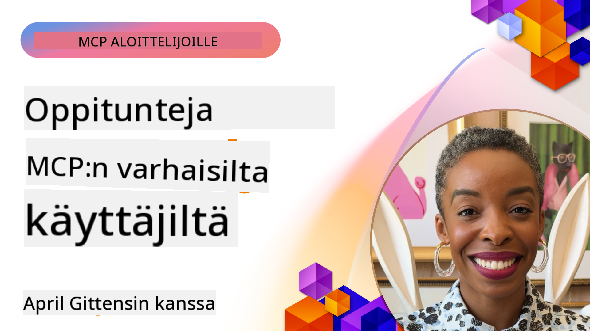

<!--
CO_OP_TRANSLATOR_METADATA:
{
  "original_hash": "41f16dac486d2086a53bc644a01cbe42",
  "translation_date": "2025-08-18T16:01:00+00:00",
  "source_file": "07-LessonsfromEarlyAdoption/README.md",
  "language_code": "fi"
}
-->
# 🌟 Oppitunteja varhaisilta käyttäjiltä

[](https://youtu.be/jds7dSmNptE)

_(Klikkaa yllä olevaa kuvaa katsoaksesi tämän oppitunnin video)_

## 🎯 Mitä tämä moduuli kattaa

Tässä moduulissa tarkastellaan, miten todelliset organisaatiot ja kehittäjät hyödyntävät Model Context Protocolia (MCP) ratkaistakseen käytännön haasteita ja edistääkseen innovaatioita. Yksityiskohtaisten tapaustutkimusten ja käytännön esimerkkien avulla opit, miten MCP mahdollistaa turvallisen ja skaalautuvan tekoälyn integroinnin, joka yhdistää kielimalleja, työkaluja ja yritysdatan.

### 📚 Katso MCP toiminnassa

Haluatko nähdä, miten nämä periaatteet toteutuvat tuotantovalmiissa työkaluissa? Tutustu [**10 Microsoft MCP -palvelimeen, jotka mullistavat kehittäjien tuottavuuden**](microsoft-mcp-servers.md), jossa esitellään todellisia Microsoft MCP -palvelimia, joita voit käyttää jo tänään.

## Yleiskatsaus

Tässä oppitunnissa tarkastellaan, miten varhaiset käyttäjät ovat hyödyntäneet Model Context Protocolia (MCP) ratkaistakseen todellisia haasteita ja edistääkseen innovaatioita eri toimialoilla. Yksityiskohtaisten tapaustutkimusten ja käytännön projektien avulla näet, miten MCP mahdollistaa standardoidun, turvallisen ja skaalautuvan tekoälyn integroinnin—yhdistäen suuria kielimalleja, työkaluja ja yritysdatan yhtenäiseen kehykseen. Saat käytännön kokemusta MCP-pohjaisten ratkaisujen suunnittelusta ja rakentamisesta, opit todistetuista toteutusmalleista ja löydät parhaat käytännöt MCP:n käyttöönottoon tuotantoympäristöissä. Oppitunti korostaa myös nousevia trendejä, tulevaisuuden suuntauksia ja avoimen lähdekoodin resursseja, jotka auttavat sinua pysymään MCP-teknologian ja sen kehittyvän ekosysteemin kärjessä.

## Oppimistavoitteet

- Analysoida MCP:n todellisia toteutuksia eri toimialoilla  
- Suunnitella ja rakentaa kokonaisia MCP-pohjaisia sovelluksia  
- Tutkia MCP-teknologian nousevia trendejä ja tulevaisuuden suuntauksia  
- Soveltaa parhaita käytäntöjä todellisissa kehitystilanteissa  

## MCP:n todelliset toteutukset

### Tapaustutkimus 1: Yrityksen asiakastuen automatisointi

Monikansallinen yritys toteutti MCP-pohjaisen ratkaisun standardoidakseen tekoälyvuorovaikutukset asiakastukijärjestelmissään. Tämä mahdollisti:

- Yhtenäisen käyttöliittymän luomisen useille LLM-palveluntarjoajille  
- Johdonmukaisen kehotteiden hallinnan eri osastojen välillä  
- Vahvojen turvallisuus- ja vaatimustenmukaisuusvalvontojen toteuttamisen  
- Helpon siirtymisen eri tekoälymallien välillä tarpeen mukaan  

**Tekninen toteutus:**

```python
# Python MCP server implementation for customer support
import logging
import asyncio
from modelcontextprotocol import create_server, ServerConfig
from modelcontextprotocol.server import MCPServer
from modelcontextprotocol.transports import create_http_transport
from modelcontextprotocol.resources import ResourceDefinition
from modelcontextprotocol.prompts import PromptDefinition
from modelcontextprotocol.tool import ToolDefinition

# Configure logging
logging.basicConfig(level=logging.INFO)

async def main():
    # Create server configuration
    config = ServerConfig(
        name="Enterprise Customer Support Server",
        version="1.0.0",
        description="MCP server for handling customer support inquiries"
    )
    
    # Initialize MCP server
    server = create_server(config)
    
    # Register knowledge base resources
    server.resources.register(
        ResourceDefinition(
            name="customer_kb",
            description="Customer knowledge base documentation"
        ),
        lambda params: get_customer_documentation(params)
    )
    
    # Register prompt templates
    server.prompts.register(
        PromptDefinition(
            name="support_template",
            description="Templates for customer support responses"
        ),
        lambda params: get_support_templates(params)
    )
    
    # Register support tools
    server.tools.register(
        ToolDefinition(
            name="ticketing",
            description="Create and update support tickets"
        ),
        handle_ticketing_operations
    )
    
    # Start server with HTTP transport
    transport = create_http_transport(port=8080)
    await server.run(transport)

if __name__ == "__main__":
    asyncio.run(main())
```

**Tulokset:** 30 % vähennys mallikustannuksissa, 45 % parannus vastausten johdonmukaisuudessa ja parempi vaatimustenmukaisuus maailmanlaajuisesti.

### Tapaustutkimus 2: Terveydenhuollon diagnostiikka-avustaja

Terveydenhuollon palveluntarjoaja kehitti MCP-infrastruktuurin integroidakseen useita erikoistuneita lääketieteellisiä tekoälymalleja samalla varmistaen, että potilastiedot pysyvät suojattuina:

- Saumaton siirtyminen yleisten ja erikoistuneiden lääketieteellisten mallien välillä  
- Tiukat tietosuoja- ja auditointivalvonnat  
- Integraatio olemassa oleviin sähköisiin potilastietojärjestelmiin (EHR)  
- Johdonmukainen kehotteiden suunnittelu lääketieteellistä terminologiaa varten  

**Tekninen toteutus:**

```csharp
// C# MCP host application implementation in healthcare application
using Microsoft.Extensions.DependencyInjection;
using ModelContextProtocol.SDK.Client;
using ModelContextProtocol.SDK.Security;
using ModelContextProtocol.SDK.Resources;

public class DiagnosticAssistant
{
    private readonly MCPHostClient _mcpClient;
    private readonly PatientContext _patientContext;
    
    public DiagnosticAssistant(PatientContext patientContext)
    {
        _patientContext = patientContext;
        
        // Configure MCP client with healthcare-specific settings
        var clientOptions = new ClientOptions
        {
            Name = "Healthcare Diagnostic Assistant",
            Version = "1.0.0",
            Security = new SecurityOptions
            {
                Encryption = EncryptionLevel.Medical,
                AuditEnabled = true
            }
        };
        
        _mcpClient = new MCPHostClientBuilder()
            .WithOptions(clientOptions)
            .WithTransport(new HttpTransport("https://healthcare-mcp.example.org"))
            .WithAuthentication(new HIPAACompliantAuthProvider())
            .Build();
    }
    
    public async Task<DiagnosticSuggestion> GetDiagnosticAssistance(
        string symptoms, string patientHistory)
    {
        // Create request with appropriate resources and tool access
        var resourceRequest = new ResourceRequest
        {
            Name = "patient_records",
            Parameters = new Dictionary<string, object>
            {
                ["patientId"] = _patientContext.PatientId,
                ["requestingProvider"] = _patientContext.ProviderId
            }
        };
        
        // Request diagnostic assistance using appropriate prompt
        var response = await _mcpClient.SendPromptRequestAsync(
            promptName: "diagnostic_assistance",
            parameters: new Dictionary<string, object>
            {
                ["symptoms"] = symptoms,
                patientHistory = patientHistory,
                relevantGuidelines = _patientContext.GetRelevantGuidelines()
            });
            
        return DiagnosticSuggestion.FromMCPResponse(response);
    }
}
```

**Tulokset:** Parannetut diagnoosiehdotukset lääkäreille, täysi HIPAA-vaatimustenmukaisuus ja merkittävä vähennys järjestelmien välillä siirtymisessä.

### Tapaustutkimus 3: Rahoituspalveluiden riskianalyysi

Rahoituslaitos otti käyttöön MCP:n standardoidakseen riskianalyysiprosessinsa eri osastojen välillä:

- Yhtenäisen käyttöliittymän luominen luottoriskin, petosten havaitsemisen ja sijoitusriskimallien käyttöön  
- Tiukkojen käyttöoikeusvalvontojen ja malliversioinnin toteuttaminen  
- Kaikkien tekoälysuositusten auditointimahdollisuuden varmistaminen  
- Johdonmukaisen datamuotoilun ylläpitäminen eri järjestelmien välillä  

**Tekninen toteutus:**

```java
// Java MCP server for financial risk assessment
import org.mcp.server.*;
import org.mcp.security.*;

public class FinancialRiskMCPServer {
    public static void main(String[] args) {
        // Create MCP server with financial compliance features
        MCPServer server = new MCPServerBuilder()
            .withModelProviders(
                new ModelProvider("risk-assessment-primary", new AzureOpenAIProvider()),
                new ModelProvider("risk-assessment-audit", new LocalLlamaProvider())
            )
            .withPromptTemplateDirectory("./compliance/templates")
            .withAccessControls(new SOCCompliantAccessControl())
            .withDataEncryption(EncryptionStandard.FINANCIAL_GRADE)
            .withVersionControl(true)
            .withAuditLogging(new DatabaseAuditLogger())
            .build();
            
        server.addRequestValidator(new FinancialDataValidator());
        server.addResponseFilter(new PII_RedactionFilter());
        
        server.start(9000);
        
        System.out.println("Financial Risk MCP Server running on port 9000");
    }
}
```

**Tulokset:** Parempi sääntelyn noudattaminen, 40 % nopeammat mallien käyttöönottojaksot ja parannettu riskinarvioinnin johdonmukaisuus osastojen välillä.

### Tapaustutkimus 4: Microsoft Playwright MCP -palvelin selaimen automatisointiin

Microsoft kehitti [Playwright MCP -palvelimen](https://github.com/microsoft/playwright-mcp) mahdollistamaan turvallisen ja standardoidun selaimen automatisoinnin Model Context Protocolin avulla. Tämä tuotantovalmis palvelin mahdollistaa tekoälyagenttien ja LLM:ien vuorovaikutuksen verkkoselainten kanssa hallitulla, auditoitavalla ja laajennettavalla tavalla—mahdollistaen käyttötapaukset, kuten automatisoidut verkkotestit, datan keräämisen ja end-to-end-työnkulut.

> **🎯 Tuotantovalmis työkalu**  
> Tämä tapaustutkimus esittelee todellisen MCP-palvelimen, jota voit käyttää jo tänään! Lue lisää Playwright MCP -palvelimesta ja 9 muusta tuotantovalmiista Microsoft MCP -palvelimesta [**Microsoft MCP Servers Guide**](microsoft-mcp-servers.md#8--playwright-mcp-server) -oppaasta.

**Keskeiset ominaisuudet:**
- Tarjoaa selaimen automaatiokyvykkyyksiä (navigointi, lomakkeiden täyttö, kuvakaappausten ottaminen jne.) MCP-työkaluina  
- Toteuttaa tiukat käyttöoikeusvalvonnat ja hiekkalaatikot estääkseen luvattomat toimet  
- Tarjoaa yksityiskohtaiset auditointilokit kaikista selainvuorovaikutuksista  
- Tukee integraatiota Azure OpenAI:n ja muiden LLM-palveluntarjoajien kanssa agenttivetoiseen automaatioon  
- Mahdollistaa GitHub Copilotin Coding Agentin verkkoselausominaisuudet  

**Tekninen toteutus:**

```typescript
// TypeScript: Registering Playwright browser automation tools in an MCP server
import { createServer, ToolDefinition } from 'modelcontextprotocol';
import { launch } from 'playwright';

const server = createServer({
  name: 'Playwright MCP Server',
  version: '1.0.0',
  description: 'MCP server for browser automation using Playwright'
});

// Register a tool for navigating to a URL and capturing a screenshot
server.tools.register(
  new ToolDefinition({
    name: 'navigate_and_screenshot',
    description: 'Navigate to a URL and capture a screenshot',
    parameters: {
      url: { type: 'string', description: 'The URL to visit' }
    }
  }),
  async ({ url }) => {
    const browser = await launch();
    const page = await browser.newPage();
    await page.goto(url);
    const screenshot = await page.screenshot();
    await browser.close();
    return { screenshot };
  }
);

// Start the MCP server
server.listen(8080);
```

**Tulokset:**

- Mahdollisti turvallisen, ohjelmallisen selaimen automaation tekoälyagenteille ja LLM:ille  
- Vähensi manuaalisen testauksen tarvetta ja paransi verkkosovellusten testikattavuutta  
- Tarjosi uudelleenkäytettävän, laajennettavan kehyksen selainpohjaisten työkalujen integrointiin yritysympäristöissä  
- Mahdollisti GitHub Copilotin verkkoselausominaisuudet  

**Viitteet:**

- [Playwright MCP Server GitHub Repository](https://github.com/microsoft/playwright-mcp)  
- [Microsoft AI and Automation Solutions](https://azure.microsoft.com/en-us/products/ai-services/)  

### Tapaustutkimus 5: Azure MCP – Yritystason Model Context Protocol pilvipalveluna

Azure MCP Server ([https://aka.ms/azmcp](https://aka.ms/azmcp)) on Microsoftin hallinnoitu, yritystason Model Context Protocol -toteutus, joka on suunniteltu tarjoamaan skaalautuvia, turvallisia ja vaatimustenmukaisia MCP-palvelinkyvykkyyksiä pilvipalveluna. Azure MCP mahdollistaa organisaatioille MCP-palvelimien nopean käyttöönoton, hallinnan ja integroinnin Azure AI:n, datan ja turvallisuuspalveluiden kanssa, vähentäen operatiivista taakkaa ja nopeuttaen tekoälyn käyttöönottoa.

> **🎯 Tuotantovalmis työkalu**  
> Tämä on todellinen MCP-palvelin, jota voit käyttää jo tänään! Lue lisää Azure AI Foundry MCP -palvelimesta [**Microsoft MCP Servers Guide**](microsoft-mcp-servers.md) -oppaasta.

- Täysin hallinnoitu MCP-palvelimen isännöinti sisäänrakennetulla skaalauksella, valvonnalla ja turvallisuudella  
- Natiivi integraatio Azure OpenAI:n, Azure AI Searchin ja muiden Azure-palveluiden kanssa  
- Yritystason todennus ja valtuutus Microsoft Entra ID:n kautta  
- Tuki mukautetuille työkaluille, kehotepohjille ja resurssiliittimille  
- Vaatimustenmukaisuus yritysturvallisuus- ja sääntelyvaatimusten kanssa  

**Tekninen toteutus:**

```yaml
# Example: Azure MCP server deployment configuration (YAML)
apiVersion: mcp.microsoft.com/v1
kind: McpServer
metadata:
  name: enterprise-mcp-server
spec:
  modelProviders:
    - name: azure-openai
      type: AzureOpenAI
      endpoint: https://<your-openai-resource>.openai.azure.com/
      apiKeySecret: <your-azure-keyvault-secret>
  tools:
    - name: document_search
      type: AzureAISearch
      endpoint: https://<your-search-resource>.search.windows.net/
      apiKeySecret: <your-azure-keyvault-secret>
  authentication:
    type: EntraID
    tenantId: <your-tenant-id>
  monitoring:
    enabled: true
    logAnalyticsWorkspace: <your-log-analytics-id>
```

**Tulokset:**  
- Lyhennetty aika-arvo yritysten tekoälyprojekteille tarjoamalla käyttövalmis, vaatimustenmukainen MCP-palvelinalusta  
- Yksinkertaistettu LLM:ien, työkalujen ja yritysdatalähteiden integrointi  
- Parannettu turvallisuus, havaittavuus ja operatiivinen tehokkuus MCP-työkuormille  
- Parannettu koodin laatu Azure SDK:n parhaiden käytäntöjen ja ajankohtaisten todennusmallien avulla  

**Viitteet:**  
- [Azure MCP Documentation](https://aka.ms/azmcp)  
- [Azure MCP Server GitHub Repository](https://github.com/Azure/azure-mcp)  
- [Azure AI Services](https://azure.microsoft.com/en-us/products/ai-services/)  
- [Microsoft MCP Center](https://mcp.azure.com)  

### Tapaustutkimus 6: NLWeb

MCP (Model Context Protocol) on nouseva protokolla chatboteille ja tekoälyavustajille työkalujen kanssa vuorovaikuttamiseen. Jokainen NLWeb-instanssi toimii myös MCP-palvelimena, joka tukee yhtä ydintoimintoa, ask, jonka avulla verkkosivustolta voidaan kysyä kysymyksiä luonnollisella kielellä. Palautettu vastaus hyödyntää schema.org-skeemaa, joka on laajalti käytetty sanasto verkkodatan kuvaamiseen. Vapaasti sanottuna MCP on NLWebille sama kuin Http on HTML:lle. NLWeb yhdistää protokollat, Schema.org-muodot ja esimerkkikoodin auttaakseen sivustoja luomaan näitä päätepisteitä nopeasti, hyödyttäen sekä ihmisiä keskusteluliittymien kautta että koneita luonnollisen agentti-agentti-vuorovaikutuksen kautta.

NLWeb koostuu kahdesta erillisestä osasta:
- Protokolla, joka on aluksi hyvin yksinkertainen, verkkosivuston kanssa luonnollisella kielellä vuorovaikuttamiseen, ja muoto, joka hyödyntää jsonia ja schema.orgia palautetussa vastauksessa. Katso lisätietoja REST API -dokumentaatiosta.  
- Yksinkertainen toteutus (1):stä, joka hyödyntää olemassa olevaa merkintää sivustoille, jotka voidaan abstrahoida listaksi kohteita (tuotteet, reseptit, nähtävyydet, arvostelut jne.). Yhdessä käyttöliittymäwidgettien kanssa sivustot voivat helposti tarjota keskusteluliittymiä sisällölleen. Katso lisätietoja chat-kyselyn elinkaaresta dokumentaatiosta.  

**Viitteet:**  
- [Azure MCP Documentation](https://aka.ms/azmcp)  
- [NLWeb](https://github.com/microsoft/NlWeb)  

### Tapaustutkimus 7: Azure AI Foundry MCP Server – Yritystason tekoälyagenttien integrointi

Azure AI Foundry MCP -palvelimet osoittavat, miten MCP:tä voidaan käyttää tekoälyagenttien ja työnkulkujen orkestrointiin ja hallintaan yritysympäristöissä. Integroimalla MCP Azure AI Foundryyn organisaatiot voivat standardoida agenttien vuorovaikutukset, hyödyntää Foundryn työnkulun hallintaa ja varmistaa turvalliset, skaalautuvat käyttöönotot.

> **🎯 Tuotantovalmis työkalu**  
> Tämä on todellinen MCP-palvelin, jota voit käyttää jo tänään! Lue lisää Azure AI Foundry MCP -palvelimesta [**Microsoft MCP Servers Guide**](microsoft-mcp-servers.md#9--azure-ai-foundry-mcp-server) -oppaasta.

**Keskeiset ominaisuudet:**
- Kattava pääsy Azuren tekoälyekosysteemiin, mukaan lukien mallikatalogit ja käyttöönoton hallinta  
- Tiedon indeksointi Azure AI Searchin avulla RAG-sovelluksia varten  
- Arviointityökalut tekoälymallien suorituskyvyn ja laadun varmistamiseen  
- Integraatio Azure AI Foundry Catalogin ja Labsin kanssa uusimpien tutkimusmallien hyödyntämiseksi  
- Agenttien hallinta- ja arviointikyvyt tuotantoskenaarioihin  

**Tulokset:**  
- Nopeutettu prototyyppien luonti ja vahva tekoälyagenttien työnkulkujen valvonta  
- Saumaton integraatio Azure AI -palveluiden kanssa edistyneitä skenaarioita varten  
- Yhtenäinen käyttöliittymä agenttiputkien rakentamiseen, käyttöönottoon ja valvontaan  
- Parannettu turvallisuus, vaatimustenmukaisuus ja operatiivinen tehokkuus yrityksille  
- Nopeutettu tekoälyn käyttöönotto säilyttäen hallinnan monimutkaisissa agenttivetoisissa prosesseissa  

**Viitteet:**  
- [Azure AI Foundry MCP Server GitHub Repository](https://github.com/azure-ai-foundry/mcp-foundry)  
- [Azure AI Agentsin integrointi MCP:hen (Microsoft Foundry Blog)](https://devblogs.microsoft.com/foundry/integrating-azure-ai-agents-mcp/)  

### Tapaustutkimus 8: Foundry MCP Playground – Kokeilu ja prototyyppien luonti

Foundry MCP Playground tarjoaa käyttövalmiin ympäristön MCP-palvelimien ja Azure AI Foundry -integraatioiden kokeiluun. Kehittäjät voivat nopeasti prototypoida, testata ja arvioida tekoälymalleja ja agenttien työnkulkuja hyödyntäen Azure AI Foundry Catalogin ja Labsin resursseja. Playground yksinkertaistaa käyttöönottoa, tarjoaa esimerkkiprojekteja ja tukee yhteistyöhön perustuvaa kehitystä, mikä tekee parhaiden käytäntöjen ja uusien skenaarioiden tutkimisesta helppoa ilman monimutkaista infrastruktuuria. Alentamalla aloituskynnystä Playground edistää innovaatioita ja yhteisön panosta MCP:n ja Azure AI Foundryn ekosysteemissä.

**Viitteet:**  

- [Foundry MCP Playground GitHub Repository](https://github.com/azure-ai-foundry/foundry-mcp-playground)  

### Tapaustutkimus 9: Microsoft Learn Docs MCP Server – Tekoälyllä tehostettu dokumentaatiohaku

Microsoft Learn Docs MCP Server on pilvipalvelu, joka tarjoaa tekoälyavustajille reaaliaikaisen pääsyn viralliseen Microsoft-dokumentaatioon Model Context Protocolin avulla. Tämä tuotantovalmis palvelin yhdistyy kattavaan Microsoft Learn -ekosysteemiin ja mahdollistaa semanttisen haun kaikista virallisista Microsoft-lähteistä.
> **🎯 Tuotantovalmis työkalu**  
>  
> Tämä on oikea MCP-palvelin, jota voit käyttää jo tänään! Lue lisää Microsoft Learn Docs MCP -palvelimesta [**Microsoft MCP Servers Guide**](microsoft-mcp-servers.md#1--microsoft-learn-docs-mcp-server).
**Keskeiset ominaisuudet:**
- Reaaliaikainen pääsy Microsoftin viralliseen dokumentaatioon, Azure-dokumentaatioon ja Microsoft 365 -dokumentaatioon
- Kehittyneet semanttiset hakutoiminnot, jotka ymmärtävät kontekstin ja tarkoituksen
- Aina ajantasainen tieto, kun Microsoft Learn -sisältöä julkaistaan
- Kattava kattavuus Microsoft Learnin, Azure-dokumentaation ja Microsoft 365 -lähteiden välillä
- Palauttaa jopa 10 korkealaatuista sisältöosaa artikkelien otsikoiden ja URL-osoitteiden kanssa

**Miksi tämä on kriittistä:**
- Ratkaisee "vanhentuneen AI-tiedon" ongelman Microsoftin teknologioissa
- Varmistaa, että AI-avustajilla on pääsy uusimpiin .NET-, C#-, Azure- ja Microsoft 365 -ominaisuuksiin
- Tarjoaa auktoritatiivista, ensikäden tietoa tarkkaan koodin generointiin
- Välttämätön kehittäjille, jotka työskentelevät nopeasti kehittyvien Microsoft-teknologioiden parissa

**Tulokset:**
- Merkittävästi parantunut AI:n tuottaman koodin tarkkuus Microsoftin teknologioissa
- Vähemmän aikaa käytetty ajankohtaisen dokumentaation ja parhaiden käytäntöjen etsimiseen
- Parantunut kehittäjien tuottavuus kontekstitietoisen dokumentaation haun avulla
- Saumaton integrointi kehitystyönkulkuun ilman IDE:stä poistumista

**Viitteet:**
- [Microsoft Learn Docs MCP Server GitHub Repository](https://github.com/MicrosoftDocs/mcp)
- [Microsoft Learn Documentation](https://learn.microsoft.com/)

## Käytännön projektit

### Projekti 1: Rakenna monitoimittajainen MCP-palvelin

**Tavoite:** Luo MCP-palvelin, joka voi ohjata pyyntöjä useille AI-mallipalveluntarjoajille tiettyjen kriteerien perusteella.

**Vaatimukset:**

- Tue vähintään kolmea eri mallipalveluntarjoajaa (esim. OpenAI, Anthropic, paikalliset mallit)
- Toteuta reititysmekanismi pyyntöjen metatietojen perusteella
- Luo konfigurointijärjestelmä palveluntarjoajien tunnistetietojen hallintaan
- Lisää välimuisti suorituskyvyn ja kustannusten optimointiin
- Rakenna yksinkertainen hallintapaneeli käytön seurantaan

**Toteutusvaiheet:**

1. Perusta MCP-palvelimen perusinfrastruktuuri
2. Toteuta palveluntarjoajien adapterit jokaiselle AI-mallipalvelulle
3. Luo reitityksen logiikka pyyntöjen attribuuttien perusteella
4. Lisää välimuistimekanismit usein toistuville pyynnöille
5. Kehitä seurantapaneeli
6. Testaa erilaisilla pyyntömalleilla

**Teknologiat:** Valitse Python (.NET/Java/Python mieltymyksesi mukaan), Redis välimuistia varten ja yksinkertainen web-kehys hallintapaneelille.

### Projekti 2: Yrityksen kehotteiden hallintajärjestelmä

**Tavoite:** Kehitä MCP-pohjainen järjestelmä kehotemallien hallintaan, versiointiin ja käyttöönottoon organisaation sisällä.

**Vaatimukset:**

- Luo keskitetty arkisto kehotemalleille
- Toteuta versiointi- ja hyväksymistyönkulut
- Rakenna mallien testausominaisuudet esimerkkisyötteillä
- Kehitä roolipohjaiset käyttöoikeudet
- Luo API mallien hakua ja käyttöönottoa varten

**Toteutusvaiheet:**

1. Suunnittele tietokannan kaavio mallien tallennusta varten
2. Luo ydintoiminnot mallien CRUD-operaatioille
3. Toteuta versiointijärjestelmä
4. Rakenna hyväksymistyönkulku
5. Kehitä testauskehys
6. Luo yksinkertainen web-käyttöliittymä hallintaan
7. Integroi MCP-palvelimeen

**Teknologiat:** Valitse taustakehys, SQL- tai NoSQL-tietokanta ja käyttöliittymäkehys hallintakäyttöliittymää varten.

### Projekti 3: MCP-pohjainen sisällöntuotantoalusta

**Tavoite:** Rakenna sisällöntuotantoalusta, joka hyödyntää MCP:tä tarjotakseen johdonmukaisia tuloksia eri sisältötyypeille.

**Vaatimukset:**

- Tue useita sisältöformaatteja (blogikirjoitukset, sosiaalinen media, markkinointitekstit)
- Toteuta mallipohjainen tuotanto mukautusvaihtoehdoilla
- Luo sisällön tarkastus- ja palautesysteemi
- Seuraa sisällön suorituskykymittareita
- Tue sisällön versiointia ja iterointia

**Toteutusvaiheet:**

1. Perusta MCP-asiakasinfrastruktuuri
2. Luo malleja eri sisältötyypeille
3. Rakenna sisällöntuotantoputki
4. Toteuta tarkastusjärjestelmä
5. Kehitä suorituskykymittareiden seurantajärjestelmä
6. Luo käyttöliittymä mallien hallintaan ja sisällöntuotantoon

**Teknologiat:** Valitse ohjelmointikieli, web-kehys ja tietokantajärjestelmä.

## MCP-teknologian tulevaisuuden suuntaviivat

### Nousevat trendit

1. **Monimodaalinen MCP**
   - MCP:n laajentaminen standardoimaan vuorovaikutukset kuva-, ääni- ja videomallien kanssa
   - Ristiinmodaalisten päättelykykyjen kehittäminen
   - Standardoidut kehotteet eri modaliteeteille

2. **Hajautettu MCP-infrastruktuuri**
   - Hajautetut MCP-verkostot, jotka voivat jakaa resursseja organisaatioiden välillä
   - Standardoidut protokollat turvalliseen mallien jakamiseen
   - Tietosuojaa säilyttävät laskentatekniikat

3. **MCP-markkinapaikat**
   - Ekosysteemit MCP-mallien ja -lisäosien jakamiseen ja kaupallistamiseen
   - Laadunvarmistus- ja sertifiointiprosessit
   - Integrointi mallimarkkinapaikkoihin

4. **MCP reunalaskennassa**
   - MCP-standardien mukauttaminen resurssirajoitteisille reunalaitteille
   - Optimoidut protokollat matalan kaistanleveyden ympäristöihin
   - Erikoistuneet MCP-toteutukset IoT-ekosysteemeille

5. **Sääntelykehykset**
   - MCP-laajennusten kehittäminen sääntelyn noudattamiseen
   - Standardoidut auditointipolut ja selitysrajapinnat
   - Integrointi nouseviin AI-hallintakehyksiin

### MCP-ratkaisut Microsoftilta

Microsoft ja Azure ovat kehittäneet useita avoimen lähdekoodin arkistoja auttaakseen kehittäjiä toteuttamaan MCP:tä eri skenaarioissa:

#### Microsoft-organisaatio

1. [playwright-mcp](https://github.com/microsoft/playwright-mcp) - Playwright MCP-palvelin selaimen automaatioon ja testaukseen
2. [files-mcp-server](https://github.com/microsoft/files-mcp-server) - OneDrive MCP-palvelimen toteutus paikalliseen testaukseen ja yhteisön panokseen
3. [NLWeb](https://github.com/microsoft/NlWeb) - NLWeb on kokoelma avoimia protokollia ja niihin liittyviä avoimen lähdekoodin työkaluja. Sen pääpaino on AI-verkon perustason luomisessa

#### Azure-Samples-organisaatio

1. [mcp](https://github.com/Azure-Samples/mcp) - Linkkejä näytteisiin, työkaluihin ja resursseihin MCP-palvelimien rakentamiseen ja integrointiin Azureen eri kielillä
2. [mcp-auth-servers](https://github.com/Azure-Samples/mcp-auth-servers) - Viite MCP-palvelimia, jotka demonstroivat autentikointia nykyisen Model Context Protocol -määrittelyn mukaisesti
3. [remote-mcp-functions](https://github.com/Azure-Samples/remote-mcp-functions) - Aloitussivu Remote MCP-palvelimen toteutuksille Azure Functionsissa, linkkejä kielikohtaisiin arkistoihin
4. [remote-mcp-functions-python](https://github.com/Azure-Samples/remote-mcp-functions-python) - Pikakäynnistysmalli mukautettujen Remote MCP-palvelimien rakentamiseen ja käyttöönottoon Azure Functionsilla Pythonilla
5. [remote-mcp-functions-dotnet](https://github.com/Azure-Samples/remote-mcp-functions-dotnet) - Pikakäynnistysmalli mukautettujen Remote MCP-palvelimien rakentamiseen ja käyttöönottoon Azure Functionsilla .NET/C#:llä
6. [remote-mcp-functions-typescript](https://github.com/Azure-Samples/remote-mcp-functions-typescript) - Pikakäynnistysmalli mukautettujen Remote MCP-palvelimien rakentamiseen ja käyttöönottoon Azure Functionsilla TypeScriptillä
7. [remote-mcp-apim-functions-python](https://github.com/Azure-Samples/remote-mcp-apim-functions-python) - Azure API Management AI Gatewayna Remote MCP-palvelimille Pythonilla
8. [AI-Gateway](https://github.com/Azure-Samples/AI-Gateway) - APIM ❤️ AI-kokeiluja, mukaan lukien MCP-ominaisuudet, integrointi Azure OpenAI:n ja AI Foundryn kanssa

Nämä arkistot tarjoavat erilaisia toteutuksia, malleja ja resursseja Model Context Protocolin kanssa työskentelyyn eri ohjelmointikielillä ja Azure-palveluilla. Ne kattavat laajan valikoiman käyttötapauksia peruspalvelintoteutuksista autentikointiin, pilvikäyttöönottoon ja yritysintegraatioskenaarioihin.

#### MCP-resurssihakemisto

[MCP-resurssihakemisto](https://github.com/microsoft/mcp/tree/main/Resources) Microsoftin virallisessa MCP-arkistossa tarjoaa kuratoidun kokoelman esimerkkiresursseja, kehotemalleja ja työkalumääritelmiä käytettäväksi Model Context Protocol -palvelimien kanssa. Tämä hakemisto on suunniteltu auttamaan kehittäjiä pääsemään nopeasti alkuun MCP:n kanssa tarjoamalla uudelleenkäytettäviä rakennuspalikoita ja parhaita käytäntöjä:

- **Kehotemallit:** Valmiit kehotemallit yleisiin AI-tehtäviin ja skenaarioihin, joita voidaan mukauttaa omiin MCP-palvelintoteutuksiin.
- **Työkalumääritelmät:** Esimerkkityökalujen skeemat ja metatiedot työkalujen integroinnin ja kutsumisen standardoimiseksi eri MCP-palvelimien välillä.
- **Resurssiesimerkit:** Esimerkkiresurssimääritelmät tietolähteisiin, API:hin ja ulkoisiin palveluihin yhdistämiseen MCP-kehyksessä.
- **Viitetoteutukset:** Käytännön esimerkit, jotka osoittavat, miten resursseja, kehotteita ja työkaluja voidaan jäsentää ja organisoida todellisissa MCP-projekteissa.

Nämä resurssit nopeuttavat kehitystä, edistävät standardointia ja auttavat varmistamaan parhaat käytännöt MCP-pohjaisten ratkaisujen rakentamisessa ja käyttöönotossa.

#### MCP-resurssihakemisto

- [MCP Resources (Sample Prompts, Tools, and Resource Definitions)](https://github.com/microsoft/mcp/tree/main/Resources)

### Tutkimusmahdollisuudet

- Tehokkaat kehotteiden optimointitekniikat MCP-kehyksissä
- Turvallisuusmallit monivuokraajaisille MCP-toteutuksille
- Suorituskyvyn vertailu eri MCP-toteutusten välillä
- Formaalit verifiointimenetelmät MCP-palvelimille

## Yhteenveto

Model Context Protocol (MCP) muokkaa nopeasti standardoidun, turvallisen ja yhteensopivan AI-integraation tulevaisuutta eri toimialoilla. Tämän oppitunnin tapaustutkimusten ja käytännön projektien kautta olet nähnyt, kuinka varhaiset omaksujat—mukaan lukien Microsoft ja Azure—hyödyntävät MCP:tä ratkaistakseen todellisia haasteita, nopeuttaakseen AI:n käyttöönottoa ja varmistaakseen vaatimustenmukaisuuden, turvallisuuden ja skaalautuvuuden. MCP:n modulaarinen lähestymistapa mahdollistaa organisaatioiden yhdistää suuria kielimalleja, työkaluja ja yritysdataa yhtenäisessä, auditoitavassa kehyksessä. Kun MCP jatkaa kehittymistään, yhteisön mukana pysyminen, avoimen lähdekoodin resurssien tutkiminen ja parhaiden käytäntöjen soveltaminen ovat avainasemassa robustien, tulevaisuuteen valmiiden AI-ratkaisujen rakentamisessa.

## Lisäresurssit

- [MCP Foundry GitHub Repository](https://github.com/azure-ai-foundry/mcp-foundry)
- [Foundry MCP Playground](https://github.com/azure-ai-foundry/foundry-mcp-playground)
- [Integrating Azure AI Agents with MCP (Microsoft Foundry Blog)](https://devblogs.microsoft.com/foundry/integrating-azure-ai-agents-mcp/)
- [MCP GitHub Repository (Microsoft)](https://github.com/microsoft/mcp)
- [MCP Resources Directory (Sample Prompts, Tools, and Resource Definitions)](https://github.com/microsoft/mcp/tree/main/Resources)
- [MCP Community & Documentation](https://modelcontextprotocol.io/introduction)
- [Azure MCP Documentation](https://aka.ms/azmcp)
- [Playwright MCP Server GitHub Repository](https://github.com/microsoft/playwright-mcp)
- [Files MCP Server (OneDrive)](https://github.com/microsoft/files-mcp-server)
- [Azure-Samples MCP](https://github.com/Azure-Samples/mcp)
- [MCP Auth Servers (Azure-Samples)](https://github.com/Azure-Samples/mcp-auth-servers)
- [Remote MCP Functions (Azure-Samples)](https://github.com/Azure-Samples/remote-mcp-functions)
- [Remote MCP Functions Python (Azure-Samples)](https://github.com/Azure-Samples/remote-mcp-functions-python)
- [Remote MCP Functions .NET (Azure-Samples)](https://github.com/Azure-Samples/remote-mcp-functions-dotnet)
- [Remote MCP Functions TypeScript (Azure-Samples)](https://github.com/Azure-Samples/remote-mcp-functions-typescript)
- [Remote MCP APIM Functions Python (Azure-Samples)](https://github.com/Azure-Samples/remote-mcp-apim-functions-python)
- [AI-Gateway (Azure-Samples)](https://github.com/Azure-Samples/AI-Gateway)
- [Microsoft AI and Automation Solutions](https://azure.microsoft.com/en-us/products/ai-services/)

## Harjoitukset

1. Analysoi yksi tapaustutkimuksista ja ehdota vaihtoehtoinen toteutustapa.
2. Valitse yksi projektiehdotuksista ja luo yksityiskohtainen tekninen spesifikaatio.
3. Tutki toimialaa, jota ei käsitelty tapaustutkimuksissa, ja hahmottele, miten MCP voisi ratkaista sen erityiset haasteet.
4. Tutki yhtä tulevaisuuden suuntaviivoista ja luo konsepti uudelle MCP-laajennukselle sen tukemiseksi.

Seuraava: [Microsoft MCP Server](../07-LessonsfromEarlyAdoption/microsoft-mcp-servers.md)

**Vastuuvapauslauseke**:  
Tämä asiakirja on käännetty käyttämällä tekoälypohjaista käännöspalvelua [Co-op Translator](https://github.com/Azure/co-op-translator). Vaikka pyrimme tarkkuuteen, huomioithan, että automaattiset käännökset voivat sisältää virheitä tai epätarkkuuksia. Alkuperäistä asiakirjaa sen alkuperäisellä kielellä tulisi pitää ensisijaisena lähteenä. Kriittisen tiedon osalta suositellaan ammattimaista ihmiskäännöstä. Emme ole vastuussa väärinkäsityksistä tai virhetulkinnoista, jotka johtuvat tämän käännöksen käytöstä.