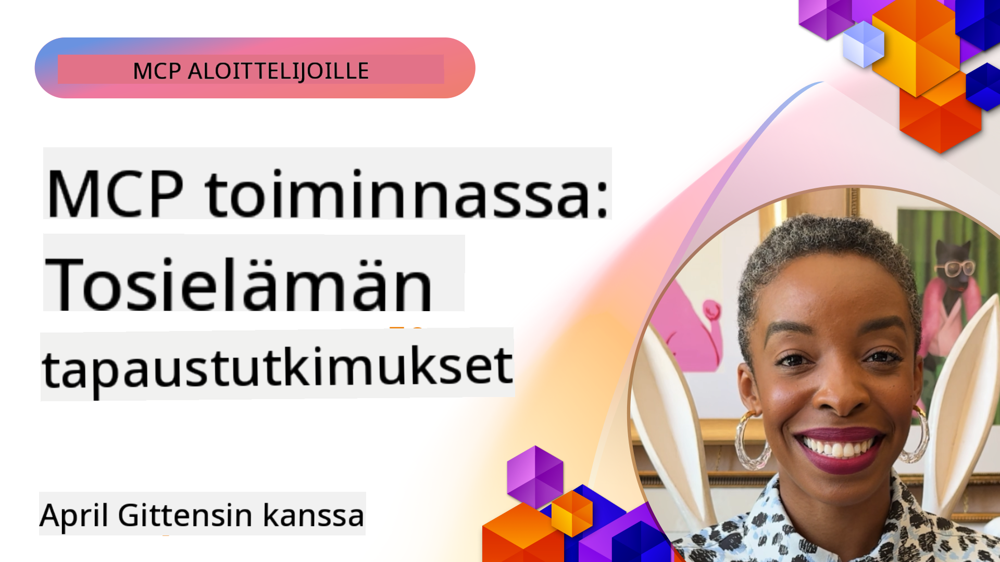

<!--
CO_OP_TRANSLATOR_METADATA:
{
  "original_hash": "1611dc5f6a2a35a789fc4c95fc5bfbe8",
  "translation_date": "2025-09-26T18:38:40+00:00",
  "source_file": "09-CaseStudy/README.md",
  "language_code": "fi"
}
-->
# MCP toiminnassa: Käytännön esimerkit

_(Klikkaa yllä olevaa kuvaa nähdäksesi tämän oppitunnin videon)_

Model Context Protocol (MCP) muuttaa tapaa, jolla tekoälysovellukset vuorovaikuttavat datan, työkalujen ja palveluiden kanssa. Tässä osiossa esitellään käytännön esimerkkejä MCP:n soveltamisesta erilaisissa yritysympäristöissä.

## Yleiskatsaus

Tämä osio esittelee konkreettisia esimerkkejä MCP:n toteutuksista ja korostaa, kuinka organisaatiot hyödyntävät tätä protokollaa ratkaistakseen monimutkaisia liiketoiminnan haasteita. Näiden tapaustutkimusten avulla saat käsityksen MCP:n monipuolisuudesta, skaalautuvuudesta ja käytännön hyödyistä todellisissa tilanteissa.

## Keskeiset oppimistavoitteet

Näitä tapaustutkimuksia tutkimalla opit:

- Ymmärtämään, miten MCP:tä voidaan soveltaa tiettyjen liiketoimintaongelmien ratkaisemiseksi
- Oppimaan erilaisia integraatiomalleja ja arkkitehtuurilähestymistapoja
- Tunnistamaan parhaat käytännöt MCP:n toteuttamiseksi yritysympäristöissä
- Saamaan näkemyksiä haasteista ja ratkaisuista, joita todellisissa toteutuksissa on kohdattu
- Tunnistamaan mahdollisuuksia soveltaa vastaavia malleja omissa projekteissasi

## Esitellyt tapaustutkimukset

### 1. [Azure AI Matkatoimistot – Viiteimplementaatio](./travelagentsample.md)

Tässä tapaustutkimuksessa tarkastellaan Microsoftin kattavaa viiteratkaisua, joka osoittaa, miten rakentaa monen agentin, tekoälypohjainen matkasuunnittelusovellus MCP:n, Azure OpenAI:n ja Azure AI Searchin avulla. Projekti sisältää:

- Monen agentin orkestrointi MCP:n avulla
- Yritysdatan integrointi Azure AI Searchin kanssa
- Turvallinen ja skaalautuva arkkitehtuuri Azure-palveluiden avulla
- Laajennettavat työkalut uudelleenkäytettävillä MCP-komponenteilla
- Keskustelupohjainen käyttäjäkokemus Azure OpenAI:n avulla

Arkkitehtuuri ja toteutuksen yksityiskohdat tarjoavat arvokkaita näkemyksiä monimutkaisten monen agentin järjestelmien rakentamisesta MCP:n koordinaatiokerroksena.

### 2. [Azure DevOps -kohteiden päivittäminen YouTube-datasta](./UpdateADOItemsFromYT.md)

Tämä tapaustutkimus esittelee MCP:n käytännön soveltamista työnkulkujen automatisointiin. Se näyttää, miten MCP-työkaluja voidaan käyttää:

- Datan poimimiseen verkkoalustoilta (YouTube)
- Työkohteiden päivittämiseen Azure DevOps -järjestelmissä
- Toistettavien automaatiotyönkulkujen luomiseen
- Datan integroimiseen eri järjestelmien välillä

Tämä esimerkki havainnollistaa, miten jopa suhteellisen yksinkertaiset MCP-toteutukset voivat tuoda merkittäviä tehokkuushyötyjä automatisoimalla rutiinitehtäviä ja parantamalla datan johdonmukaisuutta järjestelmien välillä.

### 3. [Reaaliaikainen dokumentaatiohaku MCP:n avulla](./docs-mcp/README.md)

Tämä tapaustutkimus opastaa Python-konsoliasiakkaan yhdistämisessä Model Context Protocol (MCP) -palvelimeen reaaliaikaisen, kontekstitietoisen Microsoft-dokumentaation hakemiseksi ja kirjaamiseksi. Opit:

- Yhdistämään MCP-palvelimeen Python-asiakkaan ja virallisen MCP SDK:n avulla
- Käyttämään suoratoistavia HTTP-asiakkaita tehokkaaseen, reaaliaikaiseen datan hakuun
- Kutsumaan dokumentaatiotyökaluja palvelimella ja kirjaamaan vastaukset suoraan konsoliin
- Integroimaan ajantasaisen Microsoft-dokumentaation työnkulkuusi poistumatta terminaalista

Luku sisältää käytännön tehtävän, minimaalisen toimivan koodiesimerkin ja linkkejä lisäresursseihin syvempää oppimista varten. Katso koko läpikäynti ja koodi linkitetyssä luvussa ymmärtääksesi, miten MCP voi muuttaa dokumentaation käyttöä ja kehittäjien tuottavuutta konsolipohjaisissa ympäristöissä.

### 4. [Interaktiivinen opintosuunnitelman luontisovellus MCP:n avulla](./docs-mcp/README.md)

Tämä tapaustutkimus esittelee, miten rakentaa interaktiivinen verkkosovellus Chainlitin ja Model Context Protocol (MCP):n avulla henkilökohtaisten opintosuunnitelmien luomiseksi mihin tahansa aiheeseen. Käyttäjät voivat määrittää aiheen (esim. "AI-900-sertifikaatti") ja opiskeluajan (esim. 8 viikkoa), ja sovellus tarjoaa viikko viikolta jaotellut suositukset sisällöstä. Chainlit mahdollistaa keskustelupohjaisen chat-käyttöliittymän, joka tekee kokemuksesta mukaansatempaavan ja mukautuvan.

- Keskustelupohjainen verkkosovellus Chainlitin avulla
- Käyttäjän ohjaamat kehotteet aiheen ja keston määrittämiseksi
- Viikko viikolta sisältösuositukset MCP:n avulla
- Reaaliaikaiset, mukautuvat vastaukset chat-käyttöliittymässä

Projekti havainnollistaa, miten keskustelupohjainen tekoäly ja MCP voidaan yhdistää luomaan dynaamisia, käyttäjälähtöisiä oppimistyökaluja modernissa verkkoympäristössä.

### 5. [Editorissa olevat dokumentit MCP-palvelimen avulla VS Codessa](./docs-mcp/README.md)

Tämä tapaustutkimus osoittaa, miten voit tuoda Microsoft Learn -dokumentaation suoraan VS Code -ympäristöösi MCP-palvelimen avulla—ei enää selaimen välilehtien vaihtamista! Näet, miten:

- Etsi ja lue dokumentaatiota välittömästi VS Codessa MCP-paneelin tai komentopaletin avulla
- Viittaa dokumentaatioon ja lisää linkkejä suoraan README- tai kurssin markdown-tiedostoihin
- Käytä GitHub Copilotia ja MCP:tä yhdessä saumattomaan, tekoälypohjaiseen dokumentaatio- ja koodityönkulkuun
- Vahvista ja paranna dokumentaatiota reaaliaikaisella palautteella ja Microsoftin tarkkuudella
- Integroi MCP GitHub-työnkulkuihin jatkuvaa dokumentaation validointia varten

Toteutus sisältää:

- Esimerkin `.vscode/mcp.json`-konfiguraatiosta helppoa käyttöönottoa varten
- Kuvakaappauksiin perustuvat läpikäynnit editorikokemuksesta
- Vinkkejä Copilotin ja MCP:n yhdistämiseen maksimaalisen tuottavuuden saavuttamiseksi

Tämä skenaario sopii kurssien tekijöille, dokumentaation kirjoittajille ja kehittäjille, jotka haluavat pysyä keskittyneinä editorissaan työskennellessään dokumentaation, Copilotin ja validointityökalujen kanssa—kaikki MCP:n avulla.

### 6. [APIM MCP-palvelimen luominen](./apimsample.md)

Tämä tapaustutkimus tarjoaa vaiheittaisen oppaan MCP-palvelimen luomisesta Azure API Managementin (APIM) avulla. Se kattaa:

- MCP-palvelimen perustamisen Azure API Managementissa
- API-toimintojen altistamisen MCP-työkaluina
- Politiikkojen konfiguroinnin rajoitusten ja turvallisuuden hallintaan
- MCP-palvelimen testaamisen Visual Studio Codessa ja GitHub Copilotilla

Tämä esimerkki havainnollistaa, miten hyödyntää Azuren ominaisuuksia luodaksesi vankan MCP-palvelimen, jota voidaan käyttää erilaisissa sovelluksissa, parantaen tekoälyjärjestelmien integraatiota yrityksen API:hin.

### 7. [GitHub MCP Registry — Agenttien integraation nopeuttaminen](https://github.com/mcp)

Tämä tapaustutkimus tarkastelee, miten GitHubin MCP Registry, joka lanseerattiin syyskuussa 2025, ratkaisee kriittisen haasteen tekoälyekosysteemissä: hajautettujen MCP-palvelimien löytämisen ja käyttöönoton.

#### Yleiskatsaus
**MCP Registry** ratkaisee kasvavan ongelman hajautettujen MCP-palvelimien löytämisessä eri repositorioista ja rekistereistä, mikä aiemmin teki integraatiosta hidasta ja virhealtista. Nämä palvelimet mahdollistavat tekoälyagenttien vuorovaikutuksen ulkoisten järjestelmien, kuten API:iden, tietokantojen ja dokumentaatiolähteiden kanssa.

#### Ongelman määrittely
Agenttityönkulkuja rakentavat kehittäjät kohtasivat useita haasteita:
- **Huono löydettävyys** MCP-palvelimille eri alustoilla
- **Toistuvat asennuskysymykset** hajautettuina foorumeilla ja dokumentaatiossa
- **Turvallisuusriskit** vahvistamattomista ja epäluotettavista lähteistä
- **Standardoinnin puute** palvelimien laadussa ja yhteensopivuudessa

#### Ratkaisun arkkitehtuuri
GitHubin MCP Registry keskittää luotettavat MCP-palvelimet keskeisillä ominaisuuksilla:
- **Yhden klikkauksen asennus** VS Code -integraation kautta sujuvaa käyttöönottoa varten
- **Signaali yli melun lajittelu** tähtien, aktiivisuuden ja yhteisön validoinnin perusteella
- **Suora integraatio** GitHub Copilotin ja muiden MCP-yhteensopivien työkalujen kanssa
- **Avoin kontribuutiomalli**, joka mahdollistaa sekä yhteisön että yrityskumppaneiden osallistumisen

#### Liiketoimintavaikutus
Rekisteri on tuonut mitattavia parannuksia:
- **Nopeampi käyttöönotto** kehittäjille, jotka käyttävät työkaluja kuten Microsoft Learn MCP Server, joka suoratoistaa virallista dokumentaatiota suoraan agenteille
- **Parantunut tuottavuus** erikoistuneiden palvelimien, kuten `github-mcp-server`, avulla, joka mahdollistaa luonnollisen kielen GitHub-automaatio (PR:n luominen, CI:n uudelleenkäynnistys, koodin skannaus)
- **Vahvempi ekosysteemin luottamus** kuratoitujen listojen ja läpinäkyvien konfiguraatiostandardien kautta

#### Strateginen arvo
Agenttien elinkaaren hallintaan ja toistettaviin työnkulkuihin erikoistuneille käytännön ammattilaisille MCP Registry tarjoaa:
- **Modulaariset agenttien käyttöönotto-ominaisuudet** standardoiduilla komponenteilla
- **Rekisterin tukemat arviointiputket** johdonmukaiseen testaukseen ja validointiin
- **Ristiintyökalujen yhteentoimivuus**, joka mahdollistaa saumattoman integraation eri tekoälyalustojen välillä

Tämä tapaustutkimus osoittaa, että MCP Registry ei ole pelkkä hakemisto—se on perustava alusta skaalautuville, todellisille mallien integraatioille ja agenttijärjestelmien käyttöönotolle.

## Yhteenveto

Nämä seitsemän kattavaa tapaustutkimusta osoittavat Model Context Protocolin huomattavan monipuolisuuden ja käytännön sovellukset erilaisissa todellisissa tilanteissa. Monimutkaisista monen agentin matkasuunnittelujärjestelmistä ja yrityksen API-hallinnasta virtaviivaistettuihin dokumentaatiotyönkulkuihin ja mullistavaan GitHub MCP Registryyn, nämä esimerkit korostavat, miten MCP tarjoaa standardoidun, skaalautuvan tavan yhdistää tekoälyjärjestelmät työkaluihin, dataan ja palveluihin tuottaakseen poikkeuksellista arvoa.

Tapaustutkimukset kattavat MCP:n toteutuksen useita ulottuvuuksia:
- **Yritysintegraatio**: Azure API Management ja Azure DevOps -automaatio
- **Monen agentin orkestrointi**: Matkasuunnittelu koordinoiduilla tekoälyagenteilla
- **Kehittäjien tuottavuus**: VS Code -integraatio ja reaaliaikainen dokumentaatiohaku
- **Ekosysteemin kehitys**: GitHubin MCP Registry perustavana alustana
- **Koulutussovellukset**: Interaktiiviset opintosuunnitelman generaattorit ja keskustelukäyttöliittymät

Näitä toteutuksia tutkimalla saat kriittisiä näkemyksiä:
- **Arkkitehtuurimallit** eri mittakaavoille ja käyttötarkoituksille
- **Toteutusstrategiat**, jotka tasapainottavat toiminnallisuuden ja ylläpidettävyyden
- **Turvallisuus ja skaalautuvuus** tuotantokäyttöön
- **Parhaat käytännöt** MCP-palvelimen kehittämiseen ja asiakasintegraatioon
- **Ekosysteemiajattelu** tekoälypohjaisten ratkaisujen rakentamiseen

Nämä esimerkit osoittavat, että MCP ei ole pelkkä teoreettinen kehys, vaan kypsä, tuotantovalmis protokolla, joka mahdollistaa käytännön ratkaisuja monimutkaisiin liiketoiminnan haasteisiin. Olipa kyseessä yksinkertaisten automaatiotyökalujen rakentaminen tai kehittyneiden monen agentin järjestelmien kehittäminen, tässä esitetyt mallit ja lähestymistavat tarjoavat vankan perustan omille MCP-projekteillesi.

## Lisäresurssit

- [Azure AI Matkatoimistot GitHub-repositorio](https://github.com/Azure-Samples/azure-ai-travel-agents)
- [Azure DevOps MCP Työkalu](https://github.com/microsoft/azure-devops-mcp)
- [Playwright MCP Työkalu](https://github.com/microsoft/playwright-mcp)
- [Microsoft Docs MCP Server](https://github.com/MicrosoftDocs/mcp)
- [GitHub MCP Registry — Agenttien integraation nopeuttaminen](https://github.com/mcp)
- [MCP Yhteisön esimerkit](https://github.com/microsoft/mcp)

Seuraavaksi: Käytännön laboratorio [Tekoälytyönkulkujen virtaviivaistaminen: MCP-palvelimen rakentaminen AI Toolkitilla](../10-StreamliningAIWorkflowsBuildingAnMCPServerWithAIToolkit/README.md)

---

