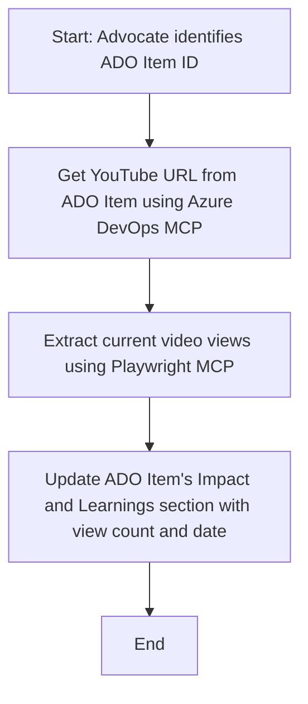

<!--
CO_OP_TRANSLATOR_METADATA:
{
  "original_hash": "14a2dfbea55ef735660a06bd6bdfe5f3",
  "translation_date": "2025-07-14T06:13:27+00:00",
  "source_file": "09-CaseStudy/UpdateADOItemsFromYT.md",
  "language_code": "fi"
}
-->
# Case Study: Azure DevOps -kohteiden päivittäminen YouTube-datan avulla MCP:llä

> **Disclaimer:** Verkossa on olemassa työkaluja ja raportteja, jotka voivat automatisoida Azure DevOps -kohteiden päivittämisen esimerkiksi YouTube-alustalta saatavalla datalla. Seuraava esimerkki on tarkoitettu ainoastaan havainnollistamaan, miten MCP-työkaluja voidaan hyödyntää automaatio- ja integraatiotehtävissä.

## Yleiskatsaus

Tässä case studyssä esitellään yksi tapa, jolla Model Context Protocol (MCP) ja sen työkalut voivat automatisoida Azure DevOps (ADO) -työkohteiden päivittämisen verkkoalustoilta, kuten YouTubesta, saatavalla tiedolla. Kuvaus on vain yksi esimerkki näiden työkalujen laajemmista mahdollisuuksista, joita voidaan soveltaa monenlaisiin vastaaviin automaatiotarpeisiin.

Tässä esimerkissä Advocate seuraa verkossa pidettyjä sessioita ADO-kohteiden avulla, joista jokainen sisältää YouTube-videon URL-osoitteen. MCP-työkaluja hyödyntämällä Advocate voi pitää ADO-kohteet ajan tasalla viimeisimmillä videon katselumäärillä toistettavalla ja automatisoidulla tavalla. Tätä lähestymistapaa voidaan soveltaa myös muihin tilanteisiin, joissa verkosta saatava tieto pitää integroida ADO:hon tai muihin järjestelmiin.

## Tilannekuvaus

Advocate vastaa verkossa pidettyjen sessioiden ja yhteisön osallistumisten vaikutusten seurannasta. Jokainen sessio kirjataan ADO-työkohteeksi 'DevRel' -projektiin, ja työkohteessa on kenttä YouTube-videon URL-osoitteelle. Tarkkojen raporttien laatimiseksi Advocate tarvitsee päivittää ADO-kohde videon nykyisellä katselumäärällä sekä tiedolla, milloin tämä tieto on haettu.

## Käytetyt työkalut

- [Azure DevOps MCP](https://github.com/microsoft/azure-devops-mcp): Mahdollistaa ohjelmallisen pääsyn ja päivitykset ADO-työkohteisiin MCP:n kautta.
- [Playwright MCP](https://github.com/microsoft/playwright-mcp): Automatisoi selaintoiminnot ja poimii reaaliaikaista dataa verkkosivuilta, kuten YouTube-videon tilastoja.

## Vaiheittainen työnkulku

1. **ADO-kohteen tunnistaminen**: Aloita ADO-työkohteen ID:llä (esim. 1234) 'DevRel' -projektissa.
2. **YouTube-URL:n hakeminen**: Käytä Azure DevOps MCP -työkalua saadaksesi YouTube-URL työkohteesta.
3. **Katselumäärän poiminta**: Käytä Playwright MCP -työkalua siirtyäksesi YouTube-URL:iin ja poimiaksesi nykyinen katselumäärä.
4. **ADO-kohteen päivittäminen**: Kirjoita uusin katselumäärä ja hakupäivämäärä 'Impact and Learnings' -osioon ADO-työkohteessa Azure DevOps MCP -työkalulla.

## Esimerkkiprompt

```bash
- Work with the ADO Item ID: 1234
- The project is '2025-Awesome'
- Get the YouTube URL for the ADO item
- Use Playwright to get the current views from the YouTube video
- Update the ADO item with the current video views and the updated date of the information
```

## Mermaid-kaavio



## Tekninen toteutus

- **MCP-orchestrointi**: Työnkulun hallinnasta vastaa MCP-palvelin, joka koordinoi Azure DevOps MCP:n ja Playwright MCP:n käyttöä.
- **Automaatio**: Prosessi voidaan käynnistää manuaalisesti tai ajastaa toistumaan säännöllisesti, jotta ADO-kohteet pysyvät ajan tasalla.
- **Laajennettavuus**: Sama malli voidaan laajentaa päivittämään ADO-kohteita muilla verkkometriikoilla (esim. tykkäykset, kommentit) tai muilta alustoilta.

## Tulokset ja vaikutus

- **Tehokkuus**: Vähentää Advocaten manuaalista työtä automatisoimalla videomittareiden haun ja päivityksen.
- **Tarkkuus**: Varmistaa, että ADO-kohteet heijastavat verkosta saatavilla olevaa ajantasaisinta tietoa.
- **Toistettavuus**: Tarjoaa uudelleenkäytettävän työnkulun vastaaviin tilanteisiin, joissa käytetään muita tietolähteitä tai mittareita.

## Viitteet

- [Azure DevOps MCP](https://github.com/microsoft/azure-devops-mcp)
- [Playwright MCP](https://github.com/microsoft/playwright-mcp)
- [Model Context Protocol (MCP)](https://modelcontextprotocol.io/)

**Vastuuvapauslauseke**:  
Tämä asiakirja on käännetty käyttämällä tekoälypohjaista käännöspalvelua [Co-op Translator](https://github.com/Azure/co-op-translator). Vaikka pyrimme tarkkuuteen, huomioithan, että automaattikäännöksissä saattaa esiintyä virheitä tai epätarkkuuksia. Alkuperäistä asiakirjaa sen alkuperäiskielellä tulee pitää virallisena lähteenä. Tärkeissä asioissa suositellaan ammattimaista ihmiskäännöstä. Emme ole vastuussa tämän käännöksen käytöstä aiheutuvista väärinymmärryksistä tai tulkinnoista.