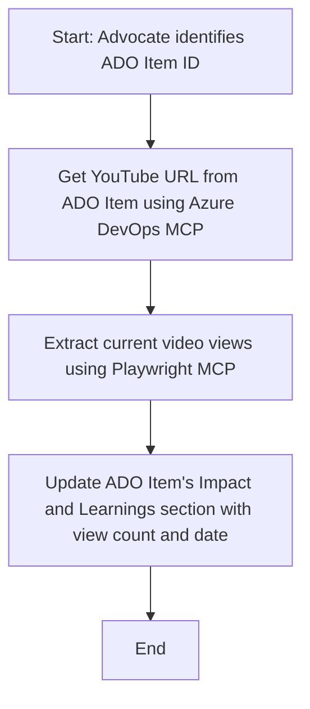

<!--
CO_OP_TRANSLATOR_METADATA:
{
  "original_hash": "14a2dfbea55ef735660a06bd6bdfe5f3",
  "translation_date": "2025-06-13T21:36:19+00:00",
  "source_file": "09-CaseStudy/UpdateADOItemsFromYT.md",
  "language_code": "fi"
}
-->
# Case Study: Azure DevOps -kohteiden päivittäminen YouTube-datalla MCP:n avulla

> **Disclaimer:** On olemassa valmiita verkkotyökaluja ja raportteja, jotka voivat automatisoida Azure DevOps -kohteiden päivittämisen esimerkiksi YouTube-alustan datalla. Seuraava esimerkki on tarkoitettu ainoastaan havainnollistamaan, miten MCP-työkaluja voidaan hyödyntää automaatio- ja integraatiotehtävissä.

## Yleiskatsaus

Tässä case-esimerkissä näytetään, miten Model Context Protocol (MCP) ja siihen liittyvät työkalut voivat automatisoida Azure DevOps (ADO) -työkohteiden päivittämisen verkosta haetulla tiedolla, kuten YouTube-videoiden tiedoilla. Kuvattu tilanne on vain yksi esimerkki laajemmista mahdollisuuksista, joita nämä työkalut tarjoavat, ja niitä voidaan soveltaa monenlaisiin vastaaviin automaatioratkaisuihin.

Tässä esimerkissä Advocate seuraa verkkotilaisuuksia ADO-kohteiden avulla, joista jokainen sisältää YouTube-videon URL-osoitteen. MCP-työkaluja hyödyntämällä Advocate voi päivittää ADO-kohteet automaattisesti uusimmilla videon katselumäärillä. Tätä lähestymistapaa voi yleistää muihin käyttötapauksiin, joissa verkosta haettu tieto integroidaan ADO:hon tai muihin järjestelmiin.

## Tilanne

Advocate vastaa verkkotilaisuuksien ja yhteisön osallistumisen vaikutusten seurannasta. Jokainen tilaisuus kirjataan ADO-työkohteeksi 'DevRel'-projektiin, ja työkohteessa on kenttä YouTube-videon URL:lle. Tarkkojen raporttien laatimiseksi Advocate päivittää ADO-kohteen nykyisellä katselumäärällä ja tiedon hakupäivästä.

## Käytetyt työkalut

- [Azure DevOps MCP](https://github.com/microsoft/azure-devops-mcp): Mahdollistaa ohjelmallisen pääsyn ja päivitykset ADO-työkohteisiin MCP:n kautta.
- [Playwright MCP](https://github.com/microsoft/playwright-mcp): Automatisoi selaimen toimintoja ja poimii reaaliaikaista dataa verkkosivuilta, kuten YouTube-videoiden tilastoja.

## Vaiheittainen työnkulku

1. **Tunnista ADO-kohde**: Aloita ADO-työkohteen ID:llä (esim. 1234) 'DevRel'-projektissa.
2. **Hae YouTube-URL**: Käytä Azure DevOps MCP -työkalua saadaksesi videon URL-osoitteen työkohteesta.
3. **Poimi katselumäärä**: Käytä Playwright MCP:tä siirtyäksesi YouTube-URL:iin ja saadaksesi ajantasaisen katselumäärän.
4. **Päivitä ADO-kohde**: Kirjoita uusin katselumäärä ja hakupäivämäärä 'Impact and Learnings' -osioon ADO-työkohteessa Azure DevOps MCP -työkalulla.

## Esimerkkiprompti

```bash
- Work with the ADO Item ID: 1234
- The project is '2025-Awesome'
- Get the YouTube URL for the ADO item
- Use Playwright to get the current views from the YouTube video
- Update the ADO item with the current video views and the updated date of the information
```

## Mermaid-kaavio



## Tekninen toteutus

- **MCP-orchestrointi**: Työnkulun hallinnasta vastaa MCP-palvelin, joka koordinoi Azure DevOps MCP:n ja Playwright MCP:n käyttöä.
- **Automaatio**: Prosessi voidaan käynnistää manuaalisesti tai ajastaa säännöllisesti pitämään ADO-kohteet ajan tasalla.
- **Laajennettavuus**: Sama toimintamalli voidaan laajentaa päivittämään ADO-kohteita muilla verkkometrisillä (esim. tykkäykset, kommentit) tai muilta alustoilta saatavilla tiedoilla.

## Tulokset ja vaikutus

- **Tehokkuus**: Vähentää Advocaten manuaalista työtä videoiden tilastojen hakemisessa ja päivittämisessä.
- **Tarkkuus**: Varmistaa, että ADO-kohteissa on aina ajantasaisin verkosta saatava tieto.
- **Toistettavuus**: Tarjoaa uudelleenkäytettävän työnkulun vastaaviin tilanteisiin, joissa tarvitaan tietojen integrointia eri lähteistä.

## Viitteet

- [Azure DevOps MCP](https://github.com/microsoft/azure-devops-mcp)
- [Playwright MCP](https://github.com/microsoft/playwright-mcp)
- [Model Context Protocol (MCP)](https://modelcontextprotocol.io/)

**Vastuuvapauslauseke**:  
Tämä asiakirja on käännetty käyttämällä tekoälypohjaista käännöspalvelua [Co-op Translator](https://github.com/Azure/co-op-translator). Vaikka pyrimme tarkkuuteen, huomioithan, että automaattikäännöksissä saattaa esiintyä virheitä tai epätarkkuuksia. Alkuperäistä asiakirjaa sen alkuperäiskielellä tulee pitää virallisena lähteenä. Tärkeissä asioissa suositellaan ammattimaista ihmiskäännöstä. Emme ole vastuussa tämän käännöksen käytöstä aiheutuvista väärinymmärryksistä tai tulkinnoista.