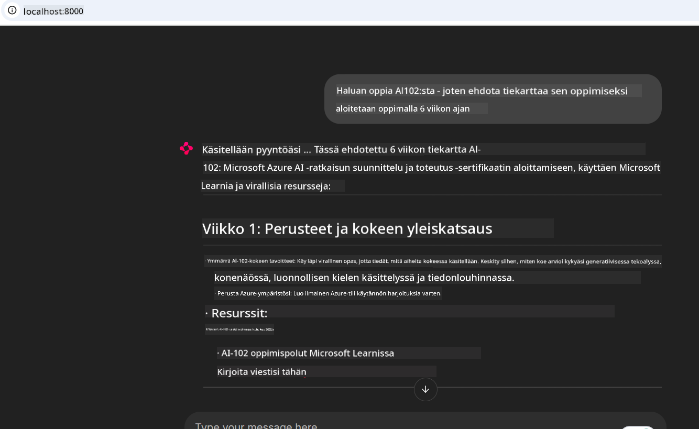

<!--
CO_OP_TRANSLATOR_METADATA:
{
  "original_hash": "4319d291c9d124ecafea52b3d04bfa0e",
  "translation_date": "2025-07-14T06:25:56+00:00",
  "source_file": "09-CaseStudy/docs-mcp/README.md",
  "language_code": "fi"
}
-->
# Case Study: Yhteyden muodostaminen Microsoft Learn Docs MCP -palvelimeen asiakkaalta

Oletko koskaan huomannut hyppiväsi dokumentaatiosivustojen, Stack Overflow’n ja loputtomien hakukonevälilehtien välillä samalla, kun yrität ratkaista koodiongelmaa? Ehkä sinulla on toinen näyttö pelkästään dokumentaatiota varten, tai vaihdat jatkuvasti alt-tabilla IDE:n ja selaimen välillä. Eikö olisi parempi, jos dokumentaatio olisi suoraan työnkulussasi – integroituna sovelluksiisi, IDE:esi tai jopa omiin räätälöityihin työkaluihisi? Tässä case studyssä tutustumme siihen, miten voit tehdä juuri näin yhdistämällä suoraan Microsoft Learn Docs MCP -palvelimeen omasta asiakasohjelmastasi.

## Yleiskatsaus

Nykyaikainen kehitys ei ole pelkkää koodin kirjoittamista – kyse on oikean tiedon löytämisestä oikeaan aikaan. Dokumentaatiota on kaikkialla, mutta harvoin siellä missä sitä eniten tarvitset: työkalujesi ja työnkulkujensi sisällä. Integroimalla dokumentaation hakemisen suoraan sovelluksiisi voit säästää aikaa, vähentää kontekstin vaihtamista ja lisätä tuottavuutta. Tässä osiossa näytämme, miten yhdistät asiakkaan Microsoft Learn Docs MCP -palvelimeen, jotta pääset käsiksi reaaliaikaiseen, kontekstia ymmärtävään dokumentaatioon ilman, että sinun tarvitsee poistua sovelluksestasi.

Käymme läpi yhteyden muodostamisen, pyynnön lähettämisen ja suoratoistovastausten tehokkaan käsittelyn. Tämä lähestymistapa virtaviivaistaa työnkulkua ja avaa ovet älykkäämpien, hyödyllisempien kehittäjätyökalujen rakentamiseen.

## Oppimistavoitteet

Miksi teemme tämän? Koska parhaat kehittäjäkokemukset poistavat kitkaa. Kuvittele maailma, jossa koodieditorisi, chatbotisi tai web-sovelluksesi voi vastata dokumentaatiokysymyksiisi välittömästi käyttäen Microsoft Learnin uusinta sisältöä. Tämän luvun lopussa osaat:

- Ymmärtää MCP-palvelin-asiakasviestinnän perusteet dokumentaatiota varten
- Toteuttaa konsoli- tai web-sovelluksen, joka yhdistää Microsoft Learn Docs MCP -palvelimeen
- Käyttää suoratoistavia HTTP-asiakkaita reaaliaikaiseen dokumentaation hakemiseen
- Kirjata ja tulkita dokumentaatiovastauksia sovelluksessasi

Näet, miten nämä taidot auttavat sinua rakentamaan työkaluja, jotka eivät ole pelkästään reaktiivisia, vaan aidosti interaktiivisia ja kontekstia ymmärtäviä.

## Tilanne 1 – Reaaliaikainen dokumentaation haku MCP:llä

Tässä tilanteessa näytämme, miten yhdistät asiakkaan Microsoft Learn Docs MCP -palvelimeen, jotta pääset käsiksi reaaliaikaiseen, kontekstia ymmärtävään dokumentaatioon ilman, että poistut sovelluksestasi.

Laitetaan tämä käytäntöön. Tehtäväsi on kirjoittaa sovellus, joka yhdistää Microsoft Learn Docs MCP -palvelimeen, kutsuu `microsoft_docs_search` -työkalua ja kirjaa suoratoistovastauksen konsoliin.

### Miksi tämä lähestymistapa?
Koska se on perusta kehittyneempien integraatioiden rakentamiselle – halusitpa sitten voimaannuttaa chatbotin, IDE-laajennuksen tai web-hallintapaneelin.

Löydät tämän tilanteen koodin ja ohjeet [`solution`](./solution/README.md) -kansiosta tässä case studyssä. Vaiheet opastavat sinua yhteyden muodostamisessa:
- Käytä virallista MCP SDK:ta ja suoratoistettavaa HTTP-asiakasta yhteyden muodostamiseen
- Kutsu `microsoft_docs_search` -työkalua hakukyselyllä dokumentaation hakemiseksi
- Toteuta asianmukainen lokitus ja virheenkäsittely
- Luo interaktiivinen konsolikäyttöliittymä, joka sallii käyttäjien syöttää useita hakukyselyitä

Tämä tilanne havainnollistaa, miten:
- Yhdistetään Docs MCP -palvelimeen
- Lähetetään kysely
- Jäsennetään ja tulostetaan tulokset

Näin ratkaisun suorittaminen voisi näyttää:

```
Prompt> What is Azure Key Vault?
Answer> Azure Key Vault is a cloud service for securely storing and accessing secrets. ...
```

Alla on minimaalinen esimerkkiratkaisu. Koko koodi ja yksityiskohdat löytyvät solution-kansiosta.

<details>
<summary>Python</summary>

```python
import asyncio
from mcp.client.streamable_http import streamablehttp_client
from mcp import ClientSession

async def main():
    async with streamablehttp_client("https://learn.microsoft.com/api/mcp") as (read_stream, write_stream, _):
        async with ClientSession(read_stream, write_stream) as session:
            await session.initialize()
            result = await session.call_tool("microsoft_docs_search", {"query": "Azure Functions best practices"})
            print(result.content)

if __name__ == "__main__":
    asyncio.run(main())
```

- Täydellinen toteutus ja lokitus löytyvät tiedostosta [`scenario1.py`](../../../../09-CaseStudy/docs-mcp/solution/python/scenario1.py).
- Asennus- ja käyttöohjeet löytyvät samasta kansiosta olevasta [`README.md`](./solution/python/README.md) -tiedostosta.
</details>

## Tilanne 2 – Interaktiivinen opintosuunnitelman generaattori web-sovelluksena MCP:llä

Tässä tilanteessa opit, miten Docs MCP integroidaan web-kehitysprojektiin. Tavoitteena on mahdollistaa käyttäjien hakea Microsoft Learn -dokumentaatiota suoraan web-käyttöliittymästä, jolloin dokumentaatio on välittömästi saatavilla sovelluksessasi tai sivustollasi.

Näet, miten:
- Perustetaan web-sovellus
- Yhdistetään Docs MCP -palvelimeen
- Käsitellään käyttäjän syötteet ja näytetään tulokset

Näin ratkaisun suorittaminen voisi näyttää:

```
User> I want to learn about AI102 - so suggest the roadmap to get it started from learn for 6 weeks

Assistant> Here’s a detailed 6-week roadmap to start your preparation for the AI-102: Designing and Implementing a Microsoft Azure AI Solution certification, using official Microsoft resources and focusing on exam skills areas:

---
## Week 1: Introduction & Fundamentals
- **Understand the Exam**: Review the [AI-102 exam skills outline](https://learn.microsoft.com/en-us/credentials/certifications/exams/ai-102/).
- **Set up Azure**: Sign up for a free Azure account if you don't have one.
- **Learning Path**: [Introduction to Azure AI services](https://learn.microsoft.com/en-us/training/modules/intro-to-azure-ai/)
- **Focus**: Get familiar with Azure portal, AI capabilities, and necessary tools.

....more weeks of the roadmap...

Let me know if you want module-specific recommendations or need more customized weekly tasks!
```

Alla on minimaalinen esimerkkiratkaisu. Koko koodi ja yksityiskohdat löytyvät solution-kansiosta.



<details>
<summary>Python (Chainlit)</summary>

Chainlit on kehys keskustelevaan tekoälyweb-sovellusten rakentamiseen. Sen avulla on helppo luoda interaktiivisia chatbotteja ja assistentteja, jotka voivat kutsua MCP-työkaluja ja näyttää tulokset reaaliajassa. Se sopii erinomaisesti nopeaan prototypointiin ja käyttäjäystävällisiin käyttöliittymiin.

```python
import chainlit as cl
import requests

MCP_URL = "https://learn.microsoft.com/api/mcp"

@cl.on_message
def handle_message(message):
    query = {"question": message}
    response = requests.post(MCP_URL, json=query)
    if response.ok:
        result = response.json()
        cl.Message(content=result.get("answer", "No answer found.")).send()
    else:
        cl.Message(content="Error: " + response.text).send()
```

- Täydellinen toteutus löytyy tiedostosta [`scenario2.py`](../../../../09-CaseStudy/docs-mcp/solution/python/scenario2.py).
- Asennus- ja käynnistysohjeet löytyvät [`README.md`](./solution/python/README.md) -tiedostosta.
</details>

## Tilanne 3: Dokumentaatio suoraan editorissa MCP-palvelimella VS Codessa

Jos haluat saada Microsoft Learn Docs -dokumentaation suoraan VS Codeen (ilman selaimen välilehtien vaihtamista), voit käyttää MCP-palvelinta editorissasi. Tämä mahdollistaa:
- Dokumentaation hakemisen ja lukemisen VS Codessa ilman, että poistut koodausympäristöstäsi.
- Dokumentaation viittaamisen ja linkkien lisäämisen suoraan README- tai kurssitiedostoihin.
- GitHub Copilotin ja MCP:n yhdistämisen saumattomaan, tekoälyavusteiseen dokumentaatiotyönkulkuun.

**Näet, miten:**
- Lisää kelvollinen `.vscode/mcp.json` -tiedosto työtilasi juureen (katso alla oleva esimerkki).
- Avaa MCP-paneeli tai käytä komentopalettia VS Codessa dokumentaation hakemiseen ja lisäämiseen.
- Viittaa dokumentaatioon suoraan markdown-tiedostoissasi työskennellessäsi.
- Yhdistä tämä työnkulku GitHub Copilotin kanssa entistä suuremman tuottavuuden saavuttamiseksi.

Tässä esimerkki MCP-palvelimen asetuksesta VS Codessa:

```json
{
  "servers": {
    "LearnDocsMCP": {
      "url": "https://learn.microsoft.com/api/mcp"
    }
  }
}
```

</details>

> Yksityiskohtaisen läpikäynnin kuvakaappauksineen ja vaiheittaiset ohjeet löydät tiedostosta [`README.md`](./solution/scenario3/README.md).


Tämä lähestymistapa sopii erinomaisesti kaikille, jotka rakentavat teknisiä kursseja, kirjoittavat dokumentaatiota tai kehittävät koodia, jossa tarvitaan usein viittauksia.

## Keskeiset opit

Dokumentaation integroiminen suoraan työkaluihisi ei ole pelkkä mukavuus – se on tuottavuuden mullistaja. Yhdistämällä Microsoft Learn Docs MCP -palvelimeen asiakkaaltasi voit:

- Poistaa kontekstin vaihtamisen koodin ja dokumentaation välillä
- Hakea ajantasaisia, kontekstia ymmärtäviä dokumentteja reaaliajassa
- Rakentaa älykkäämpiä, interaktiivisempia kehittäjätyökaluja

Nämä taidot auttavat sinua luomaan ratkaisuja, jotka eivät ole vain tehokkaita, vaan myös miellyttäviä käyttää.

## Lisäresurssit

Syventääksesi ymmärrystäsi tutustu näihin virallisiin resursseihin:

- [Microsoft Learn Docs MCP Server (GitHub)](https://github.com/MicrosoftDocs/mcp)
- [Get started with Azure MCP Server (mcp-python)](https://learn.microsoft.com/en-us/azure/developer/azure-mcp-server/get-started#create-the-python-app)
- [What is the Azure MCP Server?](https://learn.microsoft.com/en-us/azure/developer/azure-mcp-server/)
- [Model Context Protocol (MCP) Introduction](https://modelcontextprotocol.io/introduction)
- [Add plugins from a MCP Server (Python)](https://learn.microsoft.com/en-us/semantic-kernel/concepts/plugins/adding-mcp-plugins)

**Vastuuvapauslauseke**:  
Tämä asiakirja on käännetty käyttämällä tekoälypohjaista käännöspalvelua [Co-op Translator](https://github.com/Azure/co-op-translator). Vaikka pyrimme tarkkuuteen, huomioithan, että automaattikäännöksissä saattaa esiintyä virheitä tai epätarkkuuksia. Alkuperäistä asiakirjaa sen alkuperäiskielellä tulee pitää virallisena lähteenä. Tärkeissä asioissa suositellaan ammattimaista ihmiskäännöstä. Emme ole vastuussa tämän käännöksen käytöstä aiheutuvista väärinymmärryksistä tai tulkinnoista.